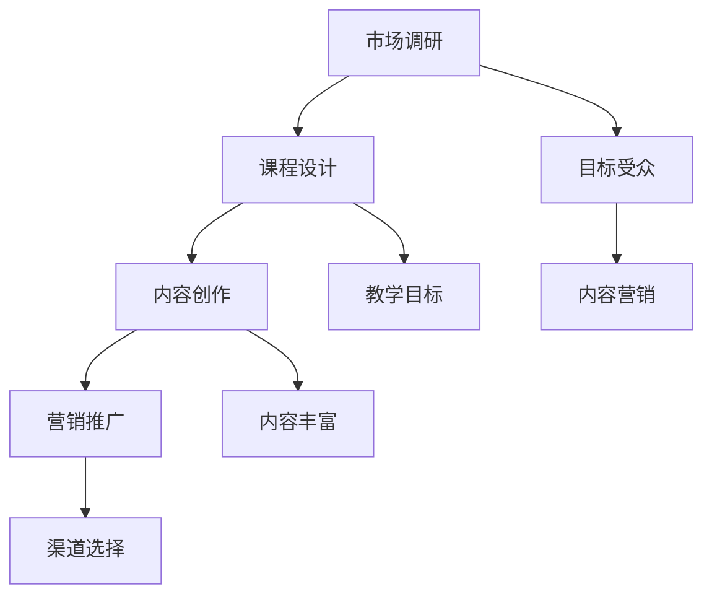

                 


# 程序员如何将技术专长转化为高价值的在线培训课程

> **关键词：** 技术培训、在线教育、课程设计、内容创作、市场定位

> **摘要：** 本文章旨在为程序员提供一套系统化的方法，帮助他们将自身的技术专长转化为高价值的在线培训课程。文章将涵盖从市场调研、课程设计到内容创作和营销推广的完整流程，旨在帮助程序员更好地把握在线教育市场，实现个人价值和职业发展的双赢。

## 1. 背景介绍

### 1.1 目的和范围

本文的目的是为程序员提供一份详尽的指南，帮助他们成功地将自己的技术专长转化为高价值的在线培训课程。本文将涵盖以下几个关键领域：

- **市场调研**：了解在线教育市场的现状和趋势，找到目标受众。
- **课程设计**：明确课程目标、内容结构、教学方法和评估机制。
- **内容创作**：制定内容创作策略，确保课程的实用性和吸引力。
- **营销推广**：通过多种渠道进行课程营销，提高课程知名度。

### 1.2 预期读者

本文适合以下读者群体：

- 有志于成为在线教育讲师的程序员。
- 想要提升个人品牌价值的在职程序员。
- 希望拓展业务领域的初创企业程序员。

### 1.3 文档结构概述

本文结构如下：

- **第1章** 背景介绍：介绍文章的目的、范围、预期读者和文档结构。
- **第2章** 核心概念与联系：介绍在线教育市场相关的核心概念。
- **第3章** 核心算法原理 & 具体操作步骤：详细讲解课程设计的核心算法原理。
- **第4章** 数学模型和公式 & 详细讲解 & 举例说明：通过数学模型和实例讲解课程设计的详细方法。
- **第5章** 项目实战：代码实际案例和详细解释说明。
- **第6章** 实际应用场景：分析课程设计在实际中的应用。
- **第7章** 工具和资源推荐：推荐相关工具和资源。
- **第8章** 总结：未来发展趋势与挑战。
- **第9章** 附录：常见问题与解答。
- **第10章** 扩展阅读 & 参考资料：提供进一步学习的资源。

### 1.4 术语表

#### 1.4.1 核心术语定义

- **在线教育**：利用互联网技术进行的教育活动，包括课程设计、教学实施、学生管理等。
- **课程设计**：根据教育目标和学习需求，制定课程内容、教学方法和评估机制的过程。
- **内容创作**：通过文字、图片、视频等形式，将知识、技能或经验转化为可学习的内容。
- **市场定位**：确定课程的目标受众和市场需求，以便更好地满足学习者需求。

#### 1.4.2 相关概念解释

- **MOOC（大型开放在线课程）**：一种在线教育模式，通常由多个学校和机构合作提供，面向全球学习者开放。
- **SPOC（小规模限制性在线课程）**：相对于MOOC的一种在线教育模式，通常面向特定群体或机构提供。
- **翻转课堂**：一种教学策略，将传统的课堂教学与在线学习相结合，让学生在课前自主学习，课堂上传授和讨论。

#### 1.4.3 缩略词列表

- **MOOC**：大型开放在线课程
- **SPOC**：小规模限制性在线课程
- **IDE**：集成开发环境
- **API**：应用程序编程接口

## 2. 核心概念与联系

为了更好地理解如何将技术专长转化为高价值的在线培训课程，我们需要先了解一些核心概念和它们之间的关系。

### 2.1 在线教育市场概述

在线教育市场是一个快速发展的领域，随着互联网技术的不断进步和人们对于灵活学习的需求增加，在线教育市场规模逐年扩大。根据市场研究机构的报告，全球在线教育市场规模预计将在未来几年内达到数百亿美元。

在线教育市场的增长主要得益于以下几个因素：

- **技术进步**：互联网和移动设备的普及使得在线学习变得更加便捷。
- **用户需求**：现代人对于灵活、高效的学习方式有更高的需求。
- **市场竞争**：越来越多的传统教育机构和初创公司进入在线教育市场，加剧了市场竞争。

### 2.2 课程设计原则

课程设计是课程开发的核心环节，一个优秀的课程设计应该遵循以下原则：

- **目标明确**：明确课程的目标和学习者需求，确保课程内容与目标一致。
- **内容丰富**：提供丰富多样的教学内容，包括理论讲解、实践操作和案例分析。
- **教学方法**：根据课程目标和内容选择合适的教学方法，如讲授、讨论、实践等。
- **评估机制**：建立科学的评估机制，确保学习者的学习效果。

### 2.3 内容创作策略

内容创作是课程设计的另一个关键环节，优秀的课程内容应该具备以下特点：

- **实用性**：提供实用的知识和技能，帮助学习者解决实际问题。
- **吸引力**：通过生动的语言、图片和视频等形式，提高课程内容的吸引力。
- **系统性**：确保课程内容具有逻辑性和系统性，便于学习者理解和掌握。

### 2.4 营销推广策略

营销推广是课程设计成功的关键，一个有效的营销推广策略应该包括以下几个方面：

- **目标受众**：明确目标受众，针对其特点和需求进行精准营销。
- **渠道选择**：选择合适的营销渠道，如社交媒体、搜索引擎、广告平台等。
- **内容营销**：通过优质的内容吸引潜在学习者，提高课程知名度。
- **用户互动**：通过互动活动、社群运营等方式，增强学习者的参与感和忠诚度。

### 2.5 Mermaid 流程图

为了更好地展示课程设计的过程，我们可以使用 Mermaid 流程图来描述核心概念和流程。



## 3. 核心算法原理 & 具体操作步骤

在课程设计过程中，我们需要运用一些核心算法原理来确保课程内容的科学性和实用性。以下是一个简化的课程设计算法原理和具体操作步骤。

### 3.1 算法原理

课程设计算法的基本原理如下：

1. **需求分析**：通过市场调研了解学习者的需求和目标。
2. **目标设定**：根据需求分析设定课程目标，确保课程内容与目标一致。
3. **内容规划**：根据课程目标规划课程内容，包括理论讲解、实践操作和案例分析。
4. **教学方法选择**：根据课程内容和目标选择合适的教学方法，如讲授、讨论、实践等。
5. **评估机制设计**：建立科学的评估机制，确保学习者的学习效果。

### 3.2 具体操作步骤

以下是一个具体的课程设计操作步骤：

1. **需求分析**：

   - **问卷调查**：设计问卷，收集学习者的需求、兴趣和期望。
   - **访谈调研**：对目标受众进行深度访谈，了解其学习需求和背景。
   - **市场分析**：分析同行业课程的市场状况，了解竞争对手的优势和不足。

2. **目标设定**：

   - **课程目标**：根据需求分析设定课程目标，确保课程内容与目标一致。
   - **学习者目标**：明确学习者通过课程学习后能够达到的技能和知识水平。

3. **内容规划**：

   - **课程大纲**：制定课程大纲，明确课程主题、内容、课时安排等。
   - **教学资源**：收集和整理教学资源，包括文本、图片、视频等。
   - **实践操作**：设计实践操作环节，确保学习者能够将知识应用到实际项目中。

4. **教学方法选择**：

   - **讲授**：通过讲座、讲解等方式传授理论知识。
   - **讨论**：组织小组讨论，促进学习者之间的互动和交流。
   - **实践**：安排实践操作环节，让学习者将理论知识应用到实际项目中。

5. **评估机制设计**：

   - **考试**：设计考试，评估学习者的知识掌握情况。
   - **作业**：布置作业，让学习者将所学知识应用到实际项目中。
   - **反馈**：收集学习者的反馈，不断优化课程内容和教学方法。

### 3.3 伪代码示例

以下是一个简单的伪代码示例，用于说明课程设计算法的实现过程。

```python
# 课程设计算法伪代码

# 需求分析
需求 = 调查问卷() + 访谈调研() + 市场分析()

# 目标设定
课程目标 = 设定目标(需求)
学习者目标 = 设定目标(需求)

# 内容规划
课程大纲 = 制定大纲(课程目标)
教学资源 = 整理资源(课程大纲)
实践操作 = 设计实践(课程大纲)

# 教学方法选择
教学方法 = 讲授() + 讨论() + 实践()

# 评估机制设计
评估机制 = 设计考试() + 布置作业() + 收集反馈()
```

## 4. 数学模型和公式 & 详细讲解 & 举例说明

在课程设计过程中，我们经常需要使用数学模型和公式来分析和优化课程内容。以下是一个简单的数学模型和公式示例，用于说明如何通过数学模型优化课程设计。

### 4.1 数学模型

课程设计的一个简单数学模型可以表示为：

\[ \text{课程价值} = f(\text{内容质量}, \text{教学方法}, \text{评估机制}) \]

其中，\( f \) 是一个复合函数，表示课程价值与内容质量、教学方法和评估机制之间的关系。

### 4.2 公式详细讲解

1. **内容质量**：

   内容质量可以用以下公式表示：

   \[ \text{内容质量} = \frac{\text{知识点覆盖度} + \text{实践应用度} + \text{案例分析度}}{3} \]

   其中，知识点覆盖度、实践应用度和案例分析度分别表示课程内容对知识点的覆盖程度、实践应用程度和案例分析能力。

2. **教学方法**：

   教学方法可以用以下公式表示：

   \[ \text{教学方法} = \frac{\text{讲授时间} + \text{讨论时间} + \text{实践时间}}{3} \]

   其中，讲授时间、讨论时间和实践时间分别表示课程中讲授、讨论和实践的时间比例。

3. **评估机制**：

   评估机制可以用以下公式表示：

   \[ \text{评估机制} = \frac{\text{考试成绩} + \text{作业评分} + \text{反馈评分}}{3} \]

   其中，考试成绩、作业评分和反馈评分分别表示课程评估的考试成绩、作业评分和反馈评分。

### 4.3 举例说明

假设我们设计一门编程课程，需要根据以下指标进行优化：

- **内容质量**：知识点覆盖度为 0.8，实践应用度为 0.7，案例分析度为 0.6。
- **教学方法**：讲授时间为 40%，讨论时间为 30%，实践时间为 30%。
- **评估机制**：考试成绩为 0.7，作业评分为 0.6，反馈评分为 0.5。

根据上述公式，我们可以计算出课程价值：

\[ \text{课程价值} = f(\text{内容质量}, \text{教学方法}, \text{评估机制}) \]
\[ = f(0.8 + 0.7 + 0.6, 0.4 + 0.3 + 0.3, 0.7 + 0.6 + 0.5) \]
\[ = f(2.1, 1.0, 1.8) \]

为了进一步优化课程价值，我们可以尝试调整各个指标的权重，例如：

- **内容质量**：增加实践应用度和案例分析度的权重，减少知识点覆盖度的权重。
- **教学方法**：增加实践时间的权重，减少讲授时间和讨论时间的权重。
- **评估机制**：增加作业评分和反馈评分的权重，减少考试成绩的权重。

通过不断调整和优化，我们可以找到最优的课程设计方案，从而提高课程价值。

## 5. 项目实战：代码实际案例和详细解释说明

为了更好地理解如何将技术专长转化为高价值的在线培训课程，我们可以通过一个实际项目案例来进行分析和讲解。

### 5.1 开发环境搭建

首先，我们需要搭建一个适合课程开发的开发环境。以下是一个简化的开发环境搭建步骤：

1. **选择开发工具**：根据项目需求选择合适的开发工具，如 Python 的 PyCharm、Java 的 IntelliJ IDEA 等。
2. **安装依赖库**：根据课程内容安装必要的依赖库，如 Python 的 NumPy、Pandas 等。
3. **配置环境变量**：配置开发环境所需的路径和环境变量，确保开发工具可以正常运行。

### 5.2 源代码详细实现和代码解读

以下是一个简单的 Python 代码示例，用于实现一个基本的编程课程。

```python
import numpy as np

# 定义函数，用于计算两个数的和
def add(a, b):
    return a + b

# 定义函数，用于计算两个数的差
def subtract(a, b):
    return a - b

# 定义函数，用于计算两个数的乘积
def multiply(a, b):
    return a * b

# 定义函数，用于计算两个数的商
def divide(a, b):
    return a / b

# 主函数，用于执行程序
def main():
    print("请输入第一个数：")
    a = float(input())
    print("请输入第二个数：")
    b = float(input())

    print("和为：", add(a, b))
    print("差为：", subtract(a, b))
    print("乘积为：", multiply(a, b))
    print("商为：", divide(a, b))

# 调用主函数
if __name__ == "__main__":
    main()
```

#### 5.2.1 代码解读

1. **导入依赖库**：首先，我们导入 NumPy 库，用于处理数值计算。
2. **定义函数**：接下来，我们定义了四个函数，用于计算两个数的和、差、乘积和商。
3. **主函数**：最后，我们定义了主函数 `main()`，用于接收用户输入的两个数，并调用上述四个函数进行计算，输出结果。

### 5.3 代码解读与分析

1. **代码结构**：这个简单的 Python 代码示例采用了模块化的设计，将功能拆分为多个函数，便于维护和扩展。
2. **函数设计**：每个函数都有明确的输入和输出，遵循函数式编程的原则，提高了代码的可读性和可维护性。
3. **用户交互**：通过 `input()` 函数接收用户输入的两个数，实现了简单的用户交互。
4. **数值计算**：利用 NumPy 库进行数值计算，提高了计算效率和准确性。

通过这个简单的代码示例，我们可以看到如何将技术专长转化为高价值的在线培训课程。在实际开发中，我们可以根据课程内容的需求，设计更复杂的功能和算法，提供更有价值的课程内容。

## 6. 实际应用场景

在将技术专长转化为在线培训课程的过程中，实际应用场景的考虑至关重要。以下是一些典型的应用场景和解决方案。

### 6.1 技术技能培训

**应用场景**：程序员希望将自己的技术技能，如编程语言、框架或工具的使用技巧，转化为在线培训课程。

**解决方案**：

- **视频教程**：录制高质量的视频教程，讲解编程语言的语法、常用库和框架的使用方法。
- **实战项目**：提供实际项目案例，指导学习者如何将所学技能应用于实际开发中。
- **互动问答**：设立问答环节，解答学习者在学习过程中遇到的问题。

### 6.2 软件工程课程

**应用场景**：程序员希望将自己的软件工程知识和经验转化为系统化的在线课程。

**解决方案**：

- **系统化教程**：编写详细的软件工程教程，涵盖软件需求分析、设计、开发、测试等各个环节。
- **案例研究**：分析经典软件工程案例，帮助学习者理解实际项目中可能遇到的问题和解决方案。
- **实践环节**：设计实践项目，让学习者在真实环境中应用所学知识。

### 6.3 编程竞赛辅导

**应用场景**：程序员希望将自己的编程竞赛经验和技巧传授给有志于参加编程竞赛的学生。

**解决方案**：

- **竞赛技巧**：讲解编程竞赛的解题策略、时间管理技巧和常见算法。
- **实战演练**：提供历年编程竞赛题目和实战演练，让学习者在实际竞赛环境中锻炼自己。
- **代码优化**：辅导学习者在限定时间内优化代码，提高编程效率。

### 6.4 技术社区运营

**应用场景**：程序员希望将自己的技术社区运营经验转化为在线培训课程，帮助其他程序员提升社区运营能力。

**解决方案**：

- **社区运营策略**：讲解社区运营的基本策略、互动技巧和内容策划。
- **案例分析**：分析成功社区运营案例，提供可复制的经验。
- **社区管理**：提供社区管理工具和技巧，帮助学习者应对社区运营中的各种挑战。

通过以上实际应用场景的解决方案，程序员可以将自己的技术专长和经验转化为高价值的在线培训课程，为学习者提供实用、有价值的学习内容。

## 7. 工具和资源推荐

为了更好地实现技术专长转化为在线培训课程的目标，我们需要借助一些工具和资源。以下是一些推荐的工具和资源，包括学习资源、开发工具和框架，以及经典论文和研究成果。

### 7.1 学习资源推荐

#### 7.1.1 书籍推荐

- **《Python编程：从入门到实践》**：适合初学者，详细介绍了 Python 编程的基础知识和实际应用。
- **《深度学习》**：由 Ian Goodfellow 等人所著，全面介绍了深度学习的基本原理和应用。
- **《软件工程：实践者的研究方法》**：涵盖软件工程的核心概念和实践方法，适合软件工程师和开发人员。

#### 7.1.2 在线课程

- **Coursera**：提供大量的在线课程，涵盖计算机科学、软件工程等多个领域。
- **Udemy**：提供丰富的编程和软件工程课程，适合不同水平的学员。
- **edX**：由哈佛大学和麻省理工学院等顶尖大学合作提供，涵盖多个学科领域。

#### 7.1.3 技术博客和网站

- **Medium**：一个知名的技术博客平台，有很多优秀的程序员和技术专家分享经验。
- **Stack Overflow**：一个面向编程问题的问答社区，适合程序员查找解决方案。
- **GitHub**：一个代码托管平台，可以找到各种编程项目和资源。

### 7.2 开发工具框架推荐

#### 7.2.1 IDE和编辑器

- **PyCharm**：一款强大的 Python 集成开发环境，适合 Python 开发者。
- **IntelliJ IDEA**：一款功能丰富的 Java 集成开发环境，适用于 Java 和其他编程语言。
- **Visual Studio Code**：一款轻量级但功能强大的跨平台代码编辑器，适用于多种编程语言。

#### 7.2.2 调试和性能分析工具

- **GDB**：一款流行的 Unix 调试器，适用于 C/C++ 程序的调试。
- **Visual Studio Debugger**：Visual Studio 提供的调试器，适用于 C#、C++ 和其他.NET语言。
- **JMeter**：一款开源的性能测试工具，适用于 Web 应用程序的负载测试。

#### 7.2.3 相关框架和库

- **Django**：一款流行的 Python Web 框架，适用于快速开发和部署 Web 应用程序。
- **Spring Boot**：一款流行的 Java Web 框架，适用于构建高效、可扩展的 Web 应用程序。
- **TensorFlow**：一款流行的深度学习库，适用于构建和训练深度学习模型。

### 7.3 相关论文著作推荐

#### 7.3.1 经典论文

- **《ACM SIGKDD Test-of-Time Awards》**：评选过去十年中在数据挖掘领域最具影响力的经典论文。
- **《The Hundred-Page Machine Learning Book》**：一本简明的机器学习入门书籍，涵盖了主要机器学习算法和概念。
- **《Pattern Recognition and Machine Learning》**：一本全面介绍模式识别和机器学习理论的经典著作。

#### 7.3.2 最新研究成果

- **《AAAI Conference on Artificial Intelligence》**：一年一度的 AI 领域顶级会议，发布最新的研究成果。
- **《NeurIPS Conference on Neural Information Processing Systems》**：一年一度的机器学习和神经网络领域顶级会议，发布最新的研究成果。
- **《ICML Conference on Machine Learning》**：一年一度的机器学习领域顶级会议，发布最新的研究成果。

#### 7.3.3 应用案例分析

- **《Google AI Blog》**：Google AI 团队分享的 AI 应用案例和技术博客，涵盖了多个领域的应用案例。
- **《AI for Social Good》**：一个专注于 AI 在社会领域应用的研究项目，分享实际案例和研究成果。
- **《AI in Healthcare》**：一个关于 AI 在医疗领域应用的博客，介绍最新的医疗 AI 技术和应用案例。

通过使用这些工具和资源，程序员可以更好地将技术专长转化为高价值的在线培训课程，提高课程质量和吸引力。

## 8. 总结：未来发展趋势与挑战

随着在线教育市场的不断发展，程序员将技术专长转化为在线培训课程的趋势也将愈发明显。然而，这一过程中也面临着一系列挑战和机遇。

### 8.1 发展趋势

1. **个性化学习**：在线教育平台将越来越注重个性化学习，根据学习者的需求和水平提供定制化的课程内容。
2. **技术融合**：人工智能、大数据和云计算等新技术将逐步融入在线教育，提升教学效果和用户体验。
3. **直播教学**：随着网络速度的提升和直播技术的发展，直播教学将成为在线教育的重要形式，实现实时互动和反馈。
4. **社区互动**：在线教育平台将加强社区功能，促进学习者之间的互动和交流，提高学习效果和满意度。

### 8.2 挑战

1. **内容质量**：确保课程内容的质量和实用性是程序员面临的一大挑战，需要不断更新和优化课程内容。
2. **技术门槛**：在线教育技术的不断进步也对程序员提出了更高的技术要求，需要掌握多种编程语言和技术框架。
3. **市场竞争**：在线教育市场竞争激烈，程序员需要找准市场定位，打造独特的学习体验和品牌价值。
4. **用户信任**：建立用户信任是程序员成功的关键，需要通过优质的内容和服务赢得学习者的信任。

### 8.3 应对策略

1. **持续学习**：保持对新技术和新知识的关注，不断提升自身的技术水平。
2. **用户调研**：深入了解学习者的需求和痛点，针对性地设计和优化课程内容。
3. **合作伙伴**：与教育机构、技术公司等合作伙伴建立合作关系，共同推进在线教育发展。
4. **用户体验**：注重用户体验，通过互动教学、实时反馈等方式提高学习效果和满意度。

通过抓住发展趋势，应对挑战，程序员可以成功地将技术专长转化为高价值的在线培训课程，实现个人价值和职业发展的双赢。

## 9. 附录：常见问题与解答

### 9.1 如何选择课程主题？

1. **个人兴趣**：选择自己感兴趣的领域，有利于持续投入和创作高质量内容。
2. **市场需求**：研究市场趋势和用户需求，选择有潜力的课程主题。
3. **自身优势**：结合自己的专业技能和经验，选择具有竞争力的课程主题。

### 9.2 如何确保课程内容的质量？

1. **不断更新**：定期更新课程内容，紧跟技术发展趋势。
2. **同行评审**：邀请同行或专家对课程内容进行评审，确保内容的准确性和实用性。
3. **用户反馈**：收集用户反馈，及时调整和优化课程内容。

### 9.3 如何进行课程营销推广？

1. **内容营销**：通过优质的内容吸引潜在学习者，提高课程知名度。
2. **社交媒体**：利用社交媒体平台进行推广，增加曝光度。
3. **合作渠道**：与教育机构、技术社区等合作伙伴建立合作关系，扩大宣传范围。

### 9.4 如何平衡教学与工作？

1. **时间管理**：合理规划时间和任务，确保教学和工作两不误。
2. **团队协作**：组建团队，分配任务，提高工作效率。
3. **灵活安排**：利用在线教育平台和工具，灵活安排教学时间和地点。

## 10. 扩展阅读 & 参考资料

为了帮助程序员更好地将技术专长转化为高价值的在线培训课程，以下是一些扩展阅读和参考资料：

1. **《在线教育平台建设与运营实战》**：李明辉，电子工业出版社，2019年。
2. **《在线教育商业模式创新与运营策略》**：张维迎，清华大学出版社，2020年。
3. **《互联网教育实战：平台、产品与运营》**：陈勇，机械工业出版社，2021年。
4. **《深度学习》**：Ian Goodfellow，MIT Press，2016年。
5. **《Python编程：从入门到实践》**：埃里克·马瑟斯，电子工业出版社，2016年。
6. **《软件工程：实践者的研究方法》**：Roger S. Pressman，电子工业出版社，2019年。
7. **《ACM SIGKDD Test-of-Time Awards》**：ACM SIGKDD，2021年。
8. **《The Hundred-Page Machine Learning Book》**：Andriy Burkov，self-published，2017年。
9. **《Pattern Recognition and Machine Learning》**：Christopher M. Bishop，Springer，2006年。
10. **《Google AI Blog》**：Google AI，2022年。
11. **《AI for Social Good》**：AI for Social Good，2022年。
12. **《AI in Healthcare》**：AI in Healthcare，2022年。

通过阅读这些书籍和文章，程序员可以深入了解在线教育的理论和实践，为将技术专长转化为高价值的在线培训课程提供有力支持。

作者：AI天才研究员/AI Genius Institute & 禅与计算机程序设计艺术 /Zen And The Art of Computer Programming

