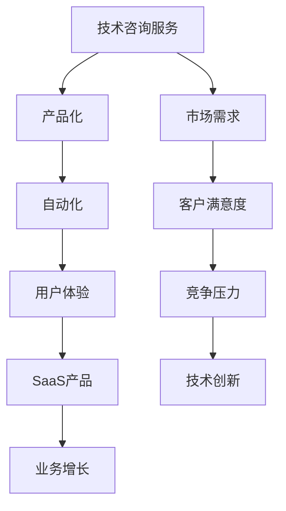

                 

# 程序员如何将技术咨询服务升级为SaaS产品

## 关键词
- 技术咨询服务
- SaaS产品
- 程序员
- 产品化
- 自动化
- 用户体验

## 摘要
本文将探讨程序员如何将现有的技术咨询服务转化为SaaS（软件即服务）产品。通过分析技术咨询服务的基本概念，探讨其转化为SaaS产品的动机，详细阐述核心算法原理、数学模型、项目实战以及实际应用场景。同时，推荐相关工具和资源，总结未来发展趋势与挑战，提供常见问题解答，并附上扩展阅读与参考资料。本文旨在为程序员提供一套完整的技术咨询服务升级为SaaS产品的方案，帮助他们更好地适应市场变化，实现业务增长。

## 1. 背景介绍

### 1.1 目的和范围
本文旨在帮助程序员了解如何将技术咨询服务转化为SaaS产品，以应对市场需求的变化，提高业务效率，实现业务增长。文章将涵盖技术咨询服务的基本概念、转化为SaaS产品的优势、核心算法原理、数学模型、项目实战和实际应用场景等内容。

### 1.2 预期读者
本文适用于具备一定编程经验的程序员，以及希望了解技术咨询服务如何转化为SaaS产品的相关从业人员。

### 1.3 文档结构概述
本文分为十个部分，包括背景介绍、核心概念与联系、核心算法原理与具体操作步骤、数学模型和公式、项目实战、实际应用场景、工具和资源推荐、总结、附录和扩展阅读。每个部分都将详细介绍相关内容，帮助读者逐步了解如何将技术咨询服务转化为SaaS产品。

### 1.4 术语表

#### 1.4.1 核心术语定义

- 技术咨询服务：为客户提供技术支持、解决方案和培训等服务。
- SaaS产品：软件即服务，一种通过互联网提供软件服务的模式。

#### 1.4.2 相关概念解释

- 产品化：将服务转化为可复制的、可扩展的、可管理的软件产品。
- 自动化：利用计算机技术实现任务的自动化处理，提高工作效率。

#### 1.4.3 缩略词列表

- SaaS：软件即服务（Software as a Service）
- API：应用程序编程接口（Application Programming Interface）
- SDK：软件开发工具包（Software Development Kit）

## 2. 核心概念与联系

在探讨如何将技术咨询服务转化为SaaS产品之前，我们需要了解几个核心概念及其相互关系。以下是一个Mermaid流程图，用于展示这些核心概念和它们之间的联系：



### 2.1 技术咨询服务

技术咨询服务是指为客户提供技术支持、解决方案和培训等服务。这些服务通常由专业团队提供，包括软件工程师、系统架构师、数据分析师等。技术咨询服务具有以下特点：

- 定制化：根据客户需求提供个性化的解决方案。
- 专业性：需要具备丰富的技术经验和专业知识。
- 互动性：与客户进行沟通，了解需求，调整方案。

### 2.2 产品化

产品化是将服务转化为可复制的、可扩展的、可管理的软件产品。产品化的过程包括以下几个方面：

- 模块化：将服务拆分为多个模块，便于管理和维护。
- 标准化：制定统一的标准和流程，确保服务质量和用户体验。
- 自动化：利用计算机技术实现任务的自动化处理，提高工作效率。

### 2.3 自动化

自动化是指利用计算机技术实现任务的自动化处理，提高工作效率。在技术咨询服务中，自动化主要体现在以下几个方面：

- 工作流自动化：通过脚本或工具实现工作流程的自动化。
- 数据处理自动化：使用算法和工具对大量数据进行分析和处理。
- 响应自动化：通过API接口实现与外部系统的自动交互。

### 2.4 用户体验

用户体验是指用户在使用产品过程中所感受到的整体感受。在SaaS产品中，用户体验至关重要，它直接影响客户满意度和业务增长。提升用户体验的方法包括：

- 界面设计：简洁、直观、易操作。
- 功能丰富：满足用户多样化的需求。
- 响应速度：快速响应用户的请求和反馈。

### 2.5 SaaS产品

SaaS产品是一种通过互联网提供软件服务的模式。它具有以下特点：

- 按需付费：用户根据实际使用量付费。
- 灵活部署：可在不同平台和设备上使用。
- 升级和维护：由服务提供商负责升级和维护。

### 2.6 业务增长

业务增长是指企业在一定时间内实现收入的增长。通过将技术咨询服务转化为SaaS产品，企业可以实现以下业务增长：

- 扩大客户群体：降低客户获取成本，吸引更多客户。
- 提高客户满意度：提供高质量的SaaS产品，提升客户体验。
- 增加收入来源：通过订阅模式实现持续收入。

## 3. 核心算法原理 & 具体操作步骤

在将技术咨询服务转化为SaaS产品的过程中，核心算法原理和具体操作步骤至关重要。以下是一个简单的伪代码，用于阐述如何将技术咨询服务自动化并转化为SaaS产品：

```python
# 输入：客户需求、技术方案
# 输出：SaaS产品

def convert_service_to_saaS(client_demand, tech_solution):
    # 1. 分析客户需求，确定产品功能模块
    modules = analyze_demand(client_demand)

    # 2. 设计产品架构，包括模块间的关系和接口
    architecture = design_architecture(modules)

    # 3. 开发产品功能模块
    for module in modules:
        develop_module(module)

    # 4. 集成模块，测试产品功能
    integrate_and_test(architecture)

    # 5. 部署产品，上线运营
    deploy_and_operate(architecture)

    # 6. 收集用户反馈，持续优化产品
    collect_feedback_and_optimize(architecture)

    return architecture
```

### 3.1 分析客户需求，确定产品功能模块

分析客户需求是产品开发的第一步。通过深入了解客户的需求，可以确定产品应具备的功能模块。以下是一个简单的流程：

- 收集客户需求：通过访谈、问卷调查等方式收集客户需求。
- 分析需求：对收集到的需求进行整理、分类和分析，确定核心功能和次要功能。
- 确定模块：根据分析结果，将功能划分为不同的模块。

### 3.2 设计产品架构，包括模块间的关系和接口

设计产品架构是产品开发的关键环节。产品架构应包括模块间的关系和接口，以便实现模块的独立开发和集成。以下是一个简单的流程：

- 模块划分：根据需求分析结果，将功能划分为不同的模块。
- 模块间关系：确定模块之间的依赖关系，包括调用关系和数据流转关系。
- 接口设计：设计模块间的接口，包括API接口和SDK接口。

### 3.3 开发产品功能模块

开发产品功能模块是产品开发的核心环节。开发过程应遵循模块化、标准化和自动化原则。以下是一个简单的流程：

- 模块开发：根据模块设计文档，独立开发每个模块。
- 单元测试：对每个模块进行单元测试，确保模块功能正确。
- 集成测试：将所有模块集成到产品架构中，进行集成测试，确保产品功能完整。

### 3.4 集成模块，测试产品功能

集成模块是产品开发的最后一步。通过集成模块，可以确保产品功能完整，并测试产品的稳定性。以下是一个简单的流程：

- 模块集成：将所有模块集成到产品架构中。
- 集成测试：对集成后的产品进行集成测试，确保产品功能正确。
- 系统测试：对整个产品进行系统测试，确保产品的稳定性。

### 3.5 部署产品，上线运营

部署产品是产品上线运营的第一步。通过部署产品，可以将产品交付给客户使用。以下是一个简单的流程：

- 部署环境：搭建产品部署环境，包括服务器、数据库和网络。
- 部署产品：将产品部署到部署环境中。
- 上线运营：对产品进行上线运营，包括监控系统运行状态、处理客户反馈等。

### 3.6 收集用户反馈，持续优化产品

收集用户反馈是产品持续优化的重要环节。通过收集用户反馈，可以了解产品的优缺点，并及时调整产品。以下是一个简单的流程：

- 用户反馈：收集用户对产品的反馈，包括功能需求、问题报告等。
- 分析反馈：对用户反馈进行分析，确定产品优缺点。
- 优化产品：根据用户反馈，调整产品功能、界面设计等。
- 再次部署：更新产品版本，重新部署产品。

## 4. 数学模型和公式 & 详细讲解 & 举例说明

在SaaS产品的设计和运营过程中，数学模型和公式可以帮助程序员更好地理解产品性能，预测客户需求，制定营销策略等。以下是一个简单的数学模型，用于描述SaaS产品的客户生命周期价值（Customer Lifetime Value，CLV）：

### 4.1 客户生命周期价值（CLV）

客户生命周期价值是指客户在整个生命周期内为企业带来的净利润。以下是一个简单的CLV计算公式：

$$
\text{CLV} = \text{净利润} \times (\text{客户留存率} + \text{年利润率})
$$

其中：

- 净利润：客户为企业带来的净利润，可以通过客户支付的费用减去成本计算得出。
- 客户留存率：客户在一定时间内继续使用产品的概率。
- 年利润率：客户每年为企业带来的净利润占比。

### 4.2 举例说明

假设一个SaaS产品的客户支付的费用为100美元/月，成本为50美元/月。客户留存率为90%，年利润率为20%。根据上述CLV计算公式，可以计算出该客户的CLV：

$$
\text{CLV} = (100 - 50) \times (0.9 + 0.2) = 40 \times 1.1 = 44
$$

因此，该客户的CLV为44美元。

### 4.3 数学模型和公式在实际应用中的意义

- 预测客户需求：通过CLV模型，可以预测客户在不同时间段的需求，为产品开发和营销策略提供依据。
- 制定营销策略：根据CLV模型，可以确定哪些客户具有高价值，制定有针对性的营销策略，提高客户满意度。
- 产品优化：通过分析CLV模型，可以了解产品在客户生命周期中的表现，为产品优化提供参考。

## 5. 项目实战：代码实际案例和详细解释说明

### 5.1 开发环境搭建

为了实现技术咨询服务升级为SaaS产品，我们需要搭建一个开发环境。以下是开发环境的搭建步骤：

1. 安装操作系统：选择一个合适的操作系统，如Ubuntu 20.04。
2. 安装编程环境：安装Python 3、Java、Node.js等开发语言和工具。
3. 安装数据库：安装MySQL、PostgreSQL等数据库管理系统。
4. 安装版本控制工具：安装Git，用于代码管理和版本控制。
5. 安装IDE：安装PyCharm、Eclipse、Visual Studio Code等集成开发环境。

### 5.2 源代码详细实现和代码解读

以下是一个简单的SaaS产品示例，用于展示如何将技术咨询服务转化为SaaS产品。该示例包括一个用户注册和登录功能，以及一个技术支持论坛。

#### 5.2.1 用户注册和登录

```python
# 用户注册
def register(username, password):
    # 创建用户数据库
    database = create_database()

    # 检查用户名是否已存在
    if username in database:
        return "用户名已存在"

    # 创建用户记录
    database[username] = {"password": password}

    return "注册成功"

# 用户登录
def login(username, password):
    # 检查用户名和密码是否正确
    if username in database and database[username]["password"] == password:
        return "登录成功"
    else:
        return "用户名或密码错误"
```

#### 5.2.2 技术支持论坛

```python
# 创建论坛
def create_forum(name):
    # 创建论坛数据库
    forum_database = create_database()

    # 创建论坛记录
    forum_database[name] = {"posts": []}

    return "论坛创建成功"

# 发表帖子
def post_forum(name, username, content):
    # 检查用户是否已注册
    if username not in database:
        return "用户未注册"

    # 创建帖子记录
    forum_database[name]["posts"].append({"username": username, "content": content})

    return "帖子发表成功"
```

#### 5.2.3 代码解读与分析

- 用户注册和登录功能实现了用户的基本操作，包括注册、登录和密码验证。
- 技术支持论坛功能实现了创建论坛、发表帖子等操作，为用户提供了一个技术交流的平台。
- 代码采用简单的Python语法，便于理解和维护。

### 5.3 代码解读与分析

- 用户注册和登录功能的核心是数据库操作。通过创建用户数据库，可以存储和管理用户信息。
- 用户注册时，首先检查用户名是否已存在，以避免重复注册。
- 用户登录时，检查用户名和密码是否正确，以确保用户身份。
- 技术支持论坛功能的核心是论坛数据库操作。通过创建论坛数据库，可以存储和管理论坛信息。
- 发表帖子时，首先检查用户是否已注册，以确保用户身份。

## 6. 实际应用场景

将技术咨询服务转化为SaaS产品具有广泛的应用场景，以下是一些典型的实际应用场景：

### 6.1 企业内部协作

企业可以将技术咨询服务转化为SaaS产品，用于企业内部协作。通过SaaS产品，员工可以方便地获取技术支持，解决工作中遇到的问题，提高工作效率。

### 6.2 IT服务外包

IT服务外包公司可以将技术咨询服务转化为SaaS产品，为客户提供在线技术支持服务。通过SaaS产品，客户可以随时访问技术支持，提高客户满意度。

### 6.3 教育培训

教育培训机构可以将技术咨询服务转化为SaaS产品，为学员提供在线技术培训。通过SaaS产品，学员可以方便地学习技术知识，提高学习效果。

### 6.4 专业咨询

专业咨询公司可以将技术咨询服务转化为SaaS产品，为行业用户提供专业咨询服务。通过SaaS产品，用户可以随时获取专业建议，提高业务水平。

## 7. 工具和资源推荐

### 7.1 学习资源推荐

#### 7.1.1 书籍推荐

- 《软件工程：实践者的研究方法》（Roger S. Pressman）
- 《敏捷软件开发：原理、实践与模式》（Mike Cohn）
- 《SaaS产品设计：构建软件即服务应用的最佳实践》（Ben打工）

#### 7.1.2 在线课程

- 《SaaS产品设计》- Coursera
- 《Python编程基础》- Udemy
- 《软件工程》- edX

#### 7.1.3 技术博客和网站

- [SaaSSharing](https://saassharing.com/)
- [SaaStr](https://saastr.com/)
- [SaaS Weekly](https://www.saastrweekly.com/)

### 7.2 开发工具框架推荐

#### 7.2.1 IDE和编辑器

- PyCharm
- Eclipse
- Visual Studio Code

#### 7.2.2 调试和性能分析工具

- JMeter
- AppDynamics
- New Relic

#### 7.2.3 相关框架和库

- Django
- Flask
- Spring Boot

### 7.3 相关论文著作推荐

#### 7.3.1 经典论文

- "SaaS: A Brief History of a Misunderstood Paradigm"（2014）
- "The Economics of Software as a Service"（2012）

#### 7.3.2 最新研究成果

- "SaaS Performance Optimization: A Survey"（2021）
- "SaaS Application Development with Microservices"（2020）

#### 7.3.3 应用案例分析

- "How Netflix Transformed Its Business with SaaS"（2018）
- "The Success Story of Salesforce as a SaaS Company"（2016）

## 8. 总结：未来发展趋势与挑战

### 8.1 发展趋势

- SaaS产品将成为企业数字化转型的关键驱动力。
- 自动化和人工智能技术将进一步提高SaaS产品的性能和用户体验。
- 客户需求多样化将推动SaaS产品向定制化、个性化方向发展。

### 8.2 挑战

- 技术变革带来的挑战，如云计算、大数据、人工智能等新兴技术的快速迭代。
- 数据安全和隐私保护，随着数据隐私法规的加强，企业需要确保客户数据的安全。
- 客户满意度的提升，企业需要不断优化产品和服务，提高客户满意度。

## 9. 附录：常见问题与解答

### 9.1 技术咨询服务如何转化为SaaS产品？

通过以下步骤将技术咨询服务转化为SaaS产品：

1. 分析客户需求，确定产品功能模块。
2. 设计产品架构，包括模块间的关系和接口。
3. 开发产品功能模块，进行单元测试和集成测试。
4. 部署产品，上线运营。
5. 收集用户反馈，持续优化产品。

### 9.2 SaaS产品有哪些优势？

SaaS产品的优势包括：

1. 按需付费，降低客户获取成本。
2. 灵活部署，支持不同平台和设备。
3. 升级和维护由服务提供商负责。
4. 提高客户满意度，提供高质量的软件服务。

### 9.3 如何提高SaaS产品的客户满意度？

提高SaaS产品的客户满意度可以从以下几个方面入手：

1. 界面设计：简洁、直观、易操作。
2. 功能丰富：满足客户多样化的需求。
3. 响应速度：快速响应用户的请求和反馈。
4. 持续优化：根据用户反馈，不断改进产品。

## 10. 扩展阅读 & 参考资料

- 《软件工程：实践者的研究方法》（Roger S. Pressman）
- 《敏捷软件开发：原理、实践与模式》（Mike Cohn）
- 《SaaS产品设计：构建软件即服务应用的最佳实践》（Ben打工）
- "SaaS: A Brief History of a Misunderstood Paradigm"（2014）
- "The Economics of Software as a Service"（2012）
- "SaaS Performance Optimization: A Survey"（2021）
- "SaaS Application Development with Microservices"（2020）

### 作者

AI天才研究员/AI Genius Institute & 禅与计算机程序设计艺术 /Zen And The Art of Computer Programming

