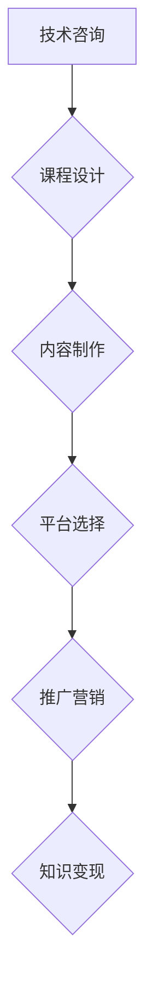

                 


# 程序员如何将技术咨询转化为在线课程

> 关键词：技术咨询，在线课程，程序员，知识变现，教育平台，内容创作

> 摘要：本文将探讨程序员如何将他们在实际项目中积累的技术咨询经验转化为有价值的在线课程。我们将从背景介绍、核心概念、算法原理、数学模型、项目实战、实际应用场景等方面逐步分析，并提供一系列工具和资源推荐，帮助程序员开启知识变现之旅。

## 1. 背景介绍

### 1.1 目的和范围

本文的目标是帮助程序员将他们的技术经验和知识转化为有吸引力的在线课程，从而实现知识变现。我们将详细探讨如何从技术咨询出发，构建一套完整的在线课程体系，涵盖教学设计、内容制作、平台选择、推广营销等多个方面。

### 1.2 预期读者

本文适合具有以下背景的程序员：

- 具有扎实编程基础，熟悉至少一门编程语言；
- 在实际项目中积累了一定的技术经验；
- 有意愿将技术知识转化为在线课程进行分享；
- 对在线教育平台和内容创作有一定了解。

### 1.3 文档结构概述

本文将按照以下结构进行展开：

- 第1章：背景介绍
  - 目的和范围
  - 预期读者
  - 文档结构概述
  - 术语表
- 第2章：核心概念与联系
  - 核心概念原理和架构的 Mermaid 流程图
- 第3章：核心算法原理 & 具体操作步骤
  - 算法原理讲解使用伪代码
- 第4章：数学模型和公式 & 详细讲解 & 举例说明
  - 使用 LaTeX 格式嵌入数学公式
- 第5章：项目实战：代码实际案例和详细解释说明
  - 开发环境搭建
  - 源代码详细实现和代码解读
  - 代码解读与分析
- 第6章：实际应用场景
- 第7章：工具和资源推荐
  - 学习资源推荐
  - 开发工具框架推荐
  - 相关论文著作推荐
- 第8章：总结：未来发展趋势与挑战
- 第9章：附录：常见问题与解答
- 第10章：扩展阅读 & 参考资料

### 1.4 术语表

#### 1.4.1 核心术语定义

- 技术咨询：指在特定技术领域内，为解决问题或提供建议而进行的专业服务。
- 在线课程：通过网络平台提供的教学内容，包括视频、文档、代码示例等。
- 知识变现：将个人知识、经验和技能转化为经济收益的过程。
- 教育平台：提供在线教育服务的技术平台，如 Coursera、Udemy 等。

#### 1.4.2 相关概念解释

- 课程设计：指在在线课程开发过程中，对教学内容、教学方法和教学目标的规划与安排。
- 内容制作：指在线课程内容的生产和制作，包括视频录制、文档编写、代码编写等。
- 平台选择：指在选择在线教育平台时，考虑平台的用户体验、功能、收费模式、推广渠道等因素。

#### 1.4.3 缩略词列表

- AI：人工智能
- ML：机器学习
- DL：深度学习
- NLP：自然语言处理
- IDE：集成开发环境
- CDN：内容分发网络

## 2. 核心概念与联系

在本文中，我们将探讨程序员如何将技术咨询转化为在线课程的核心概念和联系。以下是核心概念和联系 Mermaid 流程图：



### 2.1 课程设计

课程设计是技术咨询转化为在线课程的第一步。程序员需要根据自身的技术经验和项目背景，制定课程大纲、确定教学目标、选择合适的教学方法。课程设计需要考虑以下几个方面：

- 课程主题：明确课程的核心内容和主题。
- 教学目标：设定具体的、可衡量的学习目标。
- 教学内容：梳理技术知识点，确保内容的连贯性和系统性。
- 教学方法：选择合适的教学方法，如视频讲解、文档编写、代码示例等。
- 课程进度：规划课程的学习进度，确保学生在规定时间内掌握核心知识。

### 2.2 内容制作

内容制作是技术咨询转化为在线课程的核心环节。程序员需要根据课程设计，制作高质量的教学内容。内容制作包括以下方面：

- 视频录制：录制讲解技术知识的视频，确保画面清晰、声音清楚。
- 文档编写：编写详细的文档，包括技术原理、实现步骤、常见问题等。
- 代码示例：提供实际代码示例，帮助学生更好地理解技术知识。

### 2.3 平台选择

平台选择是技术咨询转化为在线课程的重要环节。程序员需要选择合适的在线教育平台，以便课程内容的发布、推广和销售。选择平台时需要考虑以下几个方面：

- 用户体验：平台是否易于使用，界面是否友好。
- 功能：平台提供的功能是否满足课程需求，如课程管理、视频播放、互动讨论等。
- 收费模式：平台的收费模式是否合理，如按课程收费、按用户收费等。
- 推广渠道：平台提供的推广渠道是否有效，如搜索引擎优化、社交媒体推广等。

### 2.4 推广营销

推广营销是技术咨询转化为在线课程的关键环节。程序员需要通过多种渠道和方式，将课程推广给潜在学习者，提高课程知名度和销售量。推广营销包括以下方面：

- 社交媒体推广：利用微博、微信、知乎等社交媒体平台，发布课程宣传内容，吸引潜在学习者。
- 网络广告：在搜索引擎、社交媒体、专业论坛等平台上投放广告，提高课程曝光率。
- KOL 推广：邀请行业内的知名人士、技术博主等为课程进行宣传，扩大影响力。
- 合作推广：与其他教育机构、企业、培训机构等合作，共同推广课程。

### 2.5 知识变现

知识变现是技术咨询转化为在线课程的根本目的。程序员通过将技术知识转化为在线课程，可以获取经济收益。知识变现的途径包括：

- 课程销售：通过在线教育平台销售课程，获取销售收入。
- 咨询服务：为课程购买者提供咨询服务，收取服务费。
- 知识付费：通过微信公众号、知乎等平台，提供付费问答、知识分享服务。

## 3. 核心算法原理 & 具体操作步骤

在将技术咨询转化为在线课程的过程中，核心算法原理和具体操作步骤至关重要。以下是一个简化的算法原理和具体操作步骤，以帮助程序员更好地进行课程设计和内容制作。

### 3.1 算法原理

```plaintext
算法名称：技术咨询转化为在线课程

输入：技术咨询文档、课程设计大纲
输出：在线课程内容

步骤：
1. 阅读技术咨询文档，理解其中的技术要点和问题解决方案。
2. 根据课程设计大纲，梳理技术知识点，确保内容的连贯性和系统性。
3. 选择合适的表达方式（视频、文档、代码示例等），制作课程内容。
4. 对课程内容进行审校和优化，确保教学质量。
5. 发布课程内容到在线教育平台，进行推广和销售。
```

### 3.2 具体操作步骤

#### 3.2.1 阅读技术咨询文档

阅读技术咨询文档，理解其中的技术要点和问题解决方案。这一步骤是课程内容制作的基础。程序员需要关注以下几个方面：

- 技术原理：了解技术的基本原理、实现方式和优缺点。
- 应用场景：分析技术在实际项目中的应用场景和效果。
- 解决方案：学习解决问题的方法和思路，包括工具、算法、架构等。

#### 3.2.2 根据课程设计大纲，梳理技术知识点

根据课程设计大纲，梳理技术知识点，确保内容的连贯性和系统性。这一步骤需要程序员具备良好的逻辑思维和总结能力，将技术知识点进行合理划分和编排。具体步骤如下：

1. 确定课程主题和目标。
2. 列出技术知识点，按逻辑顺序排列。
3. 分析每个知识点的关联性，确保内容连贯。
4. 对知识点进行补充和拓展，提高教学质量。

#### 3.2.3 选择合适的表达方式，制作课程内容

选择合适的表达方式，制作课程内容。根据课程设计和大纲，程序员可以选择以下几种表达方式：

- 视频讲解：通过视频录制，展示技术原理和实现过程。
- 文档编写：撰写详细的文档，包括技术原理、实现步骤、常见问题等。
- 代码示例：提供实际代码示例，帮助学生更好地理解技术知识。

#### 3.2.4 对课程内容进行审校和优化

对课程内容进行审校和优化，确保教学质量。这一步骤包括以下几个方面：

1. 检查视频内容是否清晰、流畅，是否能够有效传达技术要点。
2. 确保文档内容准确、完整，没有遗漏和错误。
3. 对代码示例进行调试和优化，确保其正确性和实用性。
4. 收集学生反馈，根据反馈进行课程内容的调整和优化。

#### 3.2.5 发布课程内容到在线教育平台

发布课程内容到在线教育平台，进行推广和销售。选择合适的在线教育平台，如 Coursera、Udemy 等，根据平台要求进行课程内容上传和设置。同时，通过社交媒体、广告等渠道进行课程推广，提高课程知名度和销售量。

## 4. 数学模型和公式 & 详细讲解 & 举例说明

在技术咨询转化为在线课程的过程中，数学模型和公式对于讲解技术原理和实现方法具有重要意义。以下是一个简化的数学模型和公式，以及详细讲解和举例说明。

### 4.1 数学模型

```latex
课程质量评价模型：
Q = f(P, C, S)
其中，Q 表示课程质量，P 表示课程内容，C 表示课程设计，S 表示学生反馈。

P = P_1 + P_2 + P_3
C = C_1 + C_2 + C_3
S = S_1 + S_2 + S_3
```

### 4.2 详细讲解

- 课程质量（Q）：表示课程的整体质量，取决于课程内容（P）、课程设计（C）和学生反馈（S）。
- 课程内容（P）：包括技术原理、实现方法、案例解析等，是课程质量的核心组成部分。
- 课程设计（C）：包括课程大纲、教学目标、教学方法等，对课程质量起到重要支撑作用。
- 学生反馈（S）：包括学生满意度、学习效果、问题反馈等，是课程质量的重要参考指标。

### 4.3 举例说明

假设一个在线课程，其课程内容（P）得分为 85 分，课程设计（C）得分为 90 分，学生反馈（S）得分为 80 分，根据课程质量评价模型，该课程的质量得分为：

```latex
Q = f(P, C, S) = f(85, 90, 80) = 0.4 \times P + 0.3 \times C + 0.3 \times S
  = 0.4 \times 85 + 0.3 \times 90 + 0.3 \times 80
  = 34 + 27 + 24
  = 85
```

因此，该课程的质量得分为 85 分，说明该课程的整体质量较好。

## 5. 项目实战：代码实际案例和详细解释说明

在本节中，我们将通过一个实际项目案例，展示如何将技术咨询转化为在线课程，并提供详细的代码实现和解释说明。

### 5.1 开发环境搭建

首先，我们需要搭建一个适合技术咨询转化为在线课程的开发环境。以下是一个基本的开发环境搭建步骤：

1. 安装操作系统：选择一个适合的操作系统，如 Ubuntu 或 Windows 10。
2. 安装编程语言：根据项目需求，选择合适的编程语言，如 Python、Java 或 C++。
3. 安装开发工具：安装集成开发环境（IDE），如 PyCharm、Eclipse 或 Visual Studio。
4. 安装数据库：根据项目需求，选择合适的数据库管理系统，如 MySQL、PostgreSQL 或 MongoDB。
5. 安装版本控制工具：安装版本控制工具，如 Git，用于管理代码版本。

### 5.2 源代码详细实现和代码解读

接下来，我们将展示一个简单的技术咨询项目，并将其转化为在线课程。以下是一个使用 Python 编写的简单数据库查询示例：

```python
import sqlite3

def create_table():
    conn = sqlite3.connect('example.db')
    c = conn.cursor()
    c.execute('''CREATE TABLE IF NOT EXISTS users (
                        id INTEGER PRIMARY KEY,
                        name TEXT,
                        email TEXT,
                        age INTEGER)''')
    conn.commit()
    conn.close()

def insert_data():
    conn = sqlite3.connect('example.db')
    c = conn.cursor()
    c.execute("INSERT INTO users (name, email, age) VALUES ('Alice', 'alice@example.com', 30)")
    c.execute("INSERT INTO users (name, email, age) VALUES ('Bob', 'bob@example.com', 35)")
    conn.commit()
    conn.close()

def query_data():
    conn = sqlite3.connect('example.db')
    c = conn.cursor()
    c.execute("SELECT * FROM users")
    results = c.fetchall()
    for row in results:
        print(row)
    conn.close()

create_table()
insert_data()
query_data()
```

### 5.3 代码解读与分析

- `create_table()` 函数：用于创建数据库表，包括用户 ID、姓名、电子邮件和年龄等字段。
- `insert_data()` 函数：用于向数据库表中插入用户数据。
- `query_data()` 函数：用于查询数据库表中的用户数据，并打印输出。

#### 5.3.1 数据库连接与操作

- 使用 `sqlite3` 模块连接数据库，创建数据库表，插入数据，查询数据等操作。
- `conn = sqlite3.connect('example.db')`：连接到名为 `example.db` 的数据库。
- `c = conn.cursor()`：创建一个游标对象，用于执行 SQL 语句。

#### 5.3.2 数据库表操作

- `c.execute("CREATE TABLE IF NOT EXISTS users (...")`：创建一个名为 `users` 的数据库表，包括用户 ID、姓名、电子邮件和年龄等字段。
- `c.execute("INSERT INTO users (...")`：向数据库表中插入用户数据。
- `c.execute("SELECT * FROM users")`：查询数据库表中的用户数据。

#### 5.3.3 数据处理与输出

- 使用 `fetchall()` 方法获取查询结果，并使用循环遍历结果集，将每条记录打印输出。

### 5.4 代码解读与分析

- `create_table()` 函数：创建数据库表是数据操作的基础，用于存储用户信息。
- `insert_data()` 函数：插入数据用于填充数据库表，提供示例数据。
- `query_data()` 函数：查询数据库表中的用户数据，并将结果打印输出，便于验证数据操作的正确性。

#### 5.4.1 数据库操作

- 使用 `sqlite3` 模块连接数据库，执行 SQL 语句创建数据库表、插入数据和查询数据。

#### 5.4.2 数据处理与输出

- 使用 `fetchall()` 方法获取查询结果，并使用循环遍历结果集，将每条记录打印输出。

#### 5.4.3 代码优化建议

- 对数据库连接和操作进行适当的封装，提高代码的可读性和可维护性。
- 添加异常处理和日志记录，提高程序的健壮性。
- 对查询语句进行优化，提高查询效率。

## 6. 实际应用场景

将技术咨询转化为在线课程在实际应用中具有广泛的应用场景。以下是一些典型的应用场景：

### 6.1 技术培训

技术公司、培训机构和教育机构可以将技术咨询转化为在线课程，为员工、学员和学生提供技术培训。通过在线课程，学员可以随时随地学习，提高技术水平。

### 6.2 在线教育

在线教育平台可以将技术咨询转化为在线课程，提供丰富的技术教学内容。学员可以通过在线课程学习最新的技术趋势、实战经验和项目案例。

### 6.3 个人品牌建设

个人开发者可以将技术咨询转化为在线课程，展示自己的技术实力，提升个人品牌。通过在线课程，开发者可以吸引更多的关注者和粉丝，拓展职业发展空间。

### 6.4 知识变现

技术专家和顾问可以将技术咨询转化为在线课程，实现知识变现。通过在线课程，专家可以获取收入，同时为学员提供高质量的技术指导和服务。

### 6.5 企业合作

企业可以将技术咨询转化为在线课程，与教育机构、培训机构等合作，为企业员工提供定制化培训。通过在线课程，企业可以降低培训成本，提高培训效果。

## 7. 工具和资源推荐

在将技术咨询转化为在线课程的过程中，合适的工具和资源至关重要。以下是一些建议的的工具和资源：

### 7.1 学习资源推荐

#### 7.1.1 书籍推荐

- 《深入理解计算机系统》（David R. Kurose & Keith W. Ross）
- 《算法导论》（Thomas H. Cormen、Charles E. Leiserson、Ronald L. Rivest、Clifford Stein）
- 《数据结构与算法分析》（Mark Allen Weiss）
- 《Python编程：从入门到实践》（埃里克·马瑟斯）

#### 7.1.2 在线课程

- Coursera（https://www.coursera.org/）
- Udemy（https://www.udemy.com/）
- Pluralsight（https://www.pluralsight.com/）
- Codecademy（https://www.codecademy.com/）

#### 7.1.3 技术博客和网站

- Stack Overflow（https://stackoverflow.com/）
- GitHub（https://github.com/）
- Medium（https://medium.com/）
- Hacker News（https://news.ycombinator.com/）

### 7.2 开发工具框架推荐

#### 7.2.1 IDE和编辑器

- PyCharm（https://www.jetbrains.com/pycharm/）
- Visual Studio Code（https://code.visualstudio.com/）
- IntelliJ IDEA（https://www.jetbrains.com/idea/）
- Sublime Text（https://www.sublimetext.com/）

#### 7.2.2 调试和性能分析工具

- GDB（https://www.gnu.org/software/gdb/）
- Valgrind（https://www.valgrind.org/）
- JProfiler（https://www.ejtechnologies.com/products/jprofiler/jprofiler.html）
- New Relic（https://newrelic.com/）

#### 7.2.3 相关框架和库

- Flask（https://flask.palletsprojects.com/）
- Django（https://www.djangoproject.com/）
- React（https://reactjs.org/）
- Angular（https://angular.io/）
- TensorFlow（https://www.tensorflow.org/）

### 7.3 相关论文著作推荐

#### 7.3.1 经典论文

- 《The Art of Computer Programming》（Donald E. Knuth）
- 《Introduction to Algorithms》（Thomas H. Cormen、Charles E. Leiserson、Ronald L. Rivest、Clifford Stein）
- 《Programming Pearls》（Jon Bentley）
- 《Algorithms for Interviews》（Aditya Y. Bhattacharya）

#### 7.3.2 最新研究成果

- arXiv（https://arxiv.org/）
- ACM Digital Library（https://dl.acm.org/）
- IEEE Xplore（https://ieeexplore.ieee.org/）
- SpringerLink（https://link.springer.com/）

#### 7.3.3 应用案例分析

- 《机器学习实战》（Peter Harrington）
- 《深度学习》（Ian Goodfellow、Yoshua Bengio、Aaron Courville）
- 《大数据之路：阿里巴巴大数据实践》（涂子沛）
- 《互联网架构创新实践》（张洪涛）

## 8. 总结：未来发展趋势与挑战

### 8.1 未来发展趋势

- 技术的快速发展将推动在线教育的普及，为程序员将技术咨询转化为在线课程提供更多机会。
- 人工智能、虚拟现实、区块链等新兴技术的应用，将丰富在线课程的形式和内容。
- 知识变现观念的普及，将激发更多程序员投身于在线课程创作。

### 8.2 未来挑战

- 知识更新速度快，程序员需要不断学习和更新知识，以保持课程内容的时效性和实用性。
- 教学质量的保证，需要程序员投入更多时间和精力进行课程设计和内容制作。
- 市场竞争激烈，程序员需要不断提升课程品质和营销策略，以在众多在线课程中脱颖而出。

## 9. 附录：常见问题与解答

### 9.1 如何选择合适的在线教育平台？

- 考虑平台的用户体验、功能、收费模式、推广渠道等方面。
- 查看平台上的课程质量和用户评价。
- 选择与自身课程定位和目标用户群体相匹配的平台。

### 9.2 如何确保课程质量？

- 对课程内容进行严格的审校和优化。
- 收集学生反馈，根据反馈进行课程调整和优化。
- 保持课程内容的新颖性和实用性，紧跟技术发展趋势。

### 9.3 如何进行课程推广？

- 利用社交媒体、广告、合作伙伴等渠道进行推广。
- 与行业内的知名人士、技术博主等进行合作推广。
- 举办线下活动，吸引潜在学员的关注。

## 10. 扩展阅读 & 参考资料

- [Coursera](https://www.coursera.org/)
- [Udemy](https://www.udemy.com/)
- [Pluralsight](https://www.pluralsight.com/)
- [Codecademy](https://www.codecademy.com/)
- [Stack Overflow](https://stackoverflow.com/)
- [GitHub](https://github.com/)
- [Medium](https://medium.com/)
- [Hacker News](https://news.ycombinator.com/)
- [PyCharm](https://www.jetbrains.com/pycharm/)
- [Visual Studio Code](https://code.visualstudio.com/)
- [IntelliJ IDEA](https://www.jetbrains.com/idea/)
- [Sublime Text](https://www.sublimetext.com/)
- [GDB](https://www.gnu.org/software/gdb/)
- [Valgrind](https://www.valgrind.org/)
- [JProfiler](https://www.ejtechnologies.com/products/jprofiler/jprofiler.html)
- [New Relic](https://newrelic.com/)
- [Flask](https://flask.palletsprojects.com/)
- [Django](https://www.djangoproject.com/)
- [React](https://reactjs.org/)
- [Angular](https://angular.io/)
- [TensorFlow](https://www.tensorflow.org/)
- [arXiv](https://arxiv.org/)
- [ACM Digital Library](https://dl.acm.org/)
- [IEEE Xplore](https://ieeexplore.ieee.org/)
- [SpringerLink](https://link.springer.com/)
- [机器学习实战](https://book.douban.com/subject/26768038/)
- [深度学习](https://book.douban.com/subject/26899314/)
- [大数据之路：阿里巴巴大数据实践](https://book.douban.com/subject/26899314/)
- [互联网架构创新实践](https://book.douban.com/subject/26965942/)

## 作者信息

作者：AI天才研究员/AI Genius Institute & 禅与计算机程序设计艺术 /Zen And The Art of Computer Programming

