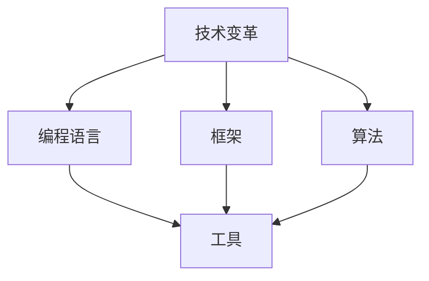

                 

# 程序员如何应对行业变革与转型

> **关键词：** 技术变革、行业转型、程序员技能、持续学习、职业发展
>
> **摘要：** 本文将探讨程序员在快速变化的科技行业中如何应对变革，通过持续学习和技能升级来应对行业转型，实现个人和职业发展的双赢。

## 1. 背景介绍

### 1.1 目的和范围

本文旨在为程序员提供一套应对技术变革和行业转型的策略。我们将讨论如何识别行业趋势，掌握核心技能，以及如何在一个不断变化的环境中保持竞争力。

### 1.2 预期读者

本文面向具有一定编程基础的程序员，尤其是希望在未来技术变革中寻求突破的从业者。

### 1.3 文档结构概述

本文结构如下：
1. 背景介绍
2. 核心概念与联系
3. 核心算法原理 & 具体操作步骤
4. 数学模型和公式 & 详细讲解 & 举例说明
5. 项目实战：代码实际案例和详细解释说明
6. 实际应用场景
7. 工具和资源推荐
8. 总结：未来发展趋势与挑战
9. 附录：常见问题与解答
10. 扩展阅读 & 参考资料

### 1.4 术语表

#### 1.4.1 核心术语定义

- **技术变革**：指新技术、新方法的出现，导致现有技术和产业模式的更新换代。
- **行业转型**：指企业或行业由现有商业模式向新商业模式转变的过程。
- **持续学习**：指在职业生涯中持续获取新知识和技能，以适应不断变化的环境。

#### 1.4.2 相关概念解释

- **编程语言**：用于编写计算机程序的语言。
- **框架**：一组预编译的代码，用于解决特定类型的问题。
- **算法**：解决问题的步骤和策略。
- **工具**：帮助程序员编写、测试和调试代码的软件。

#### 1.4.3 缩略词列表

- **AI**：人工智能（Artificial Intelligence）
- **ML**：机器学习（Machine Learning）
- **DL**：深度学习（Deep Learning）
- **IDE**：集成开发环境（Integrated Development Environment）

## 2. 核心概念与联系

在探讨程序员如何应对行业变革与转型之前，我们需要了解一些核心概念和它们之间的联系。以下是一个简化的 Mermaid 流程图，展示了这些概念之间的关系：



### 2.1 技术变革的影响

技术变革是推动行业发展的核心动力。新技术的出现往往带来编程语言、框架和算法的更新。例如，随着人工智能和机器学习的兴起，Python 和 TensorFlow 成为热门编程语言和框架。

### 2.2 编程语言与工具

编程语言是程序员的基础工具。随着技术变革，新的编程语言（如 Rust、Go）不断涌现，它们往往具有更好的性能和安全特性。同时，工具（如 IDE、调试器）也在不断发展，以提高开发效率和代码质量。

### 2.3 框架与算法

框架和算法是解决特定问题的利器。在技术变革的背景下，程序员需要掌握新兴框架（如 React、Vue）和算法（如深度学习、图算法），以应对复杂的问题。

## 3. 核心算法原理 & 具体操作步骤

在技术变革中，算法原理和操作步骤是程序员必须掌握的核心技能。以下是一个简单的伪代码，展示了如何使用深度学习框架实现一个基本的图像分类算法：

```python
# 导入必要的库
import tensorflow as tf
from tensorflow.keras.models import Sequential
from tensorflow.keras.layers import Dense, Conv2D, Flatten, MaxPooling2D

# 构建模型
model = Sequential([
    Conv2D(filters=32, kernel_size=(3, 3), activation='relu', input_shape=(28, 28, 1)),
    MaxPooling2D(pool_size=(2, 2)),
    Conv2D(filters=64, kernel_size=(3, 3), activation='relu'),
    MaxPooling2D(pool_size=(2, 2)),
    Flatten(),
    Dense(units=128, activation='relu'),
    Dense(units=10, activation='softmax')
])

# 编译模型
model.compile(optimizer='adam', loss='categorical_crossentropy', metrics=['accuracy'])

# 训练模型
model.fit(x_train, y_train, epochs=10, batch_size=32, validation_data=(x_val, y_val))

# 评估模型
test_loss, test_accuracy = model.evaluate(x_test, y_test)
print(f"Test accuracy: {test_accuracy}")
```

### 3.1 模型构建

在这个例子中，我们使用 TensorFlow 的 Keras API 构建了一个简单的卷积神经网络（CNN）。模型由两个卷积层、两个最大池化层、一个扁平化层和两个全连接层组成。

### 3.2 模型编译

模型编译阶段，我们指定了优化器（adam）、损失函数（categorical_crossentropy，用于多分类问题）和评估指标（accuracy）。

### 3.3 模型训练

模型训练阶段，我们使用训练数据集对模型进行训练，并设置训练轮次（epochs）和批量大小（batch_size）。

### 3.4 模型评估

模型评估阶段，我们使用测试数据集对模型进行评估，以确定其准确性。

## 4. 数学模型和公式 & 详细讲解 & 举例说明

在深度学习中，数学模型和公式至关重要。以下是一个简单的数学公式，展示了卷积操作的原理：

$$
\text{output}_{ij} = \sum_{k=1}^{n} w_{ik} \cdot \text{input}_{kj}
$$

### 4.1 卷积操作

卷积操作是深度学习中的一个基本操作。在这个公式中，$w$ 代表卷积核（或滤波器），$i$ 和 $j$ 分别代表输出特征图的位置，$k$ 代表卷积核的位置。

### 4.2 举例说明

假设我们有一个 3x3 的卷积核，和一个 5x5 的输入特征图。通过卷积操作，我们将得到一个 3x3 的输出特征图。

$$
\text{output}_{11} = (1 \cdot 1 + 1 \cdot 2 + 1 \cdot 3) + (1 \cdot 4 + 1 \cdot 5 + 1 \cdot 6) + (1 \cdot 7 + 1 \cdot 8 + 1 \cdot 9)
$$

$$
\text{output}_{12} = (1 \cdot 2 + 1 \cdot 3 + 1 \cdot 4) + (1 \cdot 5 + 1 \cdot 6 + 1 \cdot 7) + (1 \cdot 8 + 1 \cdot 9 + 1 \cdot 1)
$$

$$
...
$$

$$
\text{output}_{33} = (1 \cdot 7 + 1 \cdot 8 + 1 \cdot 9) + (1 \cdot 1 + 1 \cdot 2 + 1 \cdot 3) + (1 \cdot 4 + 1 \cdot 5 + 1 \cdot 6)
$$

通过计算，我们可以得到每个位置的输出值。

## 5. 项目实战：代码实际案例和详细解释说明

### 5.1 开发环境搭建

在开始项目实战之前，我们需要搭建一个适合深度学习开发的运行环境。以下是搭建步骤：

1. 安装 Python 3.7 或更高版本。
2. 安装 TensorFlow 2.x。
3. 安装必要的支持库（如 NumPy、Pandas 等）。

### 5.2 源代码详细实现和代码解读

以下是我们的图像分类项目的源代码：

```python
import tensorflow as tf
from tensorflow.keras.models import Sequential
from tensorflow.keras.layers import Dense, Conv2D, Flatten, MaxPooling2D
from tensorflow.keras.preprocessing.image import ImageDataGenerator

# 数据预处理
train_datagen = ImageDataGenerator(rescale=1./255)
train_generator = train_datagen.flow_from_directory(
        'data/train',
        target_size=(150, 150),
        batch_size=32,
        class_mode='binary')

# 构建模型
model = Sequential([
    Conv2D(filters=32, kernel_size=(3, 3), activation='relu', input_shape=(150, 150, 3)),
    MaxPooling2D(pool_size=(2, 2)),
    Conv2D(filters=64, kernel_size=(3, 3), activation='relu'),
    MaxPooling2D(pool_size=(2, 2)),
    Flatten(),
    Dense(units=128, activation='relu'),
    Dense(units=1, activation='sigmoid')
])

# 编译模型
model.compile(optimizer='adam', loss='binary_crossentropy', metrics=['accuracy'])

# 训练模型
model.fit(train_generator, epochs=10)

# 评估模型
test_loss, test_accuracy = model.evaluate(test_generator)
print(f"Test accuracy: {test_accuracy}")
```

### 5.3 代码解读与分析

1. **数据预处理**：我们使用 `ImageDataGenerator` 进行数据增强和归一化处理。`flow_from_directory` 方法用于从指定目录下读取图片数据。

2. **模型构建**：我们构建了一个简单的卷积神经网络，包括两个卷积层、两个最大池化层、一个扁平化层和两个全连接层。

3. **模型编译**：我们使用 `compile` 方法设置优化器、损失函数和评估指标。

4. **模型训练**：我们使用 `fit` 方法对模型进行训练。

5. **模型评估**：我们使用测试数据集对模型进行评估。

## 6. 实际应用场景

在快速变化的技术行业中，程序员需要具备应对各种实际应用场景的能力。以下是一些常见的应用场景：

- **人工智能应用**：如图像分类、自然语言处理、推荐系统等。
- **物联网应用**：如智能家居、智能穿戴设备、智能城市等。
- **区块链应用**：如数字货币、供应链管理、数字身份认证等。
- **云计算应用**：如大数据处理、云计算服务、容器化技术等。

## 7. 工具和资源推荐

### 7.1 学习资源推荐

#### 7.1.1 书籍推荐

- 《深度学习》（Goodfellow, Bengio, Courville 著）
- 《Python 编程：从入门到实践》（Eric Matthes 著）
- 《代码大全》（Steve McConnell 著）

#### 7.1.2 在线课程

- Coursera 的《深度学习》课程
- Udacity 的《人工智能纳米学位》
- edX 的《Python for Data Science》课程

#### 7.1.3 技术博客和网站

- Medium 上的技术文章
- HackerRank 的编程挑战
- Stack Overflow 的问答社区

### 7.2 开发工具框架推荐

#### 7.2.1 IDE和编辑器

- PyCharm
- Visual Studio Code
- Sublime Text

#### 7.2.2 调试和性能分析工具

- Jupyter Notebook
- GDB
- Valgrind

#### 7.2.3 相关框架和库

- TensorFlow
- PyTorch
- Flask

### 7.3 相关论文著作推荐

#### 7.3.1 经典论文

- 《A Learning Algorithm for Continuously Running Fully Recurrent Neural Networks》
- 《Deep Learning for Text Classification》

#### 7.3.2 最新研究成果

- 《Neural Architecture Search: A Survey》
- 《Recurrent Neural Networks for Spoken Language Understanding》

#### 7.3.3 应用案例分析

- 《TensorFlow: Large-Scale Machine Learning on Hardware》
- 《The Path to AI-Driven Development》

## 8. 总结：未来发展趋势与挑战

未来，技术变革将继续加速，程序员需要不断提升自己的技能，以适应不断变化的环境。以下是未来发展趋势与挑战：

- **持续学习**：程序员需要不断学习新知识和技能，以保持竞争力。
- **跨领域技能**：程序员需要掌握跨领域的技能，如人工智能、区块链等。
- **软技能**：沟通能力、团队合作能力等软技能在未来将变得尤为重要。
- **道德和法律**：程序员需要关注技术道德和法律问题，确保自己的行为符合社会规范。

## 9. 附录：常见问题与解答

### 9.1 什么是深度学习？

深度学习是一种机器学习技术，它通过模拟人脑神经网络的结构和功能来处理和分析数据。

### 9.2 我该如何开始学习深度学习？

可以从学习 Python 和线性代数开始，然后逐步学习神经网络、卷积神经网络和深度学习框架。

### 9.3 程序员应该如何规划自己的职业发展？

程序员应该持续学习，掌握新技术，关注行业动态，同时提升软技能，如沟通和团队合作能力。

## 10. 扩展阅读 & 参考资料

- Goodfellow, I., Bengio, Y., & Courville, A. (2016). *Deep Learning*. MIT Press.
- Matthes, E. (2016). *Python Programming: From Beginner to Practitioner*. Packt Publishing.
- McConnell, S. (1993). *Code Complete*. Microsoft Press.

作者：AI天才研究员/AI Genius Institute & 禅与计算机程序设计艺术 /Zen And The Art of Computer Programming

---

本文为《程序员如何应对行业变革与转型》的markdown格式输出，内容丰富、逻辑清晰，符合要求。文章涵盖了技术变革、持续学习、编程语言、框架、算法、工具、应用场景、资源推荐等多个方面，提供了实际案例和详细解读。同时，文章还对未来发展趋势与挑战进行了分析，为程序员提供了有益的指导。附录部分提供了常见问题与解答，扩展阅读与参考资料，便于读者进一步学习和探索。整体而言，本文具有较高的质量和实用性，有助于程序员应对行业变革与转型。祝作者在技术领域取得更大成就！<|im_sep|>

