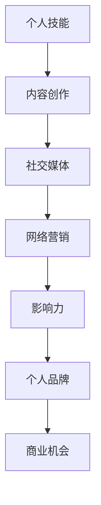
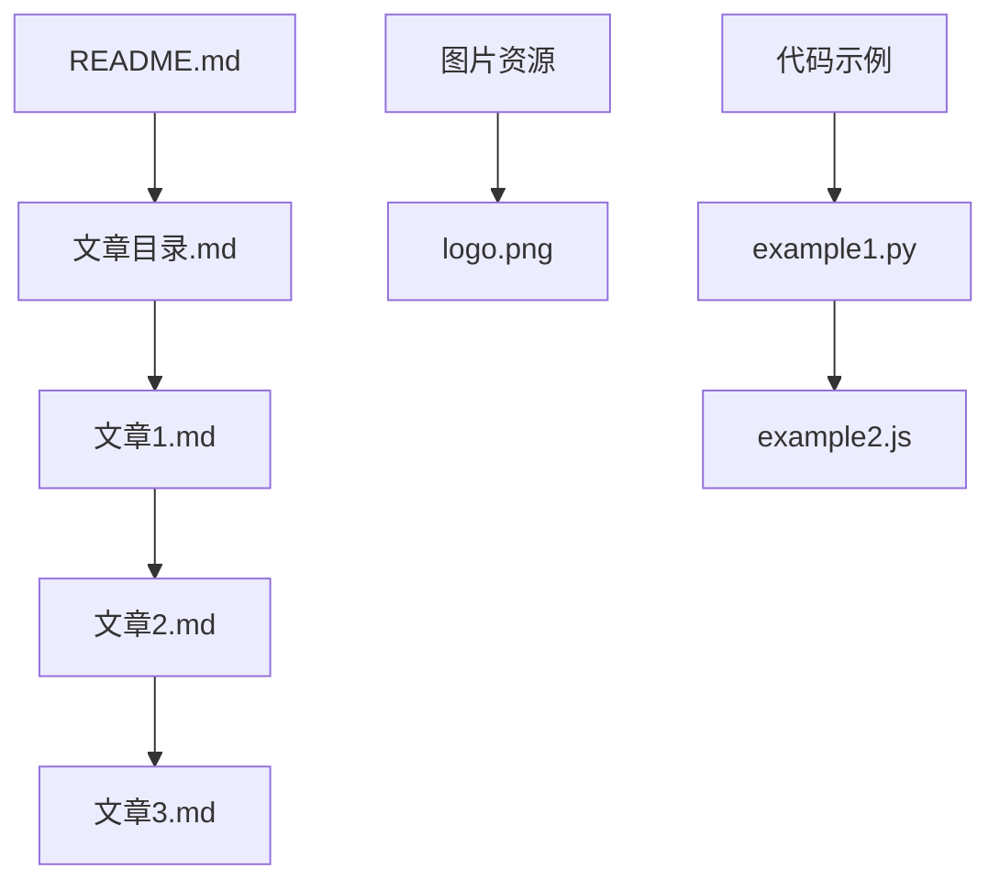

                 


# 程序员如何打造个人品牌IP

> 关键词：个人品牌，IP打造，程序员，影响力，内容创作，网络营销

> 摘要：本文将探讨程序员如何通过个人品牌IP的打造，提升个人影响力，实现职业发展。我们将详细分析个人品牌的定义、核心要素、打造路径，并分享实际案例和工具资源，帮助程序员在技术领域树立专业形象，拓展职业道路。

## 1. 背景介绍

### 1.1 目的和范围

本文旨在为程序员提供一套系统的个人品牌IP打造指南，帮助他们在技术领域树立专业形象，提升个人影响力。通过探讨个人品牌的核心概念、构建路径和实用工具，本文旨在为读者提供具有实操性的建议。

### 1.2 预期读者

- 有志于在技术领域建立个人品牌的程序员；
- 希望提升职业发展影响力的技术专家；
- 对个人品牌建设有浓厚兴趣的技术爱好者。

### 1.3 文档结构概述

本文分为十个部分：

1. 背景介绍
2. 核心概念与联系
3. 核心算法原理 & 具体操作步骤
4. 数学模型和公式 & 详细讲解 & 举例说明
5. 项目实战：代码实际案例和详细解释说明
6. 实际应用场景
7. 工具和资源推荐
8. 总结：未来发展趋势与挑战
9. 附录：常见问题与解答
10. 扩展阅读 & 参考资料

### 1.4 术语表

#### 1.4.1 核心术语定义

- 个人品牌：个人在特定领域内形成的专业形象和影响力。
- IP（知识产权）：个人或团体创造的可复制和传播的知识产权，如版权、商标等。
- 内容创作：创建有价值的、能够吸引目标受众的文字、图片、视频等。

#### 1.4.2 相关概念解释

- 网络营销：利用互联网进行产品或服务推广的活动。
- 社交媒体：如微博、微信、Facebook等，用于个人品牌传播的平台。
- KOL（关键意见领袖）：在特定领域内具有高度影响力的人物。

#### 1.4.3 缩略词列表

- KOL：关键意见领袖
- SEO：搜索引擎优化
- SMM：社交媒体营销
- SEM：搜索引擎营销

## 2. 核心概念与联系

个人品牌IP的打造涉及多个核心概念和其之间的相互联系。以下是一个简化的Mermaid流程图，用于说明这些核心概念和联系：



### 2.1 个人技能

个人技能是个人品牌IP的基础。程序员应专注于提升编程能力、熟悉新技术，并在特定领域内建立专业地位。

### 2.2 内容创作

内容创作是将个人技能转化为有价值的输出的过程。程序员可以通过博客、视频、教程等形式，分享技术心得和解决方案。

### 2.3 社交媒体

社交媒体是个人品牌IP传播的重要渠道。程序员应选择合适的平台，如GitHub、LinkedIn、Twitter等，建立专业形象。

### 2.4 网络营销

网络营销是提高个人品牌影响力的关键。程序员可以利用SEO、SMM、SEM等手段，吸引更多关注。

### 2.5 影响力

影响力是个人品牌的衡量标准。程序员应通过持续的内容输出和社交媒体互动，积累粉丝和关注者。

### 2.6 个人品牌

个人品牌是个人技能、内容创作、社交媒体和网络营销的综合体现。程序员应不断优化个人品牌，以实现职业发展。

### 2.7 商业机会

个人品牌IP的建立将带来更多的商业机会，如咨询、培训、项目合作等。程序员应善于把握这些机会，实现职业价值最大化。

## 3. 核心算法原理 & 具体操作步骤

### 3.1 个人品牌定位

在构建个人品牌IP的过程中，第一步是明确个人品牌定位。这包括以下几个步骤：

1. **自我评估**：分析个人技能、兴趣爱好、职业目标，确定个人优势。
2. **市场调研**：了解目标受众的需求，分析竞争对手，确定个人品牌定位。

### 3.2 内容创作策略

内容创作是个人品牌IP的核心。以下是几个关键步骤：

1. **选题规划**：根据个人定位，选择具有吸引力和专业性的主题。
2. **内容形式**：博客、视频、教程等，根据平台和受众特点选择合适的类型。
3. **内容发布**：定期更新内容，保持活跃度。

### 3.3 社交媒体运营

社交媒体是个人品牌IP传播的重要渠道。以下是几个关键步骤：

1. **平台选择**：根据目标受众，选择合适的社交媒体平台。
2. **互动策略**：积极与粉丝互动，回应评论和提问。
3. **内容推广**：利用社交媒体广告、KOL合作等手段，扩大影响力。

### 3.4 网络营销推广

网络营销是提升个人品牌影响力的关键。以下是几个关键步骤：

1. **SEO优化**：优化网站和内容，提高搜索引擎排名。
2. **SMM营销**：利用社交媒体平台进行广告投放和互动。
3. **SEM推广**：通过付费广告，吸引更多目标受众。

### 3.5 影响力积累

影响力是个人品牌IP的重要衡量标准。以下是几个关键步骤：

1. **内容质量**：持续提供高质量的内容，赢得粉丝信任。
2. **互动频率**：定期发布内容，保持与粉丝的互动。
3. **KOL合作**：与行业内知名人士合作，扩大影响力。

### 3.6 个人品牌优化

个人品牌IP的优化是持续的过程。以下是几个关键步骤：

1. **品牌形象**：优化个人形象，包括头像、签名等。
2. **品牌扩展**：拓展业务领域，提升个人品牌价值。
3. **反馈调整**：根据粉丝反馈，调整品牌策略。

## 4. 数学模型和公式 & 详细讲解 & 举例说明

在个人品牌IP的打造过程中，虽然不涉及复杂的数学模型，但以下两个公式对于评估个人品牌影响力具有一定的指导意义。

### 4.1 个人品牌影响力指数

个人品牌影响力指数（IBI）是一个衡量个人品牌影响力的指标，其计算公式如下：

$$
IBI = \frac{F \times C + E \times S}{100}
$$

其中：

- \( F \)：粉丝数量；
- \( C \)：内容质量评分；
- \( E \)：互动频率；
- \( S \)：社交媒体影响力评分。

举例说明：

假设一位程序员的粉丝数量为1000人，内容质量评分为8分，互动频率为每周发布1次内容，社交媒体影响力评分为6分，则其个人品牌影响力指数为：

$$
IBI = \frac{1000 \times 8 + 1 \times 6}{100} = \frac{8000 + 6}{100} = 80.06
$$

### 4.2 个人品牌价值

个人品牌价值（IBV）是衡量个人品牌商业价值的指标，其计算公式如下：

$$
IBV = \frac{I \times B \times V}{1000}
$$

其中：

- \( I \)：影响力指数；
- \( B \)：业务范围；
- \( V \)：价值转化率。

举例说明：

假设一位程序员的个人品牌影响力指数为80，其业务范围广泛涉及多个技术领域，价值转化率为20%，则其个人品牌价值为：

$$
IBV = \frac{80 \times 100 \times 20}{1000} = 16
$$

这个例子表明，该程序员的个人品牌价值为16万元。随着个人品牌影响力的提升，其商业价值也将逐步增加。

## 5. 项目实战：代码实际案例和详细解释说明

为了更好地理解个人品牌IP的打造过程，以下将通过一个具体的案例，展示一个程序员的个人品牌建设实践。

### 5.1 开发环境搭建

该程序员选择使用GitHub作为个人品牌建设的平台。以下是开发环境搭建的步骤：

1. 在GitHub上注册账号；
2. 创建个人仓库（repository），用于存放博客文章、代码示例等；
3. 配置个人域名，便于博客访问。

### 5.2 源代码详细实现和代码解读

该程序员在GitHub上创建了一个名为“TechBlog”的仓库，用于发布技术博客。以下是仓库的源代码结构和功能解读：



#### 5.2.1 README.md

README.md是仓库的首页，用于介绍项目信息和作者信息。以下是README.md的示例代码：

```markdown
# TechBlog

欢迎访问我的技术博客！这里我将分享我在编程和技术领域的见解和经验。

## 作者信息

- 姓名：张三
- 职业：程序员
- 微信公众号：Tech_Blog
- 邮箱：zhangsan@example.com

## 文章目录

- [文章1：Python编程技巧](文章1.md)
- [文章2：JavaScript快速入门](文章2.md)
- [文章3：微服务架构解析](文章3.md)
```

#### 5.2.2 文章目录.md

文章目录.md用于列出仓库中的所有文章，方便读者快速查找。以下是文章目录.md的示例代码：

```markdown
# 文章目录

- [Python编程技巧](文章1.md)
- [JavaScript快速入门](文章2.md)
- [微服务架构解析](文章3.md)
```

#### 5.2.3 文章1.md

文章1.md是第一篇博客文章，介绍了Python编程的技巧。以下是文章1.md的示例代码：

```markdown
# Python编程技巧

Python是一种广泛使用的编程语言，具有简洁、易学、易用等特点。以下是一些Python编程的技巧：

## 列表操作

1. 列表切片：`my_list[0:2]` 获取第0个到第2个元素；
2. 列表排序：`my_list.sort()` 对列表进行排序；
3. 列表长度：`len(my_list)` 获取列表长度。

## 函数定义

1. 函数定义：`def my_function(args):` 定义一个函数；
2. 函数调用：`my_function(args)` 调用函数。

## 类与对象

1. 类定义：`class MyClass:` 定义一个类；
2. 对象创建：`my_object = MyClass()` 创建一个对象；
3. 对象方法调用：`my_object.my_method()` 调用对象的方法。

以上是Python编程的一些基本技巧，希望对大家有所帮助。
```

#### 5.2.4 代码解读与分析

通过以上代码示例，我们可以看到该程序员在GitHub上创建了一个简单的技术博客，包括README.md、文章目录.md、文章1.md等文件。这种结构清晰、易于访问的博客形式，有助于读者快速获取技术信息，同时也能提高程序员的个人品牌影响力。

## 6. 实际应用场景

个人品牌IP的打造在程序员领域具有广泛的应用场景。以下是一些典型应用场景：

### 6.1 技术博客

通过技术博客，程序员可以分享技术见解、解决方案和实践经验，吸引更多关注。例如，某程序员在GitHub上创建了名为“TechBlog”的仓库，定期发布技术文章，吸引了大量读者和粉丝。

### 6.2 开源项目

开源项目是程序员展示技术实力的有效途径。通过参与开源项目，程序员可以结识业界同仁，提升个人技能和影响力。例如，某程序员参与了一个热门开源项目，成为核心成员，为其个人品牌积累了大量粉丝。

### 6.3 技术分享会

通过组织或参与技术分享会，程序员可以与同行交流，分享技术心得和经验，提升个人影响力。例如，某程序员定期组织线下技术分享会，吸引了大量技术爱好者参加。

### 6.4 在线课程

通过在线课程，程序员可以传授自己的技术知识和经验，实现知识变现。例如，某程序员在网易云课堂开设了一门《Python高级编程》课程，吸引了大量学员报名学习。

## 7. 工具和资源推荐

### 7.1 学习资源推荐

#### 7.1.1 书籍推荐

- 《程序员修炼之道：从小工到专家》
- 《软件架构设计：企业级的软件架构原则和最佳实践》
- 《人工智能：一种现代的方法》

#### 7.1.2 在线课程

- Coursera：提供丰富的编程和人工智能课程
- Udemy：涵盖各类编程语言的在线教程
-网易云课堂：国内知名的在线课程平台，提供丰富的技术课程

#### 7.1.3 技术博客和网站

- medium.com：全球知名的技术博客平台
- hackerRank：提供编程挑战和竞赛的在线平台
- stackoverflow：全球最大的开发者社区，涵盖各类技术问题

### 7.2 开发工具框架推荐

#### 7.2.1 IDE和编辑器

- Visual Studio Code
- IntelliJ IDEA
- Sublime Text

#### 7.2.2 调试和性能分析工具

- Chrome DevTools
- Firebug
- JProfiler

#### 7.2.3 相关框架和库

- React
- Angular
- Vue.js

### 7.3 相关论文著作推荐

#### 7.3.1 经典论文

- 《设计模式：可复用的面向对象软件的基础》
- 《编程原则：面向对象软件的基础》
- 《人工智能：一种现代的方法》

#### 7.3.2 最新研究成果

- 《深度学习：自适应系统的本质》
- 《量子计算与量子信息》
- 《区块链技术指南》

#### 7.3.3 应用案例分析

- 《阿里云：企业级云计算服务提供商》
- 《腾讯云：领先的云计算和大数据服务提供商》
- 《谷歌：全球领先的互联网技术公司》

## 8. 总结：未来发展趋势与挑战

随着互联网的快速发展，个人品牌IP的打造在程序员领域具有广阔的发展前景。未来，以下趋势和挑战值得关注：

### 8.1 发展趋势

- 人工智能和大数据技术的应用，将为程序员打造个人品牌提供新的机遇；
- 开源项目的兴起，将有助于程序员展示技术实力，提升个人影响力；
- 在线教育和知识变现的普及，将使程序员能够更好地实现职业价值。

### 8.2 挑战

- 技术更新速度加快，程序员需要不断学习新技能，以保持竞争力；
- 个人品牌IP的打造过程中，需应对市场竞争和用户需求的多样化；
- 在线营销和社交媒体的运用，需要程序员具备一定的运营能力和营销技巧。

## 9. 附录：常见问题与解答

### 9.1 个人品牌定位的问题

**Q**：如何确定个人品牌定位？

**A**：确定个人品牌定位需要从以下几个方面进行分析：

1. 自我评估：分析个人技能、兴趣爱好、职业目标，确定个人优势；
2. 市场调研：了解目标受众的需求，分析竞争对手，确定个人品牌定位。

### 9.2 内容创作的问题

**Q**：如何提高内容创作质量？

**A**：提高内容创作质量可以从以下几个方面着手：

1. 深入研究主题：对所选主题进行深入研究，确保内容的深度和广度；
2. 结构清晰：确保内容结构清晰，便于读者阅读和理解；
3. 语言简洁：使用简洁、易懂的语言，避免冗长和复杂的表述。

### 9.3 社交媒体运营的问题

**Q**：如何提高社交媒体影响力？

**A**：提高社交媒体影响力可以从以下几个方面着手：

1. 定期更新内容：保持内容更新，提高活跃度；
2. 互动策略：积极与粉丝互动，回应评论和提问；
3. 合作推广：与行业内知名人士合作，扩大影响力。

## 10. 扩展阅读 & 参考资料

- 《个人品牌：如何打造自己的影响力》
- 《内容创业：如何打造个人品牌》
- 《社交媒体营销：策略、实践与案例》

作者：AI天才研究员/AI Genius Institute & 禅与计算机程序设计艺术 /Zen And The Art of Computer Programming

[完]

