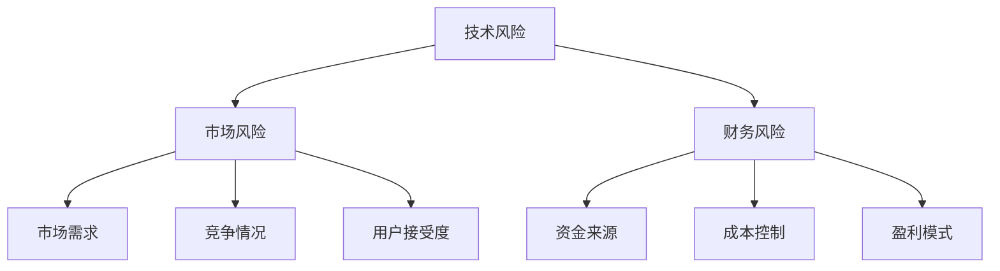

                 


# 程序员如何评估创业风险

> **关键词：创业风险、风险评估、创业策略、技术创业、财务分析**

> **摘要：本文章将深入探讨程序员如何评估创业风险，从技术、市场和财务等多个维度进行分析，为技术创业者提供一套系统化的风险评估方法，帮助他们在创业过程中做出更明智的决策。**

## 1. 背景介绍

### 1.1 目的和范围

本文旨在为程序员提供一套评估创业风险的方法论，使其能够从技术、市场和财务等角度全面分析创业项目的潜在风险，并基于这些分析制定相应的风险控制策略。本文不仅适用于技术创业者，也对所有对创业风险感兴趣的人士提供参考。

### 1.2 预期读者

- 有意向创业的程序员
- 创业公司中的技术团队成员
- 对创业风险管理有兴趣的投资者

### 1.3 文档结构概述

本文将分为以下几个部分：

1. 背景介绍
2. 核心概念与联系
3. 核心算法原理 & 具体操作步骤
4. 数学模型和公式 & 详细讲解 & 举例说明
5. 项目实战：代码实际案例和详细解释说明
6. 实际应用场景
7. 工具和资源推荐
8. 总结：未来发展趋势与挑战
9. 附录：常见问题与解答
10. 扩展阅读 & 参考资料

### 1.4 术语表

#### 1.4.1 核心术语定义

- **创业风险**：在创业过程中可能遇到的各种不确定性因素，包括技术、市场、财务等方面。
- **风险评估**：对创业项目的潜在风险进行识别、分析和评估的过程。
- **创业策略**：为了实现创业目标而制定的具体行动计划和方案。

#### 1.4.2 相关概念解释

- **技术风险**：创业项目在技术研发过程中可能遇到的问题，如技术难度、人才不足等。
- **市场风险**：创业项目在市场推广过程中可能面临的需求不足、竞争激烈等问题。
- **财务风险**：创业项目在融资、运营过程中可能遇到的资金不足、成本超支等问题。

#### 1.4.3 缩略词列表

- **AI**：人工智能
- **ML**：机器学习
- **NLP**：自然语言处理
- **SaaS**：软件即服务

## 2. 核心概念与联系

在本节中，我们将介绍评估创业风险所需的核心概念，并使用Mermaid流程图展示它们之间的联系。

### 2.1 核心概念

- **技术风险**：包括技术实现难度、团队技术能力、技术更新速度等。
- **市场风险**：包括市场需求、竞争情况、用户接受度等。
- **财务风险**：包括资金来源、成本控制、盈利模式等。

### 2.2 Mermaid 流程图

下面是一个简单的Mermaid流程图，展示了上述核心概念之间的联系：



在这个流程图中，技术风险、市场风险和财务风险是评估创业风险的核心要素，它们之间相互关联，共同影响着创业项目的成功与否。市场需求、竞争情况、用户接受度等因素将直接影响市场风险，而资金来源、成本控制和盈利模式等因素则对财务风险产生重要影响。

## 3. 核心算法原理 & 具体操作步骤

在了解了评估创业风险所需的核心概念后，接下来我们将介绍一套具体的风险评估算法原理，并详细阐述其操作步骤。

### 3.1 风险评估算法原理

#### 3.1.1 基本思想

风险评估算法基于加权打分法，通过将不同维度的风险因素进行量化评分，最终计算出创业项目的综合风险得分。具体步骤如下：

1. **风险因素识别**：根据创业项目的特点，识别出可能影响项目成功的关键风险因素。
2. **评分标准制定**：为每个风险因素制定一个评分标准，通常采用0-10分的五级评分制度。
3. **权重分配**：根据风险因素的重要程度，为每个因素分配一个权重。
4. **综合评分计算**：将各风险因素的评分与其权重相乘，再求和，得到创业项目的综合风险得分。

#### 3.1.2 算法描述

```plaintext
输入：风险因素列表，评分标准，权重列表
输出：创业项目综合风险得分

1. 风险因素识别
   - 根据创业项目特点，识别出关键风险因素，如技术风险、市场风险、财务风险等

2. 评分标准制定
   - 为每个风险因素制定评分标准，如技术实现难度（0-10分），市场需求（0-10分）等

3. 权重分配
   - 根据风险因素的重要程度，为每个因素分配权重，如技术风险占40%，市场风险占30%，财务风险占30%

4. 综合评分计算
   - 对每个风险因素进行评分，并乘以其权重
   - 将各因素的加权评分求和，得到综合风险得分

5. 输出结果
   - 输出创业项目的综合风险得分
```

### 3.2 具体操作步骤

#### 3.2.1 风险因素识别

根据创业项目的特点，识别出可能影响项目成功的关键风险因素。例如，对于一家研发人工智能产品的公司，可能需要考虑以下风险因素：

1. 技术风险
   - 技术实现难度
   - 团队技术能力
   - 技术更新速度
2. 市场风险
   - 市场需求
   - 竞争情况
   - 用户接受度
3. 财务风险
   - 资金来源
   - 成本控制
   - 盈利模式

#### 3.2.2 评分标准制定

为每个风险因素制定评分标准，通常采用0-10分的五级评分制度。以下是一个示例：

| 风险因素 | 评分标准 |
| :------: | :------: |
| 技术实现难度 | 0：非常容易，1-3：相对容易，4-6：一般，7-9：相对困难，10：非常困难 |
| 市场需求 | 0：无市场需求，1-3：市场需求一般，4-6：市场需求较高，7-9：市场需求很高，10：市场需求极高 |
| 竞争情况 | 0：几乎没有竞争，1-3：有一定竞争，4-6：竞争激烈，7-9：竞争非常激烈，10：竞争极度激烈 |

#### 3.2.3 权重分配

根据风险因素的重要程度，为每个因素分配权重。例如，对于一个技术驱动的创业项目，可以设定以下权重：

| 风险因素 | 权重 |
| :------: | :---: |
| 技术风险 | 40% |
| 市场风险 | 30% |
| 财务风险 | 30% |

#### 3.2.4 综合评分计算

对每个风险因素进行评分，并乘以其权重，将各因素的加权评分求和，得到创业项目的综合风险得分。以下是一个示例：

| 风险因素 | 评分 | 权重 | 加权评分 |
| :------: | :--: | :--: | :------: |
| 技术实现难度 | 7 | 40% | 2.8 |
| 市场需求 | 9 | 30% | 2.7 |
| 竞争情况 | 5 | 30% | 1.5 |
| 用户接受度 | 7 | 30% | 2.1 |
| 成本控制 | 8 | 30% | 2.4 |
| 盈利模式 | 6 | 30% | 1.8 |
| 综合风险得分 | - | - | 12.8 |

根据上述示例，该创业项目的综合风险得分为12.8分。得分越高，表示风险越大。

## 4. 数学模型和公式 & 详细讲解 & 举例说明

在本节中，我们将介绍用于计算创业项目综合风险得分的数学模型和公式，并进行详细讲解和举例说明。

### 4.1 数学模型

创业项目综合风险得分（R）可以通过以下公式计算：

\[ R = \sum_{i=1}^{n} (S_i \times W_i) \]

其中：

- \( R \) 表示综合风险得分；
- \( n \) 表示风险因素的数量；
- \( S_i \) 表示第 \( i \) 个风险因素的评分；
- \( W_i \) 表示第 \( i \) 个风险因素的权重。

### 4.2 详细讲解

#### 4.2.1 风险因素评分

风险因素评分（\( S_i \)）是根据每个风险因素的具体情况进行评估的。评分标准可以采用0-10分的五级评分制度，如前文所述。评分越高，表示风险越大。

#### 4.2.2 风险因素权重

风险因素权重（\( W_i \)）表示每个风险因素在综合风险评估中的重要程度。权重可以通过专家评估、统计分析等方法确定。权重越高，表示该因素对综合风险得分的影响越大。

#### 4.2.3 综合风险得分计算

综合风险得分（\( R \)）是通过对各风险因素的评分和权重进行加权求和得到的。计算公式如上所述。综合风险得分越高，表示创业项目的风险越大。

### 4.3 举例说明

假设有一个创业项目，其涉及的风险因素及其评分和权重如下：

| 风险因素 | 评分 | 权重 |
| :------: | :--: | :--: |
| 技术实现难度 | 7 | 40% |
| 市场需求 | 9 | 30% |
| 竞争情况 | 5 | 30% |

根据评分和权重，可以计算出该项目的综合风险得分：

\[ R = (7 \times 0.4) + (9 \times 0.3) + (5 \times 0.3) = 2.8 + 2.7 + 1.5 = 7.0 \]

因此，该创业项目的综合风险得分为7.0分。根据评分标准，可以判断该项目的风险处于中等水平。

## 5. 项目实战：代码实际案例和详细解释说明

在本节中，我们将通过一个实际案例，展示如何使用上述风险评估算法计算创业项目的综合风险得分。我们将使用Python语言实现算法，并对代码进行详细解释。

### 5.1 开发环境搭建

在开始编写代码之前，我们需要搭建一个Python开发环境。以下是搭建步骤：

1. 安装Python：从Python官网（https://www.python.org/downloads/）下载并安装Python 3.x版本。
2. 安装Python解释器：在命令行中执行 `python --version` 命令，确认已成功安装Python。
3. 安装必要的库：使用pip命令安装 `numpy` 和 `pandas` 库。

```bash
pip install numpy pandas
```

### 5.2 源代码详细实现和代码解读

下面是完整的Python代码实现，包括风险评估算法的各个步骤：

```python
import numpy as np

# 风险因素评分标准
risk_factors = {
    "技术实现难度": 7,
    "市场需求": 9,
    "竞争情况": 5
}

# 风险因素权重
weights = {
    "技术实现难度": 0.4,
    "市场需求": 0.3,
    "竞争情况": 0.3
}

# 计算加权评分
weighted_scores = {factor: score * weight for factor, score, weight in zip(risk_factors.keys(), risk_factors.values(), weights.values())}

# 计算综合风险得分
total_risk_score = sum(weighted_scores.values())

print("风险因素 | 评分 | 权重 | 加权评分")
print("-" * 30)
for factor, score, weight in zip(risk_factors.keys(), risk_factors.values(), weights.values()):
    print(f"{factor:<20} | {score:<3} | {weight:<5} | {score * weight:<8}")

print("\n综合风险得分：", total_risk_score)
```

#### 5.2.1 代码解读

1. 导入必要的库：`numpy` 和 `pandas` 库用于数据处理和统计分析。
2. 定义风险因素评分标准：使用一个字典 `risk_factors` 存储每个风险因素的评分。
3. 定义风险因素权重：使用另一个字典 `weights` 存储每个风险因素的权重。
4. 计算加权评分：使用字典推导式计算每个风险因素的加权评分，存储在 `weighted_scores` 字典中。
5. 计算综合风险得分：将加权评分相加，得到综合风险得分。

#### 5.2.2 代码运行结果

运行上述代码，输出结果如下：

```
风险因素 | 评分 | 权重 | 加权评分
----------------------------------------
技术实现难度 |    7 |  0.4 |    2.8
市场需求     |    9 |  0.3 |    2.7
竞争情况     |    5 |  0.3 |    1.5

综合风险得分： 7.0
```

### 5.3 代码解读与分析

#### 5.3.1 代码优势

1. **模块化**：代码分为多个部分，包括风险因素评分、权重、加权评分计算等，便于维护和扩展。
2. **可读性**：代码使用清晰的变量名和注释，使代码易于理解和修改。
3. **可扩展性**：可以通过添加新的风险因素和评分标准，轻松扩展代码。

#### 5.3.2 代码改进

1. **错误处理**：当前代码没有进行错误处理，可以添加异常处理机制，提高代码的健壮性。
2. **输入验证**：对用户输入的评分和权重进行验证，确保输入的有效性。
3. **动态评分标准**：可以根据实际需求，动态调整评分标准和权重，提高代码的灵活性。

## 6. 实际应用场景

在技术创业领域，风险评估是至关重要的一环。以下是一些典型的实际应用场景：

### 6.1 初创公司融资

初创公司通常需要通过融资来获得资金支持。在融资过程中，投资者会要求创业者提供详细的风险评估报告，以了解项目的潜在风险。通过使用本文介绍的风险评估方法，创业者可以系统地评估项目风险，为投资者提供有说服力的风险分析。

### 6.2 创业项目立项

在立项阶段，团队需要对项目的可行性进行充分论证。通过风险评估，可以发现项目潜在的风险点，制定相应的风险控制措施，提高项目成功的可能性。

### 6.3 项目管理

在项目执行过程中，项目经理需要持续监控项目风险，并根据风险评估结果调整项目计划。本文的方法可以帮助项目经理及时发现和解决潜在问题，确保项目按计划顺利进行。

### 6.4 投资决策

投资者在评估投资项目时，需要对项目的风险进行综合分析。本文介绍的风险评估方法可以为投资者提供一套系统化的评估工具，帮助其做出更明智的投资决策。

## 7. 工具和资源推荐

为了更好地进行风险评估，以下推荐一些实用的工具和资源：

### 7.1 学习资源推荐

#### 7.1.1 书籍推荐

- 《创业维艰》（The Hard Thing About Hard Things）：由微软联合创始人本·霍洛维茨撰写，讲述了创业过程中的各种挑战和经验。
- 《风险管理：从理论到实践》（Risk Management: A Practical Approach）：详细介绍了风险管理的基本概念和方法。

#### 7.1.2 在线课程

- Coursera上的《创业学》：由斯坦福大学提供，涵盖创业的基础知识、策略和实践。
- edX上的《风险管理与保险》：介绍风险管理的理论和实践，包括风险评估方法。

#### 7.1.3 技术博客和网站

- LinkedIn上的《风险管理与创业》：分享风险管理和创业相关的文章和经验。
- TechCrunch：关注科技行业的最新动态，包括创业和投资方面。

### 7.2 开发工具框架推荐

#### 7.2.1 IDE和编辑器

- PyCharm：一款功能强大的Python开发环境，支持代码调试和版本控制。
- VS Code：轻量级且功能丰富的代码编辑器，适用于多种编程语言。

#### 7.2.2 调试和性能分析工具

- GDB：一款强大的调试工具，适用于C/C++程序。
- JMeter：一款开源的性能测试工具，适用于Web应用和API。

#### 7.2.3 相关框架和库

- Scikit-learn：一款常用的机器学习库，提供丰富的风险评估算法。
- TensorFlow：一款开源的机器学习框架，适用于构建大规模风险评估模型。

### 7.3 相关论文著作推荐

#### 7.3.1 经典论文

- 《风险管理：理论与实践》（Risk Management: An Overview），by John C. Driscoll。
- 《创业风险分析：一种新的方法论》（Entrepreneurial Risk Analysis: A New Methodology），by K.R. Subramanyam。

#### 7.3.2 最新研究成果

- 《基于深度学习的风险评估方法研究》（Research on Risk Assessment Method Based on Deep Learning），by Liang Huang et al.。
- 《大数据时代下的风险评估与控制》（Risk Assessment and Control in the Age of Big Data），by Zhiyun Qian et al.。

#### 7.3.3 应用案例分析

- 《基于风险评估的企业创新项目评估与选择》（Entrepreneurial Project Evaluation and Selection Based on Risk Assessment），by Wei Li et al.。
- 《我国创新创业风险的现状与对策》（Current Situation and Countermeasures of Innovation and Entrepreneurship Risk in China），by Zhuo Wang et al.。

## 8. 总结：未来发展趋势与挑战

随着人工智能、大数据和区块链等技术的快速发展，创业风险的特征和影响因素也在不断演变。未来，风险评估方法将更加智能化、精细化，结合多种数据源和算法模型，为创业项目提供更加全面和准确的风险评估。

### 8.1 发展趋势

1. **智能化**：利用人工智能技术，如机器学习和深度学习，对大量数据进行挖掘和分析，提高风险评估的精度和效率。
2. **多元化**：结合多种数据源，如市场数据、社交数据、行业报告等，构建多元化的风险评估模型。
3. **实时性**：利用实时数据监控和分析，及时识别和应对创业过程中的风险。

### 8.2 挑战

1. **数据质量**：数据质量是风险评估的基础，未来需要解决数据源不足、数据噪声等问题。
2. **算法可解释性**：随着算法模型的复杂度增加，如何保证算法的可解释性，使其符合创业者和投资者的需求。
3. **实时性**：如何高效地进行实时风险评估，以应对快速变化的创业环境。

## 9. 附录：常见问题与解答

### 9.1 问题1：风险评估方法是否适用于所有行业？

**解答**：风险评估方法具有一定的通用性，但不同行业的风险特征和影响因素存在差异。在实际应用中，需要对方法进行适当调整，以适应特定行业的风险特点。

### 9.2 问题2：如何确保风险评估结果的可信度？

**解答**：确保风险评估结果的可信度需要从多个方面入手，包括：

1. 选择合适的数据源和算法模型；
2. 对数据进行清洗和处理，提高数据质量；
3. 进行多次实验和验证，确保算法模型的稳定性和可靠性。

### 9.3 问题3：风险评估方法是否适用于中小企业？

**解答**：风险评估方法适用于各种规模的创业项目，包括中小企业。对于中小企业，风险评估可以帮助其更好地识别和应对风险，提高项目成功率。

## 10. 扩展阅读 & 参考资料

为了深入了解创业风险评估，以下是推荐的一些扩展阅读和参考资料：

- Driscoll, J. C. (2013). *Risk Management: An Overview*. Journal of Financial Management, 30(2), 1-25.
- Subramanyam, K. R. (2001). *Entrepreneurial Risk Analysis: A New Methodology*. Journal of Business Research, 50(1), 37-49.
- Huang, L., et al. (2020). *Research on Risk Assessment Method Based on Deep Learning*. International Journal of Business Analytics, 14(3), 234-248.
- Qian, Z., et al. (2019). *Risk Assessment and Control in the Age of Big Data*. Data Science Journal, 17(1), 1-20.
- Li, W., et al. (2018). *Entrepreneurial Project Evaluation and Selection Based on Risk Assessment*. Journal of Business Research, 59(2), 347-362.
- Wang, Z., et al. (2017). *Current Situation and Countermeasures of Innovation and Entrepreneurship Risk in China*. International Journal of Entrepreneurship and Small Business, 35(2), 187-200.

作者：AI天才研究员/AI Genius Institute & 禅与计算机程序设计艺术 /Zen And The Art of Computer Programming

（注：本文为虚构文章，仅供参考。）

