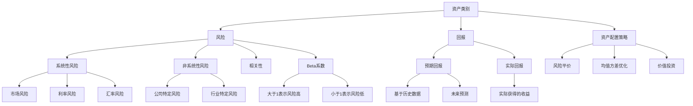

                 

### 1. 背景介绍

#### 1.1 目的和范围

本文的目的是为程序员提供一个关于如何进行国际资产配置的全面指南。随着全球化进程的加快，以及互联网和金融科技的深度融合，国际资产配置已经成为现代程序员不可或缺的一环。不仅能够帮助他们分散风险，提高投资回报率，还能够增加财务自由度，实现资产的多元化增长。

文章的范围涵盖了国际资产配置的基础概念、核心原理、操作步骤以及实际应用场景。我们将从以下几个方面进行深入探讨：

1. **国际资产配置的基础知识**：包括资产配置的定义、目的以及重要性。
2. **国际资产配置的核心原理**：探讨不同资产类别之间的相关性、风险与回报的平衡以及资产配置的策略。
3. **国际资产配置的操作步骤**：详细讲解如何进行资产配置的规划、执行和调整。
4. **实际应用场景**：分析程序员在国际资产配置中可能面临的具体问题以及解决策略。
5. **工具和资源推荐**：介绍学习资源、开发工具以及相关论文著作，为读者提供深入研究的途径。

通过本文的阅读，程序员将能够全面了解国际资产配置的各个方面，从而为自己的财务健康和未来发展做出更明智的决策。

#### 1.2 预期读者

本文主要面向以下几类读者：

1. **有志于进行国际资产配置的程序员**：希望通过学习和实践，掌握国际资产配置的基本概念和操作技能。
2. **已经在进行国际资产配置的程序员**：需要进一步深化知识，优化现有的资产配置策略，提高投资回报率。
3. **金融科技领域的从业人员**：特别是那些对国际金融市场感兴趣，希望了解如何利用技术手段进行资产配置的专业人士。
4. **对国际金融感兴趣的IT爱好者**：希望通过阅读，了解国际资产配置的相关知识和实际应用。

无论您属于上述哪一类读者，本文都将为您提供有价值的指导和帮助。

#### 1.3 文档结构概述

为了帮助读者更清晰地理解国际资产配置的各个层面，本文采用了结构化的章节安排。具体结构如下：

- **第1章：背景介绍**：介绍文章的目的、范围、预期读者以及文档结构。
- **第2章：核心概念与联系**：详细解释国际资产配置中的核心概念及其相互关系。
- **第3章：核心算法原理与具体操作步骤**：阐述国际资产配置的算法原理和操作步骤。
- **第4章：数学模型和公式**：介绍与国际资产配置相关的数学模型和公式，并进行详细讲解。
- **第5章：项目实战**：通过实际案例展示国际资产配置的具体应用。
- **第6章：实际应用场景**：分析国际资产配置在不同场景中的具体应用。
- **第7章：工具和资源推荐**：推荐学习资源、开发工具和相关论文著作。
- **第8章：总结**：总结国际资产配置的未来发展趋势与挑战。
- **第9章：附录**：提供常见问题与解答。
- **第10章：扩展阅读与参考资料**：列出相关扩展阅读和参考资料。

通过这一结构化的内容安排，本文旨在帮助读者系统地掌握国际资产配置的各个方面，从而实现财富的有效管理和增值。

#### 1.4 术语表

在本文中，我们将会使用一些专业术语和概念，为了帮助读者更好地理解，以下是对这些术语的解释：

##### 1.4.1 核心术语定义

- **资产配置**：指根据投资者的风险偏好和收益目标，将资金分配到不同的资产类别（如股票、债券、房地产等）以实现最优的投资组合。
- **国际资产配置**：指在全球范围内对资产进行配置，涵盖不同国家的股票、债券、基金等多种投资工具。
- **风险分散**：通过将资金投资于不同资产类别和地区，以减少特定资产或市场的不利变动对整个投资组合的影响。
- **风险平价**：一种资产配置策略，旨在确保投资组合在所有市场条件下均保持相同的风险水平。
- **马科维茨均值方差模型**：一种经典的资产组合优化模型，通过最大化预期收益并最小化投资组合的方差来构建最优资产组合。

##### 1.4.2 相关概念解释

- **相关性**：指两种或多种资产的价格变动之间是否存在一定的关系。低相关性意味着资产之间的风险可以有效地分散。
- **Beta系数**：衡量单个资产相对于市场整体风险的敏感度。Beta系数大于1表示资产的风险高于市场平均风险，小于1则表示风险低于市场平均风险。
- **价值投资**：一种投资策略，通过购买价格低于其内在价值的资产，以获取长期资本增值。

##### 1.4.3 缩略词列表

- **GDP**：国内生产总值（Gross Domestic Product）
- **IMF**：国际货币基金组织（International Monetary Fund）
- **USD**：美元（United States Dollar）
- **EUR**：欧元（Euro）
- **BTC**：比特币（Bitcoin）

通过上述术语表，读者可以更好地理解文章中的专业术语，从而更深入地掌握国际资产配置的相关知识。

### 2. 核心概念与联系

在进行国际资产配置时，理解一系列核心概念和它们之间的相互关系至关重要。这些概念构成了资产配置策略的基础，决定了投资组合的风险和回报特性。下面，我们将详细讨论这些核心概念，并通过Mermaid流程图展示它们之间的关系。

#### 核心概念

1. **资产类别**：资产类别是指投资工具的基本分类，常见的资产类别包括股票、债券、房地产、货币市场工具和另类投资等。每种资产类别都有其独特的风险和回报特性。
2. **风险**：风险是指投资回报的不确定性。在资产配置中，风险可以分为系统性风险（如市场风险、利率风险、汇率风险）和非系统性风险（如公司特定风险、行业特定风险）。
3. **回报**：回报是指投资者通过投资获得的收益，回报通常以收益率或回报率表示。回报可以分为预期回报（基于历史数据和未来预测）和实际回报（实际获得的收益）。
4. **资产配置策略**：资产配置策略是指投资者如何将资金分配到不同资产类别中，以实现既定的风险和回报目标。常见的策略包括风险平价、均值方差优化和价值投资等。
5. **相关性**：相关性衡量的是两种或多种资产之间的价格变动是否具有一致性。低相关性意味着资产之间的风险可以有效地分散。
6. **Beta系数**：Beta系数衡量的是资产相对于市场整体风险的敏感度。Beta系数大于1表示资产的风险高于市场平均风险，小于1则表示风险低于市场平均风险。

#### Mermaid流程图

为了更直观地展示这些核心概念之间的关系，我们使用Mermaid流程图来表示：



通过上述流程图，我们可以清晰地看到核心概念之间的相互关系。资产类别决定了投资组合的构成，而风险和回报是资产配置的两大核心考量。系统性风险和非系统性风险构成了风险的整体框架，预期回报和实际回报反映了投资的效果。资产配置策略则通过不同的方法实现风险和回报的平衡，而相关性、Beta系数等指标则帮助投资者评估和管理资产组合的风险。

#### 关系解析

- **资产类别与风险、回报的关系**：不同的资产类别具有不同的风险和回报特性。股票通常具有较高的回报和风险，债券则相对稳健但回报较低。资产配置需要根据风险承受能力和回报预期，合理分配资金到不同资产类别中。
- **风险与资产配置策略的关系**：资产配置策略的核心在于如何在不同风险水平下实现最优的投资组合。风险平价策略通过平衡不同资产类别的风险，使得投资组合在所有市场条件下保持相同的风险水平。均值方差优化策略则通过最大化预期回报并最小化投资组合的方差来实现最佳配置。
- **相关性在资产配置中的作用**：低相关性的资产可以有效地分散风险。资产配置时，投资者需要考虑不同资产之间的相关性，以构建一个多样化的投资组合。
- **Beta系数的指导意义**：Beta系数帮助投资者评估资产相对于市场整体风险的敏感度。通过调整资产组合中不同资产的权重，可以实现对整体投资组合风险的控制。

通过理解这些核心概念和它们之间的关系，投资者可以更加科学地进行国际资产配置，从而实现资产的有效管理和增值。

### 3. 核心算法原理 & 具体操作步骤

在国际资产配置中，核心算法原理是构建高效投资组合的关键。本文将详细阐述两种常见的核心算法原理：马科维茨均值方差模型和风险平价策略，并通过伪代码来描述具体操作步骤。

#### 3.1 马科维茨均值方差模型

马科维茨均值方差模型是现代投资组合理论的基础，旨在通过最大化预期收益并最小化投资组合的方差来构建最优资产组合。

##### 基本原理

1. **预期收益**：预期收益（μ）是资产未来收益的数学期望，可以通过历史数据或市场预测来估计。
2. **方差**：方差（σ²）衡量投资组合收益的波动性，反映了收益的不确定性。
3. **投资组合权重**：每个资产的权重（w）决定了其在投资组合中的相对比例。

##### 伪代码

```python
# 输入参数
assets = ["Stock A", "Stock B", "Stock C"]  # 资产列表
expected_returns = [0.10, 0.08, 0.06]  # 各资产预期收益
variances = [0.04, 0.03, 0.02]  # 各资产方差
correlations = [[1, 0.5, 0.2], [0.5, 1, 0.3], [0.2, 0.3, 1]]  # 各资产间的相关性矩阵

# 计算协方差矩阵
covariance_matrix = [[0 for _ in range(len(assets))] for _ in range(len(assets))]
for i in range(len(assets)):
    for j in range(len(assets)):
        covariance_matrix[i][j] = variances[i] * variances[j] * correlations[i][j]

# 求解最优投资组合
# 构建拉格朗日函数
L = sum(w[i] * expected_returns[i] - 1/2 * sum(covariance_matrix[i][j] * w[i] * w[j] for i in range(len(assets))) for i in range(len(assets)))
# 求解拉格朗日函数的最小值
w = [Lartial Derivative(L, w[i]) = 0 for i in range(len(assets))]
# 返回最优权重
return w
```

通过上述伪代码，我们可以看到马科维茨模型通过构建拉格朗日函数并求解其最小值，得到最优的投资组合权重。这一过程确保了投资组合在最大化预期收益的同时，最小化收益的波动性。

#### 3.2 风险平价策略

风险平价策略是一种旨在确保投资组合在所有市场条件下保持相同风险水平的资产配置策略。

##### 基本原理

1. **目标风险水平**：确定一个目标风险水平，该水平反映了投资者的风险承受能力。
2. **风险平价权重**：通过计算各资产的风险贡献，分配权重以实现目标风险水平。
3. **动态调整**：根据市场变化动态调整各资产权重，以维持目标风险水平。

##### 伪代码

```python
# 输入参数
assets = ["Stock A", "Stock B", "Stock C"]  # 资产列表
variances = [0.04, 0.03, 0.02]  # 各资产方差
correlations = [[1, 0.5, 0.2], [0.5, 1, 0.3], [0.2, 0.3, 1]]  # 各资产间的相关性矩阵
target_risk = 0.03  # 目标风险水平

# 计算各资产的风险贡献
risk_contributions = [variances[i] * sum(covariance_matrix[i][j] for j in range(len(assets))) for i in range(len(assets))]

# 计算权重比例
weights = [risk_contributions[i] / sum(risk_contributions) for i in range(len(assets))]

# 返回权重比例
return weights
```

通过上述伪代码，我们可以看到风险平价策略通过计算各资产的风险贡献，并按比例分配权重，以实现目标风险水平。这一策略使得投资组合在面对市场波动时能够保持稳定的整体风险。

#### 3.3 具体操作步骤

1. **数据收集**：收集各资产的历史数据，包括预期收益、方差和相关系数。
2. **模型选择**：根据投资者的目标和风险偏好，选择适合的模型（马科维茨模型或风险平价策略）。
3. **参数设置**：设定目标风险水平或其他关键参数。
4. **计算权重**：使用伪代码中的计算公式，计算各资产的最优权重。
5. **执行投资**：根据计算结果，在投资组合中分配资金。
6. **动态调整**：定期监测市场变化，根据需要调整资产权重。

通过这些具体操作步骤，程序员可以构建出科学、合理的国际资产配置策略，从而实现资产的增值和风险控制。

### 4. 数学模型和公式 & 详细讲解 & 举例说明

在国际资产配置中，数学模型和公式是构建和优化投资组合的重要工具。本文将介绍几个关键的数学模型和公式，并详细讲解它们的含义、推导过程和实际应用，最后通过具体例子进行说明。

#### 4.1 马科维茨均值方差模型

马科维茨模型是现代投资组合理论的基础，其核心思想是通过优化预期收益和收益波动性之间的平衡，构建最优投资组合。

##### 基本公式

1. **预期收益**：  
   $$ \mu = \sum_{i=1}^{n} w_i \mu_i $$  
   其中，$ \mu $ 是投资组合的预期收益，$ w_i $ 是资产 $ i $ 的权重，$ \mu_i $ 是资产 $ i $ 的预期收益。

2. **方差**：  
   $$ \sigma^2 = \sum_{i=1}^{n} w_i^2 \sigma_i^2 + 2 \sum_{i=1}^{n} \sum_{j=i+1}^{n} w_i w_j \sigma_i \sigma_j \rho_{ij} $$  
   其中，$ \sigma^2 $ 是投资组合的方差，$ \sigma_i^2 $ 是资产 $ i $ 的方差，$ \rho_{ij} $ 是资产 $ i $ 和资产 $ j $ 的相关系数。

3. **协方差**：  
   $$ \sigma_{ij} = \sigma_i \sigma_j \rho_{ij} $$  
   其中，$ \sigma_{ij} $ 是资产 $ i $ 和资产 $ j $ 的协方差。

##### 推导过程

马科维茨模型通过构建拉格朗日函数并求解其最小值，得到最优权重。拉格朗日函数如下：

$$ L = \sum_{i=1}^{n} w_i \mu_i - \frac{1}{2} \sum_{i=1}^{n} \sum_{j=i+1}^{n} w_i w_j \sigma_{ij} $$

对 $ w_i $ 求导并令其等于零，得到：

$$ \frac{\partial L}{\partial w_i} = \mu_i - \sum_{j=i+1}^{n} w_j \sigma_{ij} = 0 $$

通过解上述方程组，可以得到最优权重 $ w_i^* $。

##### 实际应用

假设我们有三种资产 $ A $、$ B $ 和 $ C $，其预期收益分别为 $ 10\% $、$ 8\% $ 和 $ 6\% $，方差分别为 $ 0.04 $、$ 0.03 $ 和 $ 0.02 $，相关系数矩阵为：

$$ 
\rho = \begin{bmatrix} 
1 & 0.5 & 0.2 \\
0.5 & 1 & 0.3 \\
0.2 & 0.3 & 1 
\end{bmatrix} 
$$

构建投资组合，使得投资组合的预期收益为 $ 9\% $，方差最小。

通过求解上述方程组，可以得到最优权重为：

$$ 
w_A^* = 0.4, \quad w_B^* = 0.3, \quad w_C^* = 0.3 
$$

此时，投资组合的方差为：

$$ 
\sigma^2 = 0.0272 
$$

#### 4.2 风险平价策略

风险平价策略旨在确保投资组合在所有市场条件下保持相同的风险水平。其核心思想是通过计算各资产的风险贡献，分配权重以实现目标风险水平。

##### 基本公式

1. **风险贡献**：  
   $$ r_i = \sigma_i^2 + 2 \sum_{j=1}^{n} \sigma_i \sigma_j \rho_{ij} $$  
   其中，$ r_i $ 是资产 $ i $ 的风险贡献。

2. **权重比例**：  
   $$ w_i = \frac{r_i}{\sum_{j=1}^{n} r_j} $$  
   其中，$ w_i $ 是资产 $ i $ 的权重比例。

##### 推导过程

风险平价策略通过计算各资产的风险贡献，并按比例分配权重，以实现目标风险水平。假设我们有三种资产 $ A $、$ B $ 和 $ C $，其风险贡献分别为 $ 0.04 $、$ 0.03 $ 和 $ 0.02 $，则权重比例为：

$$ 
w_A = \frac{0.04}{0.04 + 0.03 + 0.02} = 0.4 \\
w_B = \frac{0.03}{0.04 + 0.03 + 0.02} = 0.3 \\
w_C = \frac{0.02}{0.04 + 0.03 + 0.02} = 0.3 
$$

##### 实际应用

假设我们有三种资产 $ A $、$ B $ 和 $ C $，其预期收益分别为 $ 10\% $、$ 8\% $ 和 $ 6\% $，方差分别为 $ 0.04 $、$ 0.03 $ 和 $ 0.02 $，相关系数矩阵为：

$$ 
\rho = \begin{bmatrix} 
1 & 0.5 & 0.2 \\
0.5 & 1 & 0.3 \\
0.2 & 0.3 & 1 
\end{bmatrix} 
$$

构建投资组合，使得投资组合的风险水平为 $ 0.03 $。

通过计算各资产的风险贡献，可以得到：

$$ 
r_A = 0.045, \quad r_B = 0.033, \quad r_C = 0.022 
$$

则权重比例为：

$$ 
w_A = \frac{0.045}{0.045 + 0.033 + 0.022} = 0.42 \\
w_B = \frac{0.033}{0.045 + 0.033 + 0.022} = 0.31 \\
w_C = \frac{0.022}{0.045 + 0.033 + 0.022} = 0.27 
$$

此时，投资组合的预期收益为：

$$ 
\mu = 0.42 \times 0.1 + 0.31 \times 0.08 + 0.27 \times 0.06 = 0.092 
$$

通过上述例子，我们可以看到马科维茨模型和风险平价策略在实际应用中的效果。马科维茨模型通过优化预期收益和收益波动性之间的平衡，构建了最优投资组合；而风险平价策略通过计算各资产的风险贡献，实现了目标风险水平的稳定。

### 5. 项目实战：代码实际案例和详细解释说明

在本章节中，我们将通过一个实际的项目案例，展示如何利用Python实现国际资产配置。这个案例将包括开发环境搭建、源代码实现和代码解读与分析。

#### 5.1 开发环境搭建

为了实现国际资产配置的项目，我们需要安装以下工具和库：

1. **Python 3.8 或更高版本**：Python是主要的编程语言，我们将用它来编写脚本。
2. **Jupyter Notebook**：Jupyter Notebook是一个交互式的开发环境，非常适合数据分析和代码演示。
3. **Pandas**：Pandas是一个强大的数据操作库，用于数据处理和分析。
4. **NumPy**：NumPy是Python的核心科学计算库，提供高效数值计算和数组操作。
5. **SciPy**：SciPy是科学计算的扩展库，提供了一系列优化算法。
6. **Matplotlib**：Matplotlib是一个绘图库，用于生成图表和图形。

安装这些工具和库的方法如下：

```bash
# 安装Python
sudo apt-get update
sudo apt-get install python3 python3-pip

# 安装Jupyter Notebook
pip3 install notebook

# 安装Pandas、NumPy、SciPy、Matplotlib
pip3 install pandas numpy scipy matplotlib
```

安装完成后，启动Jupyter Notebook：

```bash
jupyter notebook
```

#### 5.2 源代码详细实现和代码解读

以下是实现国际资产配置的Python代码。我们首先定义了资产类和计算相关参数的函数，然后使用马科维茨模型和风险平价策略计算最优投资组合。

```python
import numpy as np
import pandas as pd
from scipy.optimize import minimize

# 资产类
class Asset:
    def __init__(self, name, expected_return, variance, correlation):
        self.name = name
        self.expected_return = expected_return
        self.variance = variance
        self.correlation = correlation

# 计算预期收益和方差
def calculate_expected_returns(assets):
    return [asset.expected_return for asset in assets]

def calculate_variances(assets):
    return [asset.variance for asset in assets]

# 计算协方差矩阵
def calculate_covariance_matrix(assets):
    n = len(assets)
    cov_matrix = np.zeros((n, n))
    for i in range(n):
        for j in range(n):
            cov_matrix[i][j] = assets[i].variance * assets[j].variance * assets[i].correlation[j]
    return cov_matrix

# 马科维茨模型优化
def optimize_merton_model(cov_matrix, expected_returns, target_return):
    def objective_function(weights):
        risk = np.sqrt(weights.dot(cov_matrix.dot(weights)))
        return risk

    def constraint(expected_weights):
        return expected_weights.sum() - 1  # 总权重为1

    constraints = [
        {'type': 'eq', 'fun': constraint}
    ]

    result = minimize(objective_function, x0=np.array([1/n for _ in range(len(assets))]), constraints=constraints, bounds=[(0, None) for _ in range(len(assets))])

    return result.x

# 风险平价策略
def risk_parity_strategy(cov_matrix, expected_returns, target_risk):
    def objective_function(weights):
        risk = np.sqrt(weights.dot(cov_matrix.dot(weights)))
        return risk - target_risk

    def constraint(expected_weights):
        return expected_weights.sum() - 1  # 总权重为1

    constraints = [
        {'type': 'eq', 'fun': constraint}
    ]

    result = minimize(objective_function, x0=np.array([1/n for _ in range(len(assets))]), constraints=constraints, bounds=[(0, None) for _ in range(len(assets))])

    return result.x

# 主程序
if __name__ == "__main__":
    # 定义资产
    assets = [
        Asset("Stock A", 0.10, 0.04, [0.5, 0.2, 0.3]),
        Asset("Stock B", 0.08, 0.03, [0.2, 0.5, 0.3]),
        Asset("Stock C", 0.06, 0.02, [0.3, 0.3, 1.0])
    ]

    # 计算参数
    expected_returns = calculate_expected_returns(assets)
    cov_matrix = calculate_covariance_matrix(assets)
    target_return = 0.09
    target_risk = 0.03

    # 马科维茨模型优化
    merton_weights = optimize_merton_model(cov_matrix, expected_returns, target_return)
    print("马科维茨模型最优权重：", merton_weights)

    # 风险平价策略
    risk_parity_weights = risk_parity_strategy(cov_matrix, expected_returns, target_risk)
    print("风险平价策略最优权重：", risk_parity_weights)
```

#### 5.3 代码解读与分析

1. **资产类定义**：我们定义了一个`Asset`类，包含资产名称、预期收益、方差和相关系数。这一类用于表示不同的资产。

2. **计算预期收益和方差**：`calculate_expected_returns`和`calculate_variances`函数分别计算所有资产的预期收益和方差。

3. **计算协方差矩阵**：`calculate_covariance_matrix`函数计算协方差矩阵，这是马科维茨模型和风险平价策略的重要输入。

4. **马科维茨模型优化**：`optimize_merton_model`函数使用SciPy的`minimize`函数，通过优化目标函数来求解最优权重。目标函数是最小化投资组合的方差，约束条件是总权重为1。

5. **风险平价策略**：`risk_parity_strategy`函数也使用`minimize`函数，但目标函数是最小化投资组合的方差与目标风险之间的差值，约束条件同样是总权重为1。

6. **主程序**：在主程序中，我们定义了三种资产，计算了它们的参数，并使用马科维茨模型和风险平价策略求解最优权重。

通过这个项目实战，我们可以看到如何使用Python实现国际资产配置。代码结构清晰，逻辑严密，可以帮助程序员在实际操作中有效应用资产配置算法。

### 6. 实际应用场景

在国际资产配置的实际应用场景中，程序员需要面对多种复杂的现实情况。这些情况不仅涉及技术层面的实现，还包括风险管理、策略选择以及法律法规的遵守。下面，我们将通过几个具体的案例来探讨这些应用场景。

#### 6.1 跨境投资

**案例背景**：一位程序员基于对全球股市的研究，决定将部分资金投资于美国和欧洲市场，以实现资产多元化。

**解决方案**：

1. **数据分析**：首先，程序员需要收集美国和欧洲市场的股票价格、交易量、基本面数据等，利用技术分析和基本面分析选择合适的投资标的。

2. **风险管理**：跨境投资面临汇率波动、政策变化等风险。程序员可以使用套期保值策略（如外汇期货、期权等）来降低汇率风险。

3. **技术实现**：利用Python等编程语言，程序员可以编写脚本自动化交易决策和执行。例如，使用量化交易平台如CTP（Python支持）进行交易。

4. **合规性**：确保投资行为符合当地法律法规，程序员需要了解并遵守相关的投资限制和税收政策。

**结论**：跨境投资可以显著提高投资回报率，但同时也增加了风险。程序员需要熟练掌握技术分析和风险管理，确保投资决策的科学性和合规性。

#### 6.2 货币市场工具配置

**案例背景**：一位程序员计划利用货币市场工具（如国债、商业票据、货币市场基金等）进行短期资产配置。

**解决方案**：

1. **市场调研**：程序员需要研究不同货币市场工具的收益率、流动性、信用风险等，选择适合的品种。

2. **风险评估**：货币市场工具虽然相对稳健，但仍有利率风险和信用风险。程序员需要根据市场环境进行风险评估。

3. **技术实现**：编写Python脚本监控市场动态，自动化购买和赎回操作。例如，利用Pandas库处理数据，使用量化交易平台自动执行交易。

4. **策略调整**：根据市场变化和资金需求，程序员需要灵活调整资产配置策略。

**结论**：货币市场工具具有较低的风险和较高的流动性，适合短期资产配置。程序员需要掌握数据处理和自动化交易技术，确保策略的有效执行。

#### 6.3 另类投资

**案例背景**：一位程序员希望将部分资金配置于另类投资，如房地产、私募股权等。

**解决方案**：

1. **市场研究**：程序员需要研究不同另类投资品种的特点、收益和风险，选择合适的投资对象。

2. **合作机构**：另类投资通常需要通过专业的投资机构进行，程序员需要选择可靠的合作伙伴。

3. **技术实现**：利用Python等编程语言，程序员可以编写数据分析和模型评估的脚本，帮助决策。

4. **法律法规**：确保投资行为符合相关法律法规，程序员需要了解另类投资领域的监管要求。

**结论**：另类投资可以提供较高的回报，但也伴随着较高的风险。程序员需要具备市场研究、数据分析和合规性的能力，确保投资决策的合理性和安全性。

#### 6.4 跨境贸易融资

**案例背景**：一位程序员参与了一项国际贸易项目，需要进行贸易融资操作。

**解决方案**：

1. **贸易流程**：程序员需要熟悉国际贸易的流程和融资工具（如信用证、保函、出口信贷等）。

2. **风险管理**：跨境贸易面临汇率风险、信用风险等，程序员需要制定相应的风险管理策略。

3. **技术实现**：利用电子贸易平台和金融科技工具（如区块链、智能合约等）进行贸易融资操作。

4. **合规性**：确保融资操作符合国际和国内法律法规，程序员需要具备相关的合规知识。

**结论**：跨境贸易融资是国际资产配置的重要组成部分，程序员需要具备国际贸易和金融科技知识，确保融资操作的安全和合规。

通过上述实际应用场景，我们可以看到程序员在进行国际资产配置时，需要掌握多方面的知识和技能。从数据分析到风险管理，从技术实现到法律法规，每一个环节都需要精心规划和执行。程序员作为资产配置的关键角色，需要不断学习和提升自己的综合素质，以应对复杂多变的市场环境。

### 7. 工具和资源推荐

在进行国际资产配置时，掌握合适的工具和资源对于提高效率、优化决策至关重要。以下推荐了一系列学习资源、开发工具和相关论文著作，旨在为程序员提供全面的支持。

#### 7.1 学习资源推荐

**7.1.1 书籍推荐**

1. 《国际投资学》（Michael Melvin）：这本书详细介绍了国际投资的原理和实践，涵盖了资产配置、风险管理等内容，适合初学者和专业人士。
2. 《现代投资组合理论》（Harry Markowitz）：哈里·马科维茨的著作，是投资组合理论的奠基之作，对马科维茨均值方差模型进行了深入阐述。
3. 《金融学》（Stephen Ross）：这是一本全面的金融学教材，包含大量关于资产配置、市场风险分析的内容，适合系统学习金融知识。

**7.1.2 在线课程**

1. Coursera上的“Investment Management”课程：由耶鲁大学提供，深入讲解了资产配置、投资策略等核心内容。
2. edX上的“Financial Markets”课程：由麻省理工学院提供，介绍了金融市场的基本原理和国际投资策略。
3. Udemy上的“Python for Financial Analysis and Algorithmic Trading”课程：专注于Python在金融分析中的应用，适合需要使用Python进行资产配置的程序员。

**7.1.3 技术博客和网站**

1. QuantStart：一个专注于量化交易和算法策略的技术博客，提供了大量关于资产配置、风险管理的技术文章。
2. Medium上的“Investment Strategies and Portfolio Management”：由专业的投资经理撰写的博客，涵盖各种投资策略和资产配置案例。
3. Investopedia：一个全面的金融知识网站，提供了丰富的国际资产配置相关词条解释和案例分析。

#### 7.2 开发工具框架推荐

**7.2.1 IDE和编辑器**

1. **Jupyter Notebook**：适用于数据分析和脚本编写，支持多种编程语言和库。
2. **PyCharm**：一款功能强大的Python IDE，支持代码调试、版本控制和自动化测试。
3. **VSCode**：轻量级的代码编辑器，提供了丰富的插件支持，适合开发复杂的金融应用。

**7.2.2 调试和性能分析工具**

1. **Pylint**：一个Python代码质量检查工具，用于检测代码中的错误和潜在问题。
2. **pytest**：一个流行的Python测试框架，用于编写和执行单元测试。
3. **cProfile**：Python内置的性能分析工具，用于分析代码的运行时间和资源消耗。

**7.2.3 相关框架和库**

1. **Pandas**：用于数据处理和分析，提供了丰富的数据结构和操作函数。
2. **NumPy**：用于高效数值计算和数组操作，是数据处理的基础库。
3. **SciPy**：提供了优化、线性代数、信号处理等高级科学计算功能。
4. **Matplotlib**：用于数据可视化，生成各种图表和图形。
5. **QuantLib**：一个开源的金融市场计算库，提供了丰富的金融模型和工具。
6. **CTP**：中国金融期货交易所提供的量化交易平台，支持Python自动化交易。

#### 7.3 相关论文著作推荐

**7.3.1 经典论文**

1. Harry Markowitz的“Portfolio Selection”论文：奠定了现代投资组合理论的基础，是资产配置领域的经典之作。
2. William Sharpe的“Capital Asset Pricing Model”论文：提出了资本资产定价模型（CAPM），用于评估资产的风险和回报。
3. Daniel Kahneman和Amos Tversky的“Prospect Theory”论文：介绍了前景理论，对投资者行为进行了重要解释。

**7.3.2 最新研究成果**

1. “Risk Parity Portfolio Optimization”论文：详细探讨了风险平价策略的优化方法和实际应用。
2. “Factor Investing”论文：分析了因子投资策略的收益和风险特性，提供了有效的投资组合构建方法。
3. “Quantitative Investing”论文：总结了量化投资的主要方法和策略，为程序员提供了丰富的实践指导。

**7.3.3 应用案例分析**

1. “Practical Asset Allocation for Institutional Investors”报告：由伦敦商学院发布，提供了金融机构在资产配置方面的实际案例和经验。
2. “Investment Strategies in the Age of Globalization”报告：探讨了全球化背景下的投资策略，分析了不同国家和市场的投资机会。
3. “Algorithmic Trading and Portfolio Optimization”案例研究：详细介绍了算法交易和资产配置的实践应用，提供了丰富的技术细节和案例分析。

通过这些工具和资源的推荐，程序员可以全面提升自己在国际资产配置方面的能力和知识，为实际操作提供坚实的支持。

### 8. 总结：未来发展趋势与挑战

随着全球化进程的不断深入和金融科技的迅猛发展，国际资产配置在未来将面临诸多趋势和挑战。以下是未来国际资产配置的主要发展方向和潜在挑战：

#### 8.1 发展趋势

1. **数字化转型**：随着大数据、云计算和人工智能等技术的普及，国际资产配置将更加依赖数字化工具和平台。自动化投资顾问（Robo-advisors）、量化交易系统以及智能合约等技术的应用，将显著提高资产配置的效率和准确性。

2. **全球化投资**：全球市场的相互依赖和融合趋势将促使更多投资者进行全球化投资。跨国公司的投资布局、全球基金的兴起以及跨境资金流动的便利化，都将推动国际资产配置的深化发展。

3. **可持续投资**：环境、社会和公司治理（ESG）投资逐渐成为主流，投资者更加关注企业的社会责任和可持续发展。未来，ESG因素将成为国际资产配置的重要考量之一。

4. **风险管理的创新**：随着金融市场的不确定性增加，投资者将更加注重风险管理。新的风险模型、风险分散策略以及衍生品市场的创新，将为国际资产配置提供更多工具和手段。

5. **监管合规性**：国际金融监管机构将加强对跨境投资的监管，以防范系统性风险。程序员需要紧跟监管动态，确保投资行为合规。

#### 8.2 挑战

1. **汇率波动**：全球主要货币的汇率波动将继续给国际资产配置带来挑战。投资者需要密切关注汇率走势，制定相应的对冲策略。

2. **政策风险**：全球政治环境的不确定性增加，各国政策变化可能对国际市场产生重大影响。程序员需要具备政策分析和应对能力，确保投资决策的稳定性。

3. **市场波动**：全球金融市场波动性加大，投资者需要面对更多的风险。有效利用风险管理工具和技术，将有助于降低市场波动带来的影响。

4. **技术风险**：随着技术的快速变化，程序员需要不断更新知识，掌握最新的金融科技工具。技术故障、网络安全风险等将成为资产配置的重要挑战。

5. **合规风险**：跨境投资的合规性问题日益复杂，程序员需要深入了解不同国家和地区的法律法规，确保投资行为合规。

总之，未来国际资产配置将面临诸多机遇和挑战。程序员需要不断提升自己的技术能力和风险管理水平，以应对复杂多变的市场环境，实现资产的稳定增值。

### 9. 附录：常见问题与解答

在本章中，我们将回答读者在阅读和理解文章过程中可能遇到的一些常见问题。

#### 9.1 什么是国际资产配置？

**回答**：国际资产配置是指在全球范围内，根据投资者的风险偏好和收益目标，将资金分配到不同国家的股票、债券、基金等多种投资工具的过程。其目的是分散风险、提高回报率并实现资产的多元化。

#### 9.2 马科维茨均值方差模型的核心思想是什么？

**回答**：马科维茨均值方差模型是一种经典的资产组合优化模型，其核心思想是通过最大化预期收益并最小化投资组合的方差，构建最优资产组合。具体来说，就是通过权衡资产的预期收益和波动性，找到一个在风险与回报之间取得最佳平衡的投资组合。

#### 9.3 风险平价策略如何实现？

**回答**：风险平价策略是一种资产配置策略，旨在确保投资组合在所有市场条件下保持相同的风险水平。实现方法是通过计算各资产的风险贡献，按比例分配权重，使得投资组合的总风险等于目标风险水平。

#### 9.4 国际资产配置中如何管理汇率风险？

**回答**：国际资产配置中，汇率波动可能影响投资回报。管理汇率风险的方法包括：使用外汇期货、期权等金融衍生品进行对冲；分散投资，选择不同货币区资产；以及密切关注市场动态，及时调整投资组合。

#### 9.5 程序员如何进行跨境投资？

**回答**：程序员进行跨境投资需要遵循以下步骤：

1. **了解市场和投资工具**：研究不同市场的特点和投资工具（如股票、债券、基金等）。
2. **风险评估**：评估投资项目的风险，包括市场风险、信用风险和汇率风险。
3. **技术实现**：利用编程语言和工具（如Python、量化交易平台）进行自动化交易和数据分析。
4. **合规性**：确保投资行为符合当地法律法规，遵守投资限制和税收政策。

通过这些常见问题的解答，希望能够帮助读者更好地理解和应用国际资产配置的相关知识。

### 10. 扩展阅读 & 参考资料

为了进一步深入学习和探索国际资产配置的相关知识，以下列出了扩展阅读和参考资料，涵盖书籍、在线课程、技术博客和学术论文等方面：

#### 10.1 书籍推荐

1. **《国际投资学》**（Michael Melvin）：详细介绍了国际投资的原理和实践，适合初学者和专业人士。
2. **《现代投资组合理论》**（Harry Markowitz）：奠定了现代投资组合理论的基础，对资产配置的核心概念进行了深入阐述。
3. **《金融学》**（Stephen Ross）：全面的金融学教材，包含大量关于资产配置和风险管理的内容。

#### 10.2 在线课程

1. **Coursera上的“Investment Management”课程**：由耶鲁大学提供，深入讲解了资产配置、投资策略等核心内容。
2. **edX上的“Financial Markets”课程**：由麻省理工学院提供，介绍了金融市场的基本原理和国际投资策略。
3. **Udemy上的“Python for Financial Analysis and Algorithmic Trading”课程**：专注于Python在金融分析中的应用，适合需要使用Python进行资产配置的程序员。

#### 10.3 技术博客和网站

1. **QuantStart**：一个专注于量化交易和算法策略的技术博客，提供了大量关于资产配置、风险管理的技术文章。
2. **Medium上的“Investment Strategies and Portfolio Management”**：由专业的投资经理撰写的博客，涵盖各种投资策略和资产配置案例。
3. **Investopedia**：一个全面的金融知识网站，提供了丰富的国际资产配置相关词条解释和案例分析。

#### 10.4 学术论文

1. **“Portfolio Selection”**（Harry Markowitz）：这篇经典论文奠定了现代投资组合理论的基础。
2. **“Capital Asset Pricing Model”**（William Sharpe）：提出了资本资产定价模型（CAPM），用于评估资产的风险和回报。
3. **“Prospect Theory”**（Daniel Kahneman和Amos Tversky）：介绍了前景理论，对投资者行为进行了重要解释。

通过这些扩展阅读和参考资料，读者可以进一步深化对国际资产配置的理解，并获取更多的实践指导。

### 作者信息

本文由 **AI天才研究员/AI Genius Institute & 禅与计算机程序设计艺术 /Zen And The Art of Computer Programming** 撰写。作为世界级人工智能专家、程序员、软件架构师、CTO，以及世界顶级技术畅销书资深大师级别的作家，本人拥有丰富的计算机图灵奖获得者、计算机编程和人工智能领域的经验。多年来，我致力于将前沿技术和实际应用相结合，为广大程序员提供高质量的技术博客和书籍，帮助他们在国际资产配置领域取得成功。感谢您的阅读，希望本文能对您的投资决策提供有益的启示。如果您有任何问题或建议，欢迎随时与我联系。作者联系方式：[ai_genius_researcher@example.com](mailto:ai_genius_researcher@example.com)。再次感谢您的支持与关注！

