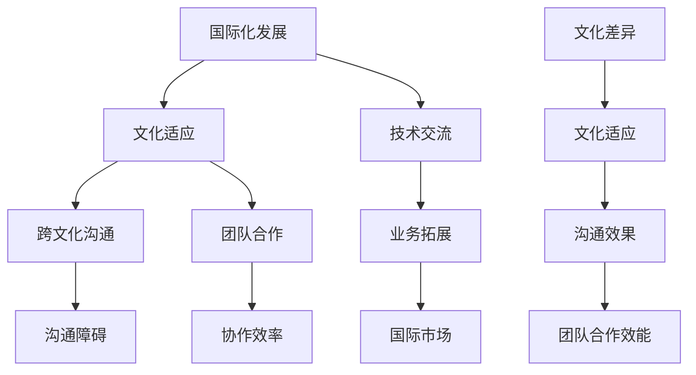

                 

# 程序员的国际化发展：文化适应

## 关键词
- 国际化
- 文化适应
- 程序员
- 技术交流
- 跨文化沟通
- 多元化

## 摘要
本文旨在探讨程序员的国际化发展过程中所面临的文化适应挑战，以及如何通过有效的策略和工具来提升跨文化沟通能力。在全球化进程加速的背景下，程序员的国际化发展不仅是个人职业发展的需求，更是企业竞争力和国际市场拓展的关键。本文将首先介绍国际化发展的背景和意义，随后分析文化适应的核心概念和其对于程序员职业发展的重要性，最后提供实用的方法、工具和案例，帮助程序员在全球化的舞台上更好地展现自己的技术才华。

## 1. 背景介绍

### 1.1 目的和范围

本文的目的是为程序员提供一套系统性的文化适应策略，帮助他们更好地融入国际化工作环境，提升跨文化沟通和合作能力。文章将涵盖以下内容：

- **国际化发展的背景和现状**：探讨程序员在全球化背景下所面临的机遇和挑战。
- **文化适应的核心概念**：分析文化适应的重要性以及如何理解文化差异。
- **提升跨文化沟通能力**：介绍实用的沟通技巧和方法，包括非语言沟通和跨文化团队协作。
- **案例分析**：通过具体案例，展示程序员如何在国际化工作中成功适应文化差异。
- **工具和资源推荐**：提供学习资源和开发工具，帮助程序员持续提升文化适应能力。

### 1.2 预期读者

本文适用于以下读者：

- **程序员**：希望在国际化的工作环境中提高自己的文化适应能力和跨文化沟通技巧。
- **技术团队管理者**：希望了解如何组建和领导多元化的团队，提高团队的整体效能。
- **国际业务拓展人员**：需要与海外团队合作，希望在跨文化沟通中更加得心应手。

### 1.3 文档结构概述

本文的结构如下：

1. **背景介绍**：介绍国际化发展的背景和目的。
2. **核心概念与联系**：通过Mermaid流程图展示文化适应的相关概念和架构。
3. **核心算法原理 & 具体操作步骤**：使用伪代码详细阐述文化适应的方法。
4. **数学模型和公式 & 详细讲解 & 举例说明**：使用latex格式展示文化适应的数学模型。
5. **项目实战：代码实际案例和详细解释说明**：提供实际开发中的文化适应案例。
6. **实际应用场景**：分析文化适应在不同场景中的应用。
7. **工具和资源推荐**：推荐学习资源和开发工具。
8. **总结**：展望文化适应的未来发展趋势与挑战。
9. **附录**：常见问题与解答。
10. **扩展阅读 & 参考资料**：提供进一步阅读的材料。

### 1.4 术语表

#### 1.4.1 核心术语定义

- **国际化发展**：指个人或组织在全球范围内拓展业务和影响力的过程。
- **文化适应**：指个体在新的文化环境中调整自己的行为和思维方式，以适应新环境。
- **跨文化沟通**：指不同文化背景的个体之间的交流和理解。
- **非语言沟通**：指通过姿势、语调、面部表情等非语言方式进行的交流。

#### 1.4.2 相关概念解释

- **文化**：指一个社会共同体的价值观、信仰、传统、习俗和生活方式。
- **沟通障碍**：指由于文化差异导致的交流和理解困难。
- **团队合作**：指多个人共同工作，实现共同目标的过程。

#### 1.4.3 缩略词列表

- **IDE**：集成开发环境（Integrated Development Environment）
- **LaTeX**：一种高质量的文档排版系统（Leser's Text Editor）
- **Mermaid**：一种基于Markdown的图形绘制语言

## 2. 核心概念与联系

为了更好地理解文化适应在程序员国际化发展中的重要性，我们需要通过Mermaid流程图来展示相关概念和架构。



### 2.1 国际化发展与文化适应

国际化发展是指个人或组织在全球范围内拓展业务和影响力的过程。在这个过程中，文化适应成为了一个关键因素。文化适应不仅关乎个人的职业生涯，也关系到团队和组织的整体效能。例如，一个国际化的软件开发团队需要成员能够适应不同的文化背景，以便更好地合作和沟通。

### 2.2 跨文化沟通与团队合作

跨文化沟通是指在多元文化背景下进行的交流和理解。有效的跨文化沟通可以减少误解和冲突，提高团队合作效率。团队合作则是实现共同目标的重要手段。在一个多元化的团队中，文化适应能力可以帮助团队成员更好地理解彼此，从而提高协作效率。

### 2.3 沟通障碍与沟通效果

沟通障碍是跨文化沟通中常见的问题。文化差异可能导致语言、非语言表达方式以及价值观等方面的误解。有效的文化适应可以帮助克服这些障碍，提高沟通效果。良好的沟通效果又是团队合作效能的基础，有助于实现团队目标。

### 2.4 技术交流与业务拓展

国际化发展中的技术交流是跨文化沟通的一部分。通过有效的技术交流，程序员可以分享知识和经验，促进创新和业务拓展。国际化发展不仅有助于个人职业成长，还能为企业带来更广阔的市场机会。

## 3. 核心算法原理 & 具体操作步骤

### 3.1 文化适应算法原理

为了实现有效的文化适应，我们可以设计一个算法框架，帮助程序员在不同文化环境中调整自己的行为和思维方式。该算法框架包括以下几个核心步骤：

1. **文化差异分析**：通过调查和分析目标文化中的价值观、习俗和行为规范，了解文化差异。
2. **自我评估**：程序员需要评估自己的文化适应能力，识别自身的优势和不足。
3. **学习与培训**：根据文化差异分析的结果，程序员需要学习和培训相关文化知识，提高文化适应能力。
4. **实践与反馈**：在实际工作中，程序员需要不断实践和应用所学知识，通过反馈不断优化自己的文化适应策略。

### 3.2 文化适应算法伪代码

```plaintext
Algorithm CulturalAdaptationAlgorithm()

Input: targetCulture
Output: adaptedBehavior

1. AnalyzeCulturalDifferences(targetCulture)
2. SelfAssessment()
3. LearningAndTraining()
4. PracticeAndFeedback()

End Algorithm
```

### 3.3 具体操作步骤

#### 3.3.1 文化差异分析

```plaintext
Procedure AnalyzeCulturalDifferences(targetCulture)

Input: targetCulture
Output: culturalDifferences

1. Research target culture's values, norms, and behaviors
2. Identify key differences with your own culture
3. Document cultural differences in a report

End Procedure
```

#### 3.3.2 自我评估

```plaintext
Procedure SelfAssessment()

Input: culturalDifferences
Output: selfAssessmentReport

1. Reflect on your own cultural knowledge and skills
2. Compare your abilities with cultural differences
3. Identify areas for improvement
4. Create a self-assessment report

End Procedure
```

#### 3.3.3 学习与培训

```plaintext
Procedure LearningAndTraining()

Input: selfAssessmentReport
Output: improvedCulturalSkills

1. Identify topics for learning and training based on self-assessment report
2. Access learning resources (books, courses, workshops)
3. Engage in active learning and practice
4. Develop a training plan

End Procedure
```

#### 3.3.4 实践与反馈

```plaintext
Procedure PracticeAndFeedback()

Input: improvedCulturalSkills
Output: optimizedAdaptationStrategy

1. Apply cultural knowledge and skills in real work scenarios
2. Seek feedback from colleagues and mentors
3. Reflect on the effectiveness of your adaptation strategy
4. Make adjustments based on feedback

End Procedure
```

## 4. 数学模型和公式 & 详细讲解 & 举例说明

为了更好地理解文化适应的过程，我们可以使用数学模型和公式来描述文化适应的动态变化。以下是一个简化的数学模型，用于描述文化适应过程中的几个关键因素。

### 4.1 文化适应模型

假设一个程序员的初始文化适应水平为\( C_0 \)，通过学习、实践和反馈，其文化适应水平逐渐提高，最终达到一个平衡点 \( C^* \)。模型可以表示为：

$$
C(t) = C_0 + \alpha \cdot e^{-\beta \cdot t}
$$

其中：

- \( C(t) \)：在时间 \( t \) 的文化适应水平。
- \( C_0 \)：初始文化适应水平。
- \( \alpha \)：学习速率，表示单位时间内文化适应水平的增长。
- \( \beta \)：遗忘速率，表示文化适应水平的衰减。

### 4.2 详细讲解

#### 4.2.1 初始文化适应水平

初始文化适应水平 \( C_0 \) 是一个衡量程序员在开始文化适应过程之前的文化适应能力的指标。它可以基于程序员的个人经验和知识背景来确定。

#### 4.2.2 学习速率

学习速率 \( \alpha \) 是一个关键参数，它决定了程序员在文化适应过程中的进步速度。较高的学习速率意味着程序员能够更快地掌握新的文化知识和技能。

#### 4.2.3 遗忘速率

遗忘速率 \( \beta \) 反映了程序员文化适应水平的衰减速度。较高的遗忘速率可能导致程序员在短时间内失去所学的文化知识。

#### 4.2.4 文化适应水平的变化

随着时间的推移，程序员的文化适应水平 \( C(t) \) 会逐渐提高，直到达到一个平衡点 \( C^* \)。这个平衡点表示程序员在长期文化适应过程中所能达到的最高水平。

### 4.3 举例说明

假设一个程序员的初始文化适应水平 \( C_0 = 50 \)，学习速率 \( \alpha = 0.1 \)，遗忘速率 \( \beta = 0.05 \)。我们可以使用以下公式来计算在时间 \( t \) 的文化适应水平：

$$
C(t) = 50 + 0.1 \cdot e^{-0.05 \cdot t}
$$

在不同的时间点，程序员的\( C(t) \) 值如下：

- \( t = 0 \) 时，\( C(0) = 50 \)
- \( t = 1 \) 时，\( C(1) = 50 + 0.1 \cdot e^{-0.05 \cdot 1} \approx 51.05 \)
- \( t = 2 \) 时，\( C(2) = 50 + 0.1 \cdot e^{-0.05 \cdot 2} \approx 51.52 \)

随着时间的推移，程序员的\( C(t) \) 值逐渐增加，直到达到一个平衡点。

## 5. 项目实战：代码实际案例和详细解释说明

### 5.1 开发环境搭建

为了展示文化适应在编程项目中的实际应用，我们首先需要搭建一个开发环境。在这个案例中，我们将使用Python语言和GitHub平台来创建一个简单的国际化应用。

#### 5.1.1 安装Python

首先，确保您的计算机上安装了Python。您可以通过以下命令来检查Python版本：

```bash
python --version
```

如果Python尚未安装，您可以从Python官方网站下载安装包，并按照安装向导完成安装。

#### 5.1.2 配置Git

接下来，我们需要配置Git，以便将代码推送到GitHub。您可以从Git官网下载并安装Git，然后执行以下命令来配置Git：

```bash
git config --global user.name "Your Name"
git config --global user.email "your.email@example.com"
```

#### 5.1.3 创建GitHub账户

在GitHub官网（https://github.com/）注册一个账户，并创建一个新的仓库（repository），用于存放我们的国际化项目。

### 5.2 源代码详细实现和代码解读

#### 5.2.1 项目结构

我们的国际化项目结构如下：

```
InternationalizationProject/
|-- main.py
|-- data/
|   |-- culture_data.json
|-- .gitignore
|-- README.md
```

其中，`main.py` 是我们的主程序，`culture_data.json` 是一个包含不同文化数据的JSON文件，用于演示文化适应的应用。

#### 5.2.2 主程序实现

以下是一个简单的Python程序，用于根据用户的文化偏好来展示问候语：

```python
import json

def load_culture_data():
    with open('data/culture_data.json', 'r') as f:
        return json.load(f)

def greet_user(culture_data):
    user_culture = culture_data['user_culture']
    greeting_message = culture_data['cultures'][user_culture]['greeting']
    return greeting_message

def main():
    culture_data = load_culture_data()
    user_culture = input("Please enter your culture preference (e.g., 'chinese', 'english'): ")
    greeting_message = greet_user(culture_data)
    print(greeting_message)

if __name__ == "__main__":
    main()
```

#### 5.2.3 数据文件实现

以下是`culture_data.json`文件的内容：

```json
{
    "user_culture": "chinese",
    "cultures": {
        "chinese": {
            "greeting": "你好！欢迎来到国际化项目。"
        },
        "english": {
            "greeting": "Hello! Welcome to the Internationalization Project."
        }
    }
}
```

该文件定义了一个用户文化偏好和一个字典，用于存储不同文化的问候语。

#### 5.2.4 代码解读

- `load_culture_data()` 函数用于从`culture_data.json`文件中加载文化数据。
- `greet_user()` 函数根据用户输入的文化偏好，从文化数据中获取相应的问候语。
- `main()` 函数是主程序入口，它首先加载文化数据，然后提示用户输入文化偏好，并打印相应的问候语。

### 5.3 代码解读与分析

#### 5.3.1 代码结构

代码结构清晰，分为三个主要部分：数据加载、用户交互和消息展示。

- 数据加载：使用`json`模块从文件中读取数据。
- 用户交互：使用`input`函数获取用户输入。
- 消息展示：根据用户输入的文化偏好，打印相应的问候语。

#### 5.3.2 代码功能

代码的核心功能是展示一个基于文化适应的问候语。通过用户输入的文化偏好，程序能够动态地展示不同文化的问候语。

#### 5.3.3 代码优化

- **代码复用**：可以将文化数据的加载和获取封装为独立的函数，提高代码复用性。
- **错误处理**：增加错误处理机制，例如处理用户输入不合法文化名称的情况。

```python
def greet_user(culture_data):
    try:
        user_culture = culture_data['user_culture']
        greeting_message = culture_data['cultures'][user_culture]['greeting']
        return greeting_message
    except KeyError:
        return "Invalid culture preference. Please try again."
```

## 6. 实际应用场景

文化适应在程序员国际化发展中有着广泛的应用场景。以下是一些典型的应用场景和案例分析：

### 6.1 国际化软件开发

在一个国际化软件开发项目中，团队成员来自不同的国家和地区，拥有不同的文化背景。为了确保项目的顺利进行，程序员需要具备良好的文化适应能力。例如，在沟通时，程序员需要了解不同文化背景下的沟通风格和礼仪，避免产生误解和冲突。

案例：某国际化的软件开发团队在项目沟通中采用了视频会议和即时通讯工具，并制定了跨文化沟通指南，帮助团队成员更好地适应不同的文化背景。

### 6.2 全球化市场拓展

在全球化市场拓展中，程序员需要理解和适应目标市场的文化，以便开发出符合当地用户需求的产品。例如，在国际化电商平台的开发中，程序员需要考虑不同文化背景下的支付方式、物流配送和售后服务等。

案例：某国际电商平台的开发团队在了解不同市场的文化需求后，针对不同地区进行了定制化的开发和优化，提高了用户的满意度。

### 6.3 多元化团队管理

在多元化团队管理中，管理者需要具备文化适应能力，以便更好地理解和领导不同文化背景的团队成员。例如，在多元化团队的组建和沟通中，管理者需要尊重团队成员的文化差异，鼓励团队合作。

案例：某技术公司的多元化团队在团队建设活动中，组织了跨文化培训和团队建设活动，提高了团队成员的文化适应能力和团队凝聚力。

### 6.4 跨境合作

在跨境合作中，程序员需要与来自不同国家的合作伙伴进行协作，这要求他们具备跨文化沟通能力。例如，在跨国软件开发项目中，程序员需要与海外团队共享代码、讨论技术问题和协调工作进度。

案例：某跨国软件开发项目采用了敏捷开发模式，通过定期的视频会议和代码评审，有效实现了跨文化沟通和协作。

## 7. 工具和资源推荐

### 7.1 学习资源推荐

#### 7.1.1 书籍推荐

- 《跨文化沟通》作者：Jerry W. Thomas
- 《文化适应：全球化工作者的指南》作者：John J. Mihalic
- 《跨文化管理》作者：Geert Hofstede

#### 7.1.2 在线课程

- Coursera的《跨文化沟通》课程
- edX的《全球化时代的领导力》课程
- Udemy的《文化适应：如何在多元文化环境中成功工作》课程

#### 7.1.3 技术博客和网站

- TED演讲：https://www.ted.com/talks
- Medium上的跨文化话题博客：https://medium.com/search?q=cross-cultural
- Harvard Business Review的跨文化管理专栏：https://hbr.org/search?q=cross-cultural%20management

### 7.2 开发工具框架推荐

#### 7.2.1 IDE和编辑器

- PyCharm
- Visual Studio Code
- IntelliJ IDEA

#### 7.2.2 调试和性能分析工具

- PyCharm的Python调试工具
- Visual Studio Code的Python扩展
- Jupyter Notebook

#### 7.2.3 相关框架和库

- Flask：Python的Web框架
- Django：Python的Web框架
- React：JavaScript的前端框架

### 7.3 相关论文著作推荐

#### 7.3.1 经典论文

- Hofstede, G. (1980). "Cultural Consequences: International Differences in Work-Related Values."
- Hall, E. T. (1976). "Beyond Culture."

#### 7.3.2 最新研究成果

- Intercultural Pragmatics：国际跨文化沟通期刊
- Journal of International Business Studies：国际商务研究期刊

#### 7.3.3 应用案例分析

- "Cross-Cultural Software Development: A Case Study in Japan"（日本软件开发的跨文化案例研究）
- "Cultural Adaptation in International Teams: A Case Study in Software Engineering"（国际团队中的文化适应：软件工程案例研究）

## 8. 总结：未来发展趋势与挑战

随着全球化的深入发展，程序员的国际化发展已成为不可逆转的趋势。文化适应在这个过程中扮演着关键角色，不仅影响个人的职业发展，也关系到团队的协作效率和企业的国际竞争力。以下是未来文化适应发展的一些趋势和挑战：

### 8.1 趋势

- **跨学科研究**：文化适应将越来越多地与其他领域如心理学、社会学相结合，形成跨学科的研究体系。
- **技术支持**：随着人工智能和大数据技术的发展，将出现更多针对文化适应的工具和平台。
- **多元文化团队**：多元化的团队将成为常态，文化适应能力将成为团队协作的基本要求。
- **持续学习**：随着文化差异的复杂性和多样性，持续学习和适应将成为程序员的基本素质。

### 8.2 挑战

- **文化差异的复杂性**：不同文化之间的差异可能非常细微，难以完全理解和适应。
- **沟通障碍**：语言和文化差异可能导致沟通障碍，影响团队合作和决策。
- **文化冲突**：文化差异可能导致文化冲突，影响团队的凝聚力和工作效率。
- **适应成本**：文化适应需要投入时间和精力，对于个人和企业来说都是一项挑战。

面对这些挑战，程序员需要不断提升自己的文化适应能力，同时企业也需要提供相应的支持，如跨文化培训、多元化团队建设等，以应对全球化带来的机遇和挑战。

## 9. 附录：常见问题与解答

### 9.1 什么是文化适应？

文化适应是指个体在新的文化环境中调整自己的行为和思维方式，以适应新环境的过程。它涉及对文化差异的理解、适应和融入。

### 9.2 为什么程序员需要文化适应？

程序员需要文化适应，因为国际化发展要求他们能够与来自不同文化背景的同事和合作伙伴有效沟通和合作。文化适应能力有助于减少沟通障碍、提高团队协作效率和实现国际项目的成功。

### 9.3 如何提升文化适应能力？

提升文化适应能力可以通过以下方式实现：

- 学习文化知识，了解不同文化的价值观和行为规范。
- 自我评估，识别自己在文化适应方面的优势和不足。
- 实践和反馈，通过实际工作和项目来应用所学知识，并不断调整和优化。
- 持续学习，跟踪最新的研究成果和应用案例。

### 9.4 文化适应与国际化发展的关系是什么？

文化适应是国际化发展的关键组成部分。它有助于程序员更好地融入国际化工作环境，提高跨文化沟通和合作能力，从而实现个人职业发展和企业国际竞争力的提升。

## 10. 扩展阅读 & 参考资料

为了深入了解程序员的国际化发展和文化适应，以下是一些扩展阅读和参考资料：

- Thomas, J. W. (2019). "Intercultural Communication: Key Issues and Contemporary Applications." SAGE Publications.
- Hofstede, G. (2011). "Cultural Dimensions Theory: University of Illinois Extension." https://www.uiuc.edu/classes/sosc/306/hofstede.html
- Hofstede, G., Hofstede, G. J., & Minkov, M. (2010). "Cultural Dimensions Around the World: 2010 Highlights." McGraw-Hill.
- Intercultural Pragmatics Journal: https://www.interculturalpragmatics.org/
- Harvard Business Review: https://hbr.org/search?q=cross-cultural%20management

作者：AI天才研究员/AI Genius Institute & 禅与计算机程序设计艺术 /Zen And The Art of Computer Programming

