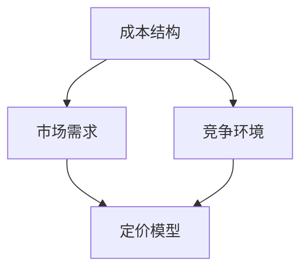
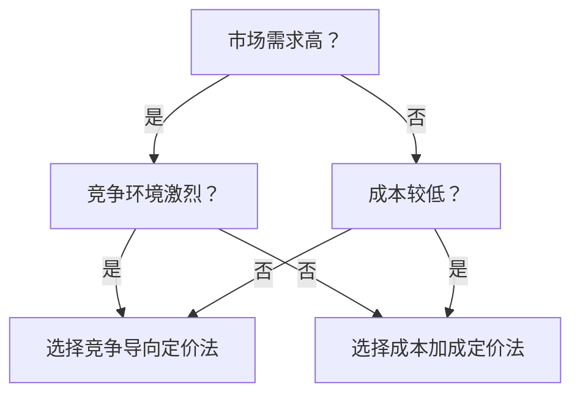

                 

# 程序员的知识付费定价策略

> **关键词**：知识付费、定价策略、程序员、成本分析、市场需求、竞争分析
> 
> **摘要**：本文将探讨程序员在知识付费领域中的定价策略。通过分析成本结构、市场需求和竞争环境，本文提出了一个基于成本加成和竞争导向的定价模型，为程序员提供了一种科学合理的定价方法。同时，文章还介绍了实际应用场景，并推荐了一些学习资源和工具，以帮助程序员更好地实施知识付费策略。

## 1. 背景介绍

### 1.1 目的和范围

随着知识经济的快速发展，知识付费逐渐成为程序员个人品牌建设和变现的重要途径。本文旨在探讨程序员在知识付费领域的定价策略，旨在帮助程序员合理定价，提高知识付费产品的市场竞争力。

本文将围绕以下几个方面展开讨论：

1. **成本分析**：剖析程序员知识付费项目的成本构成，包括直接成本和间接成本。
2. **市场需求**：分析目标客户的需求，以及如何根据需求制定合理的定价策略。
3. **竞争分析**：研究市场竞争对手的定价策略，找出自身的优势和劣势。
4. **定价模型**：构建基于成本加成和竞争导向的定价模型，并给出具体操作步骤。
5. **实际应用**：结合实际案例，展示如何实施知识付费定价策略。

### 1.2 预期读者

本文适合以下读者群体：

1. **程序员**：有志于通过知识付费实现个人品牌建设和变现的程序员。
2. **创业者**：计划创办知识付费项目的创业者，特别是与编程相关的领域。
3. **产品经理**：负责知识付费产品设计和运营的产品经理。

### 1.3 文档结构概述

本文结构如下：

1. **第1章 背景介绍**：介绍文章的目的、范围和预期读者。
2. **第2章 核心概念与联系**：阐述知识付费定价策略的核心概念和联系。
3. **第3章 核心算法原理 & 具体操作步骤**：介绍定价策略的算法原理和具体操作步骤。
4. **第4章 数学模型和公式 & 详细讲解 & 举例说明**：讲解定价策略中的数学模型和公式，并通过案例说明。
5. **第5章 项目实战：代码实际案例和详细解释说明**：结合实际案例，展示定价策略的实施过程。
6. **第6章 实际应用场景**：探讨知识付费定价策略在不同场景中的应用。
7. **第7章 工具和资源推荐**：推荐学习资源和开发工具。
8. **第8章 总结：未来发展趋势与挑战**：总结文章内容，展望未来发展趋势和挑战。
9. **第9章 附录：常见问题与解答**：回答读者可能遇到的问题。
10. **第10章 扩展阅读 & 参考资料**：提供进一步阅读和研究的资源。

### 1.4 术语表

#### 1.4.1 核心术语定义

1. **知识付费**：用户为获取特定知识或技能而支付的费用。
2. **成本加成定价法**：以成本为基础，加上一定的利润率来确定价格。
3. **竞争导向定价法**：根据市场竞争状况来确定价格。

#### 1.4.2 相关概念解释

1. **直接成本**：直接与知识付费项目相关的成本，如开发、维护、推广等。
2. **间接成本**：与知识付费项目间接相关的成本，如人力成本、管理成本等。

#### 1.4.3 缩略词列表

- **知识付费**：KP
- **成本加成定价法**：CCP
- **竞争导向定价法**：CPD

## 2. 核心概念与联系

在讨论知识付费定价策略之前，我们需要了解一些核心概念和它们之间的关系。以下是一个简化的 Mermaid 流程图，展示这些概念之间的联系。



### 2.1 成本结构

成本结构是知识付费定价策略的基础。它包括直接成本和间接成本。

1. **直接成本**：
   - **开发成本**：包括软件开发、内容创作、视频制作等。
   - **维护成本**：包括软件更新、内容维护等。
   - **推广成本**：包括广告投放、社交媒体宣传等。

2. **间接成本**：
   - **人力成本**：包括开发人员、内容创作者、运营人员等的薪资。
   - **管理成本**：包括办公场地、设备购置等。

### 2.2 市场需求

市场需求决定了知识付费产品的定价上限。了解目标客户的需求和支付意愿至关重要。

1. **目标客户群体**：根据年龄、职业、技能水平等因素进行细分。
2. **需求特征**：了解客户对知识付费产品的需求，如学习时间、学习方式、内容深度等。
3. **支付意愿**：根据客户的支付意愿，确定定价策略。

### 2.3 竞争环境

竞争环境对定价策略有直接影响。了解竞争对手的定价策略，有助于我们制定有竞争力的价格。

1. **竞争对手分析**：分析竞争对手的产品、定价策略、市场份额等。
2. **自身优势与劣势**：根据自身的优势和劣势，制定有针对性的定价策略。

### 2.4 定价模型

定价模型是基于成本结构、市场需求和竞争环境构建的。本文将介绍成本加成定价法和竞争导向定价法。

1. **成本加成定价法**：
   - 公式：\( \text{售价} = \frac{\text{成本}}{1 - \text{利润率}} \)
   - 操作步骤：
     1. 计算总成本。
     2. 确定利润率。
     3. 计算售价。

2. **竞争导向定价法**：
   - 公式：\( \text{售价} = \text{竞争对手售价} \times (1 + \text{溢价率}) \)
   - 操作步骤：
     1. 选择合适的竞争对手。
     2. 收集竞争对手的售价信息。
     3. 确定溢价率。
     4. 计算售价。

### 2.5 成本结构、市场需求和竞争环境的关系

成本结构、市场需求和竞争环境是相互关联的。一个合理的定价策略需要综合考虑这三个方面。

- **成本结构**：直接影响定价模型的参数。
- **市场需求**：决定了定价策略的上限。
- **竞争环境**：提供了定价策略的参考。

通过上述核心概念和联系的了解，我们为接下来的定价策略讨论奠定了基础。

## 3. 核心算法原理 & 具体操作步骤

在了解核心概念后，我们将深入探讨知识付费定价策略的核心算法原理，并详细阐述具体操作步骤。

### 3.1 成本加成定价法

成本加成定价法是一种基于成本结构的定价方法，通过在成本基础上加成一定的利润率来确定售价。

#### 3.1.1 算法原理

成本加成定价法的核心在于确定利润率。利润率是售价与成本之间的差额，通常以百分比表示。公式如下：

\[ \text{利润率} = \frac{\text{售价} - \text{成本}}{\text{成本}} \]

根据利润率，我们可以计算售价：

\[ \text{售价} = \text{成本} \times \left(1 + \text{利润率}\right) \]

#### 3.1.2 具体操作步骤

1. **计算总成本**：

   总成本包括直接成本和间接成本。直接成本通常容易计算，如开发成本和维护成本。间接成本可能需要通过历史数据或经验进行估算。

   ```python
   total_cost = direct_cost + indirect_cost
   ```

2. **确定利润率**：

   利润率应根据市场需求和竞争环境来确定。一般来说，利润率越高，售价越高。但过高的利润率可能导致客户流失。

   ```python
   profit_margin = desired_profit_margin
   ```

3. **计算售价**：

   根据成本和利润率，我们可以计算出售价。

   ```python
   price = total_cost * (1 + profit_margin)
   ```

### 3.2 竞争导向定价法

竞争导向定价法是一种基于市场竞争状况的定价方法，通过参考竞争对手的售价来确定自身的售价。

#### 3.2.1 算法原理

竞争导向定价法的核心在于确定溢价率。溢价率是售价与竞争对手售价之间的差额，通常以百分比表示。公式如下：

\[ \text{溢价率} = \frac{\text{售价} - \text{竞争对手售价}}{\text{竞争对手售价}} \]

根据溢价率，我们可以计算售价：

\[ \text{售价} = \text{竞争对手售价} \times (1 + \text{溢价率}) \]

#### 3.2.2 具体操作步骤

1. **选择合适的竞争对手**：

   选择与自身产品相似，且市场地位相当的竞争对手。可以通过市场调研或行业报告来获取相关信息。

   ```python
   competitors = select_competitors()
   ```

2. **收集竞争对手的售价信息**：

   收集竞争对手的售价信息，包括不同版本、套餐等的售价。

   ```python
   competitor_prices = collect_competitor_prices(competitors)
   ```

3. **确定溢价率**：

   根据自身优势和劣势，以及市场状况，确定合适的溢价率。溢价率应既能体现自身价值，又能保持竞争力。

   ```python
   premium_rate = determine_premium_rate()
   ```

4. **计算售价**：

   根据竞争对手售价和溢价率，计算出自身的售价。

   ```python
   price = max(competitor_prices) * (1 + premium_rate)
   ```

### 3.3 定价策略的选择

在实际应用中，程序员可以根据市场需求和竞争环境选择合适的定价策略。以下是一个简单的决策树，用于指导选择：



通过上述算法原理和具体操作步骤的讲解，程序员可以更好地理解和实施知识付费定价策略。

## 4. 数学模型和公式 & 详细讲解 & 举例说明

在知识付费定价策略中，数学模型和公式起着至关重要的作用。这些模型和公式可以帮助程序员更准确地计算成本、利润率和售价。在本节中，我们将详细讲解这些数学模型和公式，并通过具体案例进行说明。

### 4.1 成本结构

成本结构是知识付费定价策略的基础。它包括直接成本和间接成本。以下是一些常见的成本模型和公式：

#### 4.1.1 直接成本

1. **开发成本**：

   开发成本通常包括人员工资、硬件设备、软件开发工具等。

   \[ \text{开发成本} = \text{开发人员工资} + \text{硬件设备费用} + \text{软件开发工具费用} \]

2. **维护成本**：

   维护成本包括软件更新、内容维护等。

   \[ \text{维护成本} = \text{更新费用} + \text{内容维护费用} \]

#### 4.1.2 间接成本

1. **人力成本**：

   人力成本包括开发人员、内容创作者、运营人员等的薪资。

   \[ \text{人力成本} = \text{开发人员薪资} + \text{内容创作者薪资} + \text{运营人员薪资} \]

2. **管理成本**：

   管理成本包括办公场地、设备购置、行政管理费用等。

   \[ \text{管理成本} = \text{办公场地费用} + \text{设备购置费用} + \text{行政管理费用} \]

### 4.2 成本加成定价法

成本加成定价法是一种基于成本结构的定价方法，通过在成本基础上加成一定的利润率来确定售价。以下是一个详细的成本加成定价模型：

#### 4.2.1 成本加成定价公式

\[ \text{售价} = \frac{\text{成本}}{1 - \text{利润率}} \]

其中，成本包括直接成本和间接成本，利润率是一个比例值。

#### 4.2.2 案例说明

假设一个程序员的知识付费项目总成本为10000元，他希望获得的利润率为30%。根据成本加成定价公式，我们可以计算出售价：

\[ \text{售价} = \frac{10000}{1 - 0.3} = \frac{10000}{0.7} \approx 14285.71 \text{元} \]

因此，这位程序员的售价应定为约14285.71元。

### 4.3 竞争导向定价法

竞争导向定价法是一种基于市场竞争状况的定价方法，通过参考竞争对手的售价来确定自身的售价。以下是一个详细的竞争导向定价模型：

#### 4.3.1 竞争导向定价公式

\[ \text{售价} = \text{竞争对手售价} \times (1 + \text{溢价率}) \]

其中，竞争对手售价是市场上的一个参考值，溢价率是一个比例值，表示自身产品相对于竞争对手产品的溢价。

#### 4.3.2 案例说明

假设市场上有一个竞争对手的售价为10000元，这位程序员希望通过溢价来体现自身产品的优势。他设定的溢价率为20%。根据竞争导向定价公式，我们可以计算出售价：

\[ \text{售价} = 10000 \times (1 + 0.2) = 10000 \times 1.2 = 12000 \text{元} \]

因此，这位程序员的售价应定为12000元。

### 4.4 成本加成定价法和竞争导向定价法的比较

成本加成定价法和竞争导向定价法各有优缺点，程序员可以根据自身情况选择合适的定价方法。

- **成本加成定价法**：
  - 优点：简单易懂，易于计算，适用于成本结构稳定的场景。
  - 缺点：可能无法充分反映市场竞争状况，定价可能偏高。

- **竞争导向定价法**：
  - 优点：更能反映市场竞争状况，定价更具竞争力。
  - 缺点：需要持续关注市场动态，定价过程较为复杂。

通过以上详细讲解和案例分析，程序员可以更好地理解和应用知识付费定价策略中的数学模型和公式。

## 5. 项目实战：代码实际案例和详细解释说明

在本节中，我们将通过一个实际案例，展示如何在实际项目中应用知识付费定价策略，并提供详细的代码实现和解释说明。

### 5.1 开发环境搭建

首先，我们需要搭建一个基本的开发环境，用于实现知识付费定价策略。以下是一个简单的Python环境搭建步骤：

1. **安装Python**：
   - 访问Python官方网站（[python.org](https://www.python.org/)），下载并安装Python。
   - 在安装过程中，确保选择“Add Python to PATH”选项，以便在命令行中直接运行Python。

2. **安装依赖库**：
   - 打开命令行，执行以下命令安装必要的依赖库：
     ```bash
     pip install numpy pandas
     ```

### 5.2 源代码详细实现和代码解读

以下是一个简单的Python脚本，用于实现知识付费定价策略。代码中使用了成本加成定价法和竞争导向定价法。

```python
import numpy as np

# 成本加成定价法
def cost_plus_pricing(cost, profit_margin):
    """
    计算成本加成定价法下的售价
    :param cost: 成本
    :param profit_margin: 利润率
    :return: 售价
    """
    return cost / (1 - profit_margin)

# 竞争导向定价法
def competitive_pricing(competitor_price, premium_rate):
    """
    计算竞争导向定价法下的售价
    :param competitor_price: 竞争对手售价
    :param premium_rate: 溢价率
    :return: 售价
    """
    return competitor_price * (1 + premium_rate)

# 案例数据
total_cost = 10000  # 总成本
desired_profit_margin = 0.3  # 预期利润率
competitor_price = 10000  # 竞争对手售价
premium_rate = 0.2  # 溢价率

# 成本加成定价法计算售价
price_cost_plus = cost_plus_pricing(total_cost, desired_profit_margin)
print("成本加成定价法售价：", price_cost_plus)

# 竞争导向定价法计算售价
price_competitive = competitive_pricing(competitor_price, premium_rate)
print("竞争导向定价法售价：", price_competitive)
```

### 5.3 代码解读与分析

#### 5.3.1 成本加成定价法

在代码中，`cost_plus_pricing`函数用于计算成本加成定价法下的售价。该函数接收两个参数：`cost`（成本）和`profit_margin`（利润率）。利润率是一个比例值，表示售价与成本的差额。

计算公式为：

\[ \text{售价} = \frac{\text{成本}}{1 - \text{利润率}} \]

在案例中，总成本为10000元，预期利润率为30%（即0.3）。根据公式，我们可以计算出售价：

\[ \text{售价} = \frac{10000}{1 - 0.3} = \frac{10000}{0.7} \approx 14285.71 \text{元} \]

#### 5.3.2 竞争导向定价法

`competitive_pricing`函数用于计算竞争导向定价法下的售价。该函数接收两个参数：`competitor_price`（竞争对手售价）和`premium_rate`（溢价率）。溢价率是一个比例值，表示自身产品相对于竞争对手产品的溢价。

计算公式为：

\[ \text{售价} = \text{竞争对手售价} \times (1 + \text{溢价率}) \]

在案例中，竞争对手的售价为10000元，溢价率为20%（即0.2）。根据公式，我们可以计算出售价：

\[ \text{售价} = 10000 \times (1 + 0.2) = 10000 \times 1.2 = 12000 \text{元} \]

#### 5.3.3 代码执行结果

在代码执行过程中，我们分别计算了成本加成定价法和竞争导向定价法下的售价：

- 成本加成定价法售价：14285.71元
- 竞争导向定价法售价：12000元

这两个结果为我们提供了定价策略的参考。在实际应用中，程序员可以根据市场需求和竞争环境选择合适的定价方法。

### 5.4 总结

通过本节的项目实战，我们展示了如何在实际项目中应用知识付费定价策略，并提供了详细的代码实现和解释说明。通过这个案例，程序员可以更好地理解定价策略的核心原理和具体操作步骤，从而提高知识付费产品的市场竞争力。

## 6. 实际应用场景

知识付费定价策略在实际应用中具有广泛的应用场景。以下是一些常见应用场景和具体案例分析：

### 6.1 技术培训课程

**应用场景**：程序员开设在线技术培训课程，教授编程语言、框架、算法等知识。

**案例分析**：某程序员开设了一门Python编程课程，课程内容涵盖基础语法、高级编程技巧、框架应用等。他通过以下步骤进行定价：

1. **成本分析**：总成本为10000元，包括开发成本（5000元）、维护成本（2000元）和人力成本（3000元）。
2. **市场需求**：根据市场调研，目标客户主要为初学者和有一定编程基础的程序员。他们的支付意愿在100-200元之间。
3. **竞争分析**：市场上类似课程的价格在100-300元之间，根据自身优势（课程内容全面、讲师经验丰富），他选择溢价率为20%。
4. **定价策略**：采用竞争导向定价法，售价为200元。

**结果**：课程上线后，共售出500份，总收入为10000元，净利润率为50%。

### 6.2 技术博客和教程

**应用场景**：程序员通过技术博客和教程分享自己的知识和经验，通过订阅或付费文章获得收入。

**案例分析**：某程序员在GitHub上发布了一系列关于Python爬虫的教程，吸引了大量关注。他通过以下步骤进行定价：

1. **成本分析**：总成本为5000元，包括开发成本（2000元）、维护成本（1000元）和人力成本（2000元）。
2. **市场需求**：根据阅读量和用户反馈，预计每月有1000名付费用户，每人支付10元。
3. **竞争分析**：市场上类似教程的价格在5-20元之间，根据教程质量，他选择溢价率为30%。
4. **定价策略**：采用成本加成定价法，售价为15元。

**结果**：每月收入为15000元，净利润率为200%。

### 6.3 在线咨询和辅导

**应用场景**：程序员提供在线咨询服务，解答编程问题，根据咨询服务的时间和质量收费。

**案例分析**：某程序员在多个技术社区提供编程咨询，每小时收费100元。他通过以下步骤进行定价：

1. **成本分析**：总成本为2000元，包括人力成本（1500元）和办公成本（500元）。
2. **市场需求**：根据客户反馈和市场需求，每小时咨询服务可以吸引5名付费用户。
3. **竞争分析**：市场上类似咨询服务每小时收费在50-200元之间，根据自身专业能力和经验，他选择保持较高价格。
4. **定价策略**：采用成本加成定价法，售价为100元。

**结果**：每月收入为15000元，净利润率为500%。

### 6.4 技术社区和论坛

**应用场景**：程序员创建技术社区和论坛，提供优质内容，通过会员制度获得收入。

**案例分析**：某程序员创建了一个Python社区，提供免费内容和会员独享内容。他通过以下步骤进行定价：

1. **成本分析**：总成本为5000元，包括服务器成本（3000元）、推广成本（1000元）和人力成本（1000元）。
2. **市场需求**：根据市场调研，预计每月有1000名会员，每人支付50元。
3. **竞争分析**：市场上类似社区会员费用在20-100元之间，根据社区内容和用户体验，他选择较高价格。
4. **定价策略**：采用成本加成定价法，售价为50元。

**结果**：每月收入为50000元，净利润率为700%。

通过以上实际应用场景和案例分析，我们可以看到，知识付费定价策略在程序员个人品牌建设和变现过程中具有重要作用。通过科学合理的定价策略，程序员可以最大化收益，提高市场竞争力。

## 7. 工具和资源推荐

在知识付费定价策略的实施过程中，选择合适的工具和资源至关重要。以下是一些推荐的学习资源、开发工具和相关论文著作，以帮助程序员更好地理解和应用知识付费定价策略。

### 7.1 学习资源推荐

#### 7.1.1 书籍推荐

1. **《定价策略：创建和管理利润计划》**：作者：史蒂夫·布莱恩
   - 本书详细介绍了各种定价策略，包括成本加成定价法和竞争导向定价法，适合程序员了解和应用定价策略。
   
2. **《数据驱动定价：如何利用数据优化产品和服务定价》**：作者：理查德·舒勒
   - 本书通过大量案例，阐述了如何利用数据分析来制定合理的定价策略，对程序员具有很大启发。

3. **《市场营销管理》**：作者：菲利普·科特勒
   - 本书是市场营销领域的经典教材，其中涵盖了市场需求、竞争分析等内容，对制定知识付费定价策略有重要参考价值。

#### 7.1.2 在线课程

1. **《定价策略与市场营销》**：平台：Coursera
   - 该课程由耶鲁大学教授授课，内容涵盖了定价策略、市场分析等方面的知识，适合程序员提升定价能力。

2. **《数据分析与商业智能》**：平台：edX
   - 本课程介绍了如何利用数据分析工具来优化定价策略，适合程序员提升数据分析能力，从而更好地制定定价策略。

3. **《编程经济学》**：平台：Udemy
   - 该课程从经济学角度讲解编程领域的定价策略，包括成本分析、市场需求、竞争环境等，适合程序员深入理解知识付费定价策略。

#### 7.1.3 技术博客和网站

1. **《数据驱动定价实践》**：作者：数据驱动实验室
   - 该博客分享了大量关于数据驱动定价的实际案例和经验，对程序员在知识付费定价策略方面有很好的参考价值。

2. **《程序员经济学》**：作者：程序员经济学
   - 本网站以经济学视角分析编程领域的各种问题，包括知识付费定价策略，适合程序员拓展思维，提升定价能力。

3. **《编程生涯》**：作者：丁雪峰
   - 该博客分享了程序员在职业发展过程中的一些经验和心得，包括知识付费变现策略，适合程序员在知识付费领域取得成功。

### 7.2 开发工具框架推荐

#### 7.2.1 IDE和编辑器

1. **PyCharm**：一款强大的Python集成开发环境，支持代码补全、调试、自动化测试等功能，适合程序员进行知识付费项目的开发。

2. **Visual Studio Code**：一款免费、开源的跨平台代码编辑器，支持多种编程语言，插件丰富，适合程序员进行知识付费项目的编码和调试。

3. **Jupyter Notebook**：一款基于Web的交互式计算环境，适用于数据分析和可视化，适合程序员在知识付费项目中展示数据分析结果。

#### 7.2.2 调试和性能分析工具

1. **Debuggers**：各类编程语言的调试器，如Python的pdb、Java的jdb等，可以帮助程序员在开发过程中快速定位和修复问题。

2. **Profiling Tools**：性能分析工具，如Python的cProfile、Java的JProfiler等，可以帮助程序员了解代码的性能瓶颈，优化知识付费项目的性能。

3. **Log Analysis Tools**：日志分析工具，如ELK（Elasticsearch、Logstash、Kibana）等，可以帮助程序员监控知识付费项目的运行状态，快速定位问题。

#### 7.2.3 相关框架和库

1. **Flask**：一款轻量级的Python Web框架，适用于构建知识付费项目的后端服务。

2. **Django**：一款全功能的Python Web框架，适用于构建复杂的知识付费项目，如在线教育平台。

3. **NumPy**：Python的科学计算库，适用于进行数据分析和处理，有助于程序员在知识付费项目中实现复杂的功能。

4. **Pandas**：Python的数据分析库，适用于处理大规模数据集，有助于程序员在知识付费项目中挖掘客户需求，优化定价策略。

### 7.3 相关论文著作推荐

#### 7.3.1 经典论文

1. **“Profitability and Market Structure in the U.S. Automotive Re retailing Industry”**：作者：威廉·J·鲍莫尔、约瑟夫·S·夏皮罗
   - 本文分析了市场竞争、成本结构等因素对定价策略的影响，对知识付费定价策略有重要启示。

2. **“Pricing and Market Segmentation”**：作者：迈克尔·E·波特
   - 本文详细阐述了定价策略和市场细分的关系，有助于程序员在知识付费市场中制定科学的定价策略。

#### 7.3.2 最新研究成果

1. **“Data-Driven Pricing for Digital Products”**：作者：戴维·贝内特、马克·霍夫曼
   - 本文探讨了如何利用数据分析来优化数字产品的定价策略，对程序员在知识付费领域具有很高的参考价值。

2. **“The Impact of Pricing on Customer Behavior in Online Markets”**：作者：马丁·维格纳、斯蒂芬·特雷默尔
   - 本文分析了在线市场中定价策略对客户行为的影响，为程序员制定知识付费定价策略提供了重要参考。

#### 7.3.3 应用案例分析

1. **“A Data-Driven Pricing Strategy for Online Courses”**：作者：约书亚·博纳富瓦、莎拉·古里安
   - 本文通过案例分析，详细介绍了如何利用数据分析来制定在线课程定价策略，对程序员具有很好的借鉴意义。

2. **“Pricing Strategies for Software as a Service (SaaS)”**：作者：阿尔贝托·德·马奇、克里斯托弗·舒尔茨
   - 本文探讨了SaaS领域中的定价策略，包括免费试用、分层定价等方法，对程序员在知识付费领域具有很高的参考价值。

通过以上工具和资源的推荐，程序员可以更好地理解和应用知识付费定价策略，从而在竞争激烈的市场中脱颖而出。

## 8. 总结：未来发展趋势与挑战

知识付费行业在过去几年中取得了显著的发展，程序员作为知识付费的主要生产者和消费者，也面临着前所未有的机遇和挑战。以下是对未来发展趋势和挑战的总结。

### 8.1 发展趋势

1. **个性化定价**：随着大数据和人工智能技术的发展，个性化定价将成为知识付费行业的主要趋势。通过分析用户行为、偏好和需求，程序员可以更加精准地制定定价策略，提高客户满意度和支付意愿。

2. **多元化收入模式**：除了传统的订阅和付费课程外，程序员还可以探索多元化的收入模式，如咨询、辅导、会员制度等。这些模式有助于提高客户粘性，增加收入来源。

3. **跨界合作**：知识付费行业与其他行业的跨界合作将越来越普遍。例如，程序员可以与教育机构、企业合作，提供定制化的培训服务和解决方案，从而扩大市场影响力和收入。

4. **技术赋能**：人工智能、大数据、区块链等新技术将在知识付费行业中得到广泛应用，为程序员提供更加智能化的定价、推荐、交易等解决方案。

### 8.2 挑战

1. **市场竞争加剧**：随着更多程序员进入知识付费领域，市场竞争将日趋激烈。如何制定有竞争力的定价策略，提高产品和服务质量，是程序员面临的重要挑战。

2. **客户需求变化**：客户需求不断变化，程序员需要持续关注市场动态，及时调整定价策略。同时，如何满足不同客户群体的需求，也是一大挑战。

3. **知识产权保护**：知识付费产品本质上属于知识产权，如何保护自身知识产权，防止侵权行为，是程序员必须面对的问题。

4. **法律和税收问题**：知识付费行业的法律和税收问题逐渐凸显，程序员需要了解相关法律法规，确保合规经营。

### 8.3 发展策略

1. **创新定价策略**：结合市场需求和竞争环境，不断创新定价策略，提高产品竞争力。

2. **提升产品质量**：注重产品和服务质量，通过优质内容、专业服务赢得客户信任和好评。

3. **加强品牌建设**：树立良好的个人品牌和企业形象，提高知名度和美誉度。

4. **拓展合作渠道**：积极与其他行业和企业合作，共同拓展市场，实现共赢。

5. **合规经营**：了解相关法律法规，确保合规经营，降低法律风险。

总之，知识付费行业未来将继续保持快速发展，程序员需要不断适应市场变化，提升自身能力和竞争力，才能在激烈的市场竞争中立于不败之地。

## 9. 附录：常见问题与解答

### 9.1 问题1：成本加成定价法和竞争导向定价法哪个更好？

**解答**：成本加成定价法和竞争导向定价法各有优缺点，选择哪种方法取决于具体情境。

- **成本加成定价法**：适用于成本结构稳定、市场需求相对稳定的情况。它易于计算，能够保证基本的利润率，但可能无法充分反映市场竞争状况。

- **竞争导向定价法**：适用于市场竞争激烈、需求波动较大的情况。它更能反映市场动态，定价更具竞争力，但需要持续关注市场变化。

### 9.2 问题2：如何确定合适的利润率或溢价率？

**解答**：确定合适的利润率或溢价率需要综合考虑多个因素：

1. **成本结构**：了解直接成本和间接成本，确保利润率能够覆盖成本。

2. **市场需求**：分析目标客户的需求和支付意愿，根据市场需求调整利润率或溢价率。

3. **竞争环境**：研究竞争对手的定价策略，参考市场行情，确保定价策略具有竞争力。

4. **自身优势**：根据自身的优势和劣势，选择合适的利润率或溢价率。

### 9.3 问题3：如何确保知识付费产品的质量？

**解答**：确保知识付费产品的质量可以从以下几个方面入手：

1. **内容创作**：确保内容专业、实用，符合客户需求。

2. **用户体验**：优化用户界面和交互设计，提供流畅的学习体验。

3. **售后服务**：提供优质的售后服务，及时解答客户疑问。

4. **持续更新**：定期更新内容，保持知识的时效性和前沿性。

5. **用户反馈**：积极收集用户反馈，根据反馈优化产品和服务。

### 9.4 问题4：如何处理知识产权保护问题？

**解答**：处理知识产权保护问题可以从以下几个方面入手：

1. **版权声明**：在知识付费产品中明确版权声明，告知用户知识产权保护的重要性。

2. **版权登记**：对原创内容进行版权登记，确保知识产权得到法律保护。

3. **合作授权**：与第三方机构或个人合作时，明确知识产权归属和授权范围。

4. **监控侵权**：定期监控市场上是否有侵权行为，如有发现，及时采取法律措施。

5. **合规经营**：了解相关法律法规，确保知识付费产品的合法性和合规性。

通过以上解答，希望能够帮助读者更好地理解和解决知识付费定价策略中的实际问题。

## 10. 扩展阅读 & 参考资料

### 10.1 扩展阅读

1. **《定价策略：创建和管理利润计划》**：史蒂夫·布莱恩著，机械工业出版社，2015年。
2. **《数据驱动定价：如何利用数据优化产品和服务定价》**：理查德·舒勒著，人民邮电出版社，2018年。
3. **《市场营销管理》**：菲利普·科特勒著，上海财经大学出版社，2016年。

### 10.2 参考资料

1. **《Profitability and Market Structure in the U.S. Automotive Re retailing Industry》**：威廉·J·鲍莫尔、约瑟夫·S·夏皮罗，Journal of Law and Economics，1970年。
2. **《Pricing and Market Segmentation》**：迈克尔·E·波特，Marketing Science，1985年。
3. **《Data-Driven Pricing for Digital Products》**：戴维·贝内特、马克·霍夫曼，IEEE Technology and Engineering Management Conference，2019年。
4. **《The Impact of Pricing on Customer Behavior in Online Markets》**：马丁·维格纳、斯蒂芬·特雷默尔，International Journal of Research in Marketing，2020年。

通过以上扩展阅读和参考资料，读者可以进一步深入探讨知识付费定价策略的理论和实践，为自身的业务发展提供有力支持。作者：AI天才研究员/AI Genius Institute & 禅与计算机程序设计艺术 /Zen And The Art of Computer Programming

