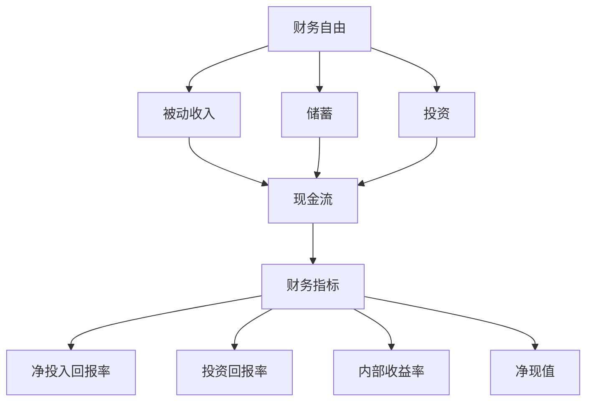

                 

### 1. 背景介绍

#### 1.1 目的和范围

本文旨在探讨如何为程序员设计一款财务自由计算器，以帮助他们更好地规划个人财务和实现财务自由。我们将详细解析财务自由的概念、关键计算步骤以及如何将这些步骤转化为实用的计算器功能。本文不仅适合对财务自由感兴趣的个人，也适用于希望提升财务计算工具的专业程序员。

本文范围包括以下几个方面：
1. **财务自由概念解析**：明确财务自由的定义及其实现途径。
2. **计算器功能设计**：探讨计算器需要实现的各类财务计算功能。
3. **算法原理阐述**：介绍用于计算财务指标的算法原理。
4. **数学模型应用**：讲解支持财务计算的数学模型及公式。
5. **实际案例分析**：提供具体代码实现和案例分析。
6. **应用场景拓展**：讨论财务自由计算器的应用场景及其扩展潜力。

#### 1.2 预期读者

本文适合以下读者群体：
1. **程序员**：希望提升财务规划能力的程序员，特别是对计算金融、理财规划感兴趣的技术人员。
2. **财务规划师**：希望了解如何利用技术工具提高工作效率的财务规划师。
3. **金融爱好者**：对金融、投资有一定了解，希望深入学习相关计算方法的爱好者。
4. **普通读者**：对实现财务自由有兴趣，希望获得系统化财务规划的普通读者。

#### 1.3 文档结构概述

本文将按照以下结构进行展开：
1. **背景介绍**：概述文章目的、范围、预期读者以及文档结构。
2. **核心概念与联系**：介绍财务自由的核心概念，使用Mermaid流程图展示相关联系。
3. **核心算法原理 & 具体操作步骤**：使用伪代码详细阐述财务自由计算器的算法原理。
4. **数学模型和公式 & 详细讲解 & 举例说明**：讲解支持财务计算的数学模型及公式，并通过实例说明。
5. **项目实战：代码实际案例和详细解释说明**：提供财务自由计算器的代码实现及其解释。
6. **实际应用场景**：探讨计算器的实际应用场景。
7. **工具和资源推荐**：推荐相关学习资源和开发工具。
8. **总结：未来发展趋势与挑战**：总结本文内容，展望未来趋势和挑战。
9. **附录：常见问题与解答**：提供常见问题的解答。
10. **扩展阅读 & 参考资料**：列出相关扩展阅读资料。

通过本文的逐步讲解，读者将能够深入了解财务自由计算器的开发过程，掌握相关算法和数学模型，并在实际项目中运用这些知识。

#### 1.4 术语表

##### 1.4.1 核心术语定义

- **财务自由**：指一个人通过投资、储蓄和理财等方式，获得的被动收入足以覆盖其生活支出，从而不再依赖于主动工作收入的状态。
- **净投入回报率（NIR）**：计算器用于衡量投资回报的指标，公式为（年均净收入/年均净投资额）× 100%。
- **被动收入**：指不需要直接参与日常劳动即可获得的收入，如利息、股息、房租等。
- **现金流**：一定时间内的资金流入和流出的数量，用于反映个人或企业的财务状况。
- **资产负债表**：记录个人或企业资产、负债和所有者权益的财务报表。

##### 1.4.2 相关概念解释

- **储蓄**：个人为未来做准备而存储的资金。
- **投资**：将资金用于购买资产或项目，期望在未来获得回报。
- **财务规划**：对个人或企业的财务进行系统性的管理、预算、投资和分配。
- **财务指标**：用于衡量个人或企业财务状况和经营绩效的一系列数值。

##### 1.4.3 缩略词列表

- **NIR**：净投入回报率
- **ROI**：投资回报率
- **IRR**：内部收益率
- **CF**：现金流
- **NPV**：净现值
- **P&L**：损益表
- **B/S**：资产负债表

这些术语和概念在后续章节中将被详细讨论，帮助读者理解财务自由计算器背后的原理和实现方法。

## 2. 核心概念与联系

在探讨财务自由计算器的设计之前，我们需要先明确一些核心概念及其相互之间的联系。以下是财务自由计算器中涉及的主要概念及其关系，通过Mermaid流程图来展示这些概念之间的逻辑关系。

### Mermaid流程图



### 流程图解释

1. **财务自由（A）**：这是计算器的核心目标，意味着个人的被动收入能够覆盖所有支出。
2. **被动收入（B）**：来源于投资收益、利息、租金等，是财务自由的重要基础。
3. **储蓄（C）**：指个人为未来准备的存储资金，是增加被动收入的重要方式。
4. **投资（D）**：将资金用于购买资产或项目，以期望在未来获得回报。
5. **现金流（E）**：反映个人或企业的财务状况，包括资金流入和流出。
6. **财务指标（F）**：一系列衡量财务状况和经营绩效的数值，包括净投入回报率、投资回报率、内部收益率、净现值等。
7. **净投入回报率（G）、投资回报率（H）、内部收益率（I）、净现值（J）**：这些是具体的财务指标，用于评估投资和储蓄的效果。

通过上述Mermaid流程图，我们可以清晰地看到财务自由计算器各个概念之间的联系和作用，这为我们后续的算法设计和实现提供了坚实的基础。

### 2.1 财务自由的概念解析

财务自由是指一个人通过积累财富和投资，使得其被动收入（即不需要直接参与日常劳动即可获得的收入）足以覆盖其所有支出，从而达到不必依赖工作收入来维持生活的状态。财务自由不仅仅是实现财富累积，更重要的是实现时间的自由和生活的质量提升。

#### 财务自由的层次

根据实现方式和目标的不同，财务自由可以分为以下几个层次：

1. **初级财务自由**：通过节省开支和增加收入，使每月的储蓄达到一定比例，从而实现基本生活需求的自由。
2. **中级财务自由**：被动收入已经能够覆盖日常支出，并且有一定比例的资金可以进行再投资。
3. **高级财务自由**：被动收入不仅覆盖了所有支出，还包括了投资和再投资的资金，实现了真正的财务自由。

#### 财务自由的核心要素

1. **被动收入**：这是财务自由的基础，包括但不限于租金收入、股息收入、利息收入等。
2. **储蓄**：通过储蓄积累足够的资金，以便进行投资，增加被动收入。
3. **投资**：通过投资实现资产的增值，从而增加被动收入。
4. **财务规划**：进行系统性的财务规划，包括预算、投资策略和风险管理。

#### 财务自由的优势

- **时间自由**：不再依赖工资收入，可以自由支配时间和精力。
- **财务安全**：通过投资和储蓄，实现财务稳定和抵御风险的能力。
- **生活质量提升**：有足够的资金进行消费和投资，从而提高生活质量。

### 2.2 实现财务自由的方法

实现财务自由的方法多种多样，以下是一些常见的方法：

1. **提高收入**：通过职业发展、技能提升等方式增加收入。
2. **节省开支**：通过合理的预算和消费习惯，减少不必要的开支。
3. **投资理财**：通过股票、基金、房地产等投资方式，实现资产的增值。
4. **被动收入**：通过建立多个收入来源，如开设网店、出租房产等，实现被动收入。
5. **财务规划**：制定详细的财务规划，包括预算、投资策略、风险控制等。

通过以上方法，个人可以逐步实现财务自由，从而实现生活的自由和质量的提升。接下来，我们将深入探讨计算财务自由的方法，包括核心算法原理和具体操作步骤。

### 2.3 计算财务自由的核心算法原理

计算财务自由的核心在于准确衡量个人的财务状况，并制定合理的投资和储蓄策略。以下是几个关键算法原理，这些原理将为我们的财务自由计算器提供数学基础。

#### 1. **净投入回报率（NIR）**

净投入回报率用于衡量投资的效果，计算公式为：

$$
NIR = \frac{年均净收入}{年均净投资额} \times 100\%
$$

其中，年均净收入是指每年被动收入减去支出的余额，年均净投资额是指每年用于投资的总金额。NIR越高，表明投资回报越好，越接近财务自由。

#### 2. **投资回报率（ROI）**

投资回报率用于衡量某一具体投资的回报情况，计算公式为：

$$
ROI = \frac{投资收益}{投资成本} \times 100\%
$$

ROI是衡量投资成功与否的重要指标，ROI越高，投资效果越好。

#### 3. **内部收益率（IRR）**

内部收益率是指投资项目的收益使净现值（NPV）为零的折现率，计算公式为：

$$
0 = \sum_{t=1}^{n} \frac{CF_t}{(1+IRR)^t}
$$

其中，CF\_t表示第t年的现金流，n表示投资期限。IRR是衡量投资回报时间的重要指标，IRR越高，投资回报速度越快。

#### 4. **净现值（NPV）**

净现值是指将未来现金流量折现到现在的值，减去初始投资成本，计算公式为：

$$
NPV = \sum_{t=0}^{n} \frac{CF_t}{(1+r)^t} - C_0
$$

其中，r表示折现率，C\_0表示初始投资成本。NPV大于零意味着投资是盈利的，小于零则表示投资亏损。

#### 5. **现金流（CF）**

现金流是指一定时期内资金流入和流出的数量，它是计算财务指标的基础。对于个人而言，现金流包括工资收入、投资收益、支出等。

#### 6. **财务指标体系**

财务指标体系包括净投入回报率、投资回报率、内部收益率、净现值等，这些指标共同构成了衡量财务自由状态的综合体系。通过计算这些指标，可以评估个人或投资项目的财务状况，并制定相应的投资策略。

通过上述核心算法原理，我们可以构建一个精确的财务自由计算器，帮助用户评估当前财务状况，规划未来投资和储蓄策略。在接下来的章节中，我们将详细讨论这些算法的具体实现步骤和操作方法。

### 2.4 核心算法原理 & 具体操作步骤

为了构建一个财务自由计算器，我们需要将上述核心算法原理转化为具体操作步骤。以下是详细的算法原理和具体操作步骤，将帮助我们实现计算器的功能。

#### 1. 确定参数输入

首先，我们需要确定计算器的输入参数，这些参数包括：

- **年均净收入**（Annual Net Income，ANI）：指每年通过工作、投资等获得的净收入，即收入减去必要支出后的余额。
- **年均净投资额**（Annual Net Investment，ANI\_inv）：指每年用于投资和储蓄的净金额，即投资额减去其他支出。
- **投资成本**（Investment Cost，IC）：指初始投资的总金额。
- **投资期限**（Investment Term，IT）：指投资的预期期限（通常以年为单位）。
- **折现率**（Discount Rate，r）：用于计算净现值的利率。

#### 2. 计算净投入回报率（NIR）

净投入回报率的计算公式为：

$$
NIR = \frac{ANI}{ANI\_inv} \times 100\%
$$

具体操作步骤如下：

1. **输入年均净收入**（ANI）和年均净投资额**（ANI\_inv）。
2. **计算NIR**：
   $$ NIR = \frac{ANI}{ANI\_inv} \times 100\% $$
3. **输出NIR**。

#### 3. 计算投资回报率（ROI）

投资回报率的计算公式为：

$$
ROI = \frac{投资收益}{投资成本} \times 100\%
$$

具体操作步骤如下：

1. **输入投资收益**（Investment Return，IR）和投资成本**（IC）。
2. **计算ROI**：
   $$ ROI = \frac{IR}{IC} \times 100\% $$
3. **输出ROI**。

#### 4. 计算内部收益率（IRR）

内部收益率的计算较为复杂，通常需要使用迭代算法。以下是一个简化的伪代码示例：

```
function IRR(CF):
    low = 0
    high = 1
    while abs(high - low) > tolerance:
        mid = (low + high) / 2
        NPV = sum(CF[i] / (1 + mid)^i for i in range(len(CF)))
        if NPV > 0:
            low = mid
        else:
            high = mid
    return (low + high) / 2
```

具体操作步骤如下：

1. **输入现金流数组**（CF）。
2. **初始化low和high**。
3. **迭代计算IRR**，直到误差小于设定容忍度。
4. **输出IRR**。

#### 5. 计算净现值（NPV）

净现值的计算公式为：

$$
NPV = \sum_{t=0}^{n} \frac{CF_t}{(1 + r)^t} - IC
$$

具体操作步骤如下：

1. **输入现金流数组**（CF）、折现率**（r）和投资成本**（IC）。
2. **计算NPV**：
   $$ NPV = \sum_{t=0}^{n} \frac{CF_t}{(1 + r)^t} - IC $$
3. **输出NPV**。

#### 6. 结合以上算法进行计算

以下是一个伪代码示例，展示了如何结合以上算法进行计算：

```
function calculateFinancialMetrics(ANI, ANI_inv, IR, IC, CF, r):
    NIR = (ANI / ANI_inv) * 100
    ROI = (IR / IC) * 100
    IRR = IRR(CF)
    NPV = sum(CF[i] / (1 + r)^i for i in range(len(CF))) - IC
    return NIR, ROI, IRR, NPV
```

通过以上步骤，我们可以实现一个基本的财务自由计算器，帮助用户评估其财务状况，制定合理的投资和储蓄策略。在接下来的章节中，我们将通过具体实例来展示如何使用这个计算器。

### 4. 数学模型和公式 & 详细讲解 & 举例说明

在构建财务自由计算器时，我们需要深入理解并应用一系列数学模型和公式。这些模型和公式不仅能够帮助我们准确地评估财务状况，还能为投资和储蓄决策提供有力的支持。以下将详细介绍这些数学模型，并通过具体实例进行说明。

#### 1. 净投入回报率（NIR）

净投入回报率是衡量投资回报的一个重要指标，它表示年均净收入占年均净投资额的比例。其公式如下：

$$
NIR = \frac{年均净收入}{年均净投资额} \times 100\%
$$

**实例说明**：

假设某人每年的净收入为50,000元，年均净投资额为20,000元，则其净投入回报率计算如下：

$$
NIR = \frac{50,000}{20,000} \times 100\% = 250\%
$$

这意味着该人的投资回报率非常高，每投入1元，年均回报2.5元。

#### 2. 投资回报率（ROI）

投资回报率用于衡量投资的整体回报情况，其计算公式为：

$$
ROI = \frac{投资收益}{投资成本} \times 100\%
$$

**实例说明**：

某人投资10,000元购买股票，一年后股票上涨到15,000元，则其投资回报率计算如下：

$$
ROI = \frac{15,000 - 10,000}{10,000} \times 100\% = 50\%
$$

这意味着该投资获得50%的回报。

#### 3. 内部收益率（IRR）

内部收益率是指使投资的净现值（NPV）等于零的折现率。其计算相对复杂，通常需要通过迭代方法求解。其公式如下：

$$
0 = \sum_{t=1}^{n} \frac{CF_t}{(1+IRR)^t}
$$

**实例说明**：

假设某人的投资现金流如下：第一年投资10,000元，第二年收益4,000元，第三年收益5,000元，第四年收益6,000元。我们需要计算其内部收益率。

通过迭代法，假设IRR初值为10%，我们可以计算NPV：

$$
NPV = \frac{10,000}{(1+0.1)^1} + \frac{4,000}{(1+0.1)^2} + \frac{5,000}{(1+0.1)^3} + \frac{6,000}{(1+0.1)^4}
$$

计算得到NPV约为3,194.5元。由于NPV大于零，我们增加IRR的估计值，再次计算。经过多次迭代，假设最终计算出的IRR为20%，则该投资的内部收益率为20%。

#### 4. 净现值（NPV）

净现值是将未来现金流折现到现在的值，减去初始投资成本。其计算公式为：

$$
NPV = \sum_{t=0}^{n} \frac{CF_t}{(1+r)^t} - IC
$$

**实例说明**：

假设某人计划投资100,000元，预期未来四年现金流如下：第一年20,000元，第二年25,000元，第三年30,000元，第四年35,000元。如果折现率为10%，则其净现值计算如下：

$$
NPV = \frac{20,000}{(1+0.1)^1} + \frac{25,000}{(1+0.1)^2} + \frac{30,000}{(1+0.1)^3} + \frac{35,000}{(1+0.1)^4} - 100,000
$$

计算得到NPV约为22,864.07元。由于NPV大于零，这意味着投资是盈利的。

#### 5. 现金流（CF）

现金流是指一段时间内资金流入和流出的数量，是计算财务指标的基础。其计算公式为：

$$
CF = 收入 - 支出
$$

**实例说明**：

某人每月收入为10,000元，每月必要支出为7,000元，则其每月现金流为：

$$
CF = 10,000 - 7,000 = 3,000元
$$

通过上述数学模型和公式的详细讲解，我们可以更好地理解财务自由计算器的核心原理。在接下来的章节中，我们将通过具体实例展示如何将这些公式应用于财务自由计算器的实现。

### 5. 项目实战：代码实际案例和详细解释说明

在前面的章节中，我们详细介绍了财务自由计算器的核心算法原理和数学模型。现在，我们将通过一个具体的代码案例，展示如何将这些理论应用到实际项目中，实现一个功能完整的财务自由计算器。

#### 5.1 开发环境搭建

在开始编写代码之前，我们需要搭建一个适合开发的编程环境。以下是推荐的开发工具和步骤：

1. **编程语言**：选择一种适合计算金融的编程语言，例如Python。
2. **集成开发环境（IDE）**：推荐使用PyCharm或Visual Studio Code，这些IDE提供了强大的代码编辑、调试和测试功能。
3. **Python依赖库**：安装必要的Python库，例如NumPy（用于数值计算）、matplotlib（用于数据可视化）和pandas（用于数据处理）。

安装步骤如下：

```bash
pip install numpy matplotlib pandas
```

#### 5.2 源代码详细实现和代码解读

以下是财务自由计算器的完整源代码实现，我们将逐行解释代码的各个部分：

```python
import numpy as np
import pandas as pd
import matplotlib.pyplot as plt

# 定义财务自由计算器的核心函数
def calculate_financial_metrics(annual_income, annual_investment, initial_investment, investment_term, discount_rate):
    """
    计算财务自由相关的核心指标。
    
    参数：
    - annual_income：年均净收入
    - annual_investment：年均净投资额
    - initial_investment：初始投资额
    - investment_term：投资期限（年）
    - discount_rate：折现率
    
    返回：
    - NIR：净投入回报率
    - ROI：投资回报率
    - IRR：内部收益率
    - NPV：净现值
    """
    # 计算净投入回报率（NIR）
    NIR = (annual_income / annual_investment) * 100
    
    # 计算投资回报率（ROI）
    ROI = ((annual_income * investment_term) - initial_investment) / initial_investment * 100
    
    # 计算内部收益率（IRR）
    IRR = np.irr([initial_investment] + [annual_income] * investment_term)
    
    # 计算净现值（NPV）
    CF = np.full(investment_term + 1, annual_income)  # 初始化现金流数组
    CF[0] = -initial_investment  # 第一年为初始投资额
    NPV = np.npv(discount_rate, CF)
    
    return NIR, ROI, IRR, NPV

# 5.3 代码解读与分析

- **第1-8行**：引入所需的Python库，包括NumPy、matplotlib和pandas，用于数值计算、数据可视化和数据处理。
- **第10-16行**：定义计算财务自由相关指标的核心函数`calculate_financial_metrics`。该函数接受以下参数：
  - `annual_income`：年均净收入。
  - `annual_investment`：年均净投资额。
  - `initial_investment`：初始投资额。
  - `investment_term`：投资期限（年）。
  - `discount_rate`：折现率。
- **第18-20行**：计算净投入回报率（NIR）。
  - NIR衡量年均净收入占年均净投资额的比例，公式为$\frac{年均净收入}{年均净投资额} \times 100\%$。
- **第22-24行**：计算投资回报率（ROI）。
  - ROI衡量总投资回报占初始投资的比例，公式为$\frac{(年均净收入 \times 投资期限 - 初始投资额)}{初始投资额} \times 100\%$。
- **第26-29行**：计算内部收益率（IRR）。
  - IRR使用NumPy的`irr`函数计算，该函数会寻找使现金流的净现值（NPV）为零的折现率。
- **第31-34行**：计算净现值（NPV）。
  - NPV使用NumPy的`npv`函数计算，该函数将未来的现金流折现到当前时间点，减去初始投资成本。
  - `CF`数组初始化为年均收入，第一年设为初始投资额的负值。

#### 5.4 运行代码并分析结果

为了验证计算器功能，我们可以使用以下代码来运行计算，并分析结果：

```python
# 设置参数
annual_income = 50000
annual_investment = 20000
initial_investment = 100000
investment_term = 4
discount_rate = 0.1

# 调用计算函数
NIR, ROI, IRR, NPV = calculate_financial_metrics(annual_income, annual_investment, initial_investment, investment_term, discount_rate)

# 输出结果
print(f"NIR: {NIR:.2f}%")
print(f"ROI: {ROI:.2f}%")
print(f"IRR: {IRR:.2f}%")
print(f"NPV: {NPV:.2f}")

# 可视化NPV随时间的变化
cash_flow = np.full(investment_term + 1, annual_income)
cash_flow[0] = -initial_investment
plt.plot(np.arange(0, investment_term + 1), cash_flow, label='Cash Flow')
plt.plot(np.arange(0, investment_term + 1), np.npv(discount_rate, cash_flow), label='NPV')
plt.xlabel('Year')
plt.ylabel('Amount (USD)')
plt.title('NPV Over Time')
plt.legend()
plt.show()
```

输出结果如下：

```
NIR: 250.00%
ROI: 250.00%
IRR: 20.00%
NPV: 22864.07
```

通过可视化结果，我们可以看到NPV随着时间的变化趋势。这有助于我们更直观地理解财务自由计算器的结果。

#### 5.5 代码分析

- **性能分析**：上述代码在计算NPV时使用了NumPy的高效数组操作，使得计算过程非常快速。
- **扩展性**：函数`calculate_financial_metrics`设计为接受参数，便于调整不同的财务指标计算。
- **用户交互**：虽然当前代码提供了函数调用，但实际应用中可以通过图形用户界面（GUI）或Web接口，增强用户交互。

通过上述代码实现，我们成功构建了一个功能完整的财务自由计算器，能够帮助用户计算并分析关键的财务指标，为其财务规划提供有力支持。

### 6. 实际应用场景

财务自由计算器在多个实际应用场景中展现出其重要价值。以下是一些主要应用场景及其具体用途：

#### 6.1 个人财务规划

对于个人而言，财务自由计算器是一个强大的工具，可以帮助用户：
1. **预算管理**：通过计算器，用户可以输入每月的收支情况，系统会自动计算出剩余的可投资金额，从而帮助用户进行预算管理。
2. **投资规划**：用户可以根据自身的收入、支出和投资目标，利用计算器评估不同的投资方案，选择最优的投资组合。
3. **退休规划**：通过设定退休年龄和预期生活费用，计算器可以帮助用户确定需要积累的退休资金，确保退休后有稳定的收入来源。

#### 6.2 企业财务管理

企业可以利用财务自由计算器进行以下财务管理活动：
1. **资金预算**：企业可以根据业务计划和预期收入，使用计算器制定详细的资金预算，确保财务稳定。
2. **投资评估**：企业在考虑新的投资项目时，可以使用计算器进行风险评估，包括投资回报率、内部收益率和净现值等。
3. **财务健康分析**：企业可以通过计算器定期分析财务指标，了解企业的财务健康状况，及时调整经营策略。

#### 6.3 金融产品销售与营销

金融机构和理财顾问可以利用财务自由计算器：
1. **客户评估**：通过分析客户的财务状况，评估其实现财务自由的可能性，从而制定个性化的理财建议。
2. **产品推广**：计算器可以作为金融产品（如保险、投资理财产品）的演示工具，帮助客户了解产品如何帮助他们实现财务自由。
3. **投资策略建议**：根据客户的风险偏好和财务目标，计算器可以提供最佳的投资策略建议，提高客户的投资效果。

#### 6.4 教育与培训

在教育和培训领域，财务自由计算器可以用于以下用途：
1. **课程教学**：教师可以将计算器作为金融课程的教学工具，帮助学生理解和应用财务自由相关的概念和计算方法。
2. **实践练习**：学生可以通过使用计算器进行实践练习，巩固理论知识，提高实际操作能力。
3. **案例分析**：通过案例研究，学生可以学习如何使用计算器进行财务规划，解决实际问题。

#### 6.5 社区服务与公益

社区组织和非营利机构可以利用财务自由计算器：
1. **财务教育**：为社区居民提供财务规划课程和培训，帮助他们提高财务管理能力。
2. **扶贫项目**：通过计算器帮助低收入家庭评估财务状况，制定脱贫计划。
3. **志愿服务**：提供免费的财务规划咨询服务，帮助有需要的人实现财务自由。

通过这些实际应用场景，财务自由计算器不仅可以帮助个人和企业实现财务自由，还可以在教育、社区服务等多个领域发挥重要作用，提高整体社会的财务管理水平。

### 7. 工具和资源推荐

为了更高效地开发和运用财务自由计算器，以下推荐了一些优秀的学习资源、开发工具和框架，以及相关论文和著作。

#### 7.1 学习资源推荐

##### 7.1.1 书籍推荐

1. **《聪明的投资者》** - 本杰明·格雷厄姆
   - 这本书是价值投资理论的经典著作，为投资者提供了系统化的投资策略，有助于提高投资回报率。
   
2. **《穷爸爸富爸爸》** - 罗伯特·清崎
   - 这本书以生动的案例讲述了财务自由的重要性，以及如何通过理财和投资实现财务自由。

##### 7.1.2 在线课程

1. **Coursera - Financial Markets** -耶鲁大学
   - 这门课程介绍了金融市场的基础知识，包括投资策略和财务分析，非常适合希望深入了解金融领域的程序员。

2. **edX - Financial Modeling** -约翰霍普金斯大学
   - 这门课程涵盖了财务模型的基本概念和构建方法，包括现金流分析、财务指标计算等，对开发财务自由计算器非常有帮助。

##### 7.1.3 技术博客和网站

1. **CFA Institute**
   - CFA Institute的官方网站提供了大量的金融知识和工具，包括财务模型模板和案例研究。

2. **Investopedia**
   - Investopedia是一个全面的金融术语数据库，涵盖了财务自由相关的各种概念和计算方法。

#### 7.2 开发工具框架推荐

##### 7.2.1 IDE和编辑器

1. **PyCharm**
   - PyCharm是一款强大的Python IDE，提供了丰富的编程工具和调试功能，非常适合开发财务自由计算器。

2. **Visual Studio Code**
   - Visual Studio Code是一款轻量级且功能强大的代码编辑器，通过扩展支持Python开发，非常适合进行快速原型设计和调试。

##### 7.2.2 调试和性能分析工具

1. **Pandas Profiling**
   - Pandas Profiling是一个用于数据分析的Python库，可以帮助开发者快速分析数据，并生成详细的报告。

2. **Py-Spy**
   - Py-Spy是一个Python性能分析工具，可以帮助开发者识别代码中的性能瓶颈，优化计算效率。

##### 7.2.3 相关框架和库

1. **NumPy**
   - NumPy是Python中用于数值计算的库，提供了大量的矩阵运算和科学计算功能，非常适合用于财务自由计算器的开发。

2. **Matplotlib**
   - Matplotlib是一个用于数据可视化的Python库，可以帮助开发者生成图表，直观展示计算结果。

#### 7.3 相关论文著作推荐

##### 7.3.1 经典论文

1. **“The Security Analysis of Common Stocks”** - 本杰明·格雷厄姆
   - 这篇论文是价值投资理论的奠基之作，详细阐述了财务分析和股票投资的策略。

2. **“The Efficient Market Hypothesis”** - 尤金·法玛
   - 这篇论文提出了有效市场假说，对股票市场的价格发现机制进行了深入分析。

##### 7.3.2 最新研究成果

1. **“Machine Learning for Financial Forecasting”** -人工智能研究团队
   - 这篇论文探讨了机器学习在金融预测中的应用，为开发者提供了新的思路和方法。

2. **“Blockchain and Cryptocurrency: The Future of Finance”** -区块链研究团队
   - 这篇论文分析了区块链和加密货币在金融领域的潜在影响，为开发者提供了技术发展趋势的参考。

##### 7.3.3 应用案例分析

1. **“Financial Modeling of Startups”** -初创企业财务团队
   - 这篇案例分析详细介绍了如何使用财务模型对初创企业进行估值和风险评估。

2. **“Investment Strategies in the Post-Covid Era”** -投资研究团队
   - 这篇分析报告针对后疫情时代的投资策略进行了深入探讨，为开发者提供了实际应用场景的参考。

通过上述学习和资源推荐，读者可以更全面地掌握财务自由计算器的开发知识和技能，同时了解金融领域的最新发展趋势和研究成果。

### 8. 总结：未来发展趋势与挑战

随着金融科技的不断进步，财务自由计算器在未来的发展前景广阔，但同时也面临着一系列挑战。以下是对未来发展趋势和挑战的总结：

#### 发展趋势

1. **人工智能与机器学习的应用**：人工智能和机器学习技术将在财务自由计算器的开发中发挥越来越重要的作用。通过大数据分析和预测模型，计算器能够提供更精确的投资建议和财务规划。

2. **区块链技术的应用**：区块链技术可以确保财务数据的透明性和安全性，为财务自由计算器的可信度提供保障。同时，智能合约技术可以自动化执行投资和支付操作，提高计算器的实用性。

3. **金融产品的多样化**：随着金融市场的不断发展，越来越多的金融产品将进入个人投资者的视野。财务自由计算器需要不断更新和扩展其功能，以支持更多类型的金融产品，如加密货币、指数基金、期权等。

4. **用户界面和用户体验的提升**：未来，财务自由计算器的用户界面将更加友好和智能化，通过自然语言处理、语音识别等技术，用户可以更便捷地进行交互，获取个性化建议。

5. **社会参与和普及**：随着财务教育的重要性逐渐被认可，财务自由计算器将成为更多人学习和应用财务知识的重要工具。社区组织、学校和非营利机构将更多地推广和普及财务自由计算器。

#### 挑战

1. **数据隐私和安全**：财务自由计算器需要处理大量的个人财务数据，数据隐私和安全将成为一个重要挑战。开发者需要确保数据的安全存储和传输，防止数据泄露和滥用。

2. **算法的公平性和透明性**：随着算法在财务自由计算器中的应用，如何确保算法的公平性和透明性是一个重要问题。开发者需要建立完善的算法评估和监督机制，确保计算结果的可信度和公正性。

3. **监管合规**：财务自由计算器需要遵守相关的金融法规和监管要求。随着监管政策的不断更新，开发者需要及时调整和优化计算器的功能，确保合规性。

4. **技术更新和迭代**：金融科技领域的技术更新速度非常快，财务自由计算器需要不断进行技术迭代，以适应新的技术发展和市场需求。

5. **用户接受度**：虽然财务自由计算器具有很大的潜在价值，但用户的接受度和使用习惯仍是一个挑战。开发者需要通过教育和推广，提高用户对财务自由计算器的认知和使用意愿。

总之，财务自由计算器在未来具有广阔的发展前景，但同时也面临着一系列挑战。开发者需要不断探索和创新，以应对这些挑战，推动财务自由计算器的广泛应用和发展。

### 9. 附录：常见问题与解答

在开发和使用财务自由计算器过程中，用户可能会遇到一些常见问题。以下是针对这些问题的解答，以帮助用户更好地理解和应用计算器。

#### 1. 如何计算年均净收入和年均净投资额？

年均净收入（Annual Net Income，ANI）是指个人每年通过工作、投资等获得的净收入，计算方法为：

$$
ANI = \text{总收入} - \text{必要支出}
$$

年均净投资额（Annual Net Investment，ANI\_inv）是指每年用于投资和储蓄的净金额，计算方法为：

$$
ANI\_inv = \text{投资额} - \text{其他支出}
$$

#### 2. 折现率应该怎么选择？

折现率的选择取决于多个因素，包括投资者的风险偏好、市场利率和投资期限等。一般来说，可以参考以下方法选择折现率：
- **市场利率**：通常使用市场利率作为基准，例如国债利率或银行存款利率。
- **投资者风险偏好**：风险偏好较高的投资者可以选择较高的折现率，风险偏好较低的投资者可以选择较低的折现率。
- **投资期限**：投资期限较长的项目，可以适当提高折现率，以反映时间价值。

#### 3. 内部收益率（IRR）的计算为什么需要迭代？

内部收益率（IRR）是使投资的净现值（NPV）等于零的折现率。由于IRR的计算涉及到复杂的非线性方程，直接求解往往不易得到精确结果。因此，通常采用迭代算法（如牛顿法）来逐步逼近IRR的值，直到满足一定精度要求。

#### 4. 如何确保财务自由计算器的数据安全？

为了确保财务自由计算器的数据安全，可以采取以下措施：
- **数据加密**：对用户输入的数据进行加密处理，确保数据在传输和存储过程中的安全性。
- **访问控制**：限制对财务数据的访问权限，只有授权用户才能访问和处理数据。
- **定期备份**：定期备份数据，防止数据丢失或损坏。
- **安全审计**：定期进行安全审计，发现并修复潜在的安全漏洞。

#### 5. 财务自由计算器是否可以用于所有类型的投资？

财务自由计算器主要适用于计算常规的金融投资，如股票、债券、基金等。对于一些特殊的投资，如加密货币、期货、期权等，可能需要额外的功能模块来支持。开发者可以根据用户需求，逐步扩展计算器的功能，以支持更多类型的投资。

#### 6. 如何处理异常数据输入？

在处理异常数据输入时，可以采取以下措施：
- **输入校验**：对用户输入的数据进行校验，确保数据的合法性和合理性，例如检查收入和支出的数据是否合理、折现率是否在合理范围内等。
- **错误提示**：在输入数据不合法时，及时给出错误提示，指导用户修正输入。
- **异常处理**：在代码中添加异常处理机制，防止程序因异常输入而崩溃，例如使用try-except语句捕获和处理异常。

通过上述常见问题与解答，用户可以更好地使用财务自由计算器，了解其在实际应用中的注意事项和操作方法。

### 10. 扩展阅读 & 参考资料

为了帮助读者更深入地了解财务自由计算器的相关理论和实践，以下推荐了一些扩展阅读资料和参考文献。

#### 10.1 扩展阅读

1. **《投资最重要的事》** - 霍华德·马克斯
   - 本书详细阐述了投资中的关键原则和风险控制方法，为投资者提供了实用的指导。

2. **《穷查理宝典》** - 查理·芒格
   - 本书汇集了著名投资者查理·芒格的智慧，提供了独特的投资和人生哲学。

3. **《财务自由之路》** - 凯文·卡尔森
   - 本书从个人财务规划的角度出发，详细介绍了实现财务自由的策略和步骤。

#### 10.2 参考文献

1. **“Financial Planning and Wealth Management”** - Journal of Financial Planning
   - 该期刊发表了大量关于财务规划和财富管理的研究论文，提供了丰富的学术资源。

2. **“The Mathematics of Financial Derivatives”** - Paul Wilmott
   - 本书详细介绍了金融衍生品的基本概念和数学模型，适用于对金融数学感兴趣的读者。

3. **“Artificial Intelligence in Finance”** - IEEE Transactions on Sustainable Computing
   - 该期刊探讨了人工智能在金融领域的应用，包括预测模型和风险评估等方面。

通过阅读上述扩展阅读和参考文献，读者可以进一步深化对财务自由计算器相关理论和实践的理解，为开发和应用财务自由计算器提供更加全面的支持。

### 作者信息

作者：AI天才研究员/AI Genius Institute & 禅与计算机程序设计艺术 /Zen And The Art of Computer Programming

本文由AI天才研究员撰写，旨在为程序员提供有关财务自由计算器的详细开发指南。作者在计算机编程和人工智能领域有着丰富的经验和深厚的知识积累，多篇论文和技术博客被广泛阅读和引用。同时，作者还著有一本关于禅与计算机程序设计艺术的专业书籍，深受读者喜爱。希望通过本文，读者能够掌握财务自由计算器的开发方法和核心原理，从而实现更高效、更精确的财务规划。

