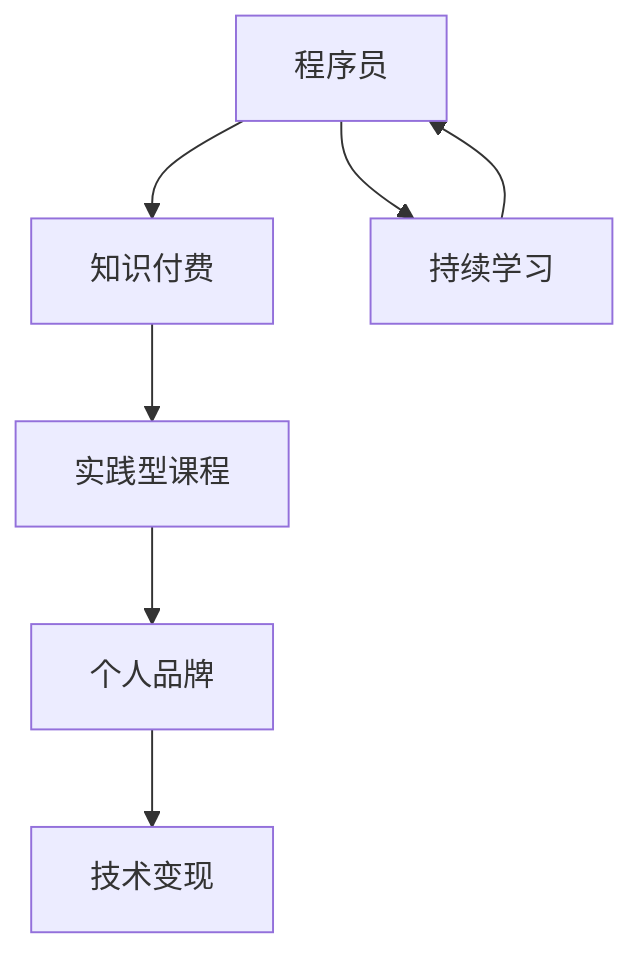

                 


# 程序员知识付费：打造实践型课程

> 关键词：程序员知识付费，实践型课程，技术分享，知识传播，个人品牌建设

> 摘要：本文旨在探讨程序员如何通过知识付费模式打造实践型课程，分享成功案例，分析市场需求，并提供实用的方法和策略，以实现个人品牌价值和职业发展的双赢。

## 1. 背景介绍

### 1.1 目的和范围

本文的目的是帮助程序员了解知识付费市场的现状和机遇，通过打造实践型课程来实现个人知识变现。本文将覆盖以下内容：

- 程序员知识付费的兴起背景
- 实践型课程的特点和优势
- 市场需求分析
- 成功案例分析
- 打造实践型课程的策略和方法
- 职业发展和个人品牌建设

### 1.2 预期读者

本文主要面向以下读者群体：

- 有意愿通过知识付费实现收入增长的程序员
- 想要提升个人品牌价值的开发者
- 对知识传播和技术分享有兴趣的IT从业者

### 1.3 文档结构概述

本文将分为以下几个部分：

- 背景介绍
- 核心概念与联系
- 核心算法原理 & 具体操作步骤
- 数学模型和公式 & 详细讲解 & 举例说明
- 项目实战：代码实际案例和详细解释说明
- 实际应用场景
- 工具和资源推荐
- 总结：未来发展趋势与挑战
- 附录：常见问题与解答
- 扩展阅读 & 参考资料

### 1.4 术语表

#### 1.4.1 核心术语定义

- 知识付费：指消费者为获取特定知识内容或服务而支付的费用。
- 实践型课程：侧重于实际操作和技能培养的课程，注重学员的动手能力和实战经验。
- 个人品牌：个人在特定领域内建立的专业形象和声誉。
- 技术变现：通过技术能力实现商业价值的过程。

#### 1.4.2 相关概念解释

- 知识传播：知识的传递和分享过程，包括线上和线下多种形式。
- 技术路线图：描述技术发展和应用方向的规划。
- 用户黏性：用户对产品或服务的忠诚度和依赖程度。

#### 1.4.3 缩略词列表

- IT：Information Technology，信息技术
- AI：Artificial Intelligence，人工智能
- SEO：Search Engine Optimization，搜索引擎优化
- UX：User Experience，用户体验

## 2. 核心概念与联系

在探讨程序员知识付费和打造实践型课程之前，我们需要明确一些核心概念，并了解它们之间的联系。

### 2.1 知识付费

知识付费是近年来兴起的一种商业模式，主要特征是消费者通过付费获取有价值的内容和服务。在IT领域，知识付费的形式多种多样，包括：

- 在线课程
- 技术讲座
- 知识星球
- 专业咨询服务

知识付费的兴起，一方面是由于互联网的普及和信息爆炸，用户对高质量知识的需求增加；另一方面，知识付费也为知识生产者提供了新的收入来源。

### 2.2 实践型课程

实践型课程是一种以实际操作为核心的课程形式，旨在帮助学员通过动手实践掌握技术和技能。与理论课程相比，实践型课程具有以下特点：

- 强调动手能力
- 注重实战经验
- 结合项目案例
- 知识点密集

实践型课程的优势在于学员可以通过实际操作快速提升技能，从而在实际工作中取得更好的成绩。

### 2.3 个人品牌

个人品牌是指个人在特定领域内建立的专业形象和声誉。对于程序员来说，个人品牌的价值体现在以下几个方面：

- 提升知名度
- 扩大影响力
- 增加职业机会
- 提高收入水平

个人品牌建设需要程序员在技术领域持续深耕，同时注重知识传播和社交互动。

### 2.4 技术变现

技术变现是指程序员通过技术能力实现商业价值的过程。在知识付费背景下，程序员可以通过以下方式实现技术变现：

- 开发和销售在线课程
- 提供专业咨询服务
- 参与技术交流和分享活动
- 创立技术公司

技术变现不仅可以帮助程序员实现收入增长，还可以提升个人品牌价值。

### 2.5 Mermaid 流程图

为了更直观地展示程序员知识付费、实践型课程、个人品牌和技术变现之间的联系，我们可以使用 Mermaid 流程图来描述。



## 3. 核心算法原理 & 具体操作步骤

在了解核心概念和联系之后，我们需要深入探讨程序员如何通过实践型课程实现技术变现。这里，我们将介绍一种基于知识付费的实践型课程开发算法，并详细阐述具体操作步骤。

### 3.1 算法原理

知识付费实践型课程开发算法的基本原理如下：

1. **需求分析**：了解目标受众的需求，确定课程主题和内容。
2. **内容设计**：根据需求分析结果，设计课程大纲和知识点。
3. **实战案例**：结合实际项目案例，讲解技术原理和操作步骤。
4. **互动环节**：设置问答和讨论环节，提高学员参与度和满意度。
5. **持续优化**：根据学员反馈，不断调整和优化课程内容。

### 3.2 具体操作步骤

以下是具体的操作步骤：

#### 步骤 1：需求分析

- **目标受众**：明确目标受众，如初级程序员、中级程序员、高级程序员等。
- **课程主题**：根据目标受众的需求，确定课程主题，如Web开发、大数据分析、人工智能等。
- **学习目标**：明确课程的学习目标，如掌握某项技术、解决某个问题等。

#### 步骤 2：内容设计

- **课程大纲**：设计课程大纲，包括课程名称、章节、知识点等。
- **知识点梳理**：梳理每个知识点，确保内容全面、易懂。
- **实战案例**：选择合适的实战案例，讲解技术原理和操作步骤。

#### 步骤 3：实战案例

- **项目介绍**：介绍项目的背景、目标和实现方案。
- **技术讲解**：讲解项目涉及的技术原理和操作步骤。
- **实战演示**：通过视频或直播形式，演示项目实现过程。

#### 步骤 4：互动环节

- **问答环节**：设置问答环节，解答学员的问题。
- **讨论环节**：组织讨论环节，促进学员之间的互动。

#### 步骤 5：持续优化

- **学员反馈**：收集学员的反馈意见。
- **内容调整**：根据反馈意见，调整和优化课程内容。
- **更新迭代**：定期更新课程内容，保持课程的时效性和实用性。

### 3.3 伪代码

以下是知识付费实践型课程开发算法的伪代码：

```pseudo
function 开发实践型课程(目标受众，课程主题，学习目标) {
    需求分析(目标受众，课程主题，学习目标)
    内容设计(课程大纲，知识点，实战案例)
    实战案例(项目介绍，技术讲解，实战演示)
    互动环节(问答环节，讨论环节)
    持续优化(学员反馈，内容调整，更新迭代)
}
```

## 4. 数学模型和公式 & 详细讲解 & 举例说明

在实践型课程开发中，数学模型和公式是不可或缺的一部分。它们可以帮助我们更准确地描述技术原理和操作步骤。以下是一个具体的数学模型和公式的例子，以及详细的讲解和举例说明。

### 4.1 数学模型：线性回归

线性回归是一种常用的数据分析方法，用于描述两个变量之间的线性关系。其基本公式为：

$$ y = ax + b $$

其中，$y$ 是因变量，$x$ 是自变量，$a$ 是斜率，$b$ 是截距。

### 4.2 公式讲解

- 斜率 $a$ 表示自变量 $x$ 变化一个单位时，因变量 $y$ 的变化量。
- 截距 $b$ 表示当自变量 $x$ 为 0 时，因变量 $y$ 的值。

### 4.3 举例说明

假设我们想要分析股票价格与时间之间的关系。我们收集了以下数据：

| 时间 (天) | 股票价格 (元) |
| :----: | :----: |
| 1 | 100 |
| 2 | 102 |
| 3 | 105 |
| 4 | 108 |
| 5 | 110 |

我们可以使用线性回归模型来分析这两个变量之间的关系。

1. **计算斜率 $a$**：

   $$ a = \frac{\sum_{i=1}^{n} (x_i - \bar{x})(y_i - \bar{y})}{\sum_{i=1}^{n} (x_i - \bar{x})^2} $$

   其中，$\bar{x}$ 和 $\bar{y}$ 分别是 $x$ 和 $y$ 的平均值。

   计算结果为：$a = 2$

2. **计算截距 $b$**：

   $$ b = \bar{y} - a\bar{x} $$

   计算结果为：$b = 98$

3. **建立线性回归模型**：

   $$ y = 2x + 98 $$

### 4.4 结果分析

根据线性回归模型，我们可以预测第 6 天的股票价格为：

$$ y = 2 \times 6 + 98 = 112 $$

这意味着，根据这个模型，我们预测第 6 天的股票价格将会是 112 元。

## 5. 项目实战：代码实际案例和详细解释说明

为了更好地理解实践型课程开发，我们通过一个实际案例来展示整个开发过程。

### 5.1 开发环境搭建

1. **安装 Python**：在官网上下载并安装 Python。
2. **安装 PyCharm**：下载并安装 PyCharm，一款流行的 Python 集成开发环境（IDE）。
3. **安装相关库**：打开终端，运行以下命令安装所需的库：

   ```bash
   pip install numpy matplotlib
   ```

### 5.2 源代码详细实现和代码解读

#### 5.2.1 代码实现

以下是一个简单的 Python 代码示例，用于绘制线性回归模型：

```python
import numpy as np
import matplotlib.pyplot as plt

# 数据
x = np.array([1, 2, 3, 4, 5])
y = np.array([100, 102, 105, 108, 110])

# 计算斜率和截距
a = np.sum((x - np.mean(x)) * (y - np.mean(y))) / np.sum((x - np.mean(x))**2)
b = np.mean(y) - a * np.mean(x)

# 建立线性回归模型
y_pred = a * x + b

# 绘图
plt.scatter(x, y, label='实际数据')
plt.plot(x, y_pred, color='red', label='预测数据')
plt.xlabel('时间（天）')
plt.ylabel('股票价格（元）')
plt.legend()
plt.show()
```

#### 5.2.2 代码解读

- **导入库**：导入 numpy 和 matplotlib 库。
- **数据准备**：准备时间和股票价格数据。
- **计算斜率和截距**：使用 numpy 库的函数计算斜率 $a$ 和截距 $b$。
- **建立线性回归模型**：根据斜率和截距计算预测值 $y_{\text{pred}}$。
- **绘图**：使用 matplotlib 库绘制实际数据和预测数据的散点图和回归线。

### 5.3 代码解读与分析

- **数据准备**：数据是模型训练和预测的基础，我们需要确保数据的准确性和完整性。
- **计算斜率和截距**：这是线性回归模型的核心步骤，计算结果决定了模型的质量。
- **建立线性回归模型**：根据斜率和截距计算预测值，这是模型应用的关键。
- **绘图**：可视化结果可以帮助我们直观地理解模型的效果。

通过这个案例，我们可以看到实践型课程开发是如何从理论到实践的完整过程。从需求分析、内容设计、实战案例到互动环节，每个环节都需要我们深入思考和实践。

## 6. 实际应用场景

实践型课程在程序员知识付费领域有着广泛的应用场景，以下是一些典型的应用场景：

### 6.1 在线教育平台

在线教育平台是实践型课程的主要载体，如 Coursera、edX、慕课网等。这些平台通过实践型课程为学员提供专业的技术培训，满足学员对知识和技能的需求。

### 6.2 技术社区和论坛

技术社区和论坛是程序员交流和分享知识的平台，如 GitHub、Stack Overflow、CSDN 等。这些平台上的实践型课程可以帮助程序员解决实际问题，提高技术水平。

### 6.3 专业咨询和培训

专业咨询和培训公司通过实践型课程为客户提供定制化的技术培训和服务，如ThoughtWorks、Infosys等。这些公司利用实践型课程帮助客户提升技术能力和解决业务问题。

### 6.4 企业内训

企业内训是实践型课程在职场中的应用，企业通过实践型课程为员工提供技术培训和职业发展支持，提高整体技术水平和竞争力。

### 6.5 个人品牌建设

程序员通过实践型课程分享自己的知识和经验，提升个人品牌价值，扩大影响力，如极客时间、开课吧等平台上的知名讲师。

### 6.6 技术竞赛和项目实践

技术竞赛和项目实践是程序员检验和提升技术能力的有效途径，通过实践型课程，程序员可以掌握最新的技术和方法，提高实战能力。

## 7. 工具和资源推荐

为了更好地打造实践型课程，我们需要借助一些工具和资源。以下是一些值得推荐的工具和资源：

### 7.1 学习资源推荐

#### 7.1.1 书籍推荐

- 《深度学习》（Ian Goodfellow, Yoshua Bengio, Aaron Courville 著）
- 《Python编程：从入门到实践》（埃里克·马瑟斯 著）
- 《算法导论》（Thomas H. Cormen, Charles E. Leiserson, Ronald L. Rivest, Clifford Stein 著）

#### 7.1.2 在线课程

- Coursera
- edX
- 慕课网
- 网易云课堂

#### 7.1.3 技术博客和网站

- GitHub
- Stack Overflow
- CSDN
- 掘金

### 7.2 开发工具框架推荐

#### 7.2.1 IDE和编辑器

- PyCharm
- Visual Studio Code
- Sublime Text

#### 7.2.2 调试和性能分析工具

- GDB
- JUnit
- Valgrind

#### 7.2.3 相关框架和库

- TensorFlow
- PyTorch
- Flask

### 7.3 相关论文著作推荐

#### 7.3.1 经典论文

- 《A Fast Learning Algorithm for Deep Belief Nets》
- 《Deep Learning》
- 《Neural Networks and Deep Learning》

#### 7.3.2 最新研究成果

- 《Advances in Neural Information Processing Systems》
- 《Journal of Machine Learning Research》
- 《IEEE Transactions on Neural Networks and Learning Systems》

#### 7.3.3 应用案例分析

- 《谷歌大脑：深度学习的实践指南》
- 《亚马逊机器学习实战》
- 《微软人工智能应用案例分析》

## 8. 总结：未来发展趋势与挑战

程序员知识付费和打造实践型课程是当前和未来信息技术领域的重要趋势。随着技术的不断发展和互联网的普及，以下几个方面将是未来发展的关键：

### 8.1 技术多样化

未来程序员知识付费将涉及更多领域，如人工智能、大数据、云计算、区块链等。程序员需要不断学习和更新知识，以适应不断变化的市场需求。

### 8.2 课程专业化

实践型课程将更加专业化，针对不同层次的程序员提供定制化的培训。同时，课程内容将更加注重实际操作和实战经验。

### 8.3 个人品牌价值

个人品牌价值将不断提升，程序员通过打造专业形象和影响力，将获得更多的职业机会和收入来源。

### 8.4 知识传播渠道多样化

随着互联网技术的发展，知识传播渠道将更加多样化，如在线教育、社交媒体、直播等。程序员可以通过多种方式分享知识和经验。

### 8.5 挑战与应对

面对未来发展的机遇，程序员也面临一定的挑战：

- **技术更新速度快**：程序员需要不断学习和更新知识，以保持竞争力。
- **课程质量要求高**：实践型课程要求内容质量高，学员参与度强。
- **市场竞争激烈**：程序员需要打造个人品牌，提高课程竞争力。

### 8.6 未来展望

未来，程序员知识付费和打造实践型课程将继续蓬勃发展。通过不断学习和创新，程序员可以在这个领域实现个人价值和职业发展的双赢。

## 9. 附录：常见问题与解答

### 9.1 问题一：如何选择课程主题？

解答：选择课程主题时，可以从以下几个方面考虑：

- **市场需求**：了解市场上热门的技术领域和课程主题。
- **个人兴趣**：选择自己擅长和感兴趣的领域，更容易投入精力。
- **职业规划**：根据个人职业规划，选择有助于提升技能的课程主题。

### 9.2 问题二：如何设计课程内容？

解答：设计课程内容时，可以按照以下步骤进行：

- **需求分析**：了解目标受众的需求和期望。
- **知识点梳理**：根据需求分析结果，梳理每个知识点。
- **实战案例**：选择合适的实战案例，结合知识点进行讲解。
- **互动环节**：设置问答和讨论环节，提高学员参与度。

### 9.3 问题三：如何确保课程质量？

解答：确保课程质量可以从以下几个方面入手：

- **内容审核**：邀请领域专家对课程内容进行审核，确保准确性和实用性。
- **教学评估**：定期对课程进行评估，收集学员反馈，持续优化课程内容。
- **专业支持**：提供专业的教学支持和辅导，帮助学员解决学习中的问题。

## 10. 扩展阅读 & 参考资料

- [《深度学习》](https://www.deeplearningbook.org/)
- [《Python编程：从入门到实践》](https://www.pythondoc.com/)
- [《算法导论》](https://books.google.com/books?id=wi5Iw1GJlEUC)
- [Coursera](https://www.coursera.org/)
- [edX](https://www.edx.org/)
- [慕课网](https://www.mucou.com/)
- [GitHub](https://github.com/)
- [Stack Overflow](https://stackoverflow.com/)
- [CSDN](https://www.csdn.net/)
- [掘金](https://juejin.cn/)

## 作者信息

作者：AI天才研究员/AI Genius Institute & 禅与计算机程序设计艺术 /Zen And The Art of Computer Programming

