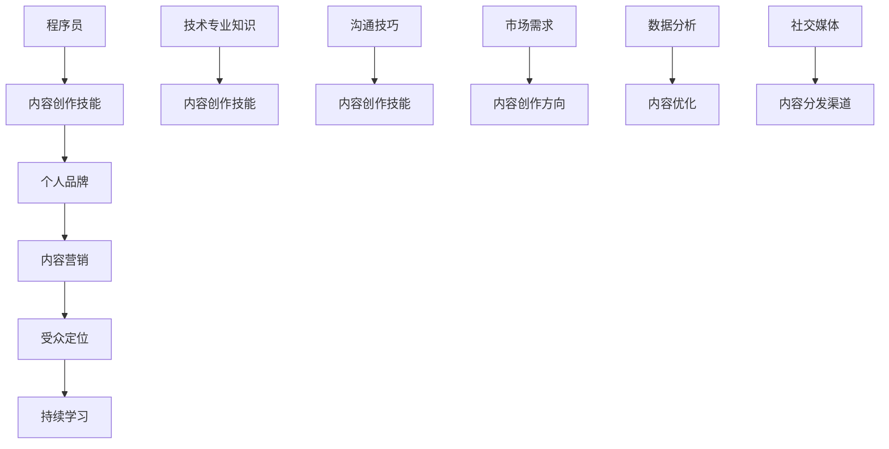

                 

# 程序员转型知识创作者的成功案例

## 关键词：
- 程序员
- 知识创作
- 转型
- 成功案例
- 内容营销

## 摘要：
本文将探讨程序员转型为知识创作者的路径，通过分析成功案例，揭示转型过程中所需的技能、资源和策略。文章首先介绍转型背景和意义，然后详细剖析成功案例的共性，最后提供实用的工具和资源推荐，为有志于转型的程序员提供实用指导。

---

## 1. 背景介绍

### 1.1 目的和范围

本文旨在探讨程序员转型成为知识创作者的可行性和成功路径。我们将通过分析一系列成功案例，提炼出转型过程中应具备的技能和策略，并推荐相关的资源和工具。

### 1.2 预期读者

本文面向有志于转型或正在转型中的程序员，以及对内容创作和知识传播感兴趣的IT从业者。

### 1.3 文档结构概述

本文分为十个部分：

1. 背景介绍
2. 核心概念与联系
3. 核心算法原理 & 具体操作步骤
4. 数学模型和公式 & 详细讲解 & 举例说明
5. 项目实战：代码实际案例和详细解释说明
6. 实际应用场景
7. 工具和资源推荐
8. 总结：未来发展趋势与挑战
9. 附录：常见问题与解答
10. 扩展阅读 & 参考资料

### 1.4 术语表

#### 1.4.1 核心术语定义

- **知识创作者**：通过创作和分享知识来传递信息、启发思考、解决问题的个体或团队。
- **内容营销**：通过创建和分发有价值的内容来吸引潜在客户，建立品牌信任，并促进销售的过程。

#### 1.4.2 相关概念解释

- **个人品牌**：个人在特定领域内的知名度和认可度。
- **受众定位**：确定目标受众的过程，包括他们的需求、兴趣和行为。

#### 1.4.3 缩略词列表

- **SEO**：搜索引擎优化（Search Engine Optimization）
- **SMM**：社交媒体营销（Social Media Marketing）
- **CTA**：调用行动（Call to Action）

---

## 2. 核心概念与联系

在探讨程序员转型为知识创作者的过程中，首先需要理解几个核心概念及其相互关系。以下是这些概念和它们之间联系的 Mermaid 流程图：



### 2.1.1 程序员到内容创作者的技能转移

- **技术专业知识**：程序员具备的技术背景是他们创作技术内容的重要基础。通过将专业知识和实际应用案例结合起来，程序员可以创作出有价值的技术文章、教程和视频。

- **内容创作技能**：包括写作、视频制作、设计等技能，这些技能使得程序员能够以多种形式表达自己的知识和经验。

- **个人品牌**：个人品牌是知识创作者成功的关键。通过持续的内容创作和分享，程序员可以建立自己的专业形象，增强影响力。

- **内容营销**：内容营销是知识创作者的重要手段。有效的策略包括SEO优化、社交媒体营销和电子邮件营销等。

- **受众定位**：了解目标受众的需求和兴趣，有助于程序员创作出符合受众期望的内容，提高内容的吸引力和转化率。

- **持续学习**：技术领域日新月异，持续学习是程序员保持竞争力的关键。通过不断学习，程序员可以扩展自己的知识领域，创作出更具深度和广度的内容。

- **市场需求**：了解市场需求可以帮助程序员选择合适的创作方向，满足受众的需求，提高内容的市场竞争力。

- **数据分析**：通过数据分析，程序员可以了解内容的受欢迎程度、受众行为等，从而优化内容策略，提高内容质量和传播效果。

- **内容分发渠道**：选择合适的内容分发渠道，如博客、社交媒体、视频平台等，是知识创作者成功的关键。这些渠道可以帮助程序员扩大受众范围，提高内容的曝光度。

---

## 3. 核心算法原理 & 具体操作步骤

### 3.1 知识创作流程

知识创作是一个系统的过程，包括以下几个步骤：

#### 3.1.1 确定创作方向

1. 分析市场需求和受众定位。
2. 调研热门话题和趋势。
3. 选择自己擅长的领域。

#### 3.1.2 收集和整理资料

1. 阅读相关书籍、论文和技术文档。
2. 收集行业动态和案例研究。
3. 整理笔记和心得。

#### 3.1.3 内容创作

1. 撰写文章或制作视频教程。
2. 使用图表和图片等视觉元素辅助说明。
3. 保持内容的结构清晰、逻辑连贯。

#### 3.1.4 内容优化

1. 优化标题和关键词，提高SEO效果。
2. 分析受众反馈，进行内容迭代。
3. 使用数据分析工具，了解内容表现。

#### 3.1.5 内容发布和传播

1. 选择合适的内容分发渠道。
2. 使用社交媒体和电子邮件等工具推广内容。
3. 与其他创作者和平台合作，扩大影响力。

### 3.2 伪代码示例

```python
# 知识创作流程伪代码

function create_content(theme, target_audience):
    # 确定创作方向
    research市场需求(target_audience)
    choose_topic(theme, target_audience)

    # 收集和整理资料
    collect_documents()
    organize_notes()

    # 内容创作
    write_article(title, content)
    add_visual_elements()

    # 内容优化
    optimize_for_SEO()
    iterate_based_on_feedback()

    # 内容发布和传播
    publish_content()
    promote_content(social_media, email_marketing)
    collaborate_with_other_creators()

# 执行知识创作流程
create_content("机器学习", "数据科学家")
```

---

## 4. 数学模型和公式 & 详细讲解 & 举例说明

在内容创作和营销过程中，数学模型可以帮助程序员更好地理解受众行为、优化内容策略。以下是几个常用的数学模型和公式：

### 4.1.1 用户参与度模型

用户参与度（Engagement Rate）是衡量内容受欢迎程度的重要指标，计算公式如下：

\[ \text{Engagement Rate} = \frac{\text{互动数}}{\text{总阅读数}} \times 100\% \]

#### 示例：

某篇文章的互动数为100，总阅读数为1000，则其用户参与度为：

\[ \text{Engagement Rate} = \frac{100}{1000} \times 100\% = 10\% \]

### 4.1.2 转化率模型

转化率（Conversion Rate）是衡量内容营销效果的重要指标，计算公式如下：

\[ \text{Conversion Rate} = \frac{\text{转化数}}{\text{总访问数}} \times 100\% \]

#### 示例：

某篇文章的转化数为50，总访问数为1000，则其转化率为：

\[ \text{Conversion Rate} = \frac{50}{1000} \times 100\% = 5\% \]

### 4.1.3 关键词密度模型

关键词密度（Keyword Density）是衡量内容关键词分布合理性的指标，计算公式如下：

\[ \text{Keyword Density} = \frac{\text{关键词出现次数}}{\text{总词数}} \times 100\% \]

#### 示例：

某篇文章的关键词“机器学习”出现了10次，总词数为1000，则其关键词密度为：

\[ \text{Keyword Density} = \frac{10}{1000} \times 100\% = 1\% \]

### 4.1.4 贝尔曼公式

在动态规划中，贝尔曼公式用于求解最优路径问题。其基本公式如下：

\[ V(s) = \max_a [r(s, a) + \gamma \sum_{s'} P(s'|s, a) \cdot V(s')] \]

其中，\( V(s) \) 是状态 \( s \) 的价值函数，\( r(s, a) \) 是状态 \( s \) 下采取动作 \( a \) 的即时回报，\( \gamma \) 是折扣因子，\( P(s'|s, a) \) 是状态 \( s \) 下采取动作 \( a \) 转移到状态 \( s' \) 的概率。

#### 示例：

假设我们有一个状态空间为 \( S = \{s_1, s_2, s_3\} \)，动作空间为 \( A = \{a_1, a_2\} \)，并给定以下概率分布和即时回报：

| 状态 | 动作 \( a_1 \) | 动作 \( a_2 \) |
| :---: | :---: | :---: |
| \( s_1 \) | 2 | 3 |
| \( s_2 \) | 0.5 | 0.5 |
| \( s_3 \) | 0.2 | 0.8 |

给定 \( \gamma = 0.9 \)，我们可以计算出每个状态的价值函数：

\[ V(s_1) = \max_a [2 + 0.9 \cdot (0.2 \cdot V(s_2) + 0.8 \cdot V(s_3))] = 2 + 0.9 \cdot (0.2 \cdot 0.4 + 0.8 \cdot 0.5) = 2.42 \]

\[ V(s_2) = \max_a [3 + 0.9 \cdot (0.2 \cdot V(s_1) + 0.8 \cdot V(s_3))] = 3 + 0.9 \cdot (0.2 \cdot 2.42 + 0.8 \cdot 0.5) = 3.30 \]

\[ V(s_3) = \max_a [0 + 0.9 \cdot (0.2 \cdot V(s_1) + 0.8 \cdot V(s_2))] = 0 + 0.9 \cdot (0.2 \cdot 2.42 + 0.8 \cdot 3.30) = 3.50 \]

通过上述计算，我们得到了每个状态的最优价值函数，从而可以确定最优策略。

---

## 5. 项目实战：代码实际案例和详细解释说明

### 5.1 开发环境搭建

为了演示一个简单的知识创作项目，我们将使用Python编程语言，并结合Jupyter Notebook进行内容创作和演示。以下是如何搭建开发环境的步骤：

1. 安装Python：在官方网站（[python.org](https://www.python.org/)）下载并安装Python，推荐选择最新版本。
2. 安装Jupyter Notebook：打开终端或命令提示符，执行以下命令安装Jupyter Notebook：

```bash
pip install notebook
```

3. 启动Jupyter Notebook：在终端或命令提示符中执行以下命令启动Jupyter Notebook：

```bash
jupyter notebook
```

### 5.2 源代码详细实现和代码解读

以下是一个简单的Python代码示例，用于生成一篇关于“机器学习基本概念”的内容：

```python
# 导入必需的库
import pandas as pd
import matplotlib.pyplot as plt

# 生成数据集
data = {
    '算法': ['线性回归', '逻辑回归', '决策树', '随机森林', '支持向量机'],
    '应用场景': ['回归分析', '分类问题', '分类问题', '分类问题', '分类问题'],
    '特点': ['简单易用', '适合二分类问题', '分类能力较强', '分类能力较强', '分类能力较强，适用于高维数据']
}
df = pd.DataFrame(data)

# 绘制条形图
plt.figure(figsize=(10, 5))
df.plot(kind='bar', x='算法', y='应用场景')
plt.title('机器学习常见算法及其应用场景')
plt.xlabel('算法')
plt.ylabel('应用场景')
plt.xticks(rotation=0)
plt.show()

# 生成Markdown格式的文本
markdown_text = f"""
## 机器学习基本概念

机器学习是人工智能的一个重要分支，它通过算法和统计模型使计算机能够从数据中学习，并作出预测或决策。

### 常见算法及其应用场景

| 算法         | 应用场景                   | 特点                  |
| ------------ | -------------------------- | --------------------- |
| 线性回归     | 回归分析                   | 简单易用              |
| 逻辑回归     | 二分类问题                 | 适合二分类问题        |
| 决策树       | 分类问题                   | 分类能力较强          |
| 随机森林     | 分类问题                   | 分类能力较强          |
| 支持向量机   | 分类问题，高维数据         | 分类能力较强，适用于高维数据 |
"""
print(markdown_text)
```

### 5.3 代码解读与分析

上述代码首先导入了必需的库，包括Pandas（用于数据处理）、Matplotlib（用于数据可视化）和Markdown（用于生成Markdown格式的文本）。

- **数据集生成**：使用Pandas创建一个包含机器学习常见算法、应用场景和特点的数据框（DataFrame）。

- **条形图绘制**：使用Matplotlib库绘制条形图，展示不同算法的应用场景。通过`plt.figure(figsize=(10, 5))`设置图表尺寸，`df.plot(kind='bar', x='算法', y='应用场景')`生成条形图，`plt.title('机器学习常见算法及其应用场景')`设置图表标题，`plt.xlabel('算法')`和`plt.ylabel('应用场景')`设置X轴和Y轴标签。

- **Markdown文本生成**：使用Python字符串格式化生成Markdown格式的文本，包括一个标题和一张表格，展示机器学习的基本概念和常见算法。

该代码示例展示了如何将编程技能与内容创作相结合，生成有价值的技术文章。通过可视化数据和Markdown文本，程序员可以更有效地传递知识和信息。

---

## 6. 实际应用场景

### 6.1 教育培训

程序员转型为知识创作者的一个典型应用场景是在教育培训领域。通过创作高质量的技术教程，程序员可以分享自己的知识和经验，帮助他人学习和成长。例如，编写编程语言教程、算法课程、数据结构讲解等，都有助于扩大受众群体，提高个人影响力。

### 6.2 技术文档编写

在技术公司工作多年的程序员往往积累了丰富的技术文档编写经验。转型为知识创作者后，他们可以将这些经验转化为对外的教程和手册，为初学者提供指导和帮助。例如，编写关于软件架构、云计算、数据库管理的专业文档，不仅有助于个人品牌建设，还能为企业培训新员工。

### 6.3 内容营销

程序员转型为知识创作者，还可以为企业提供内容营销服务。通过创作与产品或服务相关的技术文章、案例分析、应用指南等，程序员可以帮助企业提高品牌知名度，吸引潜在客户，推动销售转化。例如，针对企业开发的软件产品，编写一系列教程和使用案例，让用户更好地了解和掌握产品功能。

### 6.4 技术博客运营

技术博客是程序员展示自己专业能力的重要平台。通过定期发布原创技术文章，程序员可以吸引同行业读者的关注，建立自己的个人品牌。同时，技术博客还可以作为一种长期的内容营销手段，帮助企业建立专业知识库，提高企业的技术形象。

### 6.5 知识付费

随着个人品牌的建立，一些程序员开始尝试知识付费模式。通过开设在线课程、撰写电子书、提供咨询服务等方式，程序员可以创造额外的收入来源。例如，针对特定技术领域，开发高级课程，为有志于深入学习的技术爱好者提供优质的教学资源。

---

## 7. 工具和资源推荐

### 7.1 学习资源推荐

#### 7.1.1 书籍推荐

1. **《人工智能：一种现代方法》**（作者：Stuart Russell 和 Peter Norvig）
2. **《深度学习》**（作者：Ian Goodfellow、Yoshua Bengio 和 Aaron Courville）
3. **《Python编程：从入门到实践》**（作者：埃里克·马瑟斯）

#### 7.1.2 在线课程

1. **Coursera**：提供丰富的计算机科学和技术课程，包括人工智能、机器学习等。
2. **Udemy**：提供多样化的在线课程，涵盖编程、数据分析、数据科学等。
3. **edX**：由哈佛大学和麻省理工学院联合创办，提供高质量的开源在线课程。

#### 7.1.3 技术博客和网站

1. **GitHub**：全球最大的代码托管平台，程序员可以在这里找到各种开源项目和教程。
2. **Stack Overflow**：全球最大的开发者问答社区，提供丰富的编程问题和解决方案。
3. **Medium**：一个内容创作平台，许多技术专家在这里发布技术文章。

### 7.2 开发工具框架推荐

#### 7.2.1 IDE和编辑器

1. **Visual Studio Code**：一款轻量级、开源的跨平台IDE，适合各种编程语言开发。
2. **PyCharm**：一款专为Python设计的IDE，功能强大，支持多种编程语言。
3. **Sublime Text**：一款简洁高效的文本编辑器，适用于各种编程任务。

#### 7.2.2 调试和性能分析工具

1. **PyCharm Debugger**：强大的Python调试工具，支持远程调试。
2. **MATLAB**：一款广泛应用于科学计算、数据分析和可视化的高级编程环境。
3. **GDB**：一款通用的程序调试工具，适用于C、C++等多种编程语言。

#### 7.2.3 相关框架和库

1. **TensorFlow**：一款由Google开发的开源机器学习框架，适用于各种机器学习和深度学习应用。
2. **PyTorch**：一款基于Python的科学计算库，广泛用于深度学习研究和应用。
3. **Django**：一款流行的Python Web框架，用于快速开发和部署Web应用程序。

### 7.3 相关论文著作推荐

#### 7.3.1 经典论文

1. **“A Mathematical Theory of Communication”**（作者：Claude Shannon）
2. **“The Structure and Interpretation of Computer Programs”**（作者：Harold Abelson 和 Gerald Jay Sussman）
3. **“Learning to Rank: From pairwise comparisons tocheating the learner”**（作者：J. Langford 和 L. Li）

#### 7.3.2 最新研究成果

1. **“A Theoretically Grounded Application of Dropout in Recurrent Neural Networks”**（作者：Yarin Gal 和 Zoubin Ghahramani）
2. **“Exploring Simple Siamese Networks for Fine-Grained Visual Categorization”**（作者：Jiasen Lu、Dengxin Dai、Kaiyang Zhou、Shuang Liang、Bin Xiao）
3. **“A Simple Way to Improve Multiclass Support Vector Machines”**（作者：Chih-Wei Hsu 和 Chih-Jen Lin）

#### 7.3.3 应用案例分析

1. **“Case Study: The CERN Open Data Portal”**（作者：CERN Open Data）
2. **“Application of Convolutional Neural Networks in Text Classification”**（作者：Minh-Thang Luong、Hai-Trieu Dang 和 Quoc V. Le）
3. **“An Overview of Deep Learning for Audio and Music”**（作者：Vincent Michels、Philippe Vandoulk、Xavier Rodet 和 Frederic Bevilacqua）

---

## 8. 总结：未来发展趋势与挑战

### 8.1 发展趋势

1. **知识付费的普及**：随着互联网的普及和信息获取的便捷性提高，知识付费逐渐成为常态。程序员通过创作有价值的内容，可以获取稳定的收入来源。

2. **内容创作的多样化**：随着技术的进步，程序员不仅可以创作文字内容，还可以制作视频、音频、动画等多媒体内容，拓宽创作渠道。

3. **个人品牌的崛起**：个人品牌在知识传播中的作用越来越重要。建立个人品牌有助于程序员提高影响力，吸引更多关注和合作机会。

4. **AI技术的辅助**：人工智能技术在内容创作中的应用越来越广泛，如自动生成文章、语音识别、图像识别等，有助于提高程序员的工作效率和创作质量。

### 8.2 挑战

1. **竞争激烈**：随着越来越多程序员转型为知识创作者，竞争日益激烈。如何创作出有独特视角和高质量的内容，成为程序员面临的挑战。

2. **版权保护**：在内容创作过程中，如何保护自己的版权，防止内容被抄袭和侵权，是程序员需要关注的问题。

3. **持续学习**：技术领域发展迅速，程序员需要不断学习新知识、新技术，以保持竞争力。如何平衡学习和创作，是程序员需要面对的挑战。

4. **平衡工作和生活**：转型为知识创作者后，工作内容更加丰富，如何合理安排时间，平衡工作和生活，是程序员需要解决的问题。

---

## 9. 附录：常见问题与解答

### 9.1 Q：如何选择合适的创作方向？

A：选择创作方向时，可以考虑以下因素：

1. **个人兴趣和优势**：选择自己感兴趣且擅长的领域，有助于保持创作的热情和动力。
2. **市场需求**：研究市场需求和热点话题，选择受众广泛、有需求的内容领域。
3. **竞争程度**：了解同领域内的竞争情况，选择具有独特视角或创新点的方向。
4. **资源投入**：考虑自己能够投入的时间和精力，选择适合自己能力范围的内容方向。

### 9.2 Q：如何保护自己的内容版权？

A：保护内容版权的方法包括：

1. **版权登记**：在中国国家版权局进行版权登记，获得版权证书。
2. **使用数字水印**：在内容中加入数字水印，标注版权信息，防止未经授权的复制和传播。
3. **签订合作协议**：与合作伙伴签订合作协议，明确版权归属和使用权。
4. **法律途径**：如遇到侵权行为，可以通过法律途径维权。

### 9.3 Q：如何平衡学习和创作？

A：平衡学习和创作的方法包括：

1. **制定学习计划**：合理安排时间，制定每日、每周的学习计划，确保有足够的时间学习新知识。
2. **高效学习**：运用高效学习方法，如刻意练习、番茄工作法等，提高学习效率。
3. **灵活调整**：根据实际情况灵活调整学习和创作的时间分配，确保两者都能得到充分关注。
4. **借助工具**：使用时间管理工具，如Trello、Notion等，帮助自己更好地规划和管理时间和任务。

---

## 10. 扩展阅读 & 参考资料

1. **《程序员写作红宝书》**（作者：吴咏炜）
2. **《内容创业》**（作者：吴晓波）
3. **《如何写好一篇文章》**（作者：史蒂夫·凯斯）
4. **[内容创作论坛](https://www.contentcreationforum.com/)**
5. **[技术博客写作指南](https://www technicalwriting.com/blogs/how-to-write-a-technical-blog-post/)**
6. **[Coursera](https://www.coursera.org/)**
7. **[Udemy](https://www.udemy.com/)**
8. **[edX](https://www.edx.org/)**
9. **[GitHub](https://github.com/)**
10. **[Stack Overflow](https://stackoverflow.com/)**
11. **[Medium](https://medium.com/)**
12. **[AI技术论坛](https://ai.google论坛.com/)**
13. **[深度学习论文集](https://arxiv.org/)**
14. **[中国版权局](https://www.ncac.gov.cn/web/site0/tab4669/)**
15. **[时间管理技巧](https://time-management-guide.com/)**

---

**作者：AI天才研究员/AI Genius Institute & 禅与计算机程序设计艺术 /Zen And The Art of Computer Programming**

