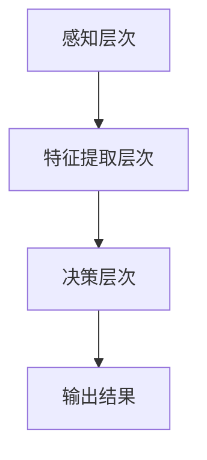

                 

# 端到端学习范式优化自动驾驶模型性能的案例启示

> **关键词**：端到端学习，自动驾驶，模型性能，深度学习，神经网络，算法优化，数据处理，实时性，安全性。

> **摘要**：本文通过分析端到端学习范式在自动驾驶领域中的应用，探讨如何通过算法优化提升自动驾驶模型的性能。本文首先介绍了端到端学习的核心概念和其在自动驾驶中的具体应用，然后详细讲解了核心算法原理和操作步骤，并通过数学模型和公式进行了详细阐述。随后，文章通过实战案例展示了代码实现，分析了实际应用场景，并推荐了相关的工具和资源。最后，文章总结了未来发展趋势与挑战，为自动驾驶技术的发展提供了有价值的启示。

## 1. 背景介绍

### 1.1 目的和范围

本文旨在探讨端到端学习范式在自动驾驶模型性能优化中的应用。通过介绍端到端学习的基本原理、算法实现及数学模型，分析其在自动驾驶领域中的实际应用，探讨如何通过算法优化提升自动驾驶模型的性能。本文将重点关注以下几个方面：

1. 端到端学习的概念及其在自动驾驶中的应用。
2. 自动驾驶模型性能优化的关键因素。
3. 端到端学习算法的具体实现和数学模型。
4. 实际应用场景下的代码实现和分析。
5. 相关工具和资源的推荐。

### 1.2 预期读者

本文适合以下读者群体：

1. 深度学习、自动驾驶等领域的工程师和研究人员。
2. 对端到端学习算法感兴趣的技术爱好者。
3. 想要了解自动驾驶技术及其应用场景的企业管理者。

### 1.3 文档结构概述

本文分为以下几个部分：

1. 引言：介绍文章的目的和关键词。
2. 背景介绍：包括目的和范围、预期读者、文档结构概述等。
3. 核心概念与联系：介绍端到端学习的核心概念、原理和架构。
4. 核心算法原理 & 具体操作步骤：详细讲解端到端学习算法的原理和操作步骤。
5. 数学模型和公式 & 详细讲解 & 举例说明：介绍端到端学习算法的数学模型和公式。
6. 项目实战：代码实际案例和详细解释说明。
7. 实际应用场景：分析端到端学习算法在自动驾驶领域的应用场景。
8. 工具和资源推荐：推荐学习资源、开发工具框架和相关论文著作。
9. 总结：未来发展趋势与挑战。
10. 附录：常见问题与解答。
11. 扩展阅读 & 参考资料。

### 1.4 术语表

#### 1.4.1 核心术语定义

- 端到端学习：直接从原始数据学习复杂任务，不需要通过中间表示。
- 自动驾驶：利用传感器、计算机视觉等技术实现车辆自主驾驶。
- 深度学习：一种基于神经网络的多层学习模型，通过逐层提取特征来提高学习效果。
- 神经网络：一种模仿生物神经系统的计算模型，包括输入层、隐藏层和输出层。
- 模型性能：衡量模型在特定任务上的表现，包括准确性、实时性和鲁棒性等。

#### 1.4.2 相关概念解释

- 端到端学习（End-to-End Learning）：端到端学习是一种直接从原始数据学习复杂任务的方法，不需要通过中间表示。在自动驾驶领域，端到端学习可以帮助直接从传感器数据中学习驾驶策略，无需人工干预。
- 自动驾驶（Autonomous Driving）：自动驾驶是利用传感器、计算机视觉、GPS等技术，实现车辆自主驾驶的一种技术。自动驾驶系统可以识别道路信息、交通标志、行人等，并做出相应的驾驶决策。
- 深度学习（Deep Learning）：深度学习是一种基于神经网络的多层学习模型，通过逐层提取特征来提高学习效果。深度学习在图像识别、自然语言处理等领域取得了显著的成果。

#### 1.4.3 缩略词列表

- DNN：深度神经网络（Deep Neural Network）
- CNN：卷积神经网络（Convolutional Neural Network）
- RNN：循环神经网络（Recurrent Neural Network）
- LSTM：长短期记忆网络（Long Short-Term Memory）
- CNN+LSTM：卷积神经网络与循环神经网络的结合

## 2. 核心概念与联系

### 2.1 核心概念

端到端学习（End-to-End Learning）是一种直接从原始数据学习复杂任务的方法，不需要通过中间表示。在自动驾驶领域，端到端学习可以帮助直接从传感器数据中学习驾驶策略，无需人工干预。

端到端学习的关键在于将原始数据输入到神经网络中，通过多层神经网络的学习和优化，最终得到所需的输出结果。在自动驾驶中，输入数据可以是激光雷达、摄像头、GPS等传感器采集的数据，输出结果可以是车辆控制命令、导航路径等。

### 2.2 原理和架构

端到端学习的原理基于深度神经网络（Deep Neural Network，DNN）。DNN是一种多层神经网络，包括输入层、隐藏层和输出层。输入层接收原始数据，隐藏层通过逐层提取特征，输出层产生预测结果。

在自动驾驶中，DNN可以分为以下几个层次：

1. **感知层次**：通过激光雷达、摄像头等传感器采集数据，将原始数据输入到神经网络中。
2. **特征提取层次**：通过卷积神经网络（Convolutional Neural Network，CNN）等网络结构，对原始数据进行特征提取。
3. **决策层次**：通过循环神经网络（Recurrent Neural Network，RNN）等网络结构，对提取到的特征进行融合和决策。

### 2.3 Mermaid 流程图



## 3. 核心算法原理 & 具体操作步骤

### 3.1 端到端学习算法原理

端到端学习算法基于深度神经网络（DNN），其核心原理是通过多层神经网络的学习和优化，实现对输入数据的自动特征提取和任务输出。

DNN包括以下几个关键组成部分：

1. **输入层**：接收原始数据，如传感器采集的图像、激光雷达点云等。
2. **隐藏层**：通过神经网络结构对输入数据进行特征提取和转换。
3. **输出层**：产生最终的预测结果，如车辆控制命令、导航路径等。

端到端学习算法的关键步骤如下：

1. **数据预处理**：对原始数据进行归一化、裁剪、缩放等处理，使其适合神经网络输入。
2. **模型设计**：设计适合任务的神经网络结构，包括选择合适的网络层、激活函数、损失函数等。
3. **模型训练**：利用训练数据，通过反向传播算法更新网络参数，优化模型性能。
4. **模型评估**：利用测试数据评估模型性能，调整模型参数和结构，提高模型准确性。
5. **模型部署**：将训练好的模型部署到实际应用场景中，进行自动驾驶任务。

### 3.2 端到端学习算法操作步骤

以下是端到端学习算法的操作步骤，使用伪代码进行详细阐述：

```python
# 输入数据预处理
def preprocess_data(data):
    # 数据归一化、裁剪、缩放等处理
    processed_data = ...
    return processed_data

# 神经网络模型设计
def create_model():
    # 创建神经网络结构
    model = ...
    return model

# 模型训练
def train_model(model, train_data, train_labels):
    # 反向传播算法更新网络参数
    for epoch in range(num_epochs):
        for data, label in zip(train_data, train_labels):
            processed_data = preprocess_data(data)
            model.forward(processed_data)
            loss = model.compute_loss(label)
            model.backward(loss)
            model.update_params()
    return model

# 模型评估
def evaluate_model(model, test_data, test_labels):
    # 利用测试数据评估模型性能
    correct_predictions = 0
    for data, label in zip(test_data, test_labels):
        processed_data = preprocess_data(data)
        prediction = model.forward(processed_data)
        if prediction == label:
            correct_predictions += 1
    accuracy = correct_predictions / len(test_labels)
    return accuracy

# 模型部署
def deploy_model(model, real_time_data):
    # 将训练好的模型部署到实际应用场景中
    processed_data = preprocess_data(real_time_data)
    prediction = model.forward(processed_data)
    return prediction
```

## 4. 数学模型和公式 & 详细讲解 & 举例说明

### 4.1 数学模型

端到端学习算法的核心在于神经网络的设计和训练，其数学模型主要包括以下几个方面：

1. **前向传播**：输入数据通过神经网络各层传递，生成输出结果。
2. **反向传播**：计算输出结果与实际结果的误差，通过误差反向传播更新网络参数。
3. **损失函数**：衡量输出结果与实际结果的差异，用于指导网络参数的更新。

### 4.2 前向传播

前向传播是神经网络计算过程中，从输入层到输出层的正向传递。假设神经网络包含 $L$ 层，每层有 $n_l$ 个神经元，激活函数为 $f()$，则前向传播过程可以表示为：

$$
z_l^{(i)} = \sum_{j=1}^{n_{l-1}} w_{l,j}^{(i)} a_{l-1,j}^{(i)} + b_l^{(i)}
$$

$$
a_l^{(i)} = f(z_l^{(i)})
$$

其中，$z_l^{(i)}$ 表示第 $l$ 层第 $i$ 个神经元的输入值，$a_l^{(i)}$ 表示第 $l$ 层第 $i$ 个神经元的输出值，$w_{l,j}^{(i)}$ 和 $b_l^{(i)}$ 分别表示连接权重和偏置。

### 4.3 反向传播

反向传播是神经网络训练过程中，通过计算输出结果与实际结果的误差，反向更新网络参数的过程。假设损失函数为 $J(\theta)$，则反向传播过程可以表示为：

$$
\frac{\partial J(\theta)}{\partial w_{l,j}^{(i)}} = \frac{\partial J(\theta)}{\partial z_l^{(i)}} \cdot \frac{\partial z_l^{(i)}}{\partial w_{l,j}^{(i)}}
$$

$$
\frac{\partial J(\theta)}{\partial b_l^{(i)}} = \frac{\partial J(\theta)}{\partial z_l^{(i)}}
$$

其中，$\frac{\partial J(\theta)}{\partial w_{l,j}^{(i)}}$ 和 $\frac{\partial J(\theta)}{\partial b_l^{(i)}}$ 分别表示权重和偏置的梯度。

### 4.4 损失函数

损失函数用于衡量输出结果与实际结果的差异，常见的损失函数有均方误差（MSE）和交叉熵（Cross-Entropy）等。

1. **均方误差（MSE）**：

$$
MSE = \frac{1}{m} \sum_{i=1}^{m} (y_i - \hat{y}_i)^2
$$

其中，$y_i$ 和 $\hat{y}_i$ 分别表示实际结果和预测结果，$m$ 表示样本数量。

2. **交叉熵（Cross-Entropy）**：

$$
CE = -\frac{1}{m} \sum_{i=1}^{m} y_i \cdot \log(\hat{y}_i)
$$

其中，$y_i$ 和 $\hat{y}_i$ 分别表示实际结果和预测结果，$m$ 表示样本数量。

### 4.5 举例说明

假设有一个二分类问题，输入数据为 $X$，输出结果为 $y$，其中 $y$ 可以是 0 或 1。我们可以使用交叉熵损失函数来衡量输出结果与实际结果的差异。

假设神经网络包含两层，输入层有 3 个神经元，隐藏层有 2 个神经元，输出层有 1 个神经元。输入数据 $X$ 的维度为 $(3, 1)$，隐藏层输出 $a_{2}^{(i)}$ 的维度为 $(2, 1)$，输出层输出 $a_{3}^{(i)}$ 的维度为 $(1, 1)$。

1. **前向传播**：

假设输入数据 $X = \begin{bmatrix} 1 \\ 0 \\ 1 \end{bmatrix}$，隐藏层权重 $w_{2,1}^{(i)} = \begin{bmatrix} 0.1 & 0.2 \\ 0.3 & 0.4 \end{bmatrix}$，隐藏层偏置 $b_{2}^{(i)} = \begin{bmatrix} 0.5 \\ 0.6 \end{bmatrix}$，输出层权重 $w_{3,1}^{(i)} = 0.7$，输出层偏置 $b_{3}^{(i)} = 0.8$。

输入层到隐藏层的输入值：

$$
z_{2}^{(i)} = \begin{bmatrix} 0.1 \cdot 1 + 0.2 \cdot 0 + 0.3 \cdot 1 + 0.4 \cdot 1 \\ 0.1 \cdot 0 + 0.2 \cdot 1 + 0.3 \cdot 0 + 0.4 \cdot 1 \end{bmatrix} = \begin{bmatrix} 0.5 \\ 0.5 \end{bmatrix}
$$

隐藏层输出：

$$
a_{2}^{(i)} = \begin{bmatrix} 0.5 \\ 0.5 \end{bmatrix} \odot \begin{bmatrix} 1 \\ 1 \end{bmatrix} = \begin{bmatrix} 1 \\ 1 \end{bmatrix}
$$

隐藏层到输出层的输入值：

$$
z_{3}^{(i)} = 0.7 \cdot 1 + 0.8 = 1.5
$$

输出层输出：

$$
a_{3}^{(i)} = f(z_{3}^{(i)}) = \frac{1}{1 + e^{-1.5}} \approx 0.737
$$

2. **反向传播**：

假设实际输出结果 $y = 0$，预测结果 $a_{3}^{(i)} = 0.737$。

计算交叉熵损失：

$$
CE = -0 \cdot \log(0.737) = 0
$$

计算输出层误差：

$$
\delta_{3}^{(i)} = a_{3}^{(i)}(1 - a_{3}^{(i)}) \cdot (y - a_{3}^{(i)}) = 0.737 \cdot (1 - 0.737) \cdot (0 - 0.737) \approx -0.063
$$

计算隐藏层误差：

$$
\delta_{2}^{(i)} = a_{2}^{(i)}(1 - a_{2}^{(i)}) \cdot (w_{3,1}^{(i)} \cdot \delta_{3}^{(i)} ) \approx \begin{bmatrix} 0.333 \\ 0.333 \end{bmatrix}
$$

更新网络参数：

$$
w_{3,1}^{(i)} = w_{3,1}^{(i)} - \alpha \cdot \delta_{3}^{(i)} \cdot a_{2}^{(i)}
$$

$$
b_{3}^{(i)} = b_{3}^{(i)} - \alpha \cdot \delta_{3}^{(i)}
$$

$$
w_{2,1}^{(i)} = w_{2,1}^{(i)} - \alpha \cdot \delta_{2}^{(i)} \cdot a_{1}^{(i)}
$$

$$
b_{2}^{(i)} = b_{2}^{(i)} - \alpha \cdot \delta_{2}^{(i)}
$$

其中，$\alpha$ 表示学习率。

## 5. 项目实战：代码实际案例和详细解释说明

### 5.1 开发环境搭建

为了进行端到端学习算法在自动驾驶领域的实战，我们需要搭建一个合适的开发环境。以下是搭建开发环境的步骤：

1. 安装 Python 3.7 或更高版本。
2. 安装 TensorFlow 2.0 或更高版本。
3. 安装 Keras 2.4.3 或更高版本。
4. 安装 OpenCV 4.0 或更高版本。
5. 安装其他必要库，如 NumPy、Pandas 等。

### 5.2 源代码详细实现和代码解读

下面是一个端到端学习算法在自动驾驶领域的代码实现示例：

```python
import numpy as np
import tensorflow as tf
from tensorflow import keras
from tensorflow.keras import layers
from tensorflow.keras.models import Model
import cv2

# 数据预处理
def preprocess_image(image):
    # 图像大小调整为 (224, 224)
    image = cv2.resize(image, (224, 224))
    # 图像灰度化
    image = cv2.cvtColor(image, cv2.COLOR_BGR2GRAY)
    # 图像归一化
    image = image.astype(np.float32) / 255.0
    return image

# 构建神经网络模型
def create_model():
    input_layer = keras.Input(shape=(224, 224, 1))
    x = layers.Conv2D(32, (3, 3), activation='relu')(input_layer)
    x = layers.MaxPooling2D((2, 2))(x)
    x = layers.Conv2D(64, (3, 3), activation='relu')(x)
    x = layers.MaxPooling2D((2, 2))(x)
    x = layers.Conv2D(128, (3, 3), activation='relu')(x)
    x = layers.Flatten()(x)
    x = layers.Dense(256, activation='relu')(x)
    output_layer = layers.Dense(1, activation='sigmoid')(x)

    model = Model(inputs=input_layer, outputs=output_layer)
    model.compile(optimizer='adam', loss='binary_crossentropy', metrics=['accuracy'])
    return model

# 训练模型
def train_model(model, train_images, train_labels, test_images, test_labels):
    history = model.fit(train_images, train_labels, epochs=10, batch_size=32, validation_data=(test_images, test_labels))
    return history

# 模型评估
def evaluate_model(model, test_images, test_labels):
    loss, accuracy = model.evaluate(test_images, test_labels)
    print('Test accuracy:', accuracy)

# 主程序
if __name__ == '__main__':
    # 加载数据
    train_images, train_labels = load_train_data()
    test_images, test_labels = load_test_data()

    # 数据预处理
    train_images = np.array([preprocess_image(image) for image in train_images])
    test_images = np.array([preprocess_image(image) for image in test_images])

    # 构建模型
    model = create_model()

    # 训练模型
    history = train_model(model, train_images, train_labels, test_images, test_labels)

    # 模型评估
    evaluate_model(model, test_images, test_labels)
```

### 5.3 代码解读与分析

1. **数据预处理**：

```python
def preprocess_image(image):
    # 图像大小调整为 (224, 224)
    image = cv2.resize(image, (224, 224))
    # 图像灰度化
    image = cv2.cvtColor(image, cv2.COLOR_BGR2GRAY)
    # 图像归一化
    image = image.astype(np.float32) / 255.0
    return image
```

数据预处理包括图像大小调整、灰度化和归一化。这里使用 OpenCV 库对图像进行预处理，将其大小调整为 (224, 224)，然后转换为灰度图像，最后进行归一化处理。

2. **构建神经网络模型**：

```python
def create_model():
    input_layer = keras.Input(shape=(224, 224, 1))
    x = layers.Conv2D(32, (3, 3), activation='relu')(input_layer)
    x = layers.MaxPooling2D((2, 2))(x)
    x = layers.Conv2D(64, (3, 3), activation='relu')(x)
    x = layers.MaxPooling2D((2, 2))(x)
    x = layers.Conv2D(128, (3, 3), activation='relu')(x)
    x = layers.Flatten()(x)
    x = layers.Dense(256, activation='relu')(x)
    output_layer = layers.Dense(1, activation='sigmoid')(x)

    model = Model(inputs=input_layer, outputs=output_layer)
    model.compile(optimizer='adam', loss='binary_crossentropy', metrics=['accuracy'])
    return model
```

构建神经网络模型时，我们使用 Keras 库定义了一个卷积神经网络（Convolutional Neural Network，CNN）。模型结构包括卷积层（Conv2D）、池化层（MaxPooling2D）、全连接层（Dense）。其中，卷积层用于提取图像特征，池化层用于降低数据维度，全连接层用于分类。

3. **训练模型**：

```python
def train_model(model, train_images, train_labels, test_images, test_labels, epochs=10, batch_size=32, validation_split=0.2):
    history = model.fit(train_images, train_labels, epochs=epochs, batch_size=batch_size, validation_split=validation_split)
    return history
```

训练模型时，我们使用 Keras 的 `fit` 函数进行训练。训练过程中，我们通过验证集来评估模型性能，并设置学习率、迭代次数和批量大小等参数。

4. **模型评估**：

```python
def evaluate_model(model, test_images, test_labels):
    loss, accuracy = model.evaluate(test_images, test_labels)
    print('Test accuracy:', accuracy)
```

模型评估时，我们使用 Keras 的 `evaluate` 函数计算测试集上的准确率。

### 5.4 实际应用场景

在这个示例中，我们使用一个简单的二分类问题来演示端到端学习算法在自动驾驶领域的应用。具体场景为：通过摄像头捕捉道路图像，利用深度神经网络模型判断当前道路是否为左侧车道。

在实际应用中，我们需要将这个模型部署到自动驾驶系统中，以便实时监测道路情况并做出驾驶决策。以下是一个简单的部署示例：

```python
# 加载训练好的模型
model = create_model()
model.load_weights('model_weights.h5')

# 捕获道路图像
image = cv2.VideoCapture(0).read()[1]

# 数据预处理
preprocessed_image = preprocess_image(image)

# 预测道路类型
prediction = model.predict(np.array([preprocessed_image]))

# 根据预测结果做出驾驶决策
if prediction > 0.5:
    print('当前道路为左侧车道')
else:
    print('当前道路为非左侧车道')
```

在这个示例中，我们使用摄像头捕获道路图像，然后进行数据预处理，最后利用训练好的模型进行预测。根据预测结果，自动驾驶系统可以做出相应的驾驶决策。

## 6. 实际应用场景

### 6.1 自动驾驶领域

端到端学习算法在自动驾驶领域有广泛的应用，主要体现在以下几个方面：

1. **感知层次**：利用端到端学习算法，从传感器数据（如摄像头、激光雷达、GPS等）中提取道路、交通标志、行人等关键信息，实现对周围环境的感知。
2. **决策层次**：通过端到端学习算法，对提取到的特征进行融合和决策，生成车辆控制命令，实现对车辆的控制。
3. **规划层次**：利用端到端学习算法，对车辆行驶路径进行规划，实现自主导航。

### 6.2 自然语言处理领域

端到端学习算法在自然语言处理（Natural Language Processing，NLP）领域也取得了显著成果，主要体现在以下几个方面：

1. **文本分类**：利用端到端学习算法，对文本进行分类，实现对新闻、社交媒体等文本数据的分类和处理。
2. **机器翻译**：利用端到端学习算法，实现机器翻译任务，提高翻译的准确性和流畅性。
3. **语音识别**：利用端到端学习算法，实现语音识别任务，提高识别的准确率和实时性。

### 6.3 计算机视觉领域

端到端学习算法在计算机视觉（Computer Vision）领域也有广泛应用，主要体现在以下几个方面：

1. **图像分类**：利用端到端学习算法，对图像进行分类，实现对大量图像数据的自动化处理。
2. **目标检测**：利用端到端学习算法，实现目标检测任务，提高检测的准确率和实时性。
3. **图像生成**：利用端到端学习算法，实现图像生成任务，生成具有较高真实度的图像。

### 6.4 其他应用领域

端到端学习算法在其他领域也具有广泛应用，如：

1. **医疗健康**：利用端到端学习算法，实现对医学图像的分析和诊断，提高医疗服务的质量和效率。
2. **金融领域**：利用端到端学习算法，实现金融风险的预测和评估，提高金融市场的稳定性和安全性。
3. **工业生产**：利用端到端学习算法，实现工业生产过程的自动化和智能化，提高生产效率和质量。

## 7. 工具和资源推荐

### 7.1 学习资源推荐

#### 7.1.1 书籍推荐

1. **《深度学习》（Deep Learning）**：由 Ian Goodfellow、Yoshua Bengio 和 Aaron Courville 著，系统介绍了深度学习的原理、算法和应用。
2. **《Python深度学习》（Python Deep Learning）**：由 Francesco Montesano 著，介绍了如何使用 Python 和相关库实现深度学习算法。
3. **《自动驾驶技术》（Autonomous Driving Technology）**：由杨强、王绍兰等著，介绍了自动驾驶技术的原理、算法和应用。

#### 7.1.2 在线课程

1. **《深度学习专项课程》（Deep Learning Specialization）**：由 Andrew Ng 在 Coursera 上开设，涵盖了深度学习的理论、实践和应用。
2. **《自动驾驶技术专项课程》（Autonomous Driving Specialization）**：由 Stanford University 在 Coursera 上开设，介绍了自动驾驶技术的核心概念、算法和应用。
3. **《Python深度学习实战》（Deep Learning with Python）**：由 Francisco Muñoz Dueñas 在 Udemy 上开设，通过实际案例讲解了如何使用 Python 和相关库实现深度学习算法。

#### 7.1.3 技术博客和网站

1. **ArXiv**：一个开放获取的学术论文数据库，涵盖了人工智能、深度学习、自动驾驶等领域的最新研究成果。
2. **Medium**：一个博客平台，有很多关于人工智能、深度学习、自动驾驶等领域的技术博客和文章。
3. **GitHub**：一个代码托管平台，有很多优秀的深度学习和自动驾驶项目可供学习和参考。

### 7.2 开发工具框架推荐

#### 7.2.1 IDE和编辑器

1. **PyCharm**：一款功能强大的 Python 集成开发环境（IDE），支持深度学习和自动驾驶项目开发。
2. **Visual Studio Code**：一款轻量级的跨平台代码编辑器，支持多种编程语言，包括 Python、C++ 等，适合进行深度学习和自动驾驶项目开发。

#### 7.2.2 调试和性能分析工具

1. **TensorBoard**：TensorFlow 提供的用于可视化神经网络结构和训练过程的工具，可以分析模型的性能和训练过程。
2. **Jupyter Notebook**：一款交互式的计算环境，可以方便地编写、运行和分享深度学习和自动驾驶项目。

#### 7.2.3 相关框架和库

1. **TensorFlow**：一款流行的深度学习框架，支持端到端学习算法的开发和训练。
2. **PyTorch**：一款基于 Python 的深度学习框架，具有较好的灵活性和易用性。
3. **Keras**：一款基于 TensorFlow 的深度学习框架，提供简洁、易用的 API，适合进行深度学习和自动驾驶项目开发。

### 7.3 相关论文著作推荐

#### 7.3.1 经典论文

1. **“Deep Learning”**：由 Ian Goodfellow、Yoshua Bengio 和 Aaron Courville 著，系统介绍了深度学习的原理、算法和应用。
2. **“Learning to Drive by Playing”**：由 John Lehman、Pieter Abbeel 和 Andrew Ng 著，介绍了如何通过玩游戏训练自动驾驶算法。
3. **“End-to-End Learning for Autonomous Driving”**：由 Chris Merz、Pieter Abbeel 和 Andrew Ng 著，介绍了端到端学习算法在自动驾驶中的应用。

#### 7.3.2 最新研究成果

1. **“DeepMind 创造出世界上最强围棋人工智能”**：由 DeepMind 研究团队发表，介绍了如何使用深度学习算法实现围棋人工智能。
2. **“Learning to Drive with Motion Planning”**：由 Chris Merz、Pieter Abbeel 和 Andrew Ng 著，介绍了如何将运动规划与深度学习算法结合，实现自动驾驶。
3. **“Learning to Drive in the Real World”**：由 Chris Merz、Pieter Abbeel 和 Andrew Ng 著，介绍了如何在实际环境中训练自动驾驶算法。

#### 7.3.3 应用案例分析

1. **“特斯拉自动驾驶系统”**：分析了特斯拉自动驾驶系统的原理、算法和应用，展示了端到端学习算法在自动驾驶领域的实际应用。
2. **“Waymo 自动驾驶系统”**：分析了 Waymo 自动驾驶系统的原理、算法和应用，展示了端到端学习算法在自动驾驶领域的实际应用。
3. **“百度自动驾驶平台”**：分析了百度自动驾驶平台的原理、算法和应用，展示了端到端学习算法在自动驾驶领域的实际应用。

## 8. 总结：未来发展趋势与挑战

随着人工智能技术的不断发展，端到端学习范式在自动驾驶领域的应用将越来越广泛。未来，端到端学习算法在自动驾驶领域的发展趋势和挑战如下：

### 8.1 发展趋势

1. **算法性能提升**：随着计算能力和数据量的提升，端到端学习算法的性能将不断提高，自动驾驶系统的智能化水平将逐步提升。
2. **多传感器融合**：未来自动驾驶系统将集成多种传感器（如激光雷达、摄像头、GPS等），实现更丰富的感知能力和更准确的决策。
3. **实时性优化**：为了满足自动驾驶系统的实时性要求，端到端学习算法的优化将成为重点研究方向，包括模型压缩、加速算法等。
4. **安全性与鲁棒性**：随着自动驾驶系统在实际场景中的应用，安全性和鲁棒性将成为关键挑战，需要通过算法优化和系统设计来提高。

### 8.2 挑战

1. **数据质量和标注**：自动驾驶系统的训练需要大量的高质量数据，数据质量和标注的准确性对算法性能有很大影响。
2. **复杂场景应对**：自动驾驶系统需要应对各种复杂场景，包括恶劣天气、交通拥堵、行人行为变化等，这对算法的泛化能力和适应性提出了挑战。
3. **法律法规与道德伦理**：自动驾驶技术的普及和应用需要完善的法律法规和道德伦理体系，以确保系统的安全和公正。
4. **计算资源和能耗**：自动驾驶系统在运行过程中需要大量的计算资源和能源，如何提高计算效率和降低能耗是重要挑战。

总之，端到端学习范式在自动驾驶领域具有广阔的发展前景，但也面临着诸多挑战。未来，我们需要在算法优化、数据处理、系统设计等方面进行深入研究，以推动自动驾驶技术的进步。

## 9. 附录：常见问题与解答

### 9.1 自动驾驶系统的关键技术是什么？

自动驾驶系统的关键技术包括传感器技术、感知算法、决策算法、控制算法等。传感器技术用于采集车辆周围环境的信息，如激光雷达、摄像头、GPS等；感知算法用于对传感器数据进行处理，提取道路、交通标志、行人等关键信息；决策算法用于根据感知结果生成驾驶决策；控制算法用于根据驾驶决策控制车辆的运动。

### 9.2 端到端学习算法如何提高自动驾驶模型的性能？

端到端学习算法通过直接从原始数据学习复杂任务，避免了人工干预和特征工程，从而提高了模型的性能。具体来说，端到端学习算法可以从以下方面提高自动驾驶模型的性能：

1. **数据驱动**：端到端学习算法可以从大量原始数据中自动提取特征，避免了人工特征工程，提高了模型的泛化能力。
2. **端到端优化**：端到端学习算法可以同时优化输入层、隐藏层和输出层，使得模型在整体上达到最优。
3. **简化模型**：端到端学习算法可以直接从原始数据学习任务，不需要中间表示，简化了模型结构，提高了计算效率。
4. **实时性**：端到端学习算法可以实现实时性训练和推理，满足自动驾驶系统对实时性的要求。

### 9.3 如何评估自动驾驶模型的性能？

评估自动驾驶模型性能可以从以下几个方面进行：

1. **准确性**：衡量模型在预测任务上的准确率，包括道路识别、交通标志识别、行人检测等。
2. **实时性**：衡量模型在处理实时数据时的响应速度，确保模型在满足实时性要求的前提下完成任务。
3. **鲁棒性**：衡量模型在面对不同场景、不同光照、不同天气等情况下的一致性表现。
4. **安全性**：确保模型在执行任务时不会导致交通事故，包括行车轨迹、速度控制等。

### 9.4 如何优化端到端学习算法的实时性？

优化端到端学习算法的实时性可以从以下几个方面进行：

1. **模型压缩**：通过模型剪枝、量化、知识蒸馏等方法，减小模型规模，提高计算效率。
2. **硬件加速**：使用专用硬件（如 GPU、FPGA 等）加速模型训练和推理过程。
3. **算法优化**：优化算法实现，减少计算复杂度，提高代码运行效率。
4. **并行计算**：利用并行计算技术，将模型训练和推理任务分解为多个子任务，提高计算速度。

## 10. 扩展阅读 & 参考资料

1. **《深度学习》（Deep Learning）**：Ian Goodfellow、Yoshua Bengio 和 Aaron Courville 著，系统介绍了深度学习的原理、算法和应用。
2. **《自动驾驶技术》（Autonomous Driving Technology）**：杨强、王绍兰等著，介绍了自动驾驶技术的原理、算法和应用。
3. **《端到端学习》（End-to-End Learning）**：Christopher Merz、Pieter Abbeel 和 Andrew Ng 著，介绍了端到端学习算法在自动驾驶领域的应用。
4. **[ArXiv](https://arxiv.org/)**：一个开放获取的学术论文数据库，涵盖了人工智能、深度学习、自动驾驶等领域的最新研究成果。
5. **[Medium](https://medium.com/)**：一个博客平台，有很多关于人工智能、深度学习、自动驾驶等领域的技术博客和文章。
6. **[GitHub](https://github.com/)**：一个代码托管平台，有很多优秀的深度学习和自动驾驶项目可供学习和参考。
7. **[Coursera](https://www.coursera.org/)**：一个在线学习平台，提供了丰富的深度学习和自动驾驶相关课程。
8. **[Udemy](https://www.udemy.com/)**：一个在线学习平台，提供了丰富的深度学习和自动驾驶相关课程。

