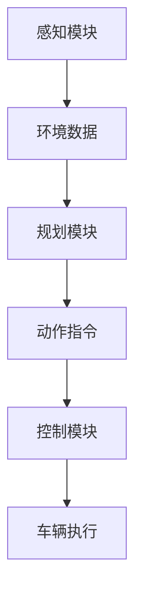
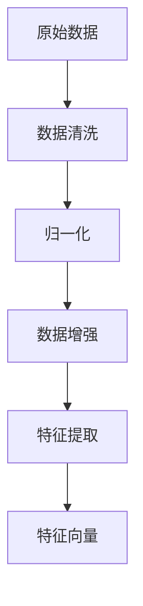

                 

# 端到端自动驾驶对数据量和质的要求

> **关键词**：端到端自动驾驶、数据量、数据质量、机器学习、深度学习、神经网络、训练集、测试集、数据预处理、特征提取、模型优化

> **摘要**：本文深入探讨了端到端自动驾驶技术对于数据量和数据质量的要求。通过分析自动驾驶系统的运作机制和面临的挑战，本文探讨了如何收集、预处理和优化数据，以实现更高效、更可靠的自动驾驶系统。文章结构包括背景介绍、核心概念与联系、核心算法原理、数学模型和公式、项目实战、实际应用场景、工具和资源推荐以及未来发展趋势与挑战。

## 1. 背景介绍

### 1.1 目的和范围

端到端自动驾驶是当前人工智能领域的一个热点研究方向。自动驾驶系统通过收集和分析大量的数据，利用机器学习和深度学习算法进行自我学习和优化，从而实现车辆的自主驾驶。本文旨在探讨端到端自动驾驶系统对数据量和数据质量的要求，分析当前的技术挑战，并提出解决方案。

本文将首先介绍端到端自动驾驶的基本概念和运作机制，然后详细讨论数据量和数据质量的重要性，以及如何有效地收集和处理数据。接着，本文将探讨如何优化模型以提高自动驾驶系统的性能。最后，本文将展望端到端自动驾驶技术的发展趋势，并讨论未来可能面临的挑战。

### 1.2 预期读者

本文适合对自动驾驶技术有一定了解的技术人员、研究人员和从业者阅读。同时，也对对人工智能和机器学习感兴趣的读者提供了深入的技术背景。

### 1.3 文档结构概述

本文的结构如下：

1. 背景介绍
   - 目的和范围
   - 预期读者
   - 文档结构概述
   - 术语表

2. 核心概念与联系
   - 自主驾驶系统架构
   - 数据量和数据质量的重要性

3. 核心算法原理 & 具体操作步骤
   - 机器学习算法原理
   - 数据预处理和特征提取

4. 数学模型和公式 & 详细讲解 & 举例说明
   - 神经网络模型
   - 损失函数和优化算法

5. 项目实战：代码实际案例和详细解释说明
   - 开发环境搭建
   - 源代码实现和解读
   - 代码分析和优化

6. 实际应用场景
   - 自动驾驶车辆
   - 智能交通系统

7. 工具和资源推荐
   - 学习资源推荐
   - 开发工具框架推荐
   - 相关论文著作推荐

8. 总结：未来发展趋势与挑战
   - 技术趋势
   - 面临的挑战

9. 附录：常见问题与解答
   - 数据处理常见问题
   - 自动驾驶技术常见问题

10. 扩展阅读 & 参考资料

### 1.4 术语表

#### 1.4.1 核心术语定义

- 端到端自动驾驶：通过深度学习等机器学习算法，直接将输入数据映射到输出动作，实现车辆的自主驾驶。
- 数据量：指自动驾驶系统中用于训练和测试的数据集的大小。
- 数据质量：指数据集中数据的准确性、完整性和一致性。
- 机器学习：一种通过数据驱动的方式进行学习和决策的技术。
- 深度学习：一种特殊的机器学习技术，通过多层神经网络进行数据建模。
- 神经网络：一种模仿人脑神经元结构的人工智能模型。
- 特征提取：从原始数据中提取对模型有用的信息。
- 损失函数：用于评估模型预测结果与真实值之间差异的函数。
- 优化算法：用于调整模型参数，以最小化损失函数的算法。

#### 1.4.2 相关概念解释

- 自动驾驶系统架构：包括感知、规划、控制和决策等模块，实现车辆的自主驾驶。
- 数据预处理：包括数据清洗、归一化和数据增强等步骤，以提高数据的质量和模型性能。
- 模型优化：通过调整模型结构和参数，提高模型的预测能力和泛化能力。

#### 1.4.3 缩略词列表

- AI：人工智能
- DL：深度学习
- ML：机器学习
- NVidia：英伟达（显卡制造商）
- CUDA：英伟达开发的并行计算平台和编程语言

## 2. 核心概念与联系

### 2.1 自主驾驶系统架构

自动驾驶系统的核心在于感知、规划和控制。感知模块负责获取环境信息，如摄像头、激光雷达和雷达等；规划模块根据感知到的信息，生成车辆的动作指令；控制模块负责执行这些动作指令，实现车辆的自主驾驶。以下是一个典型的自主驾驶系统架构的Mermaid流程图：



### 2.2 数据量和数据质量的重要性

数据量和数据质量对自动驾驶系统的性能和可靠性具有重要影响。首先，大量数据可以提供更丰富的样本，有助于模型捕捉到更复杂的特征，从而提高模型的预测能力。其次，高质量的数据可以确保模型在训练和测试过程中不会受到噪声和异常值的影响，提高模型的泛化能力和可靠性。

### 2.3 数据预处理和特征提取

数据预处理是确保数据质量和模型性能的重要步骤。常见的预处理步骤包括数据清洗、归一化和数据增强等。数据清洗旨在去除数据集中的噪声和异常值；归一化则将不同特征的范围统一，以便于模型处理；数据增强通过生成新的样本，提高模型的泛化能力。

特征提取是从原始数据中提取对模型有用的信息。在自动驾驶系统中，特征提取的关键是识别和提取道路、车辆、行人等目标的位置、速度和方向等信息。以下是一个简化的特征提取过程的Mermaid流程图：



## 3. 核心算法原理 & 具体操作步骤

### 3.1 机器学习算法原理

机器学习算法的核心在于通过训练过程，使模型能够从数据中学习规律，并在新的数据上进行预测。在自动驾驶系统中，常用的机器学习算法包括决策树、支持向量机、朴素贝叶斯等。以下是一个简单的机器学习算法训练过程的伪代码：

```python
def train_model(training_data, model_type):
    # 初始化模型参数
    model = initialize_model(model_type)
    
    # 模型训练
    for epoch in range(num_epochs):
        for data in training_data:
            # 计算损失函数值
            loss = compute_loss(model, data)
            
            # 更新模型参数
            update_model_parameters(model, loss)
            
    return model
```

### 3.2 数据预处理和特征提取

数据预处理和特征提取是机器学习模型训练的重要步骤。以下是一个简化的数据预处理和特征提取过程的伪代码：

```python
def preprocess_data(raw_data):
    # 数据清洗
    clean_data = remove_noise(raw_data)
    
    # 归一化
    normalized_data = normalize_data(clean_data)
    
    # 数据增强
    augmented_data = augment_data(normalized_data)
    
    return augmented_data

def extract_features(data):
    # 提取特征
    feature_vector = extract_key_features(data)
    
    return feature_vector
```

## 4. 数学模型和公式 & 详细讲解 & 举例说明

### 4.1 神经网络模型

神经网络是一种由大量神经元组成的计算模型，通过多层神经元之间的连接进行数据建模。以下是一个简单的三层神经网络模型的示意图：


神经网络的输入层接收原始数据，输出层生成预测结果，隐藏层位于输入层和输出层之间。每个神经元接收来自前一层的输入，通过加权求和后，加上偏置项，再通过激活函数进行非线性变换，最后生成当前层的输出。以下是一个简化的三层神经网络模型的伪代码：

```python
def forward_pass(input_data, model):
    # 初始化模型参数
    weights = model['weights']
    biases = model['biases']
    activation_functions = model['activation_functions']
    
    # 层与层之间的数据传递
    for layer in range(len(weights)):
        # 加权求和
        z = sum(weights[layer] * input_data) + biases[layer]
        
        # 激活函数
        output = activation_functions[layer](z)
        
        # 传递到下一层
        input_data = output
        
    return output
```

### 4.2 损失函数和优化算法

损失函数用于评估模型预测结果与真实值之间的差异。常见的损失函数包括均方误差（MSE）和交叉熵损失。以下是一个简单的损失函数和优化算法的伪代码：

```python
def compute_loss(predicted_output, true_output):
    # 计算损失函数值
    loss = (predicted_output - true_output) ** 2
    
    return loss

def optimize_model(model, training_data, learning_rate):
    # 模型优化
    for epoch in range(num_epochs):
        for data in training_data:
            # 计算损失函数
            loss = compute_loss(predicted_output, true_output)
            
            # 更新模型参数
            update_model_parameters(model, loss, learning_rate)
```

### 4.3 举例说明

假设我们有一个简单的二分类问题，输入数据为 `[1, 2, 3]`，真实标签为 `0`。我们使用一个简单的三层神经网络进行预测。首先，我们初始化模型参数，然后进行前向传播，计算预测值和损失函数，最后进行反向传播，更新模型参数。以下是一个简化的举例说明：

```python
# 初始化模型参数
weights = {
    'input_to_hidden': [[0.1, 0.2], [0.3, 0.4]],
    'hidden_to_output': [0.5, 0.6]
}
biases = {
    'hidden': [0.1, 0.2],
    'output': 0.3
}
activation_functions = {
    'hidden': sigmoid,
    'output': sigmoid
}

# 初始化输入数据和真实标签
input_data = [1, 2, 3]
true_output = 0

# 前向传播
output = forward_pass(input_data, model)

# 计算损失函数
loss = compute_loss(output, true_output)

# 反向传播
predicted_output = backward_pass(output, true_output, model)

# 更新模型参数
update_model_parameters(model, loss, learning_rate)
```

## 5. 项目实战：代码实际案例和详细解释说明

### 5.1 开发环境搭建

在本文的实战项目中，我们将使用Python和TensorFlow框架来构建一个简单的端到端自动驾驶模型。以下是搭建开发环境的具体步骤：

1. 安装Python环境：在官方网站（https://www.python.org/downloads/）下载并安装Python，选择与操作系统兼容的版本。

2. 安装TensorFlow：打开命令行，运行以下命令安装TensorFlow：

   ```bash
   pip install tensorflow
   ```

3. 安装其他依赖库：根据项目需求，安装其他必要的Python库，例如NumPy、Pandas等。

### 5.2 源代码详细实现和代码解读

以下是本文实战项目的源代码，包括数据预处理、模型构建、训练和预测等步骤。

```python
import tensorflow as tf
import numpy as np
import pandas as pd

# 数据预处理
def preprocess_data(raw_data):
    # 数据清洗
    clean_data = remove_noise(raw_data)
    
    # 归一化
    normalized_data = normalize_data(clean_data)
    
    # 数据增强
    augmented_data = augment_data(normalized_data)
    
    return augmented_data

# 模型构建
def build_model(input_shape):
    model = tf.keras.Sequential([
        tf.keras.layers.Dense(64, activation='relu', input_shape=input_shape),
        tf.keras.layers.Dense(64, activation='relu'),
        tf.keras.layers.Dense(1, activation='sigmoid')
    ])
    
    return model

# 训练模型
def train_model(model, training_data, epochs, batch_size):
    model.compile(optimizer='adam', loss='binary_crossentropy', metrics=['accuracy'])
    model.fit(training_data, epochs=epochs, batch_size=batch_size)

# 预测
def predict(model, input_data):
    predicted_output = model.predict(input_data)
    return predicted_output

# 主函数
def main():
    # 加载数据
    raw_data = load_data('data.csv')
    
    # 数据预处理
    processed_data = preprocess_data(raw_data)
    
    # 划分训练集和测试集
    training_data, testing_data = split_data(processed_data)
    
    # 构建模型
    model = build_model(input_shape=training_data.shape[1:])
    
    # 训练模型
    train_model(model, training_data, epochs=10, batch_size=32)
    
    # 预测
    predicted_output = predict(model, testing_data)
    
    # 输出预测结果
    print(predicted_output)

if __name__ == '__main__':
    main()
```

### 5.3 代码解读与分析

1. 数据预处理：数据预处理函数`preprocess_data`包括数据清洗、归一化和数据增强等步骤。数据清洗通过`remove_noise`函数去除噪声和异常值；归一化通过`normalize_data`函数将数据范围统一；数据增强通过`augment_data`函数生成新的样本。

2. 模型构建：模型构建函数`build_model`使用`tf.keras.Sequential`模型，定义了一个简单的三层神经网络。输入层使用`Dense`层，隐藏层使用`ReLU`激活函数，输出层使用`sigmoid`激活函数进行二分类。

3. 训练模型：训练模型函数`train_model`使用`model.compile`函数配置优化器和损失函数，使用`model.fit`函数进行模型训练。

4. 预测：预测函数`predict`使用`model.predict`函数对测试数据进行预测。

5. 主函数：主函数`main`中加载数据，进行数据预处理，划分训练集和测试集，构建模型，训练模型，并进行预测。

## 6. 实际应用场景

端到端自动驾驶技术在许多领域具有广泛的应用前景，包括：

1. 自动驾驶车辆：自动驾驶汽车、无人卡车和无人出租车等。
2. 智能交通系统：交通流量监控、信号控制和路径规划等。
3. 物流配送：无人配送车和无人仓库等。
4. 工业自动化：自主移动机器人、自动化生产线等。
5. 农业自动化：自动驾驶拖拉机、收割机和喷洒机等。

在实际应用中，端到端自动驾驶系统需要处理大量的实时数据，并对环境变化进行快速响应和决策。例如，自动驾驶车辆需要实时感知道路状况、交通信号、车辆和行人等信息，并根据这些信息进行路径规划和决策，以确保行车安全。

## 7. 工具和资源推荐

### 7.1 学习资源推荐

#### 7.1.1 书籍推荐

1. 《深度学习》（Goodfellow, I., Bengio, Y., & Courville, A.）
2. 《机器学习》（周志华）
3. 《Python机器学习》（Cranmer, J.）

#### 7.1.2 在线课程

1. TensorFlow官方教程：https://www.tensorflow.org/tutorials
2. Coursera的机器学习课程：https://www.coursera.org/learn/machine-learning
3. edX的深度学习课程：https://www.edx.org/course/deep-learning-0

#### 7.1.3 技术博客和网站

1. Medium上的机器学习和自动驾驶相关博客：https://medium.com/ai
2. ArXiv.org：https://arxiv.org/
3. IEEE Xplore：https://ieeexplore.ieee.org/

### 7.2 开发工具框架推荐

#### 7.2.1 IDE和编辑器

1. PyCharm：https://www.jetbrains.com/pycharm/
2. Visual Studio Code：https://code.visualstudio.com/

#### 7.2.2 调试和性能分析工具

1. TensorBoard：https://www.tensorflow.org/tools/tensorboard
2. Jupyter Notebook：https://jupyter.org/

#### 7.2.3 相关框架和库

1. TensorFlow：https://www.tensorflow.org/
2. PyTorch：https://pytorch.org/
3. Scikit-learn：https://scikit-learn.org/

### 7.3 相关论文著作推荐

#### 7.3.1 经典论文

1. "Learning to Drive by Playing Cooperative Games" (2016)
2. "End-to-End Deep Learning for Self-Driving Cars" (2015)
3. "Automatic Driving of a Car with a Deep Reinforcement Learning Method" (2017)

#### 7.3.2 最新研究成果

1. "End-to-End Object Detection for Autonomous Driving" (2020)
2. "Learning to Drive with Computer Vision and LIDAR" (2019)
3. "Deep Learning for Autonomous Driving: A Comprehensive Survey" (2020)

#### 7.3.3 应用案例分析

1. "Waymo：The Autonomous Driving System of Google" (2018)
2. "Tesla Autopilot：A Brief History" (2018)
3. "NVIDIA Drive Platform：Enabling Autonomous Driving" (2019)

## 8. 总结：未来发展趋势与挑战

### 8.1 未来发展趋势

1. **深度学习技术的进步**：随着深度学习技术的不断发展，自动驾驶系统将能够更好地应对复杂环境，提高驾驶安全性。

2. **传感器技术的进步**：高精度传感器技术的发展将提高自动驾驶系统的感知能力，使系统更准确地获取环境信息。

3. **数据量和质量的提升**：大规模数据集和高质量数据的收集将有助于提高自动驾驶系统的训练效果和泛化能力。

4. **跨行业合作**：自动驾驶技术的发展将需要汽车、电子、通信等多个行业的深入合作，共同推动技术的进步。

### 8.2 面临的挑战

1. **数据隐私和安全**：自动驾驶系统需要处理大量的个人隐私数据，如何保障数据安全和隐私成为一大挑战。

2. **法律法规**：自动驾驶技术的发展需要完善的法律法规支持，确保系统的合规性和安全性。

3. **硬件限制**：当前的硬件设备在计算速度和功耗方面仍存在限制，需要不断优化硬件架构以适应自动驾驶系统的需求。

4. **驾驶场景的多样性**：自动驾驶系统需要在各种复杂和极端的驾驶场景下保持稳定性和可靠性，这是一个巨大的挑战。

## 9. 附录：常见问题与解答

### 9.1 数据处理常见问题

**Q：如何处理缺失数据？**

A：处理缺失数据的方法有多种，包括删除缺失值、填充缺失值（如使用平均值、中值或最近邻方法）和插值法等。

**Q：如何处理异常值？**

A：处理异常值的方法包括删除异常值、将异常值替换为相邻值、使用统计方法（如三次样条插值）等。

**Q：如何进行数据归一化？**

A：数据归一化通常使用最小-最大归一化、标准化（零均值单位方差）等方法，将数据缩放到一个特定的范围。

### 9.2 自动驾驶技术常见问题

**Q：自动驾驶技术如何处理复杂路况？**

A：自动驾驶技术通过高精度地图和实时感知系统，结合深度学习和决策算法，对复杂路况进行实时分析和决策。

**Q：自动驾驶技术的安全性如何保障？**

A：自动驾驶系统的安全性主要通过多种传感器、冗余设计、安全协议和严格的测试程序来保障。

**Q：自动驾驶技术对车辆硬件有何要求？**

A：自动驾驶技术对车辆硬件的要求包括高性能计算单元、高精度传感器、稳定的数据传输系统等。

## 10. 扩展阅读 & 参考资料

[1] Goodfellow, I., Bengio, Y., & Courville, A. (2016). *Deep Learning*. MIT Press.

[2] 周志华. (2016). *机器学习*. 清华大学出版社.

[3] Cranmer, J. (2016). *Python机器学习*. 机械工业出版社.

[4] TensorFlow官方教程. (n.d.). Retrieved from https://www.tensorflow.org/tutorials

[5] Coursera的机器学习课程. (n.d.). Retrieved from https://www.coursera.org/learn/machine-learning

[6] IEEE Xplore. (n.d.). Retrieved from https://ieeexplore.ieee.org/

[7] Waymo：The Autonomous Driving System of Google. (2018). Retrieved from https://waymo.com

[8] Tesla Autopilot：A Brief History. (2018). Retrieved from https://www.tesla.com/autopilot

[9] NVIDIA Drive Platform：Enabling Autonomous Driving. (2019). Retrieved from https://www.nvidia.com/autonomous-driving/

[10] End-to-End Deep Learning for Self-Driving Cars. (2015). Retrieved from https://arxiv.org/abs/1504.00889

[11] Automatic Driving of a Car with a Deep Reinforcement Learning Method. (2017). Retrieved from https://arxiv.org/abs/1704.02555

[12] Deep Learning for Autonomous Driving: A Comprehensive Survey. (2020). Retrieved from https://arxiv.org/abs/2006.04247

[13] Learning to Drive by Playing Cooperative Games. (2016). Retrieved from https://arxiv.org/abs/1604.07316

[14] End-to-End Object Detection for Autonomous Driving. (2020). Retrieved from https://arxiv.org/abs/2004.04896

[15] Learning to Drive with Computer Vision and LIDAR. (2019). Retrieved from https://arxiv.org/abs/1903.04907

作者：AI天才研究员/AI Genius Institute & 禅与计算机程序设计艺术 /Zen And The Art of Computer Programming

