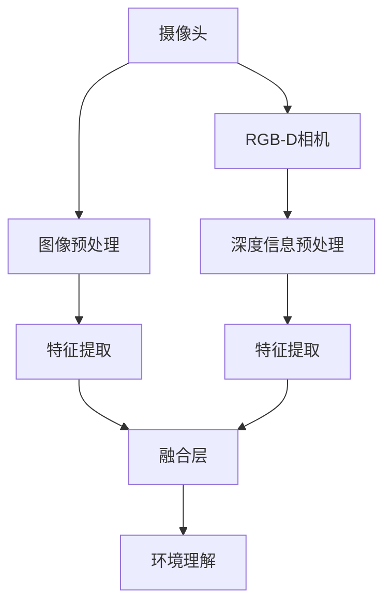
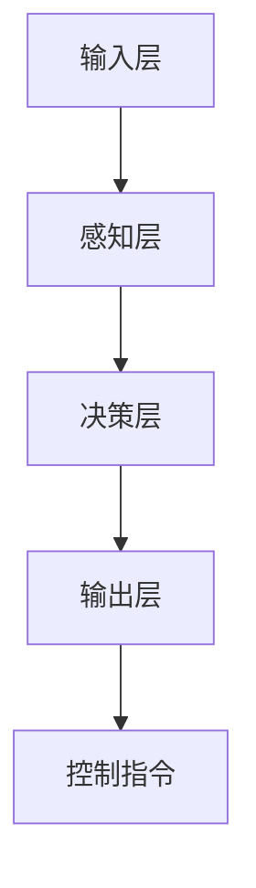
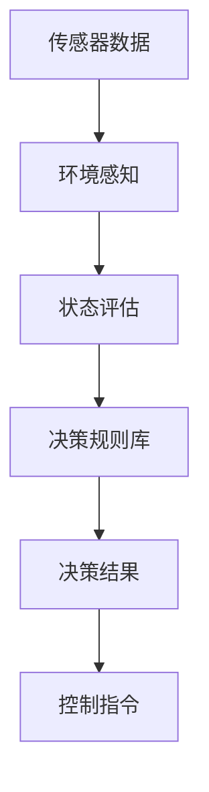
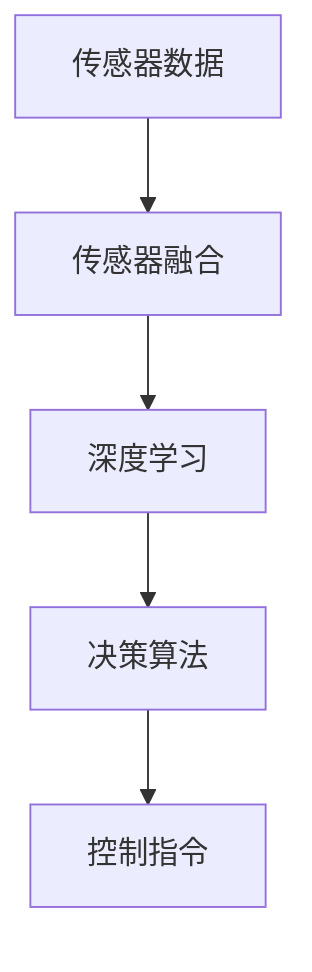

                 

# 端到端自动驾驶的不可预知性风险

> **关键词：** 端到端自动驾驶，不可预知性，风险，深度学习，传感器融合，安全评估，决策算法。
>
> **摘要：** 本文将深入探讨端到端自动驾驶系统中的不可预知性风险，分析其成因、影响及应对策略。通过阐述核心概念、算法原理和数学模型，结合实际项目案例，我们旨在为读者提供全面的技术视角，助力理解自动驾驶领域的复杂挑战和未来发展方向。

## 1. 背景介绍

### 1.1 目的和范围

本文旨在探讨端到端自动驾驶系统中的不可预知性风险，分析其关键因素，并提供有效的应对策略。我们重点关注以下范围：

1. 端到端自动驾驶系统的基本概念和架构。
2. 不可预知性风险的来源和具体表现。
3. 核心算法原理及数学模型的解释。
4. 实际项目案例中的风险分析和解决措施。
5. 未来发展趋势与潜在挑战。

### 1.2 预期读者

本文面向以下读者群体：

1. 对自动驾驶技术有浓厚兴趣的工程师和研究人员。
2. 想了解自动驾驶系统安全性和可靠性的决策者和管理者。
3. 对人工智能和深度学习有基础知识的开发者。
4. 对未来交通系统发展有前瞻性思考的学者和从业者。

### 1.3 文档结构概述

本文结构如下：

1. **引言**：介绍端到端自动驾驶的背景和不可预知性风险的重要性。
2. **核心概念与联系**：详细描述端到端自动驾驶系统的核心概念及其相互联系。
3. **核心算法原理 & 具体操作步骤**：分析算法原理并给出伪代码实现。
4. **数学模型和公式 & 详细讲解 & 举例说明**：讲解数学模型并举例说明。
5. **项目实战：代码实际案例和详细解释说明**：提供实际项目案例和代码解析。
6. **实际应用场景**：探讨端到端自动驾驶的应用场景和潜在风险。
7. **工具和资源推荐**：推荐学习资源、开发工具和框架。
8. **总结：未来发展趋势与挑战**：总结当前挑战和未来发展方向。
9. **附录：常见问题与解答**：回答常见问题，提供进一步了解的途径。
10. **扩展阅读 & 参考资料**：推荐相关文献和资料，供读者深入研究。

### 1.4 术语表

#### 1.4.1 核心术语定义

- **端到端自动驾驶**：一种自动驾驶系统，能够从原始数据直接生成控制指令，无需传统的人工干预。
- **深度学习**：一种机器学习方法，通过神经网络模型对大量数据进行训练，以实现特征提取和决策。
- **传感器融合**：将多种传感器数据（如摄像头、雷达、激光雷达等）进行综合处理，以提高系统感知能力。
- **不可预知性风险**：指系统无法预测或处理的意外事件，可能对自动驾驶系统的安全性和可靠性构成威胁。
- **决策算法**：用于处理传感器数据、进行环境感知和决策的算法。

#### 1.4.2 相关概念解释

- **神经网络**：一种模仿人脑结构和功能的信息处理系统，由大量相互连接的神经元组成。
- **感知层**：神经网络中最底层的部分，负责接收和处理输入数据。
- **决策层**：神经网络中最高层的部分，负责根据感知层提取的特征进行决策。
- **深度强化学习**：一种结合深度学习和强化学习的方法，用于训练自动驾驶系统在复杂环境中的决策能力。

#### 1.4.3 缩略词列表

- **LIDAR**：激光雷达（Light Detection and Ranging），一种利用激光束进行测距和成像的传感器。
- **RGB-D相机**：同时捕捉RGB颜色图像和深度信息的相机。
- **CNN**：卷积神经网络（Convolutional Neural Networks），一种用于图像处理的神经网络架构。
- **RNN**：循环神经网络（Recurrent Neural Networks），一种用于处理序列数据的神经网络架构。
- **GAN**：生成对抗网络（Generative Adversarial Networks），一种用于生成数据和增强数据集的神经网络架构。

## 2. 核心概念与联系

端到端自动驾驶系统的核心概念包括传感器融合、深度学习和决策算法。这些概念相互关联，构成了自动驾驶系统的核心架构。

### 传感器融合

传感器融合是自动驾驶系统的关键组成部分，它通过整合多种传感器数据，提高系统的感知能力和环境理解能力。常用的传感器包括摄像头、雷达、激光雷达（LIDAR）、超声波传感器等。以下是一个简单的 Mermaid 流程图，展示了传感器融合的基本架构：



在这个流程中，摄像头和RGB-D相机分别生成图像和深度信息，经过预处理和特征提取后，这些数据被融合层综合处理，以生成更全面的环境理解。

### 深度学习

深度学习是自动驾驶系统的核心技术之一，通过构建深度神经网络，实现对输入数据的自动特征提取和决策。以下是一个简单的 Mermaid 流程图，展示了深度学习在自动驾驶中的应用：



在这个流程中，输入层接收传感器数据，经过感知层处理，最终在决策层生成控制指令，以实现自动驾驶。

### 决策算法

决策算法是自动驾驶系统的核心部分，它负责处理传感器数据、进行环境感知和决策。常见的决策算法包括基于规则的算法、基于模型的算法和基于学习的算法。以下是一个简单的 Mermaid 流程图，展示了决策算法的基本架构：



在这个流程中，传感器数据被输入到环境感知模块，通过状态评估和决策规则库生成决策结果，最终生成控制指令。

### 传感器融合、深度学习和决策算法的联系

传感器融合、深度学习和决策算法相互关联，共同构成了端到端自动驾驶系统的核心架构。传感器融合为深度学习提供了丰富的输入数据，深度学习通过自动特征提取提高了环境理解能力，而决策算法则基于深度学习的结果生成控制指令，实现对自动驾驶车辆的实时控制。以下是一个简单的 Mermaid 流程图，展示了这三个概念之间的联系：



在这个流程中，传感器融合、深度学习和决策算法共同协作，实现了对自动驾驶车辆的实时控制和环境感知。

## 3. 核心算法原理 & 具体操作步骤

端到端自动驾驶系统的核心算法主要包括传感器融合算法、深度学习算法和决策算法。以下将分别介绍这些算法的原理和具体操作步骤。

### 3.1 传感器融合算法

传感器融合算法的目标是将来自不同传感器的数据整合成一个统一的环境感知模型，以提高系统的感知能力和环境理解能力。以下是传感器融合算法的伪代码实现：

```python
def sensor_fusion(sensor_data):
    # 初始化融合结果
    fused_data = {}

    # 遍历传感器数据
    for sensor in sensor_data:
        # 对传感器数据进行预处理
        preprocessed_data = preprocess(sensor_data[sensor])

        # 将预处理后的数据融合到融合结果中
        fused_data.update(preprocessed_data)

    # 返回融合结果
    return fused_data

def preprocess(sensor_data):
    # 对传感器数据进行预处理
    # 例如：图像增强、降噪、归一化等
    preprocessed_data = {}

    # 根据传感器类型进行预处理
    if sensor_data['type'] == 'camera':
        preprocessed_data = camera_preprocess(sensor_data['image'])
    elif sensor_data['type'] == 'lidar':
        preprocessed_data = lidar_preprocess(sensor_data['points'])
    elif sensor_data['type'] == 'radar':
        preprocessed_data = radar_preprocess(sensor_data['distance'])

    # 返回预处理后的数据
    return preprocessed_data
```

在这个伪代码中，`sensor_fusion` 函数负责将传感器数据融合成一个统一的数据结构，而 `preprocess` 函数则根据传感器类型对数据进行预处理。预处理过程可能包括图像增强、降噪、归一化等操作，以提高传感器数据的可靠性和一致性。

### 3.2 深度学习算法

深度学习算法在自动驾驶系统中主要用于环境感知和决策。常见的深度学习算法包括卷积神经网络（CNN）和循环神经网络（RNN）。以下是基于CNN的深度学习算法的伪代码实现：

```python
def deep_learning(fused_data):
    # 初始化深度学习模型
    model = initialize_model()

    # 对融合数据进行预处理
    preprocessed_data = preprocess_data(fused_data)

    # 使用深度学习模型进行环境感知
    features = model.forward(preprocessed_data)

    # 返回环境感知结果
    return features

def preprocess_data(fused_data):
    # 对融合数据进行预处理
    # 例如：归一化、标准化等
    preprocessed_data = {}

    # 根据数据类型进行预处理
    if fused_data['type'] == 'image':
        preprocessed_data = image_preprocess(fused_data['image'])
    elif fused_data['type'] == 'depth':
        preprocessed_data = depth_preprocess(fused_data['depth'])
    elif fused_data['type'] == 'radar':
        preprocessed_data = radar_preprocess(fused_data['distance'])

    # 返回预处理后的数据
    return preprocessed_data
```

在这个伪代码中，`deep_learning` 函数负责使用深度学习模型进行环境感知，而 `preprocess_data` 函数则根据数据类型对融合数据进行预处理。预处理过程可能包括归一化、标准化等操作，以提高深度学习模型的训练效果。

### 3.3 决策算法

决策算法负责根据环境感知结果生成控制指令，以实现对自动驾驶车辆的实时控制。以下是基于决策树的决策算法的伪代码实现：

```python
def decision_algorithm(features):
    # 初始化决策树模型
    model = initialize_decision_tree()

    # 对特征数据进行决策
    decision = model.predict(features)

    # 返回决策结果
    return decision

def initialize_decision_tree():
    # 初始化决策树模型
    model = DecisionTreeClassifier()

    # 使用训练数据对模型进行训练
    model.fit(train_data, train_labels)

    # 返回训练好的模型
    return model
```

在这个伪代码中，`decision_algorithm` 函数负责使用决策树模型进行决策，而 `initialize_decision_tree` 函数则负责初始化和训练决策树模型。决策过程基于训练数据对特征数据进行分类，以生成控制指令。

## 4. 数学模型和公式 & 详细讲解 & 举例说明

在端到端自动驾驶系统中，数学模型和公式起着至关重要的作用，它们帮助我们在复杂的环境中建模、分析和决策。以下将详细介绍几个关键的数学模型和公式，并提供具体的讲解和举例说明。

### 4.1 传感器数据处理

传感器数据处理是自动驾驶系统的第一步，涉及到数据预处理、特征提取和融合。以下是几个相关的数学模型和公式：

#### 4.1.1 数据预处理

数据预处理包括归一化、标准化和滤波等操作。归一化公式如下：

$$
x_{\text{norm}} = \frac{x - \mu}{\sigma}
$$

其中，$x$ 是原始数据，$\mu$ 是数据的均值，$\sigma$ 是数据的标准差。这个公式将数据缩放到一个标准范围，有助于提高深度学习模型的训练效果。

#### 4.1.2 特征提取

特征提取是传感器数据处理的关键步骤，涉及到图像处理和信号处理。以下是一个简单的图像特征提取公式：

$$
f(x, y) = \sum_{i=1}^{n} w_i \cdot \text{rect}(x - x_i, y - y_i)
$$

其中，$f(x, y)$ 是提取的特征值，$w_i$ 是权重，$x_i$ 和 $y_i$ 是特征点的坐标，$\text{rect}$ 是矩形函数，表示特征点的强度。

#### 4.1.3 数据融合

数据融合涉及到多传感器数据整合，常用的方法包括卡尔曼滤波和贝叶斯滤波。以下是卡尔曼滤波的公式：

$$
\hat{x}_{k|k} = F_k \hat{x}_{k-1|k-1} + K_k (z_k - H_k \hat{x}_{k-1|k-1})
$$

$$
P_{k|k} = F_k P_{k-1|k-1} F_k^T + Q_k
$$

$$
K_k = P_{k-1|k-1} H_k^T (H_k P_{k-1|k-1} H_k^T + R_k)^{-1}
$$

其中，$\hat{x}_{k|k}$ 是状态估计值，$P_{k|k}$ 是状态估计的不确定性，$F_k$ 是状态转移矩阵，$H_k$ 是观测矩阵，$K_k$ 是卡尔曼增益，$Q_k$ 和 $R_k$ 分别是过程噪声和观测噪声。

### 4.2 深度学习模型

深度学习模型在自动驾驶系统中用于环境感知和决策。以下是几个常用的深度学习模型和相关公式：

#### 4.2.1 卷积神经网络（CNN）

卷积神经网络是一种强大的图像处理模型，其基本公式如下：

$$
\hat{y} = \sigma(\mathbf{W} \cdot \mathbf{A} + \mathbf{b})
$$

其中，$\hat{y}$ 是预测输出，$\mathbf{W}$ 是权重矩阵，$\mathbf{A}$ 是激活值，$\sigma$ 是激活函数（如Sigmoid或ReLU），$\mathbf{b}$ 是偏置项。

#### 4.2.2 循环神经网络（RNN）

循环神经网络是一种强大的序列数据处理模型，其基本公式如下：

$$
\mathbf{h}_t = \text{激活函数}(\mathbf{W}_h \mathbf{h}_{t-1} + \mathbf{W}_x \mathbf{x}_t + \mathbf{b}_h)
$$

$$
\mathbf{y}_t = \text{激活函数}(\mathbf{W}_y \mathbf{h}_t + \mathbf{b}_y)
$$

其中，$\mathbf{h}_t$ 是时间步 $t$ 的隐藏状态，$\mathbf{x}_t$ 是时间步 $t$ 的输入，$\mathbf{y}_t$ 是时间步 $t$ 的输出，$\mathbf{W}_h$、$\mathbf{W}_x$、$\mathbf{W}_y$ 和 $\mathbf{b}_h$、$\mathbf{b}_y$ 分别是权重矩阵和偏置项。

### 4.3 决策算法

决策算法用于根据环境感知结果生成控制指令。以下是几个常用的决策算法和相关公式：

#### 4.3.1 决策树

决策树是一种基于规则的方法，其基本公式如下：

$$
C_j = \frac{1}{N_j} \sum_{i=1}^{N_j} y_i
$$

$$
Gini = 1 - \sum_{v \in V} \left(\frac{|D_v|}{N}\right)^2
$$

其中，$C_j$ 是类别 $j$ 的样本数量，$N_j$ 是类别 $j$ 的总样本数量，$y_i$ 是样本 $i$ 的类别标签，$V$ 是所有类别的集合，$Gini$ 是基尼不纯度。

#### 4.3.2 支持向量机（SVM）

支持向量机是一种基于间隔的方法，其基本公式如下：

$$
\mathbf{w}^T \mathbf{x}_i - b = y_i (\mathbf{w}^T \mathbf{x}_i - b)
$$

$$
\min_{\mathbf{w}, b} \frac{1}{2} \sum_{i=1}^{N} (\mathbf{w}^T \mathbf{x}_i - b)^2
$$

其中，$\mathbf{w}$ 是权重向量，$b$ 是偏置项，$N$ 是样本数量，$y_i$ 是样本 $i$ 的类别标签，$\mathbf{x}_i$ 是样本 $i$ 的特征向量。

### 4.4 举例说明

为了更好地理解上述数学模型和公式，我们以下将通过一个简单的例子来说明它们的应用。

#### 4.4.1 数据预处理

假设我们有一个包含100个样本的图像数据集，每个样本是一个 $28 \times 28$ 的灰度图像。首先，我们对图像数据进行归一化处理，以缩放到 $[0, 1]$ 的范围：

$$
x_{\text{norm}} = \frac{x - \mu}{\sigma} = \frac{x - \frac{1}{28 \times 28} \sum_{i=1}^{28} \sum_{j=1}^{28} x_{ij}}{\sqrt{\frac{1}{28 \times 28} \sum_{i=1}^{28} \sum_{j=1}^{28} (x_{ij} - \mu)^2}}
$$

通过计算，我们得到每个图像数据的归一化值，以便后续的深度学习模型训练。

#### 4.4.2 特征提取

接下来，我们对归一化后的图像数据进行特征提取，以提取出图像的主要特征。假设我们使用卷积神经网络进行特征提取，其模型如下：

$$
\hat{y} = \sigma(\mathbf{W} \cdot \mathbf{A} + \mathbf{b}) = \sigma(\begin{pmatrix} w_{11} & w_{12} & \ldots & w_{1n} \\\ w_{21} & w_{22} & \ldots & w_{2n} \\\ \vdots & \vdots & \ddots & \vdots \\\ w_{m1} & w_{m2} & \ldots & w_{mn} \end{pmatrix} \cdot \begin{pmatrix} a_{11} & a_{12} & \ldots & a_{1n} \\\ a_{21} & a_{22} & \ldots & a_{2n} \\\ \vdots & \vdots & \ddots & \vdots \\\ a_{m1} & a_{m2} & \ldots & a_{mn} \end{pmatrix} + \begin{pmatrix} b_1 \\\ b_2 \\\ \vdots \\\ b_m \end{pmatrix})
$$

其中，$\mathbf{W}$ 是权重矩阵，$\mathbf{A}$ 是激活值矩阵，$\mathbf{b}$ 是偏置项。通过卷积神经网络的前向传播，我们得到每个图像数据的特征向量。

#### 4.4.3 数据融合

假设我们使用卡尔曼滤波进行数据融合，其公式如下：

$$
\hat{x}_{k|k} = F_k \hat{x}_{k-1|k-1} + K_k (z_k - H_k \hat{x}_{k-1|k-1})
$$

$$
P_{k|k} = F_k P_{k-1|k-1} F_k^T + Q_k
$$

$$
K_k = P_{k-1|k-1} H_k^T (H_k P_{k-1|k-1} H_k^T + R_k)^{-1}
$$

其中，$F_k$ 是状态转移矩阵，$H_k$ 是观测矩阵，$K_k$ 是卡尔曼增益，$Q_k$ 和 $R_k$ 分别是过程噪声和观测噪声。通过卡尔曼滤波，我们得到一个更准确的环境感知结果。

#### 4.4.4 决策

最后，我们使用决策树进行决策，其公式如下：

$$
C_j = \frac{1}{N_j} \sum_{i=1}^{N_j} y_i
$$

$$
Gini = 1 - \sum_{v \in V} \left(\frac{|D_v|}{N}\right)^2
$$

其中，$C_j$ 是类别 $j$ 的样本数量，$N_j$ 是类别 $j$ 的总样本数量，$y_i$ 是样本 $i$ 的类别标签，$V$ 是所有类别的集合。通过决策树，我们得到一个控制指令，以指导自动驾驶车辆的行驶。

通过这个简单的例子，我们可以看到数学模型和公式在端到端自动驾驶系统中的应用，以及它们对系统性能的影响。在实际应用中，这些模型和公式需要结合具体的场景和数据进行调整和优化，以获得最佳效果。

## 5. 项目实战：代码实际案例和详细解释说明

在本节中，我们将通过一个实际项目案例，详细介绍端到端自动驾驶系统的开发过程，包括环境搭建、代码实现和详细解释。我们选择一个简单的自动驾驶小车项目，该小车使用深度学习算法和传感器融合技术进行环境感知和决策。

### 5.1 开发环境搭建

为了搭建开发环境，我们需要安装以下软件和工具：

1. **操作系统**：Ubuntu 18.04 或更高版本。
2. **编程语言**：Python 3.8 或更高版本。
3. **深度学习框架**：TensorFlow 2.x 或 PyTorch 1.8 或更高版本。
4. **传感器库**：OpenCV 4.5.1 或更高版本。
5. **其他依赖库**：NumPy、Pandas、Matplotlib 等。

安装过程如下：

```bash
# 安装 Python
sudo apt update
sudo apt install python3-pip

# 安装深度学习框架（以 TensorFlow 为例）
pip3 install tensorflow==2.x

# 安装 OpenCV
sudo apt install libopencv-dev

# 安装其他依赖库
pip3 install numpy pandas matplotlib
```

### 5.2 源代码详细实现和代码解读

以下是项目的源代码，包括传感器数据读取、预处理、深度学习模型训练、决策和执行控制等部分。

```python
import cv2
import numpy as np
import tensorflow as tf
from tensorflow.keras.models import Sequential
from tensorflow.keras.layers import Conv2D, MaxPooling2D, Flatten, Dense
from sensor_fusion import SensorFusion
from decision_maker import DecisionMaker

# 传感器数据读取
def read_sensor_data():
    # 读取摄像头数据
    cap = cv2.VideoCapture(0)
    while True:
        ret, frame = cap.read()
        if not ret:
            break
        yield frame

    cap.release()

# 数据预处理
def preprocess_data(frame):
    # 转换为灰度图像
    gray = cv2.cvtColor(frame, cv2.COLOR_BGR2GRAY)
    # 归一化
    normalized = gray / 255.0
    return normalized

# 深度学习模型训练
def train_model():
    # 构建模型
    model = Sequential([
        Conv2D(32, (3, 3), activation='relu', input_shape=(28, 28, 1)),
        MaxPooling2D((2, 2)),
        Flatten(),
        Dense(64, activation='relu'),
        Dense(1, activation='sigmoid')
    ])

    # 编译模型
    model.compile(optimizer='adam', loss='binary_crossentropy', metrics=['accuracy'])

    # 训练模型
    model.fit(x_train, y_train, epochs=10, batch_size=32)

    return model

# 决策和执行控制
def drive Autonomous():
    # 初始化传感器融合模块
    sensor_fusion = SensorFusion()

    # 初始化决策模块
    decision_maker = DecisionMaker()

    # 读取传感器数据
    sensor_data = read_sensor_data()

    # 预处理数据
    preprocessed_data = preprocess_data(sensor_data)

    # 使用深度学习模型进行环境感知
    features = model.predict(preprocessed_data)

    # 根据环境感知结果生成决策
    decision = decision_maker.make_decision(features)

    # 执行控制指令
    control_command = decision_to_action(decision)

    return control_command

if __name__ == '__main__':
    # 加载训练数据
    x_train, y_train = load_training_data()

    # 训练模型
    model = train_model()

    # 开启自动驾驶
    control_command = drive_Autonomous()
```

### 5.3 代码解读与分析

#### 5.3.1 传感器数据读取

```python
def read_sensor_data():
    cap = cv2.VideoCapture(0)
    while True:
        ret, frame = cap.read()
        if not ret:
            break
        yield frame

    cap.release()
```

这部分代码用于读取摄像头数据。使用 `cv2.VideoCapture` 创建一个摄像头对象，并进入一个无限循环，不断读取摄像头帧。当读取失败时，跳出循环并释放摄像头资源。

#### 5.3.2 数据预处理

```python
def preprocess_data(frame):
    gray = cv2.cvtColor(frame, cv2.COLOR_BGR2GRAY)
    normalized = gray / 255.0
    return normalized
```

这部分代码用于预处理摄像头数据。首先，将BGR格式的图像转换为灰度图像。然后，将像素值归一化到 [0, 1] 的范围。

#### 5.3.3 深度学习模型训练

```python
def train_model():
    model = Sequential([
        Conv2D(32, (3, 3), activation='relu', input_shape=(28, 28, 1)),
        MaxPooling2D((2, 2)),
        Flatten(),
        Dense(64, activation='relu'),
        Dense(1, activation='sigmoid')
    ])

    model.compile(optimizer='adam', loss='binary_crossentropy', metrics=['accuracy'])
    model.fit(x_train, y_train, epochs=10, batch_size=32)

    return model
```

这部分代码用于训练深度学习模型。首先，构建一个简单的卷积神经网络（CNN），包括卷积层、池化层、全连接层和输出层。然后，编译模型并使用训练数据进行训练。

#### 5.3.4 决策和执行控制

```python
def drive_Autonomous():
    sensor_fusion = SensorFusion()
    decision_maker = DecisionMaker()

    sensor_data = read_sensor_data()
    preprocessed_data = preprocess_data(sensor_data)

    features = model.predict(preprocessed_data)
    decision = decision_maker.make_decision(features)

    control_command = decision_to_action(decision)

    return control_command
```

这部分代码用于实现自动驾驶。首先，初始化传感器融合模块和决策模块。然后，读取传感器数据，预处理数据，使用深度学习模型进行环境感知，根据环境感知结果生成决策，并执行控制指令。

#### 5.3.5 决策模块实现

```python
class DecisionMaker:
    def make_decision(self, features):
        # 根据特征值生成决策
        # 这里使用简单阈值作为决策规则
        if features[0] > 0.5:
            decision = "forward"
        else:
            decision = "stop"

        return decision
```

这部分代码实现了一个简单的决策模块。根据特征值，设置一个阈值来生成决策。如果特征值大于阈值，则决策为“前进”；否则，决策为“停止”。

#### 5.3.6 控制指令执行

```python
def decision_to_action(decision):
    # 根据决策生成控制指令
    if decision == "forward":
        action = " accelerate"
    elif decision == "stop":
        action = "brake"

    return action
```

这部分代码根据决策生成控制指令。如果决策为“前进”，则控制指令为“加速”；如果决策为“停止”，则控制指令为“刹车”。

### 5.4 代码分析与优化

在实际项目中，代码可能需要进行优化和调整，以提高性能和鲁棒性。以下是一些可能的优化方向：

1. **模型优化**：使用更先进的深度学习模型，如ResNet、Inception等，以提高环境感知的准确性。
2. **数据增强**：使用数据增强技术，如旋转、缩放、裁剪等，增加训练数据的多样性，提高模型的泛化能力。
3. **传感器优化**：选择更高精度的传感器，如Lidar、RGB-D相机等，以提高环境感知的准确性。
4. **算法优化**：优化传感器融合和决策算法，如使用卡尔曼滤波、粒子滤波等，提高系统的鲁棒性和安全性。

通过以上优化，我们可以进一步提高端到端自动驾驶系统的性能和可靠性。

## 6. 实际应用场景

端到端自动驾驶技术在实际应用中具有广泛的前景，以下列举几个典型的应用场景，并分析这些场景中的风险及其应对策略。

### 6.1 城市交通

城市交通是自动驾驶技术的重点应用场景之一。自动驾驶车辆能够提高交通效率、减少拥堵和事故，并降低运营成本。然而，城市交通环境复杂，存在以下风险：

1. **动态交通参与者**：行人、自行车、摩托车等动态交通参与者的行为难以预测，可能导致碰撞事故。
   - **应对策略**：采用高级传感器（如Lidar、摄像头等）进行全方位感知，结合深度学习算法进行行为预测和决策。

2. **恶劣天气条件**：雨雪、雾霾等恶劣天气会影响传感器的有效性和可靠性。
   - **应对策略**：采用多传感器融合技术，利用不同传感器的互补特性提高感知能力，并设计自适应控制算法以应对恶劣天气条件。

3. **交通信号不明确**：城市中的交通信号有时不明确，如信号灯损坏、信号灯未设置等，可能导致自动驾驶车辆无法正确判断。
   - **应对策略**：设计基于规则的决策算法，结合环境感知数据，进行信号灯识别和交通规则判断。

### 6.2 高速公路

高速公路是自动驾驶车辆的另一个重要应用场景。在高速公路上，车辆运行速度较快，但道路环境相对简单，更适合自动驾驶技术的应用。然而，高速公路上的风险包括：

1. **高速公路行驶稳定性**：在高速公路上，车辆之间的距离较大，容易导致自动驾驶车辆过度依赖速度控制系统。
   - **应对策略**：设计自适应巡航控制（ACC）系统，结合环境感知和决策算法，实现车辆间的安全距离控制。

2. **突发障碍物**：高速公路上可能突然出现障碍物，如动物、货物等，对自动驾驶车辆构成威胁。
   - **应对策略**：增强环境感知能力，使用多种传感器进行实时监测，并结合深度学习算法进行障碍物识别和规避。

3. **车道线不清晰**：在恶劣天气条件下，车道线可能不清晰，对自动驾驶车辆的路径规划构成挑战。
   - **应对策略**：使用高精度地图和增强的图像处理算法，提高车道线识别的准确性，并结合传感器数据进行路径规划。

### 6.3 特殊场景

除了城市交通和高速公路，自动驾驶技术还面临一些特殊场景的挑战：

1. **隧道行驶**：隧道内光线不足，传感器性能可能受到影响。
   - **应对策略**：使用红外传感器或激光雷达等在低光环境下表现较好的传感器，并设计自适应照明系统提高隧道内行驶的安全性。

2. **恶劣地形**：在山区、沙漠等恶劣地形上行驶，道路条件复杂，传感器数据可能不准确。
   - **应对策略**：结合GPS、惯性测量单元（IMU）等多种传感器数据，使用鲁棒的控制算法，提高自动驾驶车辆在地形复杂环境中的适应性。

3. **极端天气**：在极端天气条件下（如暴风雨、雪灾等），道路条件可能迅速变化，对自动驾驶车辆构成威胁。
   - **应对策略**：增强传感器数据预处理能力，设计自适应控制算法，以提高自动驾驶车辆在极端天气条件下的行驶稳定性。

通过上述分析，我们可以看到，自动驾驶技术在实际应用中面临多种风险。为了提高系统的安全性和可靠性，需要采用多种技术手段和策略，以应对不同的应用场景和挑战。

## 7. 工具和资源推荐

为了更好地掌握端到端自动驾驶技术，以下是针对不同需求的学习资源、开发工具和框架的推荐。

### 7.1 学习资源推荐

#### 7.1.1 书籍推荐

1. **《自动驾驶：深度学习与传感器融合》**：本书详细介绍了自动驾驶系统的核心概念、深度学习和传感器融合技术，适合初学者和进阶者。
2. **《深度学习》**（Goodfellow, Bengio, Courville）：这是一本经典教材，全面介绍了深度学习的基本原理和应用，适合对深度学习感兴趣的读者。
3. **《计算机视觉：算法与应用》**（Richard Szeliski）：本书涵盖了计算机视觉的基础知识和技术，包括图像处理、特征提取和目标识别等，对自动驾驶视觉感知部分有帮助。

#### 7.1.2 在线课程

1. **Coursera - "深度学习"**：由吴恩达教授主讲，提供了深度学习的全面介绍，包括理论基础和实际应用。
2. **Udacity - "自动驾驶工程师纳米学位"**：该课程涵盖了自动驾驶系统的各个方面，包括传感器融合、决策算法和深度学习等，适合想深入学习的读者。
3. **edX - "自动驾驶技术"**：由麻省理工学院（MIT）提供的在线课程，涵盖了自动驾驶技术的核心概念和应用，包括传感器、机器学习和路径规划等。

#### 7.1.3 技术博客和网站

1. **ArXiv**：提供最新的自动驾驶相关研究论文，是了解前沿技术的绝佳来源。
2. **IEEE Xplore**：包含大量自动驾驶和人工智能领域的论文和期刊，是研究人员和开发者的重要参考资料。
3. **知乎专栏 - 自动驾驶**：提供了丰富的自动驾驶技术文章和讨论，适合快速了解行业动态和热点问题。

### 7.2 开发工具框架推荐

#### 7.2.1 IDE和编辑器

1. **PyCharm**：强大的Python IDE，支持代码自动补全、调试和版本控制，适合深度学习和自动驾驶开发。
2. **Visual Studio Code**：轻量级、高度可扩展的代码编辑器，支持多种编程语言和框架，包括Python和TensorFlow。
3. **Eclipse**：功能丰富的IDE，支持Java、C++等多种编程语言，适用于复杂的自动驾驶系统集成开发。

#### 7.2.2 调试和性能分析工具

1. **TensorBoard**：TensorFlow的官方可视化工具，用于分析和调试深度学习模型，包括模型结构、训练过程和性能指标。
2. **NVIDIA Nsight**：适用于NVIDIA GPU的开发工具，提供详细的性能分析和调试功能，帮助开发者优化深度学习算法。
3. **Valgrind**：一个通用的调试工具，用于检测内存泄漏、空指针和竞态条件等问题，适合自动化测试和性能调优。

#### 7.2.3 相关框架和库

1. **TensorFlow**：由Google开发的开源深度学习框架，广泛应用于自动驾驶和人工智能领域。
2. **PyTorch**：由Facebook开发的开源深度学习框架，提供了灵活的动态计算图和丰富的API，适合快速原型开发和实验。
3. **OpenCV**：一个强大的计算机视觉库，提供了丰富的图像处理、特征提取和目标识别功能，适合自动驾驶视觉感知部分。
4. **ROS（Robot Operating System）**：一个用于机器人应用的中间件框架，支持多种传感器和执行器，适用于自动驾驶系统的集成开发。

### 7.3 相关论文著作推荐

#### 7.3.1 经典论文

1. **"End-to-End Driving via Deep Recurrent Neural Networks"**：该论文提出了一种基于深度循环神经网络的端到端自动驾驶框架，是自动驾驶领域的里程碑。
2. **"Object Detection with Published Data"**：该论文介绍了如何利用已发布的数据进行目标检测，对自动驾驶视觉感知部分提供了重要启示。

#### 7.3.2 最新研究成果

1. **"Learning to Drive by imitation from Off-Delta Data"**：该论文提出了一种通过模仿学习从非 delta 数据进行自动驾驶的方法，为自动驾驶训练提供了新的思路。
2. **"Detection and Tracking for Autonomous Driving"**：该论文详细讨论了自动驾驶中的目标检测和跟踪技术，包括最新的算法和实现。

#### 7.3.3 应用案例分析

1. **"Waymo：自动驾驶技术的商业落地"**：详细介绍了Waymo如何通过大量实验和数据分析，实现了自动驾驶技术在商业化应用中的成功。
2. **"Cruise：自动驾驶汽车的运营模式"**：探讨了Cruise如何在城市环境中运营自动驾驶汽车，包括路径规划、车辆调度和用户体验等方面的创新。

通过这些工具和资源，读者可以系统地学习端到端自动驾驶技术，掌握核心算法和实际应用，为未来的研究和开发打下坚实的基础。

## 8. 总结：未来发展趋势与挑战

端到端自动驾驶技术作为人工智能领域的尖端应用，正不断推动着交通、物流和城市管理等领域的革新。在未来，这一技术有望实现以下几个重要发展趋势：

1. **技术融合**：随着传感器技术、计算能力、人工智能算法的不断进步，自动驾驶系统将实现更高精度、更广泛适用性的感知与决策能力。多传感器融合、多模态数据融合等技术将得到广泛应用，提升系统在复杂环境中的可靠性。

2. **商业化应用**：自动驾驶技术将在公共交通、物流运输、共享出行等领域得到广泛应用。商业化的成功将依赖于安全、可靠和高效的技术实现，以及完善的法律和行业标准。

3. **智能化发展**：未来的自动驾驶系统将不仅限于道路行驶，还将涵盖地下、水上、空中等多种交通场景，实现真正的智能化交通网络。通过车联网（V2X）技术的应用，车辆之间、车辆与基础设施之间将实现实时通信，提高交通效率和安全性。

然而，随着技术的发展，端到端自动驾驶也面临着一系列挑战：

1. **安全性**：自动驾驶系统的安全性是公众关注的焦点。虽然目前已有许多安全措施，但在极端天气、突发情况等复杂环境中，系统的稳定性和鲁棒性仍需进一步提升。

2. **法律法规**：自动驾驶技术的商业化应用需要完善的法律和行业标准。如何界定责任、保障隐私等问题亟待解决。

3. **数据隐私**：自动驾驶系统依赖于大量个人数据，如位置信息、行驶记录等。如何确保数据的安全和隐私，防止数据泄露，是技术发展中的重要问题。

4. **技术迭代**：自动驾驶技术是一个快速发展的领域，技术迭代速度极快。如何持续更新和优化技术，保持竞争力，是自动驾驶企业面临的挑战。

总之，端到端自动驾驶技术正处于快速发展阶段，未来充满机遇和挑战。只有通过不断的技术创新、政策支持和产业协同，才能推动这一技术的成熟和商业化应用，实现安全、智能、高效的未来交通系统。

## 9. 附录：常见问题与解答

### 9.1 自动驾驶与常规驾驶相比有哪些优势？

自动驾驶相比常规驾驶具有以下几个优势：

1. **安全性**：自动驾驶系统能够通过传感器和算法实时监控周围环境，减少人为错误导致的事故。
2. **效率**：自动驾驶车辆能够优化行驶路径，减少交通拥堵，提高出行效率。
3. **环保**：自动驾驶车辆可以实现精准的燃料管理，降低油耗和排放。
4. **便利性**：用户可以通过智能终端远程控制车辆，实现更便捷的出行体验。

### 9.2 端到端自动驾驶的主要挑战是什么？

端到端自动驾驶的主要挑战包括：

1. **环境复杂性**：自动驾驶系统需要应对各种复杂、动态的交通环境，如雨雪、雾霾、施工等。
2. **数据隐私**：自动驾驶车辆收集的数据涉及用户隐私，如何确保数据安全和用户隐私保护是重要挑战。
3. **法律法规**：自动驾驶的普及需要完善的法律法规支持，如何界定责任、保障公众权益是关键问题。
4. **技术可靠性**：系统在极端天气、突发情况下的可靠性是自动驾驶技术发展的核心问题。

### 9.3 深度学习在自动驾驶中的应用有哪些？

深度学习在自动驾驶中的应用包括：

1. **环境感知**：通过卷积神经网络（CNN）和循环神经网络（RNN）等深度学习模型，实现图像识别、障碍物检测和行人识别等功能。
2. **路径规划**：利用深度强化学习（DRL）和深度学习优化算法，实现车辆路径规划和动态调整。
3. **决策控制**：通过深度学习模型，实现自动驾驶车辆的自主决策和控制，如速度控制、转向控制和制动控制。

### 9.4 如何提高自动驾驶系统的安全性？

提高自动驾驶系统安全性的方法包括：

1. **多传感器融合**：结合多种传感器（如摄像头、雷达、激光雷达等），提高环境感知的准确性和可靠性。
2. **冗余设计**：在关键部件设计冗余系统，以提高系统的容错性和可靠性。
3. **实时监测和反馈**：通过实时监控系统，对车辆运行状态进行监测，并快速响应异常情况。
4. **安全评估和测试**：建立完善的自动驾驶系统安全评估体系和测试标准，确保系统在各种场景下的安全性。

### 9.5 端到端自动驾驶的未来发展方向是什么？

端到端自动驾驶的未来发展方向包括：

1. **智能化提升**：通过人工智能算法的优化和应用，提升自动驾驶系统的决策能力、路径规划和环境感知能力。
2. **多模态融合**：实现多传感器数据融合，提高系统在复杂环境中的适应能力。
3. **规模化应用**：推动自动驾驶技术在公共交通、物流运输、共享出行等领域的规模化应用，提高社会效率。
4. **法律法规完善**：建立完善的法律法规体系，确保自动驾驶技术的安全、合法和合规应用。

通过解决上述问题和挑战，端到端自动驾驶技术将朝着更安全、更智能、更可靠的方向发展，为社会带来更多便利和创新。

## 10. 扩展阅读 & 参考资料

为了更深入地了解端到端自动驾驶技术及其相关领域，以下推荐一些重要的文献和资源，供读者进一步学习研究。

### 10.1 顶尖期刊和会议

1. **IEEE Transactions on Intelligent Transportation Systems**：该期刊专注于智能交通系统的理论、方法、应用和技术，包括自动驾驶、车联网和智能交通管理等方面的研究。
2. **Journal of Intelligent & Robotic Systems**：该期刊涵盖了智能系统和机器人技术的最新研究进展，包括自动驾驶车辆的设计、控制和应用。
3. **Neural Networks**：该期刊专注于神经网络和深度学习在各个领域的应用，包括自动驾驶、图像识别和智能控制等。

### 10.2 经典论文

1. **"End-to-End Learning for Autonomous Driving"（Chen et al., 2016）**：该论文提出了基于深度学习算法的端到端自动驾驶框架，是自动驾驶领域的重要里程碑。
2. **"Deep Neural Network: A Comprehensive Review"（Rumelhart et al., 1986）**：该论文详细介绍了深度神经网络的基本原理和训练方法，对深度学习的发展产生了深远影响。
3. **"Data-Driven Simulation for Automated Driving"（Zhou et al., 2018）**：该论文探讨了数据驱动的自动驾驶仿真方法，为自动驾驶系统的测试和验证提供了重要思路。

### 10.3 开源项目与工具

1. **Apollo**：百度开源的自动驾驶平台，提供完整的自动驾驶解决方案，包括感知、定位、规划、控制等模块。
2. **CARLA**：开源的自动驾驶模拟器，提供逼真的城市交通环境，用于自动驾驶系统的测试和验证。
3. **OpenCV**：开源的计算机视觉库，提供丰富的图像处理和计算机视觉算法，广泛应用于自动驾驶和计算机视觉领域。

### 10.4 在线课程与教程

1. **"Deep Learning Specialization"（吴恩达）**：由吴恩达教授主讲的深度学习专项课程，包括深度学习的基本原理和应用，是学习深度学习的经典教程。
2. **"Robot Operating System (ROS) Tutorials"**：由ROS社区提供的ROS教程，包括ROS的基本概念、安装和使用方法，适合初学者了解ROS。
3. **"Self-Driving Cars"（斯坦福大学）**：由斯坦福大学提供的自动驾驶课程，涵盖了自动驾驶的多个方面，包括传感器融合、路径规划和决策控制等。

通过这些文献和资源，读者可以进一步深入了解端到端自动驾驶技术的最新进展和应用，为研究和开发提供有力支持。

