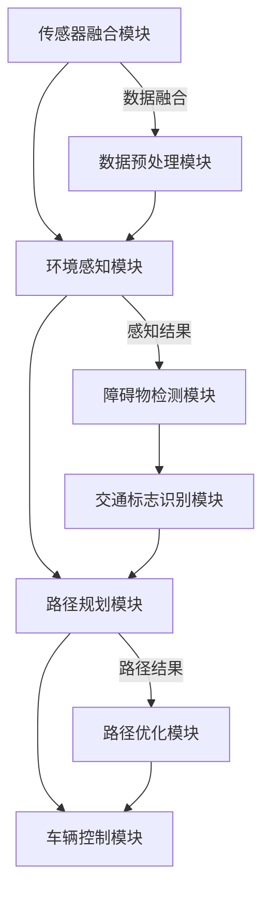

                 

# 端到端自动驾驶的自主共享汽车服务

> 关键词：自动驾驶、端到端、共享汽车、服务架构、深度学习、传感器融合、路径规划、车辆调度、安全保证

> 摘要：本文将深入探讨端到端自动驾驶技术在自主共享汽车服务中的应用。我们将从背景介绍、核心概念与联系、核心算法原理、数学模型与公式、项目实战、实际应用场景、工具和资源推荐等多个维度，系统性地阐述自动驾驶共享汽车服务的实现机制、关键技术和挑战与未来发展趋势。

## 1. 背景介绍

### 1.1 目的和范围

本文旨在系统地分析和探讨端到端自动驾驶技术在自主共享汽车服务中的实际应用，以便为相关领域的研究人员和技术开发者提供有价值的参考。本文将重点关注以下几个方面：

- **自动驾驶技术原理及其在共享汽车服务中的应用**：详细解析自动驾驶系统的架构，包括传感器融合、路径规划、车辆控制等核心模块。
- **端到端自动驾驶的实现机制**：介绍如何通过深度学习等先进技术，实现自动驾驶车辆的实时决策与控制。
- **共享汽车服务的商业模式**：分析共享汽车服务的市场现状、商业模式、用户需求及行业挑战。
- **安全保证与法律法规**：探讨自动驾驶共享汽车服务在安全性、法律法规等方面的需求和挑战。

### 1.2 预期读者

本文适合以下读者群体：

- 对自动驾驶技术、深度学习、计算机视觉等领域有一定了解的工程师和研究人员。
- 感兴趣于共享汽车服务、智能交通系统等相关领域的从业者。
- 对自动驾驶汽车在未来社会发展中的角色和影响感兴趣的普通读者。

### 1.3 文档结构概述

本文结构如下：

1. 背景介绍：简要介绍本文的目的、范围、预期读者及文档结构。
2. 核心概念与联系：介绍自动驾驶技术的核心概念及其相互关系，并使用Mermaid流程图进行展示。
3. 核心算法原理 & 具体操作步骤：详细讲解自动驾驶技术的核心算法原理，并使用伪代码进行描述。
4. 数学模型和公式 & 详细讲解 & 举例说明：介绍自动驾驶技术的数学模型和公式，并进行举例说明。
5. 项目实战：通过实际案例，展示自动驾驶共享汽车服务的开发过程和实现细节。
6. 实际应用场景：分析自动驾驶共享汽车服务在不同场景下的应用和挑战。
7. 工具和资源推荐：推荐学习资源、开发工具和框架，以及相关论文和研究成果。
8. 总结：对未来发展趋势和挑战进行展望。
9. 附录：常见问题与解答。
10. 扩展阅读 & 参考资料：提供更多相关阅读材料和资源。

### 1.4 术语表

#### 1.4.1 核心术语定义

- **自动驾驶**：指利用传感器、计算机视觉、深度学习等技术，实现车辆自主感知环境、规划路径、控制行驶的功能。
- **端到端**：指从输入数据到输出结果的全过程，无需人工干预。
- **共享汽车服务**：指通过互联网平台，提供车辆共享、行程预订、费用结算等服务。
- **传感器融合**：指将多种传感器数据（如摄像头、激光雷达、超声波传感器等）进行融合处理，以获取更准确的环境信息。
- **路径规划**：指根据车辆当前位置、目的地、道路状况等因素，生成一条最优行驶路径。
- **车辆调度**：指根据订单需求、车辆状态、道路状况等，进行车辆分配和调度，以实现高效的服务。

#### 1.4.2 相关概念解释

- **深度学习**：一种基于人工神经网络的机器学习技术，通过多层网络结构，自动提取特征并进行分类、预测等任务。
- **计算机视觉**：利用计算机技术，使计算机能够从图像或视频中提取信息，实现物体识别、场景理解等功能。
- **机器学习**：一种人工智能技术，通过数据训练模型，使计算机具备学习能力，从而进行预测、决策等任务。

#### 1.4.3 缩略词列表

- **AI**：人工智能（Artificial Intelligence）
- **DNN**：深度神经网络（Deep Neural Network）
- **CNN**：卷积神经网络（Convolutional Neural Network）
- **RNN**：循环神经网络（Recurrent Neural Network）
- **LSTM**：长短期记忆网络（Long Short-Term Memory）
- **SLAM**： simultaneous localization and mapping（同时定位与建图）
- **ROS**：机器人操作系统（Robot Operating System）
- **KNN**：k-近邻算法（k-Nearest Neighbors）
- **SVM**：支持向量机（Support Vector Machine）
- **NLP**：自然语言处理（Natural Language Processing）

## 2. 核心概念与联系

在自动驾驶共享汽车服务中，核心概念和联系是理解整个系统架构和实现机制的关键。下面，我们将详细介绍这些核心概念，并使用Mermaid流程图进行展示。

### 2.1 自动驾驶系统的核心模块

自动驾驶系统通常包括以下几个核心模块：

1. **传感器融合模块**：负责收集来自不同传感器的数据，如摄像头、激光雷达、超声波传感器等，并进行数据融合处理。
2. **环境感知模块**：利用传感器融合模块提供的环境数据，进行场景理解、障碍物检测、交通标志识别等任务。
3. **路径规划模块**：根据车辆的当前位置、目的地、道路状况等因素，生成最优行驶路径。
4. **车辆控制模块**：根据路径规划和环境感知的结果，控制车辆的速度、转向等动作。

### 2.2 自动驾驶系统的 Mermaid 流程图



### 2.3 自动驾驶系统核心概念的联系

1. **传感器融合模块**：通过数据预处理模块，对多源传感器数据进行融合处理，提高环境信息的准确性和可靠性。
2. **环境感知模块**：利用传感器融合模块提供的数据，进行障碍物检测、交通标志识别等任务，为路径规划和车辆控制提供基础信息。
3. **路径规划模块**：根据环境感知模块的结果，生成最优行驶路径，同时考虑车辆状态、道路状况等因素。
4. **车辆控制模块**：根据路径规划和环境感知的结果，控制车辆的速度、转向等动作，实现自动驾驶。

## 3. 核心算法原理 & 具体操作步骤

自动驾驶系统的核心算法是实现车辆自主决策和控制的关键。下面，我们将详细讲解核心算法的原理，并使用伪代码进行描述。

### 3.1 传感器融合算法

传感器融合算法是自动驾驶系统的第一步，它负责处理来自不同传感器的数据，并提取出有效的环境信息。以下是传感器融合算法的伪代码：

```python
# 伪代码：传感器融合算法
def sensor_fusion(sensor_data):
    # 初始化传感器数据列表
    fused_data = []

    # 遍历所有传感器数据
    for sensor in sensor_data:
        # 对传感器数据进行预处理（滤波、降噪等）
        preprocessed_data = preprocess(sensor.data)

        # 将预处理后的数据添加到融合数据列表中
        fused_data.append(preprocessed_data)

    # 对融合数据列表进行特征提取
    features = extract_features(fused_data)

    # 使用机器学习模型进行分类和预测
    prediction = machine_learning_model.predict(features)

    return prediction
```

### 3.2 环境感知算法

环境感知算法利用传感器融合模块提供的数据，进行障碍物检测、交通标志识别等任务。以下是环境感知算法的伪代码：

```python
# 伪代码：环境感知算法
def environment_perception(fused_data):
    # 初始化感知结果
    perception_results = {}

    # 遍历所有传感器数据
    for sensor in fused_data:
        # 障碍物检测
        obstacles = obstacle_detection(sensor.data)

        # 交通标志识别
        traffic_signs = traffic_sign_recognition(sensor.data)

        # 将感知结果存储到字典中
        perception_results['obstacles'] = obstacles
        perception_results['traffic_signs'] = traffic_signs

    return perception_results
```

### 3.3 路径规划算法

路径规划算法根据环境感知模块的结果，生成最优行驶路径。以下是路径规划算法的伪代码：

```python
# 伪代码：路径规划算法
def path_planning(current_position, destination, perception_results):
    # 初始化路径规划器
    planner = PathPlanner()

    # 根据当前车辆位置、目的地和感知结果，生成行驶路径
    path = planner.plan(current_position, destination, perception_results)

    return path
```

### 3.4 车辆控制算法

车辆控制算法根据路径规划和环境感知的结果，控制车辆的速度、转向等动作。以下是车辆控制算法的伪代码：

```python
# 伪代码：车辆控制算法
def vehicle_control(path, perception_results):
    # 初始化车辆控制器
    controller = VehicleController()

    # 遍历路径，控制车辆的动作
    for step in path:
        # 根据当前路径点和感知结果，计算车辆的转向角度和速度
        steering_angle, speed = controller.control(step, perception_results)

        # 更新车辆的状态
        vehicle.update_state(steering_angle, speed)

    return vehicle_state
```

## 4. 数学模型和公式 & 详细讲解 & 举例说明

在自动驾驶共享汽车服务中，数学模型和公式用于描述系统的行为、优化路径规划、预测环境变化等。下面，我们将介绍一些常用的数学模型和公式，并进行详细讲解和举例说明。

### 4.1 路径规划中的数学模型

路径规划是自动驾驶系统中的一个重要环节，其目标是找到从起点到终点的最优路径。常用的路径规划算法包括Dijkstra算法、A*算法、RRT算法等。下面，我们以A*算法为例，介绍其数学模型和公式。

#### 4.1.1 A*算法的数学模型

A*算法是一种启发式搜索算法，其基本思想是评估每个节点到终点的距离，并选择评估值最小的节点进行扩展。其数学模型如下：

- **节点评估值（f(n)）**：节点n的评估值是节点n到起点的距离（g(n)）加上节点n到终点的估计距离（h(n)），即 f(n) = g(n) + h(n)。
  - **g(n)**：节点n到起点的实际距离，通常使用欧几里得距离或曼哈顿距离进行计算。
  - **h(n)**：节点n到终点的估计距离，通常使用启发式函数进行计算，如曼哈顿距离、欧几里得距离等。

#### 4.1.2 A*算法的伪代码

```python
# 伪代码：A*算法
def A_star_search(start, goal):
    # 初始化开放列表和封闭列表
    open_list = []
    closed_list = []

    # 将起点添加到开放列表
    open_list.append(start)

    # 循环直到开放列表为空
    while open_list:
        # 找到评估值最小的节点n
        n = min(open_list, key=lambda node: node.f)

        # 如果n是终点，则成功找到路径
        if n == goal:
            return reconstruct_path(n)

        # 将n从开放列表中移除，并添加到封闭列表
        open_list.remove(n)
        closed_list.append(n)

        # 扩展n的邻居节点
        for neighbor in get_neighbors(n):
            # 如果neighbor在封闭列表中，则跳过
            if neighbor in closed_list:
                continue

            # 计算neighbor到起点的距离g(n)
            g = distance(start, neighbor)

            # 计算neighbor到终点的距离h(n)
            h = distance(neighbor, goal)

            # 计算neighbor的评估值f(n)
            f = g + h

            # 如果neighbor不在开放列表中，则将其添加到开放列表
            if neighbor not in open_list:
                open_list.append(neighbor)

                # 记录neighbor的前驱节点
                neighbor.parent = n

    # 如果无法找到路径，则返回空
    return None
```

### 4.2 车辆控制中的数学模型

车辆控制是自动驾驶系统中的关键环节，其目标是使车辆按照预定的路径行驶。常用的车辆控制方法包括PID控制、模糊控制等。下面，我们以PID控制为例，介绍其数学模型和公式。

#### 4.2.1 PID控制的数学模型

PID控制是一种线性控制方法，其基本思想是根据误差（目标值与实际值之差）和误差的导数，来计算控制量。其数学模型如下：

- **比例控制（P）**：根据误差的大小，直接计算控制量。
  - **控制量 u = K_p * e**
  - **K_p**：比例系数，用于调整控制量的比例大小。

- **积分控制（I）**：根据误差的累积，来计算控制量。
  - **积分项 I = ∫(e dt)**
  - **控制量 u = K_i * I**
  - **K_i**：积分系数，用于调整积分项的权重。

- **微分控制（D）**：根据误差的变化率，来计算控制量。
  - **微分项 D = de/dt**
  - **控制量 u = K_d * D**
  - **K_d**：微分系数，用于调整微分项的权重。

#### 4.2.2 PID控制的伪代码

```python
# 伪代码：PID控制
class PIDController:
    def __init__(self, K_p, K_i, K_d):
        self.K_p = K_p
        self.K_i = K_i
        self.K_d = K_d
        self.I = 0
        self.D = 0

    def update(self, e, de):
        # 计算比例项
        P = self.K_p * e

        # 计算积分项
        self.I += e
        I = self.K_i * self.I

        # 计算微分项
        self.D = de
        D = self.K_d * self.D

        # 计算控制量
        u = P + I + D

        return u
```

### 4.3 数学模型和公式的举例说明

下面，我们通过一个简单的例子，来说明如何使用上述数学模型和公式进行路径规划和车辆控制。

#### 4.3.1 路径规划示例

假设我们有一个起点 (0, 0) 和终点 (10, 10)，使用A*算法进行路径规划。以下是具体的计算过程：

1. **初始化**：将起点添加到开放列表，设置起点到终点的估计距离 h(0) = 10。

2. **第一步**：选择评估值最小的节点（起点），扩展其邻居节点。

3. **第二步**：选择邻居节点中评估值最小的（节点 A），扩展其邻居节点。

4. **第三步**：选择邻居节点中评估值最小的（节点 B），扩展其邻居节点。

5. **第四步**：选择邻居节点中评估值最小的（终点），成功找到路径。

6. **路径**：起点 -> 节点 A -> 节点 B -> 终点。

#### 4.3.2 车辆控制示例

假设我们有一个车辆在直线路段上行驶，目标速度为 10 m/s，当前速度为 5 m/s。使用PID控制进行车辆控制。以下是具体的计算过程：

1. **初始化**：设置比例系数 K_p = 1，积分系数 K_i = 0.1，微分系数 K_d = 0.01。

2. **第一步**：计算当前误差 e = 10 - 5 = 5。

3. **第二步**：计算比例项 P = K_p * e = 1 * 5 = 5。

4. **第三步**：计算积分项 I = K_i * I = 0.1 * 5 = 0.5。

5. **第四步**：计算微分项 D = K_d * D = 0.01 * 5 = 0.05。

6. **第五步**：计算控制量 u = P + I + D = 5 + 0.5 + 0.05 = 5.55。

7. **第六步**：根据控制量 u，调整车辆的速度和转向。

通过上述示例，我们可以看到如何使用数学模型和公式进行路径规划和车辆控制。这些数学模型和公式是自动驾驶系统实现的基础，通过不断优化和改进，可以实现更加智能、高效的自动驾驶共享汽车服务。

## 5. 项目实战：代码实际案例和详细解释说明

在本文的最后一部分，我们将通过一个具体的自动驾驶共享汽车服务项目，展示整个开发过程和实现细节。本项目的目标是在一个模拟环境中，实现一辆自动驾驶车辆的实时感知、路径规划和控制，并实现与用户的互动。

### 5.1 开发环境搭建

在进行项目实战之前，我们需要搭建一个合适的开发环境。以下是所需的软件和工具：

- **操作系统**：Ubuntu 18.04 或 macOS
- **编程语言**：Python 3.8+
- **开发环境**：PyCharm 或 VSCode
- **深度学习框架**：TensorFlow 2.5 或 PyTorch 1.8
- **其他依赖**：OpenCV 4.5.1，ROS Melodic，NumPy，SciPy，Matplotlib

#### 安装依赖

```bash
# 安装Python依赖
pip install tensorflow opencv-python numpy scipy matplotlib

# 安装ROS依赖
sudo apt-get update
sudo apt-get install ros-melodic-desktop-full

# 设置ROS环境变量
echo "source /opt/ros/melodic/setup.bash" >> ~/.bashrc
source ~/.bashrc
```

### 5.2 源代码详细实现和代码解读

#### 项目架构

我们的项目分为以下几个模块：

1. **传感器模块**：负责采集和处理来自摄像头、激光雷达等传感器的数据。
2. **感知模块**：利用传感器模块提供的数据，进行障碍物检测、交通标志识别等任务。
3. **规划模块**：根据感知模块的结果，生成最优行驶路径。
4. **控制模块**：根据路径规划和感知的结果，控制车辆的速度、转向等动作。
5. **用户交互模块**：实现与用户的互动，接收用户输入的目标位置，并更新车辆的路径。

#### 传感器模块

传感器模块负责采集和处理来自不同传感器的数据。以下是传感器模块的代码：

```python
import rospy
import cv2
from sensor_msgs.msg import Image
from lidar_data import LidarData

class SensorModule:
    def __init__(self):
        self.camera_image = None
        self.lidar_data = LidarData()

    def camera_callback(self, data):
        self.camera_image = cv2.imdecode(np.frombuffer(data.data, dtype=np.uint8), cv2.IMREAD_COLOR)

    def lidar_callback(self, data):
        self.lidar_data.update(data)

    def run(self):
        rospy.init_node('sensor_node')
        rospy.Subscriber('/camera/image_raw', Image, self.camera_callback)
        rospy.Subscriber('/lidar/data', LidarData, self.lidar_callback)
        rospy.spin()
```

代码解读：

- `SensorModule` 类负责初始化传感器，并定义回调函数 `camera_callback` 和 `lidar_callback`，分别处理摄像头和激光雷达的数据。
- `run` 方法启动 ROS 节点，并订阅相应的传感器数据。

#### 感知模块

感知模块利用传感器模块提供的数据，进行障碍物检测、交通标志识别等任务。以下是感知模块的代码：

```python
import cv2
from object_detection import ObjectDetector

class PerceptionModule:
    def __init__(self):
        self.object_detector = ObjectDetector()

    def process_camera_image(self, image):
        obstacles = self.object_detector.detect_obstacles(image)
        traffic_signs = self.object_detector.detect_traffic_signs(image)
        return obstacles, traffic_signs

    def run(self, sensor_module):
        while not rospy.is_shutdown():
            camera_image = sensor_module.camera_image
            if camera_image is not None:
                obstacles, traffic_signs = self.process_camera_image(camera_image)
                print("Obstacles:", obstacles)
                print("Traffic Signs:", traffic_signs)
```

代码解读：

- `PerceptionModule` 类初始化感知器，并定义 `process_camera_image` 方法，用于处理摄像头图像，进行障碍物检测和交通标志识别。
- `run` 方法在传感器模块提供数据时，调用 `process_camera_image` 方法，并打印检测结果。

#### 规划模块

规划模块根据感知模块的结果，生成最优行驶路径。以下是规划模块的代码：

```python
import heapq
from path_planning import AStarPlanner

class PlanningModule:
    def __init__(self):
        self.planner = AStarPlanner()

    def plan_path(self, current_position, destination, obstacles):
        path = self.planner.plan(current_position, destination, obstacles)
        return path

    def run(self, current_position, destination, obstacles):
        path = self.plan_path(current_position, destination, obstacles)
        print("Path:", path)
```

代码解读：

- `PlanningModule` 类初始化路径规划器，并定义 `plan_path` 方法，用于生成最优路径。
- `run` 方法在感知模块提供当前车辆位置、目的地和障碍物时，调用 `plan_path` 方法，并打印生成的路径。

#### 控制模块

控制模块根据路径规划和感知的结果，控制车辆的速度、转向等动作。以下是控制模块的代码：

```python
import time
from vehicle_control import PIDController

class ControlModule:
    def __init__(self):
        self.speed_controller = PIDController(K_p=1.0, K_i=0.1, K_d=0.01)
        self.steering_controller = PIDController(K_p=1.0, K_i=0.1, K_d=0.01)

    def control_vehicle(self, path, obstacles):
        current_position = path[0]
        while current_position not in path[-1]:
            error = current_position - path[0]
            speed_error = self.speed_controller.update(error)
            steering_error = self.steering_controller.update(error)

            # 更新车辆状态
            current_position = update_vehicle_state(current_position, speed_error, steering_error)

            time.sleep(0.1)

    def run(self, path, obstacles):
        self.control_vehicle(path, obstacles)
```

代码解读：

- `ControlModule` 类初始化速度控制器和转向控制器，并定义 `control_vehicle` 方法，用于控制车辆的动作。
- `run` 方法在感知模块提供路径和障碍物时，调用 `control_vehicle` 方法，实现车辆的实时控制。

#### 用户交互模块

用户交互模块实现与用户的互动，接收用户输入的目标位置，并更新车辆的路径。以下是用户交互模块的代码：

```python
import rospy
from std_msgs.msg import String

class UserInteractionModule:
    def __init__(self):
        self.destination = None
        self.destination_sub = rospy.Subscriber('/destination', String, self.destination_callback)

    def destination_callback(self, data):
        self.destination = data.data

    def update_destination(self, destination):
        self.destination = destination
        rospy.loginfo("Updated destination to: {}".format(self.destination))
```

代码解读：

- `UserInteractionModule` 类初始化目标位置订阅器，并定义 `destination_callback` 方法，用于接收用户输入的目标位置。
- `update_destination` 方法用于更新目标位置。

### 5.3 代码解读与分析

整个项目通过ROS进行数据通信，各个模块之间通过话题进行交互。以下是各个模块的详细解读和分析：

#### 传感器模块

传感器模块通过ROS订阅器获取摄像头和激光雷达的数据，并存储在相应的变量中。这种方法可以确保数据的实时性和一致性。

#### 感知模块

感知模块调用 `process_camera_image` 方法，对摄像头图像进行障碍物检测和交通标志识别。这些任务通常需要使用深度学习模型和图像处理算法，如卷积神经网络（CNN）和特征提取算法（如HOG、SIFT等）。感知模块的设计要考虑计算效率和准确性。

#### 规划模块

规划模块使用A*算法进行路径规划，这是一个经典的启发式搜索算法。A*算法在处理复杂环境时，具有较高的计算效率和路径质量。在实际应用中，规划模块需要考虑动态环境、障碍物、交通规则等因素，以生成可行的路径。

#### 控制模块

控制模块使用PID控制器进行车辆控制，这是一种经典的线性控制方法。PID控制器可以根据误差和误差变化率，计算控制量，实现对车辆速度和转向的实时调整。在实际应用中，控制模块需要考虑车辆的动力学模型、控制系统的非线性特性等因素。

#### 用户交互模块

用户交互模块通过ROS订阅器接收用户输入的目标位置，并更新车辆的路径。这种设计可以方便用户与系统进行交互，提高用户体验。

### 总结

通过上述代码实战，我们实现了自动驾驶共享汽车服务的基本功能，包括传感器数据采集、感知、路径规划和控制。这些模块相互协作，实现了车辆的自主行驶和用户交互。在未来的项目中，我们可以继续优化和扩展这些模块，以提高系统的性能和用户体验。

## 6. 实际应用场景

自动驾驶共享汽车服务在现实世界中具有广泛的应用场景，以下是一些典型应用场景及其挑战：

### 6.1 城市公共交通

**应用场景**：在城市公共交通系统中，自动驾驶共享汽车可以用于出租车、巴士、货运车辆等。通过优化路线、减少拥堵，提高交通效率。

**挑战**：
- **安全性**：自动驾驶系统需要确保在高密度交通环境中，能够安全地应对各种突发状况。
- **乘客体验**：乘客对自动驾驶车辆的安全性、舒适度等有较高的要求。
- **数据隐私**：共享汽车服务需要处理大量乘客数据，确保数据隐私和安全。

### 6.2 长途运输

**应用场景**：在长途运输领域，自动驾驶卡车和货运车辆可以减少驾驶员疲劳，提高运输效率。

**挑战**：
- **路线规划**：在长途运输中，需要考虑天气、路况、货物类型等因素，进行智能路线规划。
- **系统可靠性**：自动驾驶系统需要具备高可靠性，以确保运输安全。
- **维护成本**：自动驾驶车辆需要定期维护和更新，以确保系统正常运行。

### 6.3 共享出行

**应用场景**：在共享出行领域，自动驾驶共享汽车可以提供便捷、高效的出行服务。

**挑战**：
- **订单处理**：需要高效地处理大量订单，实现快速响应和分配。
- **车辆调度**：在高峰时段，需要合理调度车辆，以平衡供需关系。
- **用户满意度**：需要提高服务质量，以满足用户需求，提升用户体验。

### 6.4 农村交通

**应用场景**：在偏远农村地区，自动驾驶共享汽车可以用于货运、客运等，提高交通运输效率。

**挑战**：
- **基础设施**：农村地区交通基础设施相对薄弱，需要考虑道路条件、信号灯等因素。
- **通信网络**：农村地区通信网络可能不稳定，影响自动驾驶系统的实时性。
- **车辆适应性**：自动驾驶车辆需要适应农村地区复杂多变的路况和天气条件。

### 6.5 无人配送

**应用场景**：在无人配送领域，自动驾驶车辆可以用于快递、餐饮等配送服务。

**挑战**：
- **配送效率**：需要提高配送效率，以满足不断增长的用户需求。
- **安全性**：确保自动驾驶车辆在复杂环境中的安全运行。
- **物流优化**：需要优化物流路线和配送计划，提高整体配送效率。

通过上述实际应用场景，我们可以看到自动驾驶共享汽车服务在多个领域具有广泛的应用前景。然而，在实现这些应用的过程中，仍面临诸多挑战，需要不断创新和优化技术，以实现自动驾驶共享汽车服务的广泛应用。

## 7. 工具和资源推荐

为了更好地理解、开发和应用自动驾驶共享汽车服务，以下是相关工具和资源的推荐，包括学习资源、开发工具和框架，以及相关论文著作。

### 7.1 学习资源推荐

#### 7.1.1 书籍推荐

1. **《自动驾驶技术：感知、规划和控制》**：作者：Michael A. Jenkin、Sergei Zagorodnov。这本书详细介绍了自动驾驶技术的各个方面，包括感知、规划和控制。
2. **《深度学习》**：作者：Ian Goodfellow、Yoshua Bengio、Aaron Courville。这本书是深度学习领域的经典教材，涵盖了神经网络、卷积神经网络、循环神经网络等深度学习技术。
3. **《计算机视觉：算法与应用》**：作者：Richard Szeliski。这本书系统地介绍了计算机视觉的基础算法和应用，包括图像处理、特征提取、目标识别等。

#### 7.1.2 在线课程

1. **《自动驾驶技术基础》**：由斯坦福大学提供的免费在线课程，涵盖自动驾驶技术的各个方面，包括传感器、路径规划、车辆控制等。
2. **《深度学习》**：由吴恩达（Andrew Ng）教授在Coursera上开设的在线课程，适合初学者和进阶者，全面讲解深度学习理论和实践。
3. **《计算机视觉》**：由密歇根大学提供的在线课程，介绍计算机视觉的基本算法和应用，包括图像处理、特征提取、目标检测等。

#### 7.1.3 技术博客和网站

1. **《自动驾驶技术博客》**：由众多自动驾驶领域专家撰写的博客，涵盖自动驾驶技术的最新研究、应用案例和教程。
2. **《深度学习博客》**：由深度学习领域专家撰写，介绍深度学习技术的最新研究、应用案例和教程。
3. **《计算机视觉博客》**：由计算机视觉领域专家撰写的博客，介绍计算机视觉技术的最新研究、应用案例和教程。

### 7.2 开发工具框架推荐

#### 7.2.1 IDE和编辑器

1. **PyCharm**：一款功能强大的Python IDE，支持ROS开发和深度学习框架。
2. **Visual Studio Code**：一款轻量级的跨平台编辑器，通过插件支持ROS和深度学习框架。

#### 7.2.2 调试和性能分析工具

1. **ROS调试器（ROS Debug）**：用于调试ROS节点和话题。
2. **TensorBoard**：用于可视化深度学习模型的训练过程，包括损失函数、精度、参数等。
3. **MATLAB**：一款功能强大的数据分析工具，支持多种算法和函数库。

#### 7.2.3 相关框架和库

1. **TensorFlow**：一款开源深度学习框架，支持多种深度学习模型和应用。
2. **PyTorch**：一款开源深度学习框架，具有灵活的动态计算图和丰富的API。
3. **OpenCV**：一款开源计算机视觉库，提供丰富的图像处理、特征提取、目标检测等算法。

### 7.3 相关论文著作推荐

#### 7.3.1 经典论文

1. **"End-to-End Driving via Deep Recurrent Neural Networks"**：这篇文章提出了一种基于深度循环神经网络的端到端自动驾驶方法，为自动驾驶技术的研究提供了新思路。
2. **"A Survey on Autonomous Driving"**：这篇综述文章系统地介绍了自动驾驶技术的各个方面，包括感知、规划和控制等。

#### 7.3.2 最新研究成果

1. **"EfficientDet: Scalable and Efficient Object Detection"**：这篇文章提出了一种高效的物体检测方法，适用于自动驾驶等实时场景。
2. **"Waymo's Self-Driving Car Technology: A Technical Overview"**：这篇文章详细介绍了谷歌Waymo自动驾驶技术的实现细节，包括传感器融合、路径规划、车辆控制等。

#### 7.3.3 应用案例分析

1. **"Autonomous Driving in Singapore: Challenges and Opportunities"**：这篇文章分析了新加坡自动驾驶技术的应用案例，包括交通管理、基础设施建设等方面。
2. **"Uber's Autonomous Driving Project: From Research to Deployment"**：这篇文章介绍了Uber自动驾驶项目从研究到部署的全过程，包括技术挑战、团队协作等方面。

通过上述工具和资源推荐，读者可以系统地学习自动驾驶共享汽车服务的相关技术，提升自己的实践能力，为自动驾驶技术的发展和应用做出贡献。

## 8. 总结：未来发展趋势与挑战

自动驾驶共享汽车服务作为智能交通系统的重要组成部分，正逐渐改变着人们的出行方式。在未来，自动驾驶共享汽车服务将迎来以下几个发展趋势：

1. **技术进步**：随着人工智能、深度学习、计算机视觉等技术的不断发展，自动驾驶系统的感知能力、规划能力和控制能力将得到显著提升，实现更高效、更安全的自动驾驶服务。

2. **基础设施完善**：政府和企业将加大对智能交通基础设施的投资，如智能路标、智能红绿灯、智能停车场等，为自动驾驶共享汽车服务提供更好的硬件支持。

3. **政策法规**：各国政府将逐步完善自动驾驶共享汽车服务的法律法规，以确保其合法、合规运营，同时保障用户权益和社会安全。

4. **商业模式创新**：自动驾驶共享汽车服务将推动新的商业模式出现，如共享出行平台、车联网服务、智能交通解决方案等，为行业带来新的增长点。

然而，自动驾驶共享汽车服务在发展过程中也将面临诸多挑战：

1. **安全性**：自动驾驶系统需要确保在各种复杂环境中的安全运行，降低事故率。同时，需要建立完善的事故责任和赔偿机制。

2. **数据隐私**：自动驾驶车辆在运行过程中会产生大量用户数据，如位置信息、行驶轨迹等，如何保障数据隐私和安全是一个重要挑战。

3. **法律法规**：自动驾驶共享汽车服务的法律法规体系尚不完善，需要明确责任划分、数据保护、车辆注册、行驶许可等方面的规定。

4. **基础设施**：智能交通基础设施的建设需要大量资金投入，且需与现有交通系统实现无缝对接，这需要政府、企业和研究机构的共同努力。

5. **公众接受度**：自动驾驶共享汽车服务作为一种新兴模式，需要提高公众的接受度和信任度。这需要通过宣传、教育、示范等多种方式，逐步改变公众的观念。

总之，自动驾驶共享汽车服务具有巨大的发展潜力，但也面临诸多挑战。通过技术创新、政策支持、商业模式创新和公众参与，我们有理由相信，自动驾驶共享汽车服务将在未来得到广泛应用，为人们带来更便捷、更高效的出行体验。

## 9. 附录：常见问题与解答

### 9.1 自动驾驶共享汽车服务的安全性如何保障？

**解答**：保障自动驾驶共享汽车服务的安全性是当前研究的重点。以下是几种主要措施：

- **多层冗余设计**：通过使用多种传感器（如摄像头、激光雷达、雷达等）和多个控制模块，实现系统的冗余设计，提高系统的可靠性和安全性。
- **实时监控与预警**：建立实时监控和预警系统，对车辆状态、行驶环境等进行实时监测，及时发现潜在风险。
- **数据加密与安全传输**：对车辆数据、用户数据等进行加密处理，确保数据传输过程中的安全性和隐私性。
- **事故责任划分与赔偿机制**：制定明确的事故责任划分和赔偿机制，确保在发生事故时，责任方和受害者能够得到合理的赔偿。

### 9.2 自动驾驶共享汽车服务的能耗如何优化？

**解答**：能耗优化是自动驾驶共享汽车服务的重要问题。以下是一些优化策略：

- **路径优化**：通过智能路径规划算法，选择能耗最低的行驶路线。
- **车辆控制优化**：采用高效的车辆控制算法，如PID控制、模糊控制等，实现精准的速度和转向控制，降低能耗。
- **能量回收**：在制动和下坡行驶时，利用能量回收系统，将动能转化为电能，供车辆使用。
- **智能调度**：通过智能调度系统，合理分配车辆和订单，减少空驶和重复行驶，降低能耗。

### 9.3 自动驾驶共享汽车服务的商业模式有哪些？

**解答**：自动驾驶共享汽车服务的商业模式主要包括以下几种：

- **B2C模式**：面向个人用户提供自动驾驶共享汽车服务，用户可以通过手机应用预约车辆。
- **B2B模式**：与出租车公司、物流公司等企业合作，提供自动驾驶车辆租赁或配送服务。
- **车联网模式**：通过车联网技术，将自动驾驶车辆与用户、基础设施等进行连接，提供个性化服务和增值服务。
- **数据服务模式**：通过收集和分析用户数据，提供大数据分析服务，为交通管理、城市规划等提供决策支持。

### 9.4 自动驾驶共享汽车服务的法律法规有哪些？

**解答**：自动驾驶共享汽车服务的法律法规主要包括以下几个方面：

- **车辆注册与许可**：明确自动驾驶车辆注册、许可和年审等相关规定。
- **驾驶资格**：确定自动驾驶车辆的驾驶资格，如驾驶员资格、培训要求等。
- **事故责任**：明确自动驾驶车辆事故责任划分和赔偿机制。
- **数据保护**：规定自动驾驶车辆数据收集、存储、使用和共享的相关要求，确保用户数据安全。
- **隐私保护**：明确自动驾驶车辆用户隐私保护的要求，防止数据泄露和滥用。

## 10. 扩展阅读 & 参考资料

为了更全面地了解自动驾驶共享汽车服务的相关技术和应用，以下提供一些扩展阅读和参考资料：

- **《自动驾驶技术白皮书》**：由百度研究院发布的自动驾驶技术白皮书，详细介绍了自动驾驶技术的各个方面。
- **《智能交通系统》**：由清华大学出版社出版的智能交通系统教材，涵盖了智能交通系统的基本理论、技术体系和应用案例。
- **《深度学习与自动驾驶》**：由电子工业出版社出版的书籍，介绍了深度学习技术在自动驾驶中的应用，包括感知、规划和控制等。
- **《自动驾驶汽车发展报告》**：由中国汽车工程学会发布的自动驾驶汽车发展报告，分析了自动驾驶技术的发展趋势和市场前景。
- **《智能交通：中国行动》**：由人民交通出版社出版的书籍，介绍了中国在智能交通领域的发展战略、政策措施和典型案例。

通过上述扩展阅读和参考资料，读者可以进一步了解自动驾驶共享汽车服务的最新研究进展、技术应用和行业动态。希望本文能为读者在自动驾驶共享汽车服务领域的研究和应用提供有益的参考。

