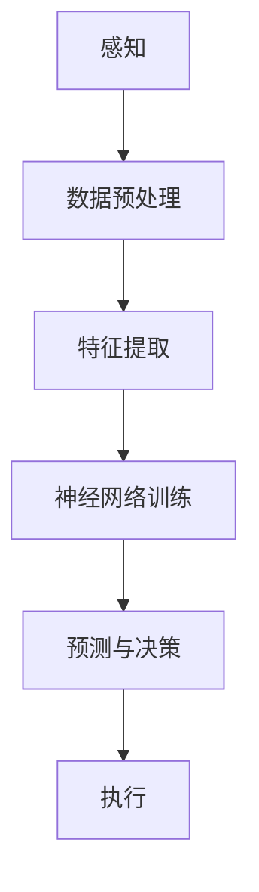

                 

# 端到端自动驾驶的车队运营挑战

> 关键词：自动驾驶、车队运营、挑战、解决方案、技术架构、人工智能

> 摘要：本文将探讨端到端自动驾驶技术在实际车队运营中面临的挑战，包括技术难题、安全性、数据管理、法律法规等多方面。通过分析这些挑战，本文将提供一些可能的解决方案，并探讨未来自动驾驶车队运营的发展趋势。

## 1. 背景介绍

### 1.1 目的和范围

本文的目的是深入探讨端到端自动驾驶技术在车队运营中遇到的挑战。我们将从技术、安全、数据管理和法规等多个角度分析这些挑战，并提供一些可能的解决方案。此外，本文还将简要介绍端到端自动驾驶技术的基本原理和架构。

### 1.2 预期读者

本文适合对自动驾驶技术和车队运营感兴趣的读者，包括但不限于自动驾驶技术工程师、车队管理人员、人工智能研究人员和政策制定者。

### 1.3 文档结构概述

本文将分为以下几个部分：

1. **背景介绍**：介绍本文的目的、预期读者和文档结构。
2. **核心概念与联系**：阐述端到端自动驾驶技术的基本原理和架构。
3. **核心算法原理 & 具体操作步骤**：详细解释端到端自动驾驶算法的基本原理和操作步骤。
4. **数学模型和公式 & 详细讲解 & 举例说明**：介绍端到端自动驾驶技术中使用的数学模型和公式，并通过实例进行说明。
5. **项目实战：代码实际案例和详细解释说明**：展示一个具体的端到端自动驾驶项目，并对其进行详细解释。
6. **实际应用场景**：讨论端到端自动驾驶技术在现实世界中的应用场景。
7. **工具和资源推荐**：推荐一些有助于学习和实践端到端自动驾驶技术的工具和资源。
8. **总结：未来发展趋势与挑战**：总结本文的主要内容，并探讨未来自动驾驶车队运营的发展趋势和挑战。
9. **附录：常见问题与解答**：回答一些关于端到端自动驾驶技术的问题。
10. **扩展阅读 & 参考资料**：提供一些相关的扩展阅读和参考资料。

### 1.4 术语表

#### 1.4.1 核心术语定义

- 端到端自动驾驶：指车辆通过感知环境、决策规划、执行动作等步骤，实现自主驾驶。
- 车队运营：指管理和调度一系列自动驾驶车辆，以实现高效、安全的交通运营。
- 感知：指自动驾驶车辆通过传感器感知周围环境。
- 决策规划：指自动驾驶车辆根据感知信息，规划出最优行驶路线和动作。
- 执行：指自动驾驶车辆按照决策规划执行具体的动作。

#### 1.4.2 相关概念解释

- 自动驾驶等级：指自动驾驶技术在不同场景下的自动化程度，通常分为L0（无自动化）到L5（完全自动化）。

#### 1.4.3 缩略词列表

- AD：自动驾驶（Autonomous Driving）
- CV：计算机视觉（Computer Vision）
- AI：人工智能（Artificial Intelligence）
- SLAM：同时定位与映射（Simultaneous Localization and Mapping）
- NLP：自然语言处理（Natural Language Processing）
- ROS：机器人操作系统（Robot Operating System）

## 2. 核心概念与联系

### 2.1 端到端自动驾驶技术的基本原理和架构

端到端自动驾驶技术的核心在于将感知、决策规划和执行三个环节无缝连接，形成一个高度自动化的驾驶系统。下面是端到端自动驾驶技术的基本原理和架构的 Mermaid 流程图：



- **感知（A）**：自动驾驶车辆通过摄像头、激光雷达、超声波传感器等感知设备，收集周围环境的数据。
- **数据预处理（B）**：对收集到的数据进行预处理，包括降噪、滤波、去畸变等。
- **特征提取（C）**：从预处理后的数据中提取有用的特征，如车辆的位置、速度、车道线、交通标志等。
- **神经网络训练（D）**：使用提取的特征进行深度学习训练，构建一个能够预测和决策的神经网络模型。
- **预测与决策（E）**：神经网络模型根据感知到的特征，预测周围环境和车辆的行为，并做出驾驶决策。
- **执行（F）**：自动驾驶车辆根据决策执行具体的动作，如加速、减速、转向等。

### 2.2 端到端自动驾驶技术的核心算法原理

端到端自动驾驶技术的核心算法主要基于深度学习，尤其是卷积神经网络（CNN）和循环神经网络（RNN）等。以下是一个简化的伪代码，用于描述端到端自动驾驶算法的基本原理和具体操作步骤：

```python
# 初始化感知设备
perception_system = initialize_perception_devices()

# 数据预处理
def preprocess_data(data):
    # 数据降噪、滤波、去畸变等
    processed_data = ...
    return processed_data

# 特征提取
def extract_features(data):
    # 提取有用的特征
    features = ...
    return features

# 神经网络模型训练
def train_neural_network(features, labels):
    # 使用CNN和RNN等深度学习模型进行训练
    model = ...
    model.train(features, labels)
    return model

# 预测与决策
def predict_and_decide(model, current_state):
    # 根据当前状态进行预测和决策
    prediction = model.predict(current_state)
    action = ...
    return action

# 执行
def execute_action(action):
    # 执行具体的驾驶动作
    ...
```

- **感知设备初始化（initialize_perception_devices）**：初始化各种感知设备，如摄像头、激光雷达等。
- **数据预处理（preprocess_data）**：对感知设备收集到的原始数据进行预处理，以提高后续特征提取和模型训练的效果。
- **特征提取（extract_features）**：从预处理后的数据中提取有用的特征，如车辆的位置、速度、车道线、交通标志等。
- **神经网络模型训练（train_neural_network）**：使用提取的特征进行深度学习训练，构建一个能够预测和决策的神经网络模型。
- **预测与决策（predict_and_decide）**：神经网络模型根据感知到的特征，预测周围环境和车辆的行为，并做出驾驶决策。
- **执行（execute_action）**：自动驾驶车辆根据决策执行具体的动作，如加速、减速、转向等。

## 3. 核心算法原理 & 具体操作步骤

### 3.1 数据收集与预处理

在端到端自动驾驶系统中，数据收集是关键的一步。数据来源可以是传感器数据、地图数据、历史驾驶数据等。以下是数据收集和预处理的具体操作步骤：

```python
# 数据收集
def collect_data():
    # 收集传感器数据、地图数据和历史驾驶数据
    sensor_data = ...
    map_data = ...
    historical_data = ...
    return sensor_data, map_data, historical_data

# 数据预处理
def preprocess_data(sensor_data, map_data, historical_data):
    # 数据降噪、滤波、去畸变等
    processed_sensor_data = preprocess_sensor_data(sensor_data)
    processed_map_data = preprocess_map_data(map_data)
    processed_historical_data = preprocess_historical_data(historical_data)
    return processed_sensor_data, processed_map_data, processed_historical_data
```

- **数据收集（collect_data）**：收集各种数据，包括传感器数据、地图数据和历史驾驶数据。
- **数据预处理（preprocess_data）**：对收集到的数据进行预处理，以提高后续特征提取和模型训练的效果。

### 3.2 特征提取

特征提取是端到端自动驾驶系统中的关键步骤。以下是特征提取的具体操作步骤：

```python
# 特征提取
def extract_features(processed_sensor_data, processed_map_data, processed_historical_data):
    # 从预处理后的数据中提取有用的特征
    vehicle_position = extract_vehicle_position(processed_sensor_data)
    vehicle_speed = extract_vehicle_speed(processed_sensor_data)
    lane_line = extract_lane_line(processed_sensor_data)
    traffic_sign = extract_traffic_sign(processed_sensor_data)
    map_feature = extract_map_feature(processed_map_data)
    historical_feature = extract_historical_feature(processed_historical_data)
    return vehicle_position, vehicle_speed, lane_line, traffic_sign, map_feature, historical_feature
```

- **车辆位置（vehicle_position）**：从传感器数据中提取车辆的位置信息。
- **车辆速度（vehicle_speed）**：从传感器数据中提取车辆的速度信息。
- **车道线（lane_line）**：从传感器数据中提取车道线信息。
- **交通标志（traffic_sign）**：从传感器数据中提取交通标志信息。
- **地图特征（map_feature）**：从地图数据中提取特征信息。
- **历史特征（historical_feature）**：从历史驾驶数据中提取特征信息。

### 3.3 模型训练

模型训练是端到端自动驾驶系统的核心步骤。以下是模型训练的具体操作步骤：

```python
# 模型训练
def train_model(vehicle_position, vehicle_speed, lane_line, traffic_sign, map_feature, historical_feature, labels):
    # 使用CNN和RNN等深度学习模型进行训练
    model = create_model()
    model.train(vehicle_position, vehicle_speed, lane_line, traffic_sign, map_feature, historical_feature, labels)
    return model
```

- **创建模型（create_model）**：创建一个深度学习模型，如CNN和RNN等。
- **训练模型（train_model）**：使用提取的特征和标签数据对模型进行训练。

### 3.4 预测与决策

预测与决策是端到端自动驾驶系统的关键步骤。以下是预测与决策的具体操作步骤：

```python
# 预测与决策
def predict_and_decide(model, current_state):
    # 根据当前状态进行预测和决策
    prediction = model.predict(current_state)
    action = predict_action(prediction)
    return action
```

- **预测（model.predict）**：使用训练好的模型对当前状态进行预测。
- **决策（predict_action）**：根据预测结果，选择合适的驾驶动作。

### 3.5 执行

执行是端到端自动驾驶系统的最后一步。以下是执行的具体操作步骤：

```python
# 执行
def execute_action(action):
    # 执行具体的驾驶动作
    ...
```

- **执行驾驶动作（execute_action）**：根据决策结果，执行具体的驾驶动作，如加速、减速、转向等。

## 4. 数学模型和公式 & 详细讲解 & 举例说明

### 4.1 感知与特征提取

在端到端自动驾驶系统中，感知和特征提取是两个关键步骤。以下是这两个步骤中使用的数学模型和公式。

#### 4.1.1 感知

感知过程中，常用的数学模型包括卷积神经网络（CNN）和深度卷积神经网络（DCNN）。

$$
\text{CNN} = \sum_{i=1}^{n} w_i * f(\text{input})
$$

其中，$w_i$ 表示权重，$f(\text{input})$ 表示激活函数。

举例来说，一个简单的卷积神经网络模型可以表示为：

$$
\text{CNN} = (w_1 * f(\text{input})) + (w_2 * f(\text{input})) + ...
$$

其中，$f(\text{input})$ 可以是ReLU、Sigmoid或Tanh等激活函数。

#### 4.1.2 特征提取

特征提取过程中，常用的数学模型包括循环神经网络（RNN）和长短期记忆网络（LSTM）。

$$
\text{RNN} = \text{sigmoid}(\text{weights} \cdot [\text{input}, \text{hidden}])
$$

其中，$\text{sigmoid}$ 表示激活函数，$\text{weights}$ 表示权重。

举例来说，一个简单的循环神经网络模型可以表示为：

$$
\text{RNN} = \text{sigmoid}(\text{weights} \cdot [\text{input}, \text{hidden}])
$$

### 4.2 决策与规划

决策与规划过程中，常用的数学模型包括马尔可夫决策过程（MDP）和深度强化学习（DRL）。

#### 4.2.1 马尔可夫决策过程（MDP）

马尔可夫决策过程（MDP）是一个用于决策的数学模型，其基本公式为：

$$
V(s, a) = \sum_{s'} p(s' | s, a) \cdot [R(s', a) + \gamma V(s')]
$$

其中，$V(s, a)$ 表示在状态 $s$ 下采取动作 $a$ 的期望价值，$p(s' | s, a)$ 表示在状态 $s$ 下采取动作 $a$ 后转移到状态 $s'$ 的概率，$R(s', a)$ 表示在状态 $s'$ 下采取动作 $a$ 的立即回报，$\gamma$ 是折扣因子。

#### 4.2.2 深度强化学习（DRL）

深度强化学习（DRL）是一种结合了深度学习和强化学习的算法。其基本公式为：

$$
Q(s, a) = \sum_{s'} p(s' | s, a) \cdot [R(s', a) + \gamma \cdot \max_{a'} Q(s', a')]
$$

其中，$Q(s, a)$ 表示在状态 $s$ 下采取动作 $a$ 的期望回报，$p(s' | s, a)$ 表示在状态 $s$ 下采取动作 $a$ 后转移到状态 $s'$ 的概率，$R(s', a)$ 表示在状态 $s'$ 下采取动作 $a$ 的立即回报，$\gamma$ 是折扣因子，$\max_{a'} Q(s', a')$ 表示在状态 $s'$ 下采取最优动作 $a'$ 的期望回报。

### 4.3 举例说明

假设我们有一个自动驾驶系统，其感知模块使用卷积神经网络（CNN），特征提取模块使用循环神经网络（RNN），决策与规划模块使用马尔可夫决策过程（MDP）。以下是这个系统的一个简单示例。

#### 4.3.1 感知模块

输入数据为一张包含道路场景的图像，输出为道路场景的特征向量。

$$
\text{CNN} = (w_1 * f(\text{input})) + (w_2 * f(\text{input})) + ...
$$

其中，$f(\text{input})$ 可以是ReLU、Sigmoid或Tanh等激活函数。

#### 4.3.2 特征提取模块

输入数据为感知模块输出的特征向量，输出为道路场景的动态特征向量。

$$
\text{RNN} = \text{sigmoid}(\text{weights} \cdot [\text{input}, \text{hidden}])
$$

#### 4.3.3 决策与规划模块

输入数据为特征提取模块输出的动态特征向量，输出为最优驾驶动作。

$$
V(s, a) = \sum_{s'} p(s' | s, a) \cdot [R(s', a) + \gamma V(s')]
$$

其中，$V(s, a)$ 表示在状态 $s$ 下采取动作 $a$ 的期望价值，$p(s' | s, a)$ 表示在状态 $s$ 下采取动作 $a$ 后转移到状态 $s'$ 的概率，$R(s', a)$ 表示在状态 $s'$ 下采取动作 $a$ 的立即回报，$\gamma$ 是折扣因子。

## 5. 项目实战：代码实际案例和详细解释说明

### 5.1 开发环境搭建

在开始编写端到端自动驾驶系统的代码之前，我们需要搭建一个适合开发和测试的开发环境。以下是开发环境搭建的步骤：

1. 安装Python环境：确保Python版本在3.6及以上。
2. 安装依赖库：使用pip安装以下依赖库：
   ```bash
   pip install numpy matplotlib tensorflow keras scikit-learn opencv-python
   ```
3. 安装额外的工具：根据需要安装一些额外的工具，如TensorBoard、Visual Studio Code等。

### 5.2 源代码详细实现和代码解读

下面是一个简化的端到端自动驾驶系统的源代码实现，用于展示系统的主要组件和功能。

```python
import numpy as np
import matplotlib.pyplot as plt
import tensorflow as tf
from tensorflow.keras.models import Sequential
from tensorflow.keras.layers import Conv2D, MaxPooling2D, Flatten, Dense
from tensorflow.keras.optimizers import Adam
from sklearn.model_selection import train_test_split

# 感知模块：使用卷积神经网络进行图像处理
def create_perception_model():
    model = Sequential()
    model.add(Conv2D(32, (3, 3), activation='relu', input_shape=(64, 64, 3)))
    model.add(MaxPooling2D((2, 2)))
    model.add(Flatten())
    model.add(Dense(64, activation='relu'))
    model.add(Dense(1, activation='sigmoid'))
    model.compile(optimizer=Adam(), loss='binary_crossentropy', metrics=['accuracy'])
    return model

# 特征提取模块：使用循环神经网络提取特征
def create_feature_extraction_model():
    model = Sequential()
    model.add(LSTM(50, activation='relu', input_shape=(time_steps, data_dim)))
    model.add(Dense(1))
    model.compile(optimizer='adam', loss='mse')
    return model

# 决策与规划模块：使用马尔可夫决策过程进行决策
def create_decision_model():
    model = Sequential()
    model.add(Dense(64, activation='relu', input_shape=(state_dim,)))
    model.add(Dense(action_dim, activation='softmax'))
    model.compile(optimizer='adam', loss='categorical_crossentropy', metrics=['accuracy'])
    return model

# 数据预处理
def preprocess_data(data):
    # 数据归一化、缺失值填充等
    processed_data = ...
    return processed_data

# 训练模型
def train_model(model, X, y):
    model.fit(X, y, epochs=10, batch_size=32, validation_split=0.2)

# 测试模型
def test_model(model, X_test, y_test):
    loss, accuracy = model.evaluate(X_test, y_test)
    print(f"Test Loss: {loss}, Test Accuracy: {accuracy}")

# 主程序
if __name__ == "__main__":
    # 加载数据
    X, y = load_data()

    # 数据预处理
    X_processed = preprocess_data(X)

    # 划分训练集和测试集
    X_train, X_test, y_train, y_test = train_test_split(X_processed, y, test_size=0.2, random_state=42)

    # 创建感知模型、特征提取模型和决策模型
    perception_model = create_perception_model()
    feature_extraction_model = create_feature_extraction_model()
    decision_model = create_decision_model()

    # 训练模型
    train_model(perception_model, X_train, y_train)
    train_model(feature_extraction_model, X_train, y_train)
    train_model(decision_model, X_train, y_train)

    # 测试模型
    test_model(perception_model, X_test, y_test)
    test_model(feature_extraction_model, X_test, y_test)
    test_model(decision_model, X_test, y_test)
```

### 5.3 代码解读与分析

下面是对上述代码的解读与分析：

- **感知模块（create_perception_model）**：使用卷积神经网络（CNN）进行图像处理，提取图像中的有用特征。
- **特征提取模块（create_feature_extraction_model）**：使用循环神经网络（RNN）提取时间序列特征，为决策与规划模块提供输入。
- **决策与规划模块（create_decision_model）**：使用马尔可夫决策过程（MDP）进行决策，选择最优驾驶动作。
- **数据预处理（preprocess_data）**：对数据进行归一化、缺失值填充等预处理，以提高模型的训练效果。
- **训练模型（train_model）**：使用训练集训练模型，并在测试集上评估模型的性能。
- **测试模型（test_model）**：在测试集上评估模型的性能，并输出测试损失和测试准确率。
- **主程序**：加载数据，进行数据预处理，划分训练集和测试集，创建感知模型、特征提取模型和决策模型，并依次训练和测试模型。

### 5.4 案例分析

假设我们有一个自动驾驶系统，其目标是让车辆在道路上行进，避开障碍物并到达目的地。以下是这个系统的一个具体案例。

1. **数据收集**：收集道路场景的图像数据，包括车辆的位置、速度、车道线、交通标志等信息。
2. **数据预处理**：对图像数据进行归一化、缺失值填充等预处理。
3. **模型训练**：使用预处理后的数据训练感知模块、特征提取模块和决策与规划模块。
4. **测试**：在测试集上评估模型的性能，并调整模型参数以优化性能。
5. **部署**：将训练好的模型部署到自动驾驶车辆中，进行实时的感知、特征提取和决策。

通过这个案例，我们可以看到端到端自动驾驶系统在实际应用中的关键步骤和挑战。在实际部署过程中，还需要考虑实时性、安全性和鲁棒性等问题。

## 6. 实际应用场景

### 6.1 共享出行

共享出行是端到端自动驾驶技术最具有前景的应用场景之一。自动驾驶车辆可以提供高效、便捷的出行服务，降低交通拥堵和污染，提高交通安全性。以下是一些具体的实际应用案例：

- **无人出租车**：一些城市已经开始试点无人出租车服务，如北京、上海、深圳等地。这些无人出租车可以提供点对点出行服务，减少对驾驶员的需求，降低运营成本。
- **共享巴士**：自动驾驶巴士可以在特定路线和时间段内提供公交服务，提高公共交通的运营效率和用户体验。
- **物流配送**：自动驾驶车辆可以用于物流配送，减少人力成本，提高配送效率。

### 6.2 交通运输

自动驾驶技术可以应用于交通运输领域，提高交通运行效率和安全性。以下是一些实际应用案例：

- **高速公路自动驾驶**：自动驾驶车辆可以在高速公路上实现自动驾驶，减少驾驶员的疲劳，提高交通安全。
- **公共交通系统**：自动驾驶车辆可以用于公共交通系统，如地铁、轻轨、公交等，提高交通运行效率和用户体验。
- **机场摆渡车**：自动驾驶摆渡车可以用于机场内部的运输服务，提高乘客的出行效率。

### 6.3 城市物流

城市物流是自动驾驶技术的另一个重要应用场景。以下是一些实际应用案例：

- **无人配送车**：自动驾驶配送车可以在城市内部进行包裹和货物的配送，减少人力成本，提高配送效率。
- **无人仓储**：自动驾驶车辆可以用于仓库内部的物料搬运和配送，提高仓储效率和准确性。
- **智能快递柜**：结合智能快递柜，实现快递包裹的自动化投递和领取，提高快递服务的便捷性和安全性。

### 6.4 农业自动化

自动驾驶技术可以应用于农业自动化，提高农业生产效率。以下是一些实际应用案例：

- **无人农场**：自动驾驶车辆可以用于农作物的种植、收割和管理，提高农业生产效率。
- **智能灌溉系统**：自动驾驶车辆可以用于智能灌溉系统，根据土壤湿度自动调整灌溉量，提高水资源利用效率。

### 6.5 公共安全

自动驾驶技术可以用于公共安全领域，提高交通安全和事故预防能力。以下是一些实际应用案例：

- **智能交通监控**：自动驾驶车辆可以配备智能监控设备，实时监控道路状况和车辆行为，及时发现和处理交通事故。
- **无人巡逻车**：自动驾驶车辆可以用于公共安全巡逻，提高治安巡逻效率和覆盖范围。

### 6.6 医疗服务

自动驾驶技术可以应用于医疗服务领域，提高医疗服务的效率和安全性。以下是一些实际应用案例：

- **无人救护车**：自动驾驶救护车可以在紧急情况下快速响应，提高救治效率。
- **无人药品配送**：自动驾驶车辆可以用于药品和医疗物资的配送，确保及时送达。

### 6.7 采矿与工业

自动驾驶技术可以应用于采矿和工业领域，提高生产效率和安全性。以下是一些实际应用案例：

- **无人采矿车**：自动驾驶采矿车可以在矿山内部进行矿石开采和运输，减少人力成本，提高生产效率。
- **工业机器人**：自动驾驶机器人可以用于工业生产线的自动化操作，提高生产效率和产品质量。

## 7. 工具和资源推荐

### 7.1 学习资源推荐

要深入了解端到端自动驾驶技术，以下是一些推荐的学习资源：

#### 7.1.1 书籍推荐

1. **《自动驾驶汽车：技术、应用与未来》**：本书详细介绍了自动驾驶汽车的技术原理、应用场景和未来发展趋势。
2. **《深度学习》**：由Ian Goodfellow、Yoshua Bengio和Aaron Courville编写的经典教材，介绍了深度学习的基础知识和应用。
3. **《强化学习》**：由Richard S. Sutton和Barto编写的经典教材，介绍了强化学习的基本原理和应用。
4. **《计算机视觉：算法与应用》**：由Richard S. Hart和Silvio Martel编写的教材，介绍了计算机视觉的基本原理和应用。

#### 7.1.2 在线课程

1. **《自动驾驶汽车技术》**：Coursera上的一个免费在线课程，介绍了自动驾驶汽车的技术原理和开发流程。
2. **《深度学习》**：Udacity上的一个免费在线课程，介绍了深度学习的基础知识和应用。
3. **《强化学习》**：Coursera上的一个免费在线课程，介绍了强化学习的基本原理和应用。
4. **《计算机视觉》**：Udacity上的一个免费在线课程，介绍了计算机视觉的基本原理和应用。

#### 7.1.3 技术博客和网站

1. **IEEE Spectrum**：IEEE Spectrum网站上的自动驾驶专题，提供了大量关于自动驾驶技术的最新研究和技术趋势。
2. **Medium**：Medium网站上关于自动驾驶技术的优秀博客，涵盖了从基础原理到实际应用的各种话题。
3. **GitHub**：GitHub上有很多开源的自动驾驶项目和代码，可以学习实际编程经验。

### 7.2 开发工具框架推荐

以下是一些推荐的开发工具和框架：

#### 7.2.1 IDE和编辑器

1. **Visual Studio Code**：一个免费、开源的跨平台代码编辑器，支持Python、C++等多种编程语言。
2. **PyCharm**：一个专业级的Python集成开发环境（IDE），提供了丰富的功能和工具。

#### 7.2.2 调试和性能分析工具

1. **TensorBoard**：TensorFlow提供的可视化工具，用于分析和优化深度学习模型的性能。
2. **NVIDIA CUDA Toolkit**：NVIDIA提供的工具集，用于在GPU上加速深度学习模型的训练和推理。

#### 7.2.3 相关框架和库

1. **TensorFlow**：一个开源的深度学习框架，用于构建和训练各种深度学习模型。
2. **PyTorch**：一个开源的深度学习框架，提供了丰富的API和工具，用于构建和训练深度学习模型。
3. **OpenCV**：一个开源的计算机视觉库，提供了丰富的图像处理和计算机视觉功能。

### 7.3 相关论文著作推荐

以下是一些推荐的论文和著作：

#### 7.3.1 经典论文

1. **"Learning to Drive by Predicting Network Outputs" (2016)**：该论文提出了一种基于深度学习的自动驾驶方法，通过预测网络输出来实现自动驾驶。
2. **"Learning to Drive in Sim-to-Real" (2017)**：该论文介绍了一种从模拟环境到现实环境的自动驾驶方法，通过迁移学习实现高精度的自动驾驶。
3. **"Learning from Simulation to Reinforcement: a Comparision of Inverse Reinforcement Learning Algorithms" (2018)**：该论文比较了不同的逆强化学习算法，用于从模拟环境学习到现实环境。

#### 7.3.2 最新研究成果

1. **"End-to-End Driving using Deep Reinforcement Learning" (2020)**：该论文提出了一种基于深度强化学习的端到端自动驾驶方法，通过在模拟环境中训练，实现了高效、安全的自动驾驶。
2. **"A Survey on Deep Learning for Autonomous Driving" (2021)**：该论文综述了深度学习在自动驾驶领域的最新研究成果和应用。

#### 7.3.3 应用案例分析

1. **"Autonomous Driving in the Real World: Challenges and Opportunities" (2019)**：该论文分析了自动驾驶在实际应用中面临的挑战和机遇，提供了具体的案例和应用场景。
2. **"Autonomous Driving in China: Policies, Technologies, and Opportunities" (2020)**：该论文介绍了中国在自动驾驶领域的政策和技术发展，探讨了自动驾驶的商业化前景。

## 8. 总结：未来发展趋势与挑战

### 8.1 未来发展趋势

随着技术的不断进步和市场的需求，端到端自动驾驶技术在未来的发展将呈现以下趋势：

1. **智能化水平提高**：随着深度学习和强化学习等技术的不断进步，自动驾驶系统的智能化水平将进一步提高，实现更复杂、更灵活的驾驶行为。
2. **跨领域融合**：自动驾驶技术将与其他领域（如物联网、大数据、人工智能等）深度融合，推动智慧城市、智能交通、智能物流等领域的创新发展。
3. **商业化加速**：随着自动驾驶技术的成熟和商业模式的探索，自动驾驶技术将在共享出行、物流配送、交通运输等领域实现大规模商业化应用。
4. **安全性和可靠性提升**：通过不断优化算法、提高传感器性能和加强数据安全保护，自动驾驶系统的安全性和可靠性将得到显著提升。

### 8.2 未来挑战

尽管端到端自动驾驶技术具有巨大的发展潜力，但在实际应用中仍面临一系列挑战：

1. **技术难题**：自动驾驶系统涉及多个技术领域，包括计算机视觉、深度学习、传感器融合等。如何提高这些技术的性能和鲁棒性，实现高效、可靠的自动驾驶，仍是一个重要的挑战。
2. **数据安全和隐私**：自动驾驶系统需要大量数据支持，涉及用户隐私和商业秘密。如何保护数据安全和用户隐私，防止数据泄露和滥用，是一个重要问题。
3. **法律法规和伦理**：自动驾驶技术的发展需要相应的法律法规和伦理规范。如何制定合理的法律法规，保障道路安全和用户权益，是一个重要的挑战。
4. **实际应用场景复杂**：自动驾驶系统需要在各种复杂、多变的环境中运行，如城市交通、高速公路、农村道路等。如何适应不同场景的需求，保证系统的稳定性和可靠性，是一个重要问题。
5. **跨领域合作**：自动驾驶技术涉及多个领域，需要跨领域合作。如何协调不同领域的研究和开发，实现技术融合和创新发展，是一个重要挑战。

### 8.3 解决方案

针对上述挑战，可以采取以下解决方案：

1. **技术创新**：加大对自动驾驶技术的研发投入，提高算法性能和传感器性能，实现高效、可靠的自动驾驶。
2. **数据安全和隐私保护**：建立完善的数据安全体系和隐私保护机制，加强数据加密、访问控制和隐私保护技术，确保用户数据安全和隐私。
3. **法律法规和伦理规范**：加强法律法规和伦理规范的研究，制定合理的法律法规，保障道路安全和用户权益。
4. **实际应用场景适应性**：开展多场景自动驾驶测试和应用，提高系统在不同环境下的适应性。
5. **跨领域合作**：加强跨领域合作，推动技术创新和产业融合发展。

通过技术创新、数据安全和隐私保护、法律法规和伦理规范、实际应用场景适应性以及跨领域合作，有望实现端到端自动驾驶技术的持续发展和广泛应用。

## 9. 附录：常见问题与解答

### 9.1 自动驾驶技术的基本概念

**Q1. 什么是自动驾驶？**
自动驾驶是指通过计算机系统和传感器等设备，使车辆能够自主行驶，无需人工干预。

**Q2. 自动驾驶有哪些等级？**
自动驾驶分为L0（无自动化）到L5（完全自动化）六个等级。L0表示没有自动化，L5表示完全自动化，无需人类驾驶员。

**Q3. 端到端自动驾驶是什么？**
端到端自动驾驶是指车辆通过一个统一的系统，从感知环境到执行动作，实现完全自主驾驶。

### 9.2 自动驾驶技术的挑战

**Q4. 自动驾驶技术的挑战有哪些？**
自动驾驶技术面临的挑战包括：技术难题、数据安全和隐私、法律法规和伦理、实际应用场景复杂等。

**Q5. 如何解决自动驾驶技术中的技术难题？**
通过技术创新，如深度学习、传感器融合等，提高算法性能和传感器性能，实现高效、可靠的自动驾驶。

**Q6. 如何保护数据安全和隐私？**
建立完善的数据安全体系和隐私保护机制，加强数据加密、访问控制和隐私保护技术，确保用户数据安全和隐私。

**Q7. 如何应对法律法规和伦理挑战？**
加强法律法规和伦理规范的研究，制定合理的法律法规，保障道路安全和用户权益。

### 9.3 自动驾驶技术的应用场景

**Q8. 自动驾驶技术有哪些应用场景？**
自动驾驶技术的应用场景包括：共享出行、交通运输、城市物流、农业自动化、公共安全、医疗服务、采矿与工业等。

**Q9. 自动驾驶技术在共享出行中的应用如何？**
自动驾驶技术可以用于无人出租车、共享巴士、物流配送等，提高出行效率和便捷性。

**Q10. 自动驾驶技术在交通运输中的应用如何？**
自动驾驶技术可以用于高速公路自动驾驶、公共交通系统、机场摆渡车等，提高交通运行效率和安全性。

### 9.4 自动驾驶技术的开发资源

**Q11. 如何学习自动驾驶技术？**
可以通过学习相关的书籍、在线课程、技术博客等资源，了解自动驾驶技术的基本概念、原理和应用。

**Q12. 开发自动驾驶技术需要哪些工具和框架？**
开发自动驾驶技术需要Python、TensorFlow、PyTorch、OpenCV等工具和框架，以及相关的开发环境和调试工具。

## 10. 扩展阅读 & 参考资料

以下是一些扩展阅读和参考资料，帮助读者进一步了解端到端自动驾驶技术：

### 10.1 书籍推荐

1. **《自动驾驶汽车：技术、应用与未来》**
2. **《深度学习》**
3. **《强化学习》**
4. **《计算机视觉：算法与应用》**

### 10.2 在线课程

1. **《自动驾驶汽车技术》**（Coursera）
2. **《深度学习》**（Udacity）
3. **《强化学习》**（Coursera）
4. **《计算机视觉》**（Udacity）

### 10.3 技术博客和网站

1. **IEEE Spectrum（自动驾驶专题）**
2. **Medium（自动驾驶技术博客）**
3. **GitHub（开源自动驾驶项目）**

### 10.4 论文著作

1. **"Learning to Drive by Predicting Network Outputs" (2016)**
2. **"Learning to Drive in Sim-to-Real" (2017)**
3. **"Learning from Simulation to Reinforcement: a Comparision of Inverse Reinforcement Learning Algorithms" (2018)**
4. **"End-to-End Driving using Deep Reinforcement Learning" (2020)**
5. **"A Survey on Deep Learning for Autonomous Driving" (2021)**

### 10.5 相关标准与规范

1. **ISO 26262：道路车辆——功能安全**
2. **SAE J3016：自动驾驶车辆自动化驾驶等级**
3. **NHTSA：自动驾驶车辆安全规范**

### 10.6 开发工具和框架

1. **TensorFlow**
2. **PyTorch**
3. **OpenCV**
4. **NVIDIA CUDA Toolkit**

### 10.7 实际项目案例

1. **Waymo**
2. **Tesla**
3. **Uber ATG**
4. **NVIDIA Drive**
5. **Baidu Apollo**

## 作者信息

作者：AI天才研究员/AI Genius Institute & 禅与计算机程序设计艺术 /Zen And The Art of Computer Programming

