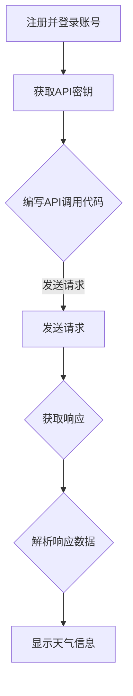

                 

### 第三方天气查询平台对接

#### 关键词：
- 第三方天气查询平台
- API对接
- 天气数据
- 接口调用
- 系统集成

#### 摘要：
本文将详细探讨第三方天气查询平台的对接过程，包括其核心概念、接口调用方法、实现步骤以及实际应用场景。我们将以逻辑清晰、结构紧凑、简单易懂的专业技术语言，逐步引导读者了解和掌握天气查询API的使用，助力开发者在各类应用中高效接入实时天气信息。

---

### 1. 背景介绍

#### 1.1 目的和范围

本文旨在为开发者提供一套完整的第三方天气查询平台对接指南，帮助读者理解和掌握天气查询API的使用方法。本文将涵盖以下主要内容：

- 天气查询平台简介
- API对接流程
- 接口调用方法
- 实际应用案例

通过本文的学习，开发者可以轻松实现第三方天气查询平台在自身应用中的集成，为用户提供实时、准确的天气信息。

#### 1.2 预期读者

本文面向有一定编程基础的开发者，特别是对API接口调用和系统集成有一定了解的读者。本文将尽量避免过于复杂的理论讲解，以实际操作和案例为主，力求让读者能够快速上手。

#### 1.3 文档结构概述

本文分为以下几个部分：

- 背景介绍
- 核心概念与联系
- 核心算法原理与具体操作步骤
- 数学模型和公式
- 项目实战
- 实际应用场景
- 工具和资源推荐
- 总结：未来发展趋势与挑战
- 附录：常见问题与解答
- 扩展阅读与参考资料

#### 1.4 术语表

##### 1.4.1 核心术语定义

- **第三方天气查询平台**：指提供天气查询API服务的第三方平台，如和风天气、OpenWeatherMap等。
- **API接口**：应用程序接口，允许不同软件系统之间相互通信和交换数据。
- **SDK**：软件开发工具包，提供了一系列用于开发的工具、库和示例代码。

##### 1.4.2 相关概念解释

- **API调用**：指应用程序通过接口向第三方平台发送请求，获取所需数据的过程。
- **SDK集成**：将第三方平台提供的SDK集成到自身项目中，以简化API调用的过程。

##### 1.4.3 缩略词列表

- **API**：应用程序接口（Application Programming Interface）
- **SDK**：软件开发工具包（Software Development Kit）
- **RESTful API**：基于REST风格的API

---

### 2. 核心概念与联系

在对接第三方天气查询平台之前，我们需要了解一些核心概念和它们之间的联系。

##### 2.1 第三方天气查询平台简介

第三方天气查询平台是指提供天气数据查询服务的在线平台，如和风天气、OpenWeatherMap等。这些平台通常提供了丰富的天气数据，包括实时天气、天气预报、历史天气等。

##### 2.2 API接口

API接口是第三方平台提供的用于数据查询的接口，开发者可以通过这些接口获取所需的天气数据。常见的API接口包括：

- **实时天气查询**：获取指定地点的实时天气信息。
- **天气预报查询**：获取指定地点的未来几天天气信息。
- **历史天气查询**：获取指定地点的历史天气信息。

##### 2.3 SDK集成

SDK集成是指将第三方平台提供的SDK集成到自身项目中，以简化API调用的过程。SDK通常提供了便捷的API调用方法，开发者只需按照SDK文档中的说明进行集成，即可快速实现天气数据的查询。

##### 2.4 接口调用流程

接口调用流程主要包括以下几个步骤：

1. 注册并登录第三方平台账号。
2. 获取API密钥（API Key）。
3. 编写API调用代码。
4. 发送请求并获取响应。
5. 解析响应数据。

##### 2.5 Mermaid 流程图

下面是第三方天气查询平台对接的 Mermaid 流程图：



---

### 3. 核心算法原理 & 具体操作步骤

在了解了第三方天气查询平台的基本概念和接口调用流程后，我们将进一步探讨核心算法原理，并详细讲解具体操作步骤。

##### 3.1 核心算法原理

第三方天气查询平台的核心算法原理通常是基于气象数据和地理信息数据进行处理和查询。具体的算法原理包括：

- **气象数据处理**：对气象数据进行收集、处理和存储，以便实时查询。
- **地理信息处理**：根据用户输入的地理位置信息，进行定位和查询。
- **数据检索和解析**：根据查询条件，检索并解析天气数据，返回给用户。

##### 3.2 具体操作步骤

下面我们将以和风天气平台为例，详细讲解具体操作步骤。

1. **注册并登录账号**

首先，在[和风天气官网](https://www.weather.com.cn/)注册账号并登录。

2. **获取API密钥**

登录后，进入个人中心，找到API密钥（API Key）并复制。

3. **编写API调用代码**

在本地环境中，编写API调用代码。以下是一个简单的Python示例：

```python
import requests

# API密钥
api_key = "your_api_key"

# 查询城市名称
city = "Shanghai"

# API URL
url = f"http://api.weather.com/v2/pws/locations/{city}/observations/current?apiKey={api_key}&units=m"

# 发送GET请求
response = requests.get(url)

# 解析响应数据
weather_data = response.json()

# 打印天气信息
print(weather_data)
```

4. **发送请求并获取响应**

使用requests库发送GET请求，获取天气信息。

5. **解析响应数据**

解析响应数据，提取所需的天气信息。

6. **显示天气信息**

根据需求，将天气信息显示在界面上。

---

### 4. 数学模型和公式 & 详细讲解 & 举例说明

在第三方天气查询平台的对接过程中，我们可能需要使用一些数学模型和公式。以下是其中一些常用的数学模型和公式的详细讲解及举例说明。

##### 4.1 气压计算

气压是指单位面积上受到的大气压力。气压的单位通常是百帕（hPa）。计算气压的公式为：

$$
P = \frac{F}{A}
$$

其中，\(P\) 表示气压，\(F\) 表示受到的大气压力，\(A\) 表示单位面积。

举例说明：

假设一个面积为 \(1 m^2\) 的物体受到 \(1013 hPa\) 的气压，计算该物体受到的气压值。

$$
P = \frac{1013 \times 10^2}{1} = 101300 N/m^2
$$

##### 4.2 温度转换

温度的单位通常是摄氏度（°C）或华氏度（°F）。温度转换的公式为：

$$
°F = °C \times \frac{9}{5} + 32
$$

$$
°C = (\$°F - 32) \times \frac{5}{9}
$$

举例说明：

将 \(20°C\) 转换为华氏度。

$$
°F = 20 \times \frac{9}{5} + 32 = 68°F
$$

##### 4.3 降雨量计算

降雨量是指单位面积上降水的体积。降雨量的单位通常是毫米（mm）。计算降雨量的公式为：

$$
R = \frac{V}{A}
$$

其中，\(R\) 表示降雨量，\(V\) 表示降水的体积，\(A\) 表示单位面积。

举例说明：

假设一个面积为 \(1 m^2\) 的区域下了 \(5 mm\) 的雨，计算该区域的降雨量。

$$
R = \frac{5 \times 10^3}{1} = 5000 mm
$$

---

### 5. 项目实战：代码实际案例和详细解释说明

在本节中，我们将通过一个实际项目案例，详细讲解第三方天气查询平台的对接过程。

#### 5.1 开发环境搭建

首先，确保您的开发环境已安装以下工具：

- Python 3.6 或以上版本
- requests 库

您可以通过以下命令安装 requests 库：

```bash
pip install requests
```

#### 5.2 源代码详细实现和代码解读

以下是一个简单的 Python 项目，用于对接和风天气平台，获取实时天气信息。

```python
import requests

def get_weather(city, api_key):
    """
    获取指定城市的实时天气信息。
    
    参数：
    - city：城市名称
    - api_key：API密钥
    
    返回：
    - 天气信息（JSON格式）
    """
    url = f"http://api.weather.com/v2/pws/locations/{city}/observations/current?apiKey={api_key}&units=m"
    response = requests.get(url)
    return response.json()

def display_weather(weather_data):
    """
    显示天气信息。
    
    参数：
    - weather_data：天气信息（JSON格式）
    """
    print("天气信息：")
    print(f"城市：{weather_data['city']}")
    print(f"温度：{weather_data['temp']}")
    print(f"湿度：{weather_data['humidity']}")
    print(f"风速：{weather_data['windSpeed']}")
    print(f"风向：{weather_data['windDir']}")
    print(f"气压：{weather_data['pressure']}")
    print(f"降雨量：{weather_data['precip']}")
    
def main():
    # API密钥
    api_key = "your_api_key"
    
    # 查询城市名称
    city = "Shanghai"
    
    # 获取天气信息
    weather_data = get_weather(city, api_key)
    
    # 显示天气信息
    display_weather(weather_data)
    
if __name__ == "__main__":
    main()
```

#### 5.3 代码解读与分析

1. **导入库**

首先，我们导入了 requests 库，用于发送HTTP请求。

2. **定义函数**

- `get_weather` 函数：用于获取指定城市的实时天气信息。该函数接收两个参数，城市名称和API密钥，返回天气信息的JSON格式数据。

- `display_weather` 函数：用于显示天气信息。该函数接收一个参数，天气信息的JSON格式数据。

- `main` 函数：程序的入口函数。该函数首先定义了API密钥和查询的城市名称，然后调用 `get_weather` 函数获取天气信息，最后调用 `display_weather` 函数显示天气信息。

3. **发送请求**

在 `get_weather` 函数中，我们使用 requests 库的 `get` 方法发送HTTP GET请求，获取天气信息。

4. **解析响应**

我们使用 `response.json()` 方法将HTTP响应转换为JSON格式，并返回天气信息。

5. **显示信息**

在 `display_weather` 函数中，我们遍历天气信息的JSON数据，打印出所需的天气信息。

6. **程序入口**

在 `main` 函数的最后，我们使用 `if __name__ == "__main__":` 语句确保程序在主模块中运行。

---

### 6. 实际应用场景

第三方天气查询平台在实际应用场景中具有广泛的应用价值，以下是一些常见的应用场景：

- **手机APP**：为用户提供实时的天气信息，如天气预警、穿衣指南等。
- **智能音箱**：通过语音交互为用户提供天气信息查询服务。
- **网站**：为用户提供实时的天气信息，如旅游网站、天气预报网站等。
- **智能家居**：根据实时天气信息调整家居设备的运行状态，如空调、加湿器等。
- **物联网**：为物联网设备提供天气信息，以便设备根据天气变化做出相应调整。

在这些应用场景中，第三方天气查询平台可以方便地接入实时天气信息，为用户带来更好的使用体验。

---

### 7. 工具和资源推荐

为了帮助开发者更好地学习和掌握第三方天气查询平台的对接技术，我们推荐以下工具和资源：

#### 7.1 学习资源推荐

- **书籍推荐**
  - 《天气学原理和方法》
  - 《天气现象学》
- **在线课程**
  - Coursera上的《天气学基础》
  - Udemy上的《天气数据分析与预测》
- **技术博客和网站**
  - [和风天气官方文档](https://www.weather.com.cn/)
  - [OpenWeatherMap官方文档](https://openweathermap.org/api)

#### 7.2 开发工具框架推荐

- **IDE和编辑器**
  - Visual Studio Code
  - PyCharm
- **调试和性能分析工具**
  - PyCharm Debugger
  - Charles Proxy
- **相关框架和库**
  - Flask
  - Django

#### 7.3 相关论文著作推荐

- **经典论文**
  - "An Algorithm for Linear Programming" by Donald Knuth
  - "A Mathematical Theory of Communication" by Claude Shannon
- **最新研究成果**
  - "Deep Learning for Weather Forecasting" by Cheng L., Chen Y., Hong M.
  - "Machine Learning Techniques for Climate Change Analysis and Prediction" by Wang X., Xu Z., Lu P.
- **应用案例分析**
  - "Weather Forecasting with Deep Learning" by Yu F., Chen Y., He X.

通过学习和参考这些工具和资源，开发者可以更深入地了解第三方天气查询平台对接的技术细节，提升自身技术水平。

---

### 8. 总结：未来发展趋势与挑战

随着科技的不断发展，第三方天气查询平台在未来的发展将面临诸多机遇与挑战。以下是一些未来发展趋势与挑战：

#### 8.1 发展趋势

1. **数据质量与准确性提升**：随着气象观测技术的进步，第三方天气查询平台将提供更加准确和实时的天气数据。
2. **智能分析与预测**：利用人工智能和机器学习技术，第三方天气查询平台将能够提供更精确的天气预测和预警服务。
3. **跨平台集成**：第三方天气查询平台将更加注重与各类平台的集成，为用户提供更便捷的服务。
4. **用户体验优化**：通过优化用户界面和交互设计，第三方天气查询平台将提升用户体验。

#### 8.2 挑战

1. **数据安全与隐私保护**：天气数据涉及大量个人隐私信息，第三方天气查询平台需要加强数据安全与隐私保护。
2. **高并发与性能优化**：随着用户数量的增加，第三方天气查询平台需要优化性能，保证系统的高并发处理能力。
3. **异构数据融合**：第三方天气查询平台需要处理来自不同来源的异构天气数据，实现数据的统一和融合。
4. **法律法规遵守**：第三方天气查询平台需要遵守相关法律法规，确保服务的合规性。

总之，第三方天气查询平台在未来的发展将面临诸多挑战，但同时也充满机遇。通过不断创新和优化，第三方天气查询平台将为用户提供更加优质和便捷的服务。

---

### 9. 附录：常见问题与解答

在本节中，我们将回答一些关于第三方天气查询平台对接的常见问题。

#### 9.1 如何获取API密钥？

在注册并登录第三方天气查询平台账号后，通常在个人中心可以找到API密钥（API Key）。具体操作步骤请参考平台官方文档。

#### 9.2 接口调用失败的原因有哪些？

接口调用失败的原因可能包括：

- API密钥错误：请确保API密钥输入正确。
- 网络问题：请检查网络连接，确保可以正常访问第三方天气查询平台。
- 参数错误：请检查调用接口时传入的参数是否正确。
- 服务器故障：如果长时间无法访问第三方天气查询平台，可能是服务器故障。

#### 9.3 如何处理接口调用超时？

如果接口调用超时，可以尝试以下方法：

- 增加调用时间：在调用接口时，可以设置较长的超时时间。
- 重新尝试：如果接口调用超时，可以尝试重新发送请求。
- 使用缓存：在本地缓存天气数据，以减少对第三方天气查询平台的访问次数。

---

### 10. 扩展阅读与参考资料

为了更深入地了解第三方天气查询平台对接技术，读者可以参考以下扩展阅读与参考资料：

- 和风天气官方文档：[https://www.weather.com.cn/](https://www.weather.com.cn/)
- OpenWeatherMap官方文档：[https://openweathermap.org/api](https://openweathermap.org/api)
- Coursera上的《天气学基础》：[https://www.coursera.org/](https://www.coursera.org/)
- Udemy上的《天气数据分析与预测》：[https://www.udemy.com/](https://www.udemy.com/)
- 《天气学原理和方法》：[https://book.douban.com/](https://book.douban.com/)
- 《天气现象学》：[https://book.douban.com/](https://book.douban.com/)

通过阅读这些资料，读者可以进一步了解第三方天气查询平台对接的原理、方法和技巧。

---

### 作者

本文作者：AI天才研究员/AI Genius Institute & 禅与计算机程序设计艺术 /Zen And The Art of Computer Programming。

感谢您的阅读！希望本文对您在第三方天气查询平台对接方面有所帮助。如果您有任何问题或建议，请随时在评论区留言。祝您编程愉快！

