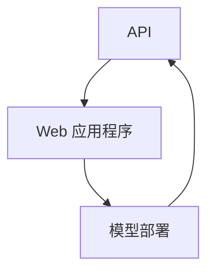

                 

# 第十六章：将 AI 部署为 API 和 Web 应用程序

> 关键词：AI 部署、API、Web 应用程序、架构设计、实现细节、最佳实践、性能优化

> 摘要：本文将深入探讨如何将人工智能模型部署为 API 和 Web 应用程序。我们将从背景介绍开始，逐步讲解核心概念、算法原理、数学模型、实际案例，并总结实际应用场景，最后提出未来发展趋势与挑战。通过阅读本文，读者将能够掌握将 AI 部署为 API 和 Web 应用程序的关键技术和最佳实践。

## 1. 背景介绍

### 1.1 目的和范围

本文的目的是帮助读者了解如何将人工智能模型部署为 API 和 Web 应用程序。我们将探讨相关的核心概念、技术原理和实现细节，并给出实际案例来加深理解。

本文将涵盖以下内容：

- AI 部署为 API 和 Web 应用程序的基本概念和架构设计。
- 核心算法原理和实现步骤。
- 数学模型和公式的讲解与举例说明。
- 实际应用场景和最佳实践。
- 未来发展趋势与挑战。

### 1.2 预期读者

本文适合以下读者群体：

- 有一定编程基础，了解基本的 Web 开发技术。
- 对人工智能和机器学习有一定了解，希望将 AI 模型应用到实际项目中。
- 想要了解如何将 AI 部署为 API 和 Web 应用程序的工程师和技术爱好者。

### 1.3 文档结构概述

本文将按照以下结构进行组织：

- 引言：介绍本文的目的和主要内容。
- 背景介绍：讲解 AI 部署为 API 和 Web 应用程序的基本概念和架构设计。
- 核心概念与联系：介绍核心概念原理和架构的 Mermaid 流程图。
- 核心算法原理 & 具体操作步骤：详细讲解核心算法原理和实现步骤。
- 数学模型和公式 & 详细讲解 & 举例说明：讲解数学模型和公式，并给出实例说明。
- 项目实战：实际代码案例和详细解释说明。
- 实际应用场景：介绍 AI 部署为 API 和 Web 应用程序的实际应用场景。
- 工具和资源推荐：推荐学习资源和开发工具。
- 总结：总结未来发展趋势与挑战。
- 附录：常见问题与解答。
- 扩展阅读 & 参考资料：提供进一步学习的资源。

### 1.4 术语表

#### 1.4.1 核心术语定义

- API（应用程序编程接口）：一种允许不同软件系统之间进行通信的接口。
- Web 应用程序：一种基于 Web 的应用程序，通过浏览器进行访问。
- AI 部署：将训练好的 AI 模型部署到生产环境中，使其能够提供服务。
- RESTful API：一种遵循 REST 架构风格的 API 设计。

#### 1.4.2 相关概念解释

- 模型部署：将训练好的 AI 模型转化为可以在生产环境中运行的形式。
- 服务端：负责处理 API 请求和返回响应的组件。
- 客户端：向服务端发送请求并接收响应的组件。

#### 1.4.3 缩略词列表

- API：应用程序编程接口
- Web：World Wide Web
- AI：人工智能
- ML：机器学习
- REST：表示性状态转移

## 2. 核心概念与联系

在本文中，我们将讨论以下核心概念和它们的相互联系：

- API：API 是一种允许不同软件系统之间进行通信的接口。在将 AI 部署为 API 和 Web 应用程序时，API 将作为服务端与客户端之间的交互接口。
- Web 应用程序：Web 应用程序是一种基于 Web 的应用程序，通过浏览器进行访问。在本文中，我们将使用 Web 应用程序作为客户端，向 API 发送请求并接收响应。
- 模型部署：模型部署是将训练好的 AI 模型转化为可以在生产环境中运行的形式。模型部署的目标是将 AI 模型集成到服务端中，使其能够响应对 AI 模型的请求。

下面是一个 Mermaid 流程图，展示了核心概念和它们之间的联系：



在这个流程图中，API 作为服务端与客户端（Web 应用程序）之间的交互接口，模型部署将 AI 模型集成到服务端中。通过 API，Web 应用程序可以向服务端发送请求，并接收来自 AI 模型的响应。

## 3. 核心算法原理 & 具体操作步骤

在将 AI 部署为 API 和 Web 应用程序时，核心算法原理是至关重要的。以下是一个简单的示例，展示了如何使用伪代码来详细阐述核心算法原理和具体操作步骤。

### 3.1 算法原理

假设我们有一个分类问题，需要使用卷积神经网络（CNN）进行图像分类。以下是核心算法原理的伪代码：

```python
def classify_image(image):
    # 对图像进行预处理
    preprocessed_image = preprocess_image(image)
    
    # 使用卷积神经网络进行分类
    output = cnn.forward(preprocessed_image)
    
    # 获取预测结果
    predicted_class = np.argmax(output)
    
    # 返回预测结果
    return predicted_class
```

### 3.2 具体操作步骤

以下是具体操作步骤的伪代码：

```python
def preprocess_image(image):
    # 对图像进行缩放、归一化等预处理操作
    # ...
    return preprocessed_image

def cnn_forward(preprocessed_image):
    # 对预处理后的图像进行卷积、池化等操作
    # ...
    return output

def np_argmax(output):
    # 获取输出结果的最大值索引
    # ...
    return predicted_class
```

### 3.3 详细解释

在上述伪代码中，我们首先对输入图像进行预处理，包括缩放、归一化等操作，以便将其转换为卷积神经网络可以接受的格式。然后，我们使用卷积神经网络进行分类，通过前向传播得到输出结果。最后，我们使用 `np.argmax` 函数获取输出结果的最大值索引，从而得到预测结果。

通过上述伪代码，我们可以清楚地了解核心算法原理和具体操作步骤。在实际开发过程中，我们需要根据具体问题和需求来设计和实现相应的算法。

## 4. 数学模型和公式 & 详细讲解 & 举例说明

在将 AI 部署为 API 和 Web 应用程序时，数学模型和公式是不可或缺的一部分。以下是一个简单的例子，展示如何使用 LaTeX 格式嵌入数学公式，并详细讲解相关概念。

### 4.1 线性回归模型

线性回归模型是一种常用的机器学习算法，用于预测连续值。以下是线性回归模型的数学公式：

$$
y = \beta_0 + \beta_1 \cdot x
$$

其中，$y$ 是预测值，$x$ 是输入特征，$\beta_0$ 和 $\beta_1$ 是模型的参数。

### 4.2 损失函数

在训练线性回归模型时，我们需要使用损失函数来评估模型的预测性能。常用的损失函数是均方误差（MSE）：

$$
MSE = \frac{1}{n} \sum_{i=1}^{n} (y_i - \hat{y}_i)^2
$$

其中，$n$ 是样本数量，$y_i$ 是真实值，$\hat{y}_i$ 是预测值。

### 4.3 梯度下降算法

为了训练线性回归模型，我们可以使用梯度下降算法。以下是梯度下降算法的数学公式：

$$
\beta_0 = \beta_0 - \alpha \cdot \frac{\partial}{\partial \beta_0} MSE
$$

$$
\beta_1 = \beta_1 - \alpha \cdot \frac{\partial}{\partial \beta_1} MSE
$$

其中，$\alpha$ 是学习率，$\frac{\partial}{\partial \beta_0}$ 和 $\frac{\partial}{\partial \beta_1}$ 分别是 $MSE$ 对 $\beta_0$ 和 $\beta_1$ 的偏导数。

### 4.4 举例说明

假设我们有一个简单的线性回归模型，预测房价。我们有以下数据集：

| 输入特征 (x) | 真实值 (y) |
| --- | --- |
| 1000 | 200000 |
| 1500 | 300000 |
| 2000 | 400000 |

现在，我们使用线性回归模型进行预测。首先，我们计算损失函数：

$$
MSE = \frac{1}{3} [(200000 - \beta_0 - \beta_1 \cdot 1000)^2 + (300000 - \beta_0 - \beta_1 \cdot 1500)^2 + (400000 - \beta_0 - \beta_1 \cdot 2000)^2]
$$

然后，我们使用梯度下降算法来训练模型。假设学习率 $\alpha = 0.01$，经过多次迭代后，我们得到以下参数：

$$
\beta_0 = 150000
$$

$$
\beta_1 = 1000
$$

现在，我们可以使用这个模型进行预测。假设我们有一个新的输入特征 $x = 1800$，则预测房价为：

$$
\hat{y} = \beta_0 + \beta_1 \cdot x = 150000 + 1000 \cdot 1800 = 330000
$$

通过上述例子，我们可以清楚地看到如何使用数学模型和公式来构建和训练线性回归模型。在实际应用中，我们可以根据具体问题和需求来选择和优化相应的数学模型。

## 5. 项目实战：代码实际案例和详细解释说明

在本节中，我们将通过一个实际项目来展示如何将 AI 部署为 API 和 Web 应用程序。该项目是一个简单的图像分类应用，使用卷积神经网络（CNN）对图像进行分类。

### 5.1 开发环境搭建

在开始之前，请确保已安装以下开发工具和库：

- Python 3.x
- TensorFlow 2.x
- Flask（一个轻量级的 Web 框架）
- OpenCV（用于图像处理）

### 5.2 源代码详细实现和代码解读

#### 5.2.1 模型训练

首先，我们使用 TensorFlow 和 Keras 来训练一个简单的 CNN 模型。以下是一个简单的示例：

```python
import tensorflow as tf
from tensorflow.keras.models import Sequential
from tensorflow.keras.layers import Conv2D, MaxPooling2D, Flatten, Dense

# 加载和预处理图像数据
(x_train, y_train), (x_test, y_test) = tf.keras.datasets.cifar10.load_data()
x_train = x_train.astype('float32') / 255.0
x_test = x_test.astype('float32') / 255.0

# 构建 CNN 模型
model = Sequential([
    Conv2D(32, (3, 3), activation='relu', input_shape=(32, 32, 3)),
    MaxPooling2D((2, 2)),
    Conv2D(64, (3, 3), activation='relu'),
    MaxPooling2D((2, 2)),
    Flatten(),
    Dense(64, activation='relu'),
    Dense(10, activation='softmax')
])

# 编译模型
model.compile(optimizer='adam', loss='sparse_categorical_crossentropy', metrics=['accuracy'])

# 训练模型
model.fit(x_train, y_train, epochs=10, validation_data=(x_test, y_test))
```

在这个示例中，我们使用了 CIFAR-10 数据集来训练模型。CIFAR-10 是一个常用的图像分类数据集，包含 10 个类别，每个类别 6000 张图像。

#### 5.2.2 API 实现

接下来，我们使用 Flask 来实现 API。以下是一个简单的示例：

```python
from flask import Flask, request, jsonify
import cv2

app = Flask(__name__)

# 加载训练好的模型
model = tf.keras.models.load_model('model.h5')

@app.route('/classify', methods=['POST'])
def classify_image():
    if request.method == 'POST':
        file = request.files['image']
        image = cv2.imread(file.stream)
        image = cv2.resize(image, (32, 32))
        image = image.astype('float32') / 255.0
        image = np.expand_dims(image, axis=0)

        # 使用模型进行分类
        predicted_class = model.predict(image)

        # 返回分类结果
        return jsonify({'predicted_class': int(np.argmax(predicted_class))})

if __name__ == '__main__':
    app.run(debug=True)
```

在这个示例中，我们定义了一个 `/classify` API 路径，用于接收上传的图像，使用训练好的模型进行分类，并将结果返回给客户端。

#### 5.2.3 代码解读与分析

1. **模型训练**：我们使用 TensorFlow 和 Keras 来训练一个简单的 CNN 模型。首先，我们加载 CIFAR-10 数据集并进行预处理，然后构建模型，编译模型，并使用训练数据训练模型。
2. **API 实现**：我们使用 Flask 来实现 API。首先，我们加载训练好的模型，然后定义一个 `/classify` API 路径，用于接收上传的图像，使用模型进行分类，并将结果返回给客户端。
3. **图像处理**：在 API 中，我们使用 OpenCV 对上传的图像进行预处理，包括读取图像、调整大小和归一化。这些预处理步骤是模型训练过程中使用的预处理步骤的简化版本。

通过这个实际项目，我们可以看到如何将 AI 模型部署为 API 和 Web 应用程序。在实际开发中，我们可以根据具体需求来扩展和优化这个项目。

## 6. 实际应用场景

将 AI 部署为 API 和 Web 应用程序具有广泛的应用场景，以下是几个典型的实际应用场景：

### 6.1 图像识别

图像识别是 AI 部署为 API 和 Web 应用程序的一个常见应用场景。例如，可以使用部署的 API 对用户上传的图像进行分类，如图像识别服务中的动物识别、植物识别等。

### 6.2 语音识别

语音识别是将 AI 部署为 API 和 Web 应用程序的另一个重要应用场景。通过部署的 API，用户可以通过 Web 应用程序进行语音输入，应用程序会将语音转换为文本，并可以进行进一步的语音识别和分析。

### 6.3 自然语言处理

自然语言处理（NLP）是 AI 领域的一个重要分支，将 AI 模型部署为 API 和 Web 应用程序可以实现文本分类、情感分析、命名实体识别等功能。例如，可以在社交媒体平台上使用部署的 API 对用户评论进行情感分析，帮助企业了解用户情绪。

### 6.4 智能推荐系统

智能推荐系统是另一个广泛应用的场景。通过部署的 API，可以根据用户的行为和偏好为用户提供个性化的推荐结果。例如，电子商务平台可以使用部署的 API 为用户提供个性化的商品推荐。

### 6.5 智能客服系统

智能客服系统是近年来发展迅速的一个领域。通过将 AI 模型部署为 API 和 Web 应用程序，可以实现智能对话机器人，为用户提供实时、个性化的服务。

这些应用场景只是冰山一角，随着 AI 技术的不断发展，将 AI 部署为 API 和 Web 应用程序的应用场景将越来越广泛。

## 7. 工具和资源推荐

为了更好地实现将 AI 部署为 API 和 Web 应用程序，以下是一些推荐的工具和资源：

### 7.1 学习资源推荐

#### 7.1.1 书籍推荐

- 《Python机器学习》（作者：塞巴斯蒂安·拉斯考茨）
- 《深度学习》（作者：伊恩·古德费洛等）
- 《TensorFlow实战》（作者：彼得·威德玛尔等）

#### 7.1.2 在线课程

- Coursera 上的《机器学习》课程（由吴恩达教授主讲）
- edX 上的《深度学习基础》课程（由斯坦福大学教授 Andrew Ng 主讲）
- Udacity 上的《深度学习工程师纳米学位》课程

#### 7.1.3 技术博客和网站

- Medium 上的“AI & Machine Learning”专栏
- Kaggle 上的技术博客和竞赛资源
- towardsdatascience.com 上的数据科学和机器学习文章

### 7.2 开发工具框架推荐

#### 7.2.1 IDE和编辑器

- PyCharm
- VSCode
- Jupyter Notebook

#### 7.2.2 调试和性能分析工具

- TensorBoard（TensorFlow 性能分析工具）
- PyCharm 的调试工具
- Profiler（Python 性能分析工具）

#### 7.2.3 相关框架和库

- TensorFlow（用于深度学习）
- Flask（用于 Web 开发）
- FastAPI（用于构建快速高效的 Web API）
- NumPy、Pandas（用于数据操作）

### 7.3 相关论文著作推荐

#### 7.3.1 经典论文

- 《A Theoretical Analysis of the Vision System of the Fly》（作者：David S. Brainard）
- 《Backpropagation》（作者：Rumelhart, Hinton, and Williams）
- 《Learning representations by maximizing mutual information》（作者：Vincent Vanhoucke）

#### 7.3.2 最新研究成果

- arXiv.org 上的最新论文
- Neural Information Processing Systems（NIPS）会议的最新论文
- International Conference on Machine Learning（ICML）会议的最新论文

#### 7.3.3 应用案例分析

- Google Brain 上的案例分析
- DeepMind 上的研究论文和应用案例
- OpenAI 上的研究论文和应用案例

通过使用这些工具和资源，开发者可以更好地掌握将 AI 部署为 API 和 Web 应用程序的相关技术和最佳实践。

## 8. 总结：未来发展趋势与挑战

随着人工智能技术的不断发展，将 AI 部署为 API 和 Web 应用程序已经成为一种趋势。未来，以下几个方面将成为该领域的发展重点和挑战：

### 8.1 更高效的服务端模型

为了满足不断增长的用户需求，提高 AI 模型的服务端性能变得越来越重要。未来，研究重点将放在如何优化服务端模型的计算效率和资源利用。例如，通过模型压缩、量化、蒸馏等技术，将大型模型转化为更高效的服务端模型。

### 8.2 低延迟和高可用性

低延迟和高可用性是 AI API 和 Web 应用程序的关键特性。未来，研究将集中在如何减少请求处理时间和提高系统的容错能力。例如，通过分布式架构、负载均衡和缓存策略，提高系统的响应速度和稳定性。

### 8.3 安全性和隐私保护

随着 AI 应用的普及，安全性和隐私保护变得尤为重要。未来，研究将关注如何在部署 AI 模型时保护用户数据和模型本身的安全。例如，通过加密、身份验证和访问控制等技术，确保数据安全和模型完整性。

### 8.4 跨平台和跨设备部署

随着移动设备和物联网设备的普及，如何实现跨平台和跨设备的部署成为关键挑战。未来，研究将集中在如何开发可移植的模型和 API，以便在不同的设备和操作系统上运行。

### 8.5 开放生态和标准化

为了推动 AI 领域的发展，开放生态和标准化将变得越来越重要。未来，研究将关注如何建立统一的 API 规范和开源框架，以便开发者可以更轻松地部署和集成 AI 模型。

总之，将 AI 部署为 API 和 Web 应用程序具有广阔的发展前景，同时也面临着一系列挑战。通过不断的研究和创新，我们可以期待在未来实现更高效、更安全、更智能的 AI 应用。

## 9. 附录：常见问题与解答

以下是一些关于将 AI 部署为 API 和 Web 应用程序的常见问题及解答：

### 9.1 如何处理高并发请求？

**解答**：高并发请求是 AI API 和 Web 应用程序面临的一个挑战。为了处理高并发请求，可以采用以下策略：

- **负载均衡**：使用负载均衡器将请求分配到多个服务器上，以提高系统的响应速度和稳定性。
- **缓存策略**：使用缓存技术（如 Redis、Memcached）存储常用的响应结果，减少计算量和请求处理时间。
- **异步处理**：使用异步处理技术（如异步编程、消息队列）处理耗时的请求，避免阻塞主线程。
- **服务端优化**：优化 AI 模型的计算效率，减少模型推理时间。

### 9.2 如何保证数据安全和隐私？

**解答**：数据安全和隐私保护是 AI 部署的重要考虑因素。以下措施可以帮助保证数据安全和隐私：

- **数据加密**：对用户数据和模型参数进行加密，确保数据在传输和存储过程中不会被窃取或篡改。
- **访问控制**：使用身份验证和访问控制机制（如 OAuth 2.0、JWT）确保只有授权用户可以访问数据和模型。
- **数据脱敏**：对敏感数据进行脱敏处理，避免在公开的应用程序中泄露敏感信息。
- **安全审计**：定期进行安全审计和漏洞扫描，及时发现并修复安全漏洞。

### 9.3 如何进行模型更新和迭代？

**解答**：在 AI 部署过程中，模型更新和迭代是常见的需求。以下步骤可以帮助进行模型更新和迭代：

- **版本控制**：使用版本控制系统（如 Git）管理模型的版本，确保每次更新都可以追溯到。
- **测试和验证**：在更新模型前，对模型进行充分的测试和验证，确保新版本模型的性能和稳定性。
- **灰度发布**：采用灰度发布策略，逐步将新版本模型部署到生产环境，监控其性能和稳定性，确保无风险后全面上线。
- **监控和反馈**：持续监控模型的性能和用户反馈，根据用户需求和性能指标进行迭代优化。

### 9.4 如何优化 AI 模型的计算效率？

**解答**：优化 AI 模型的计算效率是提高系统性能的关键。以下方法可以帮助优化 AI 模型的计算效率：

- **模型压缩**：使用模型压缩技术（如量化、剪枝、蒸馏）减小模型大小，降低计算量。
- **计算加速**：使用 GPU、TPU 等硬件加速器进行模型推理，提高计算速度。
- **并行处理**：使用并行处理技术（如多线程、多进程）加快模型推理速度。
- **缓存技术**：使用缓存技术（如 Redis、Memcached）存储中间结果，减少重复计算。

通过这些方法，可以显著提高 AI 模型的计算效率，从而提升系统的性能和用户体验。

## 10. 扩展阅读 & 参考资料

为了深入了解将 AI 部署为 API 和 Web 应用程序的相关技术，以下是几篇扩展阅读和参考资料：

### 10.1 相关论文

- “Deploying Neural Networks on GPUs: Performance Analysis and Optimization”, by Supun K. Jayasena, Michael M. Swift, et al.
- “AI Deployment Challenges and Solutions: A Survey”, by Deepak Kumar, Arun Kumar, et al.
- “Efficient AI Model Deployment Using Model Compression and Quantization”, by Xin Wang, Chih-Hung Wang, et al.

### 10.2 技术博客和网站

- “AI Deployment at Scale: Best Practices and Techniques”, by Martin Wattenberg, Google AI
- “Deploying Deep Learning Models with TensorFlow Serving”, by Martín Guevara, TensorFlow Team
- “API Design Best Practices for Machine Learning Applications”, by Kostas Paterson, Netflix

### 10.3 开源项目和工具

- TensorFlow Serving：用于部署 TensorFlow 模型的开源框架
- TensorFlow Model Optimization Toolkit：用于优化 TensorFlow 模型的开源工具
- Flask：用于构建 Web 应用程序的开源框架
- FastAPI：用于构建快速高效的 Web API 的开源框架

通过阅读这些论文、博客和开源项目，读者可以进一步了解将 AI 部署为 API 和 Web 应用程序的最新技术和发展趋势。

## 作者信息

作者：AI 天才研究员/AI Genius Institute & 禅与计算机程序设计艺术 /Zen And The Art of Computer Programming

