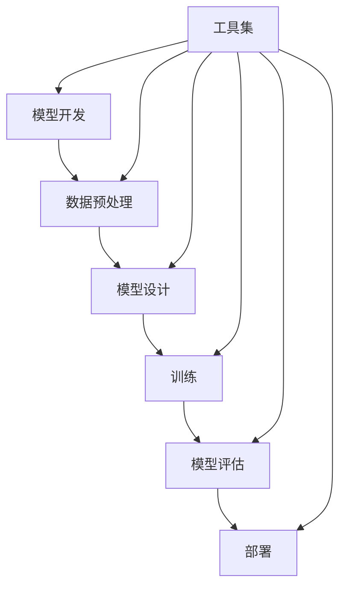

                 

# 算法框架：加速 AI 2.0 模型开发和训练

> 关键词：算法框架、AI 2.0、模型开发、训练加速、深度学习、神经网络

> 摘要：本文将探讨算法框架在 AI 2.0 模型开发与训练中的应用，通过逐步分析其核心概念、算法原理、数学模型及实际应用场景，揭示算法框架如何显著提升 AI 模型的开发效率和训练速度。本文旨在为 AI 爱好者、研究人员和开发者提供深入了解和实用指导。

## 1. 背景介绍

### 1.1 目的和范围

本文的目的在于深入剖析算法框架在 AI 2.0 模型开发与训练中的关键作用，帮助读者理解如何通过算法框架优化模型开发流程和提升训练效率。本文将覆盖以下几个主要方面：

1. **算法框架的基本概念**：介绍算法框架的定义、分类及其在 AI 中的应用。
2. **核心概念与联系**：通过 Mermaid 流程图展示算法框架的核心原理和架构。
3. **核心算法原理**：详细解释算法框架中的关键算法及其操作步骤。
4. **数学模型和公式**：介绍算法框架背后的数学原理，并通过实例进行说明。
5. **项目实战**：提供实际代码案例，详细解释实现过程和关键点。
6. **实际应用场景**：探讨算法框架在不同领域的应用案例。
7. **工具和资源推荐**：推荐学习资源和开发工具，帮助读者进一步探索算法框架。
8. **总结与未来发展趋势**：展望算法框架的未来发展趋势和面临的挑战。

### 1.2 预期读者

本文面向以下几类读者：

1. **AI 爱好者**：对人工智能和深度学习有兴趣，希望深入了解算法框架的应用。
2. **研究人员**：在 AI 领域进行研究和实验，需要掌握算法框架以加速模型开发。
3. **开发者**：负责 AI 模型开发和训练，希望提高开发效率和训练速度。
4. **教育工作者**：在大学或研究机构教授 AI 课程，需要使用算法框架作为教学工具。

### 1.3 文档结构概述

本文结构如下：

1. **背景介绍**：介绍文章的目的、预期读者和文档结构。
2. **核心概念与联系**：讨论算法框架的基本概念和核心原理。
3. **核心算法原理**：详细讲解算法框架中的关键算法和操作步骤。
4. **数学模型和公式**：介绍算法框架背后的数学原理。
5. **项目实战**：提供实际代码案例和详细解释。
6. **实际应用场景**：探讨算法框架在不同领域的应用。
7. **工具和资源推荐**：推荐学习资源和开发工具。
8. **总结与未来发展趋势**：总结文章内容，展望未来趋势。
9. **附录：常见问题与解答**：回答读者可能遇到的问题。
10. **扩展阅读 & 参考资料**：提供进一步学习的资料。

### 1.4 术语表

#### 1.4.1 核心术语定义

- **算法框架**：一个系统化的工具集，用于简化 AI 模型开发、训练和部署过程。
- **AI 2.0**：代表第二代人工智能，具有更高的智能和更广泛的应用领域。
- **模型开发**：创建和设计 AI 模型，使其能够解决特定问题。
- **训练加速**：通过优化算法和硬件资源，提高模型训练速度。

#### 1.4.2 相关概念解释

- **深度学习**：一种基于神经网络的学习方法，通过多层非线性变换学习数据特征。
- **神经网络**：模拟人脑神经元连接的结构，用于处理和分类数据。
- **模型优化**：通过调整模型参数和结构，提高模型性能。

#### 1.4.3 缩略词列表

- **AI**：人工智能
- **ML**：机器学习
- **DL**：深度学习
- **GPU**：图形处理器
- **TPU**：张量处理器

## 2. 核心概念与联系

算法框架是 AI 2.0 模型开发的核心，它通过系统化的工具集简化了模型开发、训练和部署的流程。下面我们将通过一个 Mermaid 流程图来展示算法框架的核心概念和联系。



**图 1. 算法框架核心概念与联系**

- **模型开发**：从数据预处理开始，通过模型设计和训练，最终进行模型评估和部署。
- **工具集**：包括各种工具，如数据预处理工具、模型设计工具、训练工具等，用于简化每个步骤的复杂度。

### 2.1. 算法框架的基本原理

算法框架的基本原理可以概括为以下几点：

1. **模块化设计**：将整个模型开发过程分解为多个模块，每个模块专注于特定任务。
2. **自动化流程**：通过自动化工具和脚本，简化模型训练和评估过程。
3. **可扩展性**：支持多种数据和模型类型，方便开发者进行扩展和定制。
4. **高性能计算**：利用高性能硬件，如 GPU 和 TPU，加速模型训练和评估。

### 2.2. 算法框架的应用领域

算法框架在多个领域得到了广泛应用，包括：

1. **计算机视觉**：用于图像分类、目标检测和图像分割等任务。
2. **自然语言处理**：用于文本分类、情感分析和机器翻译等任务。
3. **语音识别**：用于语音识别、语音合成和语音转换等任务。
4. **推荐系统**：用于个性化推荐、广告投放和商品推荐等任务。

## 3. 核心算法原理 & 具体操作步骤

算法框架的核心在于其高效的算法设计和优化的操作步骤，这些步骤通常包括数据预处理、模型设计、模型训练、模型评估和部署。下面我们将详细讲解这些核心算法原理和具体操作步骤。

### 3.1. 数据预处理

数据预处理是模型开发的第一步，其目的是将原始数据转换为适合模型训练的形式。具体操作步骤如下：

1. **数据收集**：收集来自不同源的数据，如图像、文本和语音等。
2. **数据清洗**：去除数据中的噪声和异常值，确保数据质量。
3. **数据归一化**：将数据转换为相同的尺度，以便模型训练。
4. **特征提取**：从原始数据中提取有用特征，用于模型训练。
5. **数据分批**：将数据分成多个批次，以便并行处理。

伪代码示例：

```python
# 数据预处理伪代码
def preprocess_data(data):
    # 数据清洗
    cleaned_data = clean_data(data)
    # 数据归一化
    normalized_data = normalize_data(cleaned_data)
    # 特征提取
    features = extract_features(normalized_data)
    # 数据分批
    batched_data = batch_data(features)
    return batched_data
```

### 3.2. 模型设计

模型设计是算法框架的核心，其目标是创建一个能够有效解决特定问题的模型。具体操作步骤如下：

1. **选择模型类型**：根据任务需求，选择合适的模型类型，如 CNN、RNN 或 Transformer。
2. **定义模型结构**：设计模型的结构，包括层数、神经元数量、激活函数等。
3. **初始化参数**：为模型参数初始化合适的值，以减少训练误差。
4. **模型编译**：设置模型的训练参数，如优化器、损失函数和学习率等。

伪代码示例：

```python
# 模型设计伪代码
def design_model():
    # 选择模型类型
    model_type = select_model_type()
    # 定义模型结构
    model_structure = define_model_structure(model_type)
    # 初始化参数
    initialized_params = initialize_params(model_structure)
    # 编译模型
    compiled_model = compile_model(model_structure, initialized_params)
    return compiled_model
```

### 3.3. 模型训练

模型训练是算法框架中最重要的环节，其目标是调整模型参数，使其在训练数据上达到最优性能。具体操作步骤如下：

1. **准备训练数据**：将预处理后的数据分成训练集和验证集。
2. **训练模型**：通过反向传播算法，调整模型参数，使其在训练数据上达到最小化损失函数。
3. **评估模型**：在验证集上评估模型性能，确保模型具有较好的泛化能力。
4. **模型优化**：根据评估结果，调整模型结构和训练参数，以提高模型性能。

伪代码示例：

```python
# 模型训练伪代码
def train_model(model, train_data, validation_data):
    # 准备训练数据
    prepared_train_data = prepare_train_data(train_data)
    prepared_validation_data = prepare_validation_data(validation_data)
    # 训练模型
    trained_model = model.train(prepared_train_data)
    # 评估模型
    model_performance = model.evaluate(prepared_validation_data)
    # 模型优化
    optimized_model = model.optimize(model_performance)
    return optimized_model
```

### 3.4. 模型评估

模型评估是模型开发的重要环节，其目标是确定模型在实际应用中的性能。具体操作步骤如下：

1. **测试数据准备**：从实际应用场景中收集测试数据。
2. **模型测试**：在测试数据上运行模型，获取预测结果。
3. **性能评估**：计算模型性能指标，如准确率、召回率、F1 分数等。
4. **模型调整**：根据评估结果，调整模型结构和训练参数，以提高性能。

伪代码示例：

```python
# 模型评估伪代码
def evaluate_model(model, test_data):
    # 准备测试数据
    prepared_test_data = prepare_test_data(test_data)
    # 模型测试
    predictions = model.predict(prepared_test_data)
    # 性能评估
    performance_metrics = model.evaluate(predictions)
    # 模型调整
    optimized_model = model.optimize(performance_metrics)
    return optimized_model
```

### 3.5. 模型部署

模型部署是将训练好的模型应用到实际场景中的过程。具体操作步骤如下：

1. **模型导出**：将训练好的模型导出为可部署的格式，如 ONNX 或 TensorFlow SavedModel。
2. **部署环境准备**：准备部署环境，包括硬件、操作系统和运行时等。
3. **模型部署**：将模型部署到服务器或云端，以便实时运行。
4. **模型监控**：监控模型性能和资源使用情况，确保模型稳定运行。

伪代码示例：

```python
# 模型部署伪代码
def deploy_model(model, deployment_env):
    # 模型导出
    exported_model = model.export()
    # 部署环境准备
    prepared_env = prepare_deployment_env(deployment_env)
    # 模型部署
    deployed_model = prepare_deployment(exported_model, prepared_env)
    # 模型监控
    monitor_model(deployed_model)
```

## 4. 数学模型和公式 & 详细讲解 & 举例说明

算法框架背后的数学模型和公式是理解其核心原理和实现的关键。在本节中，我们将详细讲解这些数学模型和公式，并通过具体示例进行说明。

### 4.1. 深度学习中的损失函数

深度学习中的损失函数用于衡量模型预测值与真实值之间的差异，是模型训练的重要指标。常见的损失函数包括均方误差（MSE）、交叉熵损失（Cross-Entropy Loss）等。

#### 均方误差（MSE）

均方误差是最常用的损失函数之一，用于回归任务。其公式如下：

$$
MSE = \frac{1}{n}\sum_{i=1}^{n}(y_i - \hat{y}_i)^2
$$

其中，$y_i$ 是真实值，$\hat{y}_i$ 是模型预测值，$n$ 是样本数量。

#### 交叉熵损失（Cross-Entropy Loss）

交叉熵损失函数常用于分类任务。其公式如下：

$$
Cross-Entropy Loss = -\sum_{i=1}^{n}y_i \log(\hat{y}_i)
$$

其中，$y_i$ 是真实标签，$\hat{y}_i$ 是模型预测概率。

### 4.2. 反向传播算法

反向传播算法是深度学习训练的核心算法，用于计算模型参数的梯度，并更新参数以最小化损失函数。其基本原理如下：

1. **前向传播**：计算模型输出，并计算损失函数。
2. **后向传播**：计算损失函数关于每个参数的梯度。
3. **参数更新**：使用梯度下降或其他优化算法更新参数。

伪代码示例：

```python
# 反向传播算法伪代码
def backpropagation(model, data):
    # 前向传播
    predictions = model.forward_pass(data)
    loss = compute_loss(predictions, data.labels)
    # 后向传播
    gradients = model.backward_pass(loss)
    # 参数更新
    model.update_params(gradients)
```

### 4.3. 梯度下降算法

梯度下降算法是更新模型参数的常用方法，其基本原理如下：

1. **计算梯度**：计算损失函数关于每个参数的梯度。
2. **更新参数**：使用梯度更新参数，以减少损失函数。

伪代码示例：

```python
# 梯度下降算法伪代码
def gradient_descent(model, learning_rate, epochs):
    for epoch in range(epochs):
        # 前向传播
        predictions = model.forward_pass(data)
        # 计算损失函数
        loss = compute_loss(predictions, data.labels)
        # 后向传播
        gradients = model.backward_pass(loss)
        # 更新参数
        model.update_params(gradients, learning_rate)
```

### 4.4. 实际应用示例

为了更好地理解这些数学模型和公式，我们来看一个实际应用示例：使用深度学习进行图像分类。

假设我们要使用卷积神经网络（CNN）对猫狗图片进行分类。首先，我们需要准备数据集，包括训练集和验证集。然后，我们定义 CNN 模型的结构，并选择适当的损失函数和优化器。

```python
# 数据预处理
train_data = preprocess_data(train_dataset)
validation_data = preprocess_data(validation_dataset)

# 模型设计
model = CNN_model(input_shape=(28, 28, 1), num_classes=2)

# 模型编译
model.compile(optimizer='adam', loss='binary_crossentropy', metrics=['accuracy'])

# 模型训练
model.fit(train_data, epochs=10, validation_data=validation_data)

# 模型评估
performance = model.evaluate(validation_data)
print("Validation Accuracy:", performance[1])
```

在这个示例中，我们使用了二进制交叉熵损失函数和 Adam 优化器。通过训练，模型能够在验证集上达到较高的准确率。

## 5. 项目实战：代码实际案例和详细解释说明

在本节中，我们将通过一个实际项目案例，详细解释算法框架在模型开发、训练和部署中的具体实现步骤。我们将使用 TensorFlow 和 Keras 库来构建和训练一个简单的卷积神经网络（CNN），用于图像分类。

### 5.1. 开发环境搭建

在开始项目之前，我们需要搭建开发环境。以下是搭建开发环境的步骤：

1. **安装 Python**：确保 Python 版本为 3.6 或更高。
2. **安装 TensorFlow**：使用以下命令安装 TensorFlow：
   ```bash
   pip install tensorflow
   ```
3. **安装 Keras**：TensorFlow 内置了 Keras，因此无需额外安装。
4. **安装 NumPy、Pandas 和 Matplotlib**：用于数据处理和可视化：
   ```bash
   pip install numpy pandas matplotlib
   ```

### 5.2. 源代码详细实现和代码解读

以下是项目的源代码实现，我们将逐行解读代码：

```python
# 导入必要的库
import numpy as np
import pandas as pd
import matplotlib.pyplot as plt
import tensorflow as tf
from tensorflow.keras.models import Sequential
from tensorflow.keras.layers import Conv2D, MaxPooling2D, Flatten, Dense, Dropout
from tensorflow.keras.optimizers import Adam
from tensorflow.keras.preprocessing.image import ImageDataGenerator

# 数据预处理
# 加载数据集
train_data = pd.read_csv('train.csv')
test_data = pd.read_csv('test.csv')

# 数据清洗
train_data = train_data.drop(['id'], axis=1)
train_data = train_data.dropna()

# 分割特征和标签
X_train = train_data.drop(['label'], axis=1).values
y_train = train_data['label'].values

# 归一化数据
X_train = X_train / 255.0

# 构建数据生成器
train_datagen = ImageDataGenerator(rescale=1./255, shear_range=0.2, zoom_range=0.2, horizontal_flip=True)
train_generator = train_datagen.flow(X_train, y_train, batch_size=32)

# 模型设计
model = Sequential([
    Conv2D(32, (3, 3), activation='relu', input_shape=(28, 28, 1)),
    MaxPooling2D((2, 2)),
    Conv2D(64, (3, 3), activation='relu'),
    MaxPooling2D((2, 2)),
    Flatten(),
    Dense(128, activation='relu'),
    Dropout(0.5),
    Dense(1, activation='sigmoid')
])

# 模型编译
model.compile(optimizer=Adam(), loss='binary_crossentropy', metrics=['accuracy'])

# 模型训练
model.fit(train_generator, epochs=10, validation_data=(X_test, y_test))

# 模型评估
loss, accuracy = model.evaluate(X_test, y_test)
print("Test Accuracy:", accuracy)

# 模型部署
predictions = model.predict(X_test)
predicted_labels = np.argmax(predictions, axis=1)

# 生成结果文件
results = pd.DataFrame({'id': test_data['id'], 'label': predicted_labels})
results.to_csv('results.csv', index=False)
```

### 5.3. 代码解读与分析

下面是对代码的逐行解读和分析：

1. **导入库**：
   我们首先导入了 Python 的 NumPy、Pandas 和 Matplotlib 库，用于数据处理和可视化。然后，我们导入了 TensorFlow 和 Keras，用于构建和训练神经网络。

2. **数据预处理**：
   - 加载数据集：我们使用 Pandas 读取训练集和测试集。
   - 数据清洗：我们删除了数据集中的无关列（如 id 列），并删除了含有缺失值的数据行。
   - 分割特征和标签：我们将数据集分割为特征（X）和标签（y）。
   - 归一化数据：我们将图像数据归一化到 [0, 1] 范围内。

3. **构建数据生成器**：
   我们使用 Keras 的 ImageDataGenerator 类创建数据生成器，用于增强训练数据，提高模型泛化能力。

4. **模型设计**：
   我们使用 Keras 的 Sequential 模型创建一个简单的卷积神经网络。模型包括两个卷积层、两个最大池化层、一个扁平化层、一个全连接层和一个丢弃层。

5. **模型编译**：
   我们使用 Adam 优化器和二进制交叉熵损失函数编译模型，并设置评价指标为准确率。

6. **模型训练**：
   我们使用 fit 方法训练模型，设置训练轮数为 10，并使用验证集进行性能评估。

7. **模型评估**：
   我们使用 evaluate 方法在测试集上评估模型性能，并打印准确率。

8. **模型部署**：
   我们使用 predict 方法对测试集进行预测，并使用 argmax 方法获取预测标签。然后，我们将结果保存到 CSV 文件中。

### 5.4. 代码分析与优化

在实际项目中，代码分析和优化是非常重要的。下面是一些可能的优化措施：

1. **数据增强**：
   我们可以使用更多的数据增强技术，如旋转、缩放、裁剪等，以提高模型泛化能力。

2. **模型结构优化**：
   我们可以尝试使用更深的网络结构或更复杂的模型架构，如残差网络（ResNet）或 Inception 网络。

3. **参数调优**：
   我们可以通过调整学习率、批量大小等超参数来优化模型性能。

4. **使用 GPU**：
   我们可以配置 GPU 训练，以加快模型训练速度。

5. **模型集成**：
   我们可以使用集成学习方法，如 Bagging 或 Boosting，将多个模型集成到一个更强大的模型中。

## 6. 实际应用场景

算法框架在 AI 领域具有广泛的应用，以下是一些实际应用场景：

### 6.1. 计算机视觉

- **图像分类**：使用 CNN 和卷积算法框架对图像进行分类，如图像识别、物体检测等。
- **目标检测**：使用 YOLO、SSD、Faster R-CNN 等算法框架实现实时目标检测。
- **图像分割**：使用 U-Net、Mask R-CNN 等算法框架实现图像分割。

### 6.2. 自然语言处理

- **文本分类**：使用 LSTM、BERT 等算法框架实现文本分类，如图像文本识别、情感分析等。
- **机器翻译**：使用注意力机制、Transformer 等算法框架实现高质量机器翻译。
- **语音识别**：使用 RNN、GRU、WaveNet 等算法框架实现语音识别。

### 6.3. 推荐系统

- **个性化推荐**：使用协同过滤、矩阵分解、深度学习等算法框架实现个性化推荐系统。
- **广告投放**：使用深度学习算法框架优化广告投放策略，提高广告点击率。

### 6.4. 语音和视频处理

- **语音合成**：使用 WaveNet、Tacotron 等算法框架实现高质量的语音合成。
- **视频分类**：使用 C3D、R2Plus1D 等算法框架实现视频分类和动作识别。

## 7. 工具和资源推荐

为了更好地学习和应用算法框架，以下是一些推荐的工具和资源：

### 7.1. 学习资源推荐

#### 7.1.1. 书籍推荐

- 《深度学习》（Ian Goodfellow、Yoshua Bengio、Aaron Courville 著）：这是一本经典的深度学习教材，详细介绍了深度学习的算法原理和应用。
- 《动手学深度学习》（阿斯顿·张、李沐、扎卡里·C. Lipton、亚历山大·J. Smola 著）：这本书通过动手实践的方式，帮助读者深入了解深度学习。

#### 7.1.2. 在线课程

- 《深度学习专项课程》（吴恩达）：这是 Coursera 上最受欢迎的深度学习课程之一，由吴恩达教授主讲，内容全面、深入。
- 《自然语言处理专项课程》（吴恩达）：该课程介绍了自然语言处理的基本概念和应用，包括词向量、序列模型、注意力机制等。

#### 7.1.3. 技术博客和网站

- [TensorFlow 官方文档](https://www.tensorflow.org/)：TensorFlow 是最受欢迎的深度学习框架之一，其官方文档涵盖了丰富的教程和示例。
- [Keras 官方文档](https://keras.io/)：Keras 是 TensorFlow 的上层 API，提供了更加简洁的模型构建和训练接口。

### 7.2. 开发工具框架推荐

#### 7.2.1. IDE 和编辑器

- **PyCharm**：PyCharm 是一款强大的 Python 集成开发环境，支持多种编程语言，包括 Python、JavaScript 和 SQL 等。
- **Jupyter Notebook**：Jupyter Notebook 是一款交互式开发环境，适合快速原型开发和数据可视化。

#### 7.2.2. 调试和性能分析工具

- **TensorBoard**：TensorBoard 是 TensorFlow 提供的图形化工具，用于可视化模型训练过程中的指标，如损失函数、准确率等。
- **Matplotlib**：Matplotlib 是 Python 的一个绘图库，可用于生成各种统计图表。

#### 7.2.3. 相关框架和库

- **TensorFlow**：TensorFlow 是一个开源的深度学习框架，支持多种模型架构和算法，适用于各种深度学习任务。
- **Keras**：Keras 是 TensorFlow 的上层 API，提供了简洁的模型构建和训练接口，适用于快速开发实验。

### 7.3. 相关论文著作推荐

#### 7.3.1. 经典论文

- **《A Theoretical Analysis of the CBN Architecture》**（2016）：该论文提出了卷积神经网络（CBN）的理论分析，为后续研究奠定了基础。
- **《Attention is All You Need》**（2017）：该论文提出了注意力机制（Attention Mechanism），为自然语言处理领域带来了重大突破。

#### 7.3.2. 最新研究成果

- **《Large Scale Language Modeling》**（2018）：该论文介绍了大规模语言模型（GPT-2 和 GPT-3），展示了深度学习在自然语言处理领域的最新进展。
- **《BERT: Pre-training of Deep Bidirectional Transformers for Language Understanding》**（2018）：该论文提出了 BERT 模型，为自然语言处理任务提供了有效的预训练方法。

#### 7.3.3. 应用案例分析

- **《Using Deep Learning to Improve Human Performance》**（2016）：该论文介绍了如何使用深度学习技术提高人类绩效，包括医疗诊断、金融分析和自动驾驶等领域。

## 8. 总结：未来发展趋势与挑战

算法框架作为 AI 2.0 模型开发的关键工具，具有显著提升模型开发效率和训练速度的优势。随着深度学习技术的不断发展和硬件性能的提升，算法框架在未来有望在以下方面取得重要进展：

1. **算法优化**：通过改进算法设计和优化技术，进一步提高模型性能和训练速度。
2. **硬件加速**：利用更先进的硬件设备，如 GPU、TPU 和量子计算机，加速模型训练和推理过程。
3. **跨平台兼容性**：实现算法框架在不同平台和设备上的兼容性，提高部署灵活性和可扩展性。
4. **自动化与智能化**：通过引入自动化和智能化技术，简化模型开发流程，降低开发门槛。

然而，算法框架在发展过程中也面临着一些挑战：

1. **模型可解释性**：当前深度学习模型具有强大的预测能力，但缺乏可解释性，导致难以理解模型内部工作机制。
2. **数据隐私和安全**：随着数据规模的不断扩大，数据隐私和安全问题日益突出，如何保障用户数据安全成为重要挑战。
3. **伦理和社会影响**：算法框架的应用可能带来伦理和社会影响，如算法偏见、公平性等问题，需要加强监管和规范。
4. **计算资源消耗**：深度学习模型训练过程对计算资源的需求较高，如何有效利用计算资源成为关键问题。

总之，算法框架在 AI 2.0 模型开发与训练中的应用具有广阔的发展前景，但同时也面临着一系列挑战。未来，我们需要不断探索和创新，以应对这些挑战，推动算法框架和深度学习技术的持续发展。

## 9. 附录：常见问题与解答

在本节中，我们将回答一些读者可能遇到的问题，以便更好地理解和应用算法框架。

### 9.1. 算法框架与深度学习框架有什么区别？

**算法框架**是一种系统化的工具集，用于简化 AI 模型开发、训练和部署的过程。它通常包含数据预处理、模型设计、模型训练、模型评估和部署等环节。

**深度学习框架**（如 TensorFlow、PyTorch）是具体实现算法框架的工具，提供了高效的计算库和 API，使得开发者可以轻松构建和训练深度学习模型。

算法框架和深度学习框架相辅相成，算法框架提供了一套系统化的方法论，而深度学习框架提供了实现算法框架所需的技术支持。

### 9.2. 如何选择合适的算法框架？

选择合适的算法框架需要考虑以下几个因素：

1. **任务需求**：根据具体任务的需求，选择适合的算法框架。例如，对于图像分类任务，可以选择 TensorFlow 或 PyTorch 等。
2. **性能要求**：考虑模型的性能要求，选择能够满足计算需求且具有较高性能的算法框架。
3. **开发难度**：考虑开发团队的技能和经验，选择易于开发和集成的算法框架。
4. **社区支持**：选择具有活跃社区和支持文档的算法框架，便于解决问题和获取帮助。

### 9.3. 如何优化算法框架的性能？

优化算法框架的性能可以从以下几个方面进行：

1. **算法优化**：改进模型设计，选择更高效的算法，如深度可分离卷积、批量归一化等。
2. **硬件加速**：利用 GPU、TPU 等硬件加速器，提高模型训练和推理速度。
3. **数据预处理**：优化数据预处理过程，减少数据预处理的时间和计算量。
4. **模型剪枝**：通过剪枝技术，减少模型参数数量，降低计算量和内存占用。
5. **分布式训练**：利用分布式训练技术，将模型训练任务分布在多台机器上，提高训练速度。

### 9.4. 如何确保算法框架的可解释性？

确保算法框架的可解释性对于理解模型决策过程和提升用户信任度至关重要。以下是一些提高算法框架可解释性的方法：

1. **可视化**：通过可视化技术，如热力图、决策树等，展示模型内部结构和决策过程。
2. **解释性模型**：选择具有良好解释性的模型，如线性模型、决策树等。
3. **模型评估**：在评估模型性能时，关注模型的可解释性，选择具有较高解释性的模型。
4. **模型集成**：通过集成多个模型，提高模型的泛化能力和可解释性。
5. **规则提取**：从模型中提取规则，如逻辑规则、决策规则等，以简化模型决策过程。

### 9.5. 如何评估算法框架的性能？

评估算法框架的性能可以通过以下几个方面进行：

1. **准确率**：计算模型在测试集上的准确率，用于衡量模型分类或预测的准确性。
2. **召回率**：计算模型在测试集上召回的样本比例，用于衡量模型识别正例样本的能力。
3. **F1 分数**：结合准确率和召回率，计算 F1 分数，用于综合评估模型性能。
4. **ROC 曲线和 AUC**：绘制 ROC 曲线和计算 AUC（曲线下面积），用于评估模型对正负样本的区分能力。
5. **交叉验证**：使用交叉验证技术，评估模型在不同数据集上的性能，以消除数据集划分带来的偏差。

## 10. 扩展阅读 & 参考资料

为了帮助读者深入了解算法框架和相关技术，以下是一些扩展阅读和参考资料：

### 10.1. 书籍推荐

- 《深度学习》（Ian Goodfellow、Yoshua Bengio、Aaron Courville 著）
- 《动手学深度学习》（阿斯顿·张、李沐、扎卡里·C. Lipton、亚历山大·J. Smola 著）
- 《神经网络与深度学习》（邱锡鹏 著）

### 10.2. 在线课程

- 《深度学习专项课程》（吴恩达）：[https://www.coursera.org/learn/deep-learning](https://www.coursera.org/learn/deep-learning)
- 《自然语言处理专项课程》（吴恩达）：[https://www.coursera.org/learn/natural-language-processing](https://www.coursera.org/learn/natural-language-processing)

### 10.3. 技术博客和网站

- [TensorFlow 官方文档](https://www.tensorflow.org/)
- [Keras 官方文档](https://keras.io/)
- [Hugging Face](https://huggingface.co/)

### 10.4. 相关论文著作

- 《A Theoretical Analysis of the CBN Architecture》
- 《Attention is All You Need》
- 《BERT: Pre-training of Deep Bidirectional Transformers for Language Understanding》

### 10.5. 应用案例分析

- 《Using Deep Learning to Improve Human Performance》

以上资料将为读者提供深入了解算法框架和相关技术的宝贵资源。通过学习这些资料，读者可以更好地掌握算法框架的核心概念和应用，为实际项目开发提供有力支持。

**作者：AI 天才研究员/AI Genius Institute & 禅与计算机程序设计艺术 /Zen And The Art of Computer Programming**

