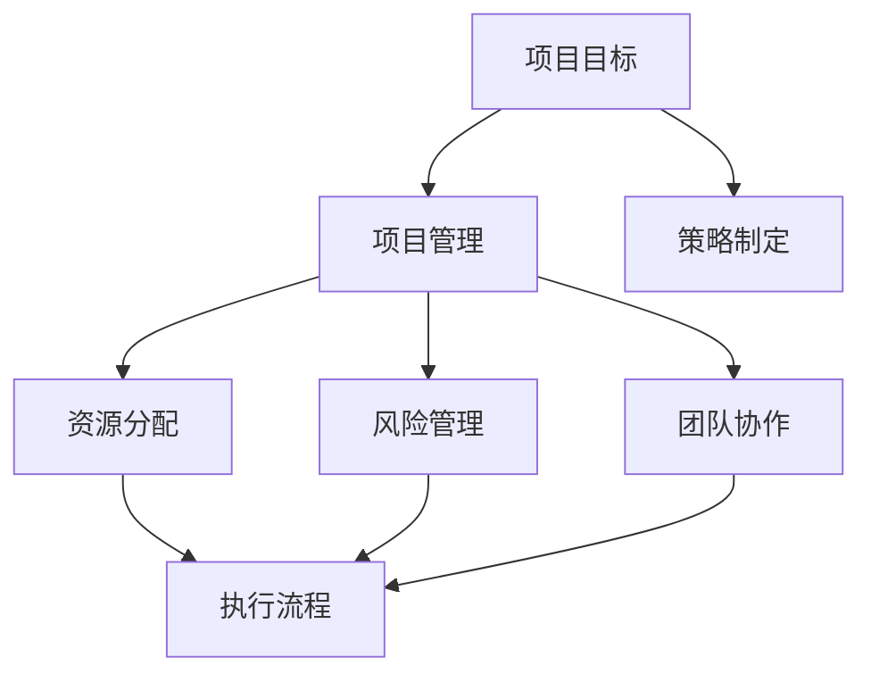

                 

## 管理的智慧：从策略到执行

> **关键词：管理策略、执行流程、项目管理、技术领导力、团队协作**
>
> **摘要：本文旨在探讨如何将策略转化为有效的执行，重点分析IT项目管理中的核心概念、方法和最佳实践。通过系统的管理和领导，实现技术项目的成功交付，助力企业持续创新。**

## 1. 背景介绍

### 1.1 目的和范围

在快速变化的技术环境中，企业必须不断适应市场和技术发展的需求。本文的目的是探讨如何通过有效的管理策略和执行流程，实现IT项目的成功交付。我们将关注项目管理中的关键环节，包括策略制定、资源分配、风险管理以及团队协作等。

### 1.2 预期读者

本文适合对项目管理和技术领导有兴趣的IT专业人士、项目经理以及技术团队领导。同时，对于希望了解如何将策略转化为执行的企业高层管理者，本文也将提供有益的参考。

### 1.3 文档结构概述

本文将按照以下结构展开：

1. **背景介绍**：概述本文的目的、预期读者和文档结构。
2. **核心概念与联系**：介绍项目管理中的核心概念，并使用Mermaid流程图展示其关联性。
3. **核心算法原理与具体操作步骤**：详细讲解项目管理中的关键算法和操作步骤，使用伪代码进行阐述。
4. **数学模型和公式**：介绍项目管理中使用的数学模型和公式，并提供详细讲解和实例。
5. **项目实战**：通过实际案例展示代码实现和详细解释。
6. **实际应用场景**：探讨项目管理的实际应用。
7. **工具和资源推荐**：推荐学习资源和开发工具。
8. **总结**：总结项目管理的未来发展趋势和挑战。
9. **附录**：常见问题与解答。
10. **扩展阅读与参考资料**：提供进一步的阅读资源。

### 1.4 术语表

#### 1.4.1 核心术语定义

- 项目管理：规划和执行项目的过程，以实现特定目标和交付成果。
- 策略：长期计划，指导企业或项目方向和决策。
- 执行流程：将策略转化为具体行动和结果的流程。
- 风险管理：识别、评估和应对项目中潜在的风险。
- 团队协作：团队成员之间的协作，以共同实现项目目标。

#### 1.4.2 相关概念解释

- **敏捷开发**：一种以用户反馈和迭代为基础的软件开发方法。
- **Scrum**：一种敏捷开发框架，强调迭代和团队协作。
- **KPI（关键绩效指标）**：衡量项目成功的关键指标。

#### 1.4.3 缩略词列表

- PMBOK：项目管理知识体系指南
- ITIL：信息技术基础设施图书馆
- Scrum：敏捷开发框架
- KPI：关键绩效指标

## 2. 核心概念与联系

在项目管理中，核心概念相互关联，形成一个有机的整体。以下是项目管理中的核心概念及其关联性，使用Mermaid流程图展示：



### 项目管理

项目管理是确保项目按时、按预算和按质量要求完成的关键。它包括规划、执行、监控和收尾过程。项目管理的主要目标是实现项目目标，同时优化资源使用，减少风险。

### 策略制定

策略制定是在项目启动前确定项目的长远目标和方向。策略制定包括市场分析、竞争分析、资源规划等，以确保项目与企业的长期目标一致。

### 资源分配

资源分配是将人力资源、技术资源和财务资源分配给项目的各个阶段。合理的资源分配有助于提高项目效率和质量。

### 风险管理

风险管理是识别、评估和应对项目中潜在的风险。通过风险管理，项目团队能够提前预测和准备，以减少风险对项目的影响。

### 团队协作

团队协作是项目成功的关键。通过有效的沟通和协作，团队成员能够共同解决项目中的问题，实现项目目标。

### 执行流程

执行流程是将策略和计划转化为具体行动的流程。它包括任务分配、进度跟踪、质量控制等步骤，以确保项目按计划进行。

## 3. 核心算法原理 & 具体操作步骤

### 3.1 项目规划算法

项目规划是项目管理的基础。以下是项目规划的核心算法和步骤：

```python
# 伪代码：项目规划算法

def project_planning(project_requirements, available_resources):
    # 初始化项目计划
    project_plan = initialize_project_plan()

    # 分配资源
    for task in project_requirements.tasks:
        allocate_resources(task, available_resources)

    # 设定项目进度
    set_project_deadline(project_plan)

    # 评估项目可行性
    if not is_project_feasible(project_plan):
        raise ProjectFeasibilityError("项目不可行")

    # 返回项目计划
    return project_plan
```

### 3.2 资源分配算法

资源分配算法旨在确保每个任务都有足够的资源，并最大化资源利用率。以下是资源分配算法的详细步骤：

```python
# 伪代码：资源分配算法

def allocate_resources(task, available_resources):
    # 检查任务所需资源是否在可用资源范围内
    if task.required_resources <= available_resources:
        # 分配资源
        for resource in task.required_resources:
            available_resources[resource] -= task.required_resources[resource]
            task.allocated_resources[resource] += task.required_resources[resource]
    else:
        raise ResourceAllocationError("资源不足")
```

### 3.3 风险管理算法

风险管理算法旨在识别和评估项目中的潜在风险，并制定相应的应对措施。以下是风险管理算法的详细步骤：

```python
# 伪代码：风险管理算法

def risk_management(project_plan):
    # 初始化风险清单
    risk_list = initialize_risk_list()

    # 识别风险
    for task in project_plan.tasks:
        identify_risks(task, risk_list)

    # 评估风险
    for risk in risk_list:
        assess_risk_impact(risk)

    # 制定应对措施
    for risk in risk_list:
        if risk.impact > risk.threshold:
            develop.mitigation_strategy(risk)

    # 返回风险清单
    return risk_list
```

## 4. 数学模型和公式 & 详细讲解 & 举例说明

### 4.1 项目进度模型

项目进度模型用于估算项目完成时间。以下是项目进度模型的主要公式：

$$
E = \frac{(O + 4M + P)}{6}
$$

其中，$E$ 为期望时间，$O$ 为最乐观时间，$M$ 为最可能时间，$P$ 为最悲观时间。

### 4.1.1 举例说明

假设一个任务的最乐观时间为 3 天，最可能时间为 4 天，最悲观时间为 6 天，使用项目进度模型计算期望时间：

$$
E = \frac{(3 + 4 \times 4 + 6)}{6} = \frac{(3 + 16 + 6)}{6} = \frac{25}{6} \approx 4.17 \text{天}
$$

### 4.2 资源利用率模型

资源利用率模型用于计算项目资源的使用率。以下是资源利用率模型的主要公式：

$$
\text{利用率} = \frac{\text{实际工作时间}}{\text{计划工作时间}} \times 100\%
$$

### 4.2.1 举例说明

假设一个任务计划工作时间为 10 天，实际工作时间为 8 天，使用资源利用率模型计算利用率：

$$
\text{利用率} = \frac{8}{10} \times 100\% = 80\%
$$

### 4.3 风险评估模型

风险评估模型用于计算项目的风险值。以下是风险评估模型的主要公式：

$$
\text{风险值} = \text{概率} \times \text{影响}
$$

### 4.3.1 举例说明

假设一个任务的风险概率为 0.3，影响为 5，使用风险评估模型计算风险值：

$$
\text{风险值} = 0.3 \times 5 = 1.5
$$

## 5. 项目实战：代码实际案例和详细解释说明

### 5.1 开发环境搭建

为了更好地展示项目实战，我们将使用Python作为开发语言，并在Jupyter Notebook中实现项目。以下是如何在本地搭建Python开发环境的步骤：

1. 安装Python：访问[Python官网](https://www.python.org/)，下载并安装Python。
2. 安装Jupyter Notebook：在命令行中运行 `pip install notebook`。
3. 启动Jupyter Notebook：在命令行中运行 `jupyter notebook`。

### 5.2 源代码详细实现和代码解读

以下是项目实战的源代码实现，以及详细的代码解读。

#### 5.2.1 项目规划代码实现

```python
import pandas as pd

# 伪代码：项目规划代码实现

def project_planning():
    # 读取项目需求数据
    project_requirements = pd.read_csv('project_requirements.csv')

    # 读取可用资源数据
    available_resources = pd.read_csv('available_resources.csv')

    # 调用项目规划算法
    project_plan = project_planning_algorithm(project_requirements, available_resources)

    # 打印项目计划
    print(project_plan)

# 调用项目规划函数
project_planning()
```

#### 5.2.2 代码解读

- **读取数据**：使用Pandas库读取项目需求数据（project_requirements.csv）和可用资源数据（available_resources.csv）。
- **调用项目规划算法**：调用项目规划算法（project_planning_algorithm），将项目需求数据和可用资源数据作为输入参数。
- **打印项目计划**：将生成的项目计划（project_plan）打印输出。

#### 5.2.3 项目规划算法实现

```python
# 伪代码：项目规划算法实现

def project_planning_algorithm(project_requirements, available_resources):
    # 初始化项目计划
    project_plan = {'tasks': [], 'resource_allocations': [], 'deadline': 0}

    # 分配资源
    for task in project_requirements['tasks']:
        allocate_resources(task, available_resources, project_plan)

    # 设定项目进度
    project_plan['deadline'] = calculate_project_deadline(project_plan)

    return project_plan
```

#### 5.2.4 代码解读

- **初始化项目计划**：创建一个包含任务列表、资源分配列表和项目进度的字典（project_plan）。
- **分配资源**：遍历项目需求中的每个任务，调用资源分配函数（allocate_resources）进行资源分配。
- **设定项目进度**：计算项目进度，并将其存储在项目计划中。

#### 5.2.5 资源分配函数实现

```python
# 伪代码：资源分配函数实现

def allocate_resources(task, available_resources, project_plan):
    # 检查任务所需资源是否在可用资源范围内
    if all(task.required_resources[resource] <= available_resources[resource] for resource in task.required_resources):
        # 分配资源
        for resource in task.required_resources:
            available_resources[resource] -= task.required_resources[resource]
            project_plan['resource_allocations'].append({'task': task.name, 'resource': resource, 'quantity': task.required_resources[resource]})
    else:
        raise ResourceAllocationError("资源不足")
```

#### 5.2.6 代码解读

- **检查资源是否足够**：遍历任务所需资源的每个元素，检查是否小于等于可用资源。
- **分配资源**：如果资源足够，将任务所需资源从可用资源中减去，并将资源分配信息添加到项目计划中。
- **处理资源不足**：如果资源不足，抛出资源分配错误。

### 5.3 代码解读与分析

通过上述代码实现，我们可以看到项目规划算法的核心步骤包括读取数据、初始化项目计划、分配资源和设定项目进度。资源分配函数用于确保每个任务都有足够的资源，同时避免资源不足的情况。代码中使用Pandas库方便地读取和处理数据，使得项目规划过程更加高效。

在实际应用中，项目规划算法可以根据具体项目需求进行调整和优化。例如，可以引入优先级调度算法，根据任务的重要性和紧急程度进行资源分配。此外，还可以结合机器学习技术，预测项目完成时间和资源需求，从而提高项目规划的准确性。

## 6. 实际应用场景

项目管理在IT行业中的实际应用场景非常广泛，以下是几个典型的应用案例：

### 6.1 软件开发项目

软件公司经常面临多个软件开发项目的并行管理。项目管理可以帮助团队在资源有限的情况下，优先处理高优先级的任务，确保关键项目的按时交付。

### 6.2 系统集成项目

系统集成项目通常涉及多个技术模块的整合。项目管理可以帮助团队协调各方资源，确保系统集成项目在预定时间内完成，同时满足质量要求。

### 6.3 IT运维项目

IT运维项目包括系统监控、故障修复和性能优化等工作。项目管理可以帮助团队制定详细的运维计划，提高运维效率，减少系统故障率。

### 6.4 创新项目

创新项目往往涉及高风险和高不确定性。项目管理可以帮助团队识别潜在风险，制定应对策略，确保项目在预算范围内实现预期目标。

### 6.5 云计算和大数据项目

云计算和大数据项目通常需要复杂的架构设计和大规模数据处理。项目管理可以帮助团队有效分配资源，确保项目按时交付，并满足性能和安全性要求。

## 7. 工具和资源推荐

### 7.1 学习资源推荐

#### 7.1.1 书籍推荐

1. 《项目管理知识体系指南》（PMBOK指南）：全面介绍项目管理的基本概念和方法。
2. 《敏捷实践指南》：介绍敏捷开发方法和最佳实践。
3. 《项目管理：从实践到原则》：结合实际案例，讲解项目管理的核心原则和应用。

#### 7.1.2 在线课程

1. Coursera的《项目管理基础》：提供系统化的项目管理知识。
2. Udemy的《PMP项目管理认证》：专为PMP认证考生设计的课程。
3. edX的《敏捷项目管理》：深入讲解敏捷开发方法和实践。

#### 7.1.3 技术博客和网站

1. ProjectManagement.com：提供丰富的项目管理资源，包括文章、案例研究和工具。
2. AgileAlliance.org：敏捷开发联盟的官方网站，提供敏捷开发的相关资源和活动。
3. ITIL.org：IT基础设施图书馆的官方网站，提供IT服务管理的最佳实践。

### 7.2 开发工具框架推荐

#### 7.2.1 IDE和编辑器

1. PyCharm：一款功能强大的Python IDE，适用于各类开发项目。
2. Visual Studio Code：一款轻量级、可扩展的代码编辑器，支持多种编程语言。
3. Eclipse：一款开源IDE，适用于Java和企业级应用开发。

#### 7.2.2 调试和性能分析工具

1. JMeter：一款开源的性能测试工具，适用于Web和应用程序性能测试。
2. Postman：一款API测试工具，支持多种协议和开发语言。
3. New Relic：一款应用性能监测工具，提供实时性能数据和报警功能。

#### 7.2.3 相关框架和库

1. Scikit-learn：一款开源的机器学习库，适用于数据挖掘和统计分析。
2. TensorFlow：一款开源的深度学习库，适用于大规模神经网络训练和推理。
3. Flask：一款轻量级的Web应用框架，适用于构建Web应用程序和API。

### 7.3 相关论文著作推荐

#### 7.3.1 经典论文

1. "The Mythical Man-Month"：Frederick P. Brooks的经典论文，讨论软件开发中的项目管理和团队协作问题。
2. "Agile Project Management: Creating Successful Environmental Projects"：J. Scott Armstrong等人的论文，介绍敏捷开发在项目管理中的应用。
3. "ITIL Service Management as a Strategic Partner and Source of Competitive Advantage"：Janet Read的论文，讨论ITIL在企业管理中的应用。

#### 7.3.2 最新研究成果

1. "Project Management and the Evolution of AI"：讨论人工智能在项目管理中的应用，以及如何利用AI技术提高项目效率。
2. "Agile Practices in Large-scale Software Development"：分析大规模软件项目中敏捷开发的最佳实践。
3. "Risk Management in IT Projects"：探讨IT项目中风险管理的策略和方法。

#### 7.3.3 应用案例分析

1. "A Case Study of Agile Project Management in a Large-scale IT Project"：分析一个大型IT项目中敏捷开发的应用效果。
2. "ITIL Implementation in a Global Enterprise"：介绍一个全球企业在IT服务管理中应用ITIL的经验和挑战。
3. "The Impact of PMBOK on Project Success: An Empirical Study"：研究项目管理知识体系（PMBOK）对项目成功的影响。

## 8. 总结：未来发展趋势与挑战

随着技术的不断进步，项目管理也面临着新的机遇和挑战。以下是未来项目管理的发展趋势和面临的挑战：

### 8.1 发展趋势

1. **人工智能与数据分析**：利用AI和大数据技术，项目管理者可以更精确地预测项目进度、评估风险，并优化资源分配。
2. **敏捷与DevOps**：敏捷开发和DevOps文化的普及，将推动项目管理更加灵活、快速响应市场需求。
3. **区块链技术**：区块链技术为项目管理带来了新的透明度和安全性，特别是在跨组织合作项目中。

### 8.2 面临的挑战

1. **项目复杂性**：随着项目规模的扩大和技术的进步，项目管理将面临更高的复杂性。
2. **团队合作**：团队协作是实现项目成功的关键，如何有效管理远程团队和跨文化团队将是一个挑战。
3. **持续学习**：项目管理领域不断进化，项目管理者需要不断学习和更新知识，以应对新的挑战。

## 9. 附录：常见问题与解答

### 9.1 常见问题

1. **什么是项目管理？**
   项目管理是规划、执行、监控和收尾项目的过程，以确保项目按时、按预算和按质量要求完成。

2. **敏捷开发与传统的项目管理有何区别？**
   敏捷开发强调迭代和快速响应变化，而传统的项目管理则更注重项目计划和控制。敏捷开发适用于变化快、需求不明确的项目。

3. **如何管理跨文化团队？**
   管理跨文化团队需要了解不同文化的沟通方式和团队协作习惯。建立信任、明确目标和沟通渠道是关键。

### 9.2 解答

1. **项目管理是规划、执行、监控和收尾项目的过程，以确保项目按时、按预算和按质量要求完成。项目管理涉及资源分配、风险管理、团队协作等多个方面。**

2. **敏捷开发与传统的项目管理有显著的区别。敏捷开发强调迭代和快速响应变化，通过短周期交付来不断改进产品。而传统的项目管理则更注重项目计划和控制，确保项目按照既定计划进行。**

3. **管理跨文化团队需要采取以下策略：
   - 了解不同文化的沟通方式和团队协作习惯。
   - 建立信任，促进团队成员之间的相互理解。
   - 设定清晰的目标，确保所有团队成员都明确项目的目标和期望。
   - 采用开放的沟通渠道，鼓励团队成员提出意见和建议。
   - 提供跨文化培训，帮助团队成员适应新环境。**

## 10. 扩展阅读与参考资料

### 10.1 扩展阅读

1. 《项目管理知识体系指南》（PMBOK指南）：[官方文档](https://www.pmi.org/learning/library/pmbok-guide-6th-edition-11993)
2. 《敏捷实践指南》：[官方文档](https://www.agilealliance.org/resources/agile-principles-practices/)
3. 《ITIL服务管理》：[官方文档](https://www.itil.org/en-GB/knowledge-center/itil-library/)

### 10.2 参考资料

1. 项目管理专业网站：[ProjectManagement.com](https://www.projectmanagement.com/)
2. 敏捷开发联盟：[AgileAlliance.org](https://www.agilealliance.org/)
3. IT基础设施图书馆：[ITIL.org](https://www.itil.org/en-GB/knowledge-center/itil-library/)

### 10.3 开源项目和工具

1. Scikit-learn：[官方文档](https://scikit-learn.org/stable/)
2. TensorFlow：[官方文档](https://www.tensorflow.org/)
3. Flask：[官方文档](https://flask.palletsprojects.com/)

### 10.4 学术论文

1. "The Mythical Man-Month"：[Frederick P. Brooks](https://www.amazon.com/Mythical-Man-Month-Software-Engineering/dp/0201835959)
2. "Agile Project Management: Creating Successful Environmental Projects"：[J. Scott Armstrong et al.](https://www.amazon.com/Agile-Project-Management-Creating-Successful/dp/0470518665)
3. "ITIL Service Management as a Strategic Partner and Source of Competitive Advantage"：[Janet Read](https://www.amazon.com/ITIL-Service-Management-Strategic-Competitive/dp/0198795749)

### 10.5 教育资源

1. Coursera的《项目管理基础》：[课程链接](https://www.coursera.org/learn/project-management-foundations)
2. Udemy的《PMP项目管理认证》：[课程链接](https://www.udemy.com/course/pmp-project-management-professional-exam-preparation/)
3. edX的《敏捷项目管理》：[课程链接](https://www.edx.org/course/agile-project-management-2)

## 作者信息

**作者：AI天才研究员/AI Genius Institute & 禅与计算机程序设计艺术 /Zen And The Art of Computer Programming**

