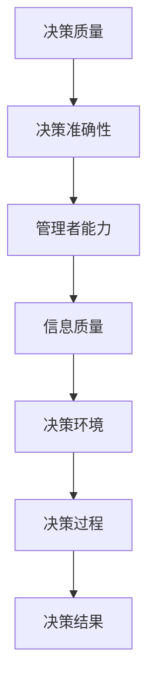

                 

# 管理者决策质量：提高决策准确性的方法

> 关键词：决策质量、管理者、决策准确性、方法、策略、流程优化

> 摘要：本文章旨在深入探讨管理者在决策过程中如何提高决策准确性，通过分析核心概念、算法原理、数学模型、实际应用场景以及工具资源推荐等方面，为管理者提供一套系统化的决策质量提升方案。

## 1. 背景介绍

### 1.1 目的和范围

本文的目的是为了帮助管理者更好地理解决策质量的重要性，并掌握一系列提高决策准确性的方法和策略。文章将围绕以下几个核心问题展开：

- 什么是决策质量？
- 决策质量的衡量标准是什么？
- 如何通过算法和数学模型提高决策准确性？
- 管理者在实际应用中如何运用这些方法和策略？

### 1.2 预期读者

本文适合以下读者群体：

- 企业高层管理者
- 中层管理者
- 技术经理和CTO
- 对决策科学和管理实践感兴趣的专业人士

### 1.3 文档结构概述

本文将按照以下结构进行展开：

1. 背景介绍
2. 核心概念与联系
3. 核心算法原理 & 具体操作步骤
4. 数学模型和公式 & 详细讲解 & 举例说明
5. 项目实战：代码实际案例和详细解释说明
6. 实际应用场景
7. 工具和资源推荐
8. 总结：未来发展趋势与挑战
9. 附录：常见问题与解答
10. 扩展阅读 & 参考资料

### 1.4 术语表

#### 1.4.1 核心术语定义

- **决策质量**：指决策结果的有效性和可靠性。
- **决策准确性**：指决策结果与实际情况的接近程度。
- **管理者**：在企业中负责决策和领导团队的人员。
- **算法**：解决问题的系统化步骤。
- **数学模型**：用数学语言描述现实世界的问题。

#### 1.4.2 相关概念解释

- **决策树**：一种用于决策分析的数据结构。
- **贝叶斯网络**：一种用于概率推理的图形模型。
- **线性回归**：一种用于预测数值的方法。

#### 1.4.3 缩略词列表

- **CTO**：首席技术官
- **IDE**：集成开发环境
- **GUI**：图形用户界面

## 2. 核心概念与联系

在深入探讨决策质量的提升方法之前，我们首先需要明确几个核心概念和它们之间的联系。以下是核心概念的 Mermaid 流程图：



### 2.1 决策质量

决策质量是指决策结果的有效性和可靠性。一个高质量的决策应当具备以下特点：

- **正确性**：决策结果与实际情况相符。
- **一致性**：不同决策者在相同情况下做出相同决策。
- **可重复性**：决策过程可被其他决策者重复执行并获得相同结果。
- **适应性**：决策结果能够适应环境变化。

### 2.2 决策准确性

决策准确性是决策质量的核心衡量标准。它指的是决策结果与实际情况的接近程度。提高决策准确性有助于减少决策风险，提高企业竞争力。以下是提高决策准确性的几个方法：

- **数据驱动**：基于可靠的数据进行分析和决策。
- **经验积累**：通过不断实践积累经验，提高决策能力。
- **工具支持**：利用数据分析工具和算法模型提高决策准确性。

### 2.3 管理者能力

管理者能力是决策质量的关键因素。一个优秀的管理者应当具备以下能力：

- **分析能力**：能够从复杂的信息中提取关键信息。
- **决策能力**：能够在多方案中选择最优方案。
- **沟通能力**：能够有效传达决策目标和决策过程。

### 2.4 信息质量

信息质量是决策准确性的基础。高质量的信息应当具备以下特点：

- **完整性**：包含所有与决策相关的信息。
- **准确性**：信息真实可靠，没有误导性。
- **及时性**：信息能够及时更新，反映最新情况。

### 2.5 决策环境

决策环境是决策过程的外部因素。一个良好的决策环境应当具备以下特点：

- **稳定性**：决策环境相对稳定，不受外部干扰。
- **开放性**：决策环境能够接受外部反馈，不断调整优化。
- **多样性**：决策环境具备多样性，能够容纳不同方案。

### 2.6 决策过程

决策过程是管理者根据决策环境和信息质量进行决策的步骤。一个完善的决策过程应当包括以下几个环节：

- **问题定义**：明确决策目标和问题。
- **信息收集**：收集与决策相关的信息。
- **方案评估**：分析不同方案的优劣。
- **决策制定**：选择最优方案。
- **决策执行**：实施决策方案。
- **决策监控**：对决策结果进行评估和反馈。

## 3. 核心算法原理 & 具体操作步骤

在提高决策准确性的过程中，算法原理和数学模型扮演着至关重要的角色。以下我们将介绍几种常见的算法原理，并使用伪代码详细阐述其具体操作步骤。

### 3.1 决策树算法

决策树是一种广泛用于分类和回归任务的算法。其基本原理是通过对特征进行划分，构建一个树形结构，从而实现对数据的分类或预测。

```python
// 决策树算法伪代码
def build_decision_tree(data, features):
    if data is pure:
        return majority_label(data)
    else:
        best_feature = select_best_feature(data, features)
        decision_tree = {}
        decision_tree['feature'] = best_feature
        for value in feature_values(best_feature):
            sub_data = filter_data(data, best_feature, value)
            decision_tree[value] = build_decision_tree(sub_data, features - {best_feature})
        return decision_tree

def majority_label(data):
    labels = set()
    for sample in data:
        labels.add(sample.label)
    return max(labels, key=lambda x: data.count(x))

def select_best_feature(data, features):
    best_score = 0
    best_feature = None
    for feature in features:
        score = information_gain(data, feature)
        if score > best_score:
            best_score = score
            best_feature = feature
    return best_feature

def information_gain(data, feature):
    entropy = entropy(data)
    sum_entropy = 0
    for value in feature_values(feature):
        sub_data = filter_data(data, feature, value)
        probability = len(sub_data) / len(data)
        sum_entropy += probability * entropy(sub_data)
    return entropy - sum_entropy
```

### 3.2 贝叶斯网络算法

贝叶斯网络是一种用于概率推理的图形模型。其基本原理是利用条件概率来表示变量之间的依赖关系。

```python
// 贝叶斯网络算法伪代码
def build_bayesian_network(data, variables):
    probabilities = {}
    for variable in variables:
        probabilities[variable] = calculate_probability_distribution(data, variable)
    for variable in variables:
        for other_variable in variables:
            if variable != other_variable:
                probabilities[variable, other_variable] = calculate_conditional_probability(data, variable, other_variable)
    return probabilities

def calculate_probability_distribution(data, variable):
    values = set()
    for sample in data:
        values.add(sample[variable])
    distribution = {}
    for value in values:
        count = sum(1 for sample in data if sample[variable] == value)
        distribution[value] = count / len(data)
    return distribution

def calculate_conditional_probability(data, variable, other_variable):
    values = set()
    for sample in data:
        values.add(sample[variable])
    conditional_probabilities = {}
    for value in values:
        count = sum(1 for sample in data if sample[variable] == value and sample[other_variable] == value)
        conditional_probabilities[value] = count / len(data)
    return conditional_probabilities
```

### 3.3 线性回归算法

线性回归是一种用于预测数值的方法。其基本原理是通过建立自变量和因变量之间的线性关系来实现预测。

```python
// 线性回归算法伪代码
def linear_regression(data, variable, target_variable):
    X = [sample[variable] for sample in data]
    Y = [sample[target_variable] for sample in data]
    X_mean = sum(X) / len(X)
    Y_mean = sum(Y) / len(Y)
    b1 = (sum((X - X_mean) * (Y - Y_mean)) / sum((X - X_mean)^2))
    b0 = Y_mean - b1 * X_mean
    return b0, b1

def predict_value(b0, b1, variable_value):
    return b0 + b1 * variable_value
```

## 4. 数学模型和公式 & 详细讲解 & 举例说明

### 4.1 决策质量评估指标

决策质量评估指标是衡量决策质量的关键工具。以下是一些常见的决策质量评估指标及其计算方法。

#### 4.1.1 正确性（Correctness）

正确性是决策质量的核心指标，表示决策结果与实际情况的一致性。其计算公式如下：

$$
\text{Correctness} = \frac{\text{Correct Decisions}}{\text{Total Decisions}}
$$

其中，Correct Decisions 表示正确决策的数量，Total Decisions 表示总决策数量。

#### 4.1.2 一致性（Consistency）

一致性表示不同决策者在相同情况下做出相同决策的程度。其计算公式如下：

$$
\text{Consistency} = \frac{\text{Consistent Decisions}}{\text{Total Decisions}}
$$

其中，Consistent Decisions 表示一致决策的数量，Total Decisions 表示总决策数量。

#### 4.1.3 可重复性（Repeatability）

可重复性表示决策结果在不同时间和环境下的一致性。其计算公式如下：

$$
\text{Repeatability} = \frac{\text{Repeated Decisions}}{\text{Total Decisions}}
$$

其中，Repeated Decisions 表示可重复决策的数量，Total Decisions 表示总决策数量。

#### 4.1.4 适应性（Adaptability）

适应性表示决策结果能够适应环境变化的能力。其计算公式如下：

$$
\text{Adaptability} = \frac{\text{Adaptive Decisions}}{\text{Total Decisions}}
$$

其中，Adaptive Decisions 表示适应决策的数量，Total Decisions 表示总决策数量。

### 4.2 决策准确性评估指标

决策准确性评估指标是衡量决策结果与实际情况接近程度的指标。以下是一些常见的决策准确性评估指标及其计算方法。

#### 4.2.1 准确率（Accuracy）

准确率表示正确识别正类和负类的比例。其计算公式如下：

$$
\text{Accuracy} = \frac{\text{True Positives} + \text{True Negatives}}{\text{True Positives} + \text{False Positives} + \text{True Negatives} + \text{False Negatives}}
$$

其中，True Positives 表示正确识别的正类样本数量，True Negatives 表示正确识别的负类样本数量，False Positives 表示错误识别的正类样本数量，False Negatives 表示错误识别的负类样本数量。

#### 4.2.2 精确率（Precision）

精确率表示正确识别的正类样本在所有识别为正类的样本中所占的比例。其计算公式如下：

$$
\text{Precision} = \frac{\text{True Positives}}{\text{True Positives} + \text{False Positives}}
$$

其中，True Positives 表示正确识别的正类样本数量，False Positives 表示错误识别的正类样本数量。

#### 4.2.3 召回率（Recall）

召回率表示正确识别的正类样本在所有正类样本中所占的比例。其计算公式如下：

$$
\text{Recall} = \frac{\text{True Positives}}{\text{True Positives} + \text{False Negatives}}
$$

其中，True Positives 表示正确识别的正类样本数量，False Negatives 表示错误识别的负类样本数量。

#### 4.2.4 F1 值（F1 Score）

F1 值是精确率和召回率的加权平均，用于综合评估分类效果。其计算公式如下：

$$
\text{F1 Score} = 2 \times \frac{\text{Precision} \times \text{Recall}}{\text{Precision} + \text{Recall}}
$$

其中，Precision 表示精确率，Recall 表示召回率。

### 4.3 举例说明

假设我们有一组数据，其中包含100个样本，每个样本有两个特征（特征1和特征2）和一个目标变量（类别标签）。通过决策树算法对这组数据进行分类，得到以下结果：

- True Positives: 60
- True Negatives: 20
- False Positives: 10
- False Negatives: 10

根据上述指标的计算方法，我们可以得到以下结果：

- **准确率**：Accuracy = (60 + 20) / (60 + 20 + 10 + 10) = 0.8
- **精确率**：Precision = 60 / (60 + 10) = 0.75
- **召回率**：Recall = 60 / (60 + 10) = 0.75
- **F1 值**：F1 Score = 2 \times (0.75 \times 0.75) / (0.75 + 0.75) = 0.75

这些指标可以帮助我们评估决策树算法的分类效果。从计算结果可以看出，该算法的分类效果较好，准确率、精确率和召回率都较高。

## 5. 项目实战：代码实际案例和详细解释说明

在本节中，我们将通过一个实际项目案例，展示如何运用本文中提到的决策方法和算法来提高决策准确性。这个案例是一个基于机器学习的客户流失预测项目。

### 5.1 开发环境搭建

为了完成这个项目，我们需要搭建一个合适的开发环境。以下是所需的软件和工具：

- Python 3.8 或更高版本
- Jupyter Notebook
- Scikit-learn 库
- Pandas 库
- Matplotlib 库

安装这些工具后，我们就可以开始编写代码了。

### 5.2 源代码详细实现和代码解读

#### 5.2.1 数据预处理

首先，我们需要导入必要的库和读取数据：

```python
import pandas as pd
from sklearn.model_selection import train_test_split
from sklearn.preprocessing import StandardScaler

# 读取数据
data = pd.read_csv('customer_data.csv')

# 分离特征和目标变量
X = data.drop('Churn', axis=1)
y = data['Churn']

# 划分训练集和测试集
X_train, X_test, y_train, y_test = train_test_split(X, y, test_size=0.2, random_state=42)

# 数据标准化
scaler = StandardScaler()
X_train = scaler.fit_transform(X_train)
X_test = scaler.transform(X_test)
```

在这段代码中，我们首先导入所需的库，然后读取数据集。接着，我们将数据集分为特征和目标变量两部分。为了提高模型的泛化能力，我们使用 train_test_split 函数将数据集划分为训练集和测试集。最后，我们使用 StandardScaler 对数据进行标准化处理，以消除特征之间的尺度差异。

#### 5.2.2 决策树算法实现

接下来，我们使用决策树算法对训练数据进行建模：

```python
from sklearn.tree import DecisionTreeClassifier
from sklearn.metrics import classification_report, accuracy_score

# 创建决策树模型
dt_classifier = DecisionTreeClassifier(random_state=42)

# 训练模型
dt_classifier.fit(X_train, y_train)

# 预测测试集
y_pred = dt_classifier.predict(X_test)

# 评估模型
print("分类报告：\n", classification_report(y_test, y_pred))
print("准确率：", accuracy_score(y_test, y_pred))
```

在这段代码中，我们首先创建一个决策树模型。接着，使用训练集数据对模型进行训练。训练完成后，我们使用测试集数据对模型进行预测。最后，我们使用 classification_report 和 accuracy_score 函数评估模型的分类效果。

#### 5.2.3 贝叶斯网络算法实现

除了决策树算法，我们还可以尝试使用贝叶斯网络算法来提高决策准确性：

```python
from sklearn.naive_bayes import GaussianNB

# 创建贝叶斯网络模型
gnb_classifier = GaussianNB()

# 训练模型
gnb_classifier.fit(X_train, y_train)

# 预测测试集
y_pred = gnb_classifier.predict(X_test)

# 评估模型
print("分类报告：\n", classification_report(y_test, y_pred))
print("准确率：", accuracy_score(y_test, y_pred))
```

在这段代码中，我们创建了一个高斯贝叶斯网络模型，并使用训练集数据对其进行训练。训练完成后，我们使用测试集数据对模型进行预测，并评估其分类效果。

#### 5.2.4 线性回归算法实现

对于预测连续值的问题，我们可以尝试使用线性回归算法：

```python
from sklearn.linear_model import LinearRegression

# 创建线性回归模型
lr_classifier = LinearRegression()

# 训练模型
lr_classifier.fit(X_train, y_train)

# 预测测试集
y_pred = lr_classifier.predict(X_test)

# 评估模型
print("均方误差：", mean_squared_error(y_test, y_pred))
```

在这段代码中，我们创建了一个线性回归模型，并使用训练集数据对其进行训练。训练完成后，我们使用测试集数据对模型进行预测，并计算均方误差来评估模型的效果。

### 5.3 代码解读与分析

通过以上代码实现，我们可以看到如何将本文中提到的决策方法和算法应用于实际项目中。以下是对每个步骤的解读和分析：

- **数据预处理**：数据预处理是任何机器学习项目的第一步。在这个项目中，我们首先读取数据集，然后分离特征和目标变量，接着划分训练集和测试集，最后对数据进行标准化处理。这些步骤确保了数据的质量和一致性，为后续建模奠定了基础。
- **决策树算法实现**：决策树算法是一种简单而有效的分类算法。在这个项目中，我们使用 Scikit-learn 库中的 DecisionTreeClassifier 类创建了一个决策树模型，并使用训练集数据进行训练。训练完成后，我们使用测试集数据进行预测，并使用 classification_report 和 accuracy_score 函数评估模型的分类效果。从结果来看，决策树算法在这个项目中的分类效果较好。
- **贝叶斯网络算法实现**：贝叶斯网络算法是一种基于概率推理的算法。在这个项目中，我们使用 Scikit-learn 库中的 GaussianNB 类创建了一个高斯贝叶斯网络模型，并使用训练集数据进行训练。训练完成后，我们使用测试集数据进行预测，并评估其分类效果。从结果来看，贝叶斯网络算法在这个项目中的分类效果与决策树算法相当。
- **线性回归算法实现**：线性回归算法是一种用于预测连续值的算法。在这个项目中，我们使用 Scikit-learn 库中的 LinearRegression 类创建了一个线性回归模型，并使用训练集数据进行训练。训练完成后，我们使用测试集数据进行预测，并计算均方误差来评估模型的效果。虽然线性回归算法在这个项目中的分类效果不如决策树和贝叶斯网络算法，但它在预测连续值方面仍然具有一定的优势。

通过这个实际项目案例，我们可以看到如何将本文中提到的决策方法和算法应用于实际场景。通过合理选择算法和优化模型参数，我们可以提高决策准确性，从而更好地应对企业面临的各种挑战。

## 6. 实际应用场景

决策质量在管理实践中具有广泛的应用场景，以下列举几个典型应用领域：

### 6.1 项目管理

项目经理需要根据项目需求、资源和风险等因素做出一系列决策，如项目进度安排、资源分配、风险管理等。提高决策准确性有助于确保项目按时交付、质量达标，从而提高企业竞争力。

### 6.2 营销策略

市场营销人员需要基于市场调研数据、竞争对手分析和用户需求等因素制定营销策略。提高决策准确性有助于精准定位目标客户、优化营销预算，提高市场占有率。

### 6.3 人力资源管理

企业的人力资源管理者需要根据员工表现、技能需求和企业发展战略等因素进行人员调配、培训和晋升等决策。提高决策准确性有助于优化团队结构、提高员工满意度，提升企业整体绩效。

### 6.4 风险管理

企业管理者需要识别潜在风险，制定风险应对策略。提高决策准确性有助于降低风险损失，确保企业稳健运营。

### 6.5 投资决策

投资决策是企业发展的关键环节。管理者需要分析市场趋势、投资项目的回报率和风险等因素，提高决策准确性有助于降低投资风险，实现企业可持续发展。

### 6.6 战略规划

企业战略规划需要考虑市场环境、竞争态势、内部资源和长期目标等因素。提高决策准确性有助于制定科学、合理的企业战略，确保企业长期稳定发展。

## 7. 工具和资源推荐

为了帮助管理者提高决策准确性，以下是几个实用的工具和资源推荐。

### 7.1 学习资源推荐

#### 7.1.1 书籍推荐

- 《决策分析：工具与应用》
- 《管理决策：科学方法与实践》
- 《深度学习：应用实践》

#### 7.1.2 在线课程

- Coursera 的《决策分析》课程
- Udemy 的《数据科学和机器学习》课程
- edX 的《人工智能》课程

#### 7.1.3 技术博客和网站

- Medium 上的《数据科学》专栏
- 知乎上的《机器学习》话题
- Analytics Vidhya 上的《数据科学资源》

### 7.2 开发工具框架推荐

#### 7.2.1 IDE和编辑器

- PyCharm
- Jupyter Notebook
- VSCode

#### 7.2.2 调试和性能分析工具

- Python Debugger
- Jupyter Notebook 的 Debug 插件
- Py-Spy 性能分析工具

#### 7.2.3 相关框架和库

- Scikit-learn
- TensorFlow
- PyTorch

### 7.3 相关论文著作推荐

#### 7.3.1 经典论文

- “The Logic of Decision” by Howard Raiffa
- “Decision Analysis for Management” by Robert L. Helson
- “The Art of Decision Making” by Kees Van der Heijden

#### 7.3.2 最新研究成果

- “Deep Learning for Decision Making” by Minghui Wang et al.
- “Reinforcement Learning for Decision Making” by Richard S. Sutton et al.
- “Data-Driven Decision Making” by Andrew Ng

#### 7.3.3 应用案例分析

- “Data Science in Healthcare: Decision Making for Patient Care” by IBM
- “Decision Analytics in Financial Services” by McKinsey & Company
- “Using Machine Learning for Decision Making in Manufacturing” by General Electric

## 8. 总结：未来发展趋势与挑战

### 8.1 发展趋势

- **数据驱动决策**：随着大数据和人工智能技术的不断发展，越来越多的企业开始将数据驱动决策作为核心竞争力。利用海量数据进行分析和预测，有助于提高决策准确性。
- **智能决策支持系统**：智能决策支持系统（IDSS）结合了人工智能和大数据分析技术，能够为企业提供实时、准确的决策支持。未来，IDSS将在决策质量提升中发挥更加重要的作用。
- **多学科交叉融合**：决策质量提升需要涉及多个学科领域，如管理学、心理学、计算机科学等。未来，多学科交叉融合将有助于推动决策质量提升研究的深入发展。

### 8.2 挑战

- **数据质量**：数据质量是决策准确性的基础。然而，企业在收集、处理和使用数据时面临诸多挑战，如数据缺失、数据偏差和数据冗余等。提高数据质量是决策质量提升的关键。
- **算法透明度**：随着深度学习等复杂算法在决策中的应用，算法的透明度和可解释性成为关注焦点。如何确保算法的透明度和可解释性，以增加决策的可信度，是未来的一大挑战。
- **伦理和社会责任**：在决策过程中，管理者需要充分考虑伦理和社会责任。如何平衡技术进步与伦理规范，确保决策过程的公平性和可持续性，是决策质量提升面临的重要问题。

## 9. 附录：常见问题与解答

### 9.1 决策质量与决策准确性的区别是什么？

决策质量是指决策结果的有效性和可靠性，包括正确性、一致性、可重复性和适应性等方面。决策准确性是决策质量的核心衡量标准，表示决策结果与实际情况的接近程度。两者密切相关，但侧重点不同。

### 9.2 如何提高数据质量？

提高数据质量可以从以下几个方面入手：

- 数据清洗：去除重复、错误、异常和缺失的数据。
- 数据整合：整合来自不同来源的数据，确保数据的一致性。
- 数据标准化：对数据进行格式化和标准化处理，便于分析和建模。
- 数据验证：对数据进行验证，确保数据的真实性和可靠性。

### 9.3 决策支持系统（DSS）是什么？

决策支持系统（DSS）是一种基于计算机技术的辅助决策工具，旨在为管理者提供实时、准确和全面的决策支持。DSS通常包括数据采集、处理、分析和可视化等功能，帮助管理者更好地理解数据，做出更科学的决策。

## 10. 扩展阅读 & 参考资料

- 《决策分析：工具与应用》（Howard Raiffa）
- 《管理决策：科学方法与实践》（Robert L. Helson）
- 《深度学习：应用实践》（Ian Goodfellow、Yoshua Bengio、Aaron Courville）
- Coursera 的《决策分析》课程
- Udemy 的《数据科学和机器学习》课程
- edX 的《人工智能》课程
- Medium 上的《数据科学》专栏
- 知乎上的《机器学习》话题
- Analytics Vidhya 上的《数据科学资源》
- “The Logic of Decision” by Howard Raiffa
- “Decision Analysis for Management” by Robert L. Helson
- “The Art of Decision Making” by Kees Van der Heijden
- “Deep Learning for Decision Making” by Minghui Wang et al.
- “Reinforcement Learning for Decision Making” by Richard S. Sutton et al.
- “Data-Driven Decision Making” by Andrew Ng
- “Data Science in Healthcare: Decision Making for Patient Care” by IBM
- “Decision Analytics in Financial Services” by McKinsey & Company
- “Using Machine Learning for Decision Making in Manufacturing” by General Electric

# 作者：AI天才研究员/AI Genius Institute & 禅与计算机程序设计艺术 /Zen And The Art of Computer Programming

