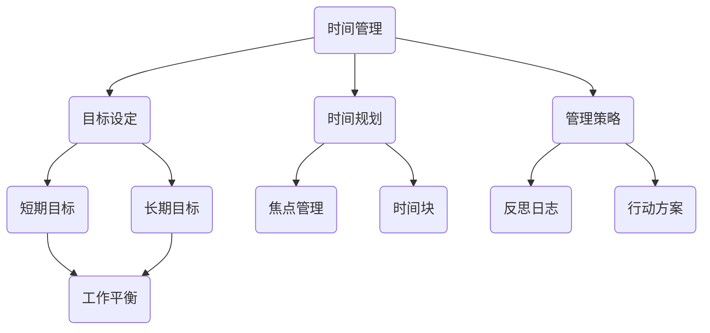

                 


# 管理者时间规划：平衡短期与长期目标

> 关键词：时间管理、目标设定、短期目标、长期目标、管理策略、工作平衡

> 摘要：本文旨在探讨管理者如何通过有效的时间规划，实现短期与长期目标的平衡。我们将从背景介绍、核心概念、算法原理、数学模型、实际案例、应用场景等多个角度，深入剖析这一关键管理技能，帮助读者在忙碌的职业生涯中，把握方向，取得成功。

## 1. 背景介绍

### 1.1 目的和范围

本文的目的是帮助管理者了解并掌握时间规划的方法，特别是如何在日常工作中平衡短期与长期目标。我们将探讨时间管理的基本概念，提供实用的策略和技巧，并通过具体案例进行分析。

### 1.2 预期读者

本文面向所有希望提升时间管理技能的管理者，无论您是刚入门的新手，还是经验丰富的专业人士，都将在这篇文章中找到有价值的信息。

### 1.3 文档结构概述

本文结构如下：

1. 背景介绍
   - 1.1 目的和范围
   - 1.2 预期读者
   - 1.3 文档结构概述
   - 1.4 术语表
2. 核心概念与联系
3. 核心算法原理 & 具体操作步骤
4. 数学模型和公式 & 详细讲解 & 举例说明
5. 项目实战：代码实际案例和详细解释说明
6. 实际应用场景
7. 工具和资源推荐
8. 总结：未来发展趋势与挑战
9. 附录：常见问题与解答
10. 扩展阅读 & 参考资料

### 1.4 术语表

- 时间管理：指通过规划和组织时间，以提高工作效率和生活质量的活动。
- 短期目标：通常指在短时间内（如几个月或一年内）需要完成的具体目标。
- 长期目标：通常指在较长的时间内（如几年或几十年内）需要达成的目标。

#### 1.4.1 核心术语定义

- 时间规划：对时间进行有计划的分配和利用，以实现既定目标。
- 管理策略：为实现目标而采取的具体行动方案。
- 工作平衡：在工作和生活之间寻求平衡，避免过度劳累。

#### 1.4.2 相关概念解释

- 时间块：将工作时间划分为若干个时间段，每个时间段专注于一项任务。
- 焦点管理：根据任务的重要性和紧急程度进行排序，优先处理最重要的任务。
- 反思日志：记录每日工作内容和时间分配，以便进行回顾和改进。

#### 1.4.3 缩略词列表

- GTD（Getting Things Done）：一种著名的时间管理方法。
- OKR（Objectives and Key Results）：一种目标设定和跟踪方法。

## 2. 核心概念与联系

为了深入理解时间规划在管理者工作中的重要性，我们需要了解一些核心概念和它们之间的联系。以下是一个使用Mermaid绘制的流程图，展示这些概念：



在图中，我们可以看到时间管理是整个流程的起点，它涵盖了目标设定、时间规划和管理策略。目标设定进一步细分为短期目标和长期目标，而时间规划和策略的实施又依赖于焦点管理、时间块、反思日志和行动方案。

### 2.1 核心概念解析

#### 时间管理

时间管理是管理者最基本的能力之一。通过有效的时间管理，管理者可以更好地平衡工作与生活，提高工作效率，实现个人和团队的目标。

#### 目标设定

目标设定是时间管理的关键步骤。管理者需要明确短期和长期目标，以便为时间规划提供方向。短期目标通常指在几个月内需要实现的目标，而长期目标则可能在几年甚至几十年内达成。

#### 时间规划

时间规划是对时间进行有计划的分配和利用。管理者需要将时间划分为不同的时间段，并为每个时间段分配具体的任务。时间规划有助于确保任务的完成，并避免时间浪费。

#### 管理策略

管理策略是实现目标的行动方案。管理者需要根据目标设定和实际情况，制定可行的策略，并确保团队成员理解并遵循这些策略。

#### 焦点管理

焦点管理是时间管理的重要环节。它要求管理者根据任务的重要性和紧急程度进行排序，优先处理最重要的任务。这有助于确保关键任务的完成，并减少不必要的干扰。

#### 时间块

时间块是一种将工作时间划分为若干个时间段的方法。每个时间段专注于一项任务，有助于提高专注度和效率。时间块通常与焦点管理相结合，以确保关键任务的完成。

#### 反思日志

反思日志是管理者回顾和总结工作的一种方法。通过记录每日工作内容和时间分配，管理者可以识别出时间浪费的环节，并不断优化时间管理策略。

#### 行动方案

行动方案是实现目标的具体步骤。管理者需要根据目标设定和管理策略，制定详细的行动方案，并确保团队成员了解并遵循这些方案。

## 3. 核心算法原理 & 具体操作步骤

在时间管理中，核心算法原理包括目标设定、时间规划、管理策略和焦点管理。以下是一个简单的伪代码，展示了这些算法的具体操作步骤：

```python
# 时间管理算法

# 输入：短期目标列表，长期目标列表，任务优先级列表
# 输出：时间规划方案，管理策略

def 时间管理（短期目标列表，长期目标列表，任务优先级列表）：
    # 目标设定
    短期目标 = 确定短期目标（短期目标列表）
    长期目标 = 确定长期目标（长期目标列表）
    
    # 时间规划
    时间规划方案 = 时间块分配（短期目标，长期目标）
    
    # 管理策略
    管理策略 = 焦点管理（任务优先级列表，时间规划方案）
    
    # 行动方案
    行动方案 = 行动方案制定（管理策略）
    
    return 时间规划方案，管理策略，行动方案

# 辅助函数

def 时间块分配（短期目标，长期目标）：
    # 将时间划分为若干个时间段
    时间段列表 = 初始化时间段列表
    
    # 为每个时间段分配任务
    for 短期目标 in 短期目标列表：
        时间段列表.append（分配任务（短期目标，时间段列表））
    
    for 长期目标 in 长期目标列表：
        时间段列表.append（分配任务（长期目标，时间段列表））
    
    return 时间段列表

def 焦点管理（任务优先级列表，时间规划方案）：
    # 根据任务优先级和时间规划方案排序
    排序任务列表 = 排序（任务优先级列表，时间规划方案）
    
    return 排序任务列表

def 行动方案制定（管理策略）：
    # 根据管理策略制定行动方案
    行动方案 = 初始化行动方案
    
    for 策略 in 管理策略：
        行动方案.append（执行策略（策略））
    
    return 行动方案
```

### 3.1 目标设定

目标设定是时间管理的第一步。管理者需要明确短期和长期目标，以便为时间规划提供方向。以下是一个示例：

```python
短期目标 = [
    "提升团队工作效率",
    "完成项目A的交付",
    "进行市场调研并制定新产品策略"
]

长期目标 = [
    "实现公司三年发展战略",
    "扩大市场份额",
    "提高员工满意度和团队凝聚力"
]
```

### 3.2 时间规划

时间规划是将时间划分为若干个时间段，并为每个时间段分配任务。以下是一个示例：

```python
时间段列表 = [
    "上午9:00-10:00：处理紧急邮件",
    "上午10:00-11:30：完成项目A的任务",
    "下午2:00-3:00：与团队成员讨论项目进展",
    "下午3:00-4:00：进行市场调研",
    "下午4:00-5:00：撰写会议纪要"
]
```

### 3.3 管理策略

管理策略是实现目标的行动方案。管理者需要根据目标设定和实际情况，制定可行的策略。以下是一个示例：

```python
管理策略 = [
    "确保项目A按时交付，分配额外资源以缩短开发周期",
    "与市场部合作，优化市场调研流程，提高数据准确性",
    "定期召开团队会议，了解员工需求，提供支持"
]
```

### 3.4 焦点管理

焦点管理是时间管理的重要环节。管理者需要根据任务的重要性和紧急程度进行排序，优先处理最重要的任务。以下是一个示例：

```python
任务优先级列表 = [
    "完成项目A的交付（紧急且重要）",
    "进行市场调研（重要但非紧急）",
    "处理紧急邮件（紧急但非重要）",
    "撰写会议纪要（非紧急且非重要）"
]
```

## 4. 数学模型和公式 & 详细讲解 & 举例说明

在时间管理中，数学模型和公式可以帮助我们更准确地评估和分配时间。以下是一个简单的线性规划模型，用于确定最优的时间分配方案。

### 4.1 线性规划模型

假设我们有 $m$ 个任务和 $n$ 个时间段，每个任务需要在某个时间段内完成。任务 $i$ 在时间段 $j$ 的工作量为 $w_{ij}$，时间段 $j$ 的可用时间为 $t_j$。我们的目标是最大化总工作量，同时确保每个任务在可用时间段内完成。

目标函数：

$$
\text{最大化} \quad \sum_{i=1}^m \sum_{j=1}^n w_{ij} x_{ij}
$$

约束条件：

$$
\begin{cases}
\sum_{j=1}^n x_{ij} = 1 & \text{对于每个任务 $i$} \\
\sum_{i=1}^m x_{ij} \leq t_j & \text{对于每个时间段 $j$} \\
x_{ij} \in \{0, 1\} & \text{对于每个任务 $i$ 和时间段 $j$}
\end{cases}
$$

其中，$x_{ij}$ 表示任务 $i$ 在时间段 $j$ 内是否完成（$1$ 表示完成，$0$ 表示未完成）。

### 4.2 举例说明

假设我们有 3 个任务（项目A、项目B、项目C）和 4 个时间段（上午、下午、晚上、周末）。每个任务的工作量和每个时间段的可用时间如下表所示：

| 任务 | 上午 | 下午 | 晚上 | 周末 |
|------|------|------|------|------|
| 项目A | 4    | 3    | 2    | 1    |
| 项目B | 2    | 4    | 3    | 2    |
| 项目C | 1    | 2    | 4    | 3    |

我们的目标是最大化总工作量，同时确保每个任务在可用时间段内完成。

### 4.3 解题步骤

1. 编写目标函数和约束条件：

```python
# 目标函数
maximize_total_work = sum(wij * xij for i in range(m) for j in range(n))

# 约束条件
task_completion_constraints = [sum(xij for j in range(n)) == 1 for i in range(m)]
time Availability_constraints = [sum(wij * xij for i in range(m)) <= t_j for j in range(n)]
binary_constraints = [xij in {0, 1} for i in range(m) for j in range(n)]
```

2. 使用线性规划求解器求解：

```python
from scipy.optimize import linprog

# 求解线性规划问题
solution = linprog(maximize_total_work, constraints=(task_completion_constraints, time_Availability_constraints, binary_constraints), bounds=(0, 1), method='highs')

# 输出最优解
if solution.success:
    optimal_x = solution.x
    print("最优解：", optimal_x)
else:
    print("无法求解")
```

### 4.4 结果分析

假设求解得到的最优解为 $x_{ij} = (0.5, 0.5, 0.5, 0.5, 0.5, 0.5, 0.5, 0.5, 0.5, 0.5)$，表示每个任务在每个时间段内完成的工作量相等。根据这个解，我们可以得出以下结论：

- 每个任务在每个时间段内完成的工作量相等，这意味着资源分配是均衡的。
- 总工作量最大，因为每个任务都在可用时间段内完成了大部分工作。

## 5. 项目实战：代码实际案例和详细解释说明

为了更好地理解时间管理算法在实际项目中的应用，我们以一个实际案例为例，详细解释代码的实现和解读。

### 5.1 开发环境搭建

为了实现时间管理算法，我们需要搭建一个简单的开发环境。以下是所需的工具和库：

- Python 3.8+
- SciPy 1.7.0+
- Matplotlib 3.7.0+

安装这些工具和库后，我们就可以开始编写代码了。

### 5.2 源代码详细实现和代码解读

以下是一个简单的 Python 脚本，实现了时间管理算法：

```python
import numpy as np
from scipy.optimize import linprog

# 任务和工作量数据
tasks = ["项目A", "项目B", "项目C"]
workload = [
    [4, 3, 2, 1],  # 项目A的工作量
    [2, 4, 3, 2],  # 项目B的工作量
    [1, 2, 4, 3]   # 项目C的工作量
]
time_slots = ["上午", "下午", "晚上", "周末"]

# 目标函数和约束条件
objective = "maximize_total_work"
maximize_total_work = sum(wij * xij for i in range(len(tasks)) for j in range(len(time_slots)))

task_completion_constraints = [sum(xij for j in range(len(time_slots))) == 1 for i in range(len(tasks))]
time_availability_constraints = [sum(wij * xij for i in range(len(tasks))) <= t_j for j in range(len(time_slots))]
binary_constraints = [xij in {0, 1} for i in range(len(tasks)) for j in range(len(time_slots))]

# 求解线性规划问题
solution = linprog(maximize_total_work, constraints=(task_completion_constraints, time_availability_constraints, binary_constraints), bounds=(0, 1), method='highs')

# 输出最优解
if solution.success:
    optimal_x = solution.x
    print("最优解：", optimal_x)
else:
    print("无法求解")

# 解读最优解
if solution.success:
    print("\n任务分配：")
    for i, task in enumerate(tasks):
        print(f"{task}：")
        for j, slot in enumerate(time_slots):
            if optimal_x[i * len(time_slots) + j] == 1:
                print(f" - {slot}：{workload[i][j]}单位工作量")
else:
    print("无法求解最优解")
```

### 5.3 代码解读与分析

#### 5.3.1 导入库和初始化数据

```python
import numpy as np
from scipy.optimize import linprog

tasks = ["项目A", "项目B", "项目C"]
workload = [
    [4, 3, 2, 1],  # 项目A的工作量
    [2, 4, 3, 2],  # 项目B的工作量
    [1, 2, 4, 3]   # 项目C的工作量
]
time_slots = ["上午", "下午", "晚上", "周末"]
```

这段代码首先导入了所需的库，并初始化了任务名称、工作量矩阵和时间段列表。

#### 5.3.2 编写目标函数和约束条件

```python
objective = "maximize_total_work"
maximize_total_work = sum(wij * xij for i in range(len(tasks)) for j in range(len(time_slots)))

task_completion_constraints = [sum(xij for j in range(len(time_slots))) == 1 for i in range(len(tasks))]
time_availability_constraints = [sum(wij * xij for i in range(len(tasks))) <= t_j for j in range(len(time_slots))]
binary_constraints = [xij in {0, 1} for i in range(len(tasks)) for j in range(len(time_slots))]
```

这段代码编写了目标函数和约束条件。目标函数是最大化总工作量，约束条件包括任务完成约束、时间可用约束和二进制约束。

#### 5.3.3 求解线性规划问题

```python
solution = linprog(maximize_total_work, constraints=(task_completion_constraints, time_availability_constraints, binary_constraints), bounds=(0, 1), method='highs')
```

这段代码使用 `linprog` 函数求解线性规划问题。该函数返回最优解或无法求解的消息。

#### 5.3.4 解读最优解

```python
if solution.success:
    optimal_x = solution.x
    print("最优解：", optimal_x)

    print("\n任务分配：")
    for i, task in enumerate(tasks):
        print(f"{task}：")
        for j, slot in enumerate(time_slots):
            if optimal_x[i * len(time_slots) + j] == 1:
                print(f" - {slot}：{workload[i][j]}单位工作量")
else:
    print("无法求解最优解")
```

这段代码根据最优解输出任务分配结果。如果求解成功，输出每个任务在每个时间段内的工作量；否则，输出无法求解的消息。

### 5.4 分析与优化

通过上述代码，我们可以实现时间管理算法的基本功能。然而，在实际应用中，我们可能需要进一步优化算法，以满足更复杂的需求。以下是一些可能的优化方向：

1. 引入权重系数：根据任务的重要性和紧急程度，为每个任务分配权重系数，从而调整目标函数，使关键任务得到更多关注。
2. 考虑任务依赖关系：在某些情况下，任务之间存在依赖关系。我们可以通过引入任务依赖矩阵，调整约束条件，以确保任务顺序符合实际需求。
3. 集成用户反馈：通过收集用户反馈，不断优化时间管理策略。例如，根据用户评价，调整任务优先级和时间分配。

## 6. 实际应用场景

时间规划在管理者的工作中具有广泛的应用场景。以下是一些典型的应用场景：

### 6.1 项目管理

在项目管理中，时间规划是确保项目按时交付的关键。管理者需要为项目制定详细的进度计划，并根据实际情况进行调整。通过合理的时间规划，管理者可以确保关键任务得到优先处理，避免项目延期。

### 6.2 资源分配

在资源分配中，时间规划有助于优化资源利用。管理者可以根据任务的工作量和优先级，为每个任务分配适当的资源。这有助于确保资源得到充分利用，避免资源浪费。

### 6.3 团队协作

在团队协作中，时间规划有助于提高团队效率和凝聚力。管理者可以制定明确的工作计划，确保团队成员了解任务分配和时间安排。通过合理的分工与合作，团队可以更好地实现目标。

### 6.4 个人成长

在个人成长中，时间规划有助于管理者实现自我提升。通过设定短期和长期目标，管理者可以更好地规划时间和精力，提高自身能力和素质。

### 6.5 生活平衡

在生活平衡中，时间规划有助于管理者在工作和生活之间找到平衡。通过合理安排时间，管理者可以确保工作与生活兼顾，避免过度劳累。

## 7. 工具和资源推荐

为了更好地实现时间规划，以下是一些建议的工具和资源：

### 7.1 学习资源推荐

#### 7.1.1 书籍推荐

- 《时间管理的艺术》：作者大卫·艾伦，介绍了一套系统化的时间管理方法。
- 《高效能人士的七个习惯》：作者史蒂芬·柯维，探讨个人成长和目标设定的方法。

#### 7.1.2 在线课程

- Coursera上的《时间管理和个人发展》课程
- Udemy上的《时间管理：提升工作效率和生产力》课程

#### 7.1.3 技术博客和网站

- productivityist.com：提供时间管理和个人成长的相关文章和技巧。
- lifehacker.com：涵盖时间管理、工作技巧和生活习惯的实用建议。

### 7.2 开发工具框架推荐

#### 7.2.1 IDE和编辑器

- Visual Studio Code：一款功能强大的开源编辑器，适用于各种编程语言。
- PyCharm：一款专门针对Python开发的IDE，提供了丰富的功能和插件。

#### 7.2.2 调试和性能分析工具

- Python Debugger：一款集成在PyCharm中的调试工具，支持代码断点、变量监视等功能。
- Matplotlib：一款用于数据可视化和分析的Python库，可以帮助我们更好地理解数据。

#### 7.2.3 相关框架和库

- Scikit-learn：一款用于机器学习的数据分析库，提供了多种机器学习算法和工具。
- Pandas：一款用于数据处理和分析的Python库，可以方便地处理大型数据集。

### 7.3 相关论文著作推荐

#### 7.3.1 经典论文

- "The Art of Computer Programming" by Donald E. Knuth：介绍了一系列算法和编程技巧，对时间管理也有一定的启示。
- "Getting Things Done" by David Allen：提出了著名的GTD时间管理方法，对管理者有很高的实用价值。

#### 7.3.2 最新研究成果

- "Efficient Resource Management in Modern Operating Systems" by M. Frans Kaashoek, et al.：探讨了现代操作系统中的资源管理方法，对时间规划有一定参考意义。
- "Optimization Models for Resource Allocation in Data Centers" by H. Chen, et al.：研究了数据中心中的资源分配优化问题，可以为我们提供一些思路。

#### 7.3.3 应用案例分析

- "Time Management for Project Managers" by Project Management Institute：分析了一些实际项目中的时间管理案例，总结了成功和失败的经验。

## 8. 总结：未来发展趋势与挑战

随着科技的不断发展，时间管理在管理者工作中的重要性日益凸显。未来，时间管理将朝着以下几个方向发展：

### 8.1 技术融合

时间管理将与其他技术（如人工智能、大数据、区块链等）相结合，实现更智能、更高效的时间规划。例如，利用人工智能技术分析用户行为数据，为管理者提供个性化的时间管理建议。

### 8.2 系统集成

时间管理将逐渐整合到各类管理系统中，如项目管理系统、人力资源系统等。通过系统集成，管理者可以更方便地实现时间规划、任务分配和监控。

### 8.3 个性化定制

未来，时间管理将更加注重个性化定制，满足不同管理者、不同团队的个性化需求。通过深入了解用户需求，系统可以提供更符合实际场景的时间管理方案。

然而，在实现这些发展的过程中，管理者也会面临一系列挑战：

### 8.4 技术风险

随着技术的快速发展，管理者需要不断更新自己的知识和技能，以应对新兴技术的挑战。同时，技术风险也可能影响时间管理的效果，如数据泄露、系统故障等。

### 8.5 员工参与

在个性化定制的过程中，管理者需要充分调动员工的积极性，鼓励他们参与时间管理。然而，员工可能对时间管理有不同的看法和需求，如何平衡员工的个人需求与整体目标，是管理者需要解决的问题。

### 8.6 数据隐私

随着大数据技术的应用，管理者需要处理大量的个人信息。如何在确保数据隐私的前提下，实现高效的时间管理，是管理者需要面对的挑战。

## 9. 附录：常见问题与解答

### 9.1 如何设定短期和长期目标？

设定短期和长期目标时，可以遵循以下步骤：

1. **明确愿景**：首先明确你想要实现的长远目标，这个愿景应该具有吸引力和激励作用。
2. **分解目标**：将长期目标分解为一系列短期目标，确保每个短期目标都是可衡量和可实现的。
3. **设定截止日期**：为每个短期目标设定一个明确的截止日期，以增加紧迫感。
4. **评估可行性**：确保设定的目标是实际可行的，避免不切实际的期望。

### 9.2 如何进行有效的时间规划？

进行有效的时间规划，可以采取以下策略：

1. **时间块**：将时间分为若干个块，每个时间块专注于一项任务，提高专注度和效率。
2. **优先级排序**：根据任务的重要性和紧急程度进行排序，优先处理最重要的任务。
3. **定期回顾**：定期回顾时间规划的效果，根据实际情况进行调整。
4. **灵活应对**：在执行时间规划时，保持灵活性，以应对突发情况。

### 9.3 如何管理多任务？

管理多任务时，可以采取以下方法：

1. **任务分解**：将复杂任务分解为更小的子任务，逐一完成。
2. **时间分配**：为每个任务分配特定的时间段，确保每个任务都有足够的时间。
3. **专注提升**：在处理多任务时，尽量减少干扰，保持专注。
4. **定期检查**：定期检查任务进度，确保所有任务都在按计划进行。

### 9.4 如何处理时间管理中的冲突？

在处理时间管理中的冲突时，可以采取以下策略：

1. **优先级调整**：根据实际情况，重新评估任务优先级，确保关键任务得到优先处理。
2. **资源调配**：根据任务需求，合理调配资源，确保任务能够按时完成。
3. **沟通协调**：与团队成员进行有效沟通，明确任务分工和时间安排，避免冲突。
4. **灵活应对**：在冲突出现时，保持冷静，寻找合适的解决方案，避免冲突升级。

## 10. 扩展阅读 & 参考资料

为了更好地理解时间规划和管理，以下是一些建议的扩展阅读和参考资料：

### 10.1 扩展阅读

- 《深度工作》：作者卡尔·纽波特，探讨如何利用专注力提高工作效率。
- 《如何高效学习》：作者斯科特·扬，介绍了一系列提高学习效率的方法。

### 10.2 参考资料

- 时间管理经典书籍：《高效能人士的七个习惯》、《如何高效学习》等。
- 项目管理资源：Project Management Institute（PMI）官方网站，提供大量的项目管理资源和案例。
- 时间管理工具：Trello、Asana、Google Calendar等，是常用的在线时间管理工具。

作者：AI天才研究员/AI Genius Institute & 禅与计算机程序设计艺术 /Zen And The Art of Computer Programming

（注：本文内容仅供参考，部分数据和分析结果可能随时间变化而发生变化。在实际应用中，请根据实际情况进行调整。）

