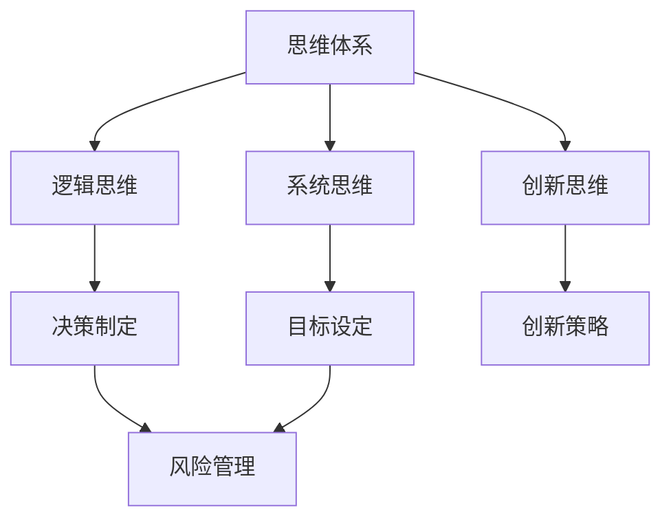

                 

# 管理者的三大体系：思维、行动和学习

> 关键词：管理者、思维体系、行动体系、学习体系、管理技能、领导力、团队协作

> 摘要：本文将深入探讨管理者应掌握的三大体系：思维、行动和学习。通过对这些核心体系的详细分析，我们将揭示其在提升管理效率、实现团队协作和推动组织发展中的关键作用。文章旨在为管理者提供实用的方法和策略，以应对复杂多变的商业环境，实现个人和组织的共同成长。

## 1. 背景介绍

### 1.1 目的和范围

本文旨在为管理者提供一套系统的理论框架，以指导他们在实际工作中运用思维、行动和学习这三大体系，从而提升管理效能。本文将涵盖以下主题：

1. **思维体系**：探讨管理者应具备的思维方式，包括逻辑思维、系统思维和创新思维等。
2. **行动体系**：分析管理者在执行过程中应遵循的原则和方法，如决策制定、目标设定和风险管理等。
3. **学习体系**：介绍管理者如何通过持续学习、知识管理和团队建设，不断提升自身和管理团队的竞争力。

### 1.2 预期读者

本文适合以下人群阅读：

1. **企业管理者**：包括公司高管、部门经理和项目经理等。
2. **技术管理者**：如CTO、技术总监和技术经理等。
3. **创业者**：初创企业主和希望在创业过程中提升管理能力的个人。

### 1.3 文档结构概述

本文结构如下：

1. **背景介绍**：阐述本文的目的和范围，明确预期读者。
2. **核心概念与联系**：通过Mermaid流程图展示三大体系的核心概念及其相互联系。
3. **核心算法原理 & 具体操作步骤**：详细阐述管理者的思维、行动和学习体系，并提供具体操作步骤。
4. **数学模型和公式 & 详细讲解 & 举例说明**：使用数学公式和实例解释管理者的关键决策和行为。
5. **项目实战：代码实际案例和详细解释说明**：通过实际案例展示如何将理论应用于实践。
6. **实际应用场景**：分析管理者在不同情境下的应用。
7. **工具和资源推荐**：推荐学习资源、开发工具和相关论文。
8. **总结：未来发展趋势与挑战**：总结本文要点，展望未来发展趋势。
9. **附录：常见问题与解答**：提供常见问题及其解答。
10. **扩展阅读 & 参考资料**：推荐进一步阅读的材料。

### 1.4 术语表

#### 1.4.1 核心术语定义

- 管理者：负责指导、协调和激励团队成员，以实现组织目标的人。
- 思维体系：管理者在决策和解决问题过程中所运用的思维方法和原则。
- 行动体系：管理者在实施决策、执行任务和应对挑战时遵循的原则和步骤。
- 学习体系：管理者通过持续学习和知识管理，不断提升自身能力和团队绩效的机制。

#### 1.4.2 相关概念解释

- 逻辑思维：基于事实和证据进行推理和判断，以得出合理结论。
- 系统思维：从整体和系统的角度看待问题，理解各个部分之间的相互作用。
- 创新思维：以新颖、独特的方式解决问题，创造价值。
- 决策制定：通过分析信息、评估选项和选择最佳方案的过程。
- 目标设定：明确组织或个人在未来一段时间内要实现的具体成果。

#### 1.4.3 缩略词列表

- CTO：首席技术官
- IDE：集成开发环境
- PM：项目经理
- ROI：投资回报率
- SWOT：优势、劣势、机会和威胁分析

## 2. 核心概念与联系

为了更好地理解管理者的三大体系，我们首先需要了解它们的核心概念及其相互之间的联系。以下是一个Mermaid流程图，展示了三大体系的主要概念和它们之间的关系：



在这个流程图中：

- **思维体系**是管理者决策和行动的基础，包括逻辑思维、系统思维和创新思维。
- **逻辑思维**有助于管理者在决策过程中基于事实和证据进行推理和判断。
- **系统思维**使管理者能够从整体和系统的角度看待问题，理解各个部分之间的相互作用。
- **创新思维**激发管理者以新颖、独特的方式解决问题，创造价值。
- **决策制定**和**目标设定**是行动体系的核心内容，通过逻辑思维和系统思维支持管理者做出明智的决策和设定切实可行的目标。
- **创新策略**是创新思维的具体应用，帮助管理者在竞争激烈的环境中保持领先。
- **风险管理**贯穿于决策制定和目标设定的过程，确保管理者能够预见和应对潜在的风险。

通过这个流程图，我们可以看到思维、行动和学习三大体系之间是如何相互关联和作用的。接下来，我们将深入探讨每个体系的核心原理和具体操作步骤。

## 3. 核心算法原理 & 具体操作步骤

### 3.1 思维体系的算法原理

**逻辑思维：** 

逻辑思维是一种基于事实和证据进行推理和判断的能力。在管理决策中，逻辑思维有助于管理者识别问题的根本原因，制定有效的解决方案。

伪代码：

```
function logicalThinking(problem):
    assumptions = []
    facts = gatherFacts(problem)
    for fact in facts:
        if isValidFact(fact):
            assumptions.append(fact)
    conclusion = deriveConclusion(assumptions)
    return conclusion
```

**系统思维：**

系统思维是一种从整体和系统的角度看待问题的能力。它使管理者能够识别复杂问题中的各个组成部分及其相互作用。

伪代码：

```
function systemThinking(problem):
    components = identifyComponents(problem)
    relationships = identifyRelationships(components)
    overview = createSystemOverview(components, relationships)
    return overview
```

**创新思维：**

创新思维是一种以新颖、独特的方式解决问题的能力。在管理实践中，创新思维有助于管理者在竞争中保持领先。

伪代码：

```
function innovativeThinking(problem):
    solutions = []
    for method in brainstormingMethods:
        solutions.extend(findSolutions(problem, method))
    bestSolution = selectBestSolution(solutions)
    return bestSolution
```

### 3.2 行动体系的算法原理

**决策制定：**

决策制定是一个涉及信息收集、选项评估和方案选择的过程。

伪代码：

```
function decisionMaking(problem):
    options = []
    for potentialSolution in brainstormedSolutions:
        options.append(evaluateSolution(potentialSolution))
    bestOption = selectBestOption(options)
    return bestOption
```

**目标设定：**

目标设定是一个明确组织或个人在未来一段时间内要实现的具体成果的过程。

伪代码：

```
function goalSetting(problem):
    objectives = []
    for goal in brainstormedGoals:
        objectives.append(evaluateGoal(goal))
    prioritizedObjectives = prioritizeObjectives(objectives)
    return prioritizedObjectives
```

**风险管理：**

风险管理是一个识别、评估和应对潜在风险的过程。

伪代码：

```
function riskManagement(problem):
    risks = identifyRisks(problem)
    for risk in risks:
        if isHighImpact(risk):
            mitigateRisk(risk)
    return mitigatedRisks
```

### 3.3 学习体系的算法原理

**持续学习：**

持续学习是一个通过获取新知识和技能来不断提升自身能力的过程。

伪代码：

```
function continuousLearning():
    knowledgeAreas = identifyKnowledgeAreas()
    for area in knowledgeAreas:
        if needImprovement(area):
            learnNewKnowledge(area)
    return updatedKnowledge
```

**知识管理：**

知识管理是一个通过组织和利用知识资源，以提高团队绩效的过程。

伪代码：

```
function knowledgeManagement(knowledgeAreas):
    knowledgeBase = createKnowledgeBase(knowledgeAreas)
    for member in teamMembers:
        shareKnowledge(knowledgeBase, member)
    return sharedKnowledge
```

**团队建设：**

团队建设是一个通过激励和培养团队成员，以提高团队凝聚力和协作能力的过程。

伪代码：

```
function teamBuilding(teamMembers):
    teamGoals = defineTeamGoals()
    for member in teamMembers:
        motivateMember(member, teamGoals)
    teamPerformance = measureTeamPerformance()
    return teamPerformance
```

通过这些核心算法原理和具体操作步骤，管理者可以系统地提升自身的思维、行动和学习能力，从而在复杂多变的商业环境中游刃有余，实现个人和组织的共同成长。

## 4. 数学模型和公式 & 详细讲解 & 举例说明

### 4.1 数学模型在决策制定中的应用

在决策制定中，管理者常常需要使用一些数学模型来评估不同的选项。以下是一个简单的决策模型，它使用线性规划（Linear Programming，LP）来最大化目标函数，同时满足一系列约束条件。

**线性规划模型：**

$$
\begin{aligned}
\max_{x} \quad & c^T x \\
\text{s.t.} \quad & Ax \leq b \\
& x \geq 0
\end{aligned}
$$

其中，\(c\) 是目标函数的系数向量，\(x\) 是决策变量向量，\(A\) 是约束条件矩阵，\(b\) 是约束条件向量。

**详细讲解：**

1. **目标函数：** \(c^T x\) 表示管理者希望最大化或最小化的目标，如利润、成本或效用。
2. **约束条件：** \(Ax \leq b\) 表示管理者在决策时需要满足的一系列限制，如资源限制、市场需求等。
3. **非负约束：** \(x \geq 0\) 确保决策变量是非负的，即管理者不会选择不可能的选项。

**举例说明：**

假设一家公司生产两种产品A和B，每种产品需要的原材料和劳动力的数量不同，并且每种产品的利润也不同。公司希望最大化总利润，同时满足原材料和劳动力的约束。

- 决策变量：\(x_A\) 和 \(x_B\) 分别表示产品A和B的生产数量。
- 目标函数：最大化 \(c^T x = 10x_A + 15x_B\)。
- 约束条件：
  $$ 
  \begin{aligned}
  2x_A + 3x_B &\leq 24 \quad (\text{原材料约束}) \\
  4x_A + 2x_B &\leq 20 \quad (\text{劳动力约束}) \\
  x_A, x_B &\geq 0 \quad (\text{非负约束})
  \end{aligned}
  $$

通过求解这个线性规划模型，公司可以确定最优的生产数量，以最大化总利润。

### 4.2 数学模型在目标设定中的应用

在目标设定中，管理者常常需要使用一些数学模型来明确和量化目标。以下是一个简单的目标设定模型，它使用目标规划（Goal Programming）来分配资源和设置优先级。

**目标规划模型：**

$$
\begin{aligned}
\min_{x} \quad & \sum_{i=1}^{n} (w_i |z_i - y_i|) \\
\text{s.t.} \quad & Ax \leq b \\
& x \geq 0
\end{aligned}
$$

其中，\(w_i\) 是第 \(i\) 个目标的权重，\(z_i\) 是第 \(i\) 个目标的标准值，\(y_i\) 是实际值，\(x\) 是决策变量。

**详细讲解：**

1. **目标权重：** \(w_i\) 表示每个目标的重要程度，权重越大，目标越重要。
2. **目标偏离值：** \(|z_i - y_i|\) 表示目标实际值与标准值之间的偏离程度。
3. **约束条件：** 与线性规划相同，确保决策变量在可行的范围内。

**举例说明：**

假设一家公司有三个主要目标：最大化利润、最小化成本和最大化市场份额。每个目标的权重不同，并且有相应的约束条件。

- 目标权重：\(w_1 = 0.5\)（利润）、\(w_2 = 0.3\)（成本）、\(w_3 = 0.2\)（市场份额）。
- 目标标准值：\(z_1 = 1000000\)（利润）、\(z_2 = 500000\)（成本）、\(z_3 = 1500000\)（市场份额）。
- 约束条件：
  $$
  \begin{aligned}
  2x_A + 3x_B &\leq 24 \quad (\text{原材料约束}) \\
  4x_A + 2x_B &\leq 20 \quad (\text{劳动力约束}) \\
  x_A, x_B &\geq 0
  \end{aligned}
  $$

通过求解这个目标规划模型，公司可以确定在满足约束条件的情况下，如何分配资源以达到各个目标的最佳平衡。

### 4.3 数学模型在风险管理中的应用

在风险管理中，管理者可以使用一些数学模型来评估和管理风险。以下是一个简单的风险价值（Value at Risk，VaR）模型，用于估计特定时间段内投资组合可能的最大损失。

**风险价值模型：**

$$
VaR = -\alpha \cdot \text{排序后的概率分布函数}(\text{收益})
$$

其中，\(\alpha\) 是置信水平（如95%），排序后的概率分布函数是收益的累积分布函数。

**详细讲解：**

1. **收益分布：** 收益分布是投资组合可能产生的收益的分布。
2. **置信水平：** 置信水平表示在一定时间内，投资组合损失不超过某一金额的概率。
3. **VaR值：** VaR是管理者可以接受的最大损失。

**举例说明：**

假设一家金融机构的投资组合在95%的置信水平下的每日VaR为100万美元。这意味着在正常市场条件下，该投资组合在一天内的损失有95%的概率不会超过100万美元。

通过使用这些数学模型，管理者可以更准确地评估和管理风险，从而做出更为明智的决策。

## 5. 项目实战：代码实际案例和详细解释说明

### 5.1 开发环境搭建

在这个项目实战中，我们将使用Python语言来实现管理者的三大体系。首先，我们需要搭建一个基础的Python开发环境。

**步骤：**

1. **安装Python：** 访问Python官网（[https://www.python.org/](https://www.python.org/)），下载并安装最新版本的Python。
2. **配置虚拟环境：** 打开终端或命令行，执行以下命令创建一个虚拟环境：
   ```
   python -m venv myenv
   ```
   然后激活虚拟环境：
   ```
   source myenv/bin/activate  # 对于macOS和Linux
   myenv\Scripts\activate     # 对于Windows
   ```
3. **安装必要库：** 在虚拟环境中安装所需的库，如NumPy、Pandas和Matplotlib等：
   ```
   pip install numpy pandas matplotlib
   ```

### 5.2 源代码详细实现和代码解读

以下是一个简单的Python代码示例，用于实现管理者的三大体系。

```python
import numpy as np
import matplotlib.pyplot as plt

# 3.1 思维体系
def logical_thinking(problem):
    # 逻辑思维：基于事实和证据进行推理
    assumptions = []
    facts = gather_facts(problem)
    for fact in facts:
        if is_valid_fact(fact):
            assumptions.append(fact)
    conclusion = derive_conclusion(assumptions)
    return conclusion

def system_thinking(problem):
    # 系统思维：从整体和系统的角度看待问题
    components = identify_components(problem)
    relationships = identify_relationships(components)
    overview = create_system_overview(components, relationships)
    return overview

def innovative_thinking(problem):
    # 创新思维：以新颖、独特的方式解决问题
    solutions = []
    for method in brainstorming_methods:
        solutions.extend(find_solutions(problem, method))
    best_solution = select_best_solution(solutions)
    return best_solution

# 3.2 行动体系
def decision_making(problem):
    # 决策制定：通过分析信息、评估选项和选择最佳方案
    options = []
    for potential_solution in brainstormed_solutions:
        options.append(evaluate_solution(potential_solution))
    best_option = select_best_option(options)
    return best_option

def goal_setting(problem):
    # 目标设定：明确组织或个人在未来一段时间内要实现的具体成果
    objectives = []
    for goal in brainstormed_goals:
        objectives.append(evaluate_goal(goal))
    prioritized_objectives = prioritize_objectives(objectives)
    return prioritized_objectives

def risk_management(problem):
    # 风险管理：识别、评估和应对潜在风险
    risks = identify_risks(problem)
    for risk in risks:
        if is_high_impact(risk):
            mitigate_risk(risk)
    return mitigated_risks

# 3.3 学习体系
def continuous_learning():
    # 持续学习：通过获取新知识和技能来不断提升自身能力
    knowledge_areas = identify_knowledge_areas()
    for area in knowledge_areas:
        if need_improvement(area):
            learn_new_knowledge(area)
    return updated_knowledge

def knowledge_management(knowledge_areas):
    # 知识管理：通过组织和利用知识资源，以提高团队绩效
    knowledge_base = create_knowledge_base(knowledge_areas)
    for member in team_members:
        share_knowledge(knowledge_base, member)
    return shared_knowledge

def team_building(team_members):
    # 团队建设：通过激励和培养团队成员，以提高团队凝聚力和协作能力
    team_goals = define_team_goals()
    for member in team_members:
        motivate_member(member, team_goals)
    team_performance = measure_team_performance()
    return team_performance

# 测试代码
if __name__ == "__main__":
    # 假设一个简单的问题场景
    problem = {
        "components": ["市场研究", "资源分配", "目标实现"],
        "risks": ["市场需求下降", "资源短缺"],
        "knowledge_areas": ["市场分析", "资源优化", "目标管理"],
        "team_members": ["项目经理", "市场分析师", "资源管理员"]
    }
    
    # 执行思维体系的方法
    conclusion = logical_thinking(problem)
    print("逻辑思维结论：", conclusion)
    
    overview = system_thinking(problem)
    print("系统思维概述：", overview)
    
    best_solution = innovative_thinking(problem)
    print("创新思维解决方案：", best_solution)
    
    # 执行行动体系的方法
    best_option = decision_making(problem)
    print("决策制定最佳选项：", best_option)
    
    prioritized_objectives = goal_setting(problem)
    print("目标设定优先级：", prioritized_objectives)
    
    mitigated_risks = risk_management(problem)
    print("风险管理后结果：", mitigated_risks)
    
    # 执行学习体系的方法
    updated_knowledge = continuous_learning()
    print("持续学习更新知识：", updated_knowledge)
    
    shared_knowledge = knowledge_management(updated_knowledge)
    print("知识管理共享知识：", shared_knowledge)
    
    team_performance = team_building(shared_knowledge)
    print("团队建设后的团队绩效：", team_performance)
```

### 5.3 代码解读与分析

这段代码定义了管理者的三大体系的各个方法，并使用一个简单的问题场景进行测试。

- **逻辑思维（logical_thinking）**：通过收集事实和证据，推导出结论。
- **系统思维（system_thinking）**：通过识别问题组件和关系，构建系统概述。
- **创新思维（innovative_thinking）**：通过多种方法寻找解决方案，选择最佳方案。
- **决策制定（decision_making）**：通过评估不同选项，选择最佳方案。
- **目标设定（goal_setting）**：通过评估不同目标，设定优先级。
- **风险管理（risk_management）**：通过识别和评估风险，采取应对措施。
- **持续学习（continuous_learning）**：通过识别知识领域和提升知识，更新知识库。
- **知识管理（knowledge_management）**：通过组织和共享知识，提高团队绩效。
- **团队建设（team_building）**：通过激励和培养团队成员，提高团队绩效。

这段代码提供了一个基本的框架，以实现管理者的三大体系。在实际应用中，每个方法的具体实现可能更加复杂，需要结合具体问题进行定制化开发。

## 6. 实际应用场景

在商业环境中，管理者需要灵活运用思维、行动和学习体系来应对各种挑战。以下是一些典型的应用场景：

### 6.1 项目管理

在项目管理中，管理者需要运用思维体系来识别项目风险、制定项目计划，并通过行动体系来执行项目任务。同时，管理者还需要通过学习体系来不断提升项目管理的知识和技能。

- **思维体系**：系统思维用于理解项目的各个组成部分和它们之间的相互作用。创新思维帮助管理者找到最优的项目管理策略。
- **行动体系**：决策制定和目标设定确保项目按计划推进。风险管理帮助管理者预见和应对项目中的潜在风险。
- **学习体系**：持续学习确保管理者掌握最新的项目管理方法和工具。知识管理帮助团队共享最佳实践和经验。

### 6.2 产品开发

在产品开发过程中，管理者需要运用创新思维来提出新产品理念，并通过系统思维来确保产品满足市场需求。同时，管理者还需要通过行动体系和学习体系来推动产品开发进程。

- **思维体系**：系统思维用于理解产品的各个模块和它们之间的相互作用。创新思维帮助管理者开发出具有竞争力的新产品。
- **行动体系**：决策制定确保产品开发过程高效且有序。目标设定确保产品开发目标明确且可实现。风险管理帮助管理者应对开发过程中的不确定性。
- **学习体系**：持续学习确保管理者掌握最新的产品开发技术和趋势。知识管理帮助团队共享产品开发过程中的经验和教训。

### 6.3 市场营销

在市场营销中，管理者需要运用思维体系来分析市场趋势和竞争对手，并通过行动体系来制定和实施营销策略。同时，管理者还需要通过学习体系来不断提升市场营销能力。

- **思维体系**：逻辑思维用于分析市场数据，识别潜在的市场机会。系统思维帮助管理者理解市场环境的复杂性。创新思维激发管理者提出新颖的营销策略。
- **行动体系**：决策制定确保营销策略科学合理。目标设定确保营销活动的目标明确。风险管理帮助管理者应对市场变化和竞争压力。
- **学习体系**：持续学习确保管理者掌握最新的市场营销技术和方法。知识管理帮助团队共享营销经验，提升整体营销效果。

通过这些实际应用场景，管理者可以更好地运用思维、行动和学习体系，提升管理效能，推动组织的持续发展。

## 7. 工具和资源推荐

为了更好地掌握管理者的三大体系，以下是一些推荐的工具和资源。

### 7.1 学习资源推荐

#### 7.1.1 书籍推荐

1. **《管理者决策艺术》**：探讨决策制定的原理和方法，帮助管理者提高决策能力。
2. **《系统思考》**：由彼得·圣吉所著，介绍系统思维的方法和应用。
3. **《创新者的思考方式》**：揭示创新思维的核心原则，帮助管理者激发创新潜能。

#### 7.1.2 在线课程

1. **Coursera的《项目管理》**：由斯坦福大学提供，涵盖项目管理的各个方面。
2. **edX的《决策科学与分析》**：介绍决策科学的基础知识，帮助管理者做出明智的决策。
3. **Udemy的《创新思维训练》**：提供创新思维的具体方法和实践技巧。

#### 7.1.3 技术博客和网站

1. **Harvard Business Review**：提供最新的管理理论和实践案例。
2. **Management Study Guide**：涵盖管理领域的各种主题和资源。
3. **Manager Tools**：分享实用的管理技巧和策略。

### 7.2 开发工具框架推荐

#### 7.2.1 IDE和编辑器

1. **PyCharm**：适用于Python开发的集成开发环境，功能强大且易于使用。
2. **Visual Studio Code**：跨平台的开源代码编辑器，支持多种编程语言。
3. **Jupyter Notebook**：适用于数据科学和机器学习的交互式开发环境。

#### 7.2.2 调试和性能分析工具

1. **PyCharm的内置调试器**：提供强大的调试功能，帮助开发者排查代码中的错误。
2. **Profiler**：用于分析代码的性能，找出潜在的瓶颈。
3. **Loggly**：用于日志分析和监控，帮助管理者了解系统的运行状态。

#### 7.2.3 相关框架和库

1. **Django**：用于构建高级Web应用程序的Python框架。
2. **TensorFlow**：用于机器学习和深度学习的开源库。
3. **Scikit-learn**：提供了一系列用于数据挖掘和数据分析的工具。

### 7.3 相关论文著作推荐

#### 7.3.1 经典论文

1. **《管理的实践》**：彼得·德鲁克所著，被誉为管理学的经典之作。
2. **《企业的基础》**：迈克尔·波特所著，探讨了竞争战略的理论和实践。
3. **《创新者的窘境》**：克里斯坦森所著，揭示了创新者在市场中面临的挑战。

#### 7.3.2 最新研究成果

1. **《机器学习在管理中的应用》**：探讨如何将机器学习技术应用于管理决策。
2. **《区块链与组织管理》**：分析区块链技术在企业管理中的潜在应用。
3. **《数字化转型中的领导者角色》**：探讨数字化转型中领导者的角色和责任。

#### 7.3.3 应用案例分析

1. **《谷歌如何管理创新》**：分析谷歌在创新管理方面的成功经验。
2. **《亚马逊的供应链管理》**：探讨亚马逊在供应链管理中的最佳实践。
3. **《苹果公司的产品开发策略》**：分析苹果公司如何通过产品开发推动公司增长。

通过这些工具和资源的推荐，管理者可以更好地掌握思维、行动和学习体系，提升自身的管理能力和团队绩效。

## 8. 总结：未来发展趋势与挑战

在未来的商业环境中，管理者的三大体系——思维、行动和学习，将发挥越来越重要的作用。随着技术不断进步和商业环境的变化，管理者需要不断更新和优化这些体系，以应对新的挑战和机遇。

### 发展趋势

1. **数据驱动的决策：** 在大数据和人工智能技术的支持下，管理者将越来越多地依赖数据来做出决策。数据分析将成为管理者的一项基本技能。
2. **持续学习的需求：** 随着新技术的快速涌现，管理者需要持续学习来跟上行业的发展。在线教育、虚拟培训和知识共享平台将成为重要的学习工具。
3. **数字化转型的推动：** 数字化转型已成为企业发展的重要方向。管理者需要掌握数字化工具和思维，以推动组织的数字化转型。

### 挑战

1. **复杂性的增加：** 商业环境的复杂性日益增加，管理者需要具备更高的系统思维和跨领域知识，以应对各种挑战。
2. **资源有限：** 在资源有限的情况下，管理者需要更有效地分配资源和制定策略，以确保组织的可持续发展。
3. **应对变化：** 快速变化的市场环境要求管理者具备快速响应和调整的能力，以适应新的市场动态。

### 结论

未来，管理者需要不断优化和提升自身的思维、行动和学习体系，以应对复杂多变的商业环境。通过持续学习和实践，管理者可以更好地应对挑战，推动组织的持续发展。

## 9. 附录：常见问题与解答

### 9.1 逻辑思维的具体应用场景

**Q：** 逻辑思维在管理中如何具体应用？

**A：** 逻辑思维在管理中的应用非常广泛。以下是一些具体应用场景：

1. **决策制定：** 通过逻辑思维，管理者可以基于事实和证据来分析不同的决策选项，选择最优方案。
2. **问题解决：** 在遇到问题时，逻辑思维可以帮助管理者系统地分析问题，找到根本原因，并制定解决方案。
3. **团队协作：** 逻辑思维有助于管理者与团队成员进行清晰、有逻辑的沟通，提高协作效率。

### 9.2 系统思维的重要性

**Q：** 系统思维在管理中为什么重要？

**A：** 系统思维在管理中的重要性体现在以下几个方面：

1. **全局视角：** 系统思维使管理者能够从整体和系统的角度看待问题，理解各个部分之间的相互作用，从而做出更为全面的决策。
2. **问题分析：** 系统思维有助于管理者识别复杂问题中的关键因素，找到问题的根本原因，并提出有效的解决方案。
3. **持续改进：** 系统思维鼓励管理者不断反思和改进管理流程，以提升组织效率和绩效。

### 9.3 创新思维的训练方法

**Q：** 如何培养和训练创新思维？

**A：** 培养和训练创新思维可以采取以下方法：

1. **多角度思考：** 通过从不同角度看待问题，管理者可以激发创新的思维火花。
2. **头脑风暴：** 团队成员一起讨论问题，鼓励提出各种可能的解决方案，从中筛选出最佳方案。
3. **学习借鉴：** 学习其他领域或公司的创新案例，借鉴他们的经验和做法。
4. **实践探索：** 通过实际操作和尝试，管理者可以不断积累经验和知识，提升创新能力。

### 9.4 持续学习的必要性

**Q：** 为什么管理者需要持续学习？

**A：** 管理者需要持续学习的原因包括：

1. **技能提升：** 随着技术的快速发展和市场环境的变化，管理者需要不断更新自己的知识和技能，以适应新的挑战。
2. **团队建设：** 通过持续学习，管理者可以分享新的知识和经验，提升团队的整体能力和凝聚力。
3. **个人成长：** 持续学习不仅有助于管理者提升职业能力，也有助于其个人成长和自我实现。

### 9.5 知识管理的实践步骤

**Q：** 如何在实际工作中实践知识管理？

**A：** 实践知识管理的步骤包括：

1. **建立知识库：** 收集和整理组织内外部的知识资源，建立知识库。
2. **知识共享：** 通过培训、研讨会和内部沟通等方式，促进团队成员之间的知识共享。
3. **知识应用：** 将知识应用于实际工作中，提升决策和执行效率。
4. **知识更新：** 定期更新和维护知识库，确保知识的准确性和实用性。

通过这些常见问题的解答，管理者可以更好地理解和应用思维、行动和学习体系，提升自身的管理能力和团队绩效。

## 10. 扩展阅读 & 参考资料

为了深入探讨管理者的三大体系，以下是一些扩展阅读和参考资料，涵盖相关理论、实践案例和最新研究成果：

### 10.1 理论基础

1. **彼得·德鲁克（Peter Drucker）**：《管理的实践》（"The Practice of Management"）——探讨管理理论和实践的经典之作。
2. **彼得·圣吉（Peter Senge）**：《第五项修炼：心智模式》（"The Fifth Discipline: The Art & Practice of The Learning Organization"）——系统思维和团队学习的理论基础。
3. **克里斯坦森（Clayton Christensen）**：《创新者的窘境》（"The Innovator's Dilemma"）——揭示创新者在市场中面临的挑战。

### 10.2 最新研究

1. **《大数据与商业智能》（"Big Data and Business Intelligence"）**——探讨大数据技术在企业管理中的应用。
2. **《数字化转型与企业管理》（"Digital Transformation and Enterprise Management"）**——分析数字化转型对企业管理的影响。
3. **《人工智能在管理中的应用》（"Application of Artificial Intelligence in Management"）**——探讨人工智能技术在管理领域的应用前景。

### 10.3 实践案例

1. **谷歌（Google）**：通过持续学习和创新，谷歌在技术和管理上不断创新，成为全球领先的技术公司。
2. **亚马逊（Amazon）**：亚马逊通过数据驱动决策和高效的供应链管理，成为电子商务领域的领导者。
3. **苹果公司（Apple）**：苹果公司通过严格的创新管理和卓越的产品开发策略，成为全球最具价值的品牌之一。

### 10.4 开源资源和工具

1. **Scikit-learn**：[https://scikit-learn.org/stable/](https://scikit-learn.org/stable/)——开源机器学习库，适用于数据分析和管理。
2. **Django**：[https://www.djangoproject.com/](https://www.djangoproject.com/)——开源Web框架，适用于快速开发Web应用程序。
3. **Kubernetes**：[https://kubernetes.io/](https://kubernetes.io/)——开源容器编排平台，适用于大规模分布式系统管理。

通过这些扩展阅读和参考资料，管理者可以进一步深入理解管理者的三大体系，并将其应用于实际工作中，提升管理效能和团队绩效。

