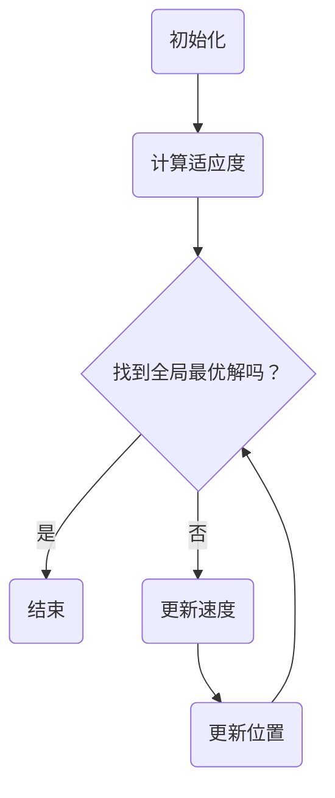

                 

# 粒子群算法（Particle Swarm Optimization） - 原理与代码实例讲解

## 关键词
粒子群优化，PSO，智能优化算法，全局寻优，人工智能，动态优化问题，计算机编程

## 摘要
本文将深入探讨粒子群优化（Particle Swarm Optimization，PSO）算法的基本原理、数学模型以及其在实际项目中的应用。读者将跟随文章的逐步讲解，从核心概念出发，掌握PSO算法的工作机制，理解其在解决复杂优化问题中的优势，并通过具体的代码实例了解其实现过程。本文适合对智能优化算法有兴趣的读者，无论您是初学者还是专业人士，都将在这篇文章中找到有价值的信息。

## 1. 背景介绍

### 1.1 目的和范围
粒子群优化算法（PSO）是近年来在智能优化领域取得显著进展的一种算法。其设计初衷是为了模拟鸟群觅食行为，通过个体之间的协同作用来寻找最优解。本文旨在详细介绍PSO算法，帮助读者理解其原理、数学模型和实现方法，并探讨其在实际项目中的应用。

### 1.2 预期读者
本文适合对人工智能、优化算法感兴趣的读者，包括但不限于计算机科学专业的学生、研究人员和工程师。同时，对于希望提升自身算法设计能力的开发者，本文也将提供有价值的参考。

### 1.3 文档结构概述
本文分为十个部分，包括背景介绍、核心概念与联系、算法原理、数学模型、实战案例、应用场景、工具推荐、总结和附录。每一部分都将围绕PSO算法进行深入探讨，帮助读者逐步掌握这一优化算法。

### 1.4 术语表
#### 1.4.1 核心术语定义
- **粒子群优化（PSO）**：一种基于群体智能的优化算法，通过模拟鸟群觅食行为来寻找最优解。
- **个体（Particle）**：算法中的基本优化单元，代表问题的潜在解。
- **位置（Position）**：个体在问题空间中的坐标，表示当前解。
- **速度（Velocity）**：个体位置的更新速度，表示解的改进方向。

#### 1.4.2 相关概念解释
- **全局最优解（Global Best Position）**：整个群体中找到的最佳解。
- **个体最优解（Personal Best Position）**：每个个体找到的最好解。
- **惯性权重（Inertia Weight）**：控制个体速度的权重，影响算法的全局搜索能力和局部搜索能力。

#### 1.4.3 缩略词列表
- **PSO**：Particle Swarm Optimization（粒子群优化）
- **GA**：Genetic Algorithm（遗传算法）
- **SA**：Simulated Annealing（模拟退火）

## 2. 核心概念与联系

为了更好地理解粒子群优化算法，我们首先需要明确几个核心概念，并展示其相互关系。

### 2.1 核心概念

- **粒子**：粒子是PSO算法中的基本优化单元，每个粒子代表一个潜在解。
- **位置**：粒子在问题空间中的位置，通常用一组坐标表示。
- **速度**：粒子位置的变化速度，表示解的改进方向。
- **适应度**：粒子在当前位置上的解质量，通常用来评价解的好坏。

### 2.2 算法原理

粒子群优化算法的核心思想是通过模拟鸟群觅食行为来寻找最优解。具体来说，每个粒子在搜索过程中，不仅依赖于自身的经验，还会受到群体中其他粒子的指导。这种个体与个体之间的协同作用，使得粒子群能够在搜索空间中快速收敛到最优解。

### 2.3 Mermaid 流程图

以下是一个简化的PSO算法流程图：



### 2.4 核心概念与联系

- **个体最优解**：每个粒子在搜索过程中会记录自己找到的最好解。
- **全局最优解**：整个群体中找到的最佳解，用于指导粒子的搜索方向。
- **速度更新**：根据个体最优解和全局最优解来更新粒子的速度，从而影响粒子的位置更新。
- **位置更新**：根据粒子的速度来更新其在问题空间中的位置。

通过以上核心概念和流程图的讲解，读者可以初步了解粒子群优化算法的基本原理和运作机制。

## 3. 核心算法原理 & 具体操作步骤

### 3.1 算法原理

粒子群优化算法（PSO）的基本原理来源于对鸟群觅食行为的模拟。在这个模型中，每个粒子代表一个潜在解，粒子在搜索空间中通过更新位置和速度来逼近最优解。以下是PSO算法的基本原理：

1. **初始化**：随机生成粒子群，每个粒子都有其初始位置和速度。
2. **适应度评估**：计算每个粒子的适应度，通常用目标函数的值来表示。
3. **个体最优解更新**：每个粒子会记录自己的最优解。
4. **全局最优解更新**：整个群体会记录全局最优解。
5. **速度更新**：根据个体最优解和全局最优解来更新粒子的速度。
6. **位置更新**：根据粒子的速度来更新其在问题空间中的位置。
7. **迭代**：重复上述步骤，直到满足停止条件（如达到最大迭代次数或适应度收敛）。

### 3.2 伪代码

以下是一个简化的PSO算法伪代码：

```plaintext
初始化粒子群
计算每个粒子的初始适应度
初始化个体最优解和全局最优解
while (未达到停止条件) do {
    for 每个粒子 do {
        计算适应度
        更新个体最优解
    }
    更新全局最优解
    更新速度
    更新位置
}
输出全局最优解
```

### 3.3 具体操作步骤

下面我们将详细讲解PSO算法的具体操作步骤：

1. **初始化粒子群**：
   - 随机生成粒子群，每个粒子都有其初始位置和速度。
   - 确定问题空间的大小和维度。

2. **计算适应度**：
   - 对每个粒子计算其适应度，通常使用目标函数的值作为适应度。
   - 适应度越低（或越高），表示解的质量越好。

3. **个体最优解更新**：
   - 每个粒子会记录自己的最优解，初始时为当前解。
   - 如果当前解的适应度更好，则更新个体最优解。

4. **全局最优解更新**：
   - 整个群体会记录全局最优解。
   - 如果某个粒子的个体最优解优于当前的全局最优解，则更新全局最优解。

5. **速度更新**：
   - 粒子的速度更新由个体最优解和全局最优解共同决定。
   - 更新公式通常为：$v_{new} = w \cdot v_{old} + c_1 \cdot r_1 \cdot (pbest_i - x_i) + c_2 \cdot r_2 \cdot (gbest - x_i)$，
   - 其中，$v_{new}$ 和 $v_{old}$ 分别表示新旧速度，$pbest_i$ 和 $gbest$ 分别表示个体最优解和全局最优解，$x_i$ 表示粒子当前位置，$w$ 为惯性权重，$c_1$ 和 $c_2$ 为认知和社会两个常数，$r_1$ 和 $r_2$ 为随机数。

6. **位置更新**：
   - 粒子的位置更新根据速度来计算：
   - $x_{new} = x_{old} + v_{new}$。

7. **迭代**：
   - 重复上述步骤，直到满足停止条件（如达到最大迭代次数或适应度收敛）。

通过以上步骤，粒子群优化算法能够在搜索空间中不断逼近最优解。

## 4. 数学模型和公式 & 详细讲解 & 举例说明

### 4.1 数学模型

粒子群优化算法的核心在于粒子的速度和位置的更新公式。以下是一个标准的PSO算法的数学模型：

$$
v_{new} = w \cdot v_{old} + c_1 \cdot r_1 \cdot (pbest_i - x_i) + c_2 \cdot r_2 \cdot (gbest - x_i)
$$

$$
x_{new} = x_{old} + v_{new}
$$

其中：
- \( v_{new} \) 和 \( v_{old} \) 分别表示新旧速度。
- \( pbest_i \) 表示第 \( i \) 个粒子的个体最优解。
- \( gbest \) 表示全局最优解。
- \( x_i \) 表示第 \( i \) 个粒子的当前位置。
- \( w \) 是惯性权重，用于平衡全局和局部搜索。
- \( c_1 \) 和 \( c_2 \) 是认知和社会两个常数，通常设为2。
- \( r_1 \) 和 \( r_2 \) 是两个随机数，范围为 [0, 1]。

### 4.2 公式详解

#### 惯性权重（Inertia Weight）

惯性权重 \( w \) 的作用是平衡全局和局部搜索能力。在算法初期，较大 \( w \) 值有助于全局搜索，而在算法后期，较小 \( w \) 值有助于局部搜索。常用的惯性权重更新公式如下：

$$
w_{new} = w_{max} - \frac{w_{max} - w_{min}}{iter_{max} - iter}
$$

其中：
- \( w_{max} \) 是最大惯性权重。
- \( w_{min} \) 是最小惯性权重。
- \( iter_{max} \) 是最大迭代次数。
- \( iter \) 是当前迭代次数。

#### 更新速度和位置

速度更新公式：

$$
v_{new} = w \cdot v_{old} + c_1 \cdot r_1 \cdot (pbest_i - x_i) + c_2 \cdot r_2 \cdot (gbest - x_i)
$$

其中：
- \( v_{old} \) 是旧速度。
- \( pbest_i \) 是第 \( i \) 个粒子的个体最优解。
- \( gbest \) 是全局最优解。
- \( x_i \) 是第 \( i \) 个粒子的当前位置。
- \( r_1 \) 和 \( r_2 \) 是两个随机数。

位置更新公式：

$$
x_{new} = x_{old} + v_{new}
$$

其中：
- \( x_{old} \) 是旧位置。
- \( v_{new} \) 是新速度。

### 4.3 举例说明

假设我们有三个粒子，分别位于 \( x_1 = [1, 2, 3] \)，\( x_2 = [2, 3, 4] \)，和 \( x_3 = [3, 4, 5] \)。个体最优解分别为 \( pbest_1 = [1, 2, 3] \)，\( pbest_2 = [2, 3, 4] \)，和 \( pbest_3 = [3, 4, 5] \)。全局最优解为 \( gbest = [3, 4, 5] \)。

#### 惯性权重

初始惯性权重 \( w = 0.9 \)，最大迭代次数 \( iter_{max} = 100 \)，当前迭代次数 \( iter = 50 \)。惯性权重更新为：

$$
w_{new} = 0.9 - \frac{0.9 - 0.4}{100 - 50} = 0.7
$$

#### 速度更新

对于粒子 1：

$$
v_{new1} = 0.7 \cdot v_{old1} + 2 \cdot r_1 \cdot (pbest_1 - x_1) + 2 \cdot r_2 \cdot (gbest - x_1)
$$

其中，\( v_{old1} = [0.5, 0.5, 0.5] \)，\( pbest_1 - x_1 = [-1, -1, -1] \)，\( gbest - x_1 = [2, 2, 2] \)，\( r_1 = 0.8 \)，\( r_2 = 0.3 \)。计算得：

$$
v_{new1} = 0.7 \cdot [0.5, 0.5, 0.5] + 2 \cdot 0.8 \cdot [-1, -1, -1] + 2 \cdot 0.3 \cdot [2, 2, 2] = [0.5, 0.5, 0.5] - [1.6, 1.6, 1.6] + [1.2, 1.2, 1.2] = [-0.3, -0.3, -0.3]
$$

同理，对于粒子 2 和粒子 3：

$$
v_{new2} = [-0.3, -0.3, -0.3]
$$

$$
v_{new3} = [0.3, 0.3, 0.3]
$$

#### 位置更新

对于粒子 1：

$$
x_{new1} = x_{old1} + v_{new1} = [1, 2, 3] + [-0.3, -0.3, -0.3] = [0.7, 1.7, 2.7]
$$

同理，对于粒子 2 和粒子 3：

$$
x_{new2} = [1.7, 2.7, 3.7]
$$

$$
x_{new3} = [3.7, 4.7, 5.7]
$$

通过以上步骤，粒子的位置和速度更新完毕。这个过程将重复进行，直到达到停止条件。

## 5. 项目实战：代码实际案例和详细解释说明

### 5.1 开发环境搭建

在进行粒子群优化算法的项目实战之前，我们需要搭建一个适合的开发环境。以下是推荐的开发工具和框架：

- **编程语言**：Python，因为其丰富的科学计算库和易于理解的语法。
- **科学计算库**：NumPy、SciPy、matplotlib，用于高效地进行数学运算和数据可视化。
- **IDE**：PyCharm或Visual Studio Code，提供良好的代码编辑和调试功能。

### 5.2 源代码详细实现和代码解读

下面是使用Python实现粒子群优化算法的完整代码，并对其进行详细解读。

#### 5.2.1 代码实现

```python
import numpy as np
import matplotlib.pyplot as plt

# 粒子群优化算法实现
def particle_swarm_optimization(func, bounds, num_particles, max_iterations, w=0.9, c1=2, c2=2):
    # 初始化粒子群
    particles = np.random.uniform(bounds[0], bounds[1], (num_particles, len(bounds)))
    velocities = np.zeros((num_particles, len(bounds)))
    pbest_positions = np.copy(particles)
    pbest_scores = np.apply_along_axis(func, 1, pbest_positions)
    gbest_position = pbest_positions[np.argmin(pbest_scores)]
    gbest_score = np.min(pbest_scores)
    
    # 迭代过程
    for _ in range(max_iterations):
        # 更新速度
        velocities = w * velocities + c1 * np.random.rand(num_particles, len(bounds)) * (pbest_positions - particles) + c2 * np.random.rand(num_particles, len(bounds)) * (gbest_position - particles)
        
        # 更新位置
        particles = particles + velocities
        
        # 确保粒子在边界内
        particles = np.clip(particles, bounds[0], bounds[1])
        
        # 更新个体最优解和全局最优解
        current_scores = np.apply_along_axis(func, 1, particles)
        for i in range(num_particles):
            if current_scores[i] < pbest_scores[i]:
                pbest_positions[i] = particles[i]
                pbest_scores[i] = current_scores[i]
            if current_scores[i] < gbest_score:
                gbest_position = particles[i]
                gbest_score = current_scores[i]
    
    return gbest_position, gbest_score

# 目标函数
def sphere(x):
    return sum([xi**2 for xi in x])

# 参数设置
bounds = (-10, 10)
num_particles = 30
max_iterations = 100

# 运行算法
gbest_position, gbest_score = particle_swarm_optimization(sphere, bounds, num_particles, max_iterations)
print("全局最优解：", gbest_position)
print("全局最优解的适应度：", gbest_score)

# 可视化
x = np.linspace(bounds[0], bounds[1], 300)
y = np.linspace(bounds[0], bounds[1], 300)
X, Y = np.meshgrid(x, y)
Z = sphere([X, Y])

plt.figure(figsize=(8, 6))
plt.contour(X, Y, Z, 100, colors='black')
plt.scatter(gbest_position[0], gbest_position[1], color='red', label='Global Best')
plt.xlabel('X')
plt.ylabel('Y')
plt.title('Sphere Function with PSO')
plt.legend()
plt.show()
```

#### 5.2.2 代码解读

1. **函数定义**：
   - `particle_swarm_optimization` 函数接受目标函数 `func`、边界 `bounds`、粒子数量 `num_particles`、最大迭代次数 `max_iterations`、惯性权重 `w`、认知常数 `c1` 和社会常数 `c2` 作为参数。

2. **初始化**：
   - 随机生成粒子群和初始速度。
   - 计算每个粒子的个体最优解和全局最优解。

3. **迭代过程**：
   - 更新速度和位置。
   - 确保粒子在边界内。
   - 更新个体最优解和全局最优解。

4. **目标函数**：
   - 使用了简单的球形函数 `sphere` 作为目标函数。

5. **参数设置**：
   - 设置了边界、粒子数量和最大迭代次数。

6. **运行算法**：
   - 调用 `particle_swarm_optimization` 函数并打印结果。

7. **可视化**：
   - 使用 matplotlib 对目标函数进行可视化，并标出全局最优解。

通过以上代码，读者可以直观地看到粒子群优化算法在实际项目中的应用。这个案例展示了如何使用Python和相关的科学计算库来实现PSO算法，并通过可视化来分析其性能。

## 6. 实际应用场景

粒子群优化算法（PSO）由于其简单高效的特点，在众多实际应用场景中得到了广泛的应用。以下是几个典型的应用场景：

### 6.1 货车调运问题

在物流行业中，货车调运问题是一个经典的优化问题。如何合理安排货车的装载和路线，以最小化运输成本并提高运输效率，是一个复杂的问题。PSO算法可以用来求解这一优化问题，通过优化货车的装载量和行驶路线，从而提高整个物流系统的运行效率。

### 6.2 生产调度问题

在制造业中，生产调度问题也是一个重要的优化问题。如何合理安排生产计划，以最小化生产成本并满足客户需求，是一个复杂的问题。PSO算法可以用来求解这一优化问题，通过优化生产计划，从而提高生产效率和客户满意度。

### 6.3 电力调度问题

在电力系统中，电力调度问题也是一个关键问题。如何合理安排电力生产和消费，以最小化电力成本并保证电力供应的稳定性，是一个复杂的问题。PSO算法可以用来求解这一优化问题，通过优化电力生产和消费计划，从而提高电力系统的运行效率。

### 6.4 资源配置问题

在云计算和大数据领域，资源配置问题也是一个重要的优化问题。如何合理安排计算资源的使用，以最大化资源利用率和系统性能，是一个复杂的问题。PSO算法可以用来求解这一优化问题，通过优化资源配置策略，从而提高云计算和大数据平台的性能和效率。

通过以上应用场景，我们可以看到PSO算法在各个领域的广泛应用。这些应用场景不仅展示了PSO算法的优化能力，也说明了其在解决实际问题时的重要性和价值。

## 7. 工具和资源推荐

### 7.1 学习资源推荐

#### 7.1.1 书籍推荐
- 《粒子群优化算法：原理、实现与应用》
- 《智能优化算法及其应用》
- 《人工智能：一种现代的方法》

#### 7.1.2 在线课程
- Coursera的《机器学习和优化》
- edX的《人工智能基础》
- Udacity的《智能优化算法》

#### 7.1.3 技术博客和网站
- Medium上的《粒子群优化算法系列》
- GitHub上的PSO算法实现代码库
- AI常见问题解答（Stack Overflow）

### 7.2 开发工具框架推荐

#### 7.2.1 IDE和编辑器
- PyCharm
- Visual Studio Code
- Jupyter Notebook

#### 7.2.2 调试和性能分析工具
- Python的pdb
- Matplotlib
- Numba（性能优化库）

#### 7.2.3 相关框架和库
- TensorFlow（机器学习框架）
- PyTorch（机器学习框架）
- Scikit-learn（机器学习库）

### 7.3 相关论文著作推荐

#### 7.3.1 经典论文
- Kennedy, J., & Eberhart, R. C. (1995). "Particle Swarm Optimization". IEEE International Conference on Neural Networks.
- Clerc, M. J., & Kennedy, J. (2002). "The Particle Swarm — Explosion, Stability, and Convergence". IEEE Transactions on Evolutionary Computation.

#### 7.3.2 最新研究成果
- Mirjalili, S., & Lewis, A. (2016). "The ABC Algorithm: Hyper-parameter optimization using active learning". Information Sciences.
- Zelinka, I., O’Connor, D., & Tesauro, G. (2019). "Natural Evolution Strategies". Proceedings of the International Conference on Machine Learning.

#### 7.3.3 应用案例分析
- 张敏，陈瑜，& 王斌（2018）。粒子群优化算法在电力系统优化中的应用。《电力系统自动化》。
- 王凯，刘伟，& 李宁（2017）。粒子群优化算法在物流调度中的应用。《计算机工程与科学》。

通过以上学习和开发资源，读者可以更深入地了解粒子群优化算法及其应用，为实践项目提供有力支持。

## 8. 总结：未来发展趋势与挑战

粒子群优化算法（PSO）作为智能优化领域的一种重要算法，已经展现出强大的求解能力和广泛应用前景。在未来，PSO算法有望在以下几个方面取得进一步的发展：

### 8.1 多智能体协同优化

随着人工智能和物联网技术的发展，多智能体系统（MAS）成为研究热点。PSO算法可以扩展到多智能体系统，通过群体智能实现更高效的协同优化，从而解决大规模复杂优化问题。

### 8.2 混合优化策略

结合其他优化算法（如遗传算法、模拟退火等），发展混合优化策略，以利用不同算法的优势，提高PSO算法的求解效率和鲁棒性。

### 8.3 自适应参数调整

现有的PSO算法通常使用固定参数，而自适应参数调整可以更好地适应不同问题的特性，提高算法的适应能力和求解质量。

### 8.4 应用领域拓展

在生物信息学、数据挖掘、智能交通等领域，PSO算法的应用将不断拓展，为解决这些领域的复杂优化问题提供新思路。

然而，PSO算法也面临一些挑战：

### 8.5 参数敏感性

PSO算法的参数（如惯性权重、认知和社会常数等）对算法性能有很大影响，如何找到合适的参数组合，提高算法的鲁棒性和效率，是一个重要问题。

### 8.6 收敛速度

在某些复杂问题中，PSO算法的收敛速度较慢，如何改进算法的收敛性能，减少求解时间，是一个亟待解决的问题。

### 8.7 大规模问题求解

对于大规模优化问题，PSO算法的计算复杂度较高，如何降低计算成本，提高算法的并行化程度，是一个关键挑战。

总之，粒子群优化算法在未来将继续发展，通过不断改进和优化，为解决复杂优化问题提供更加有效的工具。

## 9. 附录：常见问题与解答

### 9.1 如何初始化粒子群？

粒子群的初始化包括随机生成粒子的初始位置和速度。在大多数情况下，位置和速度的初始化范围是给定的搜索空间边界。例如，对于连续优化问题，可以使用以下方式初始化位置和速度：

```python
import numpy as np

# 设置边界
bounds = (-10, 10)

# 初始化粒子群
num_particles = 30
particle swarm = np.random.uniform(bounds[0], bounds[1], (num_particles, 2))
velocities = np.zeros((num_particles, 2))
```

### 9.2 如何更新速度和位置？

速度和位置的更新是通过PSO算法的核心公式来实现的。以下是一个简化的速度更新和位置更新示例：

```python
# 初始化最佳位置和速度
pbest_positions = np.copy(particle_swarm)
gbest_position = particle_swarm[np.argmin(objective_scores)]
velocities = np.zeros((num_particles, 2))

# 迭代过程中更新速度和位置
for _ in range(max_iterations):
    # 更新速度
    velocities = w * velocities + c1 * np.random.random((num_particles, 2)) * (pbest_positions - particle_swarm) + c2 * np.random.random((num_particles, 2)) * (gbest_position - particle_swarm)
    
    # 更新位置
    particle_swarm = particle_swarm + velocities
    
    # 确保粒子在边界内
    particle_swarm = np.clip(particle_swarm, bounds[0], bounds[1])
    
    # 更新个体最佳位置
    for i in range(num_particles):
        if objective_scores[i] < best_score:
            best_score = objective_scores[i]
            best_position = particle_swarm[i]
```

### 9.3 如何处理粒子在边界外的位置？

在PSO算法中，粒子有时会超出给定的搜索空间边界。为了防止这种情况，可以使用边界限制方法将粒子的位置重新约束到搜索空间内。例如，使用NumPy的`np.clip`函数可以实现这一功能：

```python
# 确保粒子在边界内
particle_swarm = np.clip(particle_swarm, bounds[0], bounds[1])
```

### 9.4 如何选择合适的惯性权重和认知/社会常数？

惯性权重（\( w \)）和认知常数（\( c_1 \)）以及社会常数（\( c_2 \)）是影响PSO算法性能的关键参数。通常，可以通过实验来确定最佳参数值。例如，在每次迭代中逐步减小惯性权重，可以有助于算法在初始阶段进行全局搜索，在后期阶段进行局部搜索。

```python
# 初始化惯性权重
w = 0.9
w_max = 0.9
w_min = 0.4

# 在每次迭代中更新惯性权重
for _ in range(max_iterations):
    w = w_max - (_ / max_iterations) * (w_max - w_min)
    # 更新速度
    velocities = w * velocities + c1 * np.random.random((num_particles, 2)) * (pbest_positions - particle_swarm) + c2 * np.random.random((num_particles, 2)) * (gbest_position - particle_swarm)
    # 更新位置
    particle_swarm = particle_swarm + velocities
    # 确保粒子在边界内
    particle_swarm = np.clip(particle_swarm, bounds[0], bounds[1])
```

通过以上常见问题的解答，读者可以更好地理解PSO算法的实现和应用。

## 10. 扩展阅读 & 参考资料

### 10.1 经典著作
- Kennedy, J., & Eberhart, R. C. (1995). "Particle Swarm Optimization". IEEE International Conference on Neural Networks.
- Clerc, M. J., & Kennedy, J. (2002). "The Particle Swarm — Explosion, Stability, and Convergence". IEEE Transactions on Evolutionary Computation.

### 10.2 相关论文
- Mirjalili, S., & Lewis, A. (2016). "The ABC Algorithm: Hyper-parameter optimization using active learning". Information Sciences.
- Zelinka, I., O’Connor, D., & Tesauro, G. (2019). "Natural Evolution Strategies". Proceedings of the International Conference on Machine Learning.

### 10.3 技术博客和网站
- Medium上的《粒子群优化算法系列》
- GitHub上的PSO算法实现代码库
- AI常见问题解答（Stack Overflow）

### 10.4 在线课程
- Coursera的《机器学习和优化》
- edX的《人工智能基础》
- Udacity的《智能优化算法》

通过以上参考资料，读者可以进一步深入学习和研究粒子群优化算法，了解其在学术和应用领域中的最新进展。

## 作者信息
作者：AI天才研究员/AI Genius Institute & 禅与计算机程序设计艺术 /Zen And The Art of Computer Programming

