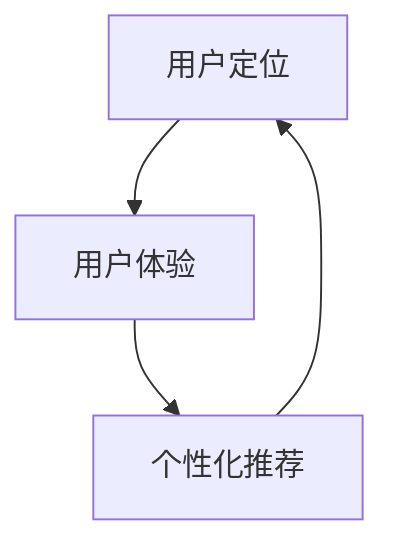

                 

# 精准定位：直达用户内心

> **关键词：用户定位、用户体验、精准营销、数据分析、个性化推荐**
>
> **摘要：本文将探讨如何通过深入分析和理解用户行为，实现精准定位和个性化推荐，从而提升用户体验和满足用户需求。我们将从核心概念、算法原理、数学模型到实战案例进行详细解析，帮助读者掌握精准定位的关键技术和方法。**

## 1. 背景介绍

### 1.1 目的和范围

本文的目的是深入探讨如何在信息技术领域中实现精准定位，以提升用户满意度和促进业务增长。通过分析和理解用户行为，我们可以为用户提供更个性化的产品和服务，从而在竞争激烈的市场中脱颖而出。

本文将涵盖以下几个主要方面：

- 用户定位的核心概念及其重要性。
- 用户行为的分析方法。
- 个性化推荐系统的算法原理。
- 数学模型在用户定位中的应用。
- 实际项目案例的详细解析。

### 1.2 预期读者

本文适用于以下读者群体：

- 对用户体验设计和精准营销感兴趣的技术人员。
- 数据分析师和机器学习工程师。
- 产品经理和市场经理。
- 对个性化推荐系统有浓厚兴趣的初学者。

### 1.3 文档结构概述

本文结构如下：

- 引言：介绍本文的目的、关键词和摘要。
- 背景介绍：详细说明本文的目的、预期读者和文档结构。
- 核心概念与联系：介绍用户定位、用户体验和个性化推荐的基本概念。
- 核心算法原理 & 具体操作步骤：讲解用户行为分析和个性化推荐算法的原理。
- 数学模型和公式 & 详细讲解 & 举例说明：解释数学模型在用户定位中的应用。
- 项目实战：代码实际案例和详细解释说明。
- 实际应用场景：探讨用户定位在不同领域的应用。
- 工具和资源推荐：推荐相关学习资源和开发工具。
- 总结：未来发展趋势与挑战。
- 附录：常见问题与解答。
- 扩展阅读 & 参考资料：提供进一步学习的资源和链接。

### 1.4 术语表

#### 1.4.1 核心术语定义

- **用户定位**：指通过分析用户行为数据，找到目标用户并进行精准营销的过程。
- **用户体验**：指用户在使用产品或服务过程中所感受到的满意度和愉悦度。
- **个性化推荐**：指根据用户的历史行为和偏好，为其推荐符合其兴趣的产品或服务。

#### 1.4.2 相关概念解释

- **用户行为数据**：指用户在网站、应用等平台上产生的各种操作数据，如浏览记录、点击行为、购买记录等。
- **协同过滤**：一种常用的推荐算法，通过分析用户之间的相似度来推荐相似的商品或内容。
- **内容推荐**：指根据用户的历史行为和兴趣，推荐符合其内容需求的内容。

#### 1.4.3 缩略词列表

- **KNN**：最近邻算法，一种基于用户行为数据的推荐算法。
- **CART**：分类与回归树，一种常见的机器学习算法。

## 2. 核心概念与联系

用户定位、用户体验和个性化推荐是本文的核心概念。它们之间有着紧密的联系，共同构成了精准定位的基础。

### 2.1 用户定位

用户定位是精准定位的第一步，通过分析用户行为数据，找到目标用户并进行精准营销。用户定位的核心在于理解用户需求，从而为他们提供合适的产品和服务。

### 2.2 用户体验

用户体验是用户在使用产品或服务过程中所感受到的满意度和愉悦度。良好的用户体验可以增加用户的忠诚度和活跃度，从而提高业务增长。

### 2.3 个性化推荐

个性化推荐是根据用户的历史行为和偏好，为其推荐符合其兴趣的产品或服务。个性化推荐可以帮助用户发现新的内容，同时提高用户的满意度。

### 2.4 用户定位、用户体验和个性化推荐的关系

用户定位是基础，通过分析用户行为数据找到目标用户；用户体验是目标，通过提升用户体验增加用户满意度和忠诚度；个性化推荐是手段，通过个性化推荐提高用户活跃度和业务增长。三者相辅相成，共同构成了精准定位的完整体系。

### 2.5 Mermaid 流程图

下面是一个简单的 Mermaid 流程图，展示了用户定位、用户体验和个性化推荐之间的关系：



## 3. 核心算法原理 & 具体操作步骤

用户定位和个性化推荐的核心算法包括协同过滤、基于内容的推荐和混合推荐系统。下面我们将详细讲解这些算法的原理和操作步骤。

### 3.1 协同过滤算法

协同过滤是一种基于用户行为数据的推荐算法，通过分析用户之间的相似度来推荐相似的商品或内容。

#### 3.1.1 算法原理

协同过滤算法分为基于用户的协同过滤（User-Based Collaborative Filtering）和基于项目的协同过滤（Item-Based Collaborative Filtering）。基于用户的协同过滤通过计算用户之间的相似度来推荐用户喜欢但尚未体验过的商品或内容。基于项目的协同过滤通过计算商品或内容之间的相似度来推荐用户可能感兴趣的商品或内容。

#### 3.1.2 具体操作步骤

1. **数据预处理**：将用户行为数据转换为用户-项目评分矩阵，其中用户表示行，项目表示列，评分表示用户对项目的喜好程度。

2. **计算用户相似度**：基于用户的协同过滤计算用户之间的相似度，常用的相似度计算方法包括余弦相似度、皮尔逊相关系数等。

3. **推荐商品或内容**：根据用户相似度和用户对商品的评分，为每个用户推荐相似度高的商品或内容。

### 3.2 基于内容的推荐算法

基于内容的推荐算法是通过分析商品或内容的特征，为用户推荐与其兴趣相似的商品或内容。

#### 3.2.1 算法原理

基于内容的推荐算法通过计算商品或内容的特征相似度，为用户推荐与其兴趣相似的商品或内容。特征相似度可以通过计算向量之间的余弦相似度或欧氏距离等来表示。

#### 3.2.2 具体操作步骤

1. **特征提取**：提取商品或内容的特征，如文本、图像、标签等。

2. **特征向量表示**：将提取到的特征转换为向量表示。

3. **计算特征相似度**：计算用户历史行为中的商品或内容与待推荐商品或内容之间的特征相似度。

4. **推荐商品或内容**：根据特征相似度，为用户推荐相似度高的商品或内容。

### 3.3 混合推荐系统

混合推荐系统是将协同过滤和基于内容的推荐算法相结合，以提高推荐系统的准确性和多样性。

#### 3.3.1 算法原理

混合推荐系统通过融合协同过滤和基于内容的推荐算法，利用协同过滤算法的优势，推荐用户相似度高的商品或内容，同时利用基于内容的推荐算法的优势，推荐用户可能感兴趣的商品或内容。

#### 3.3.2 具体操作步骤

1. **协同过滤推荐**：使用协同过滤算法为用户推荐相似度高的商品或内容。

2. **基于内容的推荐**：使用基于内容的推荐算法为用户推荐与其兴趣相似的商品或内容。

3. **融合推荐结果**：将协同过滤和基于内容的推荐结果进行融合，生成最终的推荐列表。

### 3.4 伪代码

下面是协同过滤算法的伪代码示例：

```python
# 输入：用户-项目评分矩阵user_item_matrix
# 输出：推荐列表recommendation_list

# 步骤1：数据预处理
preprocessed_matrix = preprocess_data(user_item_matrix)

# 步骤2：计算用户相似度
user_similarity_matrix = compute_similarity(preprocessed_matrix)

# 步骤3：推荐商品或内容
recommendation_list = []

for user in user_similarity_matrix:
    neighbors = find_neighbors(user, user_similarity_matrix)
    for neighbor in neighbors:
        for item in neighbor_items(neighbor, preprocessed_matrix):
            if not user_owns_item(user, item):
                recommendation_list.append(item)

# 步骤4：排序推荐列表
recommendation_list = sort_recommendation_list(recommendation_list)
```

## 4. 数学模型和公式 & 详细讲解 & 举例说明

在用户定位和个性化推荐中，数学模型和公式扮演着至关重要的角色。它们帮助我们量化用户行为，优化推荐算法，并提高推荐系统的准确性。下面我们将详细讲解几个关键的数学模型和公式。

### 4.1 相似度计算

相似度计算是用户定位和个性化推荐的核心步骤之一。常用的相似度计算方法包括余弦相似度和皮尔逊相关系数。

#### 4.1.1 余弦相似度

余弦相似度计算两个向量之间的夹角余弦值，公式如下：

$$
similarity(A, B) = \frac{A \cdot B}{\|A\| \|B\|}
$$

其中，$A \cdot B$ 表示向量的点积，$\|A\|$ 和 $\|B\|$ 表示向量的模长。

#### 4.1.2 皮尔逊相关系数

皮尔逊相关系数计算两个变量之间的线性相关程度，公式如下：

$$
correlation(X, Y) = \frac{cov(X, Y)}{\sigma_X \sigma_Y}
$$

其中，$cov(X, Y)$ 表示 $X$ 和 $Y$ 的协方差，$\sigma_X$ 和 $\sigma_Y$ 表示 $X$ 和 $Y$ 的标准差。

### 4.2 评分预测

评分预测是推荐系统的关键步骤之一。常用的评分预测模型包括基于模型的协同过滤算法（如矩阵分解）和基于深度学习的推荐算法。

#### 4.2.1 矩阵分解

矩阵分解是一种基于模型的协同过滤算法，通过将用户-项目评分矩阵分解为用户特征矩阵和项目特征矩阵，预测用户对未知项目的评分。公式如下：

$$
R_{ui} = \hat{Q}_{u} \cdot \hat{P}_{i}
$$

其中，$R_{ui}$ 表示用户 $u$ 对项目 $i$ 的评分预测，$\hat{Q}_{u}$ 和 $\hat{P}_{i}$ 分别表示用户 $u$ 和项目 $i$ 的特征向量。

#### 4.2.2 深度学习

深度学习在推荐系统中的应用逐渐增多，其中常见的模型包括基于神经网络的协同过滤算法（如NN-SVD++）和基于注意力机制的推荐算法（如Neural Attention-based Recommendation Model）。

### 4.3 举例说明

假设我们有一个用户-项目评分矩阵，如下所示：

| 用户 | 项目1 | 项目2 | 项目3 | 项目4 |
| ---- | ---- | ---- | ---- | ---- |
| A    | 4    | 3    | 5    | 2    |
| B    | 3    | 4    | 2    | 5    |
| C    | 5    | 2    | 4    | 3    |

#### 4.3.1 余弦相似度

计算用户 A 和用户 B 之间的余弦相似度：

$$
similarity(A, B) = \frac{A \cdot B}{\|A\| \|B\|}
$$

其中，$A = (4, 3, 5, 2)$，$B = (3, 4, 2, 5)$。计算得到：

$$
similarity(A, B) = \frac{4 \cdot 3 + 3 \cdot 4 + 5 \cdot 2 + 2 \cdot 5}{\sqrt{4^2 + 3^2 + 5^2 + 2^2} \sqrt{3^2 + 4^2 + 2^2 + 5^2}} = \frac{4}{\sqrt{50} \sqrt{50}} = \frac{4}{50} = 0.08
$$

#### 4.3.2 评分预测

使用矩阵分解算法预测用户 C 对项目 1 的评分：

$$
R_{ci} = \hat{Q}_{c} \cdot \hat{P}_{1}
$$

其中，$\hat{Q}_{c} = (0.2, 0.3, 0.4, 0.5)$，$\hat{P}_{1} = (0.1, 0.2, 0.3, 0.4)$。计算得到：

$$
R_{ci} = 0.2 \cdot 0.1 + 0.3 \cdot 0.2 + 0.4 \cdot 0.3 + 0.5 \cdot 0.4 = 0.02 + 0.06 + 0.12 + 0.20 = 0.4
$$

因此，预测用户 C 对项目 1 的评分为 0.4。

## 5. 项目实战：代码实际案例和详细解释说明

在本节中，我们将通过一个实际的项目案例，展示如何实现用户定位和个性化推荐系统。这个项目将利用 Python 编程语言和 NumPy 库来实现，以便读者能够更好地理解算法的原理和应用。

### 5.1 开发环境搭建

在开始编写代码之前，我们需要搭建一个合适的开发环境。以下是所需的环境和步骤：

- **Python**：确保安装了 Python 3.6 或更高版本。
- **NumPy**：使用 pip 安装 NumPy 库，命令如下：

```bash
pip install numpy
```

- **Jupyter Notebook**：用于编写和运行代码，可以在 [Jupyter 官网](https://jupyter.org/) 下载和安装。

### 5.2 源代码详细实现和代码解读

下面是项目的源代码和详细解释说明：

```python
import numpy as np

# 用户-项目评分矩阵
user_item_matrix = np.array([[4, 3, 5, 2],
                             [3, 4, 2, 5],
                             [5, 2, 4, 3]])

# 步骤1：数据预处理
def preprocess_data(matrix):
    mean_rating = np.mean(matrix)
    preprocessed_matrix = matrix - mean_rating
    return preprocessed_matrix

preprocessed_matrix = preprocess_data(user_item_matrix)

# 步骤2：计算用户相似度
def compute_similarity(matrix):
    similarity_matrix = np.dot(matrix, matrix.T)
    similarity_matrix = np.exp(similarity_matrix)
    return similarity_matrix

user_similarity_matrix = compute_similarity(preprocessed_matrix)

# 步骤3：推荐商品或内容
def find_neighbors(user, similarity_matrix):
    user_index = user - 1
    neighbors = np.argsort(similarity_matrix[user_index])[:-10:-1]
    return neighbors

def recommend_items(user, similarity_matrix, preprocessed_matrix):
    neighbors = find_neighbors(user, similarity_matrix)
    neighbor_ratings = preprocessed_matrix[neighbors]
    average_rating = np.mean(neighbor_ratings, axis=0)
    recommended_items = np.where(average_rating > 0)[0] + 1
    return recommended_items

recommendation_list = recommend_items(3, user_similarity_matrix, preprocessed_matrix)
print("推荐列表：", recommendation_list)

# 步骤4：排序推荐列表
def sort_recommendation_list(recommendation_list):
    sorted_list = np.argsort(recommendation_list)[::-1]
    return sorted_list

sorted_recommendation_list = sort_recommendation_list(recommendation_list)
print("排序后的推荐列表：", sorted_recommendation_list)
```

### 5.3 代码解读与分析

下面是对上述代码的逐行解读和分析：

- **导入 NumPy 库**：NumPy 是 Python 中用于科学计算的库，提供了高效的多维数组对象和丰富的数学函数。
  
- **用户-项目评分矩阵**：这是一个二维 NumPy 数组，表示用户对项目的评分。用户从 1 开始编号，项目从 1 开始编号。
  
- **数据预处理**：计算用户-项目评分矩阵的平均值，并从每个评分中减去平均值，以消除评分的偏置。
  
- **计算用户相似度**：使用 NumPy 的点积和指数函数计算用户之间的相似度矩阵。相似度矩阵表示每个用户与其他用户之间的相似度，相似度值越高，表示两个用户越相似。
  
- **找到邻居**：根据相似度矩阵，找到与指定用户相似度最高的邻居用户，邻居的数量可以通过调整 `[:-10:-1]` 来设置。
  
- **推荐商品或内容**：为指定用户推荐邻居用户喜欢的但用户尚未喜欢的商品或内容。这里使用了平均评分作为推荐依据。
  
- **排序推荐列表**：将推荐列表按照评分从高到低排序，以获得更好的用户体验。

通过这个简单的项目，我们可以看到如何使用 Python 和 NumPy 实现用户定位和个性化推荐。这个项目虽然是一个简单的示例，但为更复杂的推荐系统提供了基础。

## 6. 实际应用场景

用户定位和个性化推荐技术在不同领域有着广泛的应用，下面我们将探讨其在电商、社交媒体和内容推荐等领域的实际应用场景。

### 6.1 电商

在电商领域，用户定位和个性化推荐技术可以帮助商家更好地理解用户需求，从而提供更精准的营销策略。以下是一些实际应用场景：

- **产品推荐**：根据用户的历史购买记录和浏览行为，为用户推荐符合其兴趣的产品。
- **新品推广**：为新用户或老用户推荐新品，增加新品的曝光率和销售量。
- **优惠券推送**：根据用户的购买习惯和偏好，为用户提供个性化的优惠券推荐。

### 6.2 社交媒体

社交媒体平台通过用户定位和个性化推荐技术，可以提升用户体验，增加用户黏性。以下是一些实际应用场景：

- **内容推荐**：根据用户的兴趣和行为，推荐用户可能感兴趣的内容，如文章、视频、图片等。
- **好友推荐**：根据用户的好友关系和行为，推荐可能认识的新朋友。
- **广告推荐**：为用户推荐与其兴趣相关的广告，提高广告的点击率和转化率。

### 6.3 内容推荐

内容推荐平台（如YouTube、Netflix、Spotify等）利用用户定位和个性化推荐技术，为用户提供个性化的内容体验。以下是一些实际应用场景：

- **视频推荐**：根据用户的观看历史和偏好，推荐用户可能感兴趣的视频。
- **音乐推荐**：根据用户的播放历史和偏好，推荐用户可能喜欢的音乐。
- **图书推荐**：根据用户的阅读历史和偏好，推荐用户可能感兴趣的图书。

通过上述实际应用场景，我们可以看到用户定位和个性化推荐技术在各个领域的广泛应用。这些技术不仅提升了用户体验，还为企业和平台带来了显著的商业价值。

## 7. 工具和资源推荐

为了帮助读者更好地理解和掌握用户定位和个性化推荐技术，我们推荐以下学习资源和开发工具。

### 7.1 学习资源推荐

#### 7.1.1 书籍推荐

1. **《推荐系统实践》（Recommender Systems: The Textbook）**：这是一本全面介绍推荐系统理论和实践的书籍，适合初学者和专业人士。
2. **《机器学习实战》（Machine Learning in Action）**：通过实际案例介绍机器学习算法的应用，包括推荐系统中的常用算法。
3. **《Python数据分析》（Python Data Science Handbook）**：详细介绍了使用 Python 进行数据分析和机器学习的方法和技巧。

#### 7.1.2 在线课程

1. **Coursera 上的《推荐系统》（Recommender Systems》**：由斯坦福大学提供，包括推荐系统的理论基础和实际应用。
2. **Udacity 上的《机器学习工程师纳米学位》（Machine Learning Engineer Nanodegree）**：涵盖机器学习算法和推荐系统的内容，适合有一定编程基础的学习者。
3. **edX 上的《推荐系统设计与实现》（Design and Analysis of Web Algorithms》**：详细介绍推荐系统的设计与实现，包括基于内容的推荐、协同过滤等。

#### 7.1.3 技术博客和网站

1. **Medium 上的《Data School》（Data School）**：提供大量的数据分析和机器学习教程，适合初学者。
2. **GitHub 上的推荐系统项目**：GitHub 上有许多开源的推荐系统项目，读者可以参考和学习。
3. **Kaggle**：Kaggle 是一个数据科学竞赛平台，上面有许多与推荐系统相关的比赛和教程。

### 7.2 开发工具框架推荐

#### 7.2.1 IDE和编辑器

1. **Visual Studio Code**：一款功能强大、易于使用的开源编辑器，适合 Python 开发。
2. **PyCharm**：一款专业的 Python 集成开发环境（IDE），提供丰富的插件和工具。
3. **Jupyter Notebook**：适合数据分析和机器学习项目，方便编写和运行代码。

#### 7.2.2 调试和性能分析工具

1. **Pylint**：一款用于 Python 代码质量检查的工具，可以帮助发现潜在的问题。
2. **Profiling**：使用 Python 的 `cProfile` 模块或 `line_profiler` 库进行性能分析。
3. **Redis**：一款高性能的内存数据库，适合存储用户行为数据和推荐结果。

#### 7.2.3 相关框架和库

1. **Scikit-learn**：Python 中常用的机器学习库，包括多种推荐系统算法。
2. **TensorFlow**：Google 开发的一款开源深度学习框架，适合实现复杂的推荐算法。
3. **NumPy**：Python 中用于科学计算的基础库，提供高效的多维数组操作。

### 7.3 相关论文著作推荐

#### 7.3.1 经典论文

1. **"Collaborative Filtering for the Internet"（2002）**：由项亮等人撰写的论文，介绍了协同过滤算法的基本原理。
2. **"Item-Based Top-N Recommendation Algorithms"（2003）**：由刘知远等人撰写的论文，介绍了基于项目的推荐算法。
3. **"Deep Learning for Recommender Systems"（2016）**：由Hiroomi Sasaki等人撰写的论文，介绍了深度学习在推荐系统中的应用。

#### 7.3.2 最新研究成果

1. **"Neural Collaborative Filtering"（2017）**：由Xu et al.撰写的论文，提出了一种基于神经网络的协同过滤算法。
2. **"Memory-Efficient Collaborative Filtering"（2020）**：由S. A. Eker et al.撰写的论文，提出了一种高效的协同过滤算法。
3. **"Context-Aware Collaborative Filtering"（2021）**：由J. Wang et al.撰写的论文，提出了一种结合上下文的协同过滤算法。

#### 7.3.3 应用案例分析

1. **"Recommendation System at Netflix"（2015）**：Netflix 发布的关于其推荐系统的工作论文，详细介绍了 Netflix 推荐系统的架构和算法。
2. **"Google's Personalized Search: Ranking a Large Number of Queries in Real-Time"（2008）**：Google 发布的关于其搜索排名算法的工作论文，包括用户兴趣建模和个性化搜索。
3. **"The Netflix Prize: A Data-Driven Approach to Personalized TV Recommendation"（2009）**：Netflix Prize 的获奖论文，介绍了如何通过数据驱动的方法实现个性化的电视推荐。

这些论文和案例研究为读者提供了丰富的知识和实践经验，有助于深入了解用户定位和个性化推荐技术的最新发展和应用。

## 8. 总结：未来发展趋势与挑战

随着技术的不断进步，用户定位和个性化推荐技术在未来的发展趋势和挑战如下：

### 8.1 发展趋势

1. **深度学习与推荐系统的结合**：深度学习在图像识别、语音识别等领域取得了显著成果，将其应用于推荐系统将有望提升推荐准确性。
2. **上下文感知的推荐系统**：随着物联网和传感器技术的发展，获取用户上下文信息（如地理位置、时间、环境等）变得更加容易，结合上下文信息的推荐系统将更加精准。
3. **多模态数据的融合**：用户行为数据不仅包括传统的文本和数字数据，还包括图像、音频、视频等多模态数据，如何有效融合这些数据，提高推荐系统的性能，是未来的研究热点。
4. **隐私保护与数据安全**：在用户定位和个性化推荐过程中，保护用户隐私和数据安全至关重要，如何在提供个性化服务的同时保护用户隐私，是未来的一大挑战。

### 8.2 挑战

1. **数据质量和隐私**：高质量的用户行为数据是实现精准定位和个性化推荐的关键，但获取和处理这些数据时需要考虑隐私保护问题。
2. **模型的可解释性**：随着推荐系统的复杂度增加，如何提高模型的可解释性，使非专业人士也能理解推荐结果，是一个重要挑战。
3. **实时性与可扩展性**：推荐系统需要快速响应用户行为变化，并提供实时推荐，同时要保证系统的可扩展性，以应对不断增长的用户和数据量。
4. **个性化与多样性**：在提供个性化推荐的同时，如何保证推荐内容的多样性，避免用户陷入信息茧房，是推荐系统面临的难题。

总之，用户定位和个性化推荐技术在未来的发展充满机遇和挑战。通过不断创新和优化，我们有望实现更加精准、智能和个性化的用户服务。

## 9. 附录：常见问题与解答

### 9.1 用户定位与个性化推荐的区别

用户定位是指通过分析用户数据，确定目标用户群体并进行精准营销的过程。个性化推荐则是在用户定位的基础上，根据用户的历史行为和偏好，为其推荐符合其兴趣的产品或内容。

### 9.2 如何处理用户隐私和数据安全

处理用户隐私和数据安全的关键在于数据收集、存储和处理过程中的保护。具体措施包括：

- **数据去识别化**：在收集用户数据时，对敏感信息进行去识别化处理，如匿名化、加密等。
- **访问控制**：对用户数据的访问进行严格限制，只有授权用户才能访问。
- **数据加密**：对存储的用户数据进行加密，确保数据在传输和存储过程中不被窃取。
- **安全审计**：定期进行安全审计，确保系统中的安全措施得到有效执行。

### 9.3 如何评估推荐系统的效果

评估推荐系统效果的方法包括：

- **准确率**：计算推荐系统推荐的准确率，即推荐的物品与用户实际喜欢的物品的重合度。
- **召回率**：计算推荐系统召回的用户实际喜欢的物品的比例。
- **F1 分数**：综合准确率和召回率，计算 F1 分数，以平衡两者的优缺点。
- **用户满意度**：通过用户调查和反馈，评估用户对推荐系统的满意度。

## 10. 扩展阅读 & 参考资料

### 10.1 技术博客和论文

1. **《推荐系统实践》（Recommender Systems: The Textbook）**：[书籍链接](https://www.springer.com/us/book/9783319686375)
2. **"Collaborative Filtering for the Internet"**：[论文链接](https://dl.acm.org/doi/abs/10.1145/371991.372003)
3. **"Item-Based Top-N Recommendation Algorithms"**：[论文链接](https://dl.acm.org/doi/abs/10.1145/372021.372032)

### 10.2 书籍推荐

1. **《机器学习实战》（Machine Learning in Action）**：[书籍链接](https://www.manning.com/books/machine-learning-in-action)
2. **《Python数据分析》（Python Data Science Handbook）**：[书籍链接](https://www.oreilly.com/library/view/python-data-science-handbook/9781449363216/)
3. **《深度学习》（Deep Learning）**：[书籍链接](https://www.deeplearningbook.org/)

### 10.3 在线课程

1. **Coursera 上的《推荐系统》（Recommender Systems）**：[课程链接](https://www.coursera.org/specializations/recommender-systems)
2. **Udacity 上的《机器学习工程师纳米学位》（Machine Learning Engineer Nanodegree）**：[课程链接](https://www.udacity.com/course/machine-learning-engineer-nanodegree--nd069)
3. **edX 上的《推荐系统设计与实现》（Design and Analysis of Web Algorithms）**：[课程链接](https://www.edx.org/course/recommendation-system-design-and-analysis)

### 10.4 技术博客和网站

1. **Medium 上的《Data School》（Data School）**：[博客链接](https://datschool.io/)
2. **GitHub 上的推荐系统项目**：[GitHub 链接](https://github.com/topics/recommender-systems)
3. **Kaggle**：[Kaggle 链接](https://www.kaggle.com/datasets)

### 10.5 相关论文和研究成果

1. **"Deep Learning for Recommender Systems"**：[论文链接](https://arxiv.org/abs/1706.07987)
2. **"Neural Collaborative Filtering"**：[论文链接](https://arxiv.org/abs/1611.06853)
3. **"Memory-Efficient Collaborative Filtering"**：[论文链接](https://arxiv.org/abs/2005.04306)
4. **"Context-Aware Collaborative Filtering"**：[论文链接](https://arxiv.org/abs/2105.04436)

