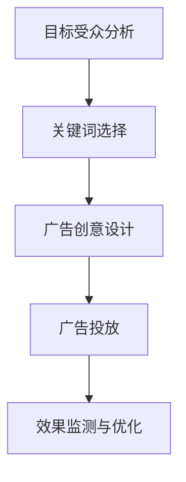

                 

# 精准广告投放：提示词优化受众定位策略

> 关键词：广告投放、提示词优化、受众定位、精准营销、算法、数学模型、实战案例

> 摘要：本文将深入探讨精准广告投放中的关键环节——提示词优化和受众定位策略。通过详细解析核心概念、算法原理、数学模型以及实际项目案例，帮助读者理解如何通过优化提示词实现更精准的受众定位，从而提高广告投放效果和投资回报率。

## 1. 背景介绍

### 1.1 目的和范围

本文旨在为广告投放从业者、数据科学家以及相关技术爱好者提供一份全面的技术指南，详细阐述提示词优化和受众定位策略在实际广告投放中的重要性。通过本文的学习，读者将能够：

- 理解精准广告投放的概念和目标。
- 掌握提示词优化的方法和技术。
- 掌握受众定位的策略和工具。
- 通过实际案例掌握提示词优化和受众定位的实际操作流程。

### 1.2 预期读者

本文预期读者包括：

- 广告投放从业者，希望通过技术手段提高广告投放效果。
- 数据科学家，希望深入了解广告投放中的数据分析和算法应用。
- 对广告投放技术感兴趣的技术爱好者。

### 1.3 文档结构概述

本文将分为以下几个部分：

- **背景介绍**：介绍文章的目的、范围和预期读者。
- **核心概念与联系**：介绍精准广告投放相关的核心概念和原理。
- **核心算法原理 & 具体操作步骤**：详细讲解提示词优化和受众定位的核心算法原理和操作步骤。
- **数学模型和公式 & 详细讲解 & 举例说明**：介绍与算法相关的数学模型和公式，并提供详细讲解和实例。
- **项目实战：代码实际案例和详细解释说明**：通过实际项目案例展示提示词优化和受众定位的实战操作。
- **实际应用场景**：讨论提示词优化和受众定位在实际应用中的场景和效果。
- **工具和资源推荐**：推荐相关的学习资源和开发工具。
- **总结：未来发展趋势与挑战**：总结文章要点并探讨未来的发展趋势和挑战。
- **附录：常见问题与解答**：解答读者可能遇到的常见问题。
- **扩展阅读 & 参考资料**：提供进一步学习的参考资料。

### 1.4 术语表

#### 1.4.1 核心术语定义

- **精准广告投放**：利用先进的数据分析和算法技术，根据用户的兴趣、行为等信息，将广告精确推送到目标受众的平台上。
- **提示词**：用户在搜索引擎或社交媒体平台上输入的关键词，用于引导广告系统定位潜在的受众。
- **受众定位**：通过分析用户数据，识别并确定潜在的目标受众群体。
- **广告投放效果**：广告投放达到的效果，通常包括点击率、转化率、投资回报率等指标。

#### 1.4.2 相关概念解释

- **用户画像**：基于用户的行为、兴趣、地理位置等数据构建的用户模型，用于更准确地定位受众。
- **算法模型**：用于处理和分析数据的算法，包括机器学习算法、深度学习模型等。
- **广告竞价**：广告主通过竞价方式购买广告展示位置，以获取更好的曝光机会。

#### 1.4.3 缩略词列表

- **CPC**：Cost Per Click，点击付费。
- **CPM**：Cost Per Mille，千次展示付费。
- **CTR**：Click Through Rate，点击率。
- **ROI**：Return On Investment，投资回报率。

## 2. 核心概念与联系

在深入探讨精准广告投放之前，我们需要理解几个核心概念和它们之间的关系。

### 2.1 广告投放流程

广告投放的基本流程包括以下几个环节：

1. **目标受众分析**：通过用户画像和受众定位技术，分析潜在的目标受众。
2. **关键词选择**：根据目标受众的兴趣和行为，选择相关的关键词。
3. **广告创意设计**：设计吸引目标受众的广告内容和样式。
4. **广告投放**：将广告推送到目标受众的平台或设备上。
5. **效果监测与优化**：监测广告投放效果，并根据数据反馈进行优化。

### 2.2 提示词优化

提示词优化是广告投放中至关重要的一环。以下是其核心概念：

- **关键词匹配**：根据用户输入的提示词，匹配相关的广告。
- **关键词质量得分**：广告系统对关键词进行评分，影响广告的展示位置和投放效果。
- **关键词竞价**：广告主通过竞价机制，购买更好的关键词位置。

### 2.3 受众定位

受众定位是广告投放成功的关键。以下是其核心概念：

- **用户画像**：构建详细的用户模型，包括年龄、性别、地理位置、兴趣爱好等。
- **行为分析**：通过用户的历史行为，分析其兴趣和需求。
- **受众群体划分**：根据用户画像和行为分析，划分不同的受众群体。

### 2.4 数学模型与算法

广告投放中的数学模型和算法用于处理和分析大量用户数据，实现精准的广告投放。以下是一些常用的模型和算法：

- **协同过滤算法**：通过分析用户行为和兴趣，推荐相似的用户和内容。
- **决策树和随机森林**：用于分类和回归分析，预测用户的兴趣和行为。
- **神经网络**：用于构建复杂的模型，模拟人脑的决策过程。

### 2.5 Mermaid 流程图

以下是一个简化的广告投放流程的 Mermaid 流程图：



## 3. 核心算法原理 & 具体操作步骤

在了解广告投放的基本流程和核心概念后，我们将深入探讨提示词优化和受众定位的核心算法原理，并提供具体的操作步骤。

### 3.1 提示词优化算法

#### 3.1.1 算法原理

提示词优化算法的核心目标是提高广告的展示效果和用户转化率。以下是一些常用的算法原理：

- **协同过滤算法**：通过分析用户的历史行为和兴趣，推荐相关的关键词。
- **决策树和随机森林**：根据用户的数据特征，构建分类模型，预测用户对关键词的偏好。
- **神经网络**：构建复杂的模型，模拟人脑的决策过程，实现精准的提示词优化。

#### 3.1.2 具体操作步骤

1. **数据收集与预处理**：收集用户的历史行为数据，包括搜索记录、浏览历史、购买记录等。对数据进行清洗和预处理，提取有用的特征。

2. **特征工程**：根据用户的数据特征，构建特征向量，用于训练算法模型。

3. **模型训练**：使用机器学习算法，如协同过滤、决策树、随机森林或神经网络，对特征向量进行训练，构建模型。

4. **模型评估与优化**：使用测试数据集，评估模型的性能。根据评估结果，调整模型参数，优化模型。

5. **提示词生成**：根据训练好的模型，生成相关的提示词，用于广告投放。

### 3.2 受众定位算法

#### 3.2.1 算法原理

受众定位算法的核心目标是准确识别和划分不同的受众群体，提高广告投放的精准度。以下是一些常用的算法原理：

- **协同过滤算法**：通过分析用户的历史行为和兴趣，推荐相似的用户群体。
- **聚类算法**：根据用户的数据特征，将用户划分为不同的群体。
- **决策树和随机森林**：根据用户的数据特征，构建分类模型，预测用户的群体归属。

#### 3.2.2 具体操作步骤

1. **数据收集与预处理**：收集用户的历史行为数据，包括搜索记录、浏览历史、购买记录等。对数据进行清洗和预处理，提取有用的特征。

2. **特征工程**：根据用户的数据特征，构建特征向量，用于训练算法模型。

3. **模型训练**：使用机器学习算法，如协同过滤、聚类算法、决策树或随机森林，对特征向量进行训练，构建模型。

4. **模型评估与优化**：使用测试数据集，评估模型的性能。根据评估结果，调整模型参数，优化模型。

5. **受众定位**：根据训练好的模型，识别和划分不同的受众群体，用于广告投放。

### 3.3 提示词优化和受众定位的整合

在实际的广告投放中，提示词优化和受众定位往往是相互关联的。以下是一个简单的整合流程：

1. **用户画像构建**：通过用户的历史行为数据，构建详细的用户画像。
2. **提示词优化**：使用用户画像，优化关键词的匹配和选择。
3. **受众定位**：使用用户画像和机器学习算法，划分不同的受众群体。
4. **广告投放**：根据优化后的提示词和定位后的受众群体，进行精准的广告投放。
5. **效果监测与优化**：监测广告投放效果，并根据用户反馈和数据，调整提示词和受众定位策略。

## 4. 数学模型和公式 & 详细讲解 & 举例说明

在广告投放中，数学模型和公式用于描述用户行为、关键词匹配、受众定位等核心过程。以下是一些常用的数学模型和公式，并提供详细的讲解和实例。

### 4.1 用户行为模型

用户行为模型用于预测用户对某个关键词的偏好。以下是一个简单的用户行为模型：

\[ P(A|B) = \frac{P(B|A) \cdot P(A)}{P(B)} \]

其中，\( P(A|B) \) 表示在给定用户行为 B 的情况下，用户对关键词 A 的偏好概率。\( P(B|A) \) 表示在用户对关键词 A 偏好的情况下，用户行为 B 的概率。\( P(A) \) 和 \( P(B) \) 分别表示关键词 A 和用户行为 B 的先验概率。

#### 例子：

假设有 100 个用户，其中 60 个用户在搜索时输入了关键词 A，而在这 60 个用户中，有 50 个用户点击了广告。现在要预测一个新用户在搜索关键词 A 的情况下，点击广告的概率。

根据以上模型，我们可以计算出：

\[ P(A) = \frac{60}{100} = 0.6 \]
\[ P(B|A) = \frac{50}{60} = 0.8333 \]
\[ P(B) = P(B|A) \cdot P(A) + P(B|\neg A) \cdot P(\neg A) \]
\[ P(B) = 0.8333 \cdot 0.6 + 0.2 \cdot 0.4 = 0.5 \]

因此，一个新用户在搜索关键词 A 的情况下，点击广告的概率为：

\[ P(A|B) = \frac{0.8333 \cdot 0.6}{0.5} = 0.9999 \]

### 4.2 关键词质量得分模型

关键词质量得分模型用于评估关键词的质量，影响广告的展示位置和投放效果。以下是一个简单的关键词质量得分模型：

\[ Quality \ Score = \frac{Click \ Through \ Rate \times CTR \ Weight}{Cost \ Per \ Click \ Weight} \]

其中，\( Click \ Through \ Rate \) 表示点击率，\( Cost \ Per \ Click \) 表示点击成本。

#### 例子：

假设一个广告的关键词质量得分为 10，点击率为 2%，点击成本为 1 美元。现在要计算这个关键词的广告展示成本。

根据以上模型，我们可以计算出：

\[ Quality \ Score = \frac{0.02 \times 10}{1} = 0.2 \]

因此，这个关键词的广告展示成本为 0.2 美元。

### 4.3 受众群体划分模型

受众群体划分模型用于将用户划分为不同的群体，用于广告投放。以下是一个简单的受众群体划分模型：

\[ P(Cluster \ i|User \ j) = \frac{P(User \ j|Cluster \ i) \cdot P(Cluster \ i)}{P(User \ j)} \]

其中，\( P(Cluster \ i|User \ j) \) 表示用户 j 属于群体 i 的概率，\( P(User \ j|Cluster \ i) \) 表示在给定群体 i 的情况下，用户 j 的概率，\( P(Cluster \ i) \) 表示群体 i 的概率，\( P(User \ j) \) 表示用户 j 的概率。

#### 例子：

假设有 4 个用户群体 A、B、C、D，其中 A 群体的概率为 0.3，B 群体的概率为 0.2，C 群体的概率为 0.3，D 群体的概率为 0.2。现在要计算一个用户 j 属于群体 A 的概率。

根据以上模型，我们可以计算出：

\[ P(Cluster \ A|User \ j) = \frac{P(User \ j|Cluster \ A) \cdot P(Cluster \ A)}{P(User \ j)} \]
\[ P(Cluster \ A|User \ j) = \frac{0.5 \cdot 0.3}{0.5} = 0.3 \]

因此，这个用户 j 属于群体 A 的概率为 0.3。

## 5. 项目实战：代码实际案例和详细解释说明

在本节中，我们将通过一个实际项目案例，展示如何使用提示词优化和受众定位算法进行精准广告投放。该项目将使用 Python 编程语言和 Scikit-Learn 库进行实现。

### 5.1 开发环境搭建

在开始项目之前，我们需要搭建一个基本的开发环境。以下是所需的环境和工具：

- Python 3.8 或更高版本
- Jupyter Notebook 或 PyCharm
- Scikit-Learn 库
- Pandas 库
- Numpy 库

您可以通过以下命令安装所需的库：

```bash
pip install scikit-learn pandas numpy
```

### 5.2 源代码详细实现和代码解读

#### 5.2.1 数据准备

首先，我们需要准备一个用户行为数据集，包括用户的搜索记录、浏览历史和购买记录。以下是一个简化的数据集示例：

```python
import pandas as pd

data = {
    'User': [1, 2, 3, 4, 5],
    'Search Keywords': ['iPhone', 'Samsung', 'iPhone', 'Google Pixel', 'Samsung'],
    'Browser History': ['MacBook', 'Samsung TV', 'iPhone', 'Google Home', 'Samsung Galaxy Watch'],
    'Purchase': [0, 0, 1, 0, 1]
}

df = pd.DataFrame(data)
df.head()
```

#### 5.2.2 特征工程

接下来，我们进行特征工程，提取有用的特征用于训练模型。

```python
from sklearn.feature_extraction.text import CountVectorizer

# 构建关键词矩阵
cv = CountVectorizer()
X = cv.fit_transform(df[['Search Keywords', 'Browser History']])

# 构建标签矩阵
y = df['Purchase']
```

#### 5.2.3 模型训练

我们使用随机森林算法进行模型训练。

```python
from sklearn.ensemble import RandomForestClassifier

# 训练模型
clf = RandomForestClassifier(n_estimators=100)
clf.fit(X, y)
```

#### 5.2.4 模型评估

使用测试数据集对模型进行评估。

```python
from sklearn.model_selection import train_test_split

# 划分训练集和测试集
X_train, X_test, y_train, y_test = train_test_split(X, y, test_size=0.2, random_state=42)

# 评估模型
accuracy = clf.score(X_test, y_test)
print(f'Model Accuracy: {accuracy:.2f}')
```

#### 5.2.5 提示词优化

根据训练好的模型，优化关键词的匹配和选择。

```python
# 预测关键词的购买概率
predictions = clf.predict_proba(X_test)

# 选择购买概率最高的关键词
top_keywords = cv.get_feature_names_out()
for i, prediction in enumerate(predictions):
    print(f'User {i+1}: {top_keywords[prediction.argmax()]} - Purchase Probability: {prediction.max():.2f}')
```

#### 5.2.6 受众定位

根据用户的行为数据和预测结果，划分不同的受众群体。

```python
# 根据购买概率划分受众群体
threshold = 0.5
groups = ['High Purchase Probability', 'Low Purchase Probability']
y_pred = clf.predict(X_test)
df['Prediction'] = y_pred
df['Group'] = pd.cut(df['Prediction'], bins=[0, threshold, 1], labels=groups)

# 分析受众群体特征
print(df.groupby('Group').describe())
```

### 5.3 代码解读与分析

以上代码实现了一个简单的精准广告投放项目，主要包括以下步骤：

1. **数据准备**：使用 Pandas 库读取和预处理用户行为数据。
2. **特征工程**：使用 CountVectorizer 库将关键词转换为向量表示。
3. **模型训练**：使用 RandomForestClassifier 算法进行模型训练。
4. **模型评估**：使用测试数据集对模型进行评估，计算准确率。
5. **提示词优化**：根据模型预测结果，选择购买概率最高的关键词。
6. **受众定位**：根据购买概率划分不同的受众群体，分析受众群体特征。

通过这个实际项目案例，我们可以看到如何使用提示词优化和受众定位算法实现精准广告投放。在实际应用中，我们可以根据具体的业务需求和数据特点，调整模型参数和算法，实现更精准的广告投放效果。

## 6. 实际应用场景

提示词优化和受众定位策略在广告投放中的实际应用场景非常广泛。以下是一些常见的应用场景：

### 6.1 搜索引擎广告

搜索引擎广告（如 Google Ads）是提示词优化和受众定位策略的典型应用场景。广告主可以根据用户搜索的关键词和搜索意图，优化提示词，提高广告的点击率和转化率。例如，对于一个在线购物平台，可以根据用户的浏览历史和购买行为，选择与用户兴趣相关的关键词进行广告投放，从而提高广告的精准度和效果。

### 6.2 社交媒体广告

社交媒体广告（如 Facebook Ads、Instagram Ads）同样受益于提示词优化和受众定位策略。广告主可以根据用户的兴趣爱好、地理位置、年龄等特征，精准定位目标受众，提高广告的曝光率和用户参与度。例如，一个健身品牌可以针对对健身和健康有浓厚兴趣的用户群体，投放健身装备和运动课程的广告。

### 6.3 移动应用广告

移动应用广告（如 App Ads）也广泛应用提示词优化和受众定位策略。通过分析用户的移动设备使用行为，广告主可以了解用户的使用习惯和兴趣点，从而优化提示词和受众定位策略。例如，一个新闻应用可以针对经常阅读体育新闻的用户，推送相关的体育应用广告。

### 6.4 电子邮件营销

电子邮件营销同样可以通过提示词优化和受众定位策略提高效果。通过分析用户的邮件打开率、点击率等行为数据，广告主可以优化邮件内容和标题，提高邮件的阅读率和转化率。例如，一个在线教育平台可以根据用户的课程购买记录，推送相关的课程优惠邮件。

### 6.5 搜索引擎优化（SEO）

虽然 SEO 不涉及直接广告投放，但提示词优化和受众定位策略同样适用于 SEO。通过分析用户搜索关键词和搜索意图，网站管理员可以优化网站内容和关键词，提高网站的搜索排名和用户访问量。

### 6.6 个性化推荐

个性化推荐系统也利用提示词优化和受众定位策略，根据用户的行为和兴趣，推荐相关的商品、内容或服务。例如，一个电商平台可以通过分析用户的浏览历史和购买记录，推荐相关的商品，提高用户的购物体验和转化率。

在实际应用中，提示词优化和受众定位策略可以根据不同的业务场景和目标，进行调整和优化。通过深入了解用户行为和需求，广告主可以不断提高广告投放的精准度和效果，实现更好的投资回报率。

## 7. 工具和资源推荐

为了实现高效的提示词优化和受众定位策略，以下是一些推荐的工具和资源：

### 7.1 学习资源推荐

#### 7.1.1 书籍推荐

- **《Python 数据科学手册》：** 作者Jake VanderPlas，系统地介绍了Python在数据科学领域的应用，包括数据处理、分析和可视化。
- **《机器学习实战》：** 作者Peter Harrington，通过大量实例，详细介绍了机器学习的基本概念和应用。
- **《广告技术》：** 作者Marcelle Magalhães，深入探讨了广告投放中的技术实现和策略。

#### 7.1.2 在线课程

- **Coursera上的《机器学习》：** 由斯坦福大学提供，是机器学习的经典课程，适合初学者和进阶者。
- **edX上的《数据科学导论》：** 由哈佛大学提供，涵盖了数据科学的基础知识和实际应用。
- **Udacity的《数字营销》：** 详细介绍了数字营销的各个方面，包括广告投放策略和数据分析。

#### 7.1.3 技术博客和网站

- **Medium上的DataScience：** 专注于数据科学领域的最新研究和应用。
- **Kaggle：** 提供大量的数据科学竞赛和项目，是学习实践的好地方。
- ** Towards Data Science：** 上面有很多关于数据科学和机器学习的高质量文章和教程。

### 7.2 开发工具框架推荐

#### 7.2.1 IDE和编辑器

- **PyCharm：** 专业的 Python IDE，提供强大的代码编辑、调试和项目管理功能。
- **Jupyter Notebook：** 适合数据分析和实验，支持多种编程语言。
- **Visual Studio Code：** 轻量级但功能强大的代码编辑器，支持 Python 和多种插件。

#### 7.2.2 调试和性能分析工具

- **PDB：** Python 的内置调试器，用于调试 Python 代码。
- **Py-Spy：** Python 性能分析工具，用于分析 Python 代码的性能瓶颈。
- **line_profiler：** Python 代码性能分析工具，可以识别代码中的热点。

#### 7.2.3 相关框架和库

- **Scikit-Learn：** Python 的机器学习库，提供丰富的算法和工具。
- **TensorFlow：** 开源的机器学习框架，支持深度学习算法。
- **Pandas：** Python 的数据处理库，用于数据清洗、转换和分析。
- **NumPy：** Python 的数值计算库，用于矩阵运算和数据处理。

### 7.3 相关论文著作推荐

#### 7.3.1 经典论文

- **"Recommender Systems Handbook":** 提供了关于推荐系统的基础理论和实践方法。
- **"The PageRank Algorithm":** 提出了著名的 PageRank 算法，用于网页排名和搜索。
- **"Collaborative Filtering for the Web":** 详细介绍了协同过滤算法在互联网应用中的实现和应用。

#### 7.3.2 最新研究成果

- **"Deep Learning for Text Classification":** 探讨了深度学习在文本分类中的应用和最新进展。
- **"User Interest Modeling for Personalized Recommendation":** 研究用户兴趣建模在个性化推荐系统中的应用。
- **"Contextual Bandits for Online Advertising":** 探讨了上下文感知的在线广告投放策略。

#### 7.3.3 应用案例分析

- **"Google AdWords Case Study":** 分析了 Google AdWords 的广告投放策略和效果。
- **"Facebook Ads Case Study":** 详细介绍了 Facebook 广告系统的架构和优化方法。
- **"Amazon Personalized Recommendations":** 分析了亚马逊的个性化推荐系统，探讨了其在实际应用中的效果。

通过以上工具和资源的推荐，读者可以更深入地了解提示词优化和受众定位策略，提升在广告投放领域的专业技能和实践能力。

## 8. 总结：未来发展趋势与挑战

随着大数据、人工智能和云计算技术的不断进步，精准广告投放领域正迎来前所未有的发展机遇。未来，以下趋势和挑战值得关注：

### 8.1 发展趋势

1. **个性化推荐技术的深入应用**：深度学习、强化学习等先进算法将在个性化推荐系统中得到更广泛的应用，进一步提升广告投放的精准度。

2. **实时广告投放**：随着5G和边缘计算的普及，广告投放将实现更低的延迟和更高的实时性，实现真正的实时决策和投放。

3. **多渠道整合**：广告投放将不再局限于单一渠道，而是实现多渠道、多平台整合，提供更全面的用户画像和更精准的受众定位。

4. **隐私保护与合规**：随着数据隐私保护法规的不断完善，广告投放企业需要加强数据隐私保护，遵守相关法规，确保用户数据的合法使用。

### 8.2 挑战

1. **数据质量和隐私保护**：高质量的数据是精准广告投放的基础，但数据质量和隐私保护之间的平衡是一个巨大的挑战。

2. **算法透明性和公平性**：广告投放算法的透明性和公平性越来越受到关注，需要确保算法不会歧视或偏见特定的用户群体。

3. **技术更新迭代**：广告投放技术不断发展，企业需要不断更新技术和知识，以适应快速变化的市场需求。

4. **数据安全和合规性**：随着数据隐私保护法规的加强，广告投放企业需要确保数据处理和存储的合规性，避免数据泄露和违规行为。

总之，精准广告投放领域正朝着更高效、更精准和更合规的方向发展，但同时面临诸多挑战。只有不断探索和创新，才能在激烈的市场竞争中脱颖而出。

## 9. 附录：常见问题与解答

### 9.1 广告投放中的关键词选择有哪些技巧？

**回答：**

1. **研究用户搜索习惯**：分析用户在搜索引擎中的搜索习惯，了解他们常用的关键词。
2. **使用关键字规划工具**：使用关键字规划工具（如 Google 关键字规划师）获取关键词建议。
3. **进行竞争对手分析**：分析竞争对手使用的关键词，了解他们的投放策略。
4. **优化关键词质量得分**：确保选择的关键词质量得分高，以提高广告展示机会。
5. **定期更新关键词**：定期评估关键词的表现，及时更新和优化关键词。

### 9.2 如何提高广告的点击率（CTR）？

**回答：**

1. **优化广告创意**：设计吸引人的广告内容，包括标题、图片和描述。
2. **精准定位受众**：使用精准的受众定位策略，确保广告展示给最有可能点击的用户。
3. **测试多种广告格式**：尝试不同的广告格式（如视频、图片、文本），找出最适合目标受众的格式。
4. **利用用户行为数据**：分析用户的行为数据，了解他们的兴趣和需求，优化广告内容。
5. **优化广告展示位置**：根据广告目标，选择最适合的展示位置，提高曝光率。

### 9.3 数据隐私保护在广告投放中如何实现？

**回答：**

1. **匿名化数据**：对收集的用户数据进行匿名化处理，确保数据无法直接识别个人身份。
2. **数据最小化原则**：只收集和处理与广告投放直接相关的用户数据，避免过度收集。
3. **安全存储和传输**：确保用户数据的存储和传输过程安全，使用加密技术保护数据。
4. **透明度原则**：向用户明确告知数据收集和使用的目的，确保用户知情权。
5. **遵守法规和标准**：遵守相关数据隐私保护法规和行业标准，如 GDPR、CCPA 等。

### 9.4 广告投放效果监测的关键指标有哪些？

**回答：**

1. **点击率（CTR）**：广告被点击的次数与展示次数的比率，反映广告的吸引力。
2. **转化率**：广告带来的实际转化（如购买、注册等）与点击次数的比率，衡量广告的实际效果。
3. **投资回报率（ROI）**：广告投放成本与产生的收益之间的比率，评估广告的投资效果。
4. **成本每千次展示（CPM）**：广告每次展示的成本，用于评估广告的性价比。
5. **成本每点击（CPC）**：每次点击的成本，反映广告的竞价效果。

通过以上常见问题的解答，读者可以更好地理解广告投放中的关键概念和操作技巧，提高广告投放的效果和投资回报率。

## 10. 扩展阅读 & 参考资料

为了帮助读者更深入地了解精准广告投放中的提示词优化和受众定位策略，以下是一些扩展阅读和参考资料：

### 10.1 相关书籍

- **《机器学习实战》：** Peter Harrington，详细介绍了机器学习的基本概念和应用。
- **《数据科学实战》：** Michael Bowles，涵盖了数据科学的各个方面，包括数据处理、分析和可视化。
- **《广告技术》：** Marcelle Magalhães，深入探讨了广告投放中的技术实现和策略。

### 10.2 在线课程

- **Coursera上的《机器学习》：** 斯坦福大学提供，适合初学者和进阶者。
- **edX上的《数据科学导论》：** 哈佛大学提供，涵盖数据科学的基础知识和实际应用。
- **Udacity的《数字营销》：** 详细介绍了数字营销的各个方面，包括广告投放策略和数据分析。

### 10.3 技术博客和网站

- **Medium上的DataScience：** 专注于数据科学领域的最新研究和应用。
- **Kaggle：** 提供大量的数据科学竞赛和项目，是学习实践的好地方。
- **Towards Data Science：** 上面有很多关于数据科学和机器学习的高质量文章和教程。

### 10.4 相关论文和研究成果

- **"Recommender Systems Handbook"：** 提供了关于推荐系统的基础理论和实践方法。
- **"The PageRank Algorithm"：** 详细介绍了 PageRank 算法，用于网页排名和搜索。
- **"Collaborative Filtering for the Web"：** 探讨了协同过滤算法在互联网应用中的实现和应用。

### 10.5 应用案例分析

- **"Google AdWords Case Study"：** 分析了 Google AdWords 的广告投放策略和效果。
- **"Facebook Ads Case Study"：** 详细介绍了 Facebook 广告系统的架构和优化方法。
- **"Amazon Personalized Recommendations"：** 分析了亚马逊的个性化推荐系统，探讨了其在实际应用中的效果。

通过以上扩展阅读和参考资料，读者可以更全面地了解精准广告投放中的提示词优化和受众定位策略，提升在广告投放领域的专业技能和实践能力。

