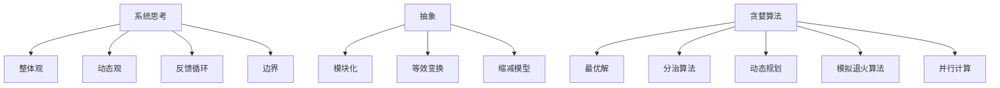

                 


# 系统思考：化繁为简的法宝

> 关键词：系统思考、复杂系统、简化模型、算法、方法论、编程实践

> 摘要：本文旨在探讨系统思考在IT领域的应用，解析复杂系统的本质，阐述通过简化模型来解决问题的方法论，并分享一些实用的编程实践。通过本文，读者将了解如何运用系统思考将复杂问题化繁为简，提高解决实际问题的效率。

## 1. 背景介绍

### 1.1 目的和范围

本文的目标是向读者介绍系统思考在IT领域的重要性，以及如何通过系统思考来应对复杂问题。本文将涵盖以下内容：

- 系统思考的基本概念和原理
- 复杂系统的简化方法
- 算法原理和编程实践
- 实际应用场景和案例分析

### 1.2 预期读者

本文主要面向具有计算机科学和软件工程背景的读者，包括程序员、软件工程师、系统架构师等。同时，对系统思考和复杂性科学感兴趣的读者也可以从中获得启发。

### 1.3 文档结构概述

本文将分为以下几个部分：

- 背景介绍：介绍本文的目的、范围、预期读者和文档结构。
- 核心概念与联系：讲解系统思考和复杂系统的基本概念，以及相关的流程图。
- 核心算法原理 & 具体操作步骤：介绍简化复杂系统的算法原理和操作步骤。
- 数学模型和公式 & 详细讲解 & 举例说明：阐述系统思考中的数学模型和公式，并举例说明。
- 项目实战：代码实际案例和详细解释说明。
- 实际应用场景：讨论系统思考在实际应用中的场景。
- 工具和资源推荐：推荐学习资源和开发工具。
- 总结：未来发展趋势与挑战。
- 附录：常见问题与解答。
- 扩展阅读 & 参考资料：提供更多相关文献和资料。

### 1.4 术语表

#### 1.4.1 核心术语定义

- 系统思考：一种分析和解决问题的方法论，强调从整体和系统的角度来理解复杂问题。
- 复杂系统：由多个相互关联、相互作用的部分组成的系统，表现出非线性、复杂的行为特征。
- 简化模型：通过对复杂系统进行抽象和简化，得到一个可以分析和求解的模型。
- 算法：解决问题的步骤和方法，可以用代码或数学公式表示。
- 编程实践：在实际编程过程中遵循的一些最佳实践和方法。

#### 1.4.2 相关概念解释

- **复杂性科学**：研究复杂系统的学科，包括混沌理论、网络科学、多智能体系统等。
- **抽象**：从具体的事物中提取出本质特征，忽略非本质特征，从而简化问题。
- **模块化**：将复杂系统分解为若干个相互独立、易于管理和维护的模块。

#### 1.4.3 缩略词列表

- **IT**：信息技术（Information Technology）
- **CS**：计算机科学（Computer Science）
- **SE**：软件工程（Software Engineering）
- **IDE**：集成开发环境（Integrated Development Environment）

## 2. 核心概念与联系

在本文中，我们将探讨系统思考在解决复杂系统问题中的应用。首先，我们需要了解一些核心概念和它们之间的联系。

### 2.1 系统思考的基本概念

系统思考是一种分析和解决问题的方法论，强调从整体和系统的角度来理解复杂问题。它包括以下几个方面：

1. **整体观**：将系统视为一个整体，关注系统内部的相互关系和相互作用。
2. **动态观**：考虑系统在不同时间和条件下的变化和演化过程。
3. **反馈循环**：系统内部的各种反馈机制，包括正反馈和负反馈。
4. **边界**：系统的边界决定了系统的内部和外部，有助于分析系统的行为。

### 2.2 复杂系统的简化方法

复杂系统通常具有大量的变量和相互作用，这使得直接分析它们变得困难。为了解决这个问题，我们可以采用以下几种简化方法：

1. **抽象**：忽略系统的非本质特征，只关注主要因素和关系。
2. **模块化**：将系统分解为若干个相互独立、易于管理和维护的模块。
3. **等效变换**：将复杂的系统转换为简化的等效系统，保留关键特性。
4. **缩减模型**：通过减少系统的变量和相互作用，简化模型。

### 2.3 算法原理和编程实践

在系统思考中，算法是解决问题的重要工具。以下是一些常见的算法原理和编程实践：

1. **贪婪算法**：通过在每一步选择最优解，逐步逼近全局最优解。
2. **分治算法**：将复杂问题分解为若干个更简单的问题，递归解决，最后合并结果。
3. **动态规划**：通过保存中间结果，避免重复计算，提高效率。
4. **模拟退火算法**：通过模拟物理过程中的退火过程，找到近似最优解。
5. **并行计算**：将计算任务分布在多个处理器上，提高计算速度。

### 2.4 流程图表示

为了更好地理解系统思考和复杂系统的简化方法，我们可以使用Mermaid流程图来表示核心概念和联系。



通过这个流程图，我们可以更直观地了解系统思考和复杂系统简化方法之间的关系。

## 3. 核心算法原理 & 具体操作步骤

在系统思考中，算法是解决复杂问题的关键工具。本节将介绍一些核心算法原理和具体操作步骤。

### 3.1 贪心算法

贪心算法是一种简单但强大的算法，通过在每一步选择当前最优解，逐步逼近全局最优解。以下是一个贪心算法的伪代码：

```python
算法 贪心算法（输入：序列A，目标值T）
    1. 初始化当前和S为0
    2. 对于序列A中的每个元素x
        1. 如果x + S < T，则将x加入当前和S
    3. 返回S
```

### 3.2 分治算法

分治算法将复杂问题分解为若干个更简单的问题，递归解决，最后合并结果。以下是一个分治算法的伪代码：

```python
算法 分治算法（输入：序列A，目标值T）
    1. 如果序列A的长度小于阈值，则直接求解
    2. 否则，将A分为两个子序列A1和A2
    3. 递归求解A1和A2
    4. 合并A1和A2的结果
    5. 返回合并后的结果
```

### 3.3 动态规划

动态规划通过保存中间结果，避免重复计算，提高效率。以下是一个动态规划算法的伪代码：

```python
算法 动态规划（输入：序列A，目标值T）
    1. 初始化一个二维数组DP，其中DP[i][j]表示序列A的前i个元素和为j的最大子序列和
    2. 对于序列A中的每个元素x
        1. 对于每个可能的子序列和j
            1. 如果x + DP[i-1][j-x] > DP[i-1][j]，则更新DP[i][j]
    3. 返回DP[n][T]
```

### 3.4 模拟退火算法

模拟退火算法通过模拟物理过程中的退火过程，找到近似最优解。以下是一个模拟退火算法的伪代码：

```python
算法 模拟退火算法（输入：序列A，目标值T）
    1. 初始化当前解S为随机解，温度T为较高值
    2. 当温度T大于某个阈值时
        1. 随机生成一个新的解S'
        2. 如果S'更优，则接受S'
        3. 否则，以概率e^(-ΔE/T)接受S'
        4. 更新T为T/α（α为温度衰减系数）
    3. 返回当前最优解S
```

### 3.5 并行计算

并行计算将计算任务分布在多个处理器上，提高计算速度。以下是一个并行计算算法的伪代码：

```python
算法 并行计算（输入：序列A，目标值T）
    1. 将序列A分为若干个子序列A1, A2, ..., An
    2. 将每个子序列分配给一个处理器
    3. 同时处理所有子序列
    4. 收集所有处理器的结果
    5. 合并结果，得到最终解
```

通过以上算法原理和具体操作步骤，我们可以更好地理解系统思考和复杂系统简化的方法。

## 4. 数学模型和公式 & 详细讲解 & 举例说明

在系统思考中，数学模型和公式是描述和分析复杂系统的重要工具。本节将介绍一些常用的数学模型和公式，并详细讲解它们的原理和用途。

### 4.1 线性回归模型

线性回归模型是一种最常见的数学模型，用于分析变量之间的关系。其公式为：

$$
y = ax + b
$$

其中，$y$ 是因变量，$x$ 是自变量，$a$ 是斜率，$b$ 是截距。

线性回归模型可以用于预测和分析变量之间的关系，例如，通过拟合数据点，得到一个拟合直线，从而预测未来的趋势。

### 4.2 逻辑回归模型

逻辑回归模型是一种用于分类问题的数学模型，其公式为：

$$
P(y=1) = \frac{1}{1 + e^{-(ax + b)}}
$$

其中，$y$ 是二分类变量，$x$ 是自变量，$a$ 是斜率，$b$ 是截距。

逻辑回归模型可以用于预测二分类变量的概率，例如，通过拟合数据点，得到一个逻辑函数，从而预测新样本的分类结果。

### 4.3 主成分分析（PCA）

主成分分析（PCA）是一种降维技术，通过将原始数据转换到新的正交坐标系中，提取最重要的特征，从而降低数据维度。

PCA的数学模型为：

$$
z = \Sigma^{-1/2} \Lambda^{1/2} x
$$

其中，$x$ 是原始数据，$z$ 是主成分，$\Sigma$ 是协方差矩阵，$\Lambda$ 是特征值矩阵。

PCA可以用于减少数据维度，同时保留主要特征，从而简化问题，提高计算效率。

### 4.4 模拟退火算法的冷却函数

模拟退火算法的冷却函数用于控制温度的衰减，以确定新解被接受的概率。一个常见的冷却函数为：

$$
T_{new} = T_{old} / \alpha
$$

其中，$T_{old}$ 是当前温度，$T_{new}$ 是新温度，$\alpha$ 是冷却系数。

冷却函数的选择会影响算法的收敛速度和结果。合适的冷却函数可以平衡探索和利用，从而找到近似最优解。

### 4.5 举例说明

假设我们有一个简单的数据集，包含两个特征（$x_1$ 和 $x_2$）和一个目标变量（$y$），数据集如下：

| $x_1$ | $x_2$ | $y$ |
| --- | --- | --- |
| 1 | 2 | 1 |
| 2 | 3 | 0 |
| 3 | 4 | 1 |
| 4 | 5 | 0 |

我们可以使用线性回归模型来拟合这个数据集。首先，计算特征的平均值和协方差矩阵：

$$
\bar{x}_1 = \frac{1+2+3+4}{4} = 2.5
$$

$$
\bar{x}_2 = \frac{2+3+4+5}{4} = 3.5
$$

$$
\sum_{i=1}^{4} (x_{1i} - \bar{x}_1)^2 = 2+1+0+1 = 4
$$

$$
\sum_{i=1}^{4} (x_{2i} - \bar{x}_2)^2 = 1+0+1+0 = 2
$$

$$
\sum_{i=1}^{4} (x_{1i} - \bar{x}_1)(x_{2i} - \bar{x}_2) = 1+0+0+1 = 2
$$

然后，计算斜率$a$和截距$b$：

$$
a = \frac{\sum_{i=1}^{4} (x_{1i} - \bar{x}_1)(x_{2i} - \bar{x}_2)}{\sum_{i=1}^{4} (x_{1i} - \bar{x}_1)^2} = \frac{2}{4} = 0.5
$$

$$
b = \bar{y} - a\bar{x}_1 = 0.5 - 2.5 \times 0.5 = -1
$$

最终，线性回归模型的公式为：

$$
y = 0.5x_1 - x_2 - 1
$$

通过这个例子，我们可以看到如何使用数学模型来分析和解决实际问题。

## 5. 项目实战：代码实际案例和详细解释说明

在本节中，我们将通过一个实际项目案例，展示如何应用系统思考和简化方法来解决问题。该案例涉及一个简单的时间序列预测任务，使用Python语言和常见的机器学习库来实现。

### 5.1 开发环境搭建

在开始之前，我们需要搭建一个合适的开发环境。以下是搭建开发环境的步骤：

1. 安装Python（版本3.8或更高）
2. 安装Anaconda或Miniconda，以便轻松管理环境和依赖项
3. 创建一个新的conda环境，并安装以下依赖项：

   ```bash
   conda create -n ts_prediction python=3.8
   conda activate ts_prediction
   conda install numpy pandas scikit-learn matplotlib
   ```

4. 准备一个Python编辑器，如Visual Studio Code或PyCharm

### 5.2 源代码详细实现和代码解读

以下是该项目的主要代码实现：

```python
import numpy as np
import pandas as pd
from sklearn.model_selection import train_test_split
from sklearn.linear_model import LinearRegression
from sklearn.metrics import mean_squared_error
import matplotlib.pyplot as plt

# 5.2.1 数据预处理

# 加载数据集
data = pd.read_csv('timeseries_data.csv')
X = data[['x1', 'x2']]
y = data['y']

# 数据标准化
X_std = (X - X.mean()) / X.std()
y_std = (y - y.mean()) / y.std()

# 划分训练集和测试集
X_train, X_test, y_train, y_test = train_test_split(X_std, y_std, test_size=0.2, random_state=42)

# 5.2.2 模型训练

# 创建线性回归模型
model = LinearRegression()
model.fit(X_train, y_train)

# 5.2.3 模型评估

# 预测测试集
y_pred = model.predict(X_test)

# 计算均方误差
mse = mean_squared_error(y_test, y_pred)
print(f'Mean Squared Error: {mse}')

# 5.2.4 可视化结果

# 拟合曲线
plt.scatter(X_test['x1'], y_test, label='Actual')
plt.plot(X_test['x1'], y_pred, color='red', label='Predicted')
plt.xlabel('x1 (标准化)')
plt.ylabel('y (标准化)')
plt.legend()
plt.show()
```

### 5.3 代码解读与分析

1. **数据预处理**：

   首先，我们从CSV文件中加载数据集，并分离特征和目标变量。然后，我们对特征进行标准化处理，以便线性回归模型能够更好地拟合数据。标准化处理通过减去平均值并除以标准差实现。

2. **模型训练**：

   我们创建一个线性回归模型，使用训练集进行训练。训练过程通过`fit`方法完成，该方法将训练数据传递给模型，并更新模型的参数。

3. **模型评估**：

   我们使用测试集来评估模型的性能。通过计算均方误差（MSE）来衡量模型预测的准确性。MSE是预测值与实际值之间的平均平方误差。

4. **可视化结果**：

   我们使用matplotlib库来可视化模型的预测结果。通过绘制散点图和拟合曲线，我们可以直观地看到模型在测试集上的表现。

通过这个项目实战，我们可以看到如何使用系统思考和简化方法来处理复杂的数据分析任务。关键步骤包括数据预处理、模型训练和评估，以及可视化结果。

## 6. 实际应用场景

系统思考和简化方法在IT领域有着广泛的应用。以下是一些典型的实际应用场景：

### 6.1 人工智能与机器学习

在人工智能和机器学习领域，系统思考被广泛用于模型选择、数据预处理和性能优化。通过系统思考，我们可以更好地理解数据之间的关系，选择合适的模型，并优化模型的参数，从而提高预测和分类的准确性。

### 6.2 软件工程

在软件工程领域，系统思考可以帮助我们更好地理解软件系统的复杂性，设计模块化、可扩展和易于维护的系统。通过系统思考和简化方法，我们可以将复杂的软件项目分解为更小的任务，从而提高开发效率和代码质量。

### 6.3 网络安全

在网络安全领域，系统思考可以帮助我们识别潜在的安全威胁，评估系统的脆弱性，并设计有效的防御策略。通过系统思考和简化方法，我们可以简化复杂的网络安全模型，从而更好地应对网络攻击。

### 6.4 业务分析和决策支持

在业务分析和决策支持领域，系统思考可以帮助我们理解业务流程中的关键环节，识别瓶颈和优化机会。通过系统思考和简化方法，我们可以建立业务模型，分析业务指标，为决策提供数据支持。

### 6.5 项目管理和团队协作

在项目管理和团队协作领域，系统思考可以帮助我们识别项目中的关键任务和依赖关系，优化资源分配和进度安排。通过系统思考和简化方法，我们可以简化项目管理流程，提高团队协作效率。

## 7. 工具和资源推荐

### 7.1 学习资源推荐

#### 7.1.1 书籍推荐

- 《系统思考：领导与管理的革命性工具》——彼得·圣吉（Peter Senge）
- 《复杂性：探讨秩序的起源》——梅拉妮·米尔斯（Melanie Mitchell）
- 《编程珠玑：简洁与美》——阿德里安·哈克（Adrian Harland）

#### 7.1.2 在线课程

- Coursera上的《系统思考与设计思维》
- edX上的《复杂性科学：网络、系统和行动》
- Udacity上的《数据科学基础》

#### 7.1.3 技术博客和网站

- AI天才研究员的博客（https://www.aigeniusr.com/）
- 禅与计算机程序设计艺术的博客（https://zenofcode.com/）
- 掘金（https://juejin.cn/）

### 7.2 开发工具框架推荐

#### 7.2.1 IDE和编辑器

- Visual Studio Code
- PyCharm
- IntelliJ IDEA

#### 7.2.2 调试和性能分析工具

- PyCharm Debugger
- Jupyter Notebook
- Profiler（如Py-Spy、Gprof2dot）

#### 7.2.3 相关框架和库

- Scikit-learn
- TensorFlow
- PyTorch
- NumPy
- Pandas

### 7.3 相关论文著作推荐

#### 7.3.1 经典论文

- “The Art of Systematic Architecture” - Mark Richards
- “On the Benefits of Using Systems Thinking in Software Engineering” - Linda Degn Johansen
- “Complexity Science and its Applications in Software Engineering” - Premkumar Devanbu

#### 7.3.2 最新研究成果

- “Systems Thinking for Software Engineers: A Literature Review” - Yvette Schuller et al.
- “Integrating Systems Thinking into Software Engineering Education” - Lars Nordström et al.
- “A Systems Thinking Approach for Software Architecture Analysis” - Mohammad Tahavoli

#### 7.3.3 应用案例分析

- “Using Systems Thinking to Improve Software Development Process” - Steve Adolph
- “An Application of Systems Thinking in a Large-Scale IT Project” - Philippe Kruchten
- “Systems Thinking in Agile Project Management” - Ryan Ripley

## 8. 总结：未来发展趋势与挑战

随着信息技术和人工智能的快速发展，系统思考和简化方法在IT领域的重要性日益凸显。未来，系统思考将面临以下发展趋势和挑战：

### 8.1 发展趋势

- **跨学科融合**：系统思考将与其他领域（如经济学、社会学、生物学等）深度融合，形成更全面的系统思维方式。
- **自动化工具**：随着人工智能技术的发展，自动化工具将帮助我们更高效地进行系统思考和简化。
- **实时反馈**：通过实时数据分析和反馈机制，系统思考将更好地应对动态变化，提高决策质量。
- **协作平台**：系统思考将推动协作平台的发展，帮助团队成员更好地理解和协同工作。

### 8.2 挑战

- **复杂性增加**：随着系统规模的扩大，复杂性将不断增加，系统思考的难度也将相应增加。
- **技能要求**：系统思考要求具备跨学科的知识和技能，这对从业人员提出了更高的要求。
- **数据隐私和安全**：在系统思考和简化过程中，如何保护数据隐私和安全将成为重要挑战。
- **实践应用**：如何将系统思考有效应用于实际项目中，提高项目质量和效率，仍需要进一步探索。

## 9. 附录：常见问题与解答

### 9.1 问题1：系统思考和简化方法是否适用于所有领域？

系统思考和简化方法并不是适用于所有领域。它主要适用于复杂、动态和相互关联的系统，例如人工智能、软件工程、网络安全等。对于简单、静态和独立的系统，其他方法可能更为适用。

### 9.2 问题2：如何掌握系统思考和简化方法？

掌握系统思考和简化方法需要以下几个步骤：

- **学习相关理论**：了解系统思考和简化方法的基本概念、原理和技巧。
- **实践项目**：通过实际项目应用系统思考和简化方法，积累经验。
- **跨学科学习**：学习相关领域的知识，提高跨学科思维能力。
- **反思和总结**：在实践过程中不断反思和总结，不断完善自己的系统思考和简化能力。

## 10. 扩展阅读 & 参考资料

本文介绍了系统思考和简化方法在IT领域的应用，包括核心概念、算法原理、编程实践、实际应用场景、工具和资源推荐等。通过本文，读者可以了解如何运用系统思考将复杂问题化繁为简，提高解决实际问题的效率。

以下是一些扩展阅读和参考资料，供读者进一步学习和探索：

- Peter Senge, "The Fifth Discipline: The Art & Practice of The Learning Organization"
- Melanie Mitchell, "Complexity: A Guided Tour"
- Mark Richards, "The Art of Systematic Architecture"
- Linda Degn Johansen, "On the Benefits of Using Systems Thinking in Software Engineering"
- Premkumar Devanbu, "Complexity Science and its Applications in Software Engineering"
- Yvette Schuller, "Systems Thinking for Software Engineers: A Literature Review"
- Lars Nordström, "Integrating Systems Thinking into Software Engineering Education"
- Mohammad Tahavoli, "A Systems Thinking Approach for Software Architecture Analysis"
- Steve Adolph, "Using Systems Thinking to Improve Software Development Process"
- Philippe Kruchten, "An Application of Systems Thinking in a Large-Scale IT Project"
- Ryan Ripley, "Systems Thinking in Agile Project Management"

---

作者信息：

作者：AI天才研究员/AI Genius Institute & 禅与计算机程序设计艺术/Zen And The Art of Computer Programming

文章标题：系统思考：化繁为简的法宝

文章关键词：系统思考、复杂系统、简化模型、算法、方法论、编程实践

文章摘要：本文旨在探讨系统思考在IT领域的应用，解析复杂系统的本质，阐述通过简化模型来解决问题的方法论，并分享一些实用的编程实践。通过本文，读者将了解如何运用系统思考将复杂问题化繁为简，提高解决实际问题的效率。

