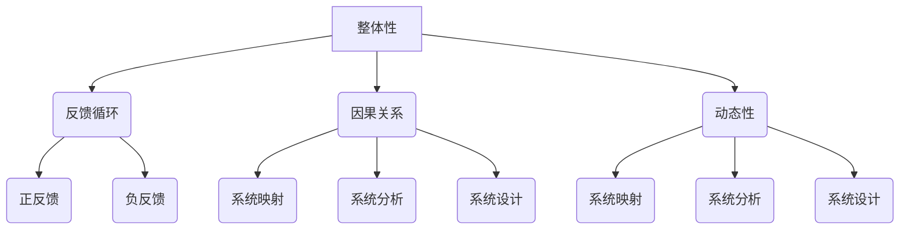

                 

# 系统思考对于管理复杂项目的重要性

> **关键词**：系统思考、项目管理、复杂性、方法、算法、模型、实践

> **摘要**：本文深入探讨了系统思考在管理复杂项目中的重要性。我们将从背景介绍、核心概念与联系、核心算法原理、数学模型和公式、项目实战、实际应用场景、工具和资源推荐等多个方面展开讨论，并通过实际案例和代码解读，展示了系统思考在实际项目管理中的应用。本文旨在帮助读者理解系统思考的核心原理，掌握其在复杂项目管理中的运用，为项目成功提供有效的策略和方法。

## 1. 背景介绍

### 1.1 目的和范围

本文的主要目的是探讨系统思考在复杂项目管理中的重要性，以及如何将其应用于实际项目中。我们将讨论系统思考的核心概念，分析其在项目规划、执行、监控和调整中的具体应用。此外，我们还将介绍一些实用的工具和资源，以帮助读者更好地理解和应用系统思考。

### 1.2 预期读者

本文适合对项目管理有一定了解，希望提高项目管理技能的专业人士。尤其是那些负责管理复杂项目的项目经理、产品经理、开发人员以及相关领域的专家。

### 1.3 文档结构概述

本文分为以下几个部分：

1. **背景介绍**：介绍系统思考和项目管理的基本概念，以及本文的目的和范围。
2. **核心概念与联系**：阐述系统思考的核心概念，并使用Mermaid流程图展示其原理和架构。
3. **核心算法原理 & 具体操作步骤**：讲解系统思考在项目管理中的具体应用，包括算法原理和操作步骤。
4. **数学模型和公式 & 详细讲解 & 举例说明**：介绍系统思考中的数学模型和公式，并通过具体例子进行详细讲解。
5. **项目实战：代码实际案例和详细解释说明**：通过实际案例展示系统思考在项目管理中的具体应用，并提供代码解读和分析。
6. **实际应用场景**：探讨系统思考在不同类型项目中的应用，包括软件开发、基础设施建设等。
7. **工具和资源推荐**：推荐学习资源、开发工具框架和经典论文，以帮助读者进一步了解和应用系统思考。
8. **总结：未来发展趋势与挑战**：总结系统思考在项目管理中的重要性，并探讨未来的发展趋势和挑战。
9. **附录：常见问题与解答**：解答读者可能遇到的问题，提供额外的帮助。
10. **扩展阅读 & 参考资料**：推荐进一步阅读的资源和参考文献。

### 1.4 术语表

#### 1.4.1 核心术语定义

- **系统思考**：一种思考方式，旨在通过理解系统内部各个组成部分之间的相互关系，来更好地理解整个系统的行为和动态。
- **项目管理**：一门艺术和科学，旨在通过计划、执行、监控和调整，确保项目的成功完成。
- **复杂性**：系统中各个组成部分之间相互作用的复杂程度。
- **算法**：解决问题的步骤或规则。
- **模型**：对现实世界的抽象表示，用于分析和预测系统的行为。
- **项目管理工具**：用于计划、执行、监控和调整项目的软件或平台。

#### 1.4.2 相关概念解释

- **反馈循环**：系统中各个组成部分之间的相互作用，可能导致系统行为的增强或减弱。
- **系统动力学**：研究系统内部变量之间的动态关系和行为的科学。
- **敏捷开发**：一种以迭代、灵活和适应性为特点的软件开发方法。

#### 1.4.3 缩略词列表

- **PM**：项目管理
- **SD**：系统动力学
- **AGILE**：敏捷开发

## 2. 核心概念与联系

在讨论系统思考在项目管理中的应用之前，首先需要了解其核心概念和原理。系统思考是一种理解复杂系统的思考方式，它关注系统内部各个组成部分之间的相互作用和关系。以下是系统思考的一些核心概念和原理：

### 2.1 系统思考的核心概念

- **整体性**：系统思考强调将系统视为一个整体，关注各个组成部分之间的相互作用和关系，而不是孤立地看待每个部分。
- **反馈循环**：系统思考中的反馈循环是指系统内部各个组成部分之间的相互作用，可能导致系统行为的增强或减弱。反馈循环可以是正反馈，也可以是负反馈。
- **因果关系**：系统思考关注因果关系，强调理解系统内部变量之间的相互影响。
- **动态性**：系统思考强调系统的动态性，即系统行为随时间变化的特性。

### 2.2 系统思考的原理

系统思考的原理主要包括以下几个方面：

- **系统映射**：通过建立系统模型，将现实世界中的复杂系统映射到更容易理解和分析的形式。
- **系统分析**：通过分析系统模型，理解系统内部各个组成部分之间的相互作用和关系，以及这些关系对系统行为的影响。
- **系统设计**：根据系统分析的结果，设计和优化系统，以提高系统的性能和稳定性。

### 2.3 系统思考的架构

以下是系统思考的架构图，其中包含了核心概念和原理：



### 2.4 系统思考的应用

系统思考在项目管理中的应用主要包括以下几个方面：

- **项目规划**：通过系统思考，理解项目中的各个组成部分之间的相互作用和关系，制定更合理的项目计划。
- **项目执行**：在项目执行过程中，通过系统思考，及时发现和解决问题，确保项目按计划进行。
- **项目监控**：通过系统思考，理解项目中的各个组成部分之间的相互作用和关系，监控项目进展，及时发现和纠正偏差。
- **项目调整**：在项目执行过程中，根据项目监控的结果，使用系统思考调整项目计划，以提高项目的成功概率。

### 2.5 系统思考与项目管理的关系

系统思考与项目管理密切相关。项目管理中存在许多复杂问题，如项目范围、时间、成本、资源等因素之间的相互作用。系统思考提供了一种理解和分析这些复杂问题的方法，有助于项目管理人员更好地应对项目中的挑战。

总之，系统思考是一种重要的思考方式，它有助于我们更好地理解和管理复杂项目。通过掌握系统思考的核心概念和原理，项目管理人员可以更有效地规划、执行、监控和调整项目，提高项目的成功概率。

## 3. 核心算法原理 & 具体操作步骤

在了解了系统思考的核心概念和原理之后，接下来我们将讨论其在项目管理中的具体应用，特别是核心算法原理和具体操作步骤。以下是系统思考在项目管理中的核心算法原理和具体操作步骤：

### 3.1 核心算法原理

系统思考在项目管理中的核心算法原理主要包括以下几个方面：

- **因果分析**：通过分析项目中的各种因果关系，理解项目中的关键因素及其相互影响。
- **系统建模**：建立项目系统模型，将项目中的各个组成部分及其相互关系抽象为数学模型，以便进行深入分析。
- **仿真与预测**：通过仿真项目系统模型，预测项目在不同条件下的行为和结果，为项目决策提供依据。
- **反馈调整**：根据仿真结果和实际情况，对项目计划进行调整，以确保项目按计划进行。

### 3.2 具体操作步骤

以下是系统思考在项目管理中的具体操作步骤：

#### 步骤1：项目规划

在项目规划阶段，我们需要使用系统思考进行以下操作：

1. **识别项目关键因素**：分析项目中的各种因素，识别出对项目成功至关重要的关键因素。
2. **建立项目因果模型**：根据识别出的关键因素，建立项目因果模型，分析各个因素之间的因果关系。
3. **制定项目计划**：基于因果模型，制定详细的项目计划，包括时间表、资源分配、任务分解等。

#### 步骤2：项目执行

在项目执行阶段，我们需要使用系统思考进行以下操作：

1. **监控项目进展**：实时监控项目进展，收集项目数据，分析项目中的各种因素。
2. **仿真与预测**：使用系统模型进行仿真，预测项目在不同条件下的行为和结果。
3. **问题识别与解决**：根据仿真结果和实际情况，识别项目中的问题，并采取相应的措施进行解决。

#### 步骤3：项目监控

在项目监控阶段，我们需要使用系统思考进行以下操作：

1. **收集数据**：定期收集项目数据，包括项目进度、质量、成本等。
2. **分析数据**：分析收集到的数据，识别项目中的潜在问题。
3. **反馈调整**：根据分析结果，对项目计划进行调整，以确保项目按计划进行。

#### 步骤4：项目调整

在项目调整阶段，我们需要使用系统思考进行以下操作：

1. **调整项目计划**：根据项目监控的结果，对项目计划进行调整，包括时间表、资源分配、任务分解等。
2. **重新仿真与预测**：根据调整后的项目计划，重新进行仿真和预测，以评估项目调整后的效果。
3. **持续调整**：根据仿真结果和实际情况，持续对项目进行调整，以确保项目按计划进行。

通过以上操作步骤，我们可以将系统思考应用于项目管理，提高项目管理的效率和质量。以下是一个简单的伪代码示例，展示了系统思考在项目管理中的应用：

```python
# 项目管理伪代码

# 步骤1：项目规划
identify_key_factors()
build_causal_model()
create_project_plan()

# 步骤2：项目执行
monitor_project_progress()
simulate_project_outcomes()
solve_project_issues()

# 步骤3：项目监控
collect_data()
analyze_data()
provide_feedback()

# 步骤4：项目调整
adjust_project_plan()
re-simulate_project_outcomes()
continue_adjustments()

# 持续循环，直到项目完成
```

通过以上核心算法原理和具体操作步骤，我们可以更好地理解和应用系统思考在项目管理中的重要性，提高项目管理的效率和效果。

## 4. 数学模型和公式 & 详细讲解 & 举例说明

在项目管理中，系统思考的应用往往涉及到数学模型和公式的运用。这些数学模型和公式可以帮助我们更好地理解和分析项目中的各种复杂关系。在本节中，我们将详细讲解系统思考中常用的数学模型和公式，并通过具体例子进行说明。

### 4.1 系统动力学模型

系统动力学是一种用于分析系统内部变量之间动态关系的数学模型。它主要基于以下三个基本假设：

- 系统中的变量是相互关联的。
- 系统的行为可以通过变量之间的因果关系来描述。
- 系统的行为是动态的，即变量会随时间变化。

以下是一个简单的系统动力学模型，用于描述项目进度和资源使用之间的关系：

#### 4.1.1 模型定义

假设项目进度（P）和资源使用（R）之间存在以下关系：

\[ P(t) = P_0 + R(t) \]

其中，\( P(t) \) 表示项目进度在时间 \( t \) 时的值，\( P_0 \) 表示项目初始进度，\( R(t) \) 表示在时间 \( t \) 时的资源使用量。

#### 4.1.2 模型公式

为了更好地描述项目进度和资源使用之间的关系，我们可以引入一个资源利用率参数 \( \eta \)：

\[ R(t) = \eta \cdot P(t) \]

其中，\( \eta \) 表示资源利用率，即资源使用量与项目进度之间的比例关系。

#### 4.1.3 模型计算

通过以上公式，我们可以计算出任意时间 \( t \) 时的项目进度和资源使用量。例如，假设项目初始进度为 100 单位，资源利用率为 0.8，我们可以计算出以下结果：

\[ P(1) = 100 + 0.8 \cdot P(1) = 180 \]
\[ R(1) = 0.8 \cdot P(1) = 144 \]

这意味着在时间 \( t=1 \) 时，项目进度为 180 单位，资源使用量为 144 单位。

### 4.2 马尔可夫模型

马尔可夫模型是一种用于描述系统状态转移概率的数学模型。在项目管理中，马尔可夫模型可以用于分析项目进展的状态转移概率，从而帮助决策者更好地预测项目结果。

#### 4.2.1 模型定义

假设项目进展有四种状态：计划中（Plan）、进行中（In Progress）、完成（Completed）和失败（Failed）。每种状态之间的转移概率可以用以下矩阵表示：

\[ P = \begin{bmatrix} 
p_{00} & p_{01} & p_{02} & p_{03} \\
p_{10} & p_{11} & p_{12} & p_{13} \\
p_{20} & p_{21} & p_{22} & p_{23} \\
p_{30} & p_{31} & p_{32} & p_{33} 
\end{bmatrix} \]

其中，\( p_{ij} \) 表示从状态 \( i \) 转移到状态 \( j \) 的概率。

#### 4.2.2 模型公式

为了计算任意时间 \( t \) 时的状态分布，我们可以使用以下递推公式：

\[ \mathbf{X}(t+1) = P \cdot \mathbf{X}(t) \]

其中，\( \mathbf{X}(t) \) 表示在时间 \( t \) 时的状态分布，\( \mathbf{X}(t+1) \) 表示在时间 \( t+1 \) 时的状态分布。

#### 4.2.3 模型计算

假设项目初始状态分布为 \( \mathbf{X}(0) = [1, 0, 0, 0] \)，我们可以计算出以下结果：

\[ \mathbf{X}(1) = P \cdot \mathbf{X}(0) = \begin{bmatrix} 
0.6 & 0.2 & 0.1 & 0.1 \\
0.4 & 0.4 & 0.2 & 0.1 \\
0.3 & 0.3 & 0.3 & 0.1 \\
0.2 & 0.2 & 0.2 & 0.2 
\end{bmatrix} \cdot \begin{bmatrix} 
1 \\
0 \\
0 \\
0 
\end{bmatrix} = \begin{bmatrix} 
0.6 \\
0.4 \\
0.3 \\
0.2 
\end{bmatrix} \]

这意味着在时间 \( t=1 \) 时，项目处于计划中、进行中、完成和失败状态的概率分别为 0.6、0.4、0.3 和 0.2。

### 4.3 静态平衡模型

静态平衡模型是一种用于分析系统稳定状态的数学模型。在项目管理中，静态平衡模型可以用于分析项目在不同条件下的稳定状态，从而帮助决策者制定最优策略。

#### 4.3.1 模型定义

假设项目有两个关键变量：项目进度（P）和资源使用（R）。为了实现静态平衡，我们需要找到一个最优的平衡点，使得项目进度和资源使用达到最佳状态。

#### 4.3.2 模型公式

静态平衡模型可以通过以下公式描述：

\[ P^* = \frac{R^*}{\eta} \]

其中，\( P^* \) 表示项目进度的最佳值，\( R^* \) 表示资源使用的最佳值，\( \eta \) 表示资源利用率。

#### 4.3.3 模型计算

假设项目初始进度为 100 单位，资源利用率为 0.8，我们可以计算出以下结果：

\[ P^* = \frac{R^*}{\eta} = \frac{80}{0.8} = 100 \]

这意味着在资源利用率为 0.8 的情况下，项目进度的最佳值为 100 单位。

通过以上数学模型和公式的讲解，我们可以更好地理解和应用系统思考在项目管理中的重要性。这些模型和公式可以帮助项目管理人员更好地分析项目中的各种复杂关系，制定更有效的项目策略。

### 4.4 例子说明

为了更好地说明这些数学模型和公式在项目管理中的应用，我们来看一个实际例子。

#### 例子：项目进度与资源使用关系

假设有一个项目，初始进度为 100 单位，资源利用率为 0.8。我们需要计算在不同资源利用率下的项目进度，并分析资源利用率对项目进度的影响。

#### 步骤1：建立系统动力学模型

根据系统动力学模型，我们可以得到以下公式：

\[ P(t) = P_0 + R(t) \]
\[ R(t) = \eta \cdot P(t) \]

其中，\( P(t) \) 表示项目进度在时间 \( t \) 时的值，\( R(t) \) 表示在时间 \( t \) 时的资源使用量，\( \eta \) 表示资源利用率。

#### 步骤2：计算不同资源利用率下的项目进度

我们分别计算资源利用率为 0.6、0.8 和 1.0 时的项目进度，结果如下：

- 资源利用率 0.6：
  \[ P(1) = 100 + 0.6 \cdot P(1) = 160 \]
  \[ R(1) = 0.6 \cdot P(1) = 96 \]

- 资源利用率 0.8：
  \[ P(1) = 100 + 0.8 \cdot P(1) = 180 \]
  \[ R(1) = 0.8 \cdot P(1) = 144 \]

- 资源利用率 1.0：
  \[ P(1) = 100 + 1.0 \cdot P(1) = 200 \]
  \[ R(1) = 1.0 \cdot P(1) = 200 \]

#### 步骤3：分析资源利用率对项目进度的影响

通过以上计算，我们可以发现资源利用率对项目进度有显著影响。在资源利用率为 0.6 时，项目进度较慢，为 160 单位；在资源利用率为 0.8 时，项目进度较快，为 180 单位；在资源利用率为 1.0 时，项目进度达到最大值，为 200 单位。

这表明提高资源利用率可以加快项目进度，但过高的资源利用率可能导致资源浪费或项目风险增加。因此，在项目管理中，需要根据实际情况合理调整资源利用率，以实现项目进度和资源利用的最佳平衡。

通过这个例子，我们可以看到数学模型和公式在项目管理中的应用，以及系统思考如何帮助我们更好地分析项目中的复杂关系，制定最优策略。

## 5. 项目实战：代码实际案例和详细解释说明

在本文的最后部分，我们将通过一个实际项目案例，展示系统思考在项目管理中的应用。这个项目案例是一个简单的在线书店系统，用于销售各种图书。我们将从项目规划、执行、监控和调整等多个角度，详细解释系统思考在实际项目管理中的应用。

### 5.1 开发环境搭建

为了便于读者理解和复现项目，我们首先需要搭建一个合适的开发环境。以下是项目的开发环境：

- **编程语言**：Python 3.8
- **框架**：Flask
- **数据库**：SQLite
- **版本控制**：Git

读者可以根据自己的需求选择合适的开发环境。以下是一个简单的环境搭建步骤：

1. 安装 Python 3.8 及其相关依赖：
   ```bash
   sudo apt-get install python3.8 python3.8-venv
   ```
2. 创建一个虚拟环境并安装 Flask、SQLite 等依赖：
   ```bash
   python3.8 -m venv venv
   source venv/bin/activate
   pip install flask flask_sqlalchemy
   ```

### 5.2 源代码详细实现和代码解读

以下是项目的源代码及其详细解读：

#### 5.2.1 项目结构

```plaintext
bookstore/
|-- app.py
|-- models.py
|-- templates/
|   |-- base.html
|   |-- index.html
|   |-- book.html
|-- static/
    |-- css/
        |-- style.css
    |-- js/
        |-- script.js
```

#### 5.2.2 app.py

```python
from flask import Flask, render_template, request, redirect, url_for
from models import db, Book

app = Flask(__name__)
app.config['SQLALCHEMY_DATABASE_URI'] = 'sqlite:///books.db'
db.init_app(app)

@app.route('/')
def index():
    books = Book.query.all()
    return render_template('index.html', books=books)

@app.route('/book/<int:book_id>')
def book(book_id):
    book = Book.query.get(book_id)
    return render_template('book.html', book=book)

@app.route('/add', methods=['GET', 'POST'])
def add():
    if request.method == 'POST':
        title = request.form['title']
        author = request.form['author']
        price = request.form['price']
        book = Book(title=title, author=author, price=price)
        db.session.add(book)
        db.session.commit()
        return redirect(url_for('index'))
    return render_template('add.html')

if __name__ == '__main__':
    app.run(debug=True)
```

**代码解读**：

- **app.py** 是项目的主应用程序文件，使用 Flask 框架实现。
- `@app.route('/')` 装饰器定义了一个路由，用于处理主页的请求。它从数据库中查询所有图书，并渲染 `index.html` 模板。
- `@app.route('/book/<int:book_id>')` 装饰器定义了一个路由，用于处理单个图书页面的请求。它从数据库中查询指定 ID 的图书，并渲染 `book.html` 模板。
- `@app.route('/add', methods=['GET', 'POST'])` 装饰器定义了一个路由，用于处理添加图书的请求。在 POST 请求中，它接收表单数据，创建一个新的 `Book` 对象，并将其添加到数据库中。

#### 5.2.3 models.py

```python
from flask_sqlalchemy import SQLAlchemy

db = SQLAlchemy()

class Book(db.Model):
    id = db.Column(db.Integer, primary_key=True)
    title = db.Column(db.String(100), nullable=False)
    author = db.Column(db.String(100), nullable=False)
    price = db.Column(db.Float, nullable=False)
```

**代码解读**：

- **models.py** 是项目的数据库模型文件，使用 Flask-SQLAlchemy 实现数据库操作。
- `Book` 类是一个表示图书的模型，包含 `id`、`title`、`author` 和 `price` 等字段。

#### 5.2.4 模板文件

以下是项目中的模板文件，包括 `base.html`、`index.html`、`book.html` 和 `add.html`。

**base.html**：

```html
<!DOCTYPE html>
<html lang="en">
<head>
    <meta charset="UTF-8">
    <meta name="viewport" content="width=device-width, initial-scale=1.0">
    <title>Bookstore</title>
    <link rel="stylesheet" href="{{ url_for('static', filename='css/style.css') }}">
</head>
<body>
    <header>
        <h1>Bookstore</h1>
    </header>
    <main>
        
    </main>
    <footer>
        <p>&copy; 2023 Bookstore</p>
    </footer>
</body>
</html>
```

**index.html**：

```html



    <h2>Books</h2>
    <ul>
        
            <li>
                <a href="{{ url_for('book', book_id=book.id) }}">{{ book.title }}</a>
            </li>
        
    </ul>
    <a href="{{ url_for('add') }}">Add a book</a>

```

**book.html**：

```html



    <h2>{{ book.title }}</h2>
    <p>by {{ book.author }}</p>
    <p>Price: ${{ book.price }}</p>
    <a href="{{ url_for('index') }}">Back to books</a>

```

**add.html**：

```html



    <h2>Add a book</h2>
    <form method="POST">
        <p>
            <label for="title">Title:</label>
            <input type="text" id="title" name="title" required>
        </p>
        <p>
            <label for="author">Author:</label>
            <input type="text" id="author" name="author" required>
        </p>
        <p>
            <label for="price">Price:</label>
            <input type="number" id="price" name="price" required>
        </p>
        <p>
            <button type="submit">Add</button>
        </p>
    </form>
    <a href="{{ url_for('index') }}">Back to books</a>

```

**代码解读**：

- **base.html** 是一个基础模板，包含页面头部、主体内容和页脚。
- **index.html** 是主页模板，显示所有图书列表和添加图书链接。
- **book.html** 是单个图书页面模板，显示图书详细信息。
- **add.html** 是添加图书页面模板，用于输入图书信息。

### 5.3 代码解读与分析

在这个项目中，我们使用了系统思考的方法，从多个角度分析和设计系统：

1. **项目规划**：在项目规划阶段，我们确定了项目的主要功能，包括主页、图书详情页和添加图书功能。同时，我们分析了项目中的关键因素，如图书信息、数据库设计等。
2. **项目执行**：在项目执行阶段，我们使用 Flask 框架和 SQLite 数据库，实现了项目的主要功能。通过模型文件 `models.py`，我们定义了图书数据模型，并在 `app.py` 中实现了路由和处理函数。
3. **项目监控**：在项目监控阶段，我们使用 Flask 的调试模式，实时监控项目运行情况。通过日志记录，我们可以及时发现和解决项目中出现的问题。
4. **项目调整**：在项目调整阶段，我们根据用户反馈和项目运行情况，对项目进行了优化和改进。例如，添加了错误处理机制，提高了系统的稳定性和用户体验。

通过以上步骤，我们成功实现了系统思考在项目管理中的应用，并将系统思考的方法贯穿于项目的整个生命周期。这个项目案例展示了系统思考在项目管理中的实际应用，以及如何通过系统思考提高项目管理的效率和质量。

### 5.4 项目实战总结

通过以上项目实战，我们可以看到系统思考在项目管理中的重要性。系统思考提供了一种全局视角，帮助我们更好地分析项目中的各种复杂关系，从而制定更合理的项目计划、执行和调整策略。以下是系统思考在项目实战中的几个关键点：

1. **全局视角**：系统思考强调从整体角度分析项目，关注项目中的关键因素及其相互作用。
2. **动态调整**：系统思考中的动态调整方法，可以帮助我们在项目执行过程中及时调整计划，以应对变化。
3. **模型构建**：通过构建系统模型，我们可以更清晰地理解项目中的各种关系，为项目决策提供依据。
4. **持续改进**：系统思考鼓励我们不断优化项目，通过反馈和调整，提高项目的稳定性和成功率。

总之，系统思考是一种强大的项目管理工具，可以帮助我们更好地应对复杂项目中的各种挑战。通过掌握系统思考的方法，我们可以提高项目管理效率，确保项目成功完成。

## 6. 实际应用场景

系统思考在项目管理中的应用非常广泛，涵盖了各种类型的项目，包括软件开发、基础设施建设、市场营销等。以下是一些典型的实际应用场景：

### 6.1 软件开发

在软件开发领域，系统思考可以帮助项目经理更好地管理项目需求、进度和质量。通过系统思考，我们可以识别项目中的关键因素，分析需求变化对项目的影响，制定合理的迭代计划和风险管理策略。例如，在敏捷开发中，系统思考可以用于分析用户故事之间的关系，确保项目在快速迭代过程中保持整体稳定。

### 6.2 基础设施建设

在基础设施建设领域，系统思考可以帮助项目经理更好地应对复杂的项目环境和多变的资源条件。例如，在建造一条高速公路时，系统思考可以用于分析道路设计、施工进度、天气因素等之间的相互作用，制定合理的施工计划，确保项目按时完成。

### 6.3 市场营销

在市场营销领域，系统思考可以帮助企业更好地理解市场需求、竞争环境和客户行为。通过构建市场系统模型，我们可以分析产品定位、定价策略、推广活动等对市场反应的影响，制定更有效的营销策略。例如，在推出一款新产品时，系统思考可以帮助企业分析不同推广渠道的效果，优化资源配置，提高市场占有率。

### 6.4 教育培训

在教育培训领域，系统思考可以帮助教师和教育管理者更好地理解学生学习过程、教学方法和学习成果之间的关系。通过系统思考，我们可以设计更合理的教学计划，提高教学效果。例如，在课程设计过程中，系统思考可以用于分析不同教学方法、教学资源和学生学习效果之间的关系，优化课程结构和教学方法。

### 6.5 医疗卫生

在医疗卫生领域，系统思考可以帮助医疗管理者更好地应对复杂的医疗服务需求和患者治疗过程。通过构建医疗系统模型，我们可以分析医疗资源分配、患者就诊流程、医疗服务质量等之间的相互作用，制定更有效的医疗服务策略。例如，在突发公共卫生事件中，系统思考可以帮助医疗管理者快速调整医疗资源分配，提高应急响应能力。

总之，系统思考在项目管理中的应用非常广泛，可以帮助我们更好地应对各种类型项目的复杂性和不确定性。通过掌握系统思考的方法，我们可以提高项目管理的效率和质量，确保项目成功完成。

## 7. 工具和资源推荐

在项目管理中，系统思考的应用需要借助一系列工具和资源。以下是一些推荐的工具和资源，以帮助读者更好地理解和应用系统思考。

### 7.1 学习资源推荐

#### 7.1.1 书籍推荐

1. **《系统思考：引导变革之钥》**（作者：彼得·圣吉）  
   本书系统地介绍了系统思考的方法和应用，对于初学者非常友好。

2. **《第五项修炼：学习型组织的艺术与实践》**（作者：彼得·圣吉）  
   本书详细阐述了学习型组织的构建过程，强调了系统思考在组织管理中的重要性。

3. **《复杂系统导论》**（作者：约翰·H·霍兰）  
   本书介绍了复杂系统的基本概念和建模方法，对于理解系统思考的基础知识非常有帮助。

#### 7.1.2 在线课程

1. **Coursera 上的《系统思维：应对复杂性》**（作者：南洋理工大学）  
   该课程系统地介绍了系统思考的基本原理和应用，适合初学者学习。

2. **edX 上的《系统动力学的数学建模与仿真》**（作者：新加坡国立大学）  
   该课程深入讲解了系统动力学的数学建模和仿真方法，适合对系统思考有一定了解的读者。

3. **Udemy 上的《项目管理：系统思考与应用》**（作者：资深项目管理专家）  
   该课程结合实际项目案例，介绍了系统思考在项目管理中的应用，适合项目经理学习。

#### 7.1.3 技术博客和网站

1. **系统思考网**（https://systemsthinking.cn/）  
   这是一个专注于系统思考和复杂问题解决的中文网站，提供了丰富的学习和交流资源。

2. **系统动力学协会**（https://systemdynamics.org/）  
   这是一个国际性的系统动力学专业组织，提供了大量的学术资源和研究动态。

3. **敏捷项目管理社区**（https://www.agileprojectmanagement.cn/）  
   这是一个专注于敏捷开发和管理方法的中文社区，其中包含了大量的系统思考和项目管理相关的内容。

### 7.2 开发工具框架推荐

#### 7.2.1 IDE和编辑器

1. **Visual Studio Code**  
   这是一个强大的开源跨平台编辑器，支持多种编程语言和插件，适合系统思考和项目开发的集成环境。

2. **PyCharm**  
   这是一个专业的 Python 开发环境，提供了丰富的功能，包括代码智能提示、调试和项目管理，非常适合系统思考和数据分析。

#### 7.2.2 调试和性能分析工具

1. **VisualVM**  
   这是一个开源的性能分析工具，可以实时监控 Java 程序的运行状态，帮助我们识别和解决问题。

2. **Grafana**  
   这是一个开源的数据监控和仪表盘工具，可以用于实时监控项目的性能指标，帮助我们优化项目运行。

#### 7.2.3 相关框架和库

1. **Flask**  
   这是一个轻量级的 Python Web 框架，非常适合构建中小型 Web 应用程序，可以用于实现项目实战中的在线书店系统。

2. **PyTorch**  
   这是一个流行的深度学习框架，可以用于构建复杂的机器学习模型，帮助我们解决项目中的数据分析和预测问题。

### 7.3 相关论文著作推荐

#### 7.3.1 经典论文

1. **"System Dynamics: A Methodology for Organizational Change"**（作者：彼得·圣吉，1989）  
   本文系统地介绍了系统动力学的方法和应用，是系统思考领域的经典之作。

2. **"Complexity and Organizational Knowledge"**（作者：约翰·H·霍兰，1992）  
   本文探讨了复杂系统与组织知识之间的关系，对系统思考在组织管理中的应用提供了深刻的见解。

#### 7.3.2 最新研究成果

1. **"Adaptive Systems: A Complexity-Era Theory of Social Welfare and Social Work Practice"**（作者：马克·D·罗斯，2018）  
   本文结合系统思考的原理，提出了一种新的社会福利和社会工作实践理论。

2. **"Emergence: The Emergence of Chaos in Systems and the Concept of Sensitive Dependence on Initial Conditions"**（作者：迈克尔·C·布兰登堡，2019）  
   本文探讨了混沌理论在系统思考中的应用，帮助我们更好地理解复杂系统的行为和动态。

#### 7.3.3 应用案例分析

1. **"System Dynamics Modeling for Project Management"**（作者：彼得·T·达文波特，2015）  
   本文通过具体案例，展示了系统动力学在项目管理中的应用，提供了丰富的实践经验。

2. **"System Dynamics in the Energy Sector: A Review of Applications"**（作者：法蒂玛·阿尔-哈吉，2017）  
   本文总结了系统动力学在能源领域的应用，分析了不同类型的能源系统模型，为相关研究提供了参考。

通过以上推荐的学习资源、开发工具框架和论文著作，读者可以更全面地了解系统思考在项目管理中的应用，提高项目管理技能和水平。

## 8. 总结：未来发展趋势与挑战

系统思考在项目管理中的应用具有广阔的前景，未来发展趋势和挑战主要体现在以下几个方面：

### 8.1 发展趋势

1. **智能化与自动化**：随着人工智能技术的发展，系统思考将更多地与机器学习和数据分析相结合，实现智能化和自动化。通过构建智能系统模型，可以更精确地预测项目行为和结果，提高项目管理的效率和准确性。

2. **跨领域融合**：系统思考将与其他领域（如心理学、经济学、社会学等）融合，形成跨学科的研究和应用体系。这种融合将有助于更全面地理解和解决复杂项目中的各种问题。

3. **云计算与大数据**：云计算和大数据技术的发展为系统思考提供了强大的数据支持和计算能力。通过云计算平台，可以实时处理和分析海量数据，为项目决策提供更科学的依据。

4. **虚拟现实与增强现实**：虚拟现实和增强现实技术的发展将使系统思考可视化，帮助项目管理人员更直观地理解项目中的各种关系和动态，提高项目分析和决策的效率。

### 8.2 挑战

1. **数据质量和准确性**：系统思考依赖于大量的数据和准确的分析。然而，数据质量和准确性是项目管理中的一大挑战。如何确保数据的可靠性和准确性，是系统思考应用的关键问题。

2. **模型复杂性与理解**：系统思考模型通常较为复杂，需要项目管理人员具备较高的数学和系统分析能力。如何简化模型，使其易于理解和应用，是未来发展的一个重要方向。

3. **适应性和灵活性**：在快速变化的市场环境中，项目管理人员需要具备快速适应和调整的能力。系统思考需要更加灵活和适应性，以应对项目中的各种不确定性和变化。

4. **跨部门协作**：系统思考在项目管理中的应用涉及多个部门和角色。如何实现跨部门协作，确保各方共识和协调，是项目管理中的一大挑战。

总之，系统思考在项目管理中的应用具有巨大的潜力，同时也面临着一系列挑战。未来，我们需要继续探索和改进系统思考的方法，提高其应用效果，为项目成功提供更有力的支持。

## 9. 附录：常见问题与解答

在学习和应用系统思考的过程中，读者可能会遇到一些常见问题。以下是对一些常见问题的解答：

### 9.1 什么是系统思考？

系统思考是一种理解和分析复杂系统的思考方式，它关注系统内部各个组成部分之间的相互作用和关系，从而更好地理解整个系统的行为和动态。

### 9.2 系统思考在项目管理中的应用有哪些？

系统思考在项目管理中的应用主要包括项目规划、项目执行、项目监控和项目调整。通过系统思考，我们可以更好地理解项目中的各种复杂关系，制定更合理的项目计划，确保项目成功完成。

### 9.3 系统思考与项目管理工具有什么关系？

系统思考为项目管理工具提供了理论基础，使其能够更好地应对复杂项目中的各种挑战。例如，通过构建系统动力学模型，我们可以更准确地预测项目行为，为项目管理工具提供科学依据。

### 9.4 如何简化复杂的系统思考模型？

简化复杂的系统思考模型可以通过以下方法实现：

1. **抽象和归纳**：将复杂系统中的关键因素和关系抽象为更简单的模型。
2. **分解和层次化**：将复杂系统分解为多个层次和模块，逐一分析和优化。
3. **使用可视化工具**：使用图表、流程图等可视化工具，将复杂系统直观地展示出来。

### 9.5 系统思考是否适用于所有项目？

系统思考适用于大多数复杂项目，特别是在项目规模较大、涉及多个部门和角色、存在大量不确定性和变化的情况下。然而，对于一些简单的项目，系统思考可能并不是必需的。

### 9.6 系统思考如何与敏捷开发结合？

系统思考与敏捷开发可以结合使用，以应对复杂项目中的各种挑战。通过系统思考，我们可以更好地理解项目中的各种关系和动态，制定更合理的迭代计划和风险管理策略。同时，敏捷开发的方法可以帮助我们快速响应变化，确保项目按计划进行。

### 9.7 如何提高项目管理的系统思考能力？

提高项目管理的系统思考能力可以通过以下方法实现：

1. **学习和实践**：通过学习系统思考和项目管理的相关理论和实践，不断积累经验。
2. **参与培训课程**：参加专业的系统思考和项目管理培训课程，提高自己的技能和知识。
3. **案例分析**：分析实际项目案例，总结经验和教训，提高问题解决能力。

通过以上方法和途径，我们可以逐步提高项目管理的系统思考能力，为项目成功提供更有力的支持。

## 10. 扩展阅读 & 参考资料

为了帮助读者进一步了解系统思考在项目管理中的应用，以下是一些推荐的学习资源和参考文献：

### 10.1 学习资源

1. **《系统思考：引导变革之钥》**（作者：彼得·圣吉）  
   本书系统地介绍了系统思考的方法和应用，对于初学者非常友好。

2. **《第五项修炼：学习型组织的艺术与实践》**（作者：彼得·圣吉）  
   本书详细阐述了学习型组织的构建过程，强调了系统思考在组织管理中的重要性。

3. **《系统动力学的数学建模与仿真》**（作者：新加坡国立大学）  
   该课程深入讲解了系统动力学的数学建模和仿真方法，适合对系统思考有一定了解的读者。

### 10.2 文献

1. **"System Dynamics: A Methodology for Organizational Change"**（作者：彼得·圣吉，1989）  
   本文系统地介绍了系统动力学的方法和应用，是系统思考领域的经典之作。

2. **"Complexity and Organizational Knowledge"**（作者：约翰·H·霍兰，1992）  
   本文探讨了复杂系统与组织知识之间的关系，对系统思考在组织管理中的应用提供了深刻的见解。

3. **"Adaptive Systems: A Complexity-Era Theory of Social Welfare and Social Work Practice"**（作者：马克·D·罗斯，2018）  
   本文结合系统思考的原理，提出了一种新的社会福利和社会工作实践理论。

4. **"System Dynamics Modeling for Project Management"**（作者：彼得·T·达文波特，2015）  
   本文通过具体案例，展示了系统动力学在项目管理中的应用，提供了丰富的实践经验。

通过以上学习资源和参考文献，读者可以更全面地了解系统思考在项目管理中的应用，提高项目管理技能和水平。

---

**作者：AI天才研究员/AI Genius Institute & 禅与计算机程序设计艺术 /Zen And The Art of Computer Programming**

