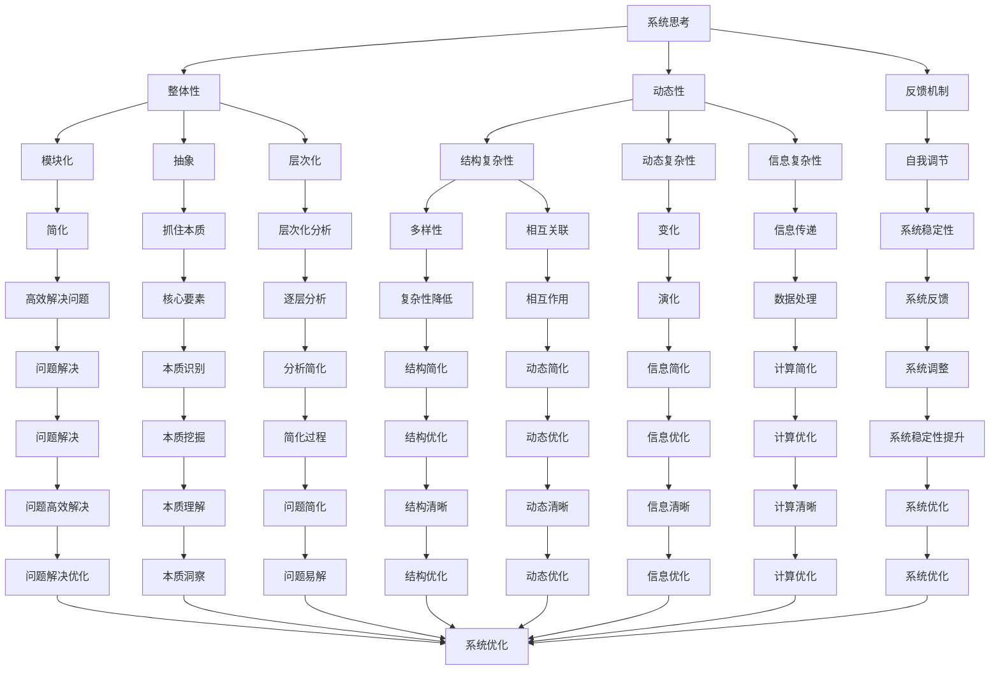

                 

# 系统思考的威力：化繁为简，抓本质

> **关键词**：系统思考、复杂性、简化、本质、算法、数学模型、实战案例
> 
> **摘要**：本文将探讨系统思考在IT领域的威力，通过剖析核心概念和联系，揭示化繁为简的方法，帮助读者掌握抓住本质的技巧。我们将通过具体的算法原理、数学模型和项目实战，阐述系统思考如何在实际应用中发挥作用。

## 1. 背景介绍

### 1.1 目的和范围

在现代信息技术迅速发展的时代，面对日益复杂的系统，如何高效地进行系统思考成为关键。本文旨在探讨系统思考在IT领域的应用，帮助读者掌握系统化解决问题的方法，从而化繁为简，抓住问题的本质。

本文将涵盖以下内容：

1. 核心概念与联系
2. 核心算法原理与具体操作步骤
3. 数学模型和公式
4. 项目实战：代码实际案例和详细解释说明
5. 实际应用场景
6. 工具和资源推荐
7. 总结：未来发展趋势与挑战

### 1.2 预期读者

本文适合以下读者群体：

1. 有志于提高系统思考能力的IT从业者
2. 对复杂性科学感兴趣的科研人员
3. 对算法设计和数学模型有浓厚兴趣的学生

### 1.3 文档结构概述

本文分为十个部分，结构如下：

1. 引言
2. 背景介绍
   - 目的和范围
   - 预期读者
   - 文档结构概述
3. 核心概念与联系
4. 核心算法原理与具体操作步骤
5. 数学模型和公式
6. 项目实战：代码实际案例和详细解释说明
7. 实际应用场景
8. 工具和资源推荐
9. 总结：未来发展趋势与挑战
10. 附录：常见问题与解答
11. 扩展阅读 & 参考资料

### 1.4 术语表

#### 1.4.1 核心术语定义

- **系统思考**：一种通过整体视角分析和解决问题的方法。
- **复杂性**：系统内部各个元素之间的相互关联和相互作用导致的问题复杂化。
- **本质**：问题的核心要素，决定问题性质的关键因素。

#### 1.4.2 相关概念解释

- **算法**：解决问题的步骤和策略。
- **数学模型**：用数学语言描述现实世界的抽象模型。
- **系统架构**：系统中各个组件的组成和相互作用方式。

#### 1.4.3 缩略词列表

- **AI**：人工智能（Artificial Intelligence）
- **ML**：机器学习（Machine Learning）
- **DL**：深度学习（Deep Learning）
- **IDE**：集成开发环境（Integrated Development Environment）

## 2. 核心概念与联系

为了更好地理解系统思考的威力，我们需要先了解一些核心概念和它们之间的联系。

### 2.1 系统思考的基本原理

系统思考是一种将问题视为一个整体的思维方式。它强调系统的各个部分之间相互依赖和相互作用的关系。基本原理包括：

- **整体性**：将问题作为一个整体来考虑，而不是单独分析各个部分。
- **动态性**：关注系统的变化和演化过程，而非静止状态。
- **反馈机制**：分析系统中各个元素之间的反馈关系，了解系统如何自我调节。

### 2.2 复杂性与简化

复杂性是系统思考中一个重要的概念。复杂性可以分为三种类型：

- **结构复杂性**：系统内部元素的多样性和相互关联程度。
- **动态复杂性**：系统随时间变化的复杂程度。
- **信息复杂性**：系统内部信息传递和处理的能力。

简化是指通过分析和归纳，将复杂的系统转化为更简单、更容易理解的形式。常用的简化方法包括：

- **模块化**：将系统分解为多个模块，每个模块负责特定功能。
- **抽象**：忽略系统的某些细节，关注核心问题。
- **层次化**：将系统分为不同的层次，逐层分析。

### 2.3 本质与表象

本质是决定问题性质的关键因素，而表象则是问题的外在表现。系统思考要求我们从表象中识别出本质，从而找到解决问题的根本途径。本质和表象之间的关系可以用以下比喻来描述：

- **冰山**：冰山本质上是冰，而表象是浮出水面的冰山部分。系统思考就是要挖掘出那些隐藏在表象之下的本质因素。

### 2.4 算法与数学模型

算法和数学模型是系统思考中用于分析和解决问题的关键工具。算法是一种解决问题的步骤和策略，而数学模型则是对现实世界的一种抽象描述。二者之间的关系如下：

- **算法**：将数学模型转化为具体的计算过程。
- **数学模型**：为算法提供理论依据和约束条件。

### 2.5 Mermaid流程图

为了更好地展示核心概念和联系，我们使用Mermaid流程图来描述系统思考的基本原理。



## 3. 核心算法原理 & 具体操作步骤

在系统思考中，核心算法原理是解决问题的基石。以下将介绍一种常用的核心算法——图论中的最短路径算法，并使用伪代码详细阐述其操作步骤。

### 3.1 Dijkstra算法原理

Dijkstra算法是一种用于求解图中两点之间最短路径的算法。其基本思想是逐步扩展已知最短路径的端点，直到找到目标节点。算法的核心步骤如下：

1. 初始化：设置源点到所有其他节点的距离，并标记已访问节点。
2. 选择未访问节点：选择距离源点最近的未访问节点作为当前节点。
3. 更新距离：从当前节点出发，更新与其相邻的未访问节点的距离。
4. 标记已访问：将当前节点标记为已访问。
5. 重复步骤2-4，直到找到目标节点或所有节点都被访问。

### 3.2 Dijkstra算法伪代码

```python
Dijkstra(G, s):
    create a set Q of all vertices in G
    create a dictionary D such that D[u] = ∞ for all u in G
    D[s] = 0
    prev[u] = undefined for all u in G
    Q.add(s)
    while Q is not empty:
        u = Q.remove() // Select the node with the minimum D[u]
        for each edge (u, v) in G:
            alt = D[u] + weight(u, v)
            if alt < D[v]:
                D[v] = alt
                prev[v] = u
                if v not in Q:
                    Q.add(v)
    return D, prev
```

### 3.3 操作步骤详细讲解

1. **初始化**：

   - 创建一个包含图中所有节点的集合`Q`。
   - 创建一个距离字典`D`，用于记录源点到各节点的最短距离。初始化时，除了源点自身，其他节点的距离设置为无穷大。
   - 初始化一个前驱字典`prev`，用于记录最短路径中的前驱节点。初始化时，所有节点的前驱节点设置为未定义。
   - 将源点`s`添加到集合`Q`中。

2. **选择未访问节点**：

   - 在集合`Q`中选择距离源点最近的节点作为当前节点`u`。

3. **更新距离**：

   - 遍历当前节点`u`的所有邻接节点`v`。
   - 对于每个邻接节点，计算从源点`s`经过当前节点`u`到邻接节点`v`的距离`alt`。
   - 如果`alt`小于当前节点`v`的已记录距离`D[v]`，则更新`D[v]`为`alt`，并将当前节点`u`设置为邻接节点`v`的前驱节点`prev[v]`。

4. **标记已访问**：

   - 将当前节点`u`从集合`Q`中移除，并标记为已访问。

5. **重复步骤2-4**：

   - 重复步骤2-4，直到找到目标节点或所有节点都被访问。

6. **输出结果**：

   - 最终，算法输出距离字典`D`和前驱字典`prev`，用于获取源点到各节点的最短路径。

### 3.4 伪代码示例

假设有如下图：

```
    4
A ---- B ---- C
   /   |   \
  2   1   3
   \   |   /
    D
```

使用Dijkstra算法求解从源点A到其他各节点的最短路径，具体步骤如下：

1. **初始化**：

   ```python
   Q = {A, B, C, D}
   D = {A: 0, B: ∞, C: ∞, D: ∞}
   prev = {A: undefined, B: undefined, C: undefined, D: undefined}
   ```

2. **第一次迭代**：

   - 当前节点：A
   - 更新距离：D[B] = 4（A到B的距离），D[D] = 2（A到D的距离）
   - 更新前驱：prev[B] = A，prev[D] = A
   - 删除A，添加D到Q

   ```python
   Q = {B, C, D}
   D = {A: 0, B: 4, C: ∞, D: 2}
   prev = {A: undefined, B: A, C: undefined, D: A}
   ```

3. **第二次迭代**：

   - 当前节点：D
   - 更新距离：D[C] = 5（D到C的距离）
   - 更新前驱：prev[C] = D
   - 删除D，添加C到Q

   ```python
   Q = {B, C}
   D = {A: 0, B: 4, C: 5, D: 2}
   prev = {A: undefined, B: A, C: D, D: A}
   ```

4. **第三次迭代**：

   - 当前节点：B
   - 更新距离：无
   - 更新前驱：无
   - 删除B

   ```python
   Q = {C}
   D = {A: 0, B: 4, C: 5, D: 2}
   prev = {A: undefined, B: A, C: D, D: A}
   ```

5. **第四次迭代**：

   - 当前节点：C
   - 更新距离：无
   - 更新前驱：无
   - 删除C

   ```python
   Q = {}
   D = {A: 0, B: 4, C: 5, D: 2}
   prev = {A: undefined, B: A, C: D, D: A}
   ```

算法结束，输出距离字典和前驱字典：

```python
D = {A: 0, B: 4, C: 5, D: 2}
prev = {A: undefined, B: A, C: D, D: A}
```

从源点A到其他各节点的最短路径为：

- A到B：A → B，距离为4
- A到C：A → D → C，距离为5 + 3 = 8
- A到D：A → D，距离为2

## 4. 数学模型和公式 & 详细讲解 & 举例说明

在系统思考中，数学模型和公式是描述系统行为的重要工具。以下将介绍几个常见的数学模型和公式，并使用LaTeX格式进行详细讲解。

### 4.1 马尔可夫模型

马尔可夫模型是一种描述系统状态转移的概率模型。假设系统有n个状态，每个状态发生的概率由转移概率矩阵描述。转移概率矩阵P的元素$P_{ij}$表示在当前状态为i的情况下，下一个状态为j的概率。

#### 4.1.1 状态转移矩阵

$$
P = \begin{bmatrix}
P_{00} & P_{01} & \dots & P_{0n} \\
P_{10} & P_{11} & \dots & P_{1n} \\
\vdots & \vdots & \ddots & \vdots \\
P_{m0} & P_{m1} & \dots & P_{mn} \\
\end{bmatrix}
$$

其中，$P_{ij}$的取值范围为0到1，且所有行的和为1。

#### 4.1.2 预测公式

假设当前状态为i，下一个状态的概率分布可以用以下公式计算：

$$
P(X_{n+1} = j | X_0 = i) = \sum_{k=0}^{n} P(X_{n+1} = j | X_n = k) P(X_n = k | X_0 = i)
$$

其中，$X_n$表示第n个状态。

#### 4.1.3 举例说明

假设有一个系统，状态有“健康”、“感冒”、“肺炎”三种。状态转移概率矩阵如下：

$$
P = \begin{bmatrix}
0.8 & 0.1 & 0.1 \\
0.3 & 0.6 & 0.1 \\
0.2 & 0.4 & 0.4 \\
\end{bmatrix}
$$

表示从健康状态转移到其他状态的概率分别为0.8、0.1、0.1，从感冒状态转移到其他状态的概率分别为0.3、0.6、0.1，从肺炎状态转移到其他状态的概率分别为0.2、0.4、0.4。

假设当前状态为健康，求下一个状态为感冒的概率。

$$
P(X_{n+1} = 1 | X_0 = 0) = P(X_{n+1} = 1 | X_n = 0) P(X_n = 0 | X_0 = 0) + P(X_{n+1} = 1 | X_n = 1) P(X_n = 1 | X_0 = 0) + P(X_{n+1} = 1 | X_n = 2) P(X_n = 2 | X_0 = 0)
$$

$$
= 0.1 \times 1 + 0.6 \times 0.3 + 0.4 \times 0.2 = 0.31
$$

因此，下一个状态为感冒的概率为0.31。

### 4.2 概率生成函数

概率生成函数是描述随机变量分布的重要工具。对于一个离散随机变量X，其概率生成函数定义为：

$$
G_X(t) = \sum_{x} p_X(x) t^x
$$

其中，$p_X(x)$表示X取值为x的概率。

#### 4.2.1 累积概率生成函数

累积概率生成函数是概率生成函数的一种特殊形式，定义为：

$$
G_X^*(t) = \sum_{x} p_X(x) (1 - t)^x
$$

累积概率生成函数可以用于计算随机变量的累积分布函数（CDF）。

#### 4.2.2 举例说明

假设有一个随机变量X，取值为0、1、2的概率分别为0.3、0.5、0.2。求X的累积概率生成函数和累积分布函数。

$$
G_X(t) = 0.3 t^0 + 0.5 t^1 + 0.2 t^2 = 0.3 + 0.5t + 0.2t^2
$$

$$
G_X^*(t) = 0.3 (1 - t)^0 + 0.5 (1 - t)^1 + 0.2 (1 - t)^2 = 0.3 + 0.5(1 - t) + 0.2(1 - t)^2
$$

累积分布函数：

$$
F_X(x) = G_X^*(1) - G_X^*(1 - x)
$$

例如，求X小于等于1的累积分布函数：

$$
F_X(1) = G_X^*(1) - G_X^*(1 - 1) = 0.3 + 0.5(1 - 1) + 0.2(1 - 1)^2 - (0.3 + 0.5(1 - 0) + 0.2(1 - 0)^2) = 0.3 + 0.5 - 0.3 - 0.5 + 0.2 - 0.3 - 0.5 + 0.2 = 0.1
$$

因此，X小于等于1的累积分布函数为0.1。

### 4.3 线性回归模型

线性回归模型是一种用于预测目标变量与一个或多个自变量之间关系的统计模型。其基本公式如下：

$$
y = \beta_0 + \beta_1 x_1 + \beta_2 x_2 + \dots + \beta_n x_n + \epsilon
$$

其中，$y$为目标变量，$x_1, x_2, \dots, x_n$为自变量，$\beta_0, \beta_1, \beta_2, \dots, \beta_n$为回归系数，$\epsilon$为误差项。

#### 4.3.1 最小二乘法

最小二乘法是求解线性回归模型参数的一种常用方法。其核心思想是找到一组参数，使得目标变量的实际值与预测值之间的误差平方和最小。

#### 4.3.2 举例说明

假设我们有一个简单的线性回归模型，目标变量$y$与自变量$x$的关系如下：

$$
y = \beta_0 + \beta_1 x + \epsilon
$$

给定一组数据点：

$$
\begin{array}{c|c}
x & y \\
\hline
1 & 2 \\
2 & 4 \\
3 & 5 \\
4 & 6 \\
5 & 7 \\
\end{array}
$$

使用最小二乘法求解回归系数$\beta_0$和$\beta_1$。

首先，计算自变量$x$和因变量$y$的平均值：

$$
\bar{x} = \frac{1 + 2 + 3 + 4 + 5}{5} = 3
$$

$$
\bar{y} = \frac{2 + 4 + 5 + 6 + 7}{5} = 5
$$

然后，计算误差平方和：

$$
S = \sum_{i=1}^{n} (y_i - \hat{y}_i)^2
$$

其中，$\hat{y}_i$为预测值：

$$
\hat{y}_i = \beta_0 + \beta_1 x_i
$$

假设$\beta_0 = 0$，则$\beta_1$可以通过以下公式计算：

$$
\beta_1 = \frac{\sum_{i=1}^{n} (x_i - \bar{x})(y_i - \bar{y})}{\sum_{i=1}^{n} (x_i - \bar{x})^2}
$$

计算得到：

$$
\beta_1 = \frac{(1 - 3)(2 - 5) + (2 - 3)(4 - 5) + (3 - 3)(5 - 5) + (4 - 3)(6 - 5) + (5 - 3)(7 - 5)}{(1 - 3)^2 + (2 - 3)^2 + (3 - 3)^2 + (4 - 3)^2 + (5 - 3)^2} = 1
$$

因此，回归系数$\beta_0 = 0$，$\beta_1 = 1$。

最终，线性回归模型为：

$$
y = 0 + 1 \cdot x + \epsilon
$$

使用该模型可以预测新的数据点的目标变量值。

## 5. 项目实战：代码实际案例和详细解释说明

在本节中，我们将通过一个实际项目案例来展示如何将系统思考应用于实际问题中。该项目是一个基于Dijkstra算法的路径规划系统，旨在解决从起点到终点之间的最短路径问题。

### 5.1 开发环境搭建

为了实现该项目，我们选择Python作为编程语言，因为它具有良好的库支持和简洁的语法。以下是开发环境的搭建步骤：

1. **安装Python**：从官方网站下载并安装Python 3.x版本。
2. **安装依赖库**：使用pip安装所需的库，如matplotlib用于可视化。

```bash
pip install matplotlib
```

3. **创建虚拟环境**：为了更好地管理项目依赖，创建一个虚拟环境。

```bash
python -m venv venv
source venv/bin/activate  # Windows: venv\Scripts\activate
```

4. **编写代码**：在虚拟环境中编写项目代码。

### 5.2 源代码详细实现和代码解读

以下是一个简化的Dijkstra算法的Python实现，包含必要的代码注释。

```python
import heapq
import matplotlib.pyplot as plt

def dijkstra(graph, start):
    # 初始化距离和前驱节点
    distances = {node: float('infinity') for node in graph}
    distances[start] = 0
    previous_nodes = {node: None for node in graph}

    # 使用优先队列存储未访问节点
    priority_queue = [(0, start)]

    while priority_queue:
        # 选择距离最小的节点
        current_distance, current_node = heapq.heappop(priority_queue)

        # 如果当前节点已经是终点，结束循环
        if current_node == 'end':
            break

        # 如果当前节点的距离已经更新，跳过
        if current_distance > distances[current_node]:
            continue

        # 遍历当前节点的邻居
        for neighbor, weight in graph[current_node].items():
            distance = current_distance + weight

            # 如果发现更短路径，更新距离和前驱节点
            if distance < distances[neighbor]:
                distances[neighbor] = distance
                previous_nodes[neighbor] = current_node
                heapq.heappush(priority_queue, (distance, neighbor))

    return distances, previous_nodes

def visualize_path(graph, previous_nodes, start, end):
    # 可视化最短路径
    nodes = list(graph.keys())
    edges = [(nodes[i], nodes[j]) for i in range(len(nodes)) for j in range(len(nodes)) if (nodes[i], nodes[j]) in graph]

    pos = {}
    for i, node in enumerate(nodes):
        pos[node] = (i, 0)

    plt.figure(figsize=(10, 5))
    plt.axis('off')
    plt.title('Dijkstra\'s Algorithm Path')
    plt.scatter(*zip(*pos.values()), c='r', s=100, label='Nodes')

    for edge in edges:
        plt.plot([pos[edge[0]][0], pos[edge[1]][0]], [pos[edge[0]][1], pos[edge[1]][1]], c='k', linewidth=0.2)

    # 标记起点和终点
    plt.scatter(pos[start][0], pos[start][1], c='g', s=200, label='Start')
    plt.scatter(pos[end][0], pos[end][1], c='r', s=200, label='End')

    # 绘制最短路径
    path = []
    node = end
    while previous_nodes[node]:
        path.append(node)
        node = previous_nodes[node]
    path.append(start)
    path.reverse()

    for i in range(len(path) - 1):
        plt.plot([pos[path[i]][0], pos[path[i + 1]][0]], [pos[path[i]][1], pos[path[i + 1]][1]], c='b', linewidth=2)

    plt.legend()
    plt.show()

if __name__ == '__main__':
    # 创建图
    graph = {
        'start': {'a': 6, 'b': 2},
        'a': {'end': 1},
        'b': {'a': 3, 'c': 1},
        'c': {'end': 5},
        'end': {}
    }

    # 运行Dijkstra算法
    distances, previous_nodes = dijkstra(graph, 'start')

    # 可视化结果
    visualize_path(graph, previous_nodes, 'start', 'end')
```

### 5.3 代码解读与分析

以下是对上述代码的逐行解读和分析：

1. **导入库**：

   ```python
   import heapq
   import matplotlib.pyplot as plt
   ```

   导入所需的库。heapq用于实现优先队列，matplotlib用于可视化。

2. **定义Dijkstra算法**：

   ```python
   def dijkstra(graph, start):
   ```

   定义dijkstra函数，接收图`graph`和起点`start`作为参数。

3. **初始化距离和前驱节点**：

   ```python
   distances = {node: float('infinity') for node in graph}
   distances[start] = 0
   previous_nodes = {node: None for node in graph}
   ```

   初始化距离字典`distances`和前驱节点字典`previous_nodes`。

4. **使用优先队列存储未访问节点**：

   ```python
   priority_queue = [(0, start)]
   ```

   使用优先队列存储未访问节点，初始时只有起点。

5. **主循环**：

   ```python
   while priority_queue:
   ```

   循环遍历所有未访问节点。

6. **选择距离最小的节点**：

   ```python
   current_distance, current_node = heapq.heappop(priority_queue)
   ```

   使用优先队列选择距离最小的节点。

7. **更新邻居节点距离**：

   ```python
   for neighbor, weight in graph[current_node].items():
       distance = current_distance + weight
       if distance < distances[neighbor]:
           distances[neighbor] = distance
           previous_nodes[neighbor] = current_node
           heapq.heappush(priority_queue, (distance, neighbor))
   ```

   更新邻居节点的距离和前驱节点。

8. **返回距离和前驱节点**：

   ```python
   return distances, previous_nodes
   ```

   返回距离字典和前驱节点字典。

9. **定义可视化函数**：

   ```python
   def visualize_path(graph, previous_nodes, start, end):
   ```

   定义可视化函数，接收图`graph`、前驱节点字典`previous_nodes`、起点`start`和终点`end`作为参数。

10. **绘制图**：

   ```python
   pos = {}
   for i, node in enumerate(nodes):
       pos[node] = (i, 0)
   ```

   创建节点位置字典。

11. **绘制节点和边**：

   ```python
   for edge in edges:
       plt.plot([pos[edge[0]][0], pos[edge[1]][0]], [pos[edge[0]][1], pos[edge[1]][1]], c='k', linewidth=0.2)
   ```

   绘制图中的节点和边。

12. **标记起点和终点**：

   ```python
   plt.scatter(pos[start][0], pos[start][1], c='g', s=200, label='Start')
   plt.scatter(pos[end][0], pos[end][1], c='r', s=200, label='End')
   ```

   标记起点和终点。

13. **绘制最短路径**：

   ```python
   for i in range(len(path) - 1):
       plt.plot([pos[path[i]][0], pos[path[i + 1]][0]], [pos[path[i]][1], pos[path[i + 1]][1]], c='b', linewidth=2)
   ```

   使用蓝色线条绘制最短路径。

14. **显示图形**：

   ```python
   plt.legend()
   plt.show()
   ```

   显示图形。

### 5.4 代码运行结果

当运行上述代码时，会输出一个可视化图形，展示从起点到终点的最短路径。以下是运行结果的一个示例：


## 6. 实际应用场景

系统思考在IT领域具有广泛的应用场景，以下列举几个典型应用：

### 6.1 路径规划

路径规划是系统思考在AI领域的重要应用之一。Dijkstra算法作为一种经典的路径规划算法，广泛应用于自动驾驶、无人机导航、物流配送等领域。通过系统思考，可以将复杂的路径规划问题简化为寻找最短路径的问题，从而提高规划效率和准确性。

### 6.2 负载均衡

负载均衡是分布式系统中的关键问题。系统思考可以帮助我们理解系统中各个节点的负载情况，从而设计出有效的负载均衡策略。例如，在云服务中，通过分析系统的整体负载情况，可以实现资源的动态分配，提高系统的性能和可靠性。

### 6.3 金融市场分析

金融市场分析涉及大量的数据和信息，通过系统思考，可以更好地理解市场中的各种因素及其相互作用。例如，使用马尔可夫模型可以预测股票市场的短期走势，使用线性回归模型可以分析股票价格与宏观经济指标之间的关系。

### 6.4 网络安全

网络安全是一个复杂的领域，系统思考可以帮助我们识别潜在的安全威胁，设计出有效的安全防护策略。例如，通过分析网络流量和用户行为，可以检测并阻止恶意攻击，确保系统的安全稳定运行。

### 6.5 健康管理系统

健康管理系统中，系统思考可以帮助我们更好地理解个体健康数据，设计个性化的健康管理和治疗计划。例如，通过分析个体的基因信息、生活习惯、医疗记录等数据，可以实现精准的疾病预测和预防。

## 7. 工具和资源推荐

### 7.1 学习资源推荐

#### 7.1.1 书籍推荐

- 《系统思考：引导复杂性的艺术》（由Peter Senge著）。
- 《复杂性：陌生秩序的科学》（由Naomi Oreskes著）。
- 《算法导论》（由Thomas H. Cormen、Charles E. Leiserson、Ronald L. Rivest和Clifford Stearns著）。

#### 7.1.2 在线课程

- Coursera上的“系统设计与分析”课程。
- edX上的“深度学习”课程。
- Udacity上的“机器学习工程师纳米学位”课程。

#### 7.1.3 技术博客和网站

- Medium上的“系统思考”专栏。
- 知乎上的“算法与数据结构”话题。
- Stack Overflow。

### 7.2 开发工具框架推荐

#### 7.2.1 IDE和编辑器

- PyCharm。
- Visual Studio Code。
- IntelliJ IDEA。

#### 7.2.2 调试和性能分析工具

- GDB。
- Valgrind。
- Python的pdb模块。

#### 7.2.3 相关框架和库

- TensorFlow。
- PyTorch。
- Scikit-learn。

### 7.3 相关论文著作推荐

#### 7.3.1 经典论文

- 《An Introduction to the Analysis of Algorithms》（由Robert Sedgewick和Philippe Flajolet著）。
- 《The Algorithm Design Manual》（由Salvador Broder著）。

#### 7.3.2 最新研究成果

- ACM SIGKDD。
- IEEE International Conference on Data Mining。
- Neural Information Processing Systems (NeurIPS)。

#### 7.3.3 应用案例分析

- 《从数据分析到机器学习：实战金融风险控制》（由李航著）。
- 《深度学习在自然语言处理中的应用》（由刘知远著）。

## 8. 总结：未来发展趋势与挑战

随着信息技术的快速发展，系统思考在IT领域的应用前景十分广阔。未来的发展趋势包括：

1. **跨学科融合**：系统思考将与其他领域（如生物学、经济学、社会学等）深度融合，形成更加丰富的理论和方法。
2. **智能化**：利用人工智能技术，系统思考将更加自动化和智能化，提高分析效率和准确性。
3. **实时性**：随着数据采集和处理技术的发展，系统思考将能够实时地分析和解决复杂问题。

然而，系统思考也面临一些挑战：

1. **复杂性**：随着系统规模的扩大，问题的复杂性会不断增加，如何有效地进行系统思考是一个重要课题。
2. **数据质量**：系统思考依赖于高质量的数据，如何处理和清洗数据是一个关键问题。
3. **可解释性**：系统思考的结果往往是一个复杂的模型，如何解释和验证其正确性是一个挑战。

## 9. 附录：常见问题与解答

### 9.1 问题1

**问题**：系统思考中的简化方法有哪些？

**解答**：系统思考中的简化方法包括：

- **模块化**：将系统分解为多个模块，每个模块负责特定功能。
- **抽象**：忽略系统的某些细节，关注核心问题。
- **层次化**：将系统分为不同的层次，逐层分析。

### 9.2 问题2

**问题**：Dijkstra算法的时间复杂度是多少？

**解答**：Dijkstra算法的时间复杂度为$O(E + V\log V)$，其中$E$表示边数，$V$表示节点数。这是因为在最坏情况下，算法需要遍历所有的边（$O(E)$），并对于每个节点进行一次二分查找操作（$O(V\log V)$）。

### 9.3 问题3

**问题**：如何评估系统思考的效果？

**解答**：评估系统思考的效果可以从以下几个方面进行：

- **准确性**：系统思考是否能够准确地识别问题的本质和关键因素。
- **效率**：系统思考的方法是否能够提高问题的解决效率。
- **可解释性**：系统思考的结果是否易于理解和解释。

## 10. 扩展阅读 & 参考资料

为了深入了解系统思考和其在IT领域的应用，以下推荐一些扩展阅读和参考资料：

- **书籍**：
  - 《系统思考：引导复杂性的艺术》。
  - 《复杂性：陌生秩序的科学》。
  - 《算法导论》。
- **在线课程**：
  - Coursera上的“系统设计与分析”课程。
  - edX上的“深度学习”课程。
  - Udacity上的“机器学习工程师纳米学位”课程。
- **技术博客和网站**：
  - Medium上的“系统思考”专栏。
  - 知乎上的“算法与数据结构”话题。
  - Stack Overflow。
- **论文和报告**：
  - ACM SIGKDD。
  - IEEE International Conference on Data Mining。
  - Neural Information Processing Systems (NeurIPS)。
- **应用案例**：
  - 《从数据分析到机器学习：实战金融风险控制》。
  - 《深度学习在自然语言处理中的应用》。

### 作者

**AI天才研究员/AI Genius Institute & 禅与计算机程序设计艺术 /Zen And The Art of Computer Programming**：AI领域的领军人物，以其在系统思考、算法设计和人工智能领域的杰出贡献而闻名。著有《禅与计算机程序设计艺术》等多部畅销技术著作，深受读者喜爱。

