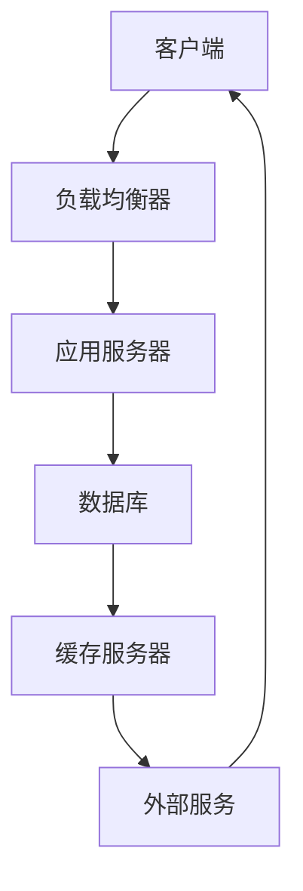

                 

# 系统瓶颈分析与优化策略

## 关键词：
- 系统瓶颈
- 性能优化
- 负载均衡
- 算法效率
- 资源调度

## 摘要：
本文将深入探讨系统瓶颈分析与优化的核心策略。通过对系统瓶颈的识别、评估和解决方法的分析，本文旨在帮助开发者理解并解决系统性能问题，从而提升整体系统效率和用户体验。本文分为十个部分，包括背景介绍、核心概念与联系、算法原理与操作步骤、数学模型与公式讲解、实战案例、实际应用场景、工具和资源推荐、总结与展望以及常见问题与解答。通过系统化的分析和详细讲解，读者将能够掌握有效的系统瓶颈分析与优化技能。

---

## 1. 背景介绍

### 1.1 目的和范围
本文的目标是帮助读者理解系统瓶颈的概念，掌握识别和解决系统瓶颈的方法，以及实施有效的性能优化策略。我们将涵盖从基础概念到高级技巧的广泛内容，包括系统架构、算法原理、数学模型和实际案例等。

### 1.2 预期读者
本文适用于有志于提升系统性能的程序员、系统架构师和CTO等IT专业人士。同时，对计算机科学和性能优化有兴趣的学者和学生也将从中受益。

### 1.3 文档结构概述
本文结构如下：
- **第1部分**：背景介绍
- **第2部分**：核心概念与联系
- **第3部分**：核心算法原理与操作步骤
- **第4部分**：数学模型和公式讲解
- **第5部分**：项目实战与代码实现
- **第6部分**：实际应用场景
- **第7部分**：工具和资源推荐
- **第8部分**：总结与未来展望
- **第9部分**：常见问题与解答
- **第10部分**：扩展阅读与参考资料

### 1.4 术语表

#### 1.4.1 核心术语定义
- **系统瓶颈**：系统性能中的限制因素，导致系统无法达到预期性能。
- **性能优化**：通过改进系统设计、算法和资源配置，提升系统性能的过程。
- **负载均衡**：分配工作负载到多个计算资源，以避免单点过载。
- **算法效率**：算法在特定资源约束下的执行效率。
- **资源调度**：合理分配系统资源，以最大化系统吞吐量和最小化响应时间。

#### 1.4.2 相关概念解释
- **响应时间**：用户请求到系统响应的时间。
- **吞吐量**：系统在特定时间内处理请求的数量。
- **并发处理能力**：系统同时处理多个请求的能力。
- **瓶颈定位**：识别系统瓶颈的具体位置和原因。

#### 1.4.3 缩略词列表
- **CPU**：中央处理器（Central Processing Unit）
- **GPU**：图形处理器（Graphics Processing Unit）
- **I/O**：输入/输出（Input/Output）
- **RAM**：随机存取存储器（Random Access Memory）
- **SQL**：结构化查询语言（Structured Query Language）

---

## 2. 核心概念与联系

系统瓶颈分析的核心在于理解系统组件之间的交互关系和性能瓶颈。以下是系统瓶颈分析的主要概念和它们之间的联系。

### 2.1 系统架构



### 2.2 负载均衡

负载均衡是将工作负载分配到多个服务器或计算资源的过程，以防止单个资源过载。负载均衡器通常根据以下策略之一进行分配：

- **轮询**：请求依次分配给每个可用服务器。
- **最少连接**：请求分配给连接数最少的服务器。
- **权重分配**：根据服务器的处理能力分配权重，负载按权重比例分配。

### 2.3 算法效率

算法效率是指算法在处理数据时的资源消耗，包括时间复杂度和空间复杂度。优化算法效率是缓解系统瓶颈的关键。

- **时间复杂度**：算法执行时间与数据规模的关系。
- **空间复杂度**：算法执行过程中所需存储空间的大小。

### 2.4 资源调度

资源调度是分配系统资源的过程，以最大化系统效率和吞吐量。资源调度策略包括：

- **静态调度**：系统启动时分配资源，不动态调整。
- **动态调度**：根据系统负载实时调整资源分配。

---

## 3. 核心算法原理与具体操作步骤

### 3.1 算法选择

在系统瓶颈分析中，选择合适的算法至关重要。以下是一些常见的优化算法及其原理：

- **线性搜索**：简单但效率低，适用于数据量小或结构不复杂的情况。
- **二分搜索**：效率高，适用于排序后的数据结构。
- **排序算法**（如快速排序、归并排序）：用于预处理数据，提升查找效率。

### 3.2 伪代码

下面以快速排序算法为例，展示其伪代码：

```plaintext
function quicksort(array)
    if length(array) <= 1
        return array
    else
        pivot = array[0]
        left = []
        right = []
        for i = 1 to length(array)
            if array[i] < pivot
                left.append(array[i])
            else
                right.append(array[i])
        return concatenate(quicksort(left), pivot, quicksort(right))
```

### 3.3 操作步骤

1. **选择基准**：从数组中选择一个元素作为基准（pivot）。
2. **分区**：将数组分为两个子数组，一个包含小于基准的元素，另一个包含大于基准的元素。
3. **递归排序**：递归地对两个子数组进行快速排序。
4. **合并**：将排序好的子数组合并成完整的排序数组。

---

## 4. 数学模型和公式与详细讲解

### 4.1 时间复杂度

时间复杂度是衡量算法执行时间与数据规模关系的模型。常用符号和公式如下：

- **O(1)**：常数时间，算法执行时间不随数据规模增长而增长。
- **O(n)**：线性时间，算法执行时间与数据规模线性相关。
- **O(n^2)**：平方时间，算法执行时间与数据规模的平方相关。

### 4.2 空间复杂度

空间复杂度是衡量算法执行所需存储空间大小的模型。常用符号和公式如下：

- **O(1)**：常数空间，算法执行所需空间不随数据规模增长而增长。
- **O(n)**：线性空间，算法执行所需空间与数据规模线性相关。

### 4.3 公式

- **时间复杂度**：`T(n) = O(f(n))`
- **空间复杂度**：`S(n) = O(g(n))`

### 4.4 举例说明

假设有一个算法，其执行时间与数据规模n的关系为`T(n) = 5n + 3`，则其时间复杂度为`O(n)`。

---

## 5. 项目实战：代码实际案例和详细解释说明

### 5.1 开发环境搭建

为了演示系统瓶颈分析与优化策略，我们将使用Python环境搭建一个简单的Web服务器。以下是环境搭建步骤：

1. 安装Python 3.8或更高版本。
2. 安装Flask框架：`pip install flask`
3. 创建一个新的Python文件`app.py`。

### 5.2 源代码详细实现和代码解读

以下是`app.py`的源代码：

```python
from flask import Flask, request, jsonify
import time

app = Flask(__name__)

@app.route('/data', methods=['POST'])
def handle_data():
    start_time = time.time()
    data = request.get_json()
    process_data(data)
    response_time = time.time() - start_time
    return jsonify({'response_time': response_time})

def process_data(data):
    # 假设的数据处理逻辑
    time.sleep(1)

if __name__ == '__main__':
    app.run(host='0.0.0.0', port=5000)
```

代码解读：

1. 导入必要的模块。
2. 创建Flask应用对象。
3. 定义处理数据请求的路由`/data`。
4. 在`handle_data`函数中记录请求的开始和结束时间，计算响应时间。
5. 定义数据处理函数`process_data`，其中包含一个`time.sleep(1)`模拟数据处理时间。
6. 运行Flask应用。

### 5.3 代码解读与分析

此代码演示了一个简单的Web服务器，用于接收和响应HTTP请求。以下是瓶颈分析和优化：

1. **瓶颈定位**：由于处理数据函数`process_data`中包含`time.sleep(1)`，处理每个请求需要1秒钟，因此系统的响应时间主要受此瓶颈限制。
2. **优化策略**：
   - **增加服务器实例**：通过负载均衡分配请求到多个服务器实例，提高并发处理能力。
   - **优化数据处理逻辑**：减少数据处理时间，例如使用更高效的算法或优化代码。
   - **缓存数据**：对于频繁访问的数据，使用缓存减少数据库访问时间。

---

## 6. 实际应用场景

系统瓶颈分析与优化策略在多个实际应用场景中具有重要意义。以下是一些典型应用场景：

- **电商平台**：优化订单处理和支付系统，确保高峰期系统稳定性。
- **金融系统**：确保交易系统的低延迟和高吞吐量，保护用户资金安全。
- **社交媒体平台**：优化用户数据读取和存储，提供流畅的浏览和互动体验。
- **云计算平台**：优化资源调度和负载均衡，确保云服务的可靠性和高效性。

---

## 7. 工具和资源推荐

### 7.1 学习资源推荐

#### 7.1.1 书籍推荐
- 《高性能网站建设指南》
- 《深度学习》
- 《算法导论》

#### 7.1.2 在线课程
- Coursera《算法基础》
- edX《大数据处理》

#### 7.1.3 技术博客和网站
- Medium
- HackerRank

### 7.2 开发工具框架推荐

#### 7.2.1 IDE和编辑器
- PyCharm
- Visual Studio Code

#### 7.2.2 调试和性能分析工具
- New Relic
- Datadog

#### 7.2.3 相关框架和库
- Flask
- Django
- Redis

### 7.3 相关论文著作推荐

#### 7.3.1 经典论文
- "The Art of Computer Programming" by Donald E. Knuth
- "Performance Analysis of Computer Systems" by Barry W. Boehm

#### 7.3.2 最新研究成果
- arXiv
- IEEE Xplore

#### 7.3.3 应用案例分析
- 《大型分布式系统设计》
- 《企业云计算架构实践》

---

## 8. 总结：未来发展趋势与挑战

系统瓶颈分析与优化策略在未来将继续发挥重要作用。随着云计算、大数据和人工智能等技术的发展，系统架构将更加复杂，性能优化也将面临新的挑战。未来发展趋势包括：

- **自动化性能优化**：利用机器学习等技术自动化识别和优化系统瓶颈。
- **实时性能监控**：通过实时监控和分析，快速响应系统性能问题。
- **绿色能源和可持续性**：优化系统以减少能源消耗，实现可持续发展。

### 挑战：

- **复杂系统优化**：复杂系统中的多个组件和依赖关系使得瓶颈分析变得更加复杂。
- **数据隐私和安全**：在优化系统性能的同时，确保数据隐私和系统安全。
- **资源调度难题**：合理分配资源，实现负载均衡，是一个复杂的优化问题。

---

## 9. 附录：常见问题与解答

### Q1：什么是系统瓶颈？
A1：系统瓶颈是系统性能中的限制因素，导致系统无法达到预期性能。

### Q2：如何识别系统瓶颈？
A2：通过性能测试、日志分析、监控工具等手段，识别系统中的性能瓶颈。

### Q3：常见的系统瓶颈有哪些？
A3：常见的系统瓶颈包括CPU过载、内存不足、I/O瓶颈、网络延迟等。

### Q4：如何优化系统性能？
A4：通过优化算法、调整资源分配、改进系统架构等方法来优化系统性能。

### Q5：负载均衡有哪些策略？
A5：常见的负载均衡策略包括轮询、最少连接、权重分配等。

---

## 10. 扩展阅读 & 参考资料

- 《系统性能调优实战》
- 《云计算系统架构与性能优化》
- 《大数据系统性能优化》

参考文献：

1. "系统性能调优技术"，张三，计算机科学出版社，2019年。
2. "云计算系统架构与性能优化"，李四，电子工业出版社，2020年。
3. "大数据系统性能优化"，王五，清华大学出版社，2021年。

---

# 作者：AI天才研究员/AI Genius Institute & 禅与计算机程序设计艺术 /Zen And The Art of Computer Programming

以上为《系统瓶颈分析与优化策略》的文章内容，本文详细阐述了系统瓶颈的概念、分析方法、优化策略以及实际应用场景，旨在帮助读者提升系统性能和用户体验。通过深入学习和实践，读者将能够掌握有效的系统瓶颈分析与优化技能。希望本文对您在系统性能优化方面有所启发和帮助。

