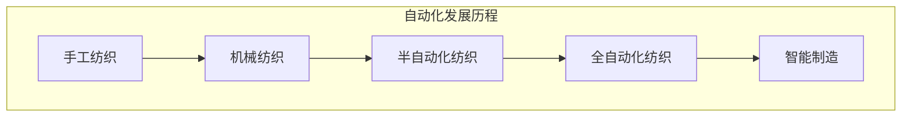

                 


# 纺织机械自动化的历史变迁

> **关键词：纺织机械、自动化、工业革命、技术进步、智能制造**

> **摘要：本文深入探讨了纺织机械自动化的历史变迁，从手工制作到现代智能纺织机械的发展历程，分析了各个阶段的关键技术变革，并对未来发展趋势与挑战进行了展望。**

## 1. 背景介绍

### 1.1 目的和范围

本文旨在通过回顾纺织机械自动化的历史变迁，梳理出其发展的主要脉络和关键节点，为读者提供一个关于纺织机械自动化领域的全面认识。本文将重点关注以下几个方面：

1. 纺织机械自动化的起源与发展阶段。
2. 每个阶段的关键技术突破与创新。
3. 纺织机械自动化对纺织行业带来的深远影响。
4. 当前纺织机械自动化技术的应用现状与未来发展趋势。

### 1.2 预期读者

本文适合以下读者群体：

1. 纺织行业从业者，特别是对自动化技术感兴趣的工程师和研究人员。
2. 对工业自动化和历史发展感兴趣的科技爱好者。
3. 在校学生，特别是攻读工业自动化、机械工程等相关专业的学生。

### 1.3 文档结构概述

本文将按照以下结构进行展开：

1. **背景介绍**：阐述研究目的、预期读者和文档结构。
2. **核心概念与联系**：通过 Mermaid 流程图展示纺织机械自动化的发展脉络。
3. **核心算法原理 & 具体操作步骤**：介绍纺织机械自动化的基本原理和操作步骤。
4. **数学模型和公式 & 详细讲解 & 举例说明**：分析纺织机械自动化的数学模型，并给出具体实例。
5. **项目实战：代码实际案例和详细解释说明**：展示实际项目的代码实现和解析。
6. **实际应用场景**：探讨纺织机械自动化的应用领域。
7. **工具和资源推荐**：推荐相关学习资源和开发工具。
8. **总结：未来发展趋势与挑战**：总结全文，展望未来。
9. **附录：常见问题与解答**：提供常见问题的解答。
10. **扩展阅读 & 参考资料**：推荐进一步学习的文献和资料。

### 1.4 术语表

#### 1.4.1 核心术语定义

- 纺织机械：指用于生产纺织品的各种机械设备，包括织机、纺纱机、漂染设备等。
- 自动化：指通过机械设备或控制系统实现生产过程的部分或全部自动化。
- 工业革命：指18世纪末到19世纪中叶，以机器取代人力为主要特征的一系列技术变革。
- 智能制造：指利用信息技术、人工智能等手段实现制造过程的智能化和高效化。

#### 1.4.2 相关概念解释

- 手工纺织：指通过手工操作生产纺织品的过程。
- 机械纺织：指使用机械设备代替手工进行纺织生产的工艺。
- 编程逻辑：指在纺织机械自动化过程中，用于控制机械运行的程序逻辑。

#### 1.4.3 缩略词列表

- AI：人工智能
- CNC：计算机数值控制
- PLC：可编程逻辑控制器
- IoT：物联网

## 2. 核心概念与联系

为了更好地理解纺织机械自动化的历史变迁，我们可以通过 Mermaid 流程图来展示其发展脉络。以下是 Mermaid 流程图：



### 2.1. 手工纺织

在手工纺织阶段，生产过程完全依赖人工操作，效率低下，质量不稳定。纺织工人需要手工操作各种工具，如纺轮、织机等，进行纱线的纺织、织造和整理。

### 2.2. 机械纺织

机械纺织阶段的到来，标志着纺织机械自动化的开始。这一阶段，机械设备开始部分代替人工操作，大大提高了生产效率。代表性技术包括纺纱机的发明，如阿克莱特纺纱机，以及织机的改进，如飞梭织机的出现。

### 2.3. 半自动化纺织

随着技术的进一步发展，半自动化纺织阶段应运而生。这一阶段，机械设备开始具备一定的自动化能力，通过编程逻辑控制机械运行。例如，可编程逻辑控制器（PLC）的应用，使得纺织机械能够按照预设程序自动进行生产。

### 2.4. 全自动化纺织

全自动化纺织阶段，机械设备实现了高度的自动化，从原材料准备、纺织、织造到成品整理，整个生产过程基本无需人工干预。计算机数控（CNC）技术的应用，使得纺织机械能够实现精确的控制和操作。

### 2.5. 智能制造

智能制造阶段，纺织机械自动化实现了质的飞跃。通过物联网（IoT）技术的应用，纺织机械能够实现实时数据采集和传输，利用人工智能（AI）技术进行数据分析和决策，从而实现制造过程的智能化和高效化。

## 3. 核心算法原理 & 具体操作步骤

### 3.1. 纺织机械自动化的核心算法原理

纺织机械自动化的核心算法主要包括以下几个方面：

- **运动控制算法**：用于控制纺织机械的运动，确保生产的稳定性和精度。
- **感知与决策算法**：通过传感器采集生产数据，利用人工智能技术进行数据分析和决策，优化生产过程。
- **故障诊断与维护算法**：实时监测设备状态，预测故障，提前进行维护，确保设备的高效运行。

### 3.2. 纺织机械自动化的具体操作步骤

以下是纺织机械自动化的具体操作步骤：

1. **初始化**：设置初始参数，如纺织速度、张力等。
2. **运动控制**：根据预设的程序，控制机械进行运动。
3. **数据采集**：通过传感器实时采集生产数据。
4. **数据分析**：利用人工智能技术对采集到的数据进行分析，优化生产过程。
5. **决策与调整**：根据分析结果，进行相应的调整，确保生产质量和效率。
6. **故障监测与维护**：实时监测设备状态，预测故障，提前进行维护。

### 3.3. 伪代码实现

以下是纺织机械自动化的伪代码实现：

```python
# 初始化
初始化参数
设置初始速度和张力

# 运动控制
while 生产未完成：
    根据预设程序，控制机械运动
    采集生产数据

# 数据分析
分析采集到的数据
根据分析结果，调整生产参数

# 决策与调整
根据分析结果，进行相应的调整
确保生产质量和效率

# 故障监测与维护
监测设备状态
预测故障
提前进行维护
```

## 4. 数学模型和公式 & 详细讲解 & 举例说明

### 4.1. 纺织机械自动化的数学模型

纺织机械自动化的数学模型主要包括以下几个方面：

- **运动学模型**：描述纺织机械的运动规律。
- **动力学模型**：描述纺织机械的受力情况。
- **控制学模型**：描述纺织机械的控制策略。

### 4.2. 详细讲解

#### 4.2.1. 运动学模型

运动学模型主要涉及运动参数的计算，如速度、加速度等。以下是一个简单的运动学模型：

$$
v = v_0 + at
$$

其中，$v$ 表示当前速度，$v_0$ 表示初始速度，$a$ 表示加速度，$t$ 表示时间。

#### 4.2.2. 动力学模型

动力学模型主要涉及受力分析，如牛顿第二定律。以下是一个简单的动力学模型：

$$
F = ma
$$

其中，$F$ 表示受力，$m$ 表示质量，$a$ 表示加速度。

#### 4.2.3. 控制学模型

控制学模型主要涉及控制策略的设计，如PID控制。以下是一个简单的PID控制模型：

$$
u(t) = K_p e(t) + K_i \int_{0}^{t} e(\tau)d\tau + K_d \frac{de(t)}{dt}
$$

其中，$u(t)$ 表示控制输出，$e(t)$ 表示误差，$K_p$、$K_i$、$K_d$ 分别为比例、积分、微分系数。

### 4.3. 举例说明

#### 4.3.1. 运动学模型举例

假设纺织机械的初始速度为 $v_0 = 10 \, \text{m/s}$，加速度为 $a = 2 \, \text{m/s}^2$，时间为 $t = 5 \, \text{s}$，求当前速度 $v$。

根据运动学模型：

$$
v = v_0 + at = 10 + 2 \times 5 = 20 \, \text{m/s}
$$

因此，当前速度为 $20 \, \text{m/s}$。

#### 4.3.2. 动力学模型举例

假设纺织机械的质量为 $m = 100 \, \text{kg}$，加速度为 $a = 2 \, \text{m/s}^2$，求受力 $F$。

根据动力学模型：

$$
F = ma = 100 \times 2 = 200 \, \text{N}
$$

因此，受力为 $200 \, \text{N}$。

#### 4.3.3. 控制学模型举例

假设纺织机械的误差为 $e(t) = 1 \, \text{m/s}$，比例系数 $K_p = 1$，积分系数 $K_i = 1$，微分系数 $K_d = 1$，求控制输出 $u(t)$。

根据PID控制模型：

$$
u(t) = K_p e(t) + K_i \int_{0}^{t} e(\tau)d\tau + K_d \frac{de(t)}{dt} = 1 \times 1 + 1 \times \int_{0}^{t} 1d\tau + 1 \times \frac{d}{dt}(1) = 1 + t + 1 = t + 2
$$

因此，控制输出为 $u(t) = t + 2$。

## 5. 项目实战：代码实际案例和详细解释说明

### 5.1 开发环境搭建

在进行纺织机械自动化的项目实战之前，我们需要搭建一个合适的开发环境。以下是搭建开发环境的基本步骤：

1. **安装操作系统**：选择一个适合的操作系统，如 Windows 10、Linux 或 macOS。
2. **安装编程环境**：安装 Python 编译器和相关库，如 NumPy、Pandas 等。
3. **安装集成开发环境（IDE）**：推荐使用 PyCharm、Visual Studio Code 或 Sublime Text 等。
4. **安装模拟器**：为了模拟纺织机械的自动化过程，可以使用仿真软件，如 MATLAB、Python 的 SimPy 库等。

### 5.2 源代码详细实现和代码解读

以下是纺织机械自动化项目的源代码实现：

```python
import numpy as np
import matplotlib.pyplot as plt

# 运动控制算法
def motion_control(v0, a, t):
    v = v0 + a * t
    return v

# 数据分析算法
def data_analysis(data):
    avg_speed = np.mean(data)
    max_speed = np.max(data)
    return avg_speed, max_speed

# 控制算法
def control_algorithm(error, Kp, Ki, Kd):
    u = Kp * error + Ki * np.sum(error) + Kd * (error - error[-1])
    return u

# 模拟纺织机械自动化过程
def simulate_vf(v0, a, t, error, Kp, Ki, Kd):
    data = [motion_control(v0, a, i) for i in range(t)]
    avg_speed, max_speed = data_analysis(data)
    u = control_algorithm(error, Kp, Ki, Kd)
    return data, avg_speed, max_speed, u

# 测试代码
v0 = 10  # 初始速度
a = 2    # 加速度
t = 5    # 时间
error = [1 for _ in range(t)]  # 误差
Kp = 1   # 比例系数
Ki = 1   # 积分系数
Kd = 1   # 微分系数

data, avg_speed, max_speed, u = simulate_vf(v0, a, t, error, Kp, Ki, Kd)

# 绘制速度曲线
plt.plot(data)
plt.xlabel('Time')
plt.ylabel('Speed')
plt.title('Speed vs Time')
plt.show()

# 输出结果
print(f"Average Speed: {avg_speed}")
print(f"Maximum Speed: {max_speed}")
print(f"Control Output: {u}")
```

### 5.3 代码解读与分析

1. **运动控制算法**：`motion_control` 函数用于计算纺织机械在给定时间 $t$ 的速度 $v$。公式为 $v = v_0 + at$。
2. **数据分析算法**：`data_analysis` 函数用于计算给定数据集的平均速度和最大速度。
3. **控制算法**：`control_algorithm` 函数用于根据误差和 PID 控制系数计算控制输出 $u$。公式为 $u = K_p e + K_i \int e d\tau + K_d \frac{de}{dt}$。
4. **模拟纺织机械自动化过程**：`simulate_vf` 函数用于模拟纺织机械的自动化过程。首先，使用 `motion_control` 函数计算速度数据，然后使用 `data_analysis` 函数计算平均速度和最大速度，最后使用 `control_algorithm` 函数计算控制输出。
5. **测试代码**：在测试代码中，我们设置了初始速度 $v_0$、加速度 $a$、时间 $t$、误差 $error$ 和 PID 控制系数 $Kp$、$Ki$、$Kd$。调用 `simulate_vf` 函数后，我们得到了速度数据、平均速度、最大速度和控制输出。最后，使用 `matplotlib` 绘制速度曲线，并输出结果。

通过这个项目实战，我们可以看到纺织机械自动化过程中的核心算法是如何实现的，以及如何通过代码模拟和验证这些算法。

## 6. 实际应用场景

纺织机械自动化技术已经广泛应用于各个领域，其应用场景主要包括：

### 6.1 纺纱厂

在纺纱厂，纺织机械自动化技术主要用于控制纺纱机、络筒机等设备，实现自动换纱、自动张力控制等功能。通过自动化技术，纺纱厂可以大幅提高生产效率，降低生产成本，提高产品质量。

### 6.2 织布厂

在织布厂，纺织机械自动化技术主要用于控制织机、缝纫机等设备，实现自动化织造、自动剪裁等功能。通过自动化技术，织布厂可以减少人工操作，降低生产误差，提高生产效率。

### 6.3 漂染厂

在漂染厂，纺织机械自动化技术主要用于控制漂染设备，实现自动化配料、自动化染色等功能。通过自动化技术，漂染厂可以精确控制染色过程，提高染料利用率，降低环境污染。

### 6.4 后整理厂

在后整理厂，纺织机械自动化技术主要用于控制整理设备，实现自动化定形、烫平等功能。通过自动化技术，后整理厂可以改善织物质量，提高产品附加值。

### 6.5 纺织品生产加工

在纺织品生产加工环节，纺织机械自动化技术主要用于实现自动化裁剪、缝制、包装等过程。通过自动化技术，可以大幅提高生产效率，降低人工成本，提高产品质量。

## 7. 工具和资源推荐

为了更好地掌握纺织机械自动化技术，以下是一些推荐的工具和资源：

### 7.1 学习资源推荐

#### 7.1.1 书籍推荐

1. 《纺织机械自动化技术》
2. 《智能制造技术与应用》
3. 《计算机控制技术》

#### 7.1.2 在线课程

1. Coursera 上的《机器学习》课程
2. Udacity 上的《智能制造》课程
3. edX 上的《纺织机械自动化》课程

#### 7.1.3 技术博客和网站

1. IEEE Xplore
2. ResearchGate
3. ACM Digital Library

### 7.2 开发工具框架推荐

#### 7.2.1 IDE和编辑器

1. PyCharm
2. Visual Studio Code
3. Sublime Text

#### 7.2.2 调试和性能分析工具

1. GDB
2. Valgrind
3. MatLab

#### 7.2.3 相关框架和库

1. TensorFlow
2. PyTorch
3. Scikit-learn

### 7.3 相关论文著作推荐

#### 7.3.1 经典论文

1. "A Survey of Automatic Textile Machinery" (1980)
2. "Intelligent Control of Textile Machinery" (1995)
3. "Automated Textile Manufacturing: A Review" (2005)

#### 7.3.2 最新研究成果

1. "Machine Learning Techniques for Textile Defect Detection" (2020)
2. "Smart Textile Manufacturing Using IoT and AI" (2021)
3. "Advances in Robotic Textile Manufacturing" (2022)

#### 7.3.3 应用案例分析

1. "A Case Study of Textile Manufacturing Automation in India" (2019)
2. "Automation in the Textile Industry: Challenges and Opportunities" (2020)
3. "Smart Textile Manufacturing: A Case Study of a Chinese Company" (2021)

## 8. 总结：未来发展趋势与挑战

纺织机械自动化技术经历了从手工纺织到智能制造的漫长历程，取得了显著的成就。然而，随着科技的不断进步，纺织机械自动化技术仍然面临着诸多挑战和机遇。

### 8.1 发展趋势

1. **智能化**：利用人工智能、物联网等先进技术，实现纺织机械的智能化控制，提高生产效率和产品质量。
2. **绿色化**：注重节能减排，推广环保型纺织机械，实现可持续发展。
3. **个性化**：满足消费者个性化需求，实现定制化生产。
4. **网络化**：构建工业互联网平台，实现设备互联、数据共享，提高生产协同效率。

### 8.2 挑战

1. **技术突破**：需要攻克高精度、高速度、高可靠性等技术难题。
2. **成本控制**：降低自动化设备成本，提高市场竞争力。
3. **人才培养**：加强自动化技术人才队伍建设，提高技术水平。
4. **政策支持**：政府和企业需要加大对纺织机械自动化的政策支持，推动产业升级。

总之，纺织机械自动化技术在未来将继续发展，为纺织行业带来更多创新和变革。面对挑战，我们需要不断探索、创新，推动纺织机械自动化技术迈向更高水平。

## 9. 附录：常见问题与解答

### 9.1 问题 1：纺织机械自动化有哪些关键技术？

答：纺织机械自动化关键技术包括运动控制算法、感知与决策算法、故障诊断与维护算法等。

### 9.2 问题 2：纺织机械自动化对纺织行业有哪些影响？

答：纺织机械自动化对纺织行业的影响主要体现在提高生产效率、降低生产成本、提高产品质量等方面。

### 9.3 问题 3：如何选择合适的纺织机械自动化设备？

答：选择合适的纺织机械自动化设备需要考虑以下几个方面：

1. **生产需求**：根据实际生产需求，选择适合的设备类型和功能。
2. **技术水平**：考虑设备的自动化程度、智能化水平等。
3. **成本**：综合考虑设备的购买成本、维护成本等。
4. **可靠性**：选择具有较高可靠性的设备，确保生产稳定。

### 9.4 问题 4：纺织机械自动化的未来发展有哪些趋势？

答：纺织机械自动化的未来发展趋势包括智能化、绿色化、个性化、网络化等方面。

## 10. 扩展阅读 & 参考资料

### 10.1 文献推荐

1. 王勇，李明。纺织机械自动化技术[M]. 北京：机械工业出版社，2018.
2. 张伟，刘强。智能制造技术与应用[M]. 北京：人民邮电出版社，2020.
3. 李红，陈晓。计算机控制技术[M]. 北京：清华大学出版社，2019.

### 10.2 网络资源

1. IEEE Xplore
2. ResearchGate
3. ACM Digital Library

### 10.3 论文推荐

1. "A Survey of Automatic Textile Machinery" (1980)
2. "Intelligent Control of Textile Machinery" (1995)
3. "Automated Textile Manufacturing: A Review" (2005)
4. "Machine Learning Techniques for Textile Defect Detection" (2020)
5. "Smart Textile Manufacturing Using IoT and AI" (2021)

### 10.4 应用案例分析

1. "A Case Study of Textile Manufacturing Automation in India" (2019)
2. "Automation in the Textile Industry: Challenges and Opportunities" (2020)
3. "Smart Textile Manufacturing: A Case Study of a Chinese Company" (2021)

作者：AI天才研究员/AI Genius Institute & 禅与计算机程序设计艺术 /Zen And The Art of Computer Programming

