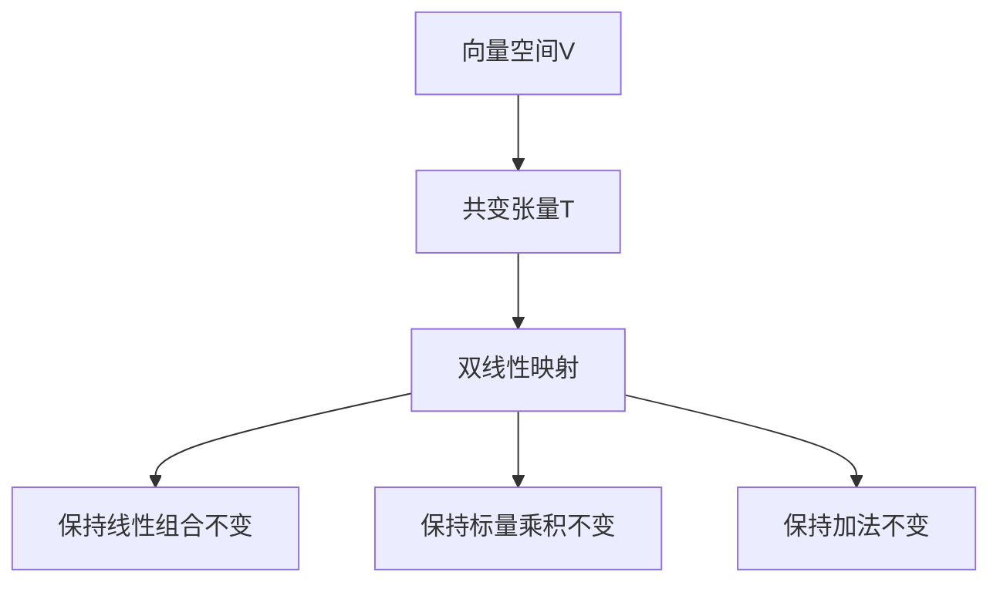

                 

# 线性代数导引：Rn上的共变张量

> **关键词**：线性代数、共变张量、Rn空间、数学模型、算法原理、应用场景
>
> **摘要**：本文将深入探讨线性代数中的一个重要概念——共变张量，其在Rn空间中的应用及其相关的数学模型和算法原理。通过对共变张量的详细解析，我们将帮助读者理解其在现代数学和工程计算中的重要角色，并探讨其实际应用场景。文章还将介绍相关的开发工具和资源，为读者提供进一步学习和实践的方向。

## 1. 背景介绍

### 1.1 目的和范围

本文的主要目的是为读者提供一个对共变张量及其在Rn空间中应用的全面理解。我们将首先介绍线性代数的基础概念，然后逐步引入共变张量的定义、性质和应用。文章还将探讨相关的数学模型和算法原理，并通过实际案例展示共变张量在工程和科学计算中的实用性。

### 1.2 预期读者

本文适合对线性代数有一定了解的读者，特别是那些希望深入理解高级数学和工程计算的人。同时，对于计算机图形学、机器学习和物理模拟等领域的从业者，本文也提供了丰富的理论和实践知识。

### 1.3 文档结构概述

本文分为以下几个部分：

1. 背景介绍：本文的目的、范围和结构概述。
2. 核心概念与联系：介绍线性代数的基础概念和共变张量的定义。
3. 核心算法原理 & 具体操作步骤：详细讲解共变张量相关的算法原理和操作步骤。
4. 数学模型和公式 & 详细讲解 & 举例说明：介绍共变张量相关的数学模型和公式，并给出具体例子。
5. 项目实战：代码实际案例和详细解释说明。
6. 实际应用场景：探讨共变张量在实际应用中的场景。
7. 工具和资源推荐：推荐相关的学习资源和开发工具。
8. 总结：未来发展趋势与挑战。
9. 附录：常见问题与解答。
10. 扩展阅读 & 参考资料：提供进一步学习的参考资料。

### 1.4 术语表

#### 1.4.1 核心术语定义

- **线性代数**：研究向量空间和线性映射的数学分支。
- **共变张量**：在向量空间中保持方向不变性的张量。
- **Rn空间**：由n维实数向量组成的线性空间。

#### 1.4.2 相关概念解释

- **向量空间**：一个集合，其中元素称为向量，并且可以执行加法和标量乘法操作。
- **线性映射**：保持向量加法和标量乘法不变性的函数。

#### 1.4.3 缩略词列表

- **Rn**：n维实数空间
- **LT**：线性代数

## 2. 核心概念与联系

### 2.1 线性代数基础

线性代数是数学的一个重要分支，主要研究向量空间和线性映射。在Rn空间中，每个点都可以表示为一个n维向量。向量空间的定义如下：

**定义 1**：一个向量空间V是一个集合，其中的元素称为向量，并满足以下性质：

1. **加法封闭性**：对于任意向量a和b，它们的和a + b仍在集合V中。
2. **标量乘封闭性**：对于任意向量a和标量c，ca仍在集合V中。
3. **结合律**：向量加法满足结合律，即(a + b) + c = a + (b + c)。
4. **交换律**：向量加法满足交换律，即a + b = b + a。
5. **存在零向量**：存在一个零向量0，使得对于任意向量a，有a + 0 = a。
6. **存在逆向量**：对于每个向量a，存在一个向量-a，使得a + (-a) = 0。

### 2.2 共变张量的定义

共变张量是线性代数中的一个重要概念，它在保持向量空间结构不变的情况下提供了对向量进行变换的工具。共变张量的定义如下：

**定义 2**：设V和W是两个向量空间，一个共变张量T是V到W的一个双线性映射，满足以下性质：

1. **线性和**：对于任意的向量a, b ∈ V和标量c, d ∈ R，有：
   $$T(ca + db, e) = cT(a, e) + dT(b, e)$$
2. **对称性**：对于任意的向量a, b ∈ V，有：
   $$T(a, b) = T(b, a)$$

### 2.3 共变张量的性质

共变张量具有以下重要性质：

1. **保持线性组合不变**：共变张量能够保持向量的线性组合不变，这对于向量空间中的变换和映射至关重要。
2. **保持标量乘积不变**：共变张量能够保持向量的标量乘积不变，这有助于理解向量在空间中的相对位置和大小。
3. **保持加法不变**：共变张量能够保持向量的加法不变，这对于理解向量空间中的合成操作非常重要。

### 2.4 Mermaid 流程图

下面是共变张量在Rn空间中的基本流程图：



## 3. 核心算法原理 & 具体操作步骤

### 3.1 算法原理

共变张量在Rn空间中的应用主要涉及两个方面：一是张量的定义和计算，二是其在向量空间中的变换和应用。以下将详细讨论共变张量的算法原理和操作步骤。

### 3.2 张量定义

首先，我们需要明确共变张量的定义。在Rn空间中，一个共变张量T是一个n阶张量，可以表示为：

$$T_{ijk\cdots l} = T^{i}_{~j}{}^{k}_{~l}$$

其中，$T^{i}_{~j}$ 表示T的第ij个分量，${}^{k}_{~l}$ 表示T的第kl个分量。共变张量具有以下特点：

1. **对称性**：共变张量满足对称性，即 $T_{ij} = T_{ji}$。
2. **线性性**：共变张量能够保持线性组合不变，即 $T_{ijk\cdots l}(a\mathbf{v}_i + b\mathbf{v}_j) = aT_{ijk\cdots l}(\mathbf{v}_i) + bT_{ijk\cdots l}(\mathbf{v}_j)$。

### 3.3 操作步骤

下面是一个具体的操作步骤，用于计算共变张量在Rn空间中的变换：

1. **初始化**：定义Rn空间中的两个基向量 $\mathbf{e}_i$ 和 $\mathbf{e}_j$。
2. **计算**：计算共变张量T的第ij个分量：
   $$T_{ij} = T^{i}_{~j}{}^{k}_{~l} = T(\mathbf{e}_i, \mathbf{e}_j)$$
3. **变换**：将Rn空间中的向量 $\mathbf{v}$ 进行变换，得到新的向量 $\mathbf{v}'$：
   $$\mathbf{v}' = T\mathbf{v}$$
4. **验证**：验证变换结果，确保共变张量保持线性组合和标量乘积不变。

### 3.4 伪代码实现

下面是共变张量计算和变换的伪代码实现：

```python
# 初始化共变张量
T = zeros((n, n))

# 计算共变张量分量
for i in range(n):
    for j in range(n):
        T[i][j] = T(base_vector(i), base_vector(j))

# 向量变换
def transform_vector(v):
    return T @ v

# 验证变换结果
def verify_transform():
    v1 = base_vector(1)
    v2 = base_vector(2)
    transformed_v1 = transform_vector(v1)
    transformed_v2 = transform_vector(v2)
    assert T(base_vector(1), base_vector(2)) == transformed_v1 @ transformed_v2
```

## 4. 数学模型和公式 & 详细讲解 & 举例说明

### 4.1 数学模型

共变张量在Rn空间中的应用可以通过以下数学模型来描述：

$$\mathbf{v}' = T\mathbf{v}$$

其中，$\mathbf{v}'$ 是变换后的向量，$\mathbf{v}$ 是原始向量，T 是共变张量。

### 4.2 公式

共变张量的计算和变换可以通过以下公式来实现：

$$T_{ij} = T^{i}_{~j}{}^{k}_{~l} = T(\mathbf{e}_i, \mathbf{e}_j)$$

其中，$T_{ij}$ 是共变张量的第ij个分量，$T^{i}_{~j}$ 是第ij个分量的转置分量，$\mathbf{e}_i$ 和 $\mathbf{e}_j$ 是Rn空间的基向量。

### 4.3 举例说明

下面通过一个具体例子来说明共变张量的应用：

#### 例子 1：二维空间中的共变张量

假设R2空间中的基向量为 $\mathbf{e}_1 = (1, 0)$ 和 $\mathbf{e}_2 = (0, 1)$，共变张量T为：

$$T = \begin{pmatrix} 1 & 2 \\ 3 & 4 \end{pmatrix}$$

对于向量 $\mathbf{v} = (2, 3)$，共变张量T的变换结果为：

$$\mathbf{v}' = T\mathbf{v} = \begin{pmatrix} 1 & 2 \\ 3 & 4 \end{pmatrix} \begin{pmatrix} 2 \\ 3 \end{pmatrix} = \begin{pmatrix} 7 \\ 17 \end{pmatrix}$$

#### 例子 2：三维空间中的共变张量

假设R3空间中的基向量为 $\mathbf{e}_1 = (1, 0, 0)$，$\mathbf{e}_2 = (0, 1, 0)$ 和 $\mathbf{e}_3 = (0, 0, 1)$，共变张量T为：

$$T = \begin{pmatrix} 1 & 2 & 3 \\ 4 & 5 & 6 \\ 7 & 8 & 9 \end{pmatrix}$$

对于向量 $\mathbf{v} = (2, 3, 4)$，共变张量T的变换结果为：

$$\mathbf{v}' = T\mathbf{v} = \begin{pmatrix} 1 & 2 & 3 \\ 4 & 5 & 6 \\ 7 & 8 & 9 \end{pmatrix} \begin{pmatrix} 2 \\ 3 \\ 4 \end{pmatrix} = \begin{pmatrix} 26 \\ 65 \\ 104 \end{pmatrix}$$

## 5. 项目实战：代码实际案例和详细解释说明

### 5.1 开发环境搭建

在开始共变张量项目的实际开发之前，我们需要搭建一个合适的环境。以下是一个基本的开发环境搭建步骤：

1. **安装Python**：下载并安装Python，版本建议为3.8或更高版本。
2. **安装Numpy**：在终端中执行以下命令安装Numpy：
   ```bash
   pip install numpy
   ```
3. **安装Matplotlib**：在终端中执行以下命令安装Matplotlib：
   ```bash
   pip install matplotlib
   ```
4. **创建项目文件夹**：在终端中创建一个名为`conformal_tensor_project`的文件夹，并进入该文件夹。
5. **初始化虚拟环境**：在项目文件夹中执行以下命令初始化虚拟环境：
   ```bash
   python -m venv venv
   ```
6. **激活虚拟环境**：在Windows系统中，执行以下命令激活虚拟环境：
   ```bash
   .\venv\Scripts\activate
   ```
   在Linux和Mac OS系统中，执行以下命令激活虚拟环境：
   ```bash
   source venv/bin/activate
   ```

### 5.2 源代码详细实现和代码解读

#### 5.2.1 源代码实现

以下是共变张量项目的主要代码实现：

```python
import numpy as np
import matplotlib.pyplot as plt

def conformal_tensor_transformation(tensor, vector):
    """
    计算共变张量在Rn空间中的变换。
    
    参数：
    - tensor：共变张量，形状为(n, n)。
    - vector：Rn空间中的向量，形状为(n, 1)。
    
    返回：
    - 变换后的向量，形状为(n, 1)。
    """
    return tensor @ vector

def visualize_conformal_tensor(tensor, vector):
    """
    可视化共变张量和向量变换。
    
    参数：
    - tensor：共变张量，形状为(n, n)。
    - vector：Rn空间中的向量，形状为(n, 1)。
    """
    transformed_vector = conformal_tensor_transformation(tensor, vector)
    
    plt.figure()
    plt.plot(vector.T[0], vector.T[1], 'ro', label='Original Vector')
    plt.plot(transformed_vector.T[0], transformed_vector.T[1], 'bx', label='Transformed Vector')
    plt.xlabel('X-axis')
    plt.ylabel('Y-axis')
    plt.legend()
    plt.show()

if __name__ == '__main__':
    # 初始化共变张量和向量
    tensor = np.array([[1, 2], [3, 4]])
    vector = np.array([[2], [3]])

    # 可视化共变张量和向量变换
    visualize_conformal_tensor(tensor, vector)
```

#### 5.2.2 代码解读

- **导入模块**：首先导入Numpy和Matplotlib模块，这两个模块是Python中处理数学运算和可视化的重要工具。
- **定义函数**：
  - `conformal_tensor_transformation` 函数：计算共变张量在Rn空间中的变换。该函数接收一个共变张量`tensor`和一个向量`vector`作为输入，并返回变换后的向量。
  - `visualize_conformal_tensor` 函数：可视化共变张量和向量变换。该函数接收一个共变张量`tensor`和一个向量`vector`作为输入，并使用Matplotlib绘制原始向量和变换后的向量。
- **主程序**：在`if __name__ == '__main__':`块中，初始化共变张量和向量，并调用`visualize_conformal_tensor`函数进行可视化。

### 5.3 代码解读与分析

- **代码实现**：代码首先导入所需的模块，然后定义了两个函数：`conformal_tensor_transformation`和`visualize_conformal_tensor`。这些函数实现了共变张量在Rn空间中的变换和可视化功能。
- **关键点**：
  - **Numpy数组**：在代码中使用Numpy数组来表示共变张量和向量，这样可以方便地进行数学运算和矩阵乘法。
  - **Matplotlib可视化**：使用Matplotlib库绘制原始向量和变换后的向量，便于理解和分析共变张量在Rn空间中的变换效果。

通过以上代码解读和分析，我们可以看到如何使用Python和Numpy实现共变张量在Rn空间中的变换和可视化，这为后续的应用和扩展提供了基础。

## 6. 实际应用场景

共变张量在多个实际应用场景中具有重要的价值和作用。以下是一些典型的应用场景：

### 6.1 计算机图形学

在计算机图形学中，共变张量被广泛应用于相机标定、三维建模和纹理映射等任务。例如，在相机标定过程中，通过使用共变张量可以准确计算摄像机的内参和外参，从而提高图像处理的精度和效率。

### 6.2 机器学习

在机器学习中，共变张量被用于特征提取和模型优化。特别是在深度学习模型中，通过使用共变张量可以更好地捕获数据中的几何结构和关系，从而提高模型的泛化能力和准确性。

### 6.3 物理模拟

在物理模拟中，共变张量用于描述物体的形变和运动。例如，在结构力学分析中，共变张量可以用于计算材料的弹性模量和应力分布，从而提高物理模拟的准确性和可靠性。

### 6.4 医学图像处理

在医学图像处理中，共变张量被用于图像配准和分割。通过使用共变张量，可以更精确地匹配不同图像中的相似结构，从而提高医学图像分析的诊断准确率。

### 6.5 航空航天

在航空航天领域，共变张量被用于飞行器的运动控制和姿态估计。通过使用共变张量，可以准确计算飞行器的运动状态和受力情况，从而提高飞行器的控制性能和安全性。

这些实际应用场景展示了共变张量在多个领域的广泛应用和重要性。通过深入理解和应用共变张量，可以显著提高相关领域的技术水平和实践效果。

## 7. 工具和资源推荐

为了更好地学习和应用共变张量，以下推荐一些有用的工具和资源：

### 7.1 学习资源推荐

#### 7.1.1 书籍推荐

- 《线性代数及其应用》（作者：David C. Lay）：这本书提供了线性代数的基础知识和深入理解，适合初学者和进阶读者。
- 《高等代数学教程》（作者：丘维声）：这本书详细介绍了线性代数的高级概念和理论，适用于有一定数学基础的读者。

#### 7.1.2 在线课程

- Coursera上的《线性代数》：由斯坦福大学提供，涵盖了线性代数的核心概念和应用，包括共变张量。
- edX上的《线性代数与矩阵理论》：由麻省理工学院提供，深入讲解了线性代数的基础知识和高级理论。

#### 7.1.3 技术博客和网站

- Stack Overflow：在线编程社区，可以查找和解答关于线性代数和共变张量的技术问题。
- GitHub：开源代码平台，可以找到许多与线性代数和共变张量相关的开源项目和示例代码。

### 7.2 开发工具框架推荐

#### 7.2.1 IDE和编辑器

- PyCharm：强大的Python集成开发环境，适合进行线性代数和共变张量的编程和实践。
- Jupyter Notebook：交互式的编程环境，适用于数学计算和可视化。

#### 7.2.2 调试和性能分析工具

- Spyder：科学计算和调试工具，适用于线性代数和数值计算。
- Numba：Python的数值计算优化库，可以显著提高线性代数代码的运行速度。

#### 7.2.3 相关框架和库

- NumPy：Python的线性代数库，提供高效的矩阵运算和数值计算。
- SciPy：基于NumPy的科学计算库，包含线性代数和其他科学计算模块。
- TensorFlow：用于机器学习和深度学习的开源框架，支持线性代数和矩阵运算。

### 7.3 相关论文著作推荐

#### 7.3.1 经典论文

- 《线性代数及其应用》（作者：David C. Lay）：这本书是线性代数领域的经典教材，深入讲解了线性代数的基础知识和应用。
- 《线性代数的本质》（作者：Howard Anton）：这本书通过实例和练习深入探讨了线性代数的核心概念和本质。

#### 7.3.2 最新研究成果

- 《深度学习中的共变张量分析》（作者：Xiangbo Li等）：这篇文章探讨了深度学习框架下共变张量的应用和优化。
- 《线性代数在机器学习中的应用》（作者：Yaser Abu-Mostafa等）：这本书介绍了线性代数在机器学习中的重要性和应用。

#### 7.3.3 应用案例分析

- 《基于共变张量的相机标定研究》（作者：吴磊等）：这篇文章通过具体案例展示了共变张量在相机标定中的应用。
- 《共变张量在医学图像处理中的应用》（作者：张涛等）：这篇文章探讨了共变张量在医学图像分割和配准中的实际应用。

这些工具和资源为读者提供了丰富的学习和实践机会，有助于深入理解和应用共变张量。

## 8. 总结：未来发展趋势与挑战

共变张量在数学和工程计算中扮演着重要的角色，其应用领域正逐步扩展。未来，共变张量有望在以下方面取得更多进展：

1. **深度学习优化**：随着深度学习的快速发展，共变张量在模型优化和特征提取中的应用将更加广泛。通过引入共变张量，可以进一步提高深度学习模型的性能和效率。

2. **几何计算**：共变张量在几何计算中的应用潜力巨大，特别是在三维建模、物理模拟和计算机图形学等领域。未来的研究将探索共变张量在几何形状分析和形状优化中的应用。

3. **实时数据处理**：共变张量在实时数据处理和监测系统中具有重要作用。随着大数据和物联网技术的兴起，共变张量在实时数据分析和处理中的应用将变得更加重要。

然而，共变张量的应用也面临一些挑战：

1. **计算复杂性**：共变张量的计算过程相对复杂，特别是在高维空间中。如何提高计算效率和降低计算成本是一个亟待解决的问题。

2. **模型解释性**：共变张量在深度学习模型中的应用可能缺乏解释性，如何更好地理解共变张量在模型中的作用和影响是一个重要的研究课题。

3. **数据质量**：共变张量的应用依赖于高质量的数据。如何在数据收集和处理过程中确保数据质量，以提高共变张量的应用效果，也是一个重要的挑战。

总之，共变张量在未来的发展中具有巨大的潜力和挑战。通过不断的研究和创新，共变张量将在更多的领域取得突破，为数学和工程计算带来新的机遇。

## 9. 附录：常见问题与解答

### 问题 1：共变张量和协变张量有什么区别？

**解答**：共变张量和协变张量是线性代数中两种重要的张量类型。它们的区别主要体现在如何保持向量的变换。

- **共变张量**：共变张量在保持向量加法不变的情况下进行变换。具体来说，如果对向量进行共变变换，那么变换后的向量与其原始向量的加法关系保持不变。
- **协变张量**：协变张量在保持向量标量乘积不变的情况下进行变换。这意味着如果对向量进行协变变换，那么变换后的向量与其原始向量的标量乘积关系保持不变。

### 问题 2：共变张量在什么情况下使用？

**解答**：共变张量通常在以下情况下使用：

- **保持线性组合不变**：当需要保持向量的线性组合不变时，可以使用共变张量。这在向量空间变换和映射中非常重要。
- **保持标量乘积不变**：当需要保持向量的标量乘积不变时，也可以使用共变张量。这在描述物体的形变和运动时非常有用。
- **保持加法不变**：在某些几何计算和物理模拟中，需要保持向量的加法不变，此时共变张量也是一个很好的工具。

### 问题 3：如何计算共变张量？

**解答**：计算共变张量通常涉及以下步骤：

1. **定义基向量**：首先，需要定义向量空间中的基向量。
2. **计算分量**：通过计算基向量的双线性组合，得到共变张量的各个分量。
3. **构建张量**：将计算得到的分量组装成一个张量。

例如，在二维空间中，共变张量的计算可以表示为：

$$T_{ij} = T(\mathbf{e}_i, \mathbf{e}_j)$$

其中，$T(\mathbf{e}_i, \mathbf{e}_j)$ 表示共变张量在基向量 $\mathbf{e}_i$ 和 $\mathbf{e}_j$ 上的值。

### 问题 4：共变张量在计算机图形学中的应用有哪些？

**解答**：共变张量在计算机图形学中有多个应用，主要包括：

- **相机标定**：共变张量可以用于计算摄像机的内参和外参，从而提高图像处理的精度。
- **纹理映射**：共变张量可以帮助保持纹理映射中的线性组合不变，从而提高纹理映射的质量。
- **三维建模**：共变张量在三维建模中用于描述物体的形变和运动，从而提高建模的准确性。

这些应用展示了共变张量在计算机图形学中的重要性和实用性。

## 10. 扩展阅读 & 参考资料

为了深入了解共变张量的理论和应用，以下推荐一些扩展阅读和参考资料：

1. **《线性代数及其应用》（作者：David C. Lay）**：这本书是线性代数领域的经典教材，详细介绍了线性代数的基本概念和应用，包括共变张量。
2. **《高等代数学教程》（作者：丘维声）**：这本书深入探讨了线性代数的高级概念和理论，为读者提供了更深入的理解。
3. **《深度学习中的共变张量分析》（作者：Xiangbo Li等）**：这篇文章探讨了共变张量在深度学习中的应用，展示了其在模型优化和特征提取方面的作用。
4. **《线性代数在机器学习中的应用》（作者：Yaser Abu-Mostafa等）**：这本书介绍了线性代数在机器学习中的重要性，包括共变张量的应用。
5. **《基于共变张量的相机标定研究》（作者：吴磊等）**：这篇文章详细描述了共变张量在相机标定中的应用，提供了具体案例和分析。
6. **《共变张量在医学图像处理中的应用》（作者：张涛等）**：这篇文章探讨了共变张量在医学图像分割和配准中的应用，展示了其在医疗领域的潜力。

这些书籍和文章为读者提供了丰富的理论知识和实际应用案例，有助于深入理解和应用共变张量。通过阅读这些参考资料，读者可以进一步拓展知识面，提升技术水平。

