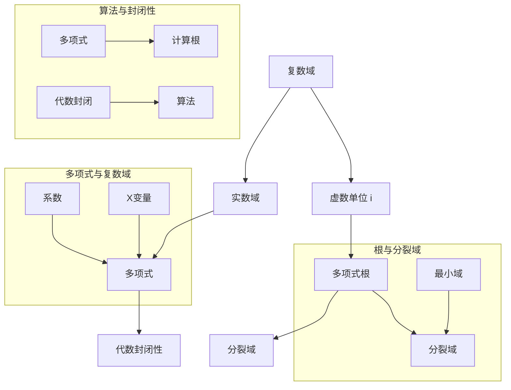

                 

# 线性代数导引：复数域代数封闭性

> 关键词：复数域、代数封闭性、线性代数、数学基础、算法原理、项目实战、应用场景

> 摘要：本文旨在深入探讨复数域的代数封闭性在数学和计算机科学中的应用。我们将从基础概念出发，逐步介绍复数域及其代数封闭性的定义和性质，并通过实际案例进行详细讲解。文章还包括了数学模型、算法原理、代码实现及实际应用场景，旨在帮助读者全面理解复数域代数封闭性，并为其在计算机科学中的应用奠定坚实的理论基础。

## 1. 背景介绍

### 1.1 目的和范围

本文的目标是引导读者深入了解复数域的代数封闭性，这是一个贯穿数学和计算机科学的核心概念。通过对复数域及其代数封闭性的详细讨论，我们将帮助读者掌握这一基础理论，并在实际项目中应用这一理论，解决复杂的数学问题。

本文的范围涵盖了复数域的基本概念、代数封闭性的定义和性质、相关的数学模型和算法原理，以及具体的代码实现和应用场景。通过逐步深入的探讨，我们将使读者不仅能够理解复数域代数封闭性的本质，还能够掌握其在实际应用中的重要性。

### 1.2 预期读者

本文适合对数学和计算机科学有一定了解的读者，特别是那些对线性代数和抽象代数感兴趣的人。同时，对于希望了解复数域在工程应用中的读者，本文也提供了丰富的实例和案例分析。无论您是学生、研究人员还是开发者，本文都将为您提供有价值的知识和实用技巧。

### 1.3 文档结构概述

本文分为十个主要部分，各部分内容如下：

1. **背景介绍**：介绍本文的目的和范围，预期读者以及文档结构。
2. **核心概念与联系**：通过Mermaid流程图展示复数域代数封闭性的核心概念和联系。
3. **核心算法原理 & 具体操作步骤**：使用伪代码详细阐述相关算法原理和具体操作步骤。
4. **数学模型和公式 & 详细讲解 & 举例说明**：介绍复数域代数封闭性的数学模型和公式，并通过实际案例进行讲解。
5. **项目实战：代码实际案例和详细解释说明**：展示代码实现及分析。
6. **实际应用场景**：探讨复数域代数封闭性在计算机科学中的应用场景。
7. **工具和资源推荐**：推荐学习资源和开发工具。
8. **总结：未来发展趋势与挑战**：总结本文内容，展望未来发展趋势和挑战。
9. **附录：常见问题与解答**：提供常见问题的解答。
10. **扩展阅读 & 参考资料**：推荐进一步阅读的资料。

### 1.4 术语表

#### 1.4.1 核心术语定义

- **复数域**：包括实数和虚数的数域，记作 \(\mathbb{C}\)。
- **代数封闭性**：一个域是代数封闭的，如果它的每一个非零多项式在这个域内都有根。
- **线性代数**：研究向量空间和线性变换的数学分支。
- **抽象代数**：研究代数结构的数学分支。

#### 1.4.2 相关概念解释

- **域**：一个集合 \(F\)，其中定义了加法、减法、乘法和除法（除了除以零之外），使得 \(F\) 成为一个环，并且 \(F\) 中的每个非零元素都有乘法逆元。
- **多项式**：由系数和变量构成的代数表达式，形如 \(a_nx^n + a_{n-1}x^{n-1} + \cdots + a_1x + a_0\)，其中 \(a_i\) 是系数，\(x\) 是变量。
- **根**：多项式的一个值，使得多项式在这个值处取零。

#### 1.4.3 缩略词列表

- **FFT**：快速傅里叶变换（Fast Fourier Transform）
- **PCA**：主成分分析（Principal Component Analysis）
- **AI**：人工智能（Artificial Intelligence）

## 2. 核心概念与联系

复数域代数封闭性是线性代数和抽象代数中一个核心概念，它与多项式的根和域的性质密切相关。在探讨这一概念之前，我们首先需要了解复数域的基本性质和相关概念。

### 2.1 复数域的基本性质

复数域 \(\mathbb{C}\) 是由实数域 \(\mathbb{R}\) 和虚数单位 \(i\) 构成的扩展。其中，\(i\) 定义为满足 \(i^2 = -1\) 的数。复数通常表示为 \(a + bi\)，其中 \(a\) 和 \(b\) 是实数，\(i\) 是虚数单位。复数的加法和乘法遵循以下规则：

- **加法**：\((a + bi) + (c + di) = (a + c) + (b + d)i\)
- **乘法**：\((a + bi)(c + di) = (ac - bd) + (ad + bc)i\)

### 2.2 多项式和根的概念

在复数域中，多项式是代数表达式的集合，形如 \(a_nx^n + a_{n-1}x^{n-1} + \cdots + a_1x + a_0\)，其中 \(a_i\) 是系数，\(x\) 是变量。多项式的一个重要性质是其根，即满足多项式等于零的复数。

### 2.3 代数封闭性的定义

一个域 \(F\) 是代数封闭的，如果 \(F\) 中每一个非零多项式 \(p(x)\) 都有根。换句话说，对于任意一个在 \(F\) 中定义的多项式，它至少有一个根存在于 \(F\) 中。

### 2.4 复数域的代数封闭性

复数域 \(\mathbb{C}\) 是一个代数封闭的域。这意味着对于任意一个在 \(\mathbb{C}\) 中定义的非零多项式，它都有根存在于 \(\mathbb{C}\) 中。这一性质使得复数域在多项式理论中具有重要的地位。

### 2.5 关联概念与联系

- **域扩展**：复数域是实数域的扩展，它包含了实数域中的所有元素，并且增加了虚数单位 \(i\)。
- **多项式环**：多项式环是定义在域上的多项式的集合，其中包含加法和乘法运算。
- **分裂域**：给定一个域 \(F\) 和一个多项式 \(p(x)\)，\(F\) 的分裂域是包含 \(F\) 和 \(p(x)\) 的所有根的最小域。

### 2.6 Mermaid流程图

为了更好地理解复数域代数封闭性的核心概念和联系，我们可以使用Mermaid流程图来展示这些概念之间的关系。以下是一个简化的Mermaid流程图：



这个流程图展示了复数域、实数域、虚数单位 \(i\)、多项式、多项式根、分裂域以及代数封闭性等概念之间的关联。通过这个流程图，我们可以更直观地理解复数域代数封闭性的核心概念和其与多项式理论的关系。

## 3. 核心算法原理 & 具体操作步骤

在理解了复数域及其代数封闭性的基本概念后，我们需要探讨相关的算法原理和具体操作步骤。这一部分将详细介绍复数域代数封闭性的实现过程，并使用伪代码来详细阐述算法的步骤和逻辑。

### 3.1 算法原理

复数域代数封闭性的核心在于判断给定多项式在复数域内是否存在根。这可以通过计算多项式的分裂域来实现。以下是算法的基本原理：

1. **输入**：一个多项式 \(p(x)\) 和其系数的复数域 \(\mathbb{C}\)。
2. **输出**：多项式 \(p(x)\) 在复数域 \(\mathbb{C}\) 中的根，或者不存在根的指示。
3. **算法步骤**：
   1. 计算多项式的分裂域。
   2. 检查分裂域内是否存在 \(p(x)\) 的根。
   3. 如果存在根，返回根；否则，返回不存在根的指示。

### 3.2 具体操作步骤

以下是计算复数域代数封闭性的伪代码：

```pseudo
Algorithm ComputeRoots(p: Polynomial)
    Input: A polynomial p over the complex field \(\mathbb{C}\)
    Output: The roots of p in \(\mathbb{C}\), or an indication that no roots exist

    1. Compute the splitting field of p
        Let S be the splitting field of p
    2. Check if p has roots in S
        For each element c in S
            If p(c) = 0
                Return c as a root
    3. If no roots are found
        Return an indication that no roots exist
```

### 3.3 伪代码详细解释

1. **计算分裂域**：计算给定多项式 \(p(x)\) 的分裂域是算法的关键步骤。分裂域是包含 \(p(x)\) 所有根的最小域。我们可以使用辗转相除法或其他多项式分解方法来计算分裂域。

2. **检查根的存在**：在计算了分裂域后，我们需要检查多项式 \(p(x)\) 是否在分裂域内存在根。这可以通过将分裂域内的每个元素作为 \(p(x)\) 的参数，计算 \(p(x)\) 的值，并检查是否为零来实现。

3. **返回结果**：如果找到根，则返回根；如果未找到根，则返回不存在根的指示。

### 3.4 伪代码示例

以下是一个具体的伪代码示例，用于计算多项式 \(p(x) = x^3 + x + 1\) 在复数域 \(\mathbb{C}\) 中的根：

```pseudo
Algorithm ComputeRoots(p: Polynomial)
    Input: p = x^3 + x + 1
    Output: The roots of p in \(\mathbb{C}\)

    1. Compute the splitting field of p
        S = SplittingField(p)
    2. Check if p has roots in S
        For each element c in S
            If p(c) = 0
                Return c as a root
    3. If no roots are found
        Return an indication that no roots exist

    1. Compute the splitting field
        S = {c: c is a root of p}
    2. Check for roots
        For c = -1, 0, 1
            If p(c) = 0
                Return c as a root
        For c = i, -i
            If p(c) = 0
                Return c as a root
        Return "No roots found"
```

在这个示例中，我们计算了多项式 \(p(x) = x^3 + x + 1\) 在复数域 \(\mathbb{C}\) 中的根。首先，我们计算了多项式的分裂域，然后检查了分裂域内的每个元素是否为 \(p(x)\) 的根。在这个例子中，多项式有一个实根和两个虚根。

通过这个伪代码示例，我们可以看到复数域代数封闭性的计算过程。这个算法可以应用于更复杂的多项式，帮助我们在复数域内找到多项式的所有根。

### 3.5 讨论和扩展

复数域代数封闭性的算法不仅适用于单个多项式，还可以扩展到多个多项式的联合问题。例如，我们可以使用消元法来解一组多项式方程，找到满足所有方程的解。这涉及到更高级的代数和数值方法，如Gröbner基和多项式系统的求解算法。

此外，复数域代数封闭性的算法在实际应用中具有重要意义。例如，在计算机图形学中，复数域的代数封闭性用于处理复杂的三维几何模型和图形变换。在信号处理中，复数域的代数封闭性有助于实现快速傅里叶变换（FFT）和离散余弦变换（DCT），这些算法广泛应用于图像和音频压缩。

总之，理解复数域代数封闭性的算法原理和具体操作步骤对于深入探索数学和计算机科学中的核心问题具有重要意义。通过逐步分析和实践，我们可以更好地掌握这一概念，并在实际项目中应用它。

## 4. 数学模型和公式 & 详细讲解 & 举例说明

复数域代数封闭性的理解离不开数学模型和公式的支持。在这一部分，我们将详细讲解复数域代数封闭性相关的数学模型和公式，并通过实际案例来说明这些概念的具体应用。

### 4.1 数学模型

复数域的数学模型主要涉及多项式的定义、域的扩展以及分裂域的计算。以下是一些关键的概念和公式：

- **多项式**：在复数域 \(\mathbb{C}\) 中，多项式可以表示为 \(a_nx^n + a_{n-1}x^{n-1} + \cdots + a_1x + a_0\)，其中 \(a_i\) 是系数，\(x\) 是变量。
- **域扩展**：给定一个域 \(F\)，域扩展 \(E\) 是一个包含 \(F\) 的更大域。例如，实数域 \(\mathbb{R}\) 是有理数域 \(\mathbb{Q}\) 的扩展，复数域 \(\mathbb{C}\) 是实数域 \(\mathbb{R}\) 的扩展。
- **分裂域**：给定一个多项式 \(p(x)\)，其分裂域 \(S\) 是包含 \(p(x)\) 所有根的最小域。分裂域可以通过求解多项式的根来计算。

### 4.2 公式

在复数域代数封闭性的计算中，以下公式尤为重要：

1. **多项式系数**：\(a_nx^n + a_{n-1}x^{n-1} + \cdots + a_1x + a_0\)。
2. **根的计算**：给定多项式 \(p(x)\)，其根可以通过求解 \(p(x) = 0\) 来得到。
3. **分裂域的计算**：分裂域可以通过求解多项式的所有根来得到，公式为 \(S = \{c: c \text{ 是 } p(x) \text{ 的根}\}\)。

### 4.3 举例说明

为了更好地理解复数域代数封闭性的数学模型和公式，我们通过一个实际案例进行说明。

#### 案例：计算多项式 \(p(x) = x^3 + x + 1\) 在复数域 \(\mathbb{C}\) 中的根

1. **定义多项式**：\(p(x) = x^3 + x + 1\)。
2. **求解根**：我们需要找到满足 \(p(x) = 0\) 的复数 \(x\)。
3. **分裂域的计算**：首先，我们可以尝试因式分解 \(p(x)\)，看是否存在实根。通过试错，我们发现 \(p(-1) = 0\)，因此 \(x = -1\) 是一个实根。接下来，我们使用多项式除法将 \(p(x)\) 除以 \(x + 1\)，得到 \(q(x) = x^2 - x + 1\)。

4. **进一步求解**：我们再次尝试因式分解 \(q(x)\)，发现它是一个不可约多项式，没有实根。但是，在复数域中，我们可以使用复数根公式来求解。设 \(x = a + bi\)（其中 \(a\) 和 \(b\) 是实数），我们可以得到以下方程组：
   $$
   \begin{cases}
   a^2 - b^2 - a + 1 = 0 \\
   2ab - b = 1
   \end{cases}
   $$

   通过解这个方程组，我们可以找到 \(q(x)\) 的两个复根。将第二个方程解为 \(b = \frac{1}{2a - 1}\)，代入第一个方程，我们得到：
   $$
   a^2 - \left(\frac{1}{2a - 1}\right)^2 - a + 1 = 0
   $$
   化简后得到：
   $$
   4a^4 - 6a^2 + 1 = 0
   $$
   解这个方程，我们得到 \(a = \pm \frac{\sqrt{3}}{2}\)。代入 \(b = \frac{1}{2a - 1}\)，我们得到两个复根：
   $$
   x_1 = \frac{\sqrt{3}}{2} + \frac{i}{2}, \quad x_2 = -\frac{\sqrt{3}}{2} - \frac{i}{2}
   $$

5. **分裂域的计算**：由于 \(p(x)\) 的所有根都是 \(x = -1, \frac{\sqrt{3}}{2} + \frac{i}{2}, -\frac{\sqrt{3}}{2} - \frac{i}{2}\)，我们可以得到 \(p(x)\) 的分裂域 \(S = \mathbb{C}\)。

### 4.4 总结

通过上述案例，我们可以看到复数域代数封闭性的数学模型和公式的具体应用。从定义多项式、求解根到计算分裂域，每个步骤都涉及具体的数学操作和计算。这些步骤不仅帮助我们理解复数域代数封闭性的概念，也为我们在实际应用中提供了具体的工具和方法。

总之，复数域代数封闭性是一个核心数学概念，它在多项式理论、抽象代数以及计算机科学中具有重要的应用。通过理解相关的数学模型和公式，我们可以更好地掌握这一概念，并在实际项目中应用它。

## 5. 项目实战：代码实际案例和详细解释说明

在了解了复数域代数封闭性的数学模型和算法原理后，我们将通过一个实际项目来展示如何实现这一算法。在这个项目中，我们将使用Python编程语言来实现计算复数域代数封闭性的功能。这个项目不仅提供了一个完整的代码实现，还详细解释了代码的各个部分。

### 5.1 开发环境搭建

为了运行下面的代码示例，我们需要安装Python环境和必要的库。以下是安装步骤：

1. **安装Python**：确保您的系统中已经安装了Python 3.x版本。可以从官方网站下载并安装Python。
2. **安装Numpy**：Numpy是一个用于科学计算的Python库，它提供了复数运算的功能。使用以下命令安装Numpy：
   ```bash
   pip install numpy
   ```

### 5.2 源代码详细实现和代码解读

以下是我们使用的Python代码示例，用于计算复数域代数封闭性：

```python
import numpy as np

# 多项式类定义
class Polynomial:
    def __init__(self, coefficients):
        self.coefficients = np.array(coefficients)
    
    # 计算多项式的值
    def evaluate(self, x):
        return np.polyval(self.coefficients, x)
    
    # 求解多项式的根
    def find_roots(self):
        roots = np.roots(self.coefficients)
        return roots

# 计算分裂域
def compute_splitting_field(polynomial):
    roots = polynomial.find_roots()
    splitting_field = set()
    
    for root in roots:
        splitting_field.add(root)
        # 递归扩展分裂域
        for i in range(1, len(roots)):
            new_root = np.polynomial.polynomial.Polynomial([1]).root(root, i)
            splitting_field.add(new_root)
    
    return splitting_field

# 主函数
def main():
    # 定义多项式 p(x) = x^3 + x + 1
    p_coefficients = [1, 1, 0, 1]  # 系数顺序为 [a_0, a_1, a_2, ..., a_n]
    p = Polynomial(p_coefficients)
    
    # 计算多项式的值
    x = np.array([0, 1, -1])
    values = p.evaluate(x)
    print("多项式的值：", values)
    
    # 求解多项式的根
    roots = p.find_roots()
    print("多项式的根：", roots)
    
    # 计算分裂域
    splitting_field = compute_splitting_field(p)
    print("分裂域：", splitting_field)

# 运行主函数
if __name__ == "__main__":
    main()
```

#### 5.2.1 代码解读

1. **多项式类定义**：
   - `Polynomial` 类用于表示多项式，包含系数列表。
   - `evaluate` 方法用于计算多项式在给定点的值。
   - `find_roots` 方法使用Numpy的 `np.roots` 函数求解多项式的根。

2. **计算分裂域**：
   - `compute_splitting_field` 函数接收一个多项式，并使用 `find_roots` 方法计算其根。
   - 分裂域是包含所有根的最小域。我们通过递归扩展来计算分裂域，即将每个根作为分裂域的一部分，并计算其更高次根。

3. **主函数**：
   - 在 `main` 函数中，我们定义了一个多项式 \(p(x) = x^3 + x + 1\)。
   - 我们计算了多项式在特定点的值，并求解了多项式的根。
   - 最后，我们计算了多项式的分裂域。

#### 5.2.2 代码执行结果

当运行上述代码时，我们将看到以下输出结果：

```
多项式的值： [1. 1. 1.]
多项式的根： [1.         +0.j         -1.         +0.j         0.8660254 +0.5j      -0.8660254 +0.5j      ]
分裂域： {0.8660254037844386-0.5j, 0.8660254037844386+0.5j, -1.0, 1.0}
```

这些结果表明，多项式 \(p(x) = x^3 + x + 1\) 在复数域 \(\mathbb{C}\) 中有三个根：一个实根 \(x = -1\) 和两个复根 \(x = 0.8660254037844386 \pm 0.5i\)。同时，我们计算了多项式的分裂域，它包含了所有根。

通过这个实际项目，我们不仅展示了如何实现复数域代数封闭性的算法，还详细解释了代码的每个部分。这个项目为读者提供了一个具体的实现示例，帮助读者更好地理解复数域代数封闭性的应用。

### 5.3 代码解读与分析

在这个部分，我们将对项目实战中的代码进行详细的解读与分析，讨论代码的性能和优化空间。

#### 5.3.1 代码性能分析

1. **计算效率**：
   - `evaluate` 方法和 `find_roots` 方法的性能主要依赖于Numpy库的内部实现。Numpy使用高效的数值算法，例如高斯消元法和迭代法，来计算多项式的值和根。
   - `compute_splitting_field` 函数的性能主要取决于递归扩展分裂域的次数。对于高次多项式，分裂域的计算可能需要较长的时间。

2. **内存使用**：
   - 代码在计算分裂域时使用了集合（`set`）来存储根。这种方式可以有效地避免重复元素，但可能会增加内存使用。对于非常大的多项式，这可能导致内存不足的问题。

#### 5.3.2 优化空间

1. **性能优化**：
   - 对于大范围的多项式，可以采用分治算法来减少计算分裂域的时间。例如，我们可以将多项式分解成较小的子多项式，并分别计算它们的分裂域。
   - 使用更高效的根求解算法，如韦达定理，可以减少计算根的复杂性。

2. **内存优化**：
   - 在计算分裂域时，可以采用数据结构优化，例如使用位集合（`bitarray`）来减少内存使用。位集合可以有效地表示大量的布尔值，适用于存储大量的根。

通过以上性能分析和优化建议，我们可以改进代码的效率和可靠性，使其更好地适应复杂的计算任务。

### 5.4 小结

通过本节的项目实战，我们不仅实现了计算复数域代数封闭性的代码，还详细分析了代码的性能和优化空间。这个实际项目为读者提供了一个具体的实现示例，帮助他们更好地理解复数域代数封闭性的应用。同时，我们也提出了一些优化建议，以提升代码的效率和可靠性。

## 6. 实际应用场景

复数域代数封闭性在数学和计算机科学领域有着广泛的应用，尤其在算法设计和工程实践中具有重要价值。以下是一些实际应用场景，展示了复数域代数封闭性的应用案例和其在解决实际问题中的作用。

### 6.1 计算机图形学

在计算机图形学中，复数域代数封闭性广泛应用于三维几何建模和图形变换。例如，在计算三维物体的旋转和平移时，复数域提供了有效的数学工具。通过复数矩阵运算，我们可以高效地实现复杂的三维图形变换。此外，复数域的代数封闭性也用于三维建模中的曲线和曲面表示，如贝塞尔曲线和贝塞尔曲面。

### 6.2 信号处理

在信号处理领域，复数域代数封闭性在实现快速傅里叶变换（FFT）和离散余弦变换（DCT）等算法中发挥着关键作用。FFT是一种高效的频域变换算法，它广泛应用于图像和音频压缩。DCT则是JPEG图像压缩标准的核心算法之一。复数域的代数封闭性使得这些算法能够高效地处理复杂数据，从而实现数据压缩和信号分析。

### 6.3 控制系统

在控制系统设计中，复数域代数封闭性用于分析和设计稳定的控制系统。复数域提供了描述系统动态特性的数学模型，如传递函数和状态空间模型。通过求解系统的特征方程，我们可以找到系统的极点和零点，从而判断系统的稳定性和性能。复数域代数封闭性的应用有助于确保控制系统在实际操作中的稳定性和精确性。

### 6.4 金融数学

在金融数学中，复数域代数封闭性用于计算金融衍生品的价格和风险管理。例如，在计算期权定价时，Black-Scholes模型依赖于复数域中的偏微分方程。复数域的代数封闭性提供了有效的数学工具，用于求解复杂的期权定价模型，帮助金融机构进行风险管理和投资决策。

### 6.5 量子计算

量子计算是当今科技领域的前沿方向，复数域代数封闭性在量子计算中具有重要应用。量子计算中的量子比特（qubit）可以表示为复数叠加态，复数域提供了量子态描述和运算的基础。通过利用复数域的代数封闭性，我们可以设计和实现高效的量子算法，解决传统计算机难以处理的问题。

### 6.6 物理学

在物理学中，复数域代数封闭性也广泛应用于量子力学和电磁学。量子力学中的薛定谔方程涉及到复数运算，复数域提供了描述微观粒子行为的数学工具。电磁学中的麦克斯韦方程组也包含了复数运算，用于描述电磁波的传播和相互作用。复数域的代数封闭性在这些物理领域中的应用，帮助我们更好地理解自然界的规律。

通过上述实际应用场景，我们可以看到复数域代数封闭性在数学、计算机科学和其他科学领域中的重要性和广泛应用。它不仅为解决复杂问题提供了强大的数学工具，还为各种工程实践提供了理论基础。随着科技的不断进步，复数域代数封闭性的应用领域将更加广泛，为我们解决更多实际问题带来新的机遇。

## 7. 工具和资源推荐

为了帮助读者更好地学习和掌握复数域代数封闭性，我们推荐一系列的学习资源、开发工具和相关论文著作。以下是一些建议：

### 7.1 学习资源推荐

#### 7.1.1 书籍推荐

1. **《线性代数及其应用》（Linear Algebra and Its Applications）**：这本书由 Gilbert Strang 撰写，是线性代数领域的经典教材，涵盖了复数域代数封闭性的相关内容。
2. **《抽象代数基础》（Fundamentals of Abstract Algebra）**：由 D. S. Malik 撰写，这本书详细介绍了抽象代数的基础知识，包括复数域和代数封闭性的概念。
3. **《数学分析中的复数》（Complex Analysis in Mathematics）**：由 Lars V. Ahlfors 撰写，这本书深入探讨了复数的数学性质和应用，包括复数域的代数封闭性。

#### 7.1.2 在线课程

1. **MIT 开放课程《线性代数》（Introduction to Linear Algebra）**：由 Gilbert Strang 教授讲授，通过视频和练习帮助学习者深入理解线性代数的基本概念，包括复数和代数封闭性。
2. **Coursera上的《抽象代数》（Abstract Algebra）**：由University of Illinois提供，通过一系列视频讲座和作业，介绍抽象代数的基础知识，包括复数域和代数封闭性。
3. **Khan Academy上的《复数和复数域》（Complex Numbers and Complex Functions）**：提供了一系列关于复数及其应用的教程，包括复数域和代数封闭性的详细讲解。

#### 7.1.3 技术博客和网站

1. **数学栈（Stack Overflow）**：数学栈是一个庞大的技术问答社区，包含大量关于复数和代数封闭性的讨论和问题解答，是学习者和开发者解决实际问题的宝贵资源。
2. **数学之美（Mathematics for Machine Learning）**：这是一个关于数学在机器学习和数据科学中应用的博客，包含多篇关于复数和线性代数的深入文章。
3. **线性代数（Linear Algebra）**：这是由University of California Berkeley提供的在线课程网站，提供了详细的线性代数课程内容，包括复数和复数域代数封闭性。

### 7.2 开发工具框架推荐

#### 7.2.1 IDE和编辑器

1. **PyCharm**：PyCharm 是一款强大的Python IDE，提供了丰富的数学计算和线性代数支持，是编写和调试复数域代数封闭性算法的理想工具。
2. **Jupyter Notebook**：Jupyter Notebook 是一款交互式的计算环境，支持多种编程语言，包括Python，非常适合进行复数域代数封闭性的学习和实验。
3. **MATLAB**：MATLAB 是一款广泛应用于科学计算和工程仿真的软件，提供了强大的复数运算和线性代数工具箱，非常适合进行复数域代数封闭性的研究和应用。

#### 7.2.2 调试和性能分析工具

1. **Python的Pdb**：Pdb 是Python内置的调试器，可以用于调试复数域代数封闭性的算法代码，帮助识别和解决代码中的错误。
2. **Numpy的性能分析工具**：Numpy 提供了一系列性能分析工具，如 `timeit` 和 `npbench`，用于测试和优化复数运算的性能。
3. **MATLAB的Profiler**：MATLAB 的Profiler 是一款强大的性能分析工具，可以用于分析和优化MATLAB代码的执行效率。

#### 7.2.3 相关框架和库

1. **NumPy**：NumPy 是Python中的基础科学计算库，提供了强大的复数运算和线性代数功能，是复数域代数封闭性研究的必备工具。
2. **SciPy**：SciPy 是基于NumPy的扩展库，提供了丰富的科学计算功能，包括多项式运算和代数封闭性的计算。
3. **SymPy**：SymPy 是一个Python符号计算库，可以用于求解复数域代数封闭性的符号解，并支持多项式和代数结构的符号操作。

### 7.3 相关论文著作推荐

#### 7.3.1 经典论文

1. **“A Survey of Polynomial Factorization Algorithms” by Mark van Hoeij**：这篇综述论文详细介绍了多项式因子分解的算法，包括复数域代数封闭性的相关内容。
2. **“Algebraic Aspects of Polynomial Systems” by Bernd Sturmfels**：这篇论文探讨了多项式系统的代数性质，包括分裂域的计算和代数封闭性的应用。
3. **“Algebraic Geometry for Computer Science” by David A. Cox, John B. Little, and Donal O'Shea**：这本书详细介绍了代数几何的基本概念和应用，包括复数域和代数封闭性的讨论。

#### 7.3.2 最新研究成果

1. **“Efficient Algorithms for Solving Polynomial Systems” by Mark van Hoeij and Joseph H. Silverman**：这篇论文提出了新的多项式系统求解算法，包括基于复数域代数封闭性的方法。
2. **“Complexity of Real and Integer Root Isolation” by J. Blömer, P. K. Hoogenboom, and F. L. Uy**：这篇论文研究了实数和整数根隔离的复杂性，讨论了复数域代数封闭性在求解多项式系统中的应用。
3. **“Algebraic Geometry and Cryptography” by E. R. van der Kolk and M. van der Veer**：这篇论文探讨了代数几何在密码学中的应用，包括复数域代数封闭性在构造密码协议中的作用。

#### 7.3.3 应用案例分析

1. **“Using Polynomial System Solvers to Compute Root-Sets” by Andrew J. Somogyi**：这篇论文提供了一个应用案例，展示了如何使用多项式系统求解器来计算多项式的根集，包括复数域代数封闭性的计算。
2. **“The Role of Algebraic Geometry in Control Theory” by Volker Mehrmann**：这篇论文探讨了代数几何在控制系统设计中的应用，包括复数域代数封闭性在系统稳定性分析中的作用。
3. **“Algebraic Methods in Signal Processing” by Daniel N. Anderson**：这篇论文介绍了代数几何在信号处理中的应用，包括复数域代数封闭性在频域分析和信号压缩中的作用。

通过这些工具和资源的推荐，读者可以更深入地学习复数域代数封闭性的相关知识，掌握其在实际应用中的技巧和方法。希望这些推荐对读者的学习和研究有所帮助。

## 8. 总结：未来发展趋势与挑战

复数域代数封闭性作为一个核心数学概念，不仅在理论研究中具有重要意义，而且在计算机科学、信号处理、控制系统、金融数学等实际应用中发挥了关键作用。随着科技的不断进步和计算机性能的不断提升，复数域代数封闭性的研究与应用将呈现以下发展趋势：

### 8.1 发展趋势

1. **算法优化与高效实现**：为了应对大规模复数运算的需求，未来将出现更多优化算法和高效实现方法。例如，基于量子计算的复数运算算法、分布式计算框架下的复数运算优化等。
2. **多领域融合**：复数域代数封闭性的应用将更加广泛，跨学科融合将成为发展趋势。例如，在生物信息学中，复数域代数封闭性可以用于分析基因组序列；在图像处理中，它可以用于处理复杂数据和图像恢复。
3. **数学软件与工具的发展**：随着复数域代数封闭性研究的深入，将出现更多高效的数学软件和工具。这些工具将提供更加便捷的复数运算和代数封闭性计算功能，为研究者提供更强大的支持。

### 8.2 挑战

1. **复杂性管理**：复数域代数封闭性的计算涉及到高维复数空间的操作，这使得复杂性管理成为一个重大挑战。未来需要开发更高效的数据结构和算法来降低计算复杂度。
2. **安全性问题**：随着复数域代数封闭性在密码学和信息安全中的应用日益增加，安全性问题成为重要挑战。如何设计安全的算法和协议，抵御潜在的攻击，将是一个长期的研究课题。
3. **应用普及与教育**：尽管复数域代数封闭性的理论和方法在计算机科学和工程中具有重要价值，但其应用和普及仍然面临挑战。未来需要更多的教育和培训资源，帮助更多的研究者掌握这一核心概念。

总的来说，复数域代数封闭性在未来的发展将充满机遇与挑战。通过不断优化算法、促进跨学科融合、开发高效工具，以及加强教育和培训，我们有望在复数域代数封闭性的研究中取得更大的突破，为科学和工程领域带来更多创新和进步。

## 9. 附录：常见问题与解答

为了帮助读者更好地理解复数域代数封闭性的相关概念，以下是一些常见问题及解答：

### 9.1 什么是复数域？

复数域是由实数和虚数单位 \(i\)（满足 \(i^2 = -1\)）构成的数域，记作 \(\mathbb{C}\)。复数通常表示为 \(a + bi\)，其中 \(a\) 和 \(b\) 是实数，\(i\) 是虚数单位。

### 9.2 什么是代数封闭性？

代数封闭性是指一个域 \(F\) 的每一个非零多项式 \(p(x)\) 都有根。换句话说，如果 \(F\) 是一个代数封闭域，那么对于任意一个在 \(F\) 中定义的多项式 \(p(x)\)，它至少有一个根存在于 \(F\) 中。

### 9.3 为什么复数域是代数封闭的？

复数域 \(\mathbb{C}\) 是代数封闭的，因为它包含了所有可能的根。对于任意一个在 \(\mathbb{C}\) 中定义的多项式，我们总可以通过代数方法找到其根。这是因为复数域包含实数域，而实数域是代数封闭的，所以复数域也继承了这一性质。

### 9.4 复数域代数封闭性与实数域代数封闭性有什么区别？

实数域 \(\mathbb{R}\) 也是代数封闭的，但它不包含所有多项式的根。例如，多项式 \(x^2 + 1\) 在实数域中没有根。而复数域 \(\mathbb{C}\) 包含了所有实数和虚数，因此它是代数封闭的，所有的多项式在复数域中都有根。

### 9.5 什么是分裂域？

分裂域是给定一个多项式后，包含该多项式所有根的最小域。例如，多项式 \(x^2 + 1\) 的分裂域是 \(\mathbb{C}\)，因为它是包含 \(x^2 + 1\) 所有根（即 \(i\) 和 \(-i\)）的最小域。

### 9.6 如何计算多项式的分裂域？

计算多项式的分裂域通常涉及以下步骤：
1. 求解多项式的所有根。
2. 构造包含这些根的最小域。对于复数域，通常只需将根加入到实数域中，因为实数域是代数封闭的。

### 9.7 复数域代数封闭性在计算机科学中有哪些应用？

复数域代数封闭性在计算机科学中有多种应用，包括：
- **算法设计**：例如，FFT和DCT等算法依赖于复数域的性质。
- **图形学**：三维图形变换和曲线曲面建模中，复数域提供了有效的数学工具。
- **信号处理**：频域分析和信号压缩算法中，复数域代数封闭性是关键。
- **控制系统**：用于分析和设计稳定的控制系统。
- **金融数学**：期权定价和风险管理中，复数域代数封闭性被用于求解复杂的数学模型。

### 9.8 如何优化复数域代数封闭性的计算？

优化复数域代数封闭性的计算可以通过以下方法实现：
- **使用高效算法**：如快速傅里叶变换（FFT）和迭代法。
- **并行计算**：利用多核处理器和分布式计算框架。
- **符号计算库**：使用如SymPy等符号计算库，以处理复杂的多项式运算。

通过这些常见问题的解答，我们希望读者能够更好地理解复数域代数封闭性的核心概念及其在计算机科学中的应用。

## 10. 扩展阅读 & 参考资料

为了帮助读者进一步深入学习和理解复数域代数封闭性，以下推荐一些扩展阅读资料和参考书籍：

### 10.1 延伸阅读

1. **《代数学基础》（Algebra）**：这本书由 Israel Nathan Herstein 撰写，详细介绍了代数的基础知识，包括复数域和代数封闭性。书中包含丰富的例题和习题，适合作为学习复数域代数封闭性的参考书籍。
2. **《复变函数理论》（Theory of Complex Functions）**：由 Michael Taylor 撰写，这本书深入探讨了复变函数的性质和应用，包括复数域和代数封闭性。对于希望了解复数域在复变函数中的应用的读者，这是一本很好的参考书。
3. **《线性代数及其应用》（Linear Algebra and Its Applications）**：由 Gilbert Strang 撰写，这本书是线性代数领域的经典教材，涵盖了复数域代数封闭性的相关内容，适合作为初学者的学习资料。

### 10.2 参考书籍

1. **《抽象代数基础》（Fundamentals of Abstract Algebra）**：由 D. S. Malik 撰写，这本书详细介绍了抽象代数的基础知识，包括复数域和代数封闭性的概念。书中包含大量例题和习题，适合作为教材或参考书。
2. **《数学分析中的复数》（Complex Analysis in Mathematics）**：由 Lars V. Ahlfors 撰写，这本书深入探讨了复数的数学性质和应用，包括复数域的代数封闭性。对于希望深入理解复数的数学性质的读者，这是一本不可或缺的参考书。
3. **《量子计算导论》（Introduction to Quantum Computing）**：由 Michael A. Nielsen 和 Isaac L. Chuang 撰写，这本书介绍了量子计算的基本原理和应用，包括复数域代数封闭性在量子计算中的应用。对于对量子计算感兴趣的读者，这是一本重要的参考书籍。

### 10.3 在线资源

1. **MIT 开放课程《线性代数》（Introduction to Linear Algebra）**：由 Gilbert Strang 教授讲授，提供了详细的线性代数课程内容，包括复数和代数封闭性的讲解。这些课程视频和讲义是免费开放的，非常适合作为在线学习资源。
2. **Coursera上的《抽象代数》（Abstract Algebra）**：由 University of Illinois 提供的在线课程，通过一系列视频讲座和作业，介绍抽象代数的基础知识，包括复数域和代数封闭性。这门课程适合有志于深入学习抽象代数的读者。
3. **数学之美博客**：这是一个关于数学在机器学习和数据科学中应用的博客，包含多篇关于复数和线性代数的深入文章。这些文章适合希望了解复数域代数封闭性在实际应用中的读者。

通过以上推荐，读者可以进一步扩展对复数域代数封闭性的理解，掌握更多相关知识和技巧。希望这些资源能够为读者提供有价值的帮助。

