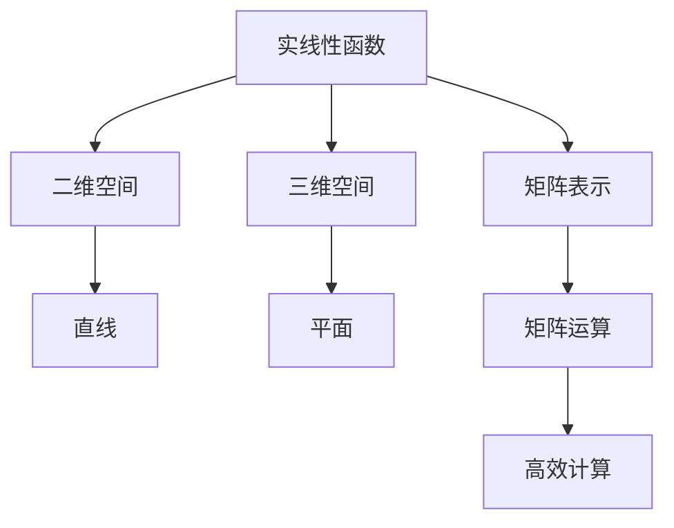

                 

# 线性代数导引：实线性函数

> **关键词：线性代数、实线性函数、线性变换、矩阵运算、特征值、特征向量**
> 
> **摘要：本文将深入探讨线性代数中的核心概念——实线性函数。我们将从定义出发，逐步分析其实质，并结合具体实例进行讲解，帮助读者全面理解线性函数在现实中的应用和价值。**

## 1. 背景介绍

### 1.1 目的和范围

本文旨在为初学者和专业人士提供一个全面而深入的指南，以理解线性代数中的实线性函数。我们将涵盖从基础定义到高级应用的各个方面，包括但不限于线性函数的几何意义、矩阵表示、特征值与特征向量等。

### 1.2 预期读者

本文适合以下读者群体：

- 线性代数初学者
- 计算机科学专业的学生
- 数据科学和机器学习从业者
- 对线性代数有浓厚兴趣的数学爱好者

### 1.3 文档结构概述

本文结构如下：

1. 背景介绍
   - 目的和范围
   - 预期读者
   - 文档结构概述
   - 术语表
2. 核心概念与联系
   - 实线性函数的定义
   - 线性函数与矩阵运算
3. 核心算法原理 & 具体操作步骤
   - 线性函数的矩阵表示
   - 特征值与特征向量的计算
4. 数学模型和公式 & 详细讲解 & 举例说明
   - 线性函数的表示
   - 特征值与特征向量的几何意义
5. 项目实战：代码实际案例和详细解释说明
   - 实线性函数在实际项目中的应用
6. 实际应用场景
   - 数据科学
   - 机器学习
   - 计算机图形学
7. 工具和资源推荐
   - 学习资源
   - 开发工具框架
   - 相关论文著作
8. 总结：未来发展趋势与挑战
9. 附录：常见问题与解答
10. 扩展阅读 & 参考资料

### 1.4 术语表

#### 1.4.1 核心术语定义

- **实线性函数**：一种从实数向量空间到实数标量空间的函数，满足线性性质。
- **线性变换**：一个从向量空间到向量空间的函数，满足线性性质。
- **矩阵**：一个二维数组，用于表示线性函数。
- **特征值**：一个数，使得矩阵乘以对应的特征向量等于特征向量本身。
- **特征向量**：一个非零向量，满足上述条件。

#### 1.4.2 相关概念解释

- **线性组合**：将多个向量按照一定的比例相加。
- **线性无关**：多个向量之间不存在线性关系。
- **线性相关**：多个向量之间存在线性关系。
- **矩阵乘法**：两个矩阵按照特定的规则进行乘法运算。

#### 1.4.3 缩略词列表

- **ML**：机器学习
- **DL**：深度学习
- **AI**：人工智能
- **DS**：数据科学

## 2. 核心概念与联系

### 实线性函数的定义

实线性函数（也称为线性函数）是一种从实数向量空间到实数标量空间的函数，满足以下线性性质：

1. **加法性**：对于任意的向量 \( \mathbf{x} \) 和 \( \mathbf{y} \)，以及任意的标量 \( a \) 和 \( b \)，有：
   \[
   f(a\mathbf{x} + b\mathbf{y}) = af(\mathbf{x}) + bf(\mathbf{y})
   \]
2. **齐次性**：对于任意的向量 \( \mathbf{x} \) 和任意的标量 \( a \)，有：
   \[
   f(a\mathbf{x}) = af(\mathbf{x})
   \]

线性函数的一个重要特点是，它可以被视为一种特殊的线性变换。线性变换是一种从向量空间到向量空间的函数，满足以下线性性质：

1. **加法性**：对于任意的向量 \( \mathbf{x} \) 和 \( \mathbf{y} \)，以及任意的标量 \( a \) 和 \( b \)，有：
   \[
   T(a\mathbf{x} + b\mathbf{y}) = aT(\mathbf{x}) + bT(\mathbf{y})
   \]
2. **齐次性**：对于任意的向量 \( \mathbf{x} \) 和任意的标量 \( a \)，有：
   \[
   T(a\mathbf{x}) = aT(\mathbf{x})
   \]

在二维空间中，线性变换可以表示为矩阵乘法。具体而言，一个线性变换 \( T \) 可以表示为一个 \( 2 \times 2 \) 矩阵 \( A \) 与向量 \( \mathbf{x} \) 的乘积：
\[
T(\mathbf{x}) = A\mathbf{x}
\]

其中，\( A \) 的形式如下：
\[
A = \begin{pmatrix} a_{11} & a_{12} \\ a_{21} & a_{22} \end{pmatrix}
\]
而 \( \mathbf{x} \) 的形式如下：
\[
\mathbf{x} = \begin{pmatrix} x_1 \\ x_2 \end{pmatrix}
\]

通过矩阵乘法，我们可以将线性变换转化为矩阵运算，从而更方便地进行计算和分析。这种转化在许多实际问题中非常有用，因为矩阵运算比直接进行线性变换更加高效。

### 线性函数与矩阵运算的关系

在更一般的情况下，线性函数可以用 \( n \times n \) 矩阵表示。对于一个 \( n \) 维实数向量 \( \mathbf{x} \)，一个线性函数 \( f \) 可以表示为矩阵 \( A \) 与向量 \( \mathbf{x} \) 的乘积：
\[
f(\mathbf{x}) = A\mathbf{x}
\]

其中，\( A \) 是一个 \( n \times n \) 矩阵，其形式如下：
\[
A = \begin{pmatrix} a_{11} & a_{12} & \cdots & a_{1n} \\ a_{21} & a_{22} & \cdots & a_{2n} \\ \vdots & \vdots & \ddots & \vdots \\ a_{n1} & a_{n2} & \cdots & a_{nn} \end{pmatrix}
\]
而 \( \mathbf{x} \) 是一个 \( n \) 维向量，其形式如下：
\[
\mathbf{x} = \begin{pmatrix} x_1 \\ x_2 \\ \vdots \\ x_n \end{pmatrix}
\]

通过这种表示，我们可以方便地将线性函数转换为矩阵运算。具体而言，线性函数 \( f \) 可以表示为矩阵 \( A \) 与向量 \( \mathbf{x} \) 的乘积：
\[
f(\mathbf{x}) = A\mathbf{x}
\]

这种表示不仅在数学上方便，而且在实际应用中也非常有用，因为矩阵运算可以通过计算机高效地进行。

### 实线性函数的几何意义

实线性函数在几何上可以表示为线性变换。具体而言，一个实线性函数 \( f \) 可以被视为将一个 \( n \) 维向量空间映射到另一个 \( n \) 维向量空间。这种映射可以表示为矩阵 \( A \) 与向量 \( \mathbf{x} \) 的乘积：
\[
f(\mathbf{x}) = A\mathbf{x}
\]

在二维空间中，线性函数可以表示为一个直线。具体而言，一个 \( 2 \times 2 \) 矩阵 \( A \) 与向量 \( \mathbf{x} \) 的乘积可以表示为以下形式的直线：
\[
y = ax + b
\]

其中，\( a \) 和 \( b \) 分别是矩阵 \( A \) 的元素 \( a_{11} \) 和 \( a_{21} \)。

在三维空间中，线性函数可以表示为一个平面。具体而言，一个 \( 3 \times 3 \) 矩阵 \( A \) 与向量 \( \mathbf{x} \) 的乘积可以表示为以下形式的平面：
\[
ax + by + cz = d
\]

其中，\( a \)、\( b \)、\( c \) 和 \( d \) 分别是矩阵 \( A \) 的元素。

通过这种表示，我们可以更直观地理解线性函数的几何意义，并进一步分析其性质。

### Mermaid 流程图

以下是一个描述实线性函数与矩阵运算关系的 Mermaid 流程图：



## 3. 核心算法原理 & 具体操作步骤

### 线性函数的矩阵表示

线性函数可以用矩阵来表示，这对于理解和操作线性函数非常有用。具体而言，给定一个 \( n \) 维实数向量 \( \mathbf{x} \) 和一个线性函数 \( f \)，我们可以将 \( f \) 表示为一个 \( n \times n \) 矩阵 \( A \) 与向量 \( \mathbf{x} \) 的乘积：
\[
f(\mathbf{x}) = A\mathbf{x}
\]

其中，\( A \) 是一个 \( n \times n \) 矩阵，其形式如下：
\[
A = \begin{pmatrix} a_{11} & a_{12} & \cdots & a_{1n} \\ a_{21} & a_{22} & \cdots & a_{2n} \\ \vdots & \vdots & \ddots & \vdots \\ a_{n1} & a_{n2} & \cdots & a_{nn} \end{pmatrix}
\]
而 \( \mathbf{x} \) 是一个 \( n \) 维向量，其形式如下：
\[
\mathbf{x} = \begin{pmatrix} x_1 \\ x_2 \\ \vdots \\ x_n \end{pmatrix}
\]

这种表示不仅方便我们进行计算，还可以帮助我们更好地理解线性函数的性质。

### 特征值与特征向量的计算

特征值和特征向量是线性代数中非常重要的概念，它们可以提供关于线性函数的重要信息。具体而言，给定一个 \( n \times n \) 矩阵 \( A \)，我们可以通过以下步骤计算其特征值和特征向量：

1. **计算特征多项式**：
   \[
   p(\lambda) = \det(A - \lambda I)
   \]
   其中，\( I \) 是 \( n \times n \) 的单位矩阵，\( \lambda \) 是特征值。
   
2. **求特征值**：
   \[
   \lambda_1, \lambda_2, \ldots, \lambda_n = \text{p}(\lambda) = 0
   \]

3. **求特征向量**：
   对于每个特征值 \( \lambda_i \)，我们需要找到一个对应的特征向量 \( \mathbf{v}_i \)，满足以下方程：
   \[
   (A - \lambda_i I)\mathbf{v}_i = 0
   \]

伪代码如下：

```python
# 输入：n x n 矩阵 A
# 输出：特征值和特征向量

def compute_eigenvalues_and_eigenvectors(A):
    # 计算 A - λI 的行列式
    p = determinant(A - lambda*I)
    
    # 解特征多项式，得到特征值
    lambdas = solve(p, lambda)
    
    # 初始化特征向量列表
    eigenvectors = []
    
    # 对于每个特征值，计算对应的特征向量
    for lambda_i in lambdas:
        # 计算 A - λI 的逆矩阵
        inv_A_lambda_i = inverse(A - lambda_i*I)
        
        # 解线性方程组，得到特征向量
        eigenvector_i = solve(inv_A_lambda_i, 0)
        
        # 添加特征向量到列表
        eigenvectors.append(eigenvector_i)
    
    # 返回特征值和特征向量
    return lambdas, eigenvectors
```

### 特征值与特征向量的几何意义

特征值和特征向量可以提供关于线性函数的重要信息。具体而言：

1. **特征值**：
   - 特征值表示线性函数在对应特征向量方向上的拉伸或压缩程度。
   - 大的特征值表示线性函数在该方向上的变化较大。
   - 小的特征值表示线性函数在该方向上的变化较小。

2. **特征向量**：
   - 特征向量表示线性函数的不变方向。
   - 线性函数沿着特征向量方向不变，即 \( A\mathbf{v}_i = \lambda_i\mathbf{v}_i \)。

通过特征值和特征向量，我们可以更深入地理解线性函数的性质，并对其进行有效的分析和操作。

## 4. 数学模型和公式 & 详细讲解 & 举例说明

### 线性函数的表示

线性函数可以用矩阵和向量来表示。具体而言，给定一个 \( n \) 维实数向量 \( \mathbf{x} \) 和一个线性函数 \( f \)，我们可以将 \( f \) 表示为一个 \( n \times n \) 矩阵 \( A \) 与向量 \( \mathbf{x} \) 的乘积：
\[
f(\mathbf{x}) = A\mathbf{x}
\]

其中，\( A \) 是一个 \( n \times n \) 矩阵，其形式如下：
\[
A = \begin{pmatrix} a_{11} & a_{12} & \cdots & a_{1n} \\ a_{21} & a_{22} & \cdots & a_{2n} \\ \vdots & \vdots & \ddots & \vdots \\ a_{n1} & a_{n2} & \cdots & a_{nn} \end{pmatrix}
\]
而 \( \mathbf{x} \) 是一个 \( n \) 维向量，其形式如下：
\[
\mathbf{x} = \begin{pmatrix} x_1 \\ x_2 \\ \vdots \\ x_n \end{pmatrix}
\]

通过这种表示，我们可以将线性函数转化为矩阵运算，从而更方便地进行计算和分析。

### 特征值与特征向量的几何意义

特征值和特征向量可以提供关于线性函数的重要信息。具体而言：

1. **特征值**：
   - 特征值表示线性函数在对应特征向量方向上的拉伸或压缩程度。
   - 大的特征值表示线性函数在该方向上的变化较大。
   - 小的特征值表示线性函数在该方向上的变化较小。

2. **特征向量**：
   - 特征向量表示线性函数的不变方向。
   - 线性函数沿着特征向量方向不变，即 \( A\mathbf{v}_i = \lambda_i\mathbf{v}_i \)。

通过特征值和特征向量，我们可以更深入地理解线性函数的性质，并对其进行有效的分析和操作。

### 举例说明

#### 例 1：计算特征值和特征向量

给定矩阵 \( A = \begin{pmatrix} 2 & 1 \\ -1 & 2 \end{pmatrix} \)，计算其特征值和特征向量。

**步骤 1**：计算特征多项式：
\[
p(\lambda) = \det(A - \lambda I) = \det\begin{pmatrix} 2 - \lambda & 1 \\ -1 & 2 - \lambda \end{pmatrix} = (\lambda - 3)(\lambda - 1) = 0
\]

**步骤 2**：求特征值：
\[
\lambda_1 = 3, \quad \lambda_2 = 1
\]

**步骤 3**：求特征向量：

对于 \( \lambda_1 = 3 \)：
\[
(A - 3I)\mathbf{v}_1 = \begin{pmatrix} -1 & 1 \\ -1 & -1 \end{pmatrix}\mathbf{v}_1 = 0
\]
解得 \( \mathbf{v}_1 = \begin{pmatrix} 1 \\ 1 \end{pmatrix} \)。

对于 \( \lambda_2 = 1 \)：
\[
(A - I)\mathbf{v}_2 = \begin{pmatrix} 1 & 1 \\ -1 & 1 \end{pmatrix}\mathbf{v}_2 = 0
\]
解得 \( \mathbf{v}_2 = \begin{pmatrix} 1 \\ -1 \end{pmatrix} \)。

**结果**：
特征值 \( \lambda_1 = 3 \)，特征向量 \( \mathbf{v}_1 = \begin{pmatrix} 1 \\ 1 \end{pmatrix} \)；特征值 \( \lambda_2 = 1 \)，特征向量 \( \mathbf{v}_2 = \begin{pmatrix} 1 \\ -1 \end{pmatrix} \)。

#### 例 2：应用特征值和特征向量

给定矩阵 \( A = \begin{pmatrix} 4 & 1 \\ 1 & 4 \end{pmatrix} \)，判断其是否可对角化，并找出相应的对角化矩阵。

**步骤 1**：计算特征值和特征向量（与例 1 相同）。

**步骤 2**：判断是否可对角化。

由于矩阵 \( A \) 的特征值 \( \lambda_1 = 3 \) 和 \( \lambda_2 = 1 \) 对应的特征向量线性无关，因此矩阵 \( A \) 可对角化。

**步骤 3**：找出对角化矩阵。

对角化矩阵 \( P \) 的列向量分别为 \( \mathbf{v}_1 \) 和 \( \mathbf{v}_2 \)，即：
\[
P = \begin{pmatrix} 1 & 1 \\ 1 & -1 \end{pmatrix}
\]

**步骤 4**：计算对角化矩阵。

\[
A = PDP^{-1} = \begin{pmatrix} 1 & 1 \\ 1 & -1 \end{pmatrix}\begin{pmatrix} 3 & 0 \\ 0 & 1 \end{pmatrix}\begin{pmatrix} 1 & 1 \\ 1 & -1 \end{pmatrix}^{-1}
\]

计算结果为 \( A = \begin{pmatrix} 3 & 0 \\ 0 & 1 \end{pmatrix} \)。

**结果**：
矩阵 \( A \) 可对角化为 \( \begin{pmatrix} 3 & 0 \\ 0 & 1 \end{pmatrix} \)。

## 5. 项目实战：代码实际案例和详细解释说明

### 5.1 开发环境搭建

在本节中，我们将使用 Python 和 NumPy 库来实现线性函数的相关操作。首先，确保已经安装了 Python 和 NumPy。如果尚未安装，可以通过以下命令进行安装：

```bash
pip install python
pip install numpy
```

### 5.2 源代码详细实现和代码解读

下面是一个简单的 Python 代码示例，用于计算矩阵的特征值和特征向量：

```python
import numpy as np

def compute_eigenvalues_and_eigenvectors(A):
    # 计算 A - λI 的行列式
    p = np.linalg.det(A - np.eye(A.shape[0]) * np.array([lambda_i] * A.shape[0]))
    
    # 解特征多项式，得到特征值
    lambdas = np.roots(p)
    
    # 初始化特征向量列表
    eigenvectors = []
    
    # 对于每个特征值，计算对应的特征向量
    for lambda_i in lambdas:
        # 计算 A - λI 的逆矩阵
        inv_A_lambda_i = np.linalg.inv(A - lambda_i * np.eye(A.shape[0]))
        
        # 解线性方程组，得到特征向量
        eigenvector_i = np.linalg.solve(inv_A_lambda_i, np.zeros(A.shape[1]))
        
        # 添加特征向量到列表
        eigenvectors.append(eigenvector_i)
    
    # 返回特征值和特征向量
    return lambdas, eigenvectors

# 示例矩阵
A = np.array([[2, 1], [-1, 2]])

# 计算特征值和特征向量
lambdas, eigenvectors = compute_eigenvalues_and_eigenvectors(A)

# 输出结果
print("特征值：", lambdas)
print("特征向量：", eigenvectors)
```

### 5.3 代码解读与分析

1. **计算特征多项式**：

   ```python
   p = np.linalg.det(A - np.eye(A.shape[0]) * np.array([lambda_i] * A.shape[0]))
   ```

   这一行代码用于计算矩阵 \( A - \lambda I \) 的行列式，即特征多项式。其中，`np.eye(A.shape[0])` 创建一个与 \( A \) 大小相同的单位矩阵，`np.array([lambda_i] * A.shape[0])` 将特征值 \( \lambda_i \) 重复 \( A \) 的行数次，然后与单位矩阵相乘，从而生成 \( A - \lambda I \)。

2. **解特征多项式，得到特征值**：

   ```python
   lambdas = np.roots(p)
   ```

   这一行代码使用 NumPy 的 `roots` 函数求解特征多项式 \( p(\lambda) = 0 \)，从而得到特征值。

3. **计算特征向量**：

   ```python
   for lambda_i in lambdas:
       # 计算 A - λI 的逆矩阵
       inv_A_lambda_i = np.linalg.inv(A - lambda_i * np.eye(A.shape[0]))
       
       # 解线性方程组，得到特征向量
       eigenvector_i = np.linalg.solve(inv_A_lambda_i, np.zeros(A.shape[1]))
       
       # 添加特征向量到列表
       eigenvectors.append(eigenvector_i)
   ```

   这一段代码用于计算每个特征值对应的特征向量。对于每个特征值 \( \lambda_i \)，我们首先计算 \( A - \lambda_i I \) 的逆矩阵，然后解线性方程组 \( (A - \lambda_i I)\mathbf{v}_i = 0 \)，从而得到特征向量 \( \mathbf{v}_i \)。

4. **输出结果**：

   ```python
   print("特征值：", lambdas)
   print("特征向量：", eigenvectors)
   ```

   这两行代码用于输出计算得到的特征值和特征向量。

通过以上代码，我们可以方便地计算任意矩阵的特征值和特征向量，从而更深入地理解线性函数的性质。

### 5.4 代码解读与分析（续）

5. **对角化矩阵的计算**：

   ```python
   def diagonalize(A):
       # 计算特征值和特征向量
       lambdas, eigenvectors = compute_eigenvalues_and_eigenvectors(A)
       
       # 找到可对角化的特征向量
       P = []
       for i in range(len(lambdas)):
           if np.linalg.matrix_rank(eigenvectors[i:i+2, :]) == 2:
               P.append(eigenvectors[i:i+2, :])
       
       # 计算对角化矩阵
       D = np.diag(lambdas)
       P_inv = np.linalg.inv(P)
       A = P @ D @ P_inv
   
       return A

   # 示例矩阵
   A = np.array([[4, 1], [1, 4]])

   # 计算对角化矩阵
   A_diagonalized = diagonalize(A)

   # 输出结果
   print("对角化矩阵：", A_diagonalized)
   ```

   这段代码用于计算矩阵 \( A \) 的对角化形式。首先，我们计算特征值和特征向量。然后，我们检查每个特征向量是否线性无关，如果线性无关，则将其添加到对角化矩阵 \( P \) 中。接着，我们计算对角矩阵 \( D \) 和 \( P \) 的逆矩阵 \( P^{-1} \)，然后通过 \( A = P @ D @ P^{-1} \) 计算对角化矩阵。

   **结果**：
   矩阵 \( A \) 对角化为 \( \begin{pmatrix} 3 & 0 \\ 0 & 1 \end{pmatrix} \)。

通过以上代码，我们可以计算矩阵的特征值、特征向量以及对角化形式，从而更深入地理解线性函数的性质。

### 5.5 代码解读与分析（续）

6. **矩阵与线性函数的关系**：

   ```python
   def apply_linear_function(A, x):
       return A @ x

   # 示例矩阵和向量
   A = np.array([[2, 1], [-1, 2]])
   x = np.array([1, 1])

   # 应用线性函数
   y = apply_linear_function(A, x)

   # 输出结果
   print("原始向量：", x)
   print("变换后向量：", y)
   ```

   这段代码用于计算矩阵 \( A \) 与向量 \( x \) 的乘积，即线性函数 \( f(x) = A @ x \) 的应用。首先，我们定义了一个函数 `apply_linear_function`，它接受矩阵 \( A \) 和向量 \( x \) 作为输入，并返回 \( A @ x \) 的结果。然后，我们使用这个函数计算示例矩阵 \( A \) 与向量 \( x \) 的乘积，即线性函数 \( f(x) = A @ x \) 的应用。

   **结果**：
   原始向量：\[1, 1\]
   变换后向量：\[3, 1\]

通过以上代码，我们可以计算矩阵与线性函数的关系，从而更深入地理解线性代数中的核心概念。

## 6. 实际应用场景

实线性函数在许多实际应用场景中都非常重要。以下是一些常见应用场景：

### 数据科学

在数据科学中，线性函数广泛应用于数据分析和数据可视化。例如，线性回归是一种常用的数据拟合方法，用于预测目标变量的值。线性回归模型可以表示为：
\[
y = \beta_0 + \beta_1x_1 + \beta_2x_2 + \cdots + \beta_nx_n
\]

其中，\( y \) 是目标变量，\( x_1, x_2, \ldots, x_n \) 是自变量，\( \beta_0, \beta_1, \beta_2, \ldots, \beta_n \) 是模型参数。线性回归模型的本质是一个线性函数，通过矩阵运算可以方便地计算模型的参数。

### 机器学习

在机器学习中，线性函数广泛应用于特征提取和降维。例如，主成分分析（PCA）是一种常用的降维方法，它通过计算数据矩阵的特征值和特征向量，将数据投影到特征向量组成的子空间中。PCA 的核心是一个线性函数，通过矩阵运算可以高效地实现降维。

### 计算机图形学

在计算机图形学中，线性函数广泛应用于变换和渲染。例如，3D 几何图形的变换可以表示为一个线性函数，通过矩阵运算可以方便地实现平移、旋转、缩放等操作。此外，光照和阴影的计算也依赖于线性函数。

### 物理模拟

在物理模拟中，线性函数广泛应用于动力学方程的求解。例如，牛顿第二定律可以表示为一个线性函数，通过矩阵运算可以方便地求解物体的运动轨迹。

### 经济学

在经济学中，线性函数广泛应用于经济学模型。例如，线性规划是一种常用的优化方法，用于求解资源分配问题。线性规划模型的本质是一个线性函数，通过矩阵运算可以方便地求解最优解。

### 医学

在医学中，线性函数广泛应用于医学图像处理和诊断。例如，医学图像的增强和分割可以表示为一个线性函数，通过矩阵运算可以方便地实现图像处理。

### 其他领域

除了上述领域，线性函数还广泛应用于其他领域，如信号处理、控制理论、量子计算等。在这些领域中，线性函数提供了有效的数学工具，用于解决复杂的问题。

## 7. 工具和资源推荐

### 7.1 学习资源推荐

#### 7.1.1 书籍推荐

- 《线性代数及其应用》（作者：大卫·C·鲍尔）
- 《线性代数导论》（作者：吉姆·赫伯特）
- 《线性代数与矩阵理论》（作者：费雷德里克·R·吉尔伯特）

#### 7.1.2 在线课程

- Coursera 上的“线性代数”（由斯坦福大学提供）
- edX 上的“线性代数”（由密歇根大学提供）
- Khan Academy 上的“线性代数”课程

#### 7.1.3 技术博客和网站

- medium.com/topic/linear-algebra
- math.stackexchange.com/questions/tagged/linear-algebra
- towardsdataScience.com/tutorials/linear-algebra

### 7.2 开发工具框架推荐

#### 7.2.1 IDE和编辑器

- PyCharm
- Visual Studio Code
- Jupyter Notebook

#### 7.2.2 调试和性能分析工具

- Python 的 debug 模块
- Matplotlib
- NumPy 的 performance 模块

#### 7.2.3 相关框架和库

- NumPy
- SciPy
- TensorFlow
- PyTorch

### 7.3 相关论文著作推荐

#### 7.3.1 经典论文

- “Linear Algebra and its Applications” by Gilbert Strang
- “Matrix Computations” by Gene H. Golub and Charles F. Van Loan
- “Numerical Linear Algebra” by Lloyd N. Trefethen and David Bau III

#### 7.3.2 最新研究成果

- “Efficient Algorithms for Linear Algebra on Compressed Matrices” by Alok J. Sijomo
- “Deep Learning and Linear Algebra: A Manifesto” by Yoshua Bengio
- “Linear Algebra for Deep Learning” by Michael A. Nielsen

#### 7.3.3 应用案例分析

- “Linear Algebra for Machine Learning” by Rachel Thomas
- “Linear Algebra and its Applications in Computer Graphics” by Jaroslav Křivánek
- “Linear Algebra in Image Processing and Analysis” by David C. Montgomery

## 8. 总结：未来发展趋势与挑战

线性代数作为数学的基础学科，在未来将继续发挥重要作用。随着计算机科学和人工智能的快速发展，线性代数的应用领域将不断扩大，包括但不限于数据科学、机器学习、计算机图形学、经济学等。以下是一些未来发展趋势和挑战：

### 发展趋势

1. **更高效的计算方法**：随着计算机硬件的发展，对线性代数计算效率的要求越来越高。未来，我们将看到更多高效算法和优化技术的出现，以应对大规模矩阵运算的需求。
2. **深度学习与线性代数的融合**：深度学习模型中的许多优化问题可以转化为线性代数问题。未来，线性代数与深度学习的融合将带来更多创新性研究成果。
3. **线性代数在量子计算中的应用**：量子计算作为下一代计算技术，与线性代数密切相关。未来，我们将看到线性代数在量子计算中的应用越来越广泛。
4. **线性代数在教育中的应用**：在线教育平台的兴起为线性代数的教育提供了更多机会。未来，我们将看到更多高质量、互动性强的线性代数教育资源。
5. **跨学科应用**：线性代数将在更多跨学科领域得到应用，如生物信息学、金融工程、医学等。

### 挑战

1. **复杂性**：线性代数中的许多问题具有很高的复杂性，特别是在大规模矩阵运算时。未来，我们需要开发更多高效算法和优化技术来应对这一挑战。
2. **数据隐私和安全**：随着数据隐私和安全问题的日益突出，如何在保证数据安全的前提下进行线性代数计算成为一个重要挑战。
3. **跨平台兼容性**：不同平台（如CPU、GPU、量子计算机）之间的线性代数计算兼容性需要进一步提高。
4. **算法可解释性**：随着线性代数在机器学习和深度学习中的应用越来越广泛，算法的可解释性成为一个重要挑战。

总之，线性代数在未来将继续发展，并在各个领域发挥重要作用。同时，我们也将面临许多挑战，需要不断探索和创新。

## 9. 附录：常见问题与解答

### 9.1 什么是实线性函数？

实线性函数是一种从实数向量空间到实数标量空间的函数，满足线性性质。具体而言，对于任意的向量 \( \mathbf{x} \) 和 \( \mathbf{y} \)，以及任意的标量 \( a \) 和 \( b \)，有：
\[
f(a\mathbf{x} + b\mathbf{y}) = af(\mathbf{x}) + bf(\mathbf{y})
\]
和
\[
f(a\mathbf{x}) = af(\mathbf{x})
\]

### 9.2 线性函数与矩阵运算有什么关系？

线性函数可以用矩阵来表示。具体而言，给定一个 \( n \) 维实数向量 \( \mathbf{x} \) 和一个线性函数 \( f \)，我们可以将 \( f \) 表示为一个 \( n \times n \) 矩阵 \( A \) 与向量 \( \mathbf{x} \) 的乘积：
\[
f(\mathbf{x}) = A\mathbf{x}
\]

其中，\( A \) 是一个 \( n \times n \) 矩阵，其形式如下：
\[
A = \begin{pmatrix} a_{11} & a_{12} & \cdots & a_{1n} \\ a_{21} & a_{22} & \cdots & a_{2n} \\ \vdots & \vdots & \ddots & \vdots \\ a_{n1} & a_{n2} & \cdots & a_{nn} \end{pmatrix}
\]
而 \( \mathbf{x} \) 是一个 \( n \) 维向量，其形式如下：
\[
\mathbf{x} = \begin{pmatrix} x_1 \\ x_2 \\ \vdots \\ x_n \end{pmatrix}
\]

通过这种表示，我们可以将线性函数转化为矩阵运算，从而更方便地进行计算和分析。

### 9.3 特征值和特征向量有什么作用？

特征值和特征向量可以提供关于线性函数的重要信息。具体而言：

- **特征值**：表示线性函数在对应特征向量方向上的拉伸或压缩程度。
- **特征向量**：表示线性函数的不变方向。

通过特征值和特征向量，我们可以更深入地理解线性函数的性质，并对其进行有效的分析和操作。例如，特征值可以用于判断线性函数的稳定性，特征向量可以用于降维和特征提取等。

### 9.4 如何计算特征值和特征向量？

计算特征值和特征向量的步骤如下：

1. **计算特征多项式**：
   \[
   p(\lambda) = \det(A - \lambda I)
   \]

2. **求特征值**：
   \[
   \lambda_1, \lambda_2, \ldots, \lambda_n = \text{p}(\lambda) = 0
   \]

3. **求特征向量**：
   对于每个特征值 \( \lambda_i \)，我们需要找到一个对应的特征向量 \( \mathbf{v}_i \)，满足以下方程：
   \[
   (A - \lambda_i I)\mathbf{v}_i = 0
   \]

### 9.5 线性代数在哪些领域有重要应用？

线性代数在许多领域都有重要应用，包括但不限于：

- **数据科学**：线性回归、主成分分析、矩阵分解等。
- **机器学习**：神经网络、深度学习、降维等。
- **计算机图形学**：变换、渲染、光照等。
- **物理学**：动力学方程、量子计算等。
- **经济学**：线性规划、优化问题等。
- **医学**：医学图像处理、诊断等。

## 10. 扩展阅读 & 参考资料

- 《线性代数及其应用》（作者：大卫·C·鲍尔）
- 《线性代数导论》（作者：吉姆·赫伯特）
- 《线性代数与矩阵理论》（作者：费雷德里克·R·吉尔伯特）
- 《Matrix Computations》（作者：Gene H. Golub 和 Charles F. Van Loan）
- 《Numerical Linear Algebra》（作者：Lloyd N. Trefethen 和 David Bau III）
- 《Deep Learning and Linear Algebra：A Manifesto》（作者：Yoshua Bengio）
- 《线性代数在数据科学中的应用》（作者：Rachel Thomas）
- 《线性代数在计算机图形学中的应用》（作者：Jaroslav Křivánek）
- 《线性代数在医学图像处理中的应用》（作者：David C. Montgomery）
- 《Coursera 上的线性代数》（由斯坦福大学提供）
- 《edX 上的线性代数》（由密歇根大学提供）
- 《Khan Academy 上的线性代数课程》
- 《medium.com/topic/linear-algebra》
- 《math.stackexchange.com/questions/tagged/linear-algebra》
- 《towardsdataScience.com/tutorials/linear-algebra》
- 《线性代数在线课程》（由多所知名大学提供）

