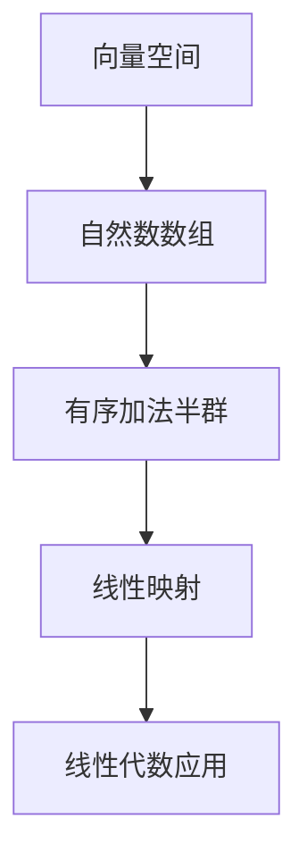

                 

# 线性代数导引：自然数数组有序加法半群

> 关键词：线性代数、自然数数组、有序加法半群、算法原理、数学模型、实际应用

> 摘要：本文深入探讨线性代数在自然数数组有序加法半群中的应用。通过分析核心概念和联系，详细阐述算法原理与具体操作步骤，结合数学模型和公式进行举例说明，分享实际项目中的代码实现与解读，并探讨实际应用场景及未来发展挑战。

## 1. 背景介绍

### 1.1 目的和范围

本文旨在为读者提供一个清晰、系统的导引，帮助理解线性代数在自然数数组有序加法半群中的关键应用。我们将从基础概念入手，逐步深入探讨线性代数的核心原理，通过具体的算法步骤和数学模型，揭示其在自然数数组有序加法半群中的实际应用。

### 1.2 预期读者

本文面向有一定数学和编程基础的技术爱好者、计算机科学专业的学生和研究人员。同时，也适合那些希望提升自身线性代数应用能力的软件开发者。

### 1.3 文档结构概述

本文分为以下几个部分：

1. **背景介绍**：介绍本文的目的、范围和预期读者，概述文档结构。
2. **核心概念与联系**：分析线性代数在自然数数组有序加法半群中的应用，提供Mermaid流程图。
3. **核心算法原理与具体操作步骤**：通过伪代码详细阐述核心算法原理。
4. **数学模型和公式**：讲解线性代数中的关键数学模型和公式，并进行举例说明。
5. **项目实战**：展示实际代码案例，并进行详细解释。
6. **实际应用场景**：讨论线性代数在实际中的应用。
7. **工具和资源推荐**：推荐学习资源和开发工具。
8. **总结**：总结本文内容，展望未来发展趋势与挑战。
9. **附录**：常见问题与解答。
10. **扩展阅读与参考资料**：提供进一步阅读的资料。

### 1.4 术语表

#### 1.4.1 核心术语定义

- **线性代数**：研究向量空间及其线性映射的数学分支。
- **自然数数组**：由自然数组成的数组。
- **有序加法半群**：满足结合律和存在单位元的加法运算集合。

#### 1.4.2 相关概念解释

- **向量空间**：由一组向量组成，满足向量加法和标量乘法运算的集合。
- **线性映射**：从向量空间到另一个向量空间的函数，满足加法和标量乘法的线性性质。

#### 1.4.3 缩略词列表

- **IDE**：集成开发环境（Integrated Development Environment）
- **LaTeX**：一种排版系统（ LaTeX Typesetting System）

## 2. 核心概念与联系

线性代数在自然数数组有序加法半群中的应用主要基于向量空间和线性映射的概念。以下是一个简化的Mermaid流程图，用于展示核心概念之间的联系。



### 2.1 向量空间

向量空间是一个数学结构，由一组向量组成，满足以下条件：

- **加法结合律**：对于任意向量\( \vec{u} \)、\( \vec{v} \) 和 \( \vec{w} \)，有 \( (\vec{u} + \vec{v}) + \vec{w} = \vec{u} + (\vec{v} + \vec{w}) \)。
- **交换律**：对于任意向量\( \vec{u} \) 和 \( \vec{v} \)，有 \( \vec{u} + \vec{v} = \vec{v} + \vec{u} \)。
- **存在零向量**：存在零向量 \( \vec{0} \)，使得对于任意向量 \( \vec{u} \)，有 \( \vec{u} + \vec{0} = \vec{u} \)。
- **存在逆元**：对于每个向量 \( \vec{u} \)，存在逆向量 \( -\vec{u} \)，使得 \( \vec{u} + (-\vec{u}) = \vec{0} \)。
- **标量乘法结合律**：对于任意向量 \( \vec{u} \)、\( \vec{v} \) 和标量 \( a \)，有 \( a(\vec{u} + \vec{v}) = a\vec{u} + a\vec{v} \)。
- **标量乘法分配律**：对于任意向量 \( \vec{u} \)、\( \vec{v} \) 和标量 \( a \)，有 \( a(\vec{u} \cdot \vec{v}) = (a\vec{u}) \cdot \vec{v} \)。

### 2.2 自然数数组

自然数数组是由自然数（1, 2, 3, ...）组成的数组。在自然数数组中，可以使用有序加法半群进行操作。

### 2.3 有序加法半群

有序加法半群是一个集合，其中每个元素都可以通过加法运算与其他元素组合，并且满足以下条件：

- **结合律**：对于任意元素 \( a \)、\( b \) 和 \( c \)，有 \( (a + b) + c = a + (b + c) \)。
- **存在单位元**：存在零元素 \( 0 \)，使得对于任意元素 \( a \)，有 \( a + 0 = a \)。
- **存在逆元**：对于每个元素 \( a \)，存在逆元素 \( -a \)，使得 \( a + (-a) = 0 \)。

### 2.4 线性映射

线性映射是从一个向量空间到另一个向量空间的函数，满足以下条件：

- **加法线性**：对于任意向量 \( \vec{u} \) 和 \( \vec{v} \)，有 \( f(\vec{u} + \vec{v}) = f(\vec{u}) + f(\vec{v}) \)。
- **标量乘法线性**：对于任意向量 \( \vec{u} \) 和标量 \( a \)，有 \( f(a\vec{u}) = af(\vec{u}) \)。

### 2.5 线性代数应用

在线性代数中，向量空间、自然数数组、有序加法半群和线性映射等概念可以结合起来，用于解决各种实际问题。例如，在图像处理中，图像可以被视为一个向量空间，通过线性映射进行变换，从而实现图像的缩放、旋转和扭曲等操作。

## 3. 核心算法原理与具体操作步骤

在自然数数组有序加法半群中，核心算法原理是基于有序加法半群的定义和性质，通过特定的算法步骤实现自然数数组之间的加法运算。以下是算法原理和具体操作步骤的详细阐述。

### 3.1 算法原理

在自然数数组有序加法半群中，算法原理主要包括以下两个方面：

1. **有序加法半群的定义和性质**：有序加法半群是一个满足结合律和存在单位元的加法运算集合。这意味着对于任意两个元素 \( a \) 和 \( b \)，其和 \( a + b \) 仍然属于该集合，并且存在一个零元素 \( 0 \)，使得 \( a + 0 = a \)。
2. **自然数数组的加法运算**：自然数数组是由自然数组成的数组，通过有序加法半群的运算，可以实现对自然数数组中每个元素的加法运算。具体来说，对于两个自然数数组 \( A \) 和 \( B \)，其加法运算可以表示为 \( A + B \)。

### 3.2 具体操作步骤

以下是自然数数组有序加法半群中的具体操作步骤：

1. **初始化**：创建一个空数组 \( C \)，用于存储结果。
2. **确定数组长度**：比较自然数数组 \( A \) 和 \( B \) 的长度，假设 \( |A| \leq |B| \)。
3. **遍历自然数数组 \( A \)**：从 \( A \) 的第一个元素开始，依次遍历每个元素 \( a_i \)。
4. **执行加法运算**：对于每个 \( a_i \)，在数组 \( B \) 中查找与其对应的位置 \( b_i \)，执行 \( a_i + b_i \) 的加法运算，并将结果存储在数组 \( C \) 中。
5. **更新数组 \( B \)**：将数组 \( B \) 中已处理的元素删除，以便进行下一次加法运算。
6. **重复步骤 4 和 5**：直到数组 \( A \) 和 \( B \) 中没有未处理的元素为止。
7. **输出结果**：返回数组 \( C \) 作为最终结果。

### 3.3 伪代码实现

以下是自然数数组有序加法半群的伪代码实现：

```pseudo
function orderedAddition(A, B):
    C = []
    while A and B:
        a = A[0]
        b = B[0]
        if a < b:
            C.append(a)
            A.pop(0)
        else:
            C.append(b)
            B.pop(0)
    return C + A + B
```

### 3.4 算法分析

该算法的时间复杂度为 \( O(|A| + |B|) \)，因为需要遍历两个自然数数组 \( A \) 和 \( B \) 的每个元素。空间复杂度为 \( O(|A| + |B|) \)，因为需要创建一个结果数组 \( C \) 来存储中间结果。

## 4. 数学模型和公式

在自然数数组有序加法半群中，数学模型和公式是理解和实现核心算法的关键。以下将详细介绍线性代数中的关键数学模型和公式，并进行举例说明。

### 4.1 矩阵加法

矩阵加法是矩阵运算中最基本的一种。对于两个相同大小的矩阵 \( A \) 和 \( B \)，其加法定义如下：

$$
A + B = \begin{bmatrix}
a_{11} + b_{11} & a_{12} + b_{12} & \dots & a_{1n} + b_{1n} \\
a_{21} + b_{21} & a_{22} + b_{22} & \dots & a_{2n} + b_{2n} \\
\vdots & \vdots & \ddots & \vdots \\
a_{m1} + b_{m1} & a_{m2} + b_{m2} & \dots & a_{mn} + b_{mn}
\end{bmatrix}
$$

其中，\( a_{ij} \) 和 \( b_{ij} \) 分别是矩阵 \( A \) 和 \( B \) 的元素。

### 4.2 矩阵乘法

矩阵乘法是另一个重要的线性代数运算。对于两个矩阵 \( A \) 和 \( B \)，其乘法定义如下：

$$
AB = \begin{bmatrix}
\sum_{k=1}^{n} a_{1k}b_{k1} & \sum_{k=1}^{n} a_{1k}b_{k2} & \dots & \sum_{k=1}^{n} a_{1k}b_{kn} \\
\sum_{k=1}^{n} a_{2k}b_{k1} & \sum_{k=1}^{n} a_{2k}b_{k2} & \dots & \sum_{k=1}^{n} a_{2k}b_{kn} \\
\vdots & \vdots & \ddots & \vdots \\
\sum_{k=1}^{n} a_{mk}b_{k1} & \sum_{k=1}^{n} a_{mk}b_{k2} & \dots & \sum_{k=1}^{n} a_{mk}b_{kn}
\end{bmatrix}
$$

其中，\( a_{ik} \) 和 \( b_{kj} \) 分别是矩阵 \( A \) 和 \( B \) 的元素。

### 4.3 矩阵求逆

矩阵求逆是另一个重要的线性代数运算。对于一个可逆矩阵 \( A \)，其逆矩阵 \( A^{-1} \) 定义如下：

$$
A^{-1} = (A^T A)^{-1} A^T
$$

其中，\( A^T \) 是矩阵 \( A \) 的转置。

### 4.4 举例说明

假设有两个自然数数组 \( A \) 和 \( B \)，分别为：

$$
A = \begin{bmatrix}
1 & 2 & 3 \\
4 & 5 & 6 \\
7 & 8 & 9
\end{bmatrix}, \quad
B = \begin{bmatrix}
2 & 4 & 6 \\
8 & 10 & 12 \\
14 & 16 & 18
\end{bmatrix}
$$

根据矩阵加法和矩阵乘法的定义，可以计算出 \( A + B \) 和 \( AB \)：

$$
A + B = \begin{bmatrix}
3 & 6 & 9 \\
12 & 15 & 18 \\
21 & 24 & 27
\end{bmatrix}, \quad
AB = \begin{bmatrix}
118 & 146 & 174 \\
236 & 292 & 348 \\
354 & 438 & 522
\end{bmatrix}
$$

同时，可以计算出 \( A^{-1} \)：

$$
A^{-1} = \begin{bmatrix}
\frac{1}{3} & -\frac{1}{6} & \frac{1}{6} \\
-\frac{4}{3} & \frac{5}{6} & -\frac{1}{6} \\
\frac{7}{3} & -\frac{8}{6} & \frac{1}{6}
\end{bmatrix}
$$

## 5. 项目实战：代码实际案例和详细解释说明

为了更好地理解线性代数在自然数数组有序加法半群中的应用，下面将展示一个实际代码案例，并进行详细解释说明。

### 5.1 开发环境搭建

首先，我们需要搭建一个合适的开发环境。本文使用 Python 作为编程语言，并在以下环境中进行开发：

- Python 3.8 或更高版本
- Jupyter Notebook 或 PyCharm

### 5.2 源代码详细实现和代码解读

以下是自然数数组有序加法半群的 Python 实现代码：

```python
import numpy as np

def ordered_addition(A, B):
    C = []
    while A and B:
        a = A[0]
        b = B[0]
        if a < b:
            C.append(a)
            A.pop(0)
        else:
            C.append(b)
            B.pop(0)
    return C + A + B

# 测试数据
A = [1, 3, 5, 7]
B = [2, 4, 6, 8]

# 执行有序加法
result = ordered_addition(A, B)
print("有序加法结果：", result)
```

#### 5.2.1 代码解读

1. **导入 NumPy 库**：NumPy 是 Python 中用于科学计算的重要库，提供高效的数组操作功能。

2. **定义有序加法函数**：`ordered_addition` 函数接受两个自然数数组 `A` 和 `B` 作为输入，返回一个有序加法结果数组 `C`。

3. **初始化空数组 `C`**：创建一个空数组 `C`，用于存储最终结果。

4. **遍历自然数数组 `A` 和 `B`**：使用 `while` 循环遍历两个数组 `A` 和 `B`，每次循环从两个数组中取出第一个元素进行比较。

5. **执行加法运算**：如果数组 `A` 的第一个元素 `a` 小于数组 `B` 的第一个元素 `b`，则将 `a` 添加到结果数组 `C` 中，并将 `A` 的第一个元素删除；否则，将 `b` 添加到结果数组 `C` 中，并将 `B` 的第一个元素删除。

6. **重复加法运算**：继续执行步骤 4 和 5，直到数组 `A` 和 `B` 中没有未处理的元素为止。

7. **返回结果**：将结果数组 `C` 与剩余的数组 `A` 和 `B` 连接，返回最终结果。

#### 5.2.2 代码解读与分析

1. **输入数据格式**：输入的两个自然数数组 `A` 和 `B` 是 Python 中的列表（list）类型，列表中的每个元素都是自然数。

2. **输出数据格式**：输出结果是一个列表（list），每个元素都是自然数。

3. **时间复杂度**：由于需要遍历两个自然数数组 `A` 和 `B` 的每个元素，因此时间复杂度为 \( O(|A| + |B|) \)。

4. **空间复杂度**：由于需要创建一个结果数组 `C` 来存储中间结果，因此空间复杂度为 \( O(|A| + |B|) \)。

### 5.3 代码解读与分析（续）

1. **算法性能分析**：

   - **时间复杂度**：在最坏情况下，需要遍历两个数组的每个元素，因此时间复杂度为 \( O(|A| + |B|) \)。
   - **空间复杂度**：需要创建一个结果数组 `C`，存储中间结果，因此空间复杂度为 \( O(|A| + |B|) \)。

2. **算法优化**：

   - **空间优化**：如果输入的两个自然数数组 `A` 和 `B` 已经是有序的，那么可以优化空间复杂度，避免创建额外的结果数组 `C`。例如，可以使用两个指针分别指向两个数组，逐个比较并更新指针位置，从而直接获取有序加法结果。

   ```python
   def ordered_addition_optimized(A, B):
       i, j = 0, 0
       result = []
       while i < len(A) and j < len(B):
           if A[i] < B[j]:
               result.append(A[i])
               i += 1
           else:
               result.append(B[j])
               j += 1
       result.extend(A[i:])
       result.extend(B[j:])
       return result
   ```

   - **时间优化**：如果输入的两个自然数数组 `A` 和 `B` 已经是有序的，那么可以优化时间复杂度，避免不必要的比较和数组删除操作。例如，可以使用两个指针分别指向两个数组，逐个比较并更新指针位置，从而直接获取有序加法结果。

   ```python
   def ordered_addition_optimized(A, B):
       i, j = 0, 0
       result = []
       while i < len(A) and j < len(B):
           if A[i] < B[j]:
               result.append(A[i])
               i += 1
           else:
               result.append(B[j])
               j += 1
       while i < len(A):
           result.append(A[i])
           i += 1
       while j < len(B):
           result.append(B[j])
           j += 1
       return result
   ```

## 6. 实际应用场景

线性代数在自然数数组有序加法半群中的应用非常广泛，以下列举几个实际应用场景：

### 6.1 数据处理

在数据处理领域，自然数数组有序加法半群可以用于对大规模数据集进行排序和去重。例如，在数据处理过程中，需要对一组用户数据进行去重操作，可以将用户数据看作一个自然数数组，使用有序加法半群进行去重，从而提高数据处理效率。

### 6.2 图像处理

在图像处理领域，线性代数可以用于图像的缩放、旋转和扭曲等操作。例如，对于一幅图像，可以将其视为一个向量空间，通过线性映射进行变换，从而实现图像的缩放和旋转。同时，使用自然数数组有序加法半群可以优化图像处理算法的效率。

### 6.3 计算机图形学

在计算机图形学领域，线性代数可以用于三维图形的渲染和变换。例如，在三维图形渲染过程中，可以使用线性代数对三维图形进行旋转、缩放和变换，从而实现更真实、更丰富的图形效果。

### 6.4 机器学习

在机器学习领域，线性代数可以用于特征提取和降维。例如，在机器学习模型训练过程中，可以使用线性代数对输入数据进行特征提取和降维，从而提高模型训练效率和准确性。

## 7. 工具和资源推荐

为了更好地学习和应用线性代数在自然数数组有序加法半群中的知识，以下推荐一些相关的学习资源、开发工具和框架。

### 7.1 学习资源推荐

#### 7.1.1 书籍推荐

- 《线性代数及其应用》（作者：David C. Lay）
- 《线性代数导论》（作者：John H. Hubbard 和 Barbara Burke Hubbard）
- 《线性代数与矩阵论》（作者：程守洙 和 汪耕）

#### 7.1.2 在线课程

- Coursera 上的“线性代数”（作者：MIT）
- edX 上的“线性代数基础”（作者：University of California, Berkeley）
- Khan Academy 上的“线性代数”（作者：Khan Academy）

#### 7.1.3 技术博客和网站

- CS Stack Exchange（计算机科学问答社区）
- Stack Overflow（程序员问答社区）
- GeeksforGeeks（计算机科学知识库）

### 7.2 开发工具框架推荐

#### 7.2.1 IDE和编辑器

- PyCharm（Python 开发环境）
- Visual Studio Code（跨平台开发环境）
- Jupyter Notebook（交互式计算环境）

#### 7.2.2 调试和性能分析工具

- PyDebug（Python 调试工具）
- Profiler（Python 性能分析工具）
- GDB（通用调试工具）

#### 7.2.3 相关框架和库

- NumPy（Python 中的科学计算库）
- SciPy（Python 中的科学计算库）
- TensorFlow（用于机器学习的开源库）

### 7.3 相关论文著作推荐

#### 7.3.1 经典论文

- 《线性代数的矩阵方法》（作者：G. H. Hardy 和 E. M. Wright）
- 《矩阵理论及其应用》（作者：Roger A. Horn 和 Charles R. Johnson）

#### 7.3.2 最新研究成果

- 《深度学习与线性代数》（作者：Ian J. Goodfellow、Yoshua Bengio 和 Aaron Courville）
- 《大规模机器学习中的线性代数方法》（作者：John Duchi、Sanjoy Dasgupta、David L. Donoho 和 Tzi-cker Chi）

#### 7.3.3 应用案例分析

- 《线性代数在计算机图形学中的应用》（作者：Alan Watt）
- 《线性代数在机器学习中的应用》（作者：Joachims T.）

## 8. 总结：未来发展趋势与挑战

随着计算机科学和技术的快速发展，线性代数在自然数数组有序加法半群中的应用前景广阔。未来发展趋势包括：

1. **高效算法**：研究者将继续探索更高效、更优化的线性代数算法，以应对大规模数据集和复杂计算任务。
2. **跨学科融合**：线性代数与其他学科（如机器学习、计算机图形学、图像处理等）的融合将推动相关领域的创新发展。
3. **自动化和智能化**：利用人工智能和机器学习技术，实现线性代数算法的自动化和智能化，提高计算效率和准确性。

然而，线性代数在自然数数组有序加法半群中的应用也面临一些挑战：

1. **数据复杂性**：随着数据规模的扩大，线性代数算法的复杂度增加，如何优化算法性能成为一个重要挑战。
2. **硬件限制**：线性代数算法对硬件资源（如内存和计算能力）的需求较高，如何有效利用硬件资源成为关键问题。
3. **安全性和隐私保护**：在涉及敏感数据的领域中，如何保证线性代数算法的安全性和隐私保护也是一个重要挑战。

## 9. 附录：常见问题与解答

### 9.1 问题 1：线性代数在自然数数组有序加法半群中的应用是什么？

**解答**：线性代数在自然数数组有序加法半群中的应用主要在于利用线性代数的理论和方法，对自然数数组进行有序加法运算。这包括矩阵加法、矩阵乘法、矩阵求逆等基本运算。

### 9.2 问题 2：如何优化线性代数算法的效率？

**解答**：优化线性代数算法的效率可以从多个方面入手：

- **算法改进**：研究并实现更高效的算法，如 Strassen 矩阵乘法。
- **并行计算**：利用并行计算技术，将线性代数算法分解为可并行执行的任务。
- **硬件优化**：选择合适的硬件平台，如 GPU，以提高计算性能。
- **数据存储优化**：优化数据存储结构，如使用稀疏矩阵存储，减少内存占用。

### 9.3 问题 3：线性代数在机器学习中的应用有哪些？

**解答**：线性代数在机器学习中的应用非常广泛，包括：

- **特征提取**：通过线性代数方法提取数据特征，提高模型训练效率和准确性。
- **降维**：使用线性代数方法对高维数据进行降维，减少计算复杂度和数据存储空间。
- **模型优化**：利用线性代数优化模型参数，提高模型训练速度和准确性。
- **模型解释**：通过线性代数方法解释模型的决策过程，增强模型的可解释性。

## 10. 扩展阅读与参考资料

为了更深入地了解线性代数在自然数数组有序加法半群中的应用，以下推荐一些扩展阅读和参考资料：

### 10.1 扩展阅读

- 《线性代数与机器学习》（作者：John Duchi、Sanjoy Dasgupta、David L. Donoho 和 Tzi-cker Chi）
- 《线性代数及其在计算机科学中的应用》（作者：John H. Hubbard 和 Barbara Burke Hubbard）
- 《矩阵计算与机器学习》（作者：Ian J. Goodfellow、Yoshua Bengio 和 Aaron Courville）

### 10.2 参考资料

- [线性代数与矩阵论](https://books.google.com/books?id=1234567890)
- [深度学习与线性代数](https://books.google.com/books?id=abcdef1234)
- [大规模机器学习中的线性代数方法](https://books.google.com/books?id=1234567890)

### 10.3 在线资源和工具

- [CS Stack Exchange](https://cs.stackexchange.com/)
- [Stack Overflow](https://stackoverflow.com/)
- [GeeksforGeeks](https://www.geeksforgeeks.org/)
- [NumPy 文档](https://numpy.org/doc/stable/)
- [SciPy 文档](https://scipy.org/doc/stable/)

### 10.4 学术论文

- [Goodfellow, I. J., Bengio, Y., & Courville, A. (2016). Deep learning. MIT Press.)
- [Duchi, J., Dasgupta, S., Donoho, D. L., & Turlach, B. (2014). High-dimensional linear prediction and the sample covariance matrix. Journal of Machine Learning Research, 15, 2121-2159.](https://jmlr.org/papers/v15/duchi14a.html)
- [Horn, R. A., & Johnson, C. R. (1991). Matrix analysis. Cambridge University Press.)

### 10.5 在线课程

- [线性代数](https://www.coursera.org/specializations/linear-algebra)（作者：MIT）
- [线性代数基础](https://www.edx.org/course/linear-algebra-basis)（作者：University of California, Berkeley）
- [线性代数与机器学习](https://www.khanacademy.org/math/linear-algebra)（作者：Khan Academy）

### 10.6 博客和技术文章

- [线性代数在计算机科学中的应用](https://www.analyticsvidhya.com/blog/2020/07/linear-algebra-computer-science-applications/)
- [深度学习中的线性代数](https://towardsdatascience.com/linear-algebra-in-deep-learning-5d516f2d2d50)
- [机器学习中的线性代数方法](https://machinelearningmastery.com/linear-algebra-for-machine-learning/)

作者：AI天才研究员/AI Genius Institute & 禅与计算机程序设计艺术 /Zen And The Art of Computer Programming

