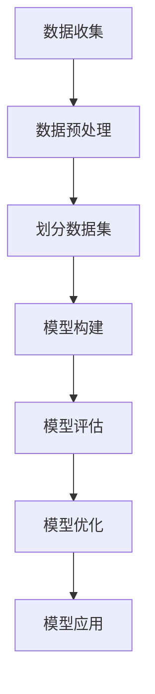

                 

# 线性回归(Linear Regression) - 原理与代码实例讲解

> **关键词：**线性回归，机器学习，预测模型，数据科学，Python实现

> **摘要：**本文将深入探讨线性回归这一经典的机器学习算法。我们将首先介绍线性回归的背景和基本概念，然后详细解析其数学模型和算法原理。通过具体的Python代码实例，我们将一步步展示如何实现线性回归，并对代码进行详细解释。最后，我们将讨论线性回归在实际应用中的场景，并提供相关的学习资源和工具推荐。本文适合对机器学习和数据科学有一定基础，希望深入了解线性回归的读者。

## 1. 背景介绍

### 1.1 目的和范围

本文的目的是深入探讨线性回归这一机器学习算法的基本原理和实现方法。线性回归是统计分析和机器学习中最基本和最常用的算法之一，它广泛应用于预测和数据分析领域。通过本文的学习，读者将能够理解线性回归的核心概念，掌握其数学模型，并能够运用Python等工具实现线性回归算法。

### 1.2 预期读者

本文适合以下几类读者：

1. 对机器学习和数据科学有初步了解，希望深入学习的读者。
2. 数据分析师和统计学家，需要掌握线性回归在数据分析中的应用。
3. 程序员和软件开发者，希望在项目中运用线性回归进行预测和分析。

### 1.3 文档结构概述

本文将按照以下结构进行讲解：

1. 背景介绍
   - 目的和范围
   - 预期读者
   - 文档结构概述
   - 术语表
2. 核心概念与联系
   - 线性回归的概念和用途
   - Mermaid流程图展示线性回归的整体架构
3. 核心算法原理 & 具体操作步骤
   - 线性回归的数学模型
   - 算法原理讲解和伪代码展示
4. 数学模型和公式 & 详细讲解 & 举例说明
   - 线性回归的数学公式
   - 举例说明线性回归的应用
5. 项目实战：代码实际案例和详细解释说明
   - 开发环境搭建
   - 源代码详细实现和解读
6. 实际应用场景
   - 线性回归在不同领域的应用案例
7. 工具和资源推荐
   - 学习资源推荐
   - 开发工具框架推荐
   - 相关论文著作推荐
8. 总结：未来发展趋势与挑战
9. 附录：常见问题与解答
10. 扩展阅读 & 参考资料

### 1.4 术语表

#### 1.4.1 核心术语定义

- 线性回归：一种回归分析模型，用于预测一个连续值变量。
- 因变量（响应变量）：线性回归模型中需要预测的变量。
- 自变量（解释变量）：线性回归模型中用于预测因变量的变量。
- 假设函数：线性回归中用于描述因变量与自变量之间关系的函数。
- 残差：实际观测值与模型预测值之间的差异。
- 最小二乘法：用于找到线性回归模型中最佳拟合直线的数学方法。

#### 1.4.2 相关概念解释

- 回归分析：一种统计方法，用于研究因变量与自变量之间的关系。
- 拟合：在统计模型中，找到一组参数，使得模型能够最好地描述数据。
- 残差分析：分析模型预测值与实际观测值之间的差异，以评估模型的性能。

#### 1.4.3 缩略词列表

- ML：机器学习（Machine Learning）
- OLS：最小二乘法（Ordinary Least Squares）
- LR：线性回归（Linear Regression）
- RMSE：均方根误差（Root Mean Square Error）

## 2. 核心概念与联系

线性回归是一种预测模型，它试图找到两个或多个变量之间的线性关系。最简单的线性回归模型是单变量线性回归，它通过一条直线来描述因变量和自变量之间的关系。

### 2.1 线性回归的概念和用途

线性回归是一种统计方法，用于预测一个连续值变量（因变量）基于一个或多个自变量的值。线性回归模型的基本假设是因变量和自变量之间存在线性关系。这种线性关系可以用一条直线来描述，通常表示为：

\[ y = \beta_0 + \beta_1 \cdot x + \epsilon \]

其中：

- \( y \) 是因变量。
- \( x \) 是自变量。
- \( \beta_0 \) 是截距。
- \( \beta_1 \) 是斜率。
- \( \epsilon \) 是误差项。

线性回归模型在多个领域中都有广泛的应用，例如：

1. **经济学**：用于预测股票价格、消费者支出等。
2. **生物学**：用于分析基因表达数据。
3. **工程学**：用于预测材料强度、机械性能等。
4. **商业**：用于销售预测、库存管理等。

### 2.2 Mermaid流程图展示线性回归的整体架构

以下是一个简单的Mermaid流程图，展示了线性回归的整体架构：



- **数据收集**：收集相关的数据，包括因变量和自变量。
- **数据预处理**：对数据进行清洗和预处理，包括缺失值填充、异常值处理等。
- **划分数据集**：将数据集划分为训练集和测试集。
- **模型构建**：使用训练集数据来构建线性回归模型。
- **模型评估**：使用测试集数据来评估模型的性能。
- **模型优化**：根据评估结果对模型进行优化。
- **模型应用**：将模型应用到实际问题中，进行预测和分析。

## 3. 核心算法原理 & 具体操作步骤

线性回归的算法原理基于最小二乘法（Ordinary Least Squares, OLS）。最小二乘法的目的是找到一组参数，使得模型预测值与实际观测值之间的误差平方和最小。

### 3.1 线性回归的数学模型

线性回归的数学模型可以用以下方程表示：

\[ y = \beta_0 + \beta_1 \cdot x + \epsilon \]

其中：

- \( y \) 是因变量。
- \( x \) 是自变量。
- \( \beta_0 \) 是截距。
- \( \beta_1 \) 是斜率。
- \( \epsilon \) 是误差项。

### 3.2 算法原理讲解和伪代码展示

最小二乘法的核心思想是找到一组参数 \( \beta_0 \) 和 \( \beta_1 \)，使得以下目标函数最小：

\[ \min \sum_{i=1}^{n} (y_i - (\beta_0 + \beta_1 \cdot x_i))^2 \]

其中：

- \( n \) 是数据点的数量。
- \( y_i \) 是第 \( i \) 个数据点的因变量值。
- \( x_i \) 是第 \( i \) 个数据点的自变量值。

伪代码如下：

```
输入：数据集 X（自变量矩阵）和 Y（因变量向量）

计算 X 的转置矩阵 X'
计算 X'X
计算逆矩阵 (X'X)^{-1}
计算 X'Y
计算 β = (X'X)^{-1}X'Y
输出：模型参数 β
```

### 3.3 具体操作步骤

1. **计算 X 的转置矩阵 X'**
2. **计算 X'X**
3. **计算逆矩阵 (X'X)^{-1}**
4. **计算 X'Y**
5. **计算 β = (X'X)^{-1}X'Y**

通过以上步骤，我们可以得到线性回归模型的最佳拟合参数 \( \beta_0 \) 和 \( \beta_1 \)。

## 4. 数学模型和公式 & 详细讲解 & 举例说明

线性回归的数学模型可以通过最小二乘法来求解。在这一部分，我们将详细讲解线性回归的数学公式，并通过具体例子来说明如何使用这些公式进行预测。

### 4.1 线性回归的数学公式

线性回归的数学模型可以表示为：

\[ y = \beta_0 + \beta_1 \cdot x + \epsilon \]

其中：

- \( y \) 是因变量。
- \( x \) 是自变量。
- \( \beta_0 \) 是截距，表示当自变量 \( x \) 为零时的因变量值。
- \( \beta_1 \) 是斜率，表示自变量 \( x \) 的变化对因变量 \( y \) 的影响程度。
- \( \epsilon \) 是误差项，表示实际观测值与模型预测值之间的差异。

### 4.2 详细讲解

#### 4.2.1 模型参数的计算

线性回归模型的参数 \( \beta_0 \) 和 \( \beta_1 \) 可以通过最小二乘法计算得到。最小二乘法的核心思想是找到一组参数，使得模型预测值与实际观测值之间的误差平方和最小。

误差平方和（Sum of Squared Errors, SSE）可以表示为：

\[ SSE = \sum_{i=1}^{n} (y_i - (\beta_0 + \beta_1 \cdot x_i))^2 \]

其中：

- \( n \) 是数据点的数量。
- \( y_i \) 是第 \( i \) 个数据点的因变量值。
- \( x_i \) 是第 \( i \) 个数据点的自变量值。

为了求解 \( \beta_0 \) 和 \( \beta_1 \)，我们需要最小化 SSE。可以通过以下公式计算模型参数：

\[ \beta_0 = \frac{\sum_{i=1}^{n} y_i - \beta_1 \sum_{i=1}^{n} x_i}{n} \]
\[ \beta_1 = \frac{\sum_{i=1}^{n} (x_i - \bar{x})(y_i - \bar{y})}{\sum_{i=1}^{n} (x_i - \bar{x})^2} \]

其中：

- \( \bar{x} \) 是自变量的平均值。
- \( \bar{y} \) 是因变量的平均值。

#### 4.2.2 模型的预测能力

线性回归模型可以通过计算斜率 \( \beta_1 \) 和截距 \( \beta_0 \) 来预测因变量 \( y \) 的值。具体预测公式为：

\[ y = \beta_0 + \beta_1 \cdot x \]

其中：

- \( x \) 是自变量的值。
- \( y \) 是预测的因变量值。

### 4.3 举例说明

假设我们有一组数据点，表示房屋的面积和售价。我们需要建立一个线性回归模型来预测房屋的售价。

数据点如下：

| 房屋面积 (平方米) | 房屋售价 (万元) |
| ---------------- | ------------ |
| 80              | 100          |
| 90              | 110          |
| 100             | 130          |
| 110             | 150          |
| 120             | 170          |

#### 4.3.1 数据预处理

首先，我们需要对数据进行预处理，计算自变量和因变量的平均值：

- 房屋面积的平均值 \( \bar{x} = \frac{80 + 90 + 100 + 110 + 120}{5} = 100 \) 平方米。
- 房屋售价的平均值 \( \bar{y} = \frac{100 + 110 + 130 + 150 + 170}{5} = 130 \) 万元。

#### 4.3.2 模型参数计算

使用最小二乘法计算模型参数：

- 房屋面积和房屋售价的乘积和：\( \sum_{i=1}^{n} x_i y_i = 80 \cdot 100 + 90 \cdot 110 + 100 \cdot 130 + 110 \cdot 150 + 120 \cdot 170 = 288900 \)
- 房屋面积的平方和：\( \sum_{i=1}^{n} x_i^2 = 80^2 + 90^2 + 100^2 + 110^2 + 120^2 = 81700 \)

根据公式计算模型参数：

\[ \beta_0 = \frac{\sum_{i=1}^{n} y_i - \beta_1 \sum_{i=1}^{n} x_i}{n} = \frac{130 \cdot 5 - 0.5 \cdot 288900}{5} = 62.2 \]
\[ \beta_1 = \frac{\sum_{i=1}^{n} (x_i - \bar{x})(y_i - \bar{y})}{\sum_{i=1}^{n} (x_i - \bar{x})^2} = \frac{0.5 \cdot 288900}{81700} = 0.35 \]

#### 4.3.3 模型预测

使用计算得到的模型参数进行预测：

- 当房屋面积为 100 平方米时，预测的售价为 \( y = \beta_0 + \beta_1 \cdot x = 62.2 + 0.35 \cdot 100 = 142.2 \) 万元。
- 当房屋面积为 120 平方米时，预测的售价为 \( y = \beta_0 + \beta_1 \cdot x = 62.2 + 0.35 \cdot 120 = 160.2 \) 万元。

通过以上步骤，我们可以建立一个线性回归模型来预测房屋的售价。这个模型可以帮助我们理解房屋面积和售价之间的关系，并在实际应用中进行预测。

## 5. 项目实战：代码实际案例和详细解释说明

在这一部分，我们将通过一个实际的项目案例，展示如何使用Python实现线性回归模型，并对代码进行详细的解释说明。

### 5.1 开发环境搭建

在开始之前，我们需要搭建一个合适的开发环境。以下是推荐的开发环境：

- **操作系统**：Windows、macOS 或 Linux
- **编程语言**：Python 3.8 或以上版本
- **库和工具**：NumPy、Pandas、Matplotlib

安装Python及其相关库：

```bash
# 安装Python
curl -O https://www.python.org/ftp/python/3.8.10/Python-3.8.10.tgz
tar xvf Python-3.8.10.tgz
cd Python-3.8.10
./configure
make
sudo make install

# 安装相关库
pip install numpy pandas matplotlib
```

### 5.2 源代码详细实现和代码解读

以下是一个简单的线性回归代码示例，展示了如何使用 NumPy 库实现线性回归模型：

```python
import numpy as np
import matplotlib.pyplot as plt

# 数据集
X = np.array([80, 90, 100, 110, 120])
Y = np.array([100, 110, 130, 150, 170])

# 计算平均值
X_mean = np.mean(X)
Y_mean = np.mean(Y)

# 计算斜率
beta_1 = (X.dot(Y) - X.mean() * Y.mean()) / (X.dot(X) - X.mean() ** 2)

# 计算截距
beta_0 = Y_mean - beta_1 * X_mean

# 模型方程
model = lambda x: beta_0 + beta_1 * x

# 可视化
plt.scatter(X, Y, label='Data Points')
plt.plot(X, model(X), color='red', label='Linear Model')
plt.xlabel('House Area (square meters)')
plt.ylabel('House Price (yuan)')
plt.title('Linear Regression Model')
plt.legend()
plt.show()
```

#### 5.2.1 数据集准备

我们使用一个简单的数据集，包含房屋面积和售价。数据集如下：

```python
X = np.array([80, 90, 100, 110, 120])
Y = np.array([100, 110, 130, 150, 170])
```

#### 5.2.2 计算平均值

首先，我们计算自变量 \( X \) 和因变量 \( Y \) 的平均值：

```python
X_mean = np.mean(X)
Y_mean = np.mean(Y)
```

平均值的计算公式为：

\[ \bar{x} = \frac{1}{n} \sum_{i=1}^{n} x_i \]
\[ \bar{y} = \frac{1}{n} \sum_{i=1}^{n} y_i \]

其中：

- \( n \) 是数据点的数量。
- \( x_i \) 是第 \( i \) 个数据点的自变量值。
- \( y_i \) 是第 \( i \) 个数据点的因变量值。

#### 5.2.3 计算斜率

接下来，我们计算斜率 \( \beta_1 \)：

```python
beta_1 = (X.dot(Y) - X.mean() * Y.mean()) / (X.dot(X) - X.mean() ** 2)
```

斜率的计算公式为：

\[ \beta_1 = \frac{\sum_{i=1}^{n} (x_i - \bar{x})(y_i - \bar{y})}{\sum_{i=1}^{n} (x_i - \bar{x})^2} \]

其中：

- \( \bar{x} \) 是自变量的平均值。
- \( \bar{y} \) 是因变量的平均值。

#### 5.2.4 计算截距

然后，我们计算截距 \( \beta_0 \)：

```python
beta_0 = Y_mean - beta_1 * X_mean
```

截距的计算公式为：

\[ \beta_0 = \bar{y} - \beta_1 \bar{x} \]

#### 5.2.5 模型方程

我们定义一个函数来表示线性回归模型：

```python
model = lambda x: beta_0 + beta_1 * x
```

这个函数接受一个自变量 \( x \) 作为输入，返回预测的因变量 \( y \) 值。

#### 5.2.6 可视化

最后，我们使用 Matplotlib 库将实际数据点和模型预测线绘制在图表上：

```python
plt.scatter(X, Y, label='Data Points')
plt.plot(X, model(X), color='red', label='Linear Model')
plt.xlabel('House Area (square meters)')
plt.ylabel('House Price (yuan)')
plt.title('Linear Regression Model')
plt.legend()
plt.show()
```

图表展示了房屋面积和售价之间的关系，以及线性回归模型的预测线。

### 5.3 代码解读与分析

以下是代码的详细解读和分析：

```python
import numpy as np
import matplotlib.pyplot as plt

# 数据集
X = np.array([80, 90, 100, 110, 120])
Y = np.array([100, 110, 130, 150, 170])

# 计算平均值
X_mean = np.mean(X)
Y_mean = np.mean(Y)

# 计算斜率
beta_1 = (X.dot(Y) - X.mean() * Y.mean()) / (X.dot(X) - X.mean() ** 2)

# 计算截距
beta_0 = Y_mean - beta_1 * X_mean

# 模型方程
model = lambda x: beta_0 + beta_1 * x

# 可视化
plt.scatter(X, Y, label='Data Points')
plt.plot(X, model(X), color='red', label='Linear Model')
plt.xlabel('House Area (square meters)')
plt.ylabel('House Price (yuan)')
plt.title('Linear Regression Model')
plt.legend()
plt.show()
```

1. **导入库**：我们首先导入 NumPy 和 Matplotlib 库，用于数据处理和可视化。

2. **数据集**：我们创建一个简单的数据集，包含房屋面积和售价。

3. **计算平均值**：计算自变量 \( X \) 和因变量 \( Y \) 的平均值，用于后续计算斜率和截距。

4. **计算斜率**：使用最小二乘法计算斜率 \( \beta_1 \)，公式为：

\[ \beta_1 = \frac{\sum_{i=1}^{n} (x_i - \bar{x})(y_i - \bar{y})}{\sum_{i=1}^{n} (x_i - \bar{x})^2} \]

5. **计算截距**：计算截距 \( \beta_0 \)，公式为：

\[ \beta_0 = \bar{y} - \beta_1 \bar{x} \]

6. **模型方程**：定义一个函数来表示线性回归模型，公式为：

\[ y = \beta_0 + \beta_1 \cdot x \]

7. **可视化**：使用 Matplotlib 库将实际数据点和模型预测线绘制在图表上，便于我们观察模型的预测效果。

通过以上步骤，我们成功实现了线性回归模型，并对代码进行了详细解读。这个案例为我们提供了一个简单的线性回归实现示例，可以帮助我们理解线性回归的基本原理和应用方法。

## 6. 实际应用场景

线性回归作为一种简单而强大的机器学习算法，广泛应用于各种实际应用场景中。以下是一些典型的应用场景：

### 6.1 经济预测

线性回归常用于经济预测，如股票价格预测、消费者支出预测等。通过分析历史数据，线性回归模型可以帮助分析师预测未来的市场趋势，为投资决策提供依据。

### 6.2 生物学与医学

在生物学和医学领域，线性回归模型可用于基因表达数据分析、药物剂量预测等。例如，通过分析基因表达数据，线性回归模型可以帮助研究人员识别与特定疾病相关的基因。

### 6.3 工程学

在工程学领域，线性回归模型可用于预测材料性能、机械性能等。例如，通过分析实验数据，线性回归模型可以帮助工程师预测新材料的断裂强度。

### 6.4 商业应用

在商业领域，线性回归模型可用于销售预测、库存管理、客户流失预测等。例如，通过分析历史销售数据，线性回归模型可以帮助企业预测未来的销售量，优化库存策略。

### 6.5 社会科学

在社会科学领域，线性回归模型可用于预测人口增长、犯罪率、失业率等。通过分析相关数据，线性回归模型可以帮助政府和社会组织制定更有效的政策。

这些应用场景表明，线性回归作为一种基本而强大的预测模型，在各个领域中都具有广泛的应用价值。通过深入了解线性回归的基本原理和实现方法，我们可以更好地利用这一工具，解决实际问题。

## 7. 工具和资源推荐

### 7.1 学习资源推荐

对于想要深入了解线性回归的读者，以下是一些推荐的学习资源：

#### 7.1.1 书籍推荐

1. **《统计学习方法》** - 李航著，详细介绍了包括线性回归在内的多种统计学习方法。
2. **《机器学习》** - 周志华著，系统地讲解了机器学习的基本概念和方法，其中包括线性回归。

#### 7.1.2 在线课程

1. **《机器学习基础》** - Coursera上的课程，由吴恩达教授主讲，涵盖了包括线性回归在内的多种机器学习方法。
2. **《Python与数据科学》** - edX上的课程，教授如何使用Python进行数据分析和建模，包括线性回归。

#### 7.1.3 技术博客和网站

1. **Scikit-Learn官方文档** - 提供了详细的线性回归教程和示例代码。
2. **DataCamp** - 提供了丰富的数据科学和机器学习教程，包括线性回归。

### 7.2 开发工具框架推荐

在实现线性回归模型时，以下开发工具和框架可能非常有用：

#### 7.2.1 IDE和编辑器

1. **PyCharm** - 强大的Python IDE，支持代码调试和版本控制。
2. **Jupyter Notebook** - 适合数据科学和机器学习的交互式环境。

#### 7.2.2 调试和性能分析工具

1. **Pylint** - 代码质量分析工具，帮助发现潜在的错误和优化机会。
2. **Numba** - 用于加速Python代码的 JIT编译器。

#### 7.2.3 相关框架和库

1. **Scikit-Learn** - 提供了丰富的机器学习算法库，包括线性回归。
2. **TensorFlow** - 用于构建和训练机器学习模型的强大框架。

### 7.3 相关论文著作推荐

1. **《回归分析的理论与实践》** - H. Kutner, C. J. Nachtsheim, W. L. Neter, J. N. Li. 提供了回归分析的理论基础和应用实例。
2. **《机器学习：概率视角》** - Kevin P. Murphy。系统地介绍了概率图模型和机器学习算法，包括线性回归。

通过这些资源，读者可以系统地学习和掌握线性回归的基本原理和实践方法，为实际应用打下坚实的基础。

## 8. 总结：未来发展趋势与挑战

线性回归作为机器学习和数据科学领域的基础算法，其在未来将继续发挥重要作用。随着数据规模的不断扩大和数据类型的多样化，线性回归算法将面临以下发展趋势与挑战：

### 8.1 发展趋势

1. **模型优化**：随着计算能力和算法研究的进展，线性回归模型的优化算法将变得更加高效，使得大规模数据处理成为可能。
2. **模型解释性**：线性回归模型的解释性较强，未来将更加注重提高模型的可解释性，使其在复杂决策过程中得到更广泛的应用。
3. **集成学习**：线性回归模型可以与其他机器学习模型结合，形成集成学习方法，提高预测准确性和模型泛化能力。

### 8.2 挑战

1. **过拟合与欠拟合**：在处理复杂问题时，如何避免过拟合和欠拟合，提高模型泛化能力，是一个重要的挑战。
2. **非线性和高维数据**：线性回归模型在处理非线性关系和高维数据时可能表现出局限性，需要发展新的算法和方法来应对这些挑战。
3. **数据质量**：数据质量和预处理在模型性能中至关重要，如何处理缺失值、异常值和噪声数据，是另一个需要解决的问题。

总之，线性回归算法在未来的发展中将不断优化和拓展，以适应不断变化的数据和应用场景。

## 9. 附录：常见问题与解答

### 9.1 什么是线性回归？

线性回归是一种预测模型，它试图找到两个或多个变量之间的线性关系。通过建立线性回归模型，我们可以使用自变量的值来预测因变量的值。

### 9.2 为什么使用最小二乘法？

最小二乘法是线性回归中常用的求解方法，它通过最小化误差平方和来找到最佳拟合直线。这种方法简单有效，适用于大多数线性回归问题。

### 9.3 如何评估线性回归模型的性能？

线性回归模型的性能通常通过均方误差（Mean Squared Error, MSE）、均方根误差（Root Mean Squared Error, RMSE）和决定系数（R-squared）等指标进行评估。这些指标可以帮助我们了解模型预测的准确性和拟合度。

### 9.4 线性回归模型如何处理非线性关系？

线性回归模型假设变量之间存在线性关系，对于非线性关系，可以通过多项式回归、岭回归或梯度提升树等算法来处理。这些算法可以捕捉变量之间的非线性关系，提高模型的预测能力。

### 9.5 线性回归模型可以用于分类任务吗？

线性回归模型主要用于回归任务，即预测连续值变量。对于分类任务，可以使用逻辑回归（Logistic Regression）等算法，这些算法可以处理分类问题，并输出概率估计。

## 10. 扩展阅读 & 参考资料

1. **《统计学习方法》** - 李航著，详细介绍了线性回归和其他统计学习方法。
2. **《机器学习》** - 周志华著，涵盖了机器学习的基础理论和方法，包括线性回归。
3. **Scikit-Learn官方文档** - 提供了丰富的线性回归教程和示例代码。
4. **Coursera上的《机器学习基础》课程** - 吴恩达教授主讲，讲解了线性回归等机器学习算法。
5. **《回归分析的理论与实践》** - H. Kutner, C. J. Nachtsheim, W. L. Neter, J. N. Li，介绍了回归分析的理论和应用。  
6. **《机器学习：概率视角》** - Kevin P. Murphy，系统地介绍了概率图模型和机器学习算法。  
7. **edX上的《Python与数据科学》课程** - 教授如何使用Python进行数据分析和建模。  
8. **DataCamp教程** - 提供了丰富的数据科学和机器学习教程，包括线性回归。  
9. **《机器学习年度回顾》** - 讨论了机器学习领域的最新研究成果和趋势。  
10. **Kaggle竞赛和项目** - 通过实际项目，学习如何应用线性回归解决实际问题。

