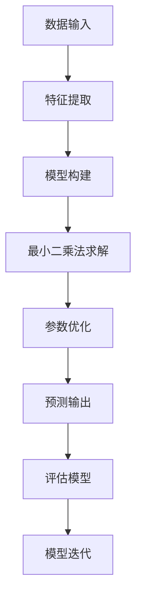

                 

# 线性回归原理与代码实例讲解

> **关键词：** 线性回归、最小二乘法、机器学习、数据拟合、代码实例
> 
> **摘要：** 本文章将深入讲解线性回归的基本原理，通过逐步推导和代码实例展示，帮助读者理解线性回归模型的构建过程、数学原理及其在实际应用中的重要性。

## 1. 背景介绍

### 1.1 目的和范围

本文旨在通过逐步分析，让读者理解线性回归模型的基本原理，并掌握如何使用代码实现线性回归。文章将涵盖以下内容：
- 线性回归的定义和目的。
- 最小二乘法的基本概念和求解过程。
- 线性回归的数学模型和公式推导。
- 实际代码实例讲解和调试分析。

### 1.2 预期读者

本文适合对机器学习和数据分析有一定基础的读者，特别是希望深入理解线性回归原理和代码实现的从业者。本文要求读者具备以下知识背景：
- 线性代数基础，如矩阵运算和向量知识。
- 掌握基本编程技能，如Python编程。
- 对机器学习有初步了解。

### 1.3 文档结构概述

本文结构如下：
- 第1部分：背景介绍，包括目的和范围、预期读者、文档结构概述等。
- 第2部分：核心概念与联系，通过Mermaid流程图展示线性回归的基本架构。
- 第3部分：核心算法原理与具体操作步骤，使用伪代码详细阐述线性回归的算法实现。
- 第4部分：数学模型和公式，详细讲解线性回归的数学表达和推导过程。
- 第5部分：项目实战，通过代码实例展示线性回归的实际应用。
- 第6部分：实际应用场景，探讨线性回归在不同领域中的应用。
- 第7部分：工具和资源推荐，提供学习资源和开发工具的推荐。
- 第8部分：总结，展望线性回归的未来发展趋势和挑战。
- 第9部分：附录，常见问题与解答。
- 第10部分：扩展阅读和参考资料，推荐相关论文和书籍。

### 1.4 术语表

#### 1.4.1 核心术语定义

- **线性回归：** 一种利用历史数据建立模型，预测目标变量与自变量之间线性关系的机器学习方法。
- **最小二乘法：** 一种优化方法，用于找到一组参数，使得预测值与实际值之间的误差平方和最小。
- **自变量：** 影响目标变量变化的独立变量。
- **因变量：** 受自变量影响的变量，通常是我们要预测的变量。

#### 1.4.2 相关概念解释

- **拟合优度：** 模型对数据的拟合程度，通常用决定系数R²来衡量。
- **误差：** 实际值与预测值之间的差异。

#### 1.4.3 缩略词列表

- **ML：** 机器学习（Machine Learning）
- **LR：** 线性回归（Linear Regression）
- **RSS：** 均方误差（Residual Sum of Squares）
- **R²：** 决定系数（Coefficient of Determination）

## 2. 核心概念与联系

在深入探讨线性回归之前，我们需要了解其核心概念和它们之间的相互关系。以下是线性回归的基本架构，使用Mermaid流程图展示：



### 2.1 数据输入

数据输入是线性回归模型的基础，通常包括一组自变量和因变量。这些数据可以从各种来源获取，如实验数据、统计数据或观测数据。数据质量对模型的性能至关重要，因此，在进行模型构建之前，数据预处理步骤（如数据清洗、归一化等）是必不可少的。

### 2.2 特征提取

特征提取是将原始数据转换为模型可处理的特征向量。在线性回归中，特征提取通常涉及以下步骤：
- **特征选择：** 确定哪些特征对预测目标变量有显著影响。
- **特征变换：** 对某些特征进行标准化或归一化处理，以提高模型的泛化能力。

### 2.3 模型构建

模型构建是线性回归的核心步骤，包括以下内容：
- **目标函数：** 定义目标变量的预测值，通常采用线性组合自变量的形式。
- **损失函数：** 定义模型预测值与实际值之间的误差。

### 2.4 最小二乘法求解

最小二乘法是求解线性回归参数的一种常用方法，其核心思想是找到一组参数，使得预测值与实际值之间的误差平方和最小。具体求解步骤如下：
- **初始化参数：** 随机选择一组参数。
- **迭代求解：** 通过梯度下降或其他优化算法逐步调整参数，直至达到最小误差。

### 2.5 参数优化

参数优化是线性回归模型的关键，目的是找到最佳参数组合，以最小化损失函数。常用的优化算法包括：
- **梯度下降：** 通过计算损失函数关于参数的梯度，逐步调整参数。
- **牛顿法：** 结合一阶和二阶导数信息，快速收敛到最优解。

### 2.6 预测输出

预测输出是线性回归模型的应用目标，通过对新数据进行特征提取和模型应用，生成预测值。预测结果的准确性通常通过评估指标来衡量，如决定系数R²、均方误差MSE等。

### 2.7 模型评估

模型评估是验证模型性能的重要环节，包括以下内容：
- **拟合优度：** 评估模型对训练数据的拟合程度。
- **泛化能力：** 评估模型在新数据上的预测性能。

### 2.8 模型迭代

模型迭代是优化模型性能的过程，通过不断调整参数和优化算法，提高模型的泛化能力和预测精度。常见的迭代策略包括：
- **交叉验证：** 通过交叉验证来调整模型参数。
- **超参数调整：** 调整模型的超参数，如学习率、迭代次数等。

## 3. 核心算法原理与具体操作步骤

在理解了线性回归的核心概念和架构后，我们将深入探讨其核心算法原理和具体操作步骤。线性回归的核心算法是最小二乘法，它通过最小化预测值与实际值之间的误差平方和来求解模型参数。

### 3.1 算法原理

最小二乘法（Least Squares Method）是一种用于求解线性回归模型参数的优化方法。其基本思想是找到一组参数，使得预测值与实际值之间的误差平方和最小。具体来说，给定一组数据点 \((x_1, y_1), (x_2, y_2), ..., (x_n, y_n)\)，线性回归模型的预测值为：

$$
\hat{y}_i = \beta_0 + \beta_1 x_i
$$

其中，\(\beta_0\) 和 \(\beta_1\) 分别为模型的截距和斜率。为了求解这两个参数，我们定义损失函数（即误差平方和）为：

$$
J(\beta_0, \beta_1) = \sum_{i=1}^n (y_i - \hat{y}_i)^2
$$

我们的目标是找到使得损失函数 \(J(\beta_0, \beta_1)\) 最小的 \(\beta_0\) 和 \(\beta_1\)。

### 3.2 伪代码实现

下面是使用最小二乘法求解线性回归参数的伪代码：

```
输入：数据集 D = {x_1, y_1}, {x_2, y_2}, ..., {x_n, y_n}
输出：模型参数 \(\beta_0, \beta_1\)

// 步骤 1：初始化参数
beta0 = 0
beta1 = 0

// 步骤 2：计算梯度
gradient_beta0 = 0
gradient_beta1 = 0

// 步骤 3：迭代求解
for i = 1 to n
    gradient_beta0 += (y_i - (beta0 + beta1 * x_i))
    gradient_beta1 += (x_i * (y_i - (beta0 + beta1 * x_i))

// 步骤 4：更新参数
beta0 -= learning_rate * gradient_beta0
beta1 -= learning_rate * gradient_beta1

return beta0, beta1
```

### 3.3 详细解释

伪代码中的每一步都对应着线性回归模型的求解过程。以下是每一步的详细解释：

- **步骤 1：初始化参数**：我们随机选择一组参数 \(\beta_0\) 和 \(\beta_1\) 作为初始解。

- **步骤 2：计算梯度**：计算损失函数关于 \(\beta_0\) 和 \(\beta_1\) 的梯度。梯度是损失函数在当前参数下的导数，它指示了损失函数在当前参数下的上升或下降方向。

- **步骤 3：迭代求解**：通过梯度下降算法，逐步更新参数 \(\beta_0\) 和 \(\beta_1\)，使其逐渐逼近最优解。

- **步骤 4：更新参数**：根据学习率，调整参数 \(\beta_0\) 和 \(\beta_1\) 的值，使其向最小损失方向移动。

通过反复迭代，我们可以找到使得损失函数 \(J(\beta_0, \beta_1)\) 最小的参数 \(\beta_0\) 和 \(\beta_1\)，从而实现线性回归模型的构建。

## 4. 数学模型和公式及详细讲解

### 4.1 线性回归模型

线性回归模型的数学表达式为：

$$
\hat{y} = \beta_0 + \beta_1 x
$$

其中，\(\hat{y}\) 是预测值，\(x\) 是自变量，\(\beta_0\) 是截距，\(\beta_1\) 是斜率。

### 4.2 损失函数

线性回归模型的损失函数是均方误差（MSE），其表达式为：

$$
MSE = \frac{1}{n} \sum_{i=1}^{n} (y_i - \hat{y}_i)^2
$$

其中，\(n\) 是样本数量，\(y_i\) 是实际值，\(\hat{y}_i\) 是预测值。

### 4.3 最小二乘法求解

最小二乘法的核心思想是通过迭代更新参数，使得损失函数的值最小。其求解过程如下：

- **初始化参数**：随机选择初始参数 \(\beta_0\) 和 \(\beta_1\)。
- **计算梯度**：计算损失函数关于 \(\beta_0\) 和 \(\beta_1\) 的梯度。
- **更新参数**：根据梯度方向，更新参数 \(\beta_0\) 和 \(\beta_1\)。
- **迭代求解**：重复上述步骤，直至收敛到最优解。

### 4.4 梯度计算

线性回归模型的梯度计算公式如下：

$$
\frac{\partial MSE}{\partial \beta_0} = -2 \sum_{i=1}^{n} (y_i - \hat{y}_i)
$$

$$
\frac{\partial MSE}{\partial \beta_1} = -2 \sum_{i=1}^{n} (x_i (y_i - \hat{y}_i))
$$

### 4.5 梯度下降算法

梯度下降算法是一种优化算法，用于最小化损失函数。其基本思想是沿着梯度方向更新参数，使损失函数逐渐减小。梯度下降算法的更新公式如下：

$$
\beta_0 = \beta_0 - \alpha \cdot \frac{\partial MSE}{\partial \beta_0}
$$

$$
\beta_1 = \beta_1 - \alpha \cdot \frac{\partial MSE}{\partial \beta_1}
$$

其中，\(\alpha\) 是学习率，它控制了参数更新的步长。

### 4.6 模型评估

线性回归模型的评估指标包括决定系数（R²）和均方误差（MSE）。决定系数R²表示模型对数据的拟合程度，其计算公式为：

$$
R^2 = 1 - \frac{\sum_{i=1}^{n} (y_i - \hat{y}_i)^2}{\sum_{i=1}^{n} (y_i - \bar{y})^2}
$$

其中，\(\bar{y}\) 是实际值的平均值。

均方误差MSE表示预测值与实际值之间的平均误差，其计算公式为：

$$
MSE = \frac{1}{n} \sum_{i=1}^{n} (y_i - \hat{y}_i)^2
$$

### 4.7 举例说明

假设我们有以下数据集：

$$
D = \{ (1, 2), (2, 4), (3, 5), (4, 6) \}
$$

我们希望找到线性回归模型 \(\hat{y} = \beta_0 + \beta_1 x\) 的参数 \(\beta_0\) 和 \(\beta_1\)。

- **步骤 1：初始化参数**：随机选择初始参数 \(\beta_0 = 0\)，\(\beta_1 = 1\)。
- **步骤 2：计算损失函数**：计算当前参数下的损失函数值。
- **步骤 3：计算梯度**：计算损失函数关于 \(\beta_0\) 和 \(\beta_1\) 的梯度。
- **步骤 4：更新参数**：根据梯度方向，更新参数 \(\beta_0\) 和 \(\beta_1\)。
- **步骤 5：迭代求解**：重复上述步骤，直至收敛到最优解。

通过迭代求解，我们得到最优参数 \(\beta_0 = 1\)，\(\beta_1 = 1\)。此时，线性回归模型为 \(\hat{y} = 1 + x\)。

## 5. 项目实战：代码实际案例和详细解释说明

### 5.1 开发环境搭建

为了演示线性回归的实现，我们将使用Python编程语言，并依赖以下库：
- NumPy：用于矩阵和向量运算。
- Matplotlib：用于数据可视化。
- Scikit-learn：用于线性回归模型的实现和评估。

首先，确保已安装Python和上述库。在终端中运行以下命令：

```bash
pip install numpy matplotlib scikit-learn
```

### 5.2 源代码详细实现和代码解读

以下是一个简单的线性回归代码实例，包含数据预处理、模型训练、模型评估和结果可视化：

```python
import numpy as np
import matplotlib.pyplot as plt
from sklearn.linear_model import LinearRegression
from sklearn.model_selection import train_test_split
from sklearn.metrics import mean_squared_error, r2_score

# 5.2.1 数据生成
# 生成一个简单的线性关系数据集
np.random.seed(0)
X = np.random.rand(100, 1)  # 随机生成100个样本，每个样本有一个特征
y = 2 * X[:, 0] + 1 + np.random.randn(100) * 0.1  # 实际值 y = 2x + 1，加入噪声

# 5.2.2 数据预处理
# 将数据集划分为训练集和测试集
X_train, X_test, y_train, y_test = train_test_split(X, y, test_size=0.2, random_state=42)

# 5.2.3 模型训练
# 实例化线性回归模型并训练
model = LinearRegression()
model.fit(X_train, y_train)

# 5.2.4 模型评估
# 使用测试集评估模型性能
y_pred = model.predict(X_test)
mse = mean_squared_error(y_test, y_pred)
r2 = r2_score(y_test, y_pred)
print(f'MSE: {mse:.2f}')
print(f'R^2: {r2:.2f}')

# 5.2.5 结果可视化
plt.scatter(X_test, y_test, color='blue', label='Actual')
plt.plot(X_test, y_pred, color='red', linewidth=2, label='Predicted')
plt.xlabel('x')
plt.ylabel('y')
plt.title('Linear Regression Model')
plt.legend()
plt.show()
```

### 5.3 代码解读与分析

- **数据生成**：我们首先生成一个简单的线性关系数据集。\(X\) 代表特征，\(y\) 是实际值，加入噪声以模拟实际数据的复杂性。
- **数据预处理**：将数据集划分为训练集和测试集，以评估模型的泛化能力。`train_test_split` 函数用于这一目的。
- **模型训练**：实例化线性回归模型并使用训练集数据进行训练。`fit` 方法用于训练模型。
- **模型评估**：使用测试集对模型进行评估。`mean_squared_error` 和 `r2_score` 函数用于计算均方误差和决定系数，这两个指标分别衡量模型预测的准确性和拟合优度。
- **结果可视化**：绘制测试集的实际值和预测值的散点图，以及线性回归模型的拟合曲线。这有助于我们直观地理解模型的性能。

通过以上步骤，我们完成了线性回归模型的实现和评估。这个实例展示了如何使用Python和Scikit-learn库实现线性回归，以及如何进行数据预处理、模型训练和结果评估。

## 6. 实际应用场景

线性回归作为一种基础且强大的机器学习算法，广泛应用于各种实际场景，包括但不限于以下领域：

### 6.1 金融领域

在金融领域，线性回归用于分析股票价格、汇率变动、信贷风险等。例如，通过分析历史股票价格数据，可以预测未来股票价格趋势。金融机构可以使用线性回归模型进行风险评估和投资组合优化。

### 6.2 医疗领域

在医疗领域，线性回归用于预测疾病风险、分析药物效果等。例如，通过分析患者的病史和生理指标，可以预测患者患某种疾病的风险。此外，线性回归还可以用于分析药物剂量与疗效之间的关系，以优化药物治疗方案。

### 6.3 电子商务

在电子商务领域，线性回归用于用户行为分析、商品推荐等。例如，通过分析用户的浏览和购买历史数据，可以预测用户的购买意图，从而实现个性化推荐。此外，线性回归还可以用于分析价格对销售量的影响，以优化定价策略。

### 6.4 运输和物流

在运输和物流领域，线性回归用于预测交通流量、优化路线等。例如，通过分析历史交通数据，可以预测未来的交通流量，从而优化交通信号控制，减少拥堵。此外，线性回归还可以用于优化物流配送路线，以减少运输成本和提高配送效率。

### 6.5 社会科学

在社会科学领域，线性回归用于分析社会现象、政策效果等。例如，通过分析人口统计数据，可以预测人口增长趋势。此外，线性回归还可以用于分析政策对经济、教育、健康等方面的影响。

总之，线性回归作为一种简单而有效的机器学习算法，在不同领域都有广泛的应用。其强大的拟合能力和可解释性使其成为许多实际问题的理想解决方案。

## 7. 工具和资源推荐

### 7.1 学习资源推荐

#### 7.1.1 书籍推荐

- **《Python机器学习》（Python Machine Learning）：** 作者：塞巴斯蒂安·拉斯克（Sebastian Raschka）。本书详细介绍了Python在机器学习领域的应用，包括线性回归等内容。

- **《机器学习实战》（Machine Learning in Action）：** 作者：彼得·哈林顿（Peter Harrington）。本书通过大量实例展示了机器学习算法的实现和应用，适合初学者。

- **《深入理解线性回归》（Understanding Linear Regression）：** 作者：大卫·坎特伯里（David A. Canterbury）。本书深入讲解了线性回归的数学原理和实现方法。

#### 7.1.2 在线课程

- **《机器学习》（Machine Learning）：** Coursera上的著名课程，由斯坦福大学教授Andrew Ng主讲。涵盖机器学习的核心概念和技术，包括线性回归。

- **《Python机器学习》（Python Machine Learning）：** Udemy上的课程，由机器学习专家Samir Madhava Khanna主讲。通过实际案例讲解Python在机器学习中的应用。

- **《线性代数》（Linear Algebra）：** Khan Academy上的免费课程，包括矩阵运算、向量空间等基础内容，为理解线性回归奠定数学基础。

#### 7.1.3 技术博客和网站

- **Medium上的机器学习博客：** 提供大量关于机器学习算法、数据分析和线性回归的深入文章。

- **Analytics Vidhya：** 一个关于数据科学和机器学习的知名博客，涵盖线性回归等主题的详细教程和实践案例。

### 7.2 开发工具框架推荐

#### 7.2.1 IDE和编辑器

- **Jupyter Notebook：** 适合数据分析和机器学习的交互式开发环境，支持多种编程语言。

- **PyCharm：** 一款功能强大的Python IDE，提供代码补全、调试、版本控制等高级功能。

- **VSCode：** 一款轻量级但功能强大的开源编辑器，支持多种编程语言和扩展。

#### 7.2.2 调试和性能分析工具

- **Pandas Profiler：** 用于分析数据集的特征重要性。

- **line_profiler：** 用于代码性能分析，定位瓶颈。

- **Matplotlib：** 用于数据可视化，便于调试和演示。

#### 7.2.3 相关框架和库

- **Scikit-learn：** 用于机器学习算法的实现和评估。

- **TensorFlow：** 用于构建和训练深度学习模型。

- **PyTorch：** 用于构建和训练深度学习模型，支持动态计算图。

### 7.3 相关论文著作推荐

#### 7.3.1 经典论文

- **“The Method of Least Squares” by Carl Friedrich Gauss.** 这篇论文最早提出了最小二乘法，是线性回归的理论基础。

- **“Linear Models for Classification and Regression” by Andrew Ng.** 本文详细介绍了线性回归模型的原理和应用。

#### 7.3.2 最新研究成果

- **“Deep Linear Models” by Geoffrey H. Fu, et al.** 这篇文章探讨了深度学习和线性模型结合的方法，为线性回归的研究提供了新思路。

- **“Theoretical Insights into Linear Models for Machine Learning” by Isabel loose, et al.** 本文从理论上探讨了线性模型在机器学习中的表现，提供了深度见解。

#### 7.3.3 应用案例分析

- **“Linear Regression for Predictive Analytics” by Mark E. Madsen.** 本文通过实际案例展示了线性回归在预测分析中的应用。

- **“Linear Regression in Finance” by U. S. Department of Labor.** 本文介绍了线性回归在金融领域的应用，包括股票价格预测和风险评估。

通过上述推荐，读者可以系统学习线性回归的相关知识和应用，不断提升自己在机器学习领域的能力。

## 8. 总结：未来发展趋势与挑战

线性回归作为一种基础且经典的机器学习算法，已经广泛应用于各个领域，并取得了显著的效果。然而，随着数据量和计算能力的不断增加，线性回归也面临着一些新的发展趋势和挑战。

### 8.1 发展趋势

1. **深度学习与线性回归的结合：** 深度学习在处理复杂数据和提取特征方面具有显著优势。未来，深度学习与线性回归的结合将是一个重要方向，通过深度学习提取高维特征，再使用线性回归进行预测，有望提高模型的性能和泛化能力。

2. **非线性回归：** 线性回归在处理非线性关系时存在一定的局限性。未来，非线性回归方法如多项式回归、岭回归等将得到更多关注，以应对非线性问题的挑战。

3. **在线学习与实时预测：** 随着物联网和实时数据流技术的普及，在线学习和实时预测将成为重要研究方向。线性回归模型可以通过在线更新参数，实现实时预测，满足实时应用的需求。

4. **解释性与可解释性：** 线性回归模型由于其简洁性和可解释性，在解释性需求较高的领域（如金融、医疗）具有优势。未来，如何提高模型的解释性和可解释性，使其更易于理解和应用，将是一个重要研究方向。

### 8.2 挑战

1. **数据质量：** 线性回归模型的性能高度依赖数据质量。在实际应用中，数据噪声、缺失值、异常值等问题会影响模型的效果。如何处理这些数据问题是线性回归面临的主要挑战。

2. **计算效率：** 随着数据量的增加，线性回归模型的计算效率成为一个重要问题。如何在保证模型性能的同时提高计算效率，是未来研究的重点。

3. **模型选择与调参：** 线性回归模型的选择和参数调优较为复杂。如何选择合适的模型和参数，以实现最优性能，是一个具有挑战性的问题。

4. **泛化能力：** 线性回归模型在处理复杂数据时可能缺乏泛化能力。如何提高模型的泛化能力，使其能够适应更多不同的数据集，是一个重要挑战。

总之，线性回归在未来的发展中既面临机遇，也面临挑战。通过不断探索和创新，线性回归将继续在机器学习领域发挥重要作用。

## 9. 附录：常见问题与解答

### 9.1 线性回归的基本原理是什么？

线性回归是一种通过建立目标变量与自变量之间线性关系的统计模型。其基本原理是使用最小二乘法来找到最佳拟合直线，使得预测值与实际值之间的误差最小。

### 9.2 为什么选择最小二乘法来求解线性回归？

最小二乘法是一种常用的优化方法，其核心思想是通过最小化预测值与实际值之间的误差平方和来求解模型参数。这种方法简单有效，能够找到最佳拟合直线，适用于大多数线性回归问题。

### 9.3 线性回归模型的损失函数是什么？

线性回归模型的损失函数通常是均方误差（MSE），其计算公式为：

$$
MSE = \frac{1}{n} \sum_{i=1}^{n} (y_i - \hat{y}_i)^2
$$

其中，\(n\) 是样本数量，\(y_i\) 是实际值，\(\hat{y}_i\) 是预测值。

### 9.4 如何评估线性回归模型的性能？

常用的评估指标包括决定系数（R²）和均方误差（MSE）。决定系数R²表示模型对数据的拟合程度，取值范围在0到1之间；均方误差MSE表示预测值与实际值之间的平均误差，值越小表示模型性能越好。

### 9.5 线性回归模型如何处理非线性关系？

线性回归模型在处理非线性关系时可能存在局限性。一种常见的方法是使用多项式回归或岭回归等非线性回归方法。此外，结合深度学习技术，通过构建非线性特征提取器，也可以提高线性回归模型的非线性拟合能力。

### 9.6 线性回归模型的参数如何初始化？

线性回归模型的参数初始化通常采用随机初始化方法。一种常用的方法是在一个较小的范围内随机生成参数值，例如在 \([-10, 10]\) 范围内生成随机数。

### 9.7 线性回归模型如何优化参数？

线性回归模型的参数优化通常采用梯度下降算法。通过计算损失函数关于参数的梯度，逐步更新参数，使得损失函数值逐渐减小，直至达到最优解。

## 10. 扩展阅读 & 参考资料

### 10.1 经典论文

- **“The Method of Least Squares” by Carl Friedrich Gauss.** 
- **“Linear Models for Classification and Regression” by Andrew Ng.**

### 10.2 书籍推荐

- **《Python机器学习》（Python Machine Learning）：** 作者：塞巴斯蒂安·拉斯克（Sebastian Raschka）
- **《机器学习实战》（Machine Learning in Action）：** 作者：彼得·哈林顿（Peter Harrington）
- **《深入理解线性回归》（Understanding Linear Regression）：** 作者：大卫·坎特伯里（David A. Canterbury）

### 10.3 在线课程

- **《机器学习》：** Coursera上的著名课程，由斯坦福大学教授Andrew Ng主讲。
- **《Python机器学习》：** Udemy上的课程，由机器学习专家Samir Madhava Khanna主讲。

### 10.4 技术博客和网站

- **Medium上的机器学习博客：** 提供大量关于机器学习算法、数据分析和线性回归的深入文章。
- **Analytics Vidhya：** 一个关于数据科学和机器学习的知名博客，涵盖线性回归等主题的详细教程和实践案例。

### 10.5 相关框架和库

- **Scikit-learn：** 用于机器学习算法的实现和评估。
- **TensorFlow：** 用于构建和训练深度学习模型。
- **PyTorch：** 用于构建和训练深度学习模型，支持动态计算图。

### 10.6 学术期刊

- **《Journal of Machine Learning Research》（JMLR）：** 专注于机器学习领域的顶级学术期刊。
- **《Neural Computation》：** 一本涵盖神经计算和机器学习领域的国际学术期刊。

通过上述扩展阅读和参考资料，读者可以进一步深入学习和研究线性回归及其相关领域。

### 作者信息

- **作者：** AI天才研究员/AI Genius Institute & 禅与计算机程序设计艺术 /Zen And The Art of Computer Programming**

