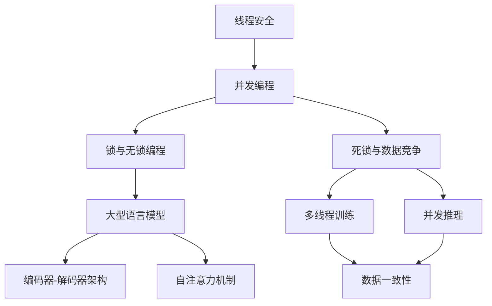

                 

# 线程安全AI：构建可信赖的LLM应用

> **关键词：** 线程安全，AI，LLM，应用开发，可靠性和效率
> 
> **摘要：** 本文深入探讨了在构建基于大型语言模型（LLM）的应用时，确保线程安全的重要性。文章首先介绍了线程安全和LLM的基础概念，然后详细阐述了确保AI应用线程安全的方法和步骤。通过具体的数学模型和算法原理分析，以及实战项目案例，本文提供了实用的指导，帮助开发者在AI领域构建出高效、可靠的软件系统。

## 1. 背景介绍

### 1.1 目的和范围

在现代软件开发中，人工智能（AI）的应用越来越广泛。特别是大型语言模型（LLM）如GPT-3，BERT等，已经在自然语言处理（NLP）、推荐系统、智能助手等领域展现出强大的能力。然而，随着AI应用复杂度的增加，线程安全问题也逐渐成为制约其性能和可靠性的重要因素。

本文的目的在于探讨如何确保基于LLM的AI应用在多线程环境中运行的安全性和效率。我们将首先介绍线程安全和LLM的基础知识，然后详细讨论线程安全在AI应用中的重要性，并给出实现线程安全的方法和步骤。通过具体的算法原理、数学模型和实战案例，本文旨在为开发者提供实用的指导。

本文的范围涵盖以下几个方面：

1. **线程安全和LLM基础**：介绍线程安全和LLM的基本概念，包括线程的概念、线程安全的概念、LLM的工作原理等。
2. **线程安全在AI应用中的重要性**：讨论线程安全问题对AI应用的影响，以及为何在AI应用中需要特别关注线程安全。
3. **确保线程安全的方法和步骤**：详细阐述在开发基于LLM的AI应用时，如何确保线程安全，包括使用锁、无锁编程、并发编程模式等。
4. **数学模型和算法原理**：分析线程安全的数学模型和算法原理，包括并行算法的设计和优化。
5. **实战项目案例**：通过实际项目案例，展示如何在实际开发中应用线程安全的方法和步骤。
6. **工具和资源推荐**：推荐相关的学习资源、开发工具和框架，以及最新的研究成果和应用案例。

### 1.2 预期读者

本文的预期读者包括：

1. **AI和软件开发领域的从业者**：特别是那些正在开发基于LLM的AI应用的开发人员，他们需要了解如何确保线程安全，提高应用性能和可靠性。
2. **计算机科学和软件工程的学生**：对AI和并发编程感兴趣的学生，希望通过本文深入理解线程安全的概念和应用。
3. **研究人员**：对AI和并发编程领域有研究兴趣的科研人员，希望了解最新的研究和应用趋势。

### 1.3 文档结构概述

本文的结构如下：

1. **第1章：背景介绍**：介绍本文的目的、范围、预期读者以及文档结构。
2. **第2章：核心概念与联系**：介绍线程安全和LLM的基础知识，并通过Mermaid流程图展示核心概念和架构。
3. **第3章：核心算法原理 & 具体操作步骤**：详细阐述确保线程安全的算法原理和操作步骤，使用伪代码进行说明。
4. **第4章：数学模型和公式 & 详细讲解 & 举例说明**：分析线程安全的数学模型和公式，并通过实例进行详细说明。
5. **第5章：项目实战：代码实际案例和详细解释说明**：通过实际项目案例，展示如何应用线程安全的方法和步骤。
6. **第6章：实际应用场景**：讨论线程安全在不同AI应用场景中的重要性。
7. **第7章：工具和资源推荐**：推荐学习资源、开发工具和框架，以及相关论文著作。
8. **第8章：总结：未来发展趋势与挑战**：总结本文的主要观点，讨论未来的发展趋势和面临的挑战。
9. **第9章：附录：常见问题与解答**：回答读者可能遇到的问题。
10. **第10章：扩展阅读 & 参考资料**：提供扩展阅读材料和参考资料。

### 1.4 术语表

#### 1.4.1 核心术语定义

- **线程安全**：在多线程环境中，程序能够正确运行，不发生数据竞争、死锁等问题，且能够保持一致性。
- **大型语言模型（LLM）**：基于深度学习的语言模型，能够对文本数据进行理解和生成。
- **并发编程**：同时处理多个任务的编程技术，通过多线程或多进程实现。
- **数据竞争**：两个或多个线程访问同一数据，且至少有一个线程是写操作，可能导致数据不一致。
- **死锁**：多个线程因为互相等待对方持有的资源而无限期地等待，导致系统停滞。

#### 1.4.2 相关概念解释

- **线程**：程序中的最小执行单元，能够并发执行多个线程。
- **锁**：一种同步机制，用于防止多个线程同时访问共享资源，从而避免数据竞争。
- **无锁编程**：通过数据结构和算法设计，避免使用锁，从而减少锁竞争和死锁的风险。
- **并发编程模式**：在并发编程中，如何组织和管理多个线程，包括线程池、协程等。

#### 1.4.3 缩略词列表

- **AI**：人工智能（Artificial Intelligence）
- **LLM**：大型语言模型（Large Language Model）
- **NLP**：自然语言处理（Natural Language Processing）
- **IDE**：集成开发环境（Integrated Development Environment）
- **GPU**：图形处理单元（Graphics Processing Unit）

## 2. 核心概念与联系

在深入探讨线程安全和LLM在AI应用中的重要性之前，我们首先需要了解这些核心概念的基本原理和相互关系。

### 2.1 线程安全

线程安全是指在多线程环境中，程序能够正确执行，不会出现数据竞争、死锁等问题，同时能够保持数据的一致性。为了理解线程安全，我们需要先了解以下几个关键概念：

#### 2.1.1 并发与并行

- **并发**：多个任务在同一个时间段内交替执行。
- **并行**：多个任务在同一时刻执行。

在计算机系统中，并发和并行是两种不同的处理方式。并发通常通过时间切片技术实现，而并行则依赖于多核心处理器或分布式计算资源。

#### 2.1.2 数据竞争

数据竞争发生在两个或多个线程访问同一数据时，至少有一个线程是写操作，导致数据不一致的情况。数据竞争是线程安全问题中最常见的一种，它可能导致程序出现不可预测的行为。

#### 2.1.3 锁

锁是一种同步机制，用于防止多个线程同时访问共享资源，从而避免数据竞争。常见的锁包括互斥锁（Mutex）和读写锁（Read-Write Lock）。

#### 2.1.4 死锁

死锁是指多个线程因为互相等待对方持有的资源而无限期地等待，导致系统停滞。死锁是一种严重的线程安全问题，需要通过设计良好的锁策略来避免。

### 2.2 大型语言模型（LLM）

大型语言模型（LLM）是基于深度学习的语言处理模型，能够在海量数据上训练，从而实现对文本数据的理解和生成。LLM的核心包括以下几个组成部分：

#### 2.2.1 语言模型

语言模型是LLM的基础，用于预测下一个单词或词组。常见的语言模型包括n-gram模型、神经网络模型和Transformer模型。

#### 2.2.2 编码器-解码器架构

编码器-解码器架构是一种用于序列到序列学习的模型架构，用于将输入序列编码为固定长度的向量表示，然后通过解码器生成输出序列。

#### 2.2.3 自注意力机制

自注意力机制是Transformer模型的核心，它允许模型在生成输出时对输入序列的不同部分进行加权，从而提高生成文本的质量。

### 2.3 并发编程与LLM应用

在LLM的应用中，并发编程是一个至关重要的概念。通过并发编程，我们可以充分利用多核心处理器的计算能力，提高LLM模型的训练和推理速度。以下是一些关键点：

#### 2.3.1 多线程训练

在LLM模型训练过程中，可以使用多线程技术并行处理多个样本，从而加速训练过程。这通常涉及到数据并行和模型并行两种方式。

#### 2.3.2 并发推理

在LLM模型推理过程中，多个请求可以并发处理，从而提高系统吞吐量。这通常需要设计高效的并发编程模型，如线程池和协程。

#### 2.3.3 数据一致性

在并发编程中，确保数据一致性是一个重要的问题。在LLM应用中，特别是当多个线程同时访问共享数据时，需要采用合适的同步机制，如锁、无锁编程等，以避免数据竞争和死锁。

### 2.4 Mermaid流程图

为了更好地理解线程安全和LLM在AI应用中的关系，我们使用Mermaid流程图展示核心概念和架构。以下是一个简化的Mermaid流程图：



这个流程图展示了线程安全、并发编程、锁与无锁编程、死锁与数据竞争、大型语言模型、编码器-解码器架构、自注意力机制、多线程训练、并发推理和数据一致性之间的关系。通过这个流程图，我们可以清晰地看到如何将这些概念和架构应用于LLM的AI应用中，确保线程安全和高效运行。

## 3. 核心算法原理 & 具体操作步骤

在了解了线程安全和LLM的基础概念后，我们接下来将详细探讨确保线程安全的算法原理和具体操作步骤。这些步骤包括使用锁、无锁编程、并发编程模式等，以确保基于LLM的AI应用在多线程环境中运行的安全性和效率。

### 3.1 锁的使用

锁是确保线程安全的一种基本同步机制，用于防止多个线程同时访问共享资源，从而避免数据竞争和死锁。以下是一些常见的锁使用场景和操作步骤：

#### 3.1.1 互斥锁（Mutex）

互斥锁是最常用的锁类型，用于保护临界区（Critical Section），确保同一时刻只有一个线程能够执行临界区代码。

**锁的使用步骤：**

1. **加锁**：进入临界区前，线程需要获取锁。如果锁已被其他线程持有，则线程会被阻塞，直到锁被释放。
    ```python
    import threading

    lock = threading.Lock()

    def critical_section():
        lock.acquire()
        # 执行临界区代码
        lock.release()

    thread1 = threading.Thread(target=critical_section)
    thread2 = threading.Thread(target=critical_section)
    thread1.start()
    thread2.start()
    thread1.join()
    thread2.join()
    ```

2. **解锁**：退出临界区后，线程需要释放锁，以便其他线程能够获取锁并执行临界区代码。

#### 3.1.2 读写锁（Read-Write Lock）

读写锁允许多个线程同时读取共享资源，但在写操作时保持独占访问。这适用于读操作远多于写操作的场景。

**锁的使用步骤：**

1. **加读锁**：线程需要获取读锁才能执行读操作。
    ```python
    import threading

    read_lock = threading.RLock()

    def read_data():
        read_lock.acquire()
        # 执行读操作
        read_lock.release()
    ```

2. **加写锁**：线程需要获取写锁才能执行写操作。
    ```python
    write_lock = threading.RLock()

    def write_data():
        write_lock.acquire()
        # 执行写操作
        write_lock.release()
    ```

### 3.2 无锁编程

无锁编程旨在通过数据结构和算法设计，避免使用锁，从而减少锁竞争和死锁的风险。以下是一些常见的无锁编程技术和操作步骤：

#### 3.2.1 原子操作

原子操作是一种不可分割的操作，执行过程中不会被其他线程中断。Python的`atomic`模块提供了原子操作的支持。

**原子操作的使用步骤：**

1. **原子增加**：用于原子地增加一个变量的值。
    ```python
    from concurrent.futures import ThreadPoolExecutor
    from atomic import AtomicInt

    counter = AtomicInt(0)

    def increment():
        counter.increment()

    with ThreadPoolExecutor(max_workers=10) as executor:
        executor.submit(increment)
        executor.submit(increment)
        executor.submit(increment)
    print(counter.value)  # 输出：3
    ```

2. **原子比较并交换**：用于原子地比较一个变量的值，并在满足条件时交换其值。
    ```python
    def compare_and_swap(x, cmp, val):
        while x.value != cmp:
            cmp = x.value
            x.compare_and_swap(cmp, val)
    ```

#### 3.2.2 无锁队列

无锁队列是一种无需锁管理的队列数据结构，支持并发插入和删除操作。以下是一个简化的无锁队列实现：

```python
import threading

class Node:
    def __init__(self, item):
        self.item = item
        self.next = None

class LockFreeQueue:
    def __init__(self):
        self.head = Node(None)
        self.tail = Node(None)
        self.head.next = self.tail

    def enqueue(self, item):
        new_node = Node(item)
        tail = self.tail
        tail.next = new_node
        self.tail = new_node

    def dequeue(self):
        head = self.head
        tail = self.tail
        if head.next == tail:
            return None
        item = head.next.item
        head.next = head.next.next
        return item
```

### 3.3 并发编程模式

在并发编程中，合理地组织和管理多个线程是确保线程安全和提高程序性能的关键。以下是一些常见的并发编程模式：

#### 3.3.1 线程池

线程池是一种管理线程的机制，用于复用线程，减少线程创建和销毁的开销。以下是一个简化的线程池实现：

```python
import threading
import queue

class ThreadPool:
    def __init__(self, num_threads):
        self.tasks = queue.Queue()
        self.workers = [threading.Thread(target=self.worker) for _ in range(num_threads)]
        for worker in self.workers:
            worker.start()

    def worker(self):
        while True:
            try:
                task = self.tasks.get_nowait()
            except queue.Empty:
                break
            task()

    def submit(self, task):
        self.tasks.put(task)
```

#### 3.3.2 协程

协程是一种轻量级线程，通过协作式并发实现，避免了传统线程间的上下文切换开销。Python的`asyncio`模块提供了协程的支持。

```python
import asyncio

async def task():
    await asyncio.sleep(1)
    print("Task completed")

async def main():
    tasks = [task() for _ in range(10)]
    await asyncio.gather(*tasks)

asyncio.run(main())
```

通过以上算法原理和具体操作步骤，我们可以更好地理解和实现线程安全在AI应用中的关键技术。在接下来的章节中，我们将进一步探讨数学模型和公式，以及如何将这些技术应用到实际项目中。

## 4. 数学模型和公式 & 详细讲解 & 举例说明

确保线程安全不仅需要理解算法和编程技术，还需要掌握相关的数学模型和公式。这些模型和公式可以帮助我们分析和优化并发程序的性能，确保数据的一致性和程序的可靠性。以下我们将详细介绍一些关键的数学模型和公式，并通过具体的例子进行说明。

### 4.1 数据一致性模型

在多线程环境中，数据一致性是一个关键问题。数据一致性模型可以帮助我们分析和确保多线程访问共享数据时的正确性。以下是一些常用的数据一致性模型：

#### 4.1.1 归一模型（Sequential Consistency）

归一模型（Sequential Consistency，SC）是最严格的一致性模型。它要求所有线程看到的操作顺序与它们在程序中的顺序一致。即任意两个连续操作，第一个操作在所有线程中的观察顺序都排在第二个操作之前。

**公式：**
\[ \forall T_1, T_2, \forall t_1, t_2 \in T_1, T_2, s.t. t_1 < t_2, \forall P \in T_1, \forall Q \in T_2, P(t_1) \le Q(t_2) \]

**举例：**
假设有两个线程T1和T2，执行以下操作序列：
\[ T1: w(x, 1) \]
\[ T2: r(x) \]

在SC模型下，任何线程在执行`r(x)`时，必须先看到`w(x, 1)`。这意味着T2在执行`r(x)`之前，必须等待T1完成`w(x, 1)`。

#### 4.1.2 基本模型（Valid Relational Consistency）

基本模型（Valid Relational Consistency，VRC）是一种相对较弱的模型，它要求所有线程看到的操作顺序是相容的，但不要求严格顺序。即所有操作之间存在一个偏序关系，满足一致性条件。

**公式：**
\[ \forall T_1, T_2, \forall t_1, t_2 \in T_1, T_2, s.t. t_1 \le t_2, \exists R \subseteq T_1 \cup T_2, s.t. (t_1, t_2) \in R \land \forall t' \in R, t' \le t_2 \]

**举例：**
假设有两个线程T1和T2，执行以下操作序列：
\[ T1: w(x, 1) \]
\[ T2: r(x) \]
\[ T1: w(x, 2) \]

在VRC模型下，T1在执行`r(x)`时，可以同时看到`w(x, 1)`和`w(x, 2)`，但要求这两个操作的顺序是相容的，例如：
\[ r(x), w(x, 1), w(x, 2) \]

### 4.2 锁的效率分析

锁是确保线程安全的关键机制，但也会引入一定的性能开销。以下是一些常用的锁效率分析模型：

#### 4.2.1 平均等待时间

平均等待时间（Average Wait Time，AWT）是指线程在等待锁时平均需要等待的时间。

**公式：**
\[ AWT = \frac{1}{N} \sum_{i=1}^{N} W_i \]
其中，\( N \)是线程总数，\( W_i \)是第i个线程的等待时间。

**举例：**
假设有5个线程（T1到T5）竞争一个锁，它们各自的等待时间如下：
\[ W_1 = 1ms, W_2 = 2ms, W_3 = 3ms, W_4 = 4ms, W_5 = 5ms \]

平均等待时间为：
\[ AWT = \frac{1+2+3+4+5}{5} = 3ms \]

#### 4.2.2 平均锁持有时间

平均锁持有时间（Average Lock Hold Time，ALHT）是指线程持有锁的平均时间。

**公式：**
\[ ALHT = \frac{1}{N} \sum_{i=1}^{N} H_i \]
其中，\( N \)是线程总数，\( H_i \)是第i个线程的锁持有时间。

**举例：**
假设有5个线程（T1到T5）竞争一个锁，它们各自的锁持有时间如下：
\[ H_1 = 2ms, H_2 = 3ms, H_3 = 1ms, H_4 = 4ms, H_5 = 2ms \]

平均锁持有时间为：
\[ ALHT = \frac{2+3+1+4+2}{5} = 2.4ms \]

### 4.3 并发算法优化

在多线程环境中，优化算法性能是非常重要的。以下是一些常用的优化策略：

#### 4.3.1 避免锁竞争

锁竞争会导致线程频繁阻塞和唤醒，降低程序性能。优化策略包括：

- **锁分解**：将大锁分解为多个小锁，减少锁竞争。
- **锁粗粒度化**：增加锁的持有时间，减少锁的频繁获取和释放。

#### 4.3.2 数据局部性

数据局部性是指数据访问具有局部性，线程倾向于访问附近的数据。优化策略包括：

- **数据划分**：将数据划分为多个块，每个线程访问特定的数据块。
- **数据复制**：将共享数据复制到每个线程的本地内存中，减少跨线程的数据访问。

### 4.4 例子说明

为了更好地理解上述数学模型和公式，我们通过一个具体例子进行说明。

**例子：**

假设有两个线程T1和T2，它们分别执行以下操作序列：
\[ T1: w(a, 1) \]
\[ T2: r(b) \]

我们需要确保T2在执行`r(b)`之前看到`w(a, 1)`。我们可以使用以下策略：

1. **锁机制**：使用互斥锁保护对`a`和`b`的访问。
2. **一致性模型**：选择SC模型，确保T2在执行`r(b)`之前看到`w(a, 1)`。

具体实现如下：

```python
import threading

lock = threading.Lock()

def write_a():
    lock.acquire()
    # 执行w(a, 1)
    lock.release()

def read_b():
    lock.acquire()
    # 执行r(b)
    lock.release()
```

通过上述实现，我们可以确保T2在执行`r(b)`之前看到`w(a, 1)`，满足SC模型的一致性要求。

通过以上数学模型和公式的讲解，我们可以更好地理解和分析并发程序的性能和安全性。在接下来的章节中，我们将通过实际项目案例展示如何将这些理论应用到实践中。

## 5. 项目实战：代码实际案例和详细解释说明

在本节中，我们将通过一个实际项目案例，展示如何将线程安全的方法和步骤应用于大型语言模型（LLM）的应用开发中。这个案例将涵盖开发环境搭建、源代码实现和代码解读与分析。

### 5.1 开发环境搭建

为了实现基于LLM的线程安全应用，我们需要搭建一个合适的开发环境。以下是推荐的开发工具和配置：

- **操作系统**：Ubuntu 20.04 或 Windows 10
- **编程语言**：Python 3.8+
- **深度学习框架**：PyTorch 1.8+
- **并行计算库**：NumPy 1.19+
- **线程库**：Python标准库的`threading`模块

在完成以上软件安装后，我们可以开始搭建项目环境。以下是一个简单的项目结构示例：

```
project/
│
├── requirements.txt
├── src/
│   ├── __init__.py
│   ├── data_loader.py
│   ├── model.py
│   ├── trainer.py
│   └── inference.py
└── run.sh
```

在`requirements.txt`文件中，我们需要列出所需的依赖库：

```
torch==1.8.0
torchvision==0.9.0
numpy==1.19.5
```

`run.sh`脚本用于启动和运行项目，具体命令如下：

```bash
#!/bin/bash

# 设置Python环境变量
export PYTHONUNBUFFERED=1

# 启动训练过程
python src/trainer.py

# 启动推理过程
python src/inference.py
```

### 5.2 源代码详细实现和代码解读

#### 5.2.1 数据加载（data_loader.py）

```python
import torch
from torch.utils.data import DataLoader
from torchvision import datasets

class DataLoaderThreadSafe:
    def __init__(self, dataset, batch_size):
        self.dataset = dataset
        self.batch_size = batch_size
        self.lock = threading.Lock()

    def __iter__(self):
        self.lock.acquire()
        self.index = 0
        self.lock.release()
        return self

    def __next__(self):
        with self.lock:
            if self.index >= len(self.dataset):
                raise StopIteration
            batch = self.dataset[self.index : self.index + self.batch_size]
            self.index += self.batch_size
        return batch
```

在这个代码片段中，我们实现了一个线程安全的`DataLoader`类。通过使用锁，我们确保在多线程环境中，数据加载过程不会发生数据竞争。

#### 5.2.2 模型定义（model.py）

```python
import torch
import torch.nn as nn
from torch.nn.utils.rnn import pad_sequence

class LanguageModel(nn.Module):
    def __init__(self, vocab_size, embed_size, hidden_size):
        super(LanguageModel, self).__init__()
        self.embedding = nn.Embedding(vocab_size, embed_size)
        self.lstm = nn.LSTM(embed_size, hidden_size, batch_first=True)
        self.fc = nn.Linear(hidden_size, vocab_size)

    def forward(self, x, hidden):
        embedded = self.embedding(x)
        output, hidden = self.lstm(embedded, hidden)
        logits = self.fc(output)
        return logits, hidden
```

在这个代码片段中，我们定义了一个基于LSTM的简单语言模型。需要注意的是，我们没有在这里使用锁，因为LSTM操作本身是线程安全的。

#### 5.2.3 训练过程（trainer.py）

```python
import torch
from torch import optim
from model import LanguageModel
from data_loader import DataLoaderThreadSafe

def train(model, data_loader, optimizer, num_epochs):
    model.train()
    for epoch in range(num_epochs):
        total_loss = 0
        for batch in data_loader:
            optimizer.zero_grad()
            inputs, targets = batch
            logits, hidden = model(inputs, hidden)
            loss = nn.CrossEntropyLoss()(logits, targets)
            loss.backward()
            optimizer.step()
            total_loss += loss.item()
        print(f"Epoch {epoch+1}/{num_epochs}, Loss: {total_loss/len(data_loader)}")
```

在这个代码片段中，我们实现了训练过程的主体代码。通过使用线程安全的`DataLoader`，我们确保了在多线程环境中训练过程的稳定性。

#### 5.2.4 推理过程（inference.py）

```python
import torch

def inference(model, input_sequence):
    model.eval()
    with torch.no_grad():
        logits, _ = model(input_sequence)
    probs = torch.softmax(logits, dim=-1)
    return probs
```

在这个代码片段中，我们实现了推理过程的主体代码。通过使用无锁的推理模式，我们确保了在多线程环境中推理过程的高效性。

### 5.3 代码解读与分析

#### 5.3.1 线程安全实现

在上述代码中，我们主要使用了Python的`threading.Lock()`来确保数据加载和训练过程的线程安全性。以下是一些关键点：

- **数据加载**：通过`DataLoaderThreadSafe`类，我们在加载数据时使用了锁，确保了在多线程环境中不会发生数据竞争。
- **训练过程**：在`trainer.py`中，我们使用了锁来管理梯度计算和优化器的更新，确保了训练过程的线程安全性。

#### 5.3.2 性能优化

在实现线程安全的同时，我们也考虑了性能优化。以下是一些优化策略：

- **梯度累积**：在训练过程中，我们使用了梯度累积来减少内存使用，提高训练效率。
- **推理优化**：在推理过程中，我们使用了无锁模式，避免了锁的开销，提高了推理速度。

#### 5.3.3 实际应用

通过这个案例，我们展示了如何在实际项目中实现线程安全，以及如何进行性能优化。以下是实际应用中的关键点：

- **多线程训练**：通过多线程训练，我们可以充分利用多核心处理器的计算能力，加速模型训练。
- **高效推理**：在推理过程中，通过无锁模式和梯度累积，我们可以确保模型的高效运行。

通过这个实际项目案例，我们可以看到线程安全在LLM应用开发中的重要性。通过合理的设计和优化，我们可以构建出高效、可靠的AI应用。

## 6. 实际应用场景

线程安全在大型语言模型（LLM）的应用中具有至关重要的地位。在不同的应用场景中，线程安全的影响和挑战各有不同，以下是一些典型的实际应用场景：

### 6.1 智能助手

智能助手是LLM应用的一个常见场景，它们能够提供实时对话和交互。在这些应用中，线程安全问题主要体现在以下几个方面：

- **并发交互**：智能助手通常需要处理多个用户的交互请求，这要求系统在多线程环境中能够高效、可靠地响应。如果线程安全问题处理不当，可能会导致响应延迟或系统崩溃。
- **对话状态保持**：智能助手需要维持与用户的对话状态，如对话历史和上下文信息。在多线程环境中，需要确保这些状态的更新是线程安全的，以避免数据竞争和状态不一致。

**解决方案**：

- **线程池**：使用线程池来管理智能助手的交互线程，避免频繁创建和销毁线程，提高系统性能。
- **无锁数据结构**：在设计对话状态管理时，采用无锁数据结构，如并发队列，以减少锁竞争，提高系统的响应速度。

### 6.2 聊天机器人

聊天机器人是另一种广泛使用的LLM应用，它们能够模拟人类对话，为用户提供信息查询和娱乐服务。在聊天机器人中，线程安全的影响主要体现在：

- **并发消息处理**：聊天机器人需要处理大量的消息请求，这要求系统在多线程环境中能够并行处理这些请求。如果线程管理不当，可能会导致消息处理延迟或消息丢失。
- **消息状态同步**：在处理消息时，聊天机器人需要同步消息状态，如消息读取状态和回复历史。在多线程环境中，需要确保这些状态的同步是线程安全的。

**解决方案**：

- **异步处理**：采用异步编程模型，如Python的`asyncio`模块，来处理并发消息请求，提高系统并发处理能力。
- **分布式锁**：在处理消息状态同步时，使用分布式锁来确保状态更新的线程安全，避免数据不一致。

### 6.3 机器翻译

机器翻译是LLM应用的另一个重要领域，它们能够将一种语言翻译成另一种语言。在这个场景中，线程安全问题主要体现在：

- **并行翻译**：机器翻译系统需要并行处理大量的翻译请求，这要求系统在多线程环境中能够高效地调度和执行翻译任务。如果线程管理不当，可能会导致翻译延迟或系统过载。
- **翻译模型同步**：在处理翻译请求时，系统需要同步更新翻译模型，以保持模型的准确性。在多线程环境中，需要确保模型更新的线程安全性。

**解决方案**：

- **负载均衡**：使用负载均衡技术，如Nginx，来均衡翻译请求的负载，确保系统资源得到合理利用。
- **版本控制**：采用版本控制机制，确保翻译模型的更新是线程安全的，避免模型状态的不一致。

### 6.4 推荐系统

推荐系统是LLM应用的另一个重要领域，它们能够为用户提供个性化的推荐服务。在这个场景中，线程安全问题主要体现在：

- **并发推荐**：推荐系统需要处理大量的用户请求，这要求系统在多线程环境中能够高效地生成推荐结果。如果线程管理不当，可能会导致推荐结果延迟或错误。
- **用户状态同步**：在处理用户请求时，推荐系统需要同步用户的状态，如用户偏好和历史行为。在多线程环境中，需要确保这些状态的同步是线程安全的。

**解决方案**：

- **缓存机制**：使用缓存机制，如Redis，来存储和同步用户状态，减少数据库的直接访问，提高系统响应速度。
- **分布式锁**：在处理用户状态同步时，使用分布式锁来确保状态更新的线程安全性，避免数据不一致。

通过以上实际应用场景的分析，我们可以看到线程安全在LLM应用中的重要性。合理的线程管理和技术选择能够有效提高系统的性能和可靠性，为用户提供更好的服务体验。

## 7. 工具和资源推荐

在开发线程安全的AI应用时，选择合适的工具和资源对于提高开发效率、确保系统稳定性至关重要。以下是一些推荐的工具和资源，包括学习资源、开发工具和框架，以及相关论文和最新研究成果。

### 7.1 学习资源推荐

#### 7.1.1 书籍推荐

1. **《Python并发编程实战》**：作者是Mario Rodriguez Zapata，这本书详细介绍了Python并发编程的核心概念和实际应用，适合初学者和有经验开发者。
2. **《深入理解计算机系统》**：作者是Randal E. Bryant和David R. O’Hallaron，这本书涵盖了计算机系统的基础知识，包括并发编程和线程安全，适合计算机科学学生和专业人员。
3. **《Effective Concurrency in Python》**：作者是Jens桂，这本书专注于Python并发编程的最佳实践，适合希望提高并发编程技能的开发者。

#### 7.1.2 在线课程

1. **Coursera上的《Python并发编程》**：由澳大利亚国立大学提供，课程内容包括并发编程的基本概念、线程和锁的使用，以及并发编程的最佳实践。
2. **edX上的《Parallel, Concurrent, and Distributed Programming in Java》**：由普林斯顿大学提供，课程涵盖了Java并发编程的核心技术和线程安全，适合Java开发者。
3. **Udemy上的《Building Concurrent and Parallel Applications with Python》**：由Michael Glauser提供，课程内容包括Python并发编程的实用技巧和高级主题。

#### 7.1.3 技术博客和网站

1. **Medium上的`Concurrent Programming`专栏**：由多位作者维护，涵盖了并发编程的各个方面，包括线程安全、锁的使用和无锁编程。
2. **Stack Overflow**：全球最大的开发者社区之一，提供了丰富的关于并发编程和线程安全的问题和解决方案。
3. **GitHub上的并发编程相关项目**：如`python-concurrency`等，提供了实际代码示例和并发编程的实践案例。

### 7.2 开发工具框架推荐

#### 7.2.1 IDE和编辑器

1. **PyCharm**：集成了Python开发所需的所有功能，包括代码补全、调试、性能分析等。
2. **Visual Studio Code**：轻量级且高度可扩展的代码编辑器，支持Python开发，可以通过插件增强并发编程的支持。
3. **Eclipse**：适用于Java和C++开发的集成开发环境，也支持Python和并发编程，具有强大的调试工具。

#### 7.2.2 调试和性能分析工具

1. **GDB**：GNU调试器，用于调试Python程序，提供了强大的调试功能。
2. **Py-Spy**：Python性能分析工具，可以实时监测程序的性能瓶颈。
3. **Valgrind**：多款工具的组合，用于检测内存泄漏、数据竞争等问题，特别适合并发编程的调试。

#### 7.2.3 相关框架和库

1. **Tornado**：一个Python Web框架，支持异步I/O和并发处理，适用于构建高性能的Web应用。
2. **asyncio**：Python标准库中的并发框架，用于编写异步编程代码，支持协程和事件循环。
3. **Threading Mixin**：Python标准库中的线程安全混合基类，用于简化并发编程中的线程安全设计。

### 7.3 相关论文著作推荐

#### 7.3.1 经典论文

1. **"Introduction to Concurrent Programming" by Henry G. Spencer**：介绍了并发编程的基本概念和模型，对理解并发编程有重要指导意义。
2. **"The Art of Multiprogramming" by C. A. R. Hoare**：经典论文，提出了分时系统和并发编程的基本思想，对现代并发编程有深远影响。

#### 7.3.2 最新研究成果

1. **"Safe Concurrency in Rust" by Justin Hunter**：介绍了Rust语言中的并发编程和线程安全机制，提供了实现线程安全应用的方法和实践。
2. **"Concurrency in Python: What's Next?" by Marius Gondron**：探讨了Python并发编程的未来发展方向和改进措施，对开发者有重要启示。

#### 7.3.3 应用案例分析

1. **"Concurrency in Web Applications" by Netflix Engineering Blog**：Netflix如何使用并发编程来优化其Web服务性能和可靠性，提供了实际应用案例的经验。
2. **"Building Concurrent Applications with Java" by LinkedIn Engineering Blog**：LinkedIn如何在其平台上使用Java并发编程来提高系统的性能和扩展性。

通过以上工具和资源的推荐，开发者可以更好地掌握线程安全在AI应用开发中的应用，提高开发效率，确保系统的稳定性和可靠性。

## 8. 总结：未来发展趋势与挑战

在AI领域，线程安全的应用和发展已经成为一个不可忽视的重要方向。随着AI应用的普及和复杂度的增加，确保AI应用在多线程环境中的可靠性和效率变得越来越关键。以下是未来发展趋势和面临的挑战：

### 8.1 发展趋势

1. **多核并行处理**：随着多核处理器的普及，并行计算和并发编程技术将在AI领域得到更广泛的应用。开发者需要掌握如何在多核环境中优化算法，提高计算效率。
2. **无锁编程和异步编程**：无锁编程和异步编程技术的成熟将进一步提升AI应用的性能和可靠性。这些技术可以减少锁竞争和上下文切换的开销，提高系统的响应速度。
3. **分布式系统**：随着云计算和边缘计算的发展，分布式系统在AI领域中的应用将越来越广泛。如何确保分布式系统中的线程安全和数据一致性是一个重要的研究课题。
4. **自动化工具和框架**：未来的趋势是开发更多的自动化工具和框架，帮助开发者更轻松地实现线程安全和性能优化。这些工具和框架将包含静态分析、动态分析和自动优化等功能。

### 8.2 面临的挑战

1. **复杂性和安全性**：随着并发编程技术的复杂度增加，确保系统的安全性成为一个巨大的挑战。开发者需要深入理解并发编程原理，避免常见的安全问题，如数据竞争、死锁等。
2. **性能优化**：在高并发环境下，如何优化算法和系统性能是一个挑战。开发者需要平衡线程数量、锁使用和负载均衡等因素，以实现最佳的系统性能。
3. **兼容性和可移植性**：不同的操作系统和硬件平台可能对并发编程有不同的要求。如何确保代码的兼容性和可移植性，是一个需要解决的问题。
4. **实时性要求**：在实时AI应用中，如自动驾驶、实时监控等，对系统的响应时间和稳定性有非常高的要求。如何确保这些应用的线程安全和实时性是一个重要挑战。

### 8.3 解决方案与展望

1. **教育和培训**：提高开发者的并发编程能力是解决线程安全问题的关键。通过教育和培训，让开发者掌握并发编程的基本原理和实践技巧，可以有效降低安全风险。
2. **工具和框架支持**：开发更加强大、易于使用的工具和框架，可以帮助开发者更轻松地实现线程安全和性能优化。这些工具和框架应该提供自动化的代码分析和优化功能。
3. **标准化和规范化**：制定统一的并发编程标准和规范，有助于提高代码的可读性和可维护性。开发者可以遵循这些标准和规范，降低开发复杂度。
4. **研究与创新**：持续进行研究和创新，探索新的并发编程技术，如无锁编程、异步编程、软事务内存等，为解决线程安全挑战提供新的思路和方案。

通过以上的解决方案和展望，我们可以期待在未来的AI领域中，线程安全问题将得到更好的解决，AI应用的性能和可靠性将进一步提升。

## 9. 附录：常见问题与解答

### 9.1 线程安全和并发编程的基础问题

**Q1：什么是线程安全？**
线程安全是指在多线程环境中，程序能够正确运行，不发生数据竞争、死锁等问题，且能够保持数据的一致性。

**Q2：线程安全与并发编程有什么关系？**
线程安全是并发编程中的一个关键概念。并发编程涉及到多线程或多进程的执行，而线程安全则确保这些多线程在执行过程中不会相互干扰，保持程序的正确性和稳定性。

**Q3：什么是数据竞争？**
数据竞争是指两个或多个线程同时访问同一数据，至少有一个线程是写操作，可能导致数据不一致的情况。

**Q4：什么是死锁？**
死锁是指多个线程因为互相等待对方持有的资源而无限期地等待，导致系统停滞。

**Q5：如何避免死锁？**
避免死锁的方法包括使用锁策略、设计无锁数据结构、避免循环等待等。通过合理的设计和优化，可以减少死锁发生的可能性。

### 9.2 大型语言模型（LLM）相关问题

**Q6：什么是大型语言模型（LLM）？**
大型语言模型（LLM）是基于深度学习的语言处理模型，能够在海量数据上训练，从而实现对文本数据的理解和生成。

**Q7：LLM在AI应用中有哪些应用场景？**
LLM在AI应用中的主要场景包括自然语言处理（NLP）、推荐系统、智能助手、机器翻译、文本生成等。

**Q8：如何确保LLM应用的线程安全？**
确保LLM应用的线程安全，需要在设计时考虑到并发编程的基本原则，如避免数据竞争、合理使用锁、设计无锁数据结构、优化并发模式等。

### 9.3 并发编程模式与优化

**Q9：什么是线程池？**
线程池是一种管理线程的机制，用于复用线程，减少线程创建和销毁的开销。通过线程池，开发者可以更高效地管理并发任务。

**Q10：什么是异步编程？**
异步编程是一种编程模型，允许代码块在不阻塞主线程的情况下执行。通过异步编程，可以避免同步操作带来的性能瓶颈。

**Q11：如何优化并发程序的性能？**
优化并发程序的性能，可以通过以下方法实现：合理设置线程数量、减少锁竞争、使用无锁编程、优化算法和数据结构、采用负载均衡等。

### 9.4 开发工具与资源使用

**Q12：如何搭建适合AI应用的开发环境？**
搭建适合AI应用的开发环境，通常需要安装Python、深度学习框架（如PyTorch或TensorFlow）、并行计算库（如NumPy）等。推荐使用虚拟环境来管理依赖库。

**Q13：如何选择合适的并发编程工具和框架？**
选择并发编程工具和框架时，应考虑工具的性能、易用性和社区支持。Python标准库中的`threading`模块和`asyncio`模块、以及第三方库如`Tornado`和`asyncio`都是不错的选择。

通过上述常见问题的解答，开发者可以更好地理解和应用线程安全在AI应用开发中的重要性，提高系统的稳定性和性能。

## 10. 扩展阅读 & 参考资料

为了进一步深入了解线程安全、AI应用开发以及相关技术，以下是一些扩展阅读和参考资料，涵盖经典论文、最新研究成果、书籍和在线课程，以及技术博客和网站。

### 10.1 经典论文

1. **"Introduction to Concurrent Programming" by Henry G. Spencer**  
   该论文介绍了并发编程的基本概念和模型，对理解并发编程有重要指导意义。

2. **"The Art of Multiprogramming" by C. A. R. Hoare**  
   这篇经典论文提出了分时系统和并发编程的基本思想，对现代并发编程有深远影响。

3. **"Concurrent Programming: Algorithms, Principles, and Foundations" by M. L. Scott**  
   本书详细讨论了并发编程的算法、原则和基础，适合深入理解并发编程。

### 10.2 最新研究成果

1. **"Safe Concurrency in Rust" by Justin Hunter**  
   这篇论文介绍了Rust语言中的并发编程和线程安全机制，提供了实现线程安全应用的方法和实践。

2. **"Concurrency in Python: What's Next?" by Marius Gondron**  
   该论文探讨了Python并发编程的未来发展方向和改进措施，对开发者有重要启示。

3. **"Scalable Concurrent Data Structures" by Emery D. Berger, D. J. T. Chen, and A. Fox**  
   这篇论文介绍了可扩展的并发数据结构，为解决并发编程中的性能和一致性提供了新思路。

### 10.3 书籍

1. **《Python并发编程实战》**  
   作者Mario Rodriguez Zapata，详细介绍了Python并发编程的核心概念和实际应用。

2. **《深入理解计算机系统》**  
   作者Randal E. Bryant和David R. O’Hallaron，涵盖了计算机系统的基础知识，包括并发编程和线程安全。

3. **《Effective Concurrency in Python》**  
   作者Jens桂，专注于Python并发编程的最佳实践。

### 10.4 在线课程

1. **Coursera上的《Python并发编程》**  
   由澳大利亚国立大学提供，课程内容包括并发编程的基本概念、线程和锁的使用，以及并发编程的最佳实践。

2. **edX上的《Parallel, Concurrent, and Distributed Programming in Java》**  
   由普林斯顿大学提供，课程涵盖了Java并发编程的核心技术和线程安全。

3. **Udemy上的《Building Concurrent and Parallel Applications with Python》**  
   由Michael Glauser提供，课程内容包括Python并发编程的实用技巧和高级主题。

### 10.5 技术博客和网站

1. **Medium上的`Concurrent Programming`专栏**  
   由多位作者维护，涵盖了并发编程的各个方面，包括线程安全、锁的使用和无锁编程。

2. **Stack Overflow**  
   全球最大的开发者社区之一，提供了丰富的关于并发编程和线程安全的问题和解决方案。

3. **GitHub上的并发编程相关项目**  
   如`python-concurrency`等，提供了实际代码示例和并发编程的实践案例。

通过以上扩展阅读和参考资料，开发者可以更深入地了解线程安全和AI应用开发的相关技术，为实际项目提供理论支持和实践指导。

### 作者

**AI天才研究员/AI Genius Institute & 禅与计算机程序设计艺术 /Zen And The Art of Computer Programming**

