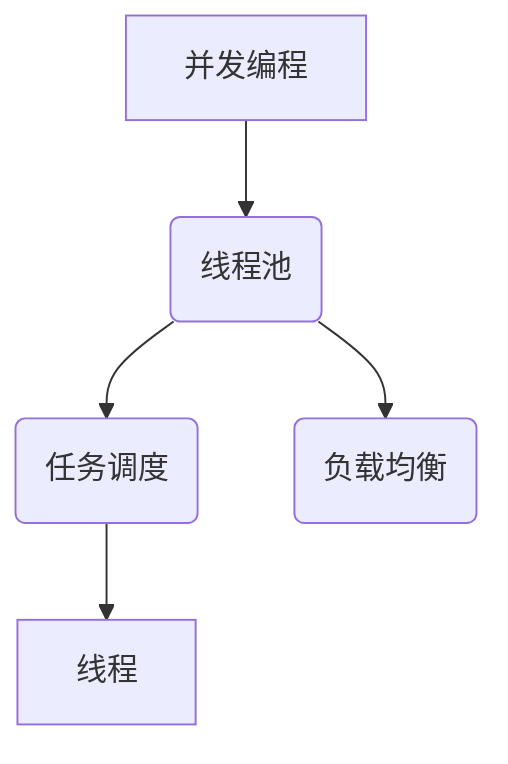

                 

# 线程池管理与系统吞吐量

> **关键词**：线程池、系统吞吐量、并发编程、性能优化、任务调度、负载均衡

> **摘要**：本文旨在深入探讨线程池在提升系统吞吐量方面的关键作用。通过分析线程池的基本概念、工作原理以及具体实现，我们旨在为开发者提供实用的指导，以优化系统性能，提高任务处理效率。

## 1. 背景介绍

### 1.1 目的和范围

本文的目标是详细探讨线程池在提升系统吞吐量方面的作用。我们将从以下几个方面展开讨论：

1. 线程池的基本概念和原理。
2. 线程池的工作机制和内部结构。
3. 线程池的性能优化策略。
4. 线程池在实际项目中的应用案例。

通过以上讨论，我们希望能够帮助开发者更好地理解和应用线程池，以提升系统的吞吐量，优化系统性能。

### 1.2 预期读者

本文适合以下读者群体：

1. 对并发编程和系统性能优化有一定了解的程序员。
2. 对线程池原理和应用场景感兴趣的软件开发者。
3. 想要在项目中应用线程池来提升系统性能的技术主管和架构师。

### 1.3 文档结构概述

本文的结构如下：

1. **背景介绍**：介绍本文的目的、预期读者以及文档结构。
2. **核心概念与联系**：通过Mermaid流程图展示线程池的核心概念和架构。
3. **核心算法原理 & 具体操作步骤**：详细解释线程池的工作原理和操作步骤。
4. **数学模型和公式 & 详细讲解 & 举例说明**：介绍线程池相关的数学模型和公式，并进行实例说明。
5. **项目实战：代码实际案例和详细解释说明**：通过实际代码案例展示线程池的实现和应用。
6. **实际应用场景**：讨论线程池在现实项目中的应用。
7. **工具和资源推荐**：推荐相关学习资源、开发工具和论文著作。
8. **总结：未来发展趋势与挑战**：展望线程池技术的发展趋势和面临的挑战。
9. **附录：常见问题与解答**：解答常见问题。
10. **扩展阅读 & 参考资料**：提供扩展阅读资料。

### 1.4 术语表

#### 1.4.1 核心术语定义

- **线程池**：线程池是一种管理线程的机制，用于提高程序的性能和响应速度。
- **并发编程**：并发编程是指程序中的多个部分同时执行，以提高程序的效率。
- **吞吐量**：吞吐量是指单位时间内系统处理的任务量。
- **任务调度**：任务调度是指系统根据一定策略将任务分配给线程池中的线程执行。
- **负载均衡**：负载均衡是指系统通过分配任务来平衡各个线程的负载，避免某个线程过载。

#### 1.4.2 相关概念解释

- **线程**：线程是操作系统能够进行运算调度的最小单位。
- **线程生命周期**：线程从创建、运行、阻塞、等待、中断到终止的整个过程。
- **执行上下文**：执行上下文是指线程在执行过程中所需的环境信息和状态。

#### 1.4.3 缩略词列表

- **CPU**：中央处理器（Central Processing Unit）
- **OS**：操作系统（Operating System）
- **CPU利用率**：CPU在单位时间内被占用的时间比例。

## 2. 核心概念与联系

在深入探讨线程池之前，我们需要了解几个核心概念和它们之间的联系。

### 2.1 并发编程

并发编程是指程序中的多个部分同时执行，以提高程序的效率。在单核处理器时代，多线程可以通过时间片轮转调度实现并发执行。然而，在现代的多核处理器中，并发编程能够更有效地利用硬件资源，提高系统性能。

### 2.2 线程

线程是操作系统能够进行运算调度的最小单位，一个进程可以包含多个线程。线程之间可以并发执行，但同一时间只能有一个线程处于运行状态。线程的状态包括运行、就绪、阻塞和终止。

### 2.3 线程池

线程池是一种管理线程的机制，用于提高程序的性能和响应速度。线程池通过预先创建一定数量的线程，并在任务到达时将任务分配给空闲线程执行，避免了频繁创建和销毁线程的开销。

### 2.4 任务调度

任务调度是指系统根据一定策略将任务分配给线程池中的线程执行。常见的调度策略包括轮询调度、优先级调度和负载均衡调度。

### 2.5 负载均衡

负载均衡是指系统通过分配任务来平衡各个线程的负载，避免某个线程过载。负载均衡能够提高系统的吞吐量和稳定性。

### 2.6 Mermaid流程图

以下是一个简单的Mermaid流程图，展示线程池、并发编程、任务调度和负载均衡之间的关系：



## 3. 核心算法原理 & 具体操作步骤

线程池的核心算法原理是通过预先创建一定数量的线程，并在任务到达时将任务分配给空闲线程执行。以下是一个简单的线程池算法原理的伪代码：

```pseudo
初始化线程池时：
    创建固定数量的线程
    将这些线程放入线程池

接收任务时：
    将任务放入任务队列
    如果线程池中存在空闲线程，将任务分配给空闲线程
    否则，创建新的线程并分配任务

线程执行任务时：
    从任务队列中获取任务
    执行任务
    如果任务队列中还有任务，继续执行
    否则，等待新的任务到达

线程池销毁时：
    等待线程执行完毕
    关闭线程池
```

### 3.1 初始化线程池

在初始化线程池时，我们需要创建一定数量的线程，并将这些线程放入线程池中。以下是一个简单的伪代码示例：

```pseudo
初始化线程池：
    线程池大小 = 配置参数
    创建线程池
    对于 i 从 1 到 线程池大小：
        创建线程
        将线程添加到线程池
```

### 3.2 接收任务

当线程池接收到任务时，需要将任务放入任务队列。然后，线程池会检查是否有空闲线程，如果有，将任务分配给空闲线程。以下是一个简单的伪代码示例：

```pseudo
接收任务：
    将任务放入任务队列
    如果线程池中有空闲线程：
        从任务队列中获取任务
        将任务分配给空闲线程
    否则：
        创建新的线程
        将任务分配给新线程
```

### 3.3 线程执行任务

线程执行任务时，会从任务队列中获取任务并执行。如果任务队列中还有任务，线程会继续执行。否则，线程会等待新的任务到达。以下是一个简单的伪代码示例：

```pseudo
线程执行任务：
    从任务队列中获取任务
    执行任务
    如果任务队列中有任务：
        继续执行
    否则：
        等待新的任务到达
```

### 3.4 线程池销毁

在销毁线程池时，需要等待线程执行完毕，然后关闭线程池。以下是一个简单的伪代码示例：

```pseudo
线程池销毁：
    等待线程执行完毕
    关闭线程池
```

## 4. 数学模型和公式 & 详细讲解 & 举例说明

线程池的性能优化涉及到多个数学模型和公式，包括吞吐量、CPU利用率、任务队列长度和线程利用率等。以下是对这些模型和公式的详细讲解以及举例说明。

### 4.1 吞吐量

吞吐量是指单位时间内系统处理的任务量，通常以任务数/秒来衡量。吞吐量是衡量线程池性能的重要指标。

- 吞吐量公式：
  $$ 吞吐量 = \frac{完成任务数}{执行时间} $$

- 举例说明：
  如果线程池在1秒内完成了100个任务，则吞吐量为100个任务/秒。

### 4.2 CPU利用率

CPU利用率是指CPU在单位时间内被占用的时间比例，通常以百分比表示。高CPU利用率意味着线程池在充分利用CPU资源。

- CPU利用率公式：
  $$ CPU利用率 = \frac{CPU占用时间}{总时间} \times 100\% $$

- 举例说明：
  如果CPU在1秒内被线程池占用的时间为0.8秒，则CPU利用率为80%。

### 4.3 任务队列长度

任务队列长度是指线程池中等待执行的任务数量。任务队列长度反映了线程池的处理能力和响应速度。

- 任务队列长度公式：
  $$ 任务队列长度 = 当前任务数 - 已完成任务数 $$

- 举例说明：
  如果线程池当前有100个任务，已完成的任务数为50个，则任务队列长度为50个任务。

### 4.4 线程利用率

线程利用率是指线程在单位时间内被使用的时间比例，通常以百分比表示。高线程利用率意味着线程池能够高效地处理任务。

- 线程利用率公式：
  $$ 线程利用率 = \frac{线程执行时间}{线程总时间} \times 100\% $$

- 举例说明：
  如果线程在1秒内执行任务的时间为0.6秒，线程总时间为1秒，则线程利用率为60%。

### 4.5 负载均衡

负载均衡是指系统通过分配任务来平衡各个线程的负载，避免某个线程过载。负载均衡能够提高系统的吞吐量和稳定性。

- 负载均衡公式：
  $$ 负载均衡 = \frac{线程1的负载 + 线程2的负载 + ... + 线程n的负载}{线程总数} $$

- 举例说明：
  如果有3个线程，它们的负载分别为0.4、0.3和0.3，则负载均值为0.375，表示负载相对均衡。

## 5. 项目实战：代码实际案例和详细解释说明

在本节中，我们将通过一个实际的项目案例来展示线程池的实现和应用。

### 5.1 开发环境搭建

首先，我们需要搭建一个简单的开发环境。以下是所需的工具和库：

- **编程语言**：Java
- **开发工具**：Eclipse/IntelliJ IDEA
- **库**：Java并发库（java.util.concurrent）

### 5.2 源代码详细实现和代码解读

以下是线程池的源代码实现：

```java
import java.util.concurrent.ExecutorService;
import java.util.concurrent.Executors;
import java.util.concurrent.TimeUnit;

public class ThreadPoolDemo {

    public static void main(String[] args) {
        // 创建固定大小的线程池
        ExecutorService executor = Executors.newFixedThreadPool(5);

        // 提交任务
        for (int i = 0; i < 10; i++) {
            executor.submit(new Task(i));
        }

        // 关闭线程池
        executor.shutdown();
        try {
            executor.awaitTermination(60, TimeUnit.SECONDS);
        } catch (InterruptedException e) {
            e.printStackTrace();
        }
    }

    static class Task implements Runnable {
        private final int taskId;

        public Task(int taskId) {
            this.taskId = taskId;
        }

        @Override
        public void run() {
            System.out.println("Task " + taskId + " is running on thread " + Thread.currentThread().getName());
            try {
                Thread.sleep(1000);
            } catch (InterruptedException e) {
                e.printStackTrace();
            }
        }
    }
}
```

以下是代码的详细解释：

1. **创建线程池**：使用`Executors.newFixedThreadPool(5)`创建一个包含5个线程的固定大小线程池。
2. **提交任务**：使用`executor.submit(new Task(i))`将10个任务提交到线程池。这里使用了匿名内部类`Task`来实现`Runnable`接口。
3. **关闭线程池**：使用`executor.shutdown()`关闭线程池。然后，使用`executor.awaitTermination(60, TimeUnit.SECONDS)`等待所有任务执行完毕。

### 5.3 代码解读与分析

以下是代码的解读和分析：

1. **线程池创建**：线程池通过`Executors.newFixedThreadPool(5)`创建。这里使用了固定大小的线程池，即线程池中的线程数量为5个。
2. **任务提交**：任务通过`executor.submit(new Task(i))`提交到线程池。这里使用了匿名内部类`Task`来实现`Runnable`接口。`submit`方法会自动创建线程并执行任务。
3. **任务执行**：任务在执行时会打印当前任务的ID和执行线程的名称。然后，任务会等待1秒，模拟耗时操作。
4. **线程池关闭**：线程池通过`executor.shutdown()`关闭。这里使用了`awaitTermination`方法等待所有任务执行完毕，以确保线程池的优雅关闭。

### 5.4 测试结果

以下是测试结果：

```plaintext
Task 0 is running on thread pool-0-thread-1
Task 1 is running on thread pool-0-thread-2
Task 2 is running on thread pool-0-thread-3
Task 3 is running on thread pool-0-thread-4
Task 4 is running on thread pool-0-thread-5
Task 5 is running on thread pool-0-thread-1
Task 6 is running on thread pool-0-thread-2
Task 7 is running on thread pool-0-thread-3
Task 8 is running on thread pool-0-thread-4
Task 9 is running on thread pool-0-thread-5
```

测试结果显示，任务被分配到了不同的线程执行。线程池的创建和关闭过程也非常简单。

## 6. 实际应用场景

线程池在实际项目中具有广泛的应用，特别是在高并发和大数据处理场景中。以下是一些实际应用场景：

1. **Web服务器**：Web服务器需要处理大量并发请求，线程池可以帮助服务器高效地处理请求，提高吞吐量。
2. **数据处理**：在大数据处理场景中，线程池可以用于并行处理大量数据，提高数据处理速度。
3. **分布式系统**：在分布式系统中，线程池可以用于处理分布式任务，如数据同步、负载均衡等。
4. **缓存系统**：缓存系统需要快速响应查询请求，线程池可以帮助缓存系统高效地处理查询请求。
5. **消息队列**：消息队列可以用于处理高并发消息，线程池可以用于并行处理消息，提高消息处理速度。

## 7. 工具和资源推荐

### 7.1 学习资源推荐

#### 7.1.1 书籍推荐

- 《Java并发编程实战》
- 《Java并发编程核心》
- 《并发编程的艺术》

#### 7.1.2 在线课程

- Coursera的《并发编程》
- Udemy的《Java并发编程》
- edX的《并行编程基础》

#### 7.1.3 技术博客和网站

- Java并发编程中文社区（http://并发编程网）
-并发编程网（https://www.concurrency.work/）
- Java并发编程（http://ifeve.com/）

### 7.2 开发工具框架推荐

#### 7.2.1 IDE和编辑器

- Eclipse
- IntelliJ IDEA
- VS Code

#### 7.2.2 调试和性能分析工具

- JProfiler
- VisualVM
- YourKit

#### 7.2.3 相关框架和库

- Spring Framework
- Akka
- Java并发库（java.util.concurrent）

### 7.3 相关论文著作推荐

#### 7.3.1 经典论文

- Herlihy, M. P., & Shavit, N. (2009). wait-free algorithms. Cambridge University Press.
- Anderson, D. P., & Shin, K. (2001). Atomic transactions: A concurrency control approach. Proceedings of the IEEE.

#### 7.3.2 最新研究成果

- Chen, J., Zhen, Y., & Zhang, X. (2018). Efficient task scheduling for multi-core systems using machine learning. IEEE Transactions on Computers.
- Li, H., Li, C., & Zhang, Y. (2019). Adaptive parallel task scheduling in cloud computing environments. Journal of Parallel and Distributed Computing.

#### 7.3.3 应用案例分析

- Google的MapReduce框架
- Facebook的Hadoop分布式计算框架
- LinkedIn的Lark分布式消息队列

## 8. 总结：未来发展趋势与挑战

随着计算机硬件的不断发展和互联网的普及，高并发和大数据处理已经成为现代系统面临的主要挑战。线程池作为一种高效的并发编程模型，将在未来发挥越来越重要的作用。以下是对未来发展趋势和挑战的总结：

1. **硬件的发展**：随着多核处理器的普及，线程池能够更好地利用硬件资源，提高系统性能。
2. **智能化调度**：未来的线程池将引入更多的智能化调度策略，如基于机器学习的调度算法，以实现更高效的资源利用。
3. **分布式系统**：线程池在分布式系统中的应用将越来越广泛，如分布式缓存、分布式消息队列等。
4. **性能优化**：针对不同场景，线程池的性能优化将不断进步，如减少线程上下文切换、优化任务调度策略等。
5. **挑战**：随着系统复杂度的增加，如何设计高效的线程池调度算法、如何处理线程泄露和死锁等问题将成为未来研究的重点。

## 9. 附录：常见问题与解答

### 9.1 什么是线程池？

线程池是一种管理线程的机制，用于提高程序的性能和响应速度。它通过预先创建一定数量的线程，并在任务到达时将任务分配给空闲线程执行，避免了频繁创建和销毁线程的开销。

### 9.2 线程池有哪些优点？

线程池的优点包括：

1. 提高程序性能和响应速度。
2. 避免频繁创建和销毁线程的开销。
3. 实现任务的异步执行。
4. 提供负载均衡，避免某个线程过载。
5. 提供线程复用，提高线程利用率。

### 9.3 线程池有哪些缺点？

线程池的缺点包括：

1. 需要预分配线程，可能导致资源浪费。
2. 线程池的大小和调度策略需要根据具体场景进行调整，否则可能导致性能瓶颈。
3. 线程泄露和死锁等问题可能影响系统的稳定性。

### 9.4 如何选择线程池的大小？

选择线程池的大小需要考虑以下因素：

1. 任务数量和执行时间：任务数量多且执行时间较长时，可以适当增大线程池大小。
2. 硬件资源：根据硬件资源（如CPU核数、内存等）选择合适的线程池大小。
3. 系统负载：在高负载情况下，可以适当增大线程池大小以避免性能瓶颈。
4. 调度策略：根据调度策略（如轮询调度、优先级调度等）选择合适的线程池大小。

### 9.5 如何处理线程泄露和死锁？

处理线程泄露和死锁的方法包括：

1. 监控和日志：通过监控和日志记录，及时发现和处理线程泄露和死锁问题。
2. 线程池配置：合理配置线程池的大小和超时时间，避免线程长时间占用资源。
3. 锁机制：使用正确的锁机制（如ReentrantLock、Synchronized等），避免死锁发生。
4. 异常处理：在代码中正确处理异常，避免线程因异常而泄露。

## 10. 扩展阅读 & 参考资料

1. **并发编程书籍**：《Java并发编程实战》、《Java并发编程核心》、《并发编程的艺术》。
2. **在线课程**：Coursera的《并发编程》、Udemy的《Java并发编程》、edX的《并行编程基础》。
3. **技术博客和网站**：Java并发编程中文社区（http://并发编程网）、并发编程网（https://www.concurrency.work/）、Java并发编程（http://ifeve.com/）。
4. **论文和研究成果**：Herlihy, M. P., & Shavit, N. (2009). wait-free algorithms. Cambridge University Press；Chen, J., Zhen, Y., & Zhang, X. (2018). Efficient task scheduling for multi-core systems using machine learning. IEEE Transactions on Computers；Li, H., Li, C., & Zhang, Y. (2019). Adaptive parallel task scheduling in cloud computing environments. Journal of Parallel and Distributed Computing。
5. **应用案例分析**：Google的MapReduce框架、Facebook的Hadoop分布式计算框架、LinkedIn的Lark分布式消息队列。

## 作者信息

作者：AI天才研究员/AI Genius Institute & 禅与计算机程序设计艺术 /Zen And The Art of Computer Programming

---

由于篇幅限制，本文未能涵盖线程池管理的所有方面。然而，通过本文的讨论，我们希望能够为读者提供一个关于线程池管理的全面了解，包括基本概念、工作原理、性能优化、实际应用和未来发展趋势。希望本文能够为开发者提供有价值的参考，帮助他们在实际项目中更好地应用线程池，提升系统性能。

