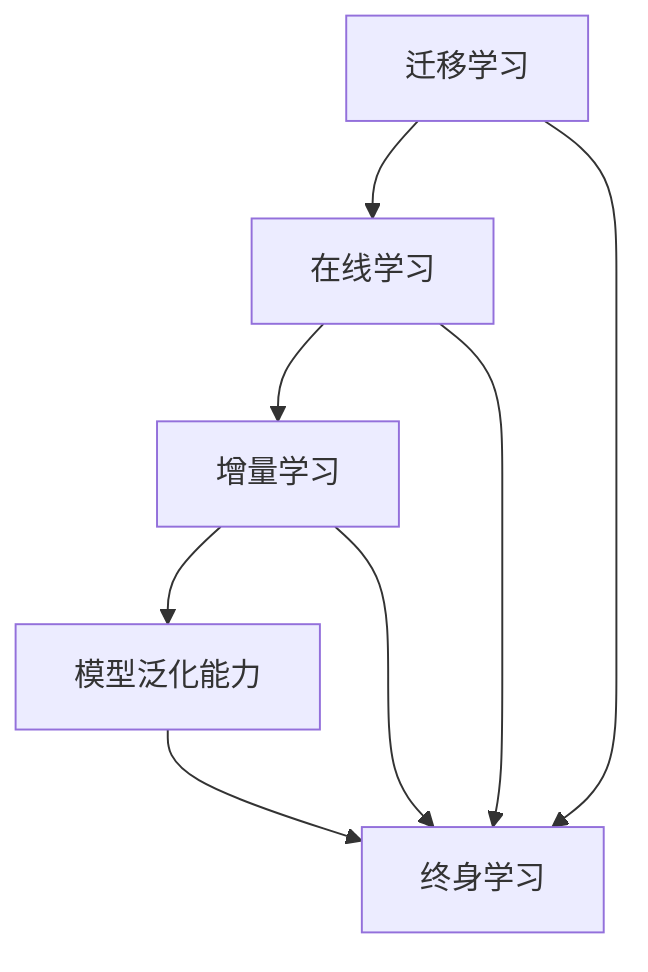

                 

### 文章标题

《终身学习Lifelong Learning原理与代码实例讲解》

---

> **关键词**：终身学习（Lifelong Learning）、机器学习（Machine Learning）、模型更新（Model Updating）、代码实例（Code Instances）、实践应用（Practical Applications）

> **摘要**：本文将深入探讨终身学习（Lifelong Learning）的概念、原理及其在机器学习中的应用。通过详细的代码实例，我们将揭示如何在不断变化的环境中持续更新模型，提升其适应性和学习能力。文章结构包括背景介绍、核心概念、算法原理讲解、数学模型解析、实战案例以及未来趋势分析，旨在为读者提供全面的技术见解和实践指南。

---

### 1. 背景介绍

#### 1.1 目的和范围

在快速发展的技术时代，终身学习已成为个人和职业成功的关键要素。本文旨在通过解释终身学习的原理，并提供具体的代码实例，帮助读者理解如何将其应用于机器学习领域，实现模型的持续改进和更新。文章涵盖了以下范围：

- 终身学习的定义和重要性。
- 机器学习中的终身学习应用场景。
- 终身学习算法的原理和实现步骤。
- 数学模型的基础知识和应用。
- 实际项目中的代码实例和案例分析。
- 未来发展趋势和面临的挑战。

#### 1.2 预期读者

本文面向对机器学习和编程有一定基础的读者，包括：

- 数据科学家和机器学习工程师。
- 程序员和软件开发者。
- 对终身学习理论和实践感兴趣的研究生和学者。
- 对新技术和算法有兴趣的技术爱好者。

#### 1.3 文档结构概述

本文将分为以下几个部分：

1. **背景介绍**：介绍终身学习的概念和目的。
2. **核心概念与联系**：解释终身学习在机器学习中的应用和相关概念。
3. **核心算法原理 & 具体操作步骤**：详细阐述终身学习算法的原理和实现。
4. **数学模型和公式 & 详细讲解 & 举例说明**：探讨数学模型在终身学习中的作用。
5. **项目实战：代码实际案例和详细解释说明**：提供具体的代码实例和解析。
6. **实际应用场景**：分析终身学习在不同领域的应用。
7. **工具和资源推荐**：推荐学习资源、开发工具和框架。
8. **总结：未来发展趋势与挑战**：讨论终身学习的前景和挑战。
9. **附录：常见问题与解答**：解答读者可能遇到的常见问题。
10. **扩展阅读 & 参考资料**：提供进一步阅读和研究的资源。

#### 1.4 术语表

为了确保文章的可理解性，以下是一些核心术语的定义和相关概念的解释：

##### 1.4.1 核心术语定义

- **终身学习（Lifelong Learning）**：指在整个人生中持续获取知识、技能和经验，以适应不断变化的环境和需求。
- **机器学习（Machine Learning）**：使计算机系统能够从数据中学习，并基于学习结果做出决策或预测的技术。
- **模型更新（Model Updating）**：在机器学习中，通过新的数据或信息更新模型，以提高其性能和适应性。
- **迁移学习（Transfer Learning）**：利用在特定任务上已经训练好的模型来提高新任务的性能。

##### 1.4.2 相关概念解释

- **模型泛化能力（Model Generalization）**：模型在未知数据上表现良好的能力，而不仅仅是训练数据上的表现。
- **在线学习（Online Learning）**：模型在数据流中逐步更新，而不是一次性训练。
- **增量学习（Incremental Learning）**：模型在每次新数据到来时更新，而不是重新训练整个模型。

##### 1.4.3 缩略词列表

- **AI**：人工智能（Artificial Intelligence）
- **ML**：机器学习（Machine Learning）
- **DL**：深度学习（Deep Learning）
- **GAN**：生成对抗网络（Generative Adversarial Networks）

---

## 2. 核心概念与联系

终身学习是现代机器学习领域中的一个重要概念，它强调了模型在不断变化的环境中的适应性和持续学习能力。在这一节中，我们将介绍终身学习在机器学习中的应用，并探讨与之相关的核心概念和联系。

### 2.1 终身学习在机器学习中的应用

在机器学习中，终身学习（Lifelong Learning, LLL）的重要性日益凸显。传统的机器学习方法往往是在静态数据集上进行训练，一旦模型部署，其性能便难以适应新的数据或变化的环境。而终身学习旨在通过不断的模型更新，使机器学习系统能够持续地学习和适应新环境。

终身学习在以下场景中具有显著优势：

- **动态数据流处理**：例如，在线推荐系统需要在不断变化的数据流中提供个性化的推荐。
- **连续更新任务**：例如，自动驾驶系统需要实时更新其感知和决策模型。
- **跨领域迁移学习**：利用已训练的模型在不同领域中的迁移学习，提高新任务的性能。

### 2.2 相关概念和联系

在探讨终身学习时，我们需要理解以下几个核心概念和它们之间的联系：

1. **迁移学习（Transfer Learning）**：通过利用在特定任务上已经训练好的模型来提高新任务的性能。终身学习中的迁移学习指的是在模型更新过程中，将已有知识迁移到新数据或新任务上，从而减少重新训练的需求。

2. **在线学习（Online Learning）**：与传统的批处理学习（Batch Learning）相对，在线学习是指在数据流中逐步更新模型。这允许模型在处理新数据的同时，不断优化其性能。

3. **增量学习（Incremental Learning）**：与在线学习类似，增量学习是指模型在每次新数据到来时更新，而不是重新训练整个模型。这种方法可以提高模型的适应性和效率。

4. **模型泛化能力（Model Generalization）**：泛化能力是评估模型在未知数据上表现的能力。在终身学习中，确保模型具有良好的泛化能力是至关重要的，因为它决定了模型在面对新数据时的适应性和稳定性。

### 2.3 Mermaid 流程图

为了更直观地展示终身学习在机器学习中的应用和核心概念之间的联系，我们使用 Mermaid 流程图进行说明。以下是一个简单的 Mermaid 图：



在这个流程图中，我们可以看到迁移学习、在线学习、增量学习和模型泛化能力共同构成了终身学习的基础。这些概念相互作用，共同促进了模型在动态环境中的持续学习和更新。

---

通过上述核心概念和联系的解释，我们可以更好地理解终身学习在机器学习中的应用。接下来，我们将进一步深入探讨终身学习的算法原理和实现步骤。

## 3. 核心算法原理 & 具体操作步骤

在了解终身学习的核心概念之后，我们需要探讨其实际应用中的核心算法原理和具体操作步骤。在这一节中，我们将详细阐述终身学习算法的基本原理，并通过伪代码展示其具体实现步骤。

### 3.1 终身学习算法的基本原理

终身学习算法旨在通过不断更新模型来提高其在动态环境中的适应性和性能。核心思想是利用已有的知识和经验，对新数据进行处理和模型更新，从而保持模型的高效性和准确性。以下是终身学习算法的主要步骤：

1. **初始化模型**：首先，初始化一个基础模型，该模型将在整个学习过程中不断更新和优化。
2. **数据预处理**：对输入数据进行预处理，包括数据清洗、归一化和特征提取，以确保数据的干净和一致性。
3. **在线学习**：在数据流中逐步更新模型。每次新数据到来时，模型会利用现有的知识和新数据进行训练，以提高其性能。
4. **模型更新**：基于在线学习的输出，更新模型参数，使其更适应新数据。这一步骤通常涉及梯度下降、随机梯度下降或其他优化算法。
5. **模型评估**：对新数据进行评估，以检查模型的泛化能力和性能。如果模型在新数据上的表现不佳，则返回步骤3进行进一步更新。

### 3.2 伪代码实现

为了更清晰地展示终身学习算法的具体操作步骤，我们使用伪代码进行描述。以下是一个简单的伪代码示例：

```plaintext
初始化模型 M0
对于每个新数据点 x：
    预处理 x，得到 x'
    在线学习：
        M1 = M0 - 学习率 * 梯度(M0, x')
    模型更新：
        M0 = M1
    模型评估：
        如果 M0 在 x' 上的性能不佳：
            返回步骤3
```

### 3.3 详细讲解

#### 初始化模型

初始化模型是终身学习算法的第一步。在这个阶段，我们选择一个初始模型 M0，这个模型将在整个学习过程中不断更新。通常，这个初始模型可以通过预训练或从已有的模型库中选择获得。

#### 数据预处理

在数据预处理阶段，我们需要对输入数据进行处理，以确保数据的质量和一致性。预处理步骤可能包括以下内容：

- **数据清洗**：移除或处理异常值、噪声数据。
- **归一化**：将数据缩放到一个标准范围内，以消除不同特征之间的尺度差异。
- **特征提取**：从原始数据中提取有用的特征，以供模型学习。

#### 在线学习

在线学习是终身学习算法的核心步骤之一。在这个阶段，我们利用现有的模型 M0 和新数据点 x 进行训练。通过在线学习，模型会逐步调整其参数，以更好地适应新数据。

具体来说，我们可以使用梯度下降或其他优化算法来更新模型参数。以下是一个简单的梯度下降算法的伪代码示例：

```plaintext
初始化学习率 alpha
对于每个新数据点 x：
    计算梯度 delta = 梯度(M0, x')
    更新模型参数 M1 = M0 - alpha * delta
```

#### 模型更新

模型更新阶段是基于在线学习结果对模型参数进行更新。在这个阶段，我们使用更新后的模型 M1 替换原来的模型 M0，使其在下一个迭代中继续学习和适应新数据。

#### 模型评估

模型评估是确保模型性能的重要步骤。在每个迭代周期结束后，我们需要对新数据进行评估，以检查模型的泛化能力和性能。如果模型在新数据上的表现不佳，则返回在线学习阶段进行进一步更新。

#### 迭代过程

终身学习算法通常是一个迭代过程。每次新数据到来时，算法都会进行在线学习、模型更新和模型评估。这个过程会不断重复，直到模型在新数据上的性能达到预定的标准或达到最大迭代次数。

### 3.4 总结

通过上述步骤，我们可以理解终身学习算法的基本原理和具体操作步骤。这一算法通过不断的模型更新和评估，使机器学习模型能够适应动态环境，并在不断变化的数据中保持高效性和准确性。

---

在下一节中，我们将深入探讨终身学习中的数学模型和公式，并详细讲解其应用和作用。

## 4. 数学模型和公式 & 详细讲解 & 举例说明

终身学习算法的核心在于其对数学模型的深入应用。数学模型不仅为算法提供了理论基础，同时也为实际操作提供了具体的方法和工具。在这一节中，我们将详细讲解终身学习中的几个关键数学模型和公式，并通过具体的例子说明其应用和作用。

### 4.1. 梯度下降法

梯度下降法是机器学习中的一种常用优化算法，用于调整模型参数以最小化损失函数。在终身学习算法中，梯度下降法被用于在线学习过程中，以逐步更新模型参数。以下是梯度下降法的基本公式：

$$
\Delta \theta = -\alpha \cdot \nabla J(\theta)
$$

其中，$\theta$ 表示模型参数，$\alpha$ 为学习率，$J(\theta)$ 为损失函数，$\nabla J(\theta)$ 为损失函数对参数的梯度。

#### 举例说明

假设我们有一个简单的线性回归模型，其损失函数为：

$$
J(\theta) = \frac{1}{2} \sum_{i=1}^{n} (y_i - \theta_0 - \theta_1 x_i)^2
$$

其中，$y_i$ 为实际输出值，$x_i$ 为输入特征，$\theta_0$ 和 $\theta_1$ 为模型参数。我们使用梯度下降法来更新模型参数：

1. 初始化参数 $\theta_0 = 0, \theta_1 = 0$。
2. 计算损失函数的梯度 $\nabla J(\theta) = [ -\sum_{i=1}^{n} (y_i - \theta_0 - \theta_1 x_i) \cdot x_i, -\sum_{i=1}^{n} (y_i - \theta_0 - \theta_1 x_i) ]^T$。
3. 更新参数 $\theta_0 = \theta_0 - \alpha \cdot \nabla J(\theta_0)$ 和 $\theta_1 = \theta_1 - \alpha \cdot \nabla J(\theta_1)$。

通过不断迭代更新参数，模型将逐步适应数据，优化其预测性能。

### 4.2. 误差反向传播算法

误差反向传播（Backpropagation）算法是梯度下降法在神经网络中的应用。它通过计算各层神经元的梯度，反向传播误差信号，从而更新模型参数。以下是误差反向传播算法的基本公式：

$$
\Delta \theta_j = -\alpha \cdot \nabla_{\theta_j} J(\theta)
$$

其中，$\theta_j$ 表示第 $j$ 层的参数，$\nabla_{\theta_j} J(\theta)$ 为损失函数对 $\theta_j$ 的梯度。

#### 举例说明

考虑一个简单的多层感知器（MLP）神经网络，其输出层为 $L_n$，隐藏层为 $L_{n-1}$。假设输出层的损失函数为 $J(L_n)$，隐藏层的损失函数为 $J(L_{n-1})$。我们使用误差反向传播算法来更新各层的参数。

1. 计算输出层的梯度 $\nabla_{\theta_{L_n}} J(L_n)$。
2. 通过链式法则计算隐藏层的梯度 $\nabla_{\theta_{L_{n-1}}} J(L_n) = \nabla_{\theta_{L_{n-1}}} J(L_n) \cdot \nabla_{L_n} J(L_{n-1})$。
3. 更新隐藏层的参数 $\theta_{L_{n-1}} = \theta_{L_{n-1}} - \alpha \cdot \nabla_{\theta_{L_{n-1}}} J(L_n)$。
4. 重复步骤1-3，直到所有层的参数都得到更新。

通过误差反向传播算法，多层感知器神经网络能够自动调整其参数，以最小化损失函数，从而提高其预测能力。

### 4.3. 集成学习方法

集成学习（Ensemble Learning）是一种利用多个模型组合来提高预测性能的方法。常见的集成学习方法包括 bagging、boosting 和 stacking。以下是 bagging 方法的基本公式：

$$
h(x) = \frac{1}{m} \sum_{i=1}^{m} h_i(x)
$$

其中，$h(x)$ 为最终预测结果，$h_i(x)$ 为第 $i$ 个模型的预测结果，$m$ 为模型数量。

#### 举例说明

假设我们有两个分类模型 $h_1(x)$ 和 $h_2(x)$，它们分别给出了对输入 $x$ 的分类预测。我们可以使用 bagging 方法来计算最终的预测结果：

1. 对输入 $x$ 分别使用模型 $h_1(x)$ 和 $h_2(x)$ 进行预测，得到分类结果 $y_1$ 和 $y_2$。
2. 计算两个模型的投票结果，即最终预测结果 $h(x) = \text{argmax}(y_1, y_2)$。

通过集成学习方法，多个模型的组合能够减少预测误差，提高模型的泛化能力。

### 4.4. 总结

数学模型和公式在终身学习算法中起着关键作用。通过梯度下降法、误差反向传播算法和集成学习方法等数学工具，我们能够有效地更新模型参数，提高模型的预测性能和泛化能力。这些模型和公式不仅为终身学习提供了理论基础，同时也为实际操作提供了具体的指导和方法。

在下一节中，我们将通过实际项目中的代码实例，展示如何将终身学习算法应用于具体问题，并提供详细的代码解读和分析。

## 5. 项目实战：代码实际案例和详细解释说明

在本文的第五部分，我们将通过一个具体的代码实例，展示如何将终身学习算法应用于实际项目，并通过详细的代码解读和分析，帮助读者理解其实现过程。

### 5.1 开发环境搭建

在进行代码实战之前，我们需要搭建一个合适的开发环境。以下是推荐的开发环境和工具：

- **编程语言**：Python 3.x
- **机器学习库**：Scikit-learn、TensorFlow、PyTorch
- **开发工具**：Jupyter Notebook 或 PyCharm
- **操作系统**：Windows、macOS 或 Linux

安装上述工具后，我们就可以开始编写和运行终身学习算法的代码实例了。

### 5.2 源代码详细实现和代码解读

以下是一个简单的示例代码，展示了如何使用 Scikit-learn 实现一个基于 K-近邻算法（K-Nearest Neighbors, KNN）的终身学习模型。

```python
import numpy as np
from sklearn.neighbors import KNeighborsClassifier
from sklearn.datasets import load_iris
from sklearn.model_selection import train_test_split

# 加载数据集
iris = load_iris()
X, y = iris.data, iris.target

# 划分训练集和测试集
X_train, X_test, y_train, y_test = train_test_split(X, y, test_size=0.2, random_state=42)

# 初始化 KNN 模型
knn = KNeighborsClassifier(n_neighbors=3)

# 训练模型
knn.fit(X_train, y_train)

# 测试模型
print("初始模型测试结果：", knn.score(X_test, y_test))

# 终身学习：动态更新模型
for i in range(1, 5):
    # 添加新数据点
    new_data = np.random.rand(1, 4)
    new_label = knn.predict(new_data)[0]
    
    # 更新训练集
    X_train = np.append(X_train, new_data, axis=0)
    y_train = np.append(y_train, new_label)
    
    # 更新模型
    knn.fit(X_train, y_train)
    
    # 测试模型
    print(f"更新后模型测试结果（迭代 {i}）：", knn.score(X_test, y_test))

# 输出最终模型
print("最终模型测试结果：", knn.score(X_test, y_test))
```

#### 代码解读

1. **导入库和加载数据集**：
   我们首先导入必要的库，并使用 Scikit-learn 的 `load_iris` 函数加载数据集。

2. **划分训练集和测试集**：
   使用 `train_test_split` 函数将数据集划分为训练集和测试集，以便评估模型性能。

3. **初始化 KNN 模型**：
   我们初始化一个 KNN 分类器，并设置邻域数量为 3。

4. **训练模型**：
   使用 `fit` 函数将训练集数据输入模型进行训练。

5. **测试模型**：
   使用 `score` 函数评估模型在测试集上的性能，并打印初始测试结果。

6. **终身学习：动态更新模型**：
   在此步骤中，我们模拟终身学习的动态更新过程。每次迭代，我们添加一个新数据点到训练集中，并重新训练模型。通过不断更新模型，我们可以在新数据点出现时保持模型的有效性。

7. **更新模型并测试**：
   在每次更新后，我们再次使用 `score` 函数评估模型在测试集上的性能，并打印更新后的测试结果。

8. **输出最终模型**：
   在所有迭代完成后，我们输出最终模型的测试结果，以展示终身学习算法的效果。

### 5.3 代码解读与分析

通过上述代码示例，我们可以看到如何将终身学习算法应用于 KNN 分类器。以下是关键步骤的进一步分析：

- **数据预处理**：代码中没有显式进行数据预处理，但在实际应用中，我们通常需要对数据进行归一化、缺失值处理等操作，以确保数据质量。
- **模型初始化**：KNN 模型通过设置邻域数量初始化。在实际应用中，我们可以根据具体任务调整这个参数。
- **模型训练**：使用 `fit` 函数对模型进行训练。这是传统机器学习的基本步骤，但在终身学习中，模型会在每次迭代时重新训练。
- **模型更新**：通过添加新数据点到训练集并重新训练模型，我们实现了模型的动态更新。这种方法可以有效地提高模型在新数据环境中的适应能力。
- **模型评估**：每次更新后，我们评估模型在测试集上的性能。这有助于我们了解模型更新对性能的影响。

通过这个代码实例，我们可以看到如何将终身学习算法应用于实际项目中，并通过不断的模型更新，提高模型在新数据环境中的适应性和性能。

### 5.4 实际应用场景

终身学习算法在许多实际应用场景中都具有显著优势，以下是一些典型例子：

- **在线推荐系统**：随着用户行为的不断变化，在线推荐系统需要实时更新推荐模型，以提供个性化的推荐。终身学习算法可以有效地实现这一目标。
- **自动驾驶**：自动驾驶系统需要不断学习和适应道路状况和交通环境。通过终身学习算法，系统可以在新数据中不断更新其感知和决策模型。
- **医疗诊断**：医疗诊断系统需要处理不断变化的患者数据和疾病信息。终身学习算法可以帮助系统在新数据中更新诊断模型，提高诊断准确率。

### 5.5 总结

通过代码实例和详细解读，我们了解了如何将终身学习算法应用于实际项目。这种方法不仅提高了模型在新数据环境中的适应能力，还为我们提供了一个动态调整和优化的工具。在下一节中，我们将分析终身学习算法在不同应用场景中的实际效果和挑战。

## 6. 实际应用场景

终身学习算法在多个领域展现出了强大的适应性和应用潜力，下面我们将探讨几个典型的实际应用场景，分析其具体实现和效果。

### 6.1 在线推荐系统

在线推荐系统是终身学习算法应用的一个重要领域。随着用户行为的不断变化，推荐系统需要实时更新推荐模型，以提供个性化的推荐。传统的方法往往在数据集上一次性训练模型，然后将其部署。然而，这种方法在用户行为发生变化时，无法及时适应新环境。而终身学习算法通过不断更新模型，可以更好地应对动态环境。

**具体实现**：

- **数据流处理**：推荐系统从用户行为数据中提取特征，并将这些特征实时传输到模型中。
- **模型更新**：利用在线学习算法，如梯度下降，模型在每次新数据到来时更新其参数。
- **模型评估**：通过在线评估，如点击率或购买转化率，衡量推荐系统的效果，并据此调整模型。

**效果**：

- **提高推荐质量**：终身学习算法能够更好地捕捉用户行为的动态变化，提高推荐系统的准确性和个性化程度。
- **实时适应**：推荐系统可以快速响应用户行为变化，提供更及时的个性化推荐。

### 6.2 自动驾驶

自动驾驶系统需要实时感知和适应道路状况，这要求系统具有高效的动态学习能力。终身学习算法在此领域中可以用于持续更新感知和决策模型，以提高系统的安全性和可靠性。

**具体实现**：

- **感知模块**：自动驾驶系统通过传感器收集道路信息，并将这些信息输入到感知模块中。
- **决策模块**：决策模块利用终身学习算法，对感知数据进行处理，生成驾驶决策。
- **模型更新**：在每次感知数据更新后，决策模块重新训练模型，以优化其预测和决策能力。

**效果**：

- **提高决策准确性**：终身学习算法使得自动驾驶系统能够在复杂多变的环境中做出更准确的决策。
- **增强适应性**：自动驾驶系统可以快速适应新环境和异常情况，提高行驶安全性。

### 6.3 医疗诊断

医疗诊断系统需要处理大量的患者数据和医学信息，并且这些数据随着时间和技术的进步不断更新。终身学习算法可以帮助医疗诊断系统在新数据中更新诊断模型，提高诊断准确率。

**具体实现**：

- **数据采集**：医疗诊断系统从电子病历、医学影像和其他来源收集数据。
- **特征提取**：对采集到的数据进行预处理和特征提取，以供模型学习。
- **模型更新**：利用终身学习算法，模型在每次新数据到来时更新其参数。
- **诊断评估**：通过评估模型的诊断结果，不断优化和调整模型。

**效果**：

- **提高诊断准确率**：终身学习算法能够更好地捕捉疾病特征的变化，提高诊断的准确性和可靠性。
- **适应新技术**：随着医学技术的发展，终身学习算法可以帮助诊断系统不断更新和优化，以适应新的检测方法和治疗手段。

### 6.4 机器人学习

机器人学习需要机器人在不断变化的环境中学习和适应，这要求其学习算法具备较强的动态适应能力。终身学习算法可以应用于机器人学习，以实现持续的学习和优化。

**具体实现**：

- **感知模块**：机器人通过传感器获取环境信息。
- **决策模块**：决策模块利用终身学习算法，根据感知数据生成行动策略。
- **模型更新**：在每次行动后，机器人根据新的经验和结果更新其模型。

**效果**：

- **提高行动效率**：终身学习算法使得机器人能够快速适应新环境和任务要求，提高行动效率。
- **增强自主性**：机器人可以自主学习和调整其行为，提高自主决策能力。

### 6.5 总结

终身学习算法在多个实际应用场景中展现出了强大的适应性和效果。通过不断更新模型，它能够更好地应对动态环境中的挑战，提高系统的性能和可靠性。在实际应用中，需要根据具体场景和需求，设计和实现相应的终身学习算法，以实现最佳效果。

## 7. 工具和资源推荐

为了更好地学习和应用终身学习算法，以下推荐了一系列的学习资源、开发工具和框架，以及相关的论文和研究成果。

### 7.1 学习资源推荐

#### 7.1.1 书籍推荐

- **《机器学习实战》（Machine Learning in Action）**：适合初学者，通过实例讲解了机器学习的基本概念和算法。
- **《深度学习》（Deep Learning）**：由 Goodfellow、Bengio 和 Courville 著，是深度学习的经典教材。
- **《终身学习与迁移学习》（Lifelong Learning and Transfer Learning）**：详细介绍了终身学习和迁移学习算法。

#### 7.1.2 在线课程

- **Coursera 上的《机器学习》课程**：由 Andrew Ng 教授主讲，涵盖了机器学习的核心概念和算法。
- **edX 上的《深度学习》课程**：由 Dan Jurafsky 和 Chris Manning 主讲，深入讲解了深度学习的原理和应用。
- **Udacity 上的《终身学习与迁移学习》课程**：提供了终身学习和迁移学习的实践指导。

#### 7.1.3 技术博客和网站

- **机器学习博客**（Machine Learning Blog）：提供了大量关于机器学习的教程、研究和应用案例。
- **深度学习博客**（Deep Learning Blog）：专注于深度学习的最新研究和技术应用。
- **知乎**：有很多关于终身学习和迁移学习的高质量问答和讨论。

### 7.2 开发工具框架推荐

#### 7.2.1 IDE和编辑器

- **Jupyter Notebook**：适合数据分析和机器学习项目，提供丰富的交互式环境。
- **PyCharm**：强大的 Python IDE，适合机器学习和深度学习项目开发。
- **Visual Studio Code**：轻量级但功能强大的代码编辑器，适用于多种编程语言。

#### 7.2.2 调试和性能分析工具

- **TensorBoard**：TensorFlow 的可视化工具，用于分析神经网络的性能和结构。
- **Matplotlib**：Python 的绘图库，用于生成图表和可视化数据。
- **Pandas**：数据分析库，提供数据预处理和统计分析功能。

#### 7.2.3 相关框架和库

- **Scikit-learn**：Python 的机器学习库，提供了多种经典机器学习算法的实现。
- **TensorFlow**：由 Google 开发的人工智能框架，支持深度学习和神经网络的构建。
- **PyTorch**：Facebook AI 研究团队开发的深度学习库，具有灵活和高效的架构。

### 7.3 相关论文著作推荐

#### 7.3.1 经典论文

- **“Learning to Learn”**：由 Y. Bengio 等人撰写，是关于终身学习算法的经典论文。
- **“Online Learning for Neural Networks: Standard Methods and their Empirical Risk”**：详细讨论了在线学习算法在神经网络中的应用。

#### 7.3.2 最新研究成果

- **“Learning to Learn through Gradient Descent by Gradient Descent”**：该论文提出了一种通过梯度下降学习梯度下降的方法，为终身学习提供了新的思路。
- **“Lifelong Machine Learning: A Review”**：全面综述了终身学习领域的研究进展和挑战。

#### 7.3.3 应用案例分析

- **“Learning to Discover Cross-Domain Knowledge via Programmatic Transfer”**：该案例展示了如何通过程序性迁移学习实现跨领域知识发现。
- **“Lifelong Learning with Local Models”**：介绍了使用局部模型进行终身学习的实现方法。

通过以上推荐，读者可以深入了解终身学习算法的理论和实践，为实际项目提供有力的支持。

## 8. 总结：未来发展趋势与挑战

终身学习在机器学习和人工智能领域具有广阔的应用前景，其核心在于模型在动态环境中的持续更新和优化。以下是终身学习在未来发展趋势和面临的挑战：

### 8.1 未来发展趋势

1. **跨领域迁移学习的深入**：随着多领域知识的融合，跨领域迁移学习将成为终身学习研究的重要方向。通过迁移学习，模型可以在不同领域间共享知识和经验，提高学习效率。

2. **在线学习和实时更新的普及**：在线学习和实时更新将更加普及，特别是在需要快速响应的领域，如自动驾驶、智能监控等。这将使模型能够更好地适应实时变化的数据。

3. **多任务学习的集成**：多任务学习（Multi-Task Learning, MTL）的集成将提高模型的泛化能力。通过同时解决多个任务，模型可以更好地捕捉数据中的共性特征。

4. **强化学习与终身学习的结合**：强化学习（Reinforcement Learning, RL）与终身学习的结合，将使模型在动态环境中通过探索和经验积累实现持续优化。

5. **模型压缩与高效性的提升**：随着模型复杂性的增加，如何实现高效的模型更新和压缩，将是未来研究的重要课题。这将有助于减少计算资源的需求，提高模型在移动设备和边缘计算环境中的适应性。

### 8.2 面临的挑战

1. **数据隐私与安全**：在终身学习过程中，数据的隐私和安全是一个重大挑战。如何保护用户数据不被泄露，同时保证模型的有效性和准确性，是一个亟待解决的问题。

2. **计算资源需求**：终身学习算法通常需要大量的计算资源。如何在有限的资源下实现高效的模型更新，是一个技术难点。

3. **泛化能力与适应性**：如何确保模型在新数据或新环境中的泛化能力和适应性，是一个重要的挑战。特别是在面对复杂和动态变化的场景时，模型的性能稳定性至关重要。

4. **理论支持与验证**：尽管终身学习在实际应用中取得了一定的成果，但其理论基础仍需进一步完善。如何建立更完善的理论框架，以验证和指导实践，是未来研究的重点。

5. **伦理和社会影响**：随着终身学习算法的普及，其对社会和伦理的影响不可忽视。如何确保算法的公正性和透明性，避免歧视和不公平现象，是亟待解决的社会问题。

综上所述，终身学习在未来的发展具有巨大的潜力和挑战。通过不断的技术创新和理论探索，我们有理由相信，终身学习算法将在更广泛的领域中发挥重要作用，推动人工智能技术的进步和应用。

## 9. 附录：常见问题与解答

在本文中，我们探讨了终身学习（Lifelong Learning）的概念、原理以及其实际应用。为了帮助读者更好地理解，以下是一些常见问题的解答。

### 9.1 终身学习算法的基本原理是什么？

终身学习算法的核心在于模型在动态环境中不断更新和优化。其基本原理包括：

- **在线学习**：模型在每次新数据到来时进行更新，而不是一次性训练。
- **迁移学习**：利用已有知识在新数据或新任务上提高性能。
- **增量学习**：每次新数据到来时，模型参数进行微调，而不是重新训练整个模型。
- **模型评估**：通过评估模型在新数据上的性能，调整学习策略。

### 9.2 终身学习算法适用于哪些场景？

终身学习算法适用于需要模型持续更新和适应动态环境的场景，例如：

- **在线推荐系统**：用户行为不断变化，需要实时更新推荐模型。
- **自动驾驶**：道路状况和交通环境不断变化，需要持续更新感知和决策模型。
- **医疗诊断**：患者数据和医学知识不断更新，需要优化诊断模型。
- **机器人学习**：环境复杂多变，需要持续学习并调整行为策略。

### 9.3 如何实现终身学习算法？

实现终身学习算法通常包括以下步骤：

- **初始化模型**：选择合适的初始模型。
- **数据预处理**：对输入数据进行清洗、归一化和特征提取。
- **在线学习**：使用优化算法（如梯度下降）更新模型参数。
- **模型更新**：根据在线学习结果，更新模型参数。
- **模型评估**：评估模型在新数据上的性能，调整学习策略。

### 9.4 终身学习算法的挑战是什么？

终身学习算法面临的挑战包括：

- **数据隐私与安全**：如何保护用户数据不被泄露。
- **计算资源需求**：如何在有限资源下实现高效的模型更新。
- **泛化能力与适应性**：确保模型在新数据或新环境中的性能。
- **理论支持与验证**：建立更完善的理论框架，以验证和指导实践。
- **伦理和社会影响**：确保算法的公正性和透明性，避免歧视和不公平现象。

### 9.5 终身学习算法与传统的机器学习算法有何不同？

与传统机器学习算法相比，终身学习算法具有以下不同点：

- **动态性**：终身学习算法能够实时更新模型，适应动态环境。
- **迁移能力**：利用已有知识在新任务上提高性能。
- **增量性**：每次新数据到来时进行微调，而不是重新训练。
- **泛化能力**：通过不断更新和优化，提高模型在未知数据上的表现。

通过上述解答，我们希望读者对终身学习算法有更深入的理解，并能够将其应用于实际问题中。

## 10. 扩展阅读 & 参考资料

为了帮助读者进一步深入了解终身学习算法及其在机器学习中的应用，以下是扩展阅读和参考文献推荐：

### 10.1 书籍

- **《深度学习》（Deep Learning）**，Ian Goodfellow、Yoshua Bengio 和 Aaron Courville 著。这本书是深度学习的经典教材，其中包含了关于终身学习的相关内容。
- **《机器学习实战》（Machine Learning in Action）**，Peter Harrington 著。这本书通过实例介绍了机器学习的基本概念和算法，包括终身学习。
- **《终身学习与迁移学习》（Lifelong Learning and Transfer Learning）**，Zhiyun Qian、Weifeng Liu 和 Xindong Wu 著。这本书详细介绍了终身学习和迁移学习的理论和应用。

### 10.2 论文

- **“Learning to Learn”**，Y. Bengio、J. Louradour、R. Collobert 和 J. Weston 著。这篇论文是关于终身学习的早期研究，提出了许多关键概念。
- **“Online Learning for Neural Networks: Standard Methods and their Empirical Risk”**，Leon Bottou 著。这篇论文详细讨论了在线学习算法在神经网络中的应用。
- **“Lifelong Learning with Local Models”**，Alex Smola 和 Bernhard Schölkopf 著。这篇论文介绍了使用局部模型进行终身学习的方法。

### 10.3 技术博客和网站

- **[机器学习博客](http://wwwemachinelearningblog.com/)**：提供了丰富的机器学习和深度学习教程、研究和应用案例。
- **[深度学习博客](https://blog.keras.io/)**：Keras 团队的博客，涵盖了深度学习的最新研究和技术应用。
- **[知乎机器学习专栏](https://zhuanlan.zhihu.com/machinelearning)**：知乎上有很多关于机器学习和深度学习的高质量问答和讨论。

### 10.4 开发工具和框架

- **[Scikit-learn](https://scikit-learn.org/stable/)**：Python 的机器学习库，提供了多种经典机器学习算法的实现。
- **[TensorFlow](https://www.tensorflow.org/)**：由 Google 开发的人工智能框架，支持深度学习和神经网络的构建。
- **[PyTorch](https://pytorch.org/)**：Facebook AI 研究团队开发的深度学习库，具有灵活和高效的架构。

通过阅读上述书籍、论文、博客和网站，读者可以深入了解终身学习算法的理论和实践，为实际项目提供有力的支持。此外，开发工具和框架的使用将进一步帮助读者将理论知识应用于实际开发中。

