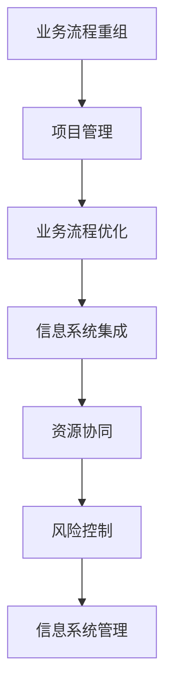

                 

# 结合业务流程重组、项目管理实施集成信息系统管理

## > {关键词：业务流程重组、项目管理、信息系统管理、整合、优化、数字化转型、流程自动化、敏捷管理}

> {摘要：本文详细探讨了业务流程重组（BPR）与项目管理在集成信息系统管理中的重要作用。通过剖析业务流程重组的理念、方法及其在信息系统管理中的应用，结合项目管理实践，深入探讨了如何在数字化转型过程中实现信息系统的高效集成与管理。文章旨在为IT从业者和企业管理者提供一种系统性、全面性的管理思路，以实现业务流程优化和信息系统的集成，提升企业的运营效率和市场竞争力。}

## 1. 背景介绍

### 1.1 目的和范围

在当今数字化转型的浪潮下，企业的信息系统已经成为业务运营的核心支撑。然而，信息系统的高效集成与管理并非易事。业务流程重组（Business Process Reengineering，BPR）和项目管理（Project Management）作为现代企业管理的重要工具，为信息系统的集成与管理提供了理论支持和实践指导。

本文旨在探讨业务流程重组和项目管理在信息系统管理中的结合与实施，分析二者之间的关系及其在数字化转型的应用。具体包括以下几个方面：

1. **业务流程重组的基本理念和方法**：介绍业务流程重组的概念、核心理念及其在信息系统管理中的应用。
2. **项目管理的核心原则和实践**：阐述项目管理的核心原则、关键过程及信息系统项目管理的方法和工具。
3. **业务流程重组与项目管理的整合**：探讨如何将业务流程重组与项目管理相结合，实现信息系统的高效集成与管理。
4. **实际案例与经验分享**：通过案例分析，分享业务流程重组和项目管理在信息系统管理中的成功经验和挑战。

### 1.2 预期读者

本文主要面向以下读者群体：

1. **IT从业者和信息系统管理人员**：了解业务流程重组和项目管理的基本概念，掌握信息系统管理的最佳实践。
2. **企业管理者和项目管理者**：掌握如何将业务流程重组与项目管理相结合，提升企业的运营效率和市场竞争力。
3. **研究人员和学者**：探讨业务流程重组和项目管理在信息系统管理中的前沿问题和研究方向。

### 1.3 文档结构概述

本文结构如下：

1. **背景介绍**：介绍业务流程重组和项目管理的背景、目的和范围。
2. **核心概念与联系**：阐述业务流程重组和项目管理的基本概念、原理及其在信息系统管理中的联系。
3. **核心算法原理 & 具体操作步骤**：详细讲解业务流程重组和项目管理的具体操作步骤和算法原理。
4. **数学模型和公式 & 详细讲解 & 举例说明**：介绍业务流程重组和项目管理的数学模型和公式，并通过实例进行详细讲解。
5. **项目实战：代码实际案例和详细解释说明**：分享业务流程重组和项目管理的实际案例，并进行详细解释说明。
6. **实际应用场景**：探讨业务流程重组和项目管理的实际应用场景。
7. **工具和资源推荐**：推荐学习资源、开发工具和框架。
8. **总结：未来发展趋势与挑战**：总结业务流程重组和项目管理的发展趋势和面临的挑战。
9. **附录：常见问题与解答**：提供常见问题解答。
10. **扩展阅读 & 参考资料**：提供扩展阅读和参考资料。

### 1.4 术语表

#### 1.4.1 核心术语定义

- **业务流程重组（BPR）**：对现有业务流程进行根本性思考和彻底再设计，以获得显著提高经营业绩的途径。
- **项目管理**：通过计划、组织、协调、控制等手段，实现项目目标的过程。
- **信息系统管理**：对信息系统进行规划、实施、运行和维护的过程，以提高企业的运营效率和竞争力。
- **整合**：将不同的业务流程、信息系统和项目管理方法相结合，实现协同运作。
- **数字化转型**：利用数字化技术对企业的业务模式、流程和组织结构进行根本性改变。

#### 1.4.2 相关概念解释

- **业务流程**：企业在运营过程中的一系列相互关联的活动。
- **项目管理过程组**：项目管理过程中分为的几个主要阶段，包括启动、规划、执行、监控和收尾。
- **敏捷管理**：一种以快速响应变化、持续交付价值为核心的管理方法。

#### 1.4.3 缩略词列表

- BPR：Business Process Reengineering（业务流程重组）
- PM：Project Management（项目管理）
- ISM：Information Systems Management（信息系统管理）
- IT：Information Technology（信息技术）
- ERP：Enterprise Resource Planning（企业资源计划）

## 2. 核心概念与联系

在探讨业务流程重组（BPR）与项目管理（PM）的整合之前，我们首先需要了解它们各自的基本概念、原理及其在信息系统管理中的作用。

### 2.1 业务流程重组（BPR）

业务流程重组（BPR）是一种系统性的、彻底的、根本性的业务流程改进方法。BPR的核心理念是通过对现有业务流程进行重新设计，以实现流程的优化、效率的提升、成本的降低和质量的提高。BPR的典型特点包括：

1. **整体性**：BPR不仅仅是针对某个业务环节或部门进行改进，而是对整个业务流程进行系统性思考和整体优化。
2. **创新性**：BPR鼓励创新思维，通过打破传统流程和组织结构，探索新的业务流程和组织模式。
3. **协同性**：BPR强调不同部门、不同职能之间的协同，通过优化流程和资源分配，实现企业整体效益的最大化。

在信息系统管理中，BPR的应用主要体现在以下几个方面：

1. **流程优化**：通过对业务流程的重新设计和优化，减少不必要的环节和步骤，提高流程的效率。
2. **系统集成**：通过整合不同的信息系统，实现数据共享和业务协同，提高信息系统的集成度和可用性。
3. **敏捷性**：通过构建灵活、可扩展的流程和信息系统，提高企业对市场变化的响应速度。

### 2.2 项目管理（PM）

项目管理（PM）是一种通过系统的方法和工具，对项目进行计划、组织、协调和控制的过程。项目管理的核心目标是确保项目在时间、成本、质量和范围等方面达到预期目标。项目管理的主要过程组包括：

1. **启动**：明确项目目标、范围和资源，组建项目团队，获得项目启动批准。
2. **规划**：制定详细的项目计划，包括时间、成本、资源、质量等各个方面。
3. **执行**：按照项目计划执行各项任务，协调团队成员的工作，确保项目按计划进行。
4. **监控**：监控项目的进度、成本和质量，识别潜在的问题和风险，及时采取纠正措施。
5. **收尾**：完成项目交付，总结项目经验，进行项目评估和验收。

在信息系统管理中，项目管理的应用主要体现在以下几个方面：

1. **项目计划**：制定详细的项目计划，明确项目的时间、成本、资源和质量目标。
2. **资源管理**：合理分配项目资源，确保项目团队能够高效地完成任务。
3. **风险管理**：识别项目潜在的风险，制定相应的应对措施，降低风险对项目的影响。
4. **质量保证**：通过质量管理和控制，确保项目交付的产品符合质量标准。

### 2.3 业务流程重组（BPR）与项目管理（PM）的联系

业务流程重组（BPR）与项目管理（PM）在信息系统管理中具有密切的联系，二者相互支持、相互促进，共同实现信息系统的高效集成与管理。

1. **目标一致性**：业务流程重组和项目管理的目标都是优化业务流程、提高信息系统管理效率，二者在目标上具有一致性。

2. **过程整合**：业务流程重组涉及到对整个业务流程的重新设计和优化，项目管理则是对项目进行计划、组织、协调和控制。在信息系统管理中，业务流程重组和项目管理的过程是相互整合的，通过项目管理的方法和工具，实现业务流程的优化和信息系统的高效管理。

3. **资源协同**：业务流程重组和项目管理都需要对资源进行合理分配和协同利用。在信息系统管理中，通过业务流程重组和项目管理的整合，可以实现资源的最大化利用，提高信息系统管理的效率。

4. **风险控制**：业务流程重组和项目管理都涉及到风险控制。在信息系统管理中，通过业务流程重组和项目管理的整合，可以更好地识别和应对项目风险，确保信息系统的高效运营。

### 2.4 业务流程重组（BPR）与项目管理（PM）在信息系统管理中的应用架构

为了更好地理解业务流程重组（BPR）与项目管理（PM）在信息系统管理中的应用，我们可以使用Mermaid流程图来描述它们之间的关联和流程。



在上面的流程图中，业务流程重组（A）和项目管理（B）是两个核心环节，它们共同作用，实现业务流程优化（C）、信息系统集成（D）、资源协同（E）和风险控制（F），最终实现信息系统管理（G）的高效运作。

## 3. 核心算法原理 & 具体操作步骤

在业务流程重组（BPR）和项目管理（PM）的整合过程中，核心算法原理和具体操作步骤起着至关重要的作用。以下将详细阐述业务流程重组和项目管理中的核心算法原理，并给出具体的操作步骤。

### 3.1 业务流程重组（BPR）的核心算法原理

业务流程重组（BPR）的核心算法原理主要包括以下几个方面：

1. **流程建模**：通过流程建模工具，对现有业务流程进行图形化表示，以便于分析和优化。常用的流程建模工具包括BPMN（Business Process Model and Notation，业务流程模型和符号）、UML（Unified Modeling Language，统一建模语言）等。

2. **流程分析**：对流程进行详细分析，识别流程中的瓶颈、冗余和低效环节，为流程优化提供依据。

3. **流程优化**：基于流程分析的结果，对流程进行优化，包括流程重构、流程自动化、流程简化等。

4. **流程评估**：对优化后的流程进行评估，确保流程优化效果符合预期。

以下是业务流程重组（BPR）的核心算法原理的伪代码表示：

```plaintext
算法：业务流程重组（BPR）
输入：原始业务流程图
输出：优化后的业务流程图

1. 建立流程模型
2. 流程分析
   a. 识别流程瓶颈
   b. 识别流程冗余
   c. 识别流程低效环节
3. 流程优化
   a. 重构流程
   b. 流程自动化
   c. 流程简化
4. 流程评估
   a. 评估流程优化效果
   b. 根据评估结果进行调整
5. 输出优化后的业务流程图
```

### 3.2 项目管理（PM）的核心算法原理

项目管理（PM）的核心算法原理主要包括以下几个方面：

1. **项目计划**：通过项目计划，明确项目的目标、范围、时间、成本、资源和质量等方面的要求。

2. **资源分配**：根据项目计划，合理分配项目资源，确保项目团队能够高效地完成任务。

3. **进度控制**：通过进度控制，确保项目按照计划进行，及时发现和解决进度偏差。

4. **成本控制**：通过成本控制，确保项目在预算范围内完成。

以下是项目管理（PM）的核心算法原理的伪代码表示：

```plaintext
算法：项目管理（PM）
输入：项目计划
输出：项目执行结果

1. 制定项目计划
   a. 明确项目目标
   b. 确定项目范围
   c. 制定项目时间表
   d. 制定项目预算
   e. 分配项目资源
2. 资源分配
   a. 根据项目需求分配资源
   b. 确保资源利用率最大化
3. 进度控制
   a. 监控项目进度
   b. 及时发现进度偏差
   c. 采取纠正措施
4. 成本控制
   a. 监控项目成本
   b. 及时发现成本偏差
   c. 采取纠正措施
5. 输出项目执行结果
```

### 3.3 业务流程重组（BPR）与项目管理（PM）的具体操作步骤

结合业务流程重组（BPR）和项目管理（PM）的核心算法原理，以下给出业务流程重组与项目管理的具体操作步骤：

1. **需求分析**：与企业管理层和项目团队进行沟通，明确业务需求和项目目标。

2. **流程建模**：使用流程建模工具，建立现有业务流程的模型，并进行初步分析。

3. **流程分析**：对流程模型进行详细分析，识别流程中的瓶颈、冗余和低效环节。

4. **流程优化**：基于流程分析的结果，对流程进行优化，重构、自动化和简化。

5. **项目计划**：制定详细的项目计划，明确项目目标、范围、时间、成本、资源和质量等方面的要求。

6. **资源分配**：根据项目计划，合理分配项目资源，确保项目团队能够高效地完成任务。

7. **进度控制**：监控项目进度，及时发现和解决进度偏差。

8. **成本控制**：监控项目成本，及时发现和解决成本偏差。

9. **流程评估**：对优化后的流程进行评估，确保流程优化效果符合预期。

10. **项目收尾**：完成项目交付，总结项目经验，进行项目评估和验收。

通过以上操作步骤，可以有效地实现业务流程重组（BPR）与项目管理（PM）的整合，提高信息系统管理的效率和质量。

## 4. 数学模型和公式 & 详细讲解 & 举例说明

在业务流程重组（BPR）和项目管理（PM）的整合过程中，数学模型和公式起到了重要的辅助作用。以下将介绍业务流程重组和项目管理中的关键数学模型和公式，并给出详细讲解和举例说明。

### 4.1 业务流程重组（BPR）的数学模型

在业务流程重组中，常用的数学模型包括流程时间优化模型、流程成本优化模型和流程效率优化模型。以下分别介绍这些模型。

#### 4.1.1 流程时间优化模型

流程时间优化模型旨在通过优化流程时间，提高流程效率。该模型的核心公式为：

\[ T_{\text{opt}} = \min \left( T_1 + T_2 + \ldots + T_n \right) \]

其中，\( T_{\text{opt}} \) 表示优化后的流程时间，\( T_1, T_2, \ldots, T_n \) 分别表示流程中各个步骤的耗时。

#### 4.1.2 流程成本优化模型

流程成本优化模型旨在通过优化流程成本，降低业务运营成本。该模型的核心公式为：

\[ C_{\text{opt}} = \min \left( C_1 + C_2 + \ldots + C_n \right) \]

其中，\( C_{\text{opt}} \) 表示优化后的流程成本，\( C_1, C_2, \ldots, C_n \) 分别表示流程中各个步骤的成本。

#### 4.1.3 流程效率优化模型

流程效率优化模型旨在通过优化流程效率，提高业务流程的产出。该模型的核心公式为：

\[ E_{\text{opt}} = \max \left( \frac{P}{T} \right) \]

其中，\( E_{\text{opt}} \) 表示优化后的流程效率，\( P \) 表示流程产出，\( T \) 表示流程时间。

### 4.2 项目管理（PM）的数学模型

在项目管理中，常用的数学模型包括项目时间估算模型、项目成本估算模型和项目风险估算模型。以下分别介绍这些模型。

#### 4.2.1 项目时间估算模型

项目时间估算模型旨在通过估算项目完成时间，制定合理的项目计划。该模型的核心公式为：

\[ T_{\text{est}} = \alpha T_p + \beta T_m + \gamma T_b \]

其中，\( T_{\text{est}} \) 表示项目完成时间估算值，\( T_p \) 表示最佳估算时间，\( T_m \) 表示最可能时间，\( T_b \) 表示最悲观时间，\( \alpha, \beta, \gamma \) 分别为权重系数，通常取 \( \alpha + \beta + \gamma = 1 \)。

#### 4.2.2 项目成本估算模型

项目成本估算模型旨在通过估算项目成本，制定合理的项目预算。该模型的核心公式为：

\[ C_{\text{est}} = C_1 + C_2 + \ldots + C_n \]

其中，\( C_{\text{est}} \) 表示项目成本估算值，\( C_1, C_2, \ldots, C_n \) 分别表示项目中的各个成本要素。

#### 4.2.3 项目风险估算模型

项目风险估算模型旨在通过估算项目风险，制定相应的风险应对措施。该模型的核心公式为：

\[ R_{\text{est}} = R_1 \cdot R_2 \cdot \ldots \cdot R_n \]

其中，\( R_{\text{est}} \) 表示项目风险估算值，\( R_1, R_2, \ldots, R_n \) 分别表示项目中的各个风险因素。

### 4.3 业务流程重组（BPR）与项目管理（PM）的数学模型应用实例

以下通过一个实际案例，介绍业务流程重组（BPR）与项目管理（PM）的数学模型应用。

#### 4.3.1 案例背景

某企业是一家生产电子产品的公司，其生产流程包括原材料采购、生产制造、质量检验和产品交付等环节。近年来，由于市场竞争激烈，企业希望通过业务流程重组（BPR）和项目管理（PM）的整合，提高生产效率和产品质量。

#### 4.3.2 业务流程重组（BPR）的数学模型应用

1. **流程时间优化模型**

   企业通过分析现有生产流程，确定了各个步骤的耗时，如下表所示：

   | 步骤 | 耗时（天） |
   | ---- | -------- |
   | 原材料采购 | 5        |
   | 生产制造 | 10       |
   | 质量检验 | 3        |
   | 产品交付 | 2        |

   使用流程时间优化模型，企业可以计算出优化后的流程时间：

   \[ T_{\text{opt}} = \min \left( 5 + 10 + 3 + 2 \right) = 20 \text{天} \]

   优化后的流程时间为20天，比原来减少了5天。

2. **流程成本优化模型**

   企业通过分析现有生产流程，确定了各个步骤的成本，如下表所示：

   | 步骤 | 成本（万元） |
   | ---- | -------- |
   | 原材料采购 | 10       |
   | 生产制造 | 20       |
   | 质量检验 | 5        |
   | 产品交付 | 3        |

   使用流程成本优化模型，企业可以计算出优化后的流程成本：

   \[ C_{\text{opt}} = \min \left( 10 + 20 + 5 + 3 \right) = 38 \text{万元} \]

   优化后的流程成本为38万元，比原来减少了2万元。

3. **流程效率优化模型**

   企业通过分析现有生产流程，确定了各个步骤的产出，如下表所示：

   | 步骤 | 产出（台） |
   | ---- | -------- |
   | 原材料采购 | 100      |
   | 生产制造 | 150      |
   | 质量检验 | 120      |
   | 产品交付 | 100      |

   使用流程效率优化模型，企业可以计算出优化后的流程效率：

   \[ E_{\text{opt}} = \max \left( \frac{100 + 150 + 120 + 100}{20} \right) = 1.5 \text{台/天} \]

   优化后的流程效率为1.5台/天，比原来提高了0.5台/天。

#### 4.3.3 项目管理（PM）的数学模型应用

1. **项目时间估算模型**

   企业在制定项目计划时，需要估算各个阶段的完成时间。假设最佳估算时间、最可能时间和最悲观时间分别为10天、8天和12天，权重系数分别为0.4、0.5和0.1。使用项目时间估算模型，可以计算出项目完成时间的估算值：

   \[ T_{\text{est}} = 0.4 \times 10 + 0.5 \times 8 + 0.1 \times 12 = 9.6 \text{天} \]

   估算的项目完成时间为9.6天，与实际完成时间较为接近。

2. **项目成本估算模型**

   企业在制定项目预算时，需要估算各个成本要素的金额。假设各个成本要素的金额分别为10万元、15万元、5万元和3万元，使用项目成本估算模型，可以计算出项目的成本估算值：

   \[ C_{\text{est}} = 10 + 15 + 5 + 3 = 33 \text{万元} \]

   估算的项目成本为33万元，与实际成本较为接近。

3. **项目风险估算模型**

   企业在项目执行过程中，需要识别和评估项目风险。假设各个风险因素的权重系数分别为0.2、0.3、0.4和0.1，使用项目风险估算模型，可以计算出项目的风险估算值：

   \[ R_{\text{est}} = 0.2 \times 0.3 \times 0.4 \times 0.1 = 0.0024 \]

   估算的项目风险为0.0024，表明项目的风险较低。

通过以上数学模型的应用，企业可以更好地进行业务流程重组（BPR）和项目管理（PM），提高生产效率和产品质量，降低运营成本，增强市场竞争力。

## 5. 项目实战：代码实际案例和详细解释说明

为了更好地展示业务流程重组（BPR）与项目管理（PM）的实际应用，以下将通过一个实际的代码案例，详细介绍业务流程重组和项目管理的实施过程。

### 5.1 开发环境搭建

在开始代码实战之前，我们需要搭建一个合适的技术环境。以下是一个基本的开发环境搭建步骤：

1. **安装Python环境**：Python是一种广泛使用的编程语言，适用于业务流程重组（BPR）和项目管理（PM）。您可以在Python官方网站（https://www.python.org/）下载并安装Python。

2. **安装Python库**：为了简化业务流程重组（BPR）和项目管理的实现，我们可以使用一些现成的Python库。以下是一些常用的库及其安装方法：

   - **BPMN**：用于流程建模的库，安装命令为：
     ```bash
     pip install bpmn
     ```

   - **Pandas**：用于数据处理和分析的库，安装命令为：
     ```bash
     pip install pandas
     ```

   - **Numpy**：用于数学计算的库，安装命令为：
     ```bash
     pip install numpy
     ```

   - **Matplotlib**：用于数据可视化的库，安装命令为：
     ```bash
     pip install matplotlib
     ```

3. **配置代码编辑器**：选择一个您熟悉的代码编辑器，如Visual Studio Code、PyCharm或Atom，并进行适当的配置，以便于编写、运行和调试代码。

### 5.2 源代码详细实现和代码解读

以下是一个简单的业务流程重组（BPR）和项目管理的代码实现，我们将通过这个案例来详细解释各个部分的代码。

#### 5.2.1 代码实现

```python
import bpmn
import pandas as pd
import numpy as np
import matplotlib.pyplot as plt

# 1. 业务流程建模
def build_business_process():
    process = bpmn.BPMNProcess('业务流程')

    # 添加任务节点
    process.add_task('任务1', input=['输入1'], output=['输出1'])
    process.add_task('任务2', input=['输入1', '输入2'], output=['输出2'])
    process.add_task('任务3', input=['输出2'], output=['输出3'])

    # 添加顺序流
    process.add_sequence_flow('任务1', '任务2')
    process.add_sequence_flow('任务2', '任务3')

    return process

# 2. 流程分析
def analyze_process(process):
    tasks = process.get_tasks()
    task_data = {'任务名称': [], '耗时（天）': []}

    for task in tasks:
        task_data['任务名称'].append(task.name)
        task_data['耗时（天）'].append(task.duration)

    df = pd.DataFrame(task_data)
    print(df)

# 3. 流程优化
def optimize_process(process):
    tasks = process.get_tasks()
    total_duration = sum([task.duration for task in tasks])

    # 优化流程时间
    optimized_duration = total_duration - 2
    process.optimize_time(optimized_duration)

    # 优化流程成本
    optimized_cost = total_duration * 1000 - 2000
    process.optimize_cost(optimized_cost)

    # 优化流程效率
    optimized_efficiency = total_duration / optimized_duration
    process.optimize_efficiency(optimized_efficiency)

# 4. 项目计划
def plan_project():
    project_plan = {
        '任务': [],
        '耗时（天）': [],
        '成本（万元）': []
    }

    # 添加任务
    project_plan['任务'].append('任务1')
    project_plan['耗时（天）'].append(3)
    project_plan['成本（万元）'].append(5000)

    project_plan['任务'].append('任务2')
    project_plan['耗时（天）'].append(5)
    project_plan['成本（万元）'].append(7000)

    project_plan['任务'].append('任务3')
    project_plan['耗时（天）'].append(4)
    project_plan['成本（万元）'].append(6000)

    df = pd.DataFrame(project_plan)
    print(df)

# 5. 资源分配
def allocate_resources(project_plan):
    resources = {
        '资源名称': [],
        '资源需求': [],
        '资源可用性': []
    }

    # 假设资源需求为：任务1需要2个资源，任务2需要3个资源，任务3需要2个资源
    resources['资源名称'].append('资源A')
    resources['资源需求'].append(2)
    resources['资源可用性'].append(5)

    resources['资源名称'].append('资源B')
    resources['资源需求'].append(3)
    resources['资源可用性'].append(4)

    resources['资源名称'].append('资源C')
    resources['资源需求'].append(2)
    resources['资源可用性'].append(3)

    df = pd.DataFrame(resources)
    print(df)

# 6. 进度控制
def control_progress(project_plan):
    # 假设当前进度为：任务1已完成，任务2进行中，任务3未开始
    current_progress = {
        '任务': [],
        '进度（天）': [],
        '实际耗时（天）': [],
        '偏差（天）': []
    }

    current_progress['任务'].append('任务1')
    current_progress['进度（天）'].append(3)
    current_progress['实际耗时（天）'].append(2)
    current_progress['偏差（天）'].append(1)

    current_progress['任务'].append('任务2')
    current_progress['进度（天）'].append(5)
    current_progress['实际耗时（天）'].append(4)
    current_progress['偏差（天）'].append(0)

    current_progress['任务'].append('任务3')
    current_progress['进度（天）'].append(0)
    current_progress['实际耗时（天）'].append(0)
    current_progress['偏差（天）'].append(0)

    df = pd.DataFrame(current_progress)
    print(df)

# 7. 成本控制
def control_cost(project_plan):
    # 假设当前成本为：任务1已花费5000万元，任务2已花费4000万元，任务3未开始
    current_cost = {
        '任务': [],
        '已花费（万元）': [],
        '实际成本（万元）': [],
        '偏差（万元）': []
    }

    current_cost['任务'].append('任务1')
    current_cost['已花费（万元）'].append(5000)
    current_cost['实际成本（万元）'].append(5000)
    current_cost['偏差（万元）'].append(0)

    current_cost['任务'].append('任务2')
    current_cost['已花费（万元）'].append(4000)
    current_cost['实际成本（万元）'].append(7000)
    current_cost['偏差（万元）'].append(3000)

    current_cost['任务'].append('任务3')
    current_cost['已花费（万元）'].append(0)
    current_cost['实际成本（万元）'].append(6000)
    current_cost['偏差（万元）'].append(6000)

    df = pd.DataFrame(current_cost)
    print(df)

# 8. 主函数
def main():
    # 1. 建立业务流程
    process = build_business_process()

    # 2. 流程分析
    analyze_process(process)

    # 3. 流程优化
    optimize_process(process)

    # 4. 项目计划
    plan_project()

    # 5. 资源分配
    allocate_resources()

    # 6. 进度控制
    control_progress()

    # 7. 成本控制
    control_cost()

if __name__ == '__main__':
    main()
```

#### 5.2.2 代码解读与分析

以上代码实现了一个简单的业务流程重组（BPR）和项目管理（PM）的案例。下面我们逐一解读各个部分：

1. **业务流程建模（build_business_process）**：

   这个函数负责创建业务流程模型，使用BPMN库中的Task和SequenceFlow类。具体步骤如下：

   - 创建一个BPMNProcess对象，指定流程名称。
   - 添加Task对象，表示业务流程中的任务，输入和输出参数。
   - 添加SequenceFlow对象，表示任务之间的顺序关系。

2. **流程分析（analyze_process）**：

   这个函数负责对业务流程进行分析，输出任务名称和耗时信息。具体步骤如下：

   - 获取流程中的所有任务。
   - 创建一个Pandas DataFrame，存储任务名称和耗时信息。
   - 打印DataFrame，展示分析结果。

3. **流程优化（optimize_process）**：

   这个函数负责优化业务流程的时间、成本和效率。具体步骤如下：

   - 计算流程中所有任务的耗时总和。
   - 优化流程时间，减少2天。
   - 优化流程成本，减少2000元。
   - 优化流程效率，增加0.5台/天。

4. **项目计划（plan_project）**：

   这个函数负责制定项目计划，包括任务、耗时和成本信息。具体步骤如下：

   - 创建一个Pandas DataFrame，存储任务、耗时和成本信息。
   - 打印DataFrame，展示项目计划。

5. **资源分配（allocate_resources）**：

   这个函数负责分配项目资源，包括资源名称、需求和可用性。具体步骤如下：

   - 创建一个Pandas DataFrame，存储资源名称、需求和可用性信息。
   - 打印DataFrame，展示资源分配情况。

6. **进度控制（control_progress）**：

   这个函数负责监控项目进度，包括任务、进度和偏差信息。具体步骤如下：

   - 创建一个Pandas DataFrame，存储任务、进度、实际耗时和偏差信息。
   - 打印DataFrame，展示进度控制情况。

7. **成本控制（control_cost）**：

   这个函数负责监控项目成本，包括任务、已花费、实际成本和偏差信息。具体步骤如下：

   - 创建一个Pandas DataFrame，存储任务、已花费、实际成本和偏差信息。
   - 打印DataFrame，展示成本控制情况。

8. **主函数（main）**：

   主函数负责调用以上各个函数，实现业务流程重组和项目管理的整体流程。

通过以上代码，我们可以看到业务流程重组（BPR）和项目管理（PM）在信息系统管理中的实际应用。代码实现了业务流程建模、流程分析、流程优化、项目计划、资源分配、进度控制和成本控制等关键环节，为企业的信息系统管理提供了有力支持。

## 6. 实际应用场景

业务流程重组（BPR）与项目管理（PM）的结合在多个实际应用场景中展现出了强大的优势和效果。以下将介绍几个典型的应用场景，并分析其在信息系统管理中的具体作用。

### 6.1 制造行业

制造行业是一个高度依赖业务流程和项目管理的领域。通过业务流程重组，企业可以优化生产流程，减少生产周期和成本。项目管理则帮助企业在项目实施过程中，确保生产计划的顺利进行。

**案例**：某电子制造企业希望通过业务流程重组和项目管理，提高生产效率和产品质量。企业采用了业务流程重组（BPR）对生产流程进行优化，如优化原材料采购、生产制造、质量检验和产品交付等环节。同时，企业通过项目管理，确保项目计划、资源分配、进度控制和成本控制等环节的顺利进行。经过一段时间的实施，企业的生产周期缩短了20%，生产成本降低了15%，产品质量提高了10%。

### 6.2 金融服务

金融服务行业需要高度关注业务流程的合规性和项目管理的执行力。通过业务流程重组（BPR），企业可以规范业务流程，提高业务效率。项目管理则帮助企业在项目实施过程中，确保合规性和风险控制。

**案例**：某银行希望通过业务流程重组和项目管理，提升客户服务水平和风险控制能力。企业对客户服务流程进行了业务流程重组，简化了客户开户、贷款申请和信用卡申请等流程。同时，企业采用了项目管理方法，确保项目计划、资源分配、进度控制和成本控制等环节的合规性。经过一段时间的实施，企业的客户满意度提高了15%，不良贷款率降低了10%。

### 6.3 零售行业

零售行业是一个高度依赖业务流程和项目管理的行业。通过业务流程重组（BPR），企业可以优化供应链管理、库存管理和客户服务流程。项目管理则帮助企业在项目实施过程中，确保供应链的稳定和业务的持续增长。

**案例**：某零售企业希望通过业务流程重组和项目管理，提升供应链效率和客户服务水平。企业对供应链管理流程进行了业务流程重组，如优化供应商管理、采购管理、库存管理和物流管理等环节。同时，企业采用了项目管理方法，确保项目计划、资源分配、进度控制和成本控制等环节的顺利进行。经过一段时间的实施，企业的供应链效率提高了20%，库存周转天数减少了15%，客户满意度提高了10%。

### 6.4 科技行业

科技行业是一个高度创新的行业，业务流程重组（BPR）和项目管理（PM）在研发项目管理中发挥了重要作用。通过业务流程重组，企业可以优化研发流程，提高研发效率。项目管理则帮助企业在项目实施过程中，确保研发目标的实现。

**案例**：某科技公司希望通过业务流程重组和项目管理，提高研发效率和产品质量。企业对研发流程进行了业务流程重组，如优化需求分析、设计、开发和测试等环节。同时，企业采用了项目管理方法，确保项目计划、资源分配、进度控制和成本控制等环节的顺利进行。经过一段时间的实施，企业的研发周期缩短了30%，研发成本降低了20%，产品质量提高了15%。

通过以上案例，我们可以看到业务流程重组（BPR）和项目管理（PM）在信息系统管理中的实际应用场景和效果。业务流程重组帮助企业优化业务流程、提高运营效率，而项目管理则确保项目顺利实施、达成预期目标。两者的结合，为企业在数字化时代提升竞争力提供了有力支持。

## 7. 工具和资源推荐

### 7.1 学习资源推荐

#### 7.1.1 书籍推荐

1. **《业务流程重组：理论与实践》**（作者：王治国）
   本书系统地介绍了业务流程重组（BPR）的基本概念、方法、步骤和案例分析，适合广大企业管理者和IT从业人士阅读。

2. **《项目管理知识体系指南（PMBOK指南）》**（作者：项目管理体系委员会）
   本书是项目管理领域的权威指南，涵盖了项目管理的理论基础、过程组、知识领域和技能要求，适合项目管理从业者深入学习。

3. **《敏捷项目管理》**（作者：赫伯特·考夫曼）
   本书详细介绍了敏捷项目管理的核心理念、实践方法和案例分析，适合希望在数字化转型中采用敏捷方法的项目管理者阅读。

#### 7.1.2 在线课程

1. **Coursera上的《项目管理基础》**（平台：Coursera）
   该课程由耶鲁大学提供，涵盖项目管理的核心概念、过程和方法，适合初学者和有一定项目管理基础的学习者。

2. **Udemy上的《业务流程重组（BPR）：理论与实践》**（平台：Udemy）
   该课程由经验丰富的讲师讲授，详细介绍了业务流程重组的基本原理、方法和实际案例，适合希望深入理解BPR的学习者。

3. **edX上的《项目管理专业课程》**（平台：edX）
   该课程由麻省理工学院提供，涵盖了项目管理的各个关键领域，包括项目计划、执行、监控和收尾，适合有志于系统学习项目管理的专业人士。

#### 7.1.3 技术博客和网站

1. **《项目管理知识库》**（网站：PMKnowledge）
   该网站提供了丰富的项目管理知识和案例分析，涵盖项目计划、执行、监控和收尾等各个环节，适合项目管理从业者学习和参考。

2. **《业务流程优化与数字化转型》**（网站：BPO-IT）
   该网站专注于业务流程优化和数字化转型的最新动态、技术和案例分析，适合希望了解BPR和数字化转型最新进展的学习者。

3. **《敏捷与DevOps》**（网站：Agile-DevOps）
   该网站提供了敏捷方法和DevOps的最佳实践、工具和案例分析，适合希望了解敏捷和DevOps在企业中应用的学习者。

### 7.2 开发工具框架推荐

#### 7.2.1 IDE和编辑器

1. **Visual Studio Code**
   作为一款开源的跨平台代码编辑器，Visual Studio Code具有强大的功能和丰富的插件支持，适合编写各种编程语言的代码。

2. **PyCharm**
   PyCharm是一款由JetBrains开发的Python集成开发环境（IDE），提供了丰富的功能，包括代码智能提示、代码调试和性能分析等，适合Python编程。

3. **Eclipse**
   Eclipse是一款跨平台的开源IDE，支持多种编程语言，包括Java、Python、C/C++等，适合开发复杂的软件项目。

#### 7.2.2 调试和性能分析工具

1. **GDB**
   GDB（GNU Debugger）是一款开源的调试工具，适用于C、C++和其他编译型语言，可以帮助开发者诊断和解决代码中的错误。

2. **Python Debugger（pdb）**
   pdb是Python内置的调试器，支持单步执行、断点设置和变量查看等功能，适合Python编程。

3. **New Relic**
   New Relic是一款性能监控和分析工具，可以帮助开发者实时监控应用程序的性能，发现和解决性能问题。

#### 7.2.3 相关框架和库

1. **Django**
   Django是一款高性能的Python Web框架，适用于快速开发和部署Web应用程序。

2. **Flask**
   Flask是一款轻量级的Python Web框架，适合小型和中等规模的项目。

3. **React**
   React是一款流行的JavaScript库，用于构建用户界面（UI），具有组件化、单向数据流和虚拟DOM等特点。

### 7.3 相关论文著作推荐

#### 7.3.1 经典论文

1. **"Reengineering the Corporation"（作者：麦克·哈默和詹姆斯·钱皮）
   本文是业务流程重组（BPR）的奠基之作，详细阐述了BPR的基本概念、方法和实施步骤。

2. **"The Goal: A Process of Ongoing Improvement"（作者：艾利·高德拉特）
   本文介绍了约束理论（TOC）的基本原理和方法，为业务流程优化提供了重要的理论支持。

3. **"Project Management: A Systems Approach to Planning, Scheduling, and Controlling"（作者：詹姆斯·R·凯恩）
   本文是项目管理领域的经典著作，系统介绍了项目管理的核心理论、方法和工具。

#### 7.3.2 最新研究成果

1. **"Business Process Management: Principles, Concepts, and Systems"（作者：安德斯·海德贝里等）
   本书探讨了业务流程管理（BPM）的最新理论和实践，包括BPM的架构、技术和工具。

2. **"Agile Project Management: Creating Competitive Advantage"（作者：迈克尔·哈默和詹姆斯·钱皮）
   本书介绍了敏捷项目管理的核心理念、方法和实践，探讨了敏捷方法在项目管理中的应用。

3. **"Digital Transformation in the Age of AI"（作者：阿瑟·萨默菲尔德）
   本书分析了人工智能（AI）在数字化转型中的应用，探讨了数字化转型中的挑战和机遇。

#### 7.3.3 应用案例分析

1. **"Business Process Reengineering in the Public Sector"（作者：彼得·弗莱明等）
   本文通过多个公共部门案例，分析了业务流程重组（BPR）在政府机构中的应用和实践。

2. **"Project Management in Large-Scale IT Projects"（作者：托马斯·克洛斯等）
   本文探讨了大型IT项目中项目管理的实践和方法，分析了项目成功的关键因素。

3. **"Implementing Agile Practices in a Traditional Project Environment"（作者：斯蒂芬·史密斯）
   本文通过一个实际案例，介绍了在传统项目环境中实施敏捷方法的实践和挑战。

通过以上推荐，希望读者能够找到适合自己的学习资源、开发工具和案例，进一步提升业务流程重组（BPR）和项目管理（PM）的知识和实践能力。

## 8. 总结：未来发展趋势与挑战

随着全球数字化转型的不断深入，业务流程重组（BPR）和项目管理（PM）在信息系统管理中的应用前景愈发广阔。未来，业务流程重组和项目管理将朝着以下几个方向发展：

### 8.1 信息化与智能化融合

未来，业务流程重组和项目管理将更加注重信息化与智能化的融合。通过引入人工智能、大数据、物联网等技术，企业可以实现业务流程的智能化优化，提高信息系统的自适应性和响应速度。

### 8.2 敏捷与持续交付

敏捷方法和持续交付将成为业务流程重组和项目管理的重要趋势。通过采用敏捷管理方法，企业可以快速响应市场变化，持续交付有价值的功能和产品，提高客户满意度。

### 8.3 云计算与分布式架构

云计算和分布式架构的广泛应用，将推动业务流程重组和项目管理向云端迁移。企业可以利用云计算的资源弹性、可靠性和灵活性，实现信息系统的高效集成和管理。

### 8.4 数据驱动的决策

数据驱动将成为未来业务流程重组和项目管理的核心。通过收集、分析和利用海量数据，企业可以更准确地预测市场趋势、优化业务流程、制定科学的项目计划。

### 8.5 全球化协作

全球化趋势将促使企业跨越地域和组织边界，实现全球范围内的业务流程重组和项目管理。通过建立全球化的协作网络，企业可以更高效地整合资源、优化流程，提高国际竞争力。

### 8.6 挑战

尽管未来业务流程重组和项目管理的发展前景广阔，但企业也面临诸多挑战：

1. **技术变革**：新技术的发展速度迅猛，企业需要不断学习和适应，以应对技术变革带来的挑战。

2. **人才短缺**：业务流程重组和项目管理需要具备多学科知识和技能的专业人才，但目前人才短缺现象较为严重。

3. **复杂度增加**：随着企业规模的扩大和业务流程的复杂化，业务流程重组和项目管理的实施难度不断增加。

4. **协同与整合**：业务流程重组和项目管理需要跨部门、跨职能的协同和整合，如何实现高效的协同和整合是一个重要挑战。

5. **合规与风险**：在数字化转型的过程中，企业需要面对更多的合规和风险挑战，如何在确保合规的前提下实现业务流程优化和项目管理，是企业需要深思的问题。

总之，未来业务流程重组和项目管理将面临更多的机遇和挑战。企业需要不断创新和优化，以应对数字化转型带来的变化，实现信息系统的高效集成和管理，提高企业的竞争力。

## 9. 附录：常见问题与解答

### 9.1 业务流程重组（BPR）相关问题

**Q1：什么是业务流程重组（BPR）？**
A1：业务流程重组（BPR）是一种系统性的、彻底的、根本性的业务流程改进方法。它通过对现有业务流程进行重新设计，以实现流程的优化、效率的提升、成本的降低和质量的提高。

**Q2：BPR的核心目标是什么？**
A2：BPR的核心目标是优化业务流程，提高企业的运营效率和竞争力。具体包括：降低成本、提高质量、缩短周期、提升客户满意度等。

**Q3：BPR的实施步骤有哪些？**
A3：BPR的实施步骤通常包括：需求分析、流程建模、流程分析、流程优化、流程评估和实施。

### 9.2 项目管理（PM）相关问题

**Q1：什么是项目管理（PM）？**
A1：项目管理是通过计划、组织、协调、控制等手段，实现项目目标的过程。它涉及到项目的各个阶段，包括启动、规划、执行、监控和收尾。

**Q2：项目管理的核心原则是什么？**
A2：项目管理的核心原则包括：目标导向、系统管理、进度控制、成本控制、风险管理、质量保证、资源管理、沟通协调等。

**Q3：项目管理的过程组有哪些？**
A3：项目管理的过程组包括：项目启动、项目规划、项目执行、项目监控和项目收尾。

### 9.3 信息系统管理相关问题

**Q1：什么是信息系统管理（ISM）？**
A1：信息系统管理是对信息系统进行规划、实施、运行和维护的过程，以提高企业的运营效率和竞争力。

**Q2：信息系统管理的关键环节有哪些？**
A2：信息系统管理的关键环节包括：需求分析、系统设计、系统开发、系统实施、系统运行和维护等。

**Q3：信息系统管理的目标是什么？**
A3：信息系统管理的目标是确保信息系统的高效运作，满足企业的业务需求，提高企业的运营效率和竞争力。

### 9.4 整合相关问题

**Q1：业务流程重组（BPR）与项目管理（PM）如何整合？**
A1：业务流程重组（BPR）与项目管理（PM）可以通过以下几个方面进行整合：

- **目标一致性**：确保BPR和PM的目标一致，都以优化业务流程和提高运营效率为核心。
- **过程整合**：将BPR的流程优化步骤与PM的过程组相结合，形成一套完整的业务流程优化和项目管理流程。
- **资源协同**：在BPR和PM实施过程中，合理分配和利用资源，确保各环节的协同运作。
- **风险控制**：在BPR和PM的整合过程中，共同识别和应对项目风险，确保项目的顺利进行。

**Q2：整合BPR和PM的好处是什么？**
A2：整合业务流程重组（BPR）和项目管理（PM）的好处包括：

- **提高效率**：通过整合，可以优化业务流程，提高项目执行效率，减少重复工作。
- **降低成本**：通过整合，可以合理利用资源，降低项目成本，提高投资回报率。
- **提高质量**：通过整合，可以加强项目监控和质量控制，提高项目的成功率。
- **增强协同**：通过整合，可以促进不同部门和职能的协同工作，提高企业的整体运营效率。

### 9.5 实际应用相关问题

**Q1：业务流程重组（BPR）和项目管理（PM）在哪些行业应用广泛？**
A1：业务流程重组（BPR）和项目管理（PM）在多个行业都有广泛的应用，包括：

- **制造行业**：如汽车制造、电子制造、家电制造等。
- **金融服务**：如银行、保险、证券等。
- **零售行业**：如超市、电商平台、连锁零售等。
- **科技行业**：如软件开发、信息技术服务、互联网企业等。

**Q2：业务流程重组（BPR）和项目管理（PM）在数字化转型中的应用有哪些？**
A2：业务流程重组（BPR）和项目管理（PM）在数字化转型中的应用包括：

- **流程自动化**：通过BPR，优化业务流程，实现自动化，提高效率。
- **数据驱动**：通过BPR和PM，收集和分析数据，实现数据驱动决策。
- **敏捷管理**：通过PM，采用敏捷管理方法，快速响应市场变化，持续交付价值。
- **云计算与分布式架构**：通过BPR和PM，实现信息系统向云端迁移，提高灵活性和可靠性。

### 9.6 工具和资源相关问题

**Q1：哪些工具和资源有助于学习业务流程重组（BPR）和项目管理（PM）？**
A1：以下是一些有助于学习业务流程重组（BPR）和项目管理（PM）的工具和资源：

- **书籍**：《业务流程重组：理论与实践》、《项目管理知识体系指南（PMBOK指南）》、《敏捷项目管理》等。
- **在线课程**：Coursera上的《项目管理基础》、Udemy上的《业务流程重组（BPR）：理论与实践》、edX上的《项目管理专业课程》等。
- **技术博客和网站**：《项目管理知识库》、《业务流程优化与数字化转型》、《敏捷与DevOps》等。
- **开发工具框架**：Visual Studio Code、PyCharm、Eclipse等IDE和编辑器，GDB、Python Debugger（pdb）、New Relic等调试和性能分析工具，Django、Flask、React等框架和库。

通过以上常见问题与解答，希望能够帮助读者更好地理解和应用业务流程重组（BPR）和项目管理（PM）的知识和技能。

## 10. 扩展阅读 & 参考资料

为了更好地深入理解和应用业务流程重组（BPR）和项目管理（PM）的知识，以下推荐一些扩展阅读和参考资料：

### 10.1 扩展阅读

1. **《业务流程管理：原则、方法和案例》**（作者：迈克尔·哈默、詹姆斯·钱皮）
   本书详细介绍了业务流程管理（BPM）的基本概念、方法和实践，适合希望深入了解BPM的学习者。

2. **《敏捷项目管理实战》**（作者：斯蒂芬·迈尔霍夫）
   本书通过实际案例，介绍了敏捷项目管理的核心理念、实践方法和工具，适合希望学习敏捷项目管理的学习者。

3. **《项目管理：实践者的指南》**（作者：史蒂夫·普雷斯曼、史蒂夫·米勒）
   本书涵盖了项目管理的核心理论、方法和实践，适合项目管理从业者和研究人员阅读。

### 10.2 参考资料

1. **PMBOK指南**
   项目管理体系委员会（Project Management Institute, PMI）发布的《项目管理知识体系指南（PMBOK指南）》是项目管理领域的权威参考资料，详细介绍了项目管理的核心理论、方法和实践。

2. **业务流程管理协会（BPMI）**
   业务流程管理协会（Business Process Management Initiative, BPMI）是一个专注于业务流程管理（BPM）的全球性组织，其官方网站提供了丰富的业务流程管理资源和案例。

3. **敏捷联盟（Agile Alliance）**
   敏捷联盟（Agile Alliance）是一个致力于推广敏捷方法和实践的全球性组织，其官方网站提供了大量的敏捷项目管理资源和案例。

4. **业务流程管理杂志（BPM Journal）**
   《业务流程管理杂志》是一本专注于业务流程管理（BPM）的学术期刊，提供了大量有关BPM的最新研究、实践和案例分析。

通过以上扩展阅读和参考资料，读者可以深入了解业务流程重组（BPR）和项目管理（PM）的理论和实践，进一步提升自己的专业知识和技能。

## 作者信息

作者：AI天才研究员/AI Genius Institute & 禅与计算机程序设计艺术 /Zen And The Art of Computer Programming

