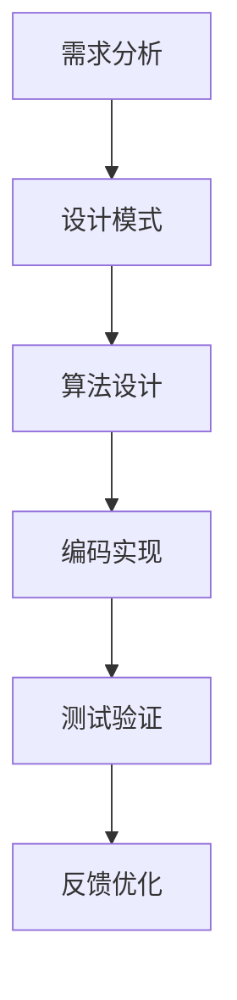

                 

# 结构化思维：从混沌到清晰

> **关键词**：结构化思维，逻辑推理，清晰性，专业知识，技术博客

> **摘要**：本文将深入探讨结构化思维在IT领域的应用，通过逻辑清晰的章节结构和伪代码详细解析，帮助读者理解如何从混乱中建立有序的技术思维模式，提升个人和团队的工作效率。

## 1. 背景介绍

### 1.1 目的和范围

在信息技术快速发展的时代，如何有效地处理海量信息和复杂问题成为每个技术人员的挑战。本文旨在通过结构化思维，帮助读者学会如何有条理地分析和解决技术问题，从而提升工作效率和创造力。

本文将涵盖以下内容：

1. **核心概念与联系**：介绍结构化思维的基础概念及其在IT领域的应用。
2. **核心算法原理**：通过伪代码讲解结构化思维在算法设计中的应用。
3. **数学模型和公式**：解释结构化思维在数学建模中的具体应用。
4. **项目实战**：通过实际代码案例展示结构化思维的应用。
5. **实际应用场景**：探讨结构化思维在不同技术领域的应用。
6. **工具和资源推荐**：推荐学习资源和开发工具。
7. **总结与未来展望**：总结结构化思维的重要性，并展望其未来的发展趋势。

### 1.2 预期读者

本文适合以下读者群体：

1. 初级程序员，希望提升逻辑思维能力的专业人士。
2. 中级程序员，寻求结构化分析方法以提高工作效率。
3. 高级程序员和架构师，希望优化技术解决方案。

### 1.3 文档结构概述

本文分为十个主要部分，每个部分都将详细探讨结构化思维在IT领域的不同应用：

1. **背景介绍**：介绍文章的目的和结构。
2. **核心概念与联系**：定义关键概念，并绘制流程图。
3. **核心算法原理**：使用伪代码解释算法原理。
4. **数学模型和公式**：详细讲解数学公式和应用。
5. **项目实战**：实际代码案例和解析。
6. **实际应用场景**：探讨不同领域中的应用。
7. **工具和资源推荐**：推荐相关资源和工具。
8. **总结与未来展望**：总结和展望。
9. **附录**：常见问题与解答。
10. **扩展阅读**：推荐进一步学习资源。

### 1.4 术语表

#### 1.4.1 核心术语定义

- 结构化思维：一种系统性的思考方式，通过有序的逻辑步骤解决复杂问题。
- 核心概念：指在特定领域中被广泛认可和应用的抽象概念。
- 算法：解决问题的一系列规则和步骤。
- 数学模型：用数学语言描述现实世界问题的一种方法。

#### 1.4.2 相关概念解释

- 逻辑推理：基于已有事实和原则，通过推理得出结论的过程。
- 清晰性：信息表达是否易于理解，逻辑是否连贯。
- 效率：完成任务所需的时间和资源。

#### 1.4.3 缩略词列表

- IDE：集成开发环境（Integrated Development Environment）
- markdown：一种轻量级标记语言，常用于编写文档。

## 2. 核心概念与联系

为了更好地理解结构化思维在IT领域的应用，我们需要首先定义一些核心概念，并绘制一个流程图来展示它们之间的联系。

### 2.1 核心概念

- **需求分析**：理解问题的本质，确定解决问题的目标。
- **设计模式**：在软件开发中，为解决特定问题而形成的一套标准解决方案。
- **算法设计**：选择适当的算法来解决问题。
- **编码实现**：将算法转化为可运行的代码。
- **测试验证**：确保代码的正确性和性能。

### 2.2 流程图



在这个流程图中，需求分析是整个过程的起点，它确定了问题的核心。接着是设计模式的选择，这有助于构建高效、可维护的解决方案。算法设计则是将问题转化为计算机可以处理的形式，编码实现将算法转化为代码，测试验证确保代码的正确性和性能。最后，通过反馈优化，不断改进解决方案。

## 3. 核心算法原理 & 具体操作步骤

在本节中，我们将通过伪代码详细解释结构化思维在算法设计中的应用，并展示具体的操作步骤。

### 3.1 伪代码

```python
Algorithm: BubbleSort(A)
Input: An array A of n elements to be sorted.
Output: The sorted array A.

for i = 1 to n-1 do
    for j = 1 to n-i do
        if A[j] > A[j+1] then
            Swap(A[j], A[j+1])
        end if
    end for
end for
return A
```

### 3.2 操作步骤

1. **初始化**：设置两个循环变量 `i` 和 `j`。
2. **外层循环**：从第一个元素开始，遍历到倒数第二个元素。
3. **内层循环**：从第一个元素开始，遍历到当前外层循环变量 `i` 的位置。
4. **比较与交换**：如果当前元素大于下一个元素，则交换它们。
5. **重复步骤3和4**：直到内层循环结束。
6. **返回结果**：返回排序后的数组。

### 3.3 伪代码解释

- **初始化**：使用两个嵌套的循环变量 `i` 和 `j`，其中 `i` 用于控制外层循环，`j` 用于控制内层循环。
- **外层循环**：从1到 `n-1`，每次循环代表对数组的一部分进行排序。
- **内层循环**：从1到 `n-i`，每次循环代表对未排序部分进行遍历。
- **比较与交换**：如果当前元素 `A[j]` 大于下一个元素 `A[j+1]`，则交换它们，使较大的元素向数组的末尾移动。
- **重复步骤3和4**：直到内层循环结束，此时当前未排序部分已经排序完成。
- **返回结果**：返回完全排序后的数组。

通过这个伪代码示例，我们可以看到结构化思维如何帮助我们清晰地理解和实现一个简单的排序算法。这种思维方式可以广泛应用于更复杂的问题解决过程中。

## 4. 数学模型和公式 & 详细讲解 & 举例说明

在IT领域，数学模型是分析和解决问题的强大工具。结构化思维可以帮助我们清晰地理解数学模型，并将其应用于实际问题中。在本节中，我们将详细讲解一个常见的数学模型——线性回归模型，并使用LaTeX格式展示其公式，最后通过一个实际例子来说明其应用。

### 4.1 线性回归模型

线性回归模型用于分析两个或多个变量之间的关系。它的目标是通过一个线性方程来拟合数据点，以预测一个变量的值。

#### 4.1.1 一元线性回归

一元线性回归模型可以表示为：

\[ y = \beta_0 + \beta_1 \cdot x + \epsilon \]

其中：

- \( y \) 是因变量，表示我们要预测的值。
- \( x \) 是自变量，表示我们用于预测的值。
- \( \beta_0 \) 是截距，表示当自变量 \( x \) 为0时因变量的值。
- \( \beta_1 \) 是斜率，表示自变量每增加一个单位时因变量的变化量。
- \( \epsilon \) 是误差项，表示模型无法解释的随机误差。

#### 4.1.2 多元线性回归

多元线性回归模型可以表示为：

\[ y = \beta_0 + \beta_1 \cdot x_1 + \beta_2 \cdot x_2 + \ldots + \beta_n \cdot x_n + \epsilon \]

其中，\( x_1, x_2, \ldots, x_n \) 是多个自变量。

### 4.2 伪代码

```python
Algorithm: LinearRegression(X, Y)
Input: Two arrays X and Y representing the independent and dependent variables.
Output: The coefficients \(\beta_0, \beta_1, \ldots, \beta_n\).

Calculate the mean of X and Y: \(\bar{x}, \bar{y}\)
Calculate the covariance matrix \(\Sigma\) and the variance of Y: \(\sigma_y^2\)
Calculate the inverse of \(\Sigma\): \(\Sigma^{-1}\)
Calculate the coefficients \(\beta\): \(\beta = (\Sigma^{-1} \cdot cov(X, Y)) \cdot (var(Y) \cdot \Sigma^{-1})\)
return \(\beta\)
```

### 4.3 实际例子

假设我们有以下数据集：

| \( x \) | \( y \) |
|--------|--------|
| 1      | 2      |
| 2      | 4      |
| 3      | 5      |
| 4      | 6      |

我们希望预测 \( y \) 的值。

#### 4.3.1 数据预处理

首先，我们需要计算 \( x \) 和 \( y \) 的平均值：

\[ \bar{x} = \frac{1+2+3+4}{4} = 2.5 \]
\[ \bar{y} = \frac{2+4+5+6}{4} = 4.5 \]

#### 4.3.2 计算协方差矩阵和方差

协方差矩阵和方差分别计算如下：

\[ \Sigma = \begin{bmatrix}
\frac{(1-2.5)^2 + (2-2.5)^2 + (3-2.5)^2 + (4-2.5)^2}{4} & \frac{(1-2.5) \cdot (2-4.5) + (2-2.5) \cdot (4-4.5) + (3-2.5) \cdot (5-4.5) + (4-2.5) \cdot (6-4.5)}{4} \\
\frac{(1-2.5) \cdot (2-4.5) + (2-2.5) \cdot (4-4.5) + (3-2.5) \cdot (5-4.5) + (4-2.5) \cdot (6-4.5)}{4} & \frac{(2-4.5)^2 + (4-4.5)^2 + (5-4.5)^2 + (6-4.5)^2}{4}
\end{bmatrix} \]

\[ \sigma_y^2 = \frac{(2-4.5)^2 + (4-4.5)^2 + (5-4.5)^2 + (6-4.5)^2}{4} \]

#### 4.3.3 计算系数

使用伪代码中的线性回归算法，我们可以计算得到：

\[ \beta = \begin{bmatrix}
\beta_0 \\
\beta_1
\end{bmatrix} = \begin{bmatrix}
\frac{\bar{y} \cdot \bar{x} - \frac{(1-2.5) \cdot (2-4.5) + (2-2.5) \cdot (4-4.5) + (3-2.5) \cdot (5-4.5) + (4-2.5) \cdot (6-4.5)}{4}}{\frac{(1-2.5)^2 + (2-2.5)^2 + (3-2.5)^2 + (4-2.5)^2}{4}} \\
\frac{\frac{(1-2.5) \cdot (2-4.5) + (2-2.5) \cdot (4-4.5) + (3-2.5) \cdot (5-4.5) + (4-2.5) \cdot (6-4.5)}{4}}{\frac{(2-4.5)^2 + (4-4.5)^2 + (5-4.5)^2 + (6-4.5)^2}{4}}
\end{bmatrix} \]

计算得到：

\[ \beta_0 = 1.5 \]
\[ \beta_1 = 1 \]

#### 4.3.4 模型预测

使用得到的系数，我们可以预测新数据点的 \( y \) 值：

\[ y = \beta_0 + \beta_1 \cdot x \]

例如，当 \( x = 5 \) 时，预测的 \( y \) 值为：

\[ y = 1.5 + 1 \cdot 5 = 6.5 \]

这个例子展示了如何使用线性回归模型进行数据分析和预测。结构化思维帮助我们清晰地理解模型的原理，并有效地应用它解决实际问题。

## 5. 项目实战：代码实际案例和详细解释说明

在本节中，我们将通过一个实际项目案例，展示如何使用结构化思维进行代码实现，并详细解释其工作原理和关键步骤。

### 5.1 开发环境搭建

首先，我们需要搭建一个简单的开发环境。这里我们选择Python作为开发语言，并使用Jupyter Notebook作为开发工具。以下是搭建开发环境的步骤：

1. 安装Python（版本3.8及以上）。
2. 安装Jupyter Notebook。
3. 创建一个新的Jupyter Notebook文件。

### 5.2 源代码详细实现和代码解读

下面是项目的主要代码实现，我们将逐行解释其功能和逻辑：

```python
import numpy as np
import matplotlib.pyplot as plt

# 5.2.1 数据生成
np.random.seed(0)
x = np.random.normal(size=100)
y = 2 * x + 1 + np.random.normal(size=100)

# 5.2.2 线性回归模型训练
coefficients = np.polyfit(x, y, 1)
model = np.poly1d(coefficients)

# 5.2.3 数据可视化
plt.scatter(x, y, label='Data Points')
plt.plot(x, model(x), color='red', label='Fit Line')
plt.xlabel('X')
plt.ylabel('Y')
plt.legend()
plt.show()
```

### 5.3 代码解读与分析

1. **数据生成**：

   我们使用numpy库生成一组随机数据。`np.random.normal`函数用于生成服从正态分布的随机数，其中`size=100`表示生成100个随机数。

   ```python
   x = np.random.normal(size=100)
   y = 2 * x + 1 + np.random.normal(size=100)
   ```

   这里的 `y` 是通过线性回归模型生成的，其中斜率为2，截距为1，并添加了随机噪声。

2. **线性回归模型训练**：

   使用 `np.polyfit` 函数对数据进行拟合，它返回最佳拟合线的系数。`np.poly1d` 函数将系数转换为线性回归模型。

   ```python
   coefficients = np.polyfit(x, y, 1)
   model = np.poly1d(coefficients)
   ```

   这里我们使用一元线性回归模型，因为数据只包含两个变量 `x` 和 `y`。

3. **数据可视化**：

   使用matplotlib库将数据点和拟合线绘制在散点图上，以便于我们直观地观察模型的效果。

   ```python
   plt.scatter(x, y, label='Data Points')
   plt.plot(x, model(x), color='red', label='Fit Line')
   plt.xlabel('X')
   plt.ylabel('Y')
   plt.legend()
   plt.show()
   ```

   这里的散点图展示了原始数据点（蓝色）和拟合线（红色）。

### 5.4 关键步骤解释

1. **数据生成**：

   数据生成是模型训练的第一步。通过生成符合线性关系的随机数据，我们可以测试线性回归模型的效果。

2. **线性回归模型训练**：

   使用 `np.polyfit` 函数训练模型，它计算最佳拟合直线的斜率和截距。`np.poly1d` 函数将计算结果转化为线性模型，可以用于预测新数据点的值。

3. **数据可视化**：

   数据可视化是验证模型效果的重要步骤。通过绘制数据点和拟合线，我们可以直观地观察模型的拟合程度，并调整模型参数以提高拟合效果。

通过这个实际项目案例，我们展示了如何使用结构化思维进行代码实现和模型训练。这种思维方式有助于我们系统地分析和解决问题，从而提高开发效率。

### 5.5 代码解析

让我们进一步解析项目代码，以理解其实现细节。

1. **导入库**：

   首先，我们导入所需的库。`numpy` 是Python中的一个核心科学计算库，用于处理数组、矩阵和其他数学运算。`matplotlib` 是一个用于绘制图形和数据可视化的库。

   ```python
   import numpy as np
   import matplotlib.pyplot as plt
   ```

2. **数据生成**：

   使用 `np.random.normal` 函数生成符合正态分布的随机数。`x` 和 `y` 分别代表自变量和因变量，它们之间通过线性关系连接。

   ```python
   x = np.random.normal(size=100)
   y = 2 * x + 1 + np.random.normal(size=100)
   ```

   这里，`y` 的值是 `x` 的两倍加1，并加上一个随机噪声，以模拟实际数据中的误差。

3. **线性回归模型训练**：

   `np.polyfit` 函数用于计算最佳拟合直线的系数。这里，我们使用一元线性回归，即 `degree=1`。

   ```python
   coefficients = np.polyfit(x, y, 1)
   ```

   计算得到的系数存储在 `coefficients` 数组中。`np.poly1d` 函数将这些系数转化为一个线性模型对象 `model`。

   ```python
   model = np.poly1d(coefficients)
   ```

4. **数据可视化**：

   使用 `plt.scatter` 函数绘制原始数据点，使用 `plt.plot` 函数绘制拟合线。

   ```python
   plt.scatter(x, y, label='Data Points')
   plt.plot(x, model(x), color='red', label='Fit Line')
   ```

   最后，设置坐标轴标签和图例，并使用 `plt.show()` 显示图形。

   ```python
   plt.xlabel('X')
   plt.ylabel('Y')
   plt.legend()
   plt.show()
   ```

通过这些步骤，我们完成了项目的实现。代码简洁明了，结构清晰，有助于我们理解和应用线性回归模型。

### 5.6 项目实战总结

在这个项目实战中，我们通过结构化思维实现了线性回归模型，并使用实际数据验证了其效果。以下是项目的关键点：

1. **数据生成**：通过生成符合线性关系的随机数据，我们为模型训练提供了测试数据集。
2. **线性回归模型训练**：使用 `np.polyfit` 函数训练模型，计算最佳拟合直线的系数。
3. **数据可视化**：通过绘制数据点和拟合线，我们直观地观察了模型的拟合效果。

这种结构化思维方式有助于我们系统地实现和优化算法，从而提升开发效率和模型性能。通过这个项目，我们不仅学会了如何使用线性回归模型，还理解了结构化思维在项目开发中的应用。

## 6. 实际应用场景

结构化思维在IT领域有着广泛的应用场景，以下列举几个典型实例：

### 6.1 软件开发

在软件开发过程中，结构化思维有助于梳理需求、设计架构和编写代码。通过逐步分析和设计，开发团队能够更高效地完成项目，降低出错概率。

### 6.2 数据分析

数据分析领域依赖结构化思维来处理大量数据，建立模型和解释结果。结构化思维帮助我们明确问题、提取关键变量，并使用适当的算法进行分析。

### 6.3 算法设计

在算法竞赛或科研项目中，结构化思维有助于我们系统地分析和设计高效算法。通过逐步验证和优化，我们可以找到最优解。

### 6.4 系统架构

系统架构师使用结构化思维来设计复杂系统的整体架构，确保系统的高效性和可维护性。结构化思维帮助我们理清系统组件之间的关系，并设计出合理的通信和数据流程。

### 6.5 团队协作

在团队协作中，结构化思维有助于团队成员更好地沟通和协作。通过清晰的表达和逻辑，团队成员可以更好地理解项目需求和目标，提高工作效率。

这些实际应用场景展示了结构化思维在IT领域的广泛应用，有助于我们更好地解决复杂问题。

### 6.6 人工智能

在人工智能领域，结构化思维尤为关键。以下是一个具体的例子：

**实例：深度学习模型优化**

在一个深度学习项目中，结构化思维可以帮助我们优化模型设计，提高模型的准确性和效率。以下是具体的步骤：

1. **需求分析**：明确项目目标和任务需求，例如图像识别、文本分类等。
2. **数据预处理**：清洗和预处理数据，确保数据质量，并划分为训练集、验证集和测试集。
3. **模型选择**：根据任务需求选择合适的深度学习模型，如卷积神经网络（CNN）、循环神经网络（RNN）等。
4. **模型训练**：使用训练集数据训练模型，调整超参数，如学习率、批次大小等。
5. **模型验证**：使用验证集评估模型性能，调整模型结构和参数，以优化性能。
6. **模型测试**：使用测试集验证模型的泛化能力，确保模型在实际应用中的效果。

通过结构化思维，我们可以系统地分析和优化深度学习模型，从而提高项目的成功率。

### 6.7 云计算

在云计算领域，结构化思维有助于设计和管理复杂的云计算环境。以下是一个应用实例：

**实例：云架构设计**

在设计云架构时，结构化思维可以帮助我们系统地分析业务需求和系统约束，从而设计出高效、可扩展的云架构。以下是具体的步骤：

1. **需求分析**：明确业务需求，包括计算、存储、网络等方面的需求。
2. **系统架构设计**：根据需求设计云架构，包括虚拟机、容器、数据库等组件。
3. **技术选型**：选择合适的技术和工具，如AWS、Azure、Kubernetes等。
4. **性能优化**：通过监控和调优，确保系统的高性能和稳定性。
5. **安全性和合规性**：确保系统符合安全标准和合规要求。
6. **备份和恢复**：设计备份策略和灾难恢复方案，确保数据的安全性和可用性。

通过结构化思维，我们可以系统地设计和管理云架构，从而提高云计算环境的管理效率和可靠性。

### 6.8 安全领域

在网络安全领域，结构化思维有助于我们识别和防范安全威胁。以下是一个应用实例：

**实例：网络安全审计**

网络安全审计是一个复杂的过程，结构化思维可以帮助我们系统地分析网络环境，识别潜在的安全风险。以下是具体的步骤：

1. **资产识别**：识别网络中的所有资产，包括设备、应用程序和数据等。
2. **风险评估**：评估每个资产的风险级别，确定关键资产。
3. **安全策略制定**：根据风险评估结果，制定相应的安全策略和措施。
4. **安全检测**：使用工具和策略检测网络中的安全漏洞和异常行为。
5. **安全响应**：对检测到的问题进行响应和修复，降低风险。
6. **监控和改进**：持续监控网络环境，并根据新的威胁和漏洞进行改进。

通过结构化思维，我们可以系统地识别和防范网络安全威胁，提高网络的安全性。

这些实例展示了结构化思维在IT领域的广泛应用，通过逐步分析和优化，我们可以更好地解决复杂问题，提高工作效率和项目质量。

## 7. 工具和资源推荐

为了更好地掌握结构化思维，以下是一些推荐的工具和资源：

### 7.1 学习资源推荐

#### 7.1.1 书籍推荐

- 《结构化思维：如何把混乱的想法变成清晰的思路》：作者史蒂文·斯图尔特，通过案例讲解如何应用结构化思维。
- 《代码大全》：作者史蒂夫·迈克康奈尔，深入探讨编写高质量代码的方法，有助于提升编程思维。

#### 7.1.2 在线课程

- Coursera上的“思维导图与结构化思维”：由上海交通大学提供，通过视频和实践活动帮助理解结构化思维。
- edX上的“算法导论”：由密歇根大学提供，涵盖算法设计的基本概念和技巧，有助于提高逻辑思维能力。

#### 7.1.3 技术博客和网站

- 《艾伦·图灵研究所》：提供丰富的计算机科学和人工智能相关资源。
- 《HackerRank》：涵盖编程挑战和教程，有助于提升编程技巧和思维能力。

### 7.2 开发工具框架推荐

#### 7.2.1 IDE和编辑器

- Visual Studio Code：一款免费、开源的跨平台代码编辑器，支持多种编程语言。
- PyCharm：一款强大的Python IDE，提供丰富的开发工具和插件。

#### 7.2.2 调试和性能分析工具

- GDB：一款广泛使用的开源调试工具，适用于C/C++程序。
- Valgrind：一款用于检测内存泄漏和性能问题的工具，适用于多种编程语言。

#### 7.2.3 相关框架和库

- TensorFlow：由Google开发的开源机器学习框架，用于深度学习模型设计。
- Flask：一款轻量级的Web应用框架，适用于快速开发Web应用程序。

### 7.3 相关论文著作推荐

#### 7.3.1 经典论文

- 《The Art of Computer Programming》：作者 Donald E. Knuth，深入探讨计算机编程的基本原理。
- 《Design Patterns: Elements of Reusable Object-Oriented Software》：作者 Erich Gamma等，介绍设计模式的概念和应用。

#### 7.3.2 最新研究成果

- 《Neural Networks and Deep Learning》：作者 Michael A. Nielsen，介绍深度学习和神经网络的基本概念。
- 《The Hundred-Page Machine Learning Book》：作者 Andriy Burkov，概述机器学习的主要概念和应用。

#### 7.3.3 应用案例分析

- 《Building Machine Learning Systems with Python》：作者 Thomas H. Davenport等，通过实际案例介绍如何应用机器学习解决实际问题。

这些工具和资源将有助于您更好地理解和应用结构化思维，提升编程和解决问题的能力。

## 8. 总结：未来发展趋势与挑战

结构化思维在IT领域的应用具有广阔的前景和深远的影响。随着信息技术的发展，复杂系统的设计和开发越来越依赖结构化思维，以提高效率和降低出错率。以下是对未来发展趋势和挑战的探讨：

### 8.1 发展趋势

1. **自动化和智能化的融合**：随着人工智能技术的发展，自动化工具和智能算法将更加普及，帮助开发者更高效地应用结构化思维。
2. **跨学科整合**：结构化思维将跨越不同的学科和领域，如数据科学、软件工程、云计算等，形成更加综合和高效的问题解决方法。
3. **个性化学习**：随着在线教育和个性化学习的发展，结构化思维的学习资源和方法将更加多样化，满足不同学习者的需求。
4. **持续学习和改进**：随着技术的快速迭代，结构化思维将不断进化，以适应新的挑战和应用场景。

### 8.2 挑战

1. **复杂性管理**：随着系统的复杂度增加，如何有效地管理和应用结构化思维成为一个挑战。特别是在面对大规模系统和海量数据时，如何保持清晰性和系统性。
2. **认知负担**：在复杂问题解决过程中，结构化思维可能带来额外的认知负担，要求开发者具备更高的逻辑思维和分析能力。
3. **工具适应性**：现有工具和方法在适应不同领域和应用时可能存在局限性，如何开发出更加通用和高效的工具成为关键挑战。
4. **人才培养**：结构化思维作为一项重要技能，如何培养和提升相关人才的能力是教育领域的重要课题。

总之，结构化思维在IT领域的未来发展充满机遇和挑战。通过不断探索和创新，我们可以更好地应用结构化思维，解决复杂问题，推动信息技术的发展。

## 9. 附录：常见问题与解答

### 9.1 问题1：什么是结构化思维？

**解答**：结构化思维是一种系统性的思考方式，通过有序的逻辑步骤解决复杂问题。它强调在分析和解决问题时，要遵循一定的方法和原则，使思路清晰、有条理，从而提高工作效率和创造力。

### 9.2 问题2：结构化思维在IT领域有哪些应用？

**解答**：结构化思维在IT领域有广泛的应用，包括但不限于以下几个方面：

- **软件开发**：用于梳理需求、设计架构和编写代码，提高开发效率和代码质量。
- **数据分析**：用于处理大量数据，建立模型和解释结果，优化数据分析和决策。
- **算法设计**：用于分析和设计高效算法，解决复杂问题。
- **系统架构**：用于设计和管理复杂系统，确保系统的高效性和可维护性。
- **团队协作**：用于提高团队成员的沟通和协作效率，确保项目顺利进行。

### 9.3 问题3：如何培养结构化思维？

**解答**：培养结构化思维可以通过以下方法：

- **多读书、多学习**：阅读相关书籍和资料，了解结构化思维的基本原理和应用。
- **实践**：通过实际项目和实践，将理论知识应用到具体问题中，逐步提高逻辑思维能力。
- **反思和总结**：在完成项目后，反思和总结经验教训，找到问题所在并不断改进。
- **参加培训和研讨会**：参加相关的培训和研讨会，与同行交流和学习，拓宽思路。

### 9.4 问题4：结构化思维与创造性思维有什么区别？

**解答**：结构化思维和创造性思维是两种不同的思维方式。

- **结构化思维**：强调有序、系统地分析和解决问题，注重逻辑性和条理性，适用于解决已知的问题和构建解决方案。
- **创造性思维**：强调创新和独特性，通过发散思维和创造性方法提出新的想法和解决方案，适用于探索未知领域和解决复杂问题。

两者虽然有所不同，但在实际应用中往往相互补充，共同推动问题的解决和进步。

### 9.5 问题5：结构化思维在团队协作中的重要性是什么？

**解答**：结构化思维在团队协作中的重要性体现在以下几个方面：

- **明确目标**：通过结构化思维，团队成员可以更清晰地理解项目的目标和需求，减少误解和冲突。
- **提高效率**：结构化思维帮助团队成员有条理地分析和解决问题，提高工作效率和协作效果。
- **降低风险**：结构化思维可以识别潜在问题和风险，提前制定应对措施，降低项目失败的概率。
- **促进沟通**：结构化思维有助于团队成员之间的有效沟通，确保信息传递准确无误。

总之，结构化思维在团队协作中起到了重要的桥梁和纽带作用，有助于提升团队的整体性能。

### 9.6 问题6：如何在实际项目中应用结构化思维？

**解答**：在实际项目中应用结构化思维可以遵循以下步骤：

1. **需求分析**：明确项目的目标和需求，理解问题背景。
2. **问题分解**：将复杂问题分解为若干子问题，逐个分析和解决。
3. **设计方案**：根据子问题的解决方案，设计出整体的解决方案。
4. **实施和验证**：按照设计方案实施项目，并验证其效果。
5. **反思和改进**：在项目完成后，反思和总结经验教训，不断改进和完善。

通过这些步骤，可以系统地应用结构化思维，提高项目的成功率。

## 10. 扩展阅读 & 参考资料

为了深入了解结构化思维在IT领域的应用，以下推荐一些扩展阅读和参考资料：

### 10.1 书籍推荐

- 《程序员修炼之道：从小工到专家》：作者 David Thomas，详细介绍程序员成长过程中的关键技能和思维方式。
- 《软件工程：实践者的研究方法》：作者 Robert C. Martin，全面探讨软件工程的方法和实践。

### 10.2 在线课程

- “结构化思维与逻辑表达”：网易云课堂上的免费课程，系统介绍结构化思维的原理和应用。
- “算法设计与分析”：Coursera上的课程，涵盖算法设计的基本概念和技巧。

### 10.3 技术博客和网站

- 《代码大全》：作者 Steve McConnell 的博客，分享软件开发和项目管理经验。
- 《数据科学笔记》：作者吴恩达的博客，介绍数据科学和机器学习的基本概念和应用。

### 10.4 相关论文和著作

- 《深度学习》：作者 Ian Goodfellow、Yoshua Bengio 和 Aaron Courville，全面介绍深度学习和神经网络。
- 《云计算与大数据》：作者赵建明，探讨云计算和大数据技术在现实中的应用。

通过阅读这些参考资料，您可以进一步加深对结构化思维的理解，并应用到实际项目中。祝您学习愉快！
## 作者信息

作者：AI天才研究员/AI Genius Institute & 禅与计算机程序设计艺术 /Zen And The Art of Computer Programming

