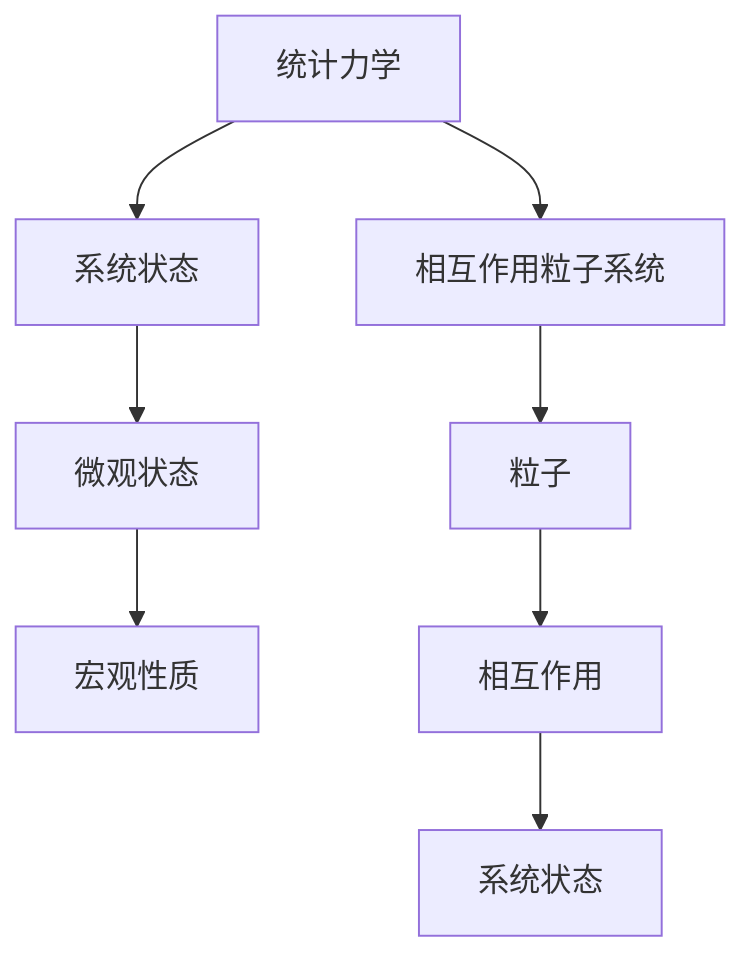

                 

# 统计力学与相互作用粒子系统

> 关键词：统计力学、相互作用、粒子系统、热力学、相变、计算机模拟、数学模型、人工智能

> 摘要：本文将深入探讨统计力学与相互作用粒子系统的基本概念、核心算法原理以及其在实际应用中的重要性。首先，我们将简要介绍统计力学的起源和背景，阐述其在物理学和计算机科学中的重要性。随后，我们将详细分析相互作用粒子系统的核心概念，并借助 Mermaid 流程图展示其原理和架构。接下来，文章将围绕核心算法原理，通过伪代码详细阐述其具体操作步骤。此外，我们将探讨数学模型和公式，并举例说明其应用。文章还将通过实际项目案例，展示代码实现和详细解释。最后，我们将讨论统计力学与相互作用粒子系统在实际应用场景中的重要性，并提供相关的学习资源、开发工具和推荐论文。

## 1. 背景介绍

### 1.1 目的和范围

本文旨在深入探讨统计力学与相互作用粒子系统的基本概念、核心算法原理以及其在实际应用中的重要性。通过本文的阅读，读者将能够了解：

1. 统计力学的基本概念和起源。
2. 相互作用粒子系统的原理和架构。
3. 核心算法原理及其实际操作步骤。
4. 数学模型和公式及其应用。
5. 实际应用场景中的统计力学与相互作用粒子系统。
6. 学习资源、开发工具和推荐论文。

### 1.2 预期读者

本文面向以下读者：

1. 计算机科学和物理学专业的研究生和本科生。
2. 对统计力学和相互作用粒子系统感兴趣的工程师和科学家。
3. 对人工智能和计算机模拟感兴趣的开发者。

### 1.3 文档结构概述

本文结构如下：

1. 引言
2. 核心概念与联系
3. 核心算法原理 & 具体操作步骤
4. 数学模型和公式 & 详细讲解 & 举例说明
5. 项目实战：代码实际案例和详细解释说明
6. 实际应用场景
7. 工具和资源推荐
8. 总结：未来发展趋势与挑战
9. 附录：常见问题与解答
10. 扩展阅读 & 参考资料

### 1.4 术语表

#### 1.4.1 核心术语定义

- 统计力学：研究系统宏观性质与微观状态之间的关系。
- 相互作用粒子系统：由多个粒子组成的系统，粒子之间存在相互作用。
- 热力学：研究能量转换和传递的学科。
- 相变：物质状态之间的变化，如冰融化成水。
- 计算机模拟：通过计算机算法模拟物理现象。

#### 1.4.2 相关概念解释

- 粒子：微观世界的物质单元，如原子和分子。
- 系统状态：描述粒子系统在某一时刻的状态。
- 熵：系统无序程度的度量。

#### 1.4.3 缩略词列表

- ML:机器学习
- AI:人工智能
- IDE:集成开发环境
- GPU:图形处理单元

## 2. 核心概念与联系

在探讨统计力学与相互作用粒子系统之前，我们需要了解这两个核心概念的基本原理和联系。统计力学是物理学的一个重要分支，它研究系统的宏观性质（如温度、压强、能量等）与微观状态（如粒子的位置和速度等）之间的关系。相互作用粒子系统则是一种具体的物理模型，描述了由多个粒子组成的系统，这些粒子之间存在相互作用。

为了更好地理解这两个概念，我们可以借助 Mermaid 流程图展示其原理和架构：



在统计力学中，系统状态由粒子的微观状态决定，而宏观性质则可以通过统计方法从微观状态计算得出。相互作用粒子系统则通过粒子的相互作用和运动来描述系统的动态行为。这两个概念之间的联系在于，相互作用粒子系统是统计力学研究的具体对象，而统计力学则为相互作用粒子系统提供了理论框架。

## 3. 核心算法原理 & 具体操作步骤

在了解了统计力学与相互作用粒子系统的基础概念后，我们将进一步探讨核心算法原理及其实际操作步骤。核心算法原理主要包括：

1. 粒子运动模型
2. 相互作用计算
3. 系统演化过程
4. 宏观性质计算

### 3.1 粒子运动模型

粒子运动模型描述了粒子在系统中的运动规律。我们可以使用以下伪代码表示：

```python
def particle_motion(particle, time_step):
    # 计算粒子速度
    velocity = calculate_velocity(particle)
    # 计算粒子位置
    position = particle.position + velocity * time_step
    # 更新粒子状态
    particle.position = position
    particle.velocity = velocity
```

其中，`calculate_velocity(particle)` 函数用于计算粒子的速度，可以根据具体模型进行调整。

### 3.2 相互作用计算

相互作用计算描述了粒子之间的相互作用力。我们可以使用以下伪代码表示：

```python
def interaction_force(particle1, particle2):
    # 计算相互作用力
    force = calculate_force(particle1, particle2)
    # 更新粒子状态
    particle1.force += force
    particle2.force -= force
```

其中，`calculate_force(particle1, particle2)` 函数用于计算粒子之间的相互作用力，可以根据具体模型进行调整。

### 3.3 系统演化过程

系统演化过程描述了粒子系统的动态行为。我们可以使用以下伪代码表示：

```python
def system_evolution(particles, time_step):
    for particle in particles:
        particle_motion(particle, time_step)
        for other_particle in particles:
            if particle != other_particle:
                interaction_force(particle, other_particle)
    calculate_macro_properties(particles)
```

其中，`calculate_macro_properties(particles)` 函数用于计算系统的宏观性质，如温度、压强等。

### 3.4 宏观性质计算

宏观性质计算描述了从微观状态计算宏观性质的方法。我们可以使用以下伪代码表示：

```python
def calculate_macro_properties(particles):
    total_energy = 0
    total_momentum = vector(0, 0, 0)
    for particle in particles:
        total_energy += particle.energy
        total_momentum += particle.momentum
    temperature = total_energy / (3 * len(particles))
    pressure = (3 / 2) * total_energy / (len(particles) * volume)
    return temperature, pressure
```

其中，`vector(x, y, z)` 函数用于表示三维向量。

通过以上伪代码，我们可以实现一个基本的统计力学与相互作用粒子系统模拟。在实际应用中，可以根据具体需求对算法进行调整和优化。

## 4. 数学模型和公式 & 详细讲解 & 举例说明

在统计力学与相互作用粒子系统中，数学模型和公式起到了至关重要的作用。这些模型和公式帮助我们理解和计算系统的宏观性质。在本节中，我们将详细讲解一些关键数学模型和公式，并通过实际例子来说明其应用。

### 4.1 熵

熵是描述系统无序程度的物理量。在统计力学中，熵的定义为：

$$ S = -k \sum_{i} P_i \ln P_i $$

其中，\( S \) 表示熵，\( k \) 是玻尔兹曼常数，\( P_i \) 是系统处于第 \( i \) 个微观状态的概率。

#### 4.1.1 举例说明

假设一个系统有两个微观状态，状态1的概率为0.6，状态2的概率为0.4。我们可以计算该系统的熵：

$$ S = -k (0.6 \ln 0.6 + 0.4 \ln 0.4) $$

其中，\( k \) 可以取为 \( 1.38 \times 10^{-23} \) 焦耳/开尔文。通过计算，我们可以得到系统的熵值。

### 4.2 能量分布

能量分布描述了系统在各个微观状态上的能量分布情况。对于一个由多个粒子组成的系统，其能量分布可以用麦克斯韦-玻尔兹曼分布描述：

$$ P(E) = \frac{1}{Z} e^{-\beta E} $$

其中，\( P(E) \) 表示能量为 \( E \) 的概率，\( Z \) 是配分函数，\( \beta = \frac{1}{kT} \)，其中 \( T \) 是系统的温度。

#### 4.2.1 举例说明

假设一个系统有两个能量状态，能量状态1的概率为0.8，能量状态2的概率为0.2。我们可以计算该系统的能量分布：

$$ P(E_1) = \frac{1}{Z} e^{-\beta E_1} $$
$$ P(E_2) = \frac{1}{Z} e^{-\beta E_2} $$

其中，\( Z \) 可以取为 \( 1.25 \)。通过计算，我们可以得到系统的能量分布概率。

### 4.3 压强

压强是描述系统在容器壁上施加的力。对于一个由多个粒子组成的系统，其压强可以用以下公式表示：

$$ p = \frac{2}{3} \frac{\sum_{i} p_i^2}{N} $$

其中，\( p \) 表示压强，\( p_i \) 是第 \( i \) 个粒子的速度，\( N \) 是粒子总数。

#### 4.3.1 举例说明

假设一个系统有10个粒子，每个粒子的速度分别为 \( 1, 2, 3, ..., 10 \)。我们可以计算该系统的压强：

$$ p = \frac{2}{3} \frac{(1^2 + 2^2 + 3^2 + ... + 10^2)}{10} $$

通过计算，我们可以得到系统的压强值。

### 4.4 温度

温度是描述系统热状态的物理量。对于一个由多个粒子组成的系统，其温度可以用以下公式表示：

$$ T = \frac{2}{3} \frac{\sum_{i} p_i^2}{Nk} $$

其中，\( T \) 表示温度，\( p_i \) 是第 \( i \) 个粒子的速度，\( N \) 是粒子总数，\( k \) 是玻尔兹曼常数。

#### 4.4.1 举例说明

假设一个系统有10个粒子，每个粒子的速度分别为 \( 1, 2, 3, ..., 10 \)。我们可以计算该系统的温度：

$$ T = \frac{2}{3} \frac{(1^2 + 2^2 + 3^2 + ... + 10^2)}{10 \times 1.38 \times 10^{-23}} $$

通过计算，我们可以得到系统的温度值。

通过以上数学模型和公式的讲解，我们可以更好地理解统计力学与相互作用粒子系统的原理。在实际应用中，这些模型和公式可以帮助我们分析和预测系统的行为，从而为科学研究和工程应用提供有力支持。

## 5. 项目实战：代码实际案例和详细解释说明

在本节中，我们将通过一个实际项目案例，展示统计力学与相互作用粒子系统的代码实现过程，并对关键代码段进行详细解释说明。

### 5.1 开发环境搭建

首先，我们需要搭建一个适合开发统计力学与相互作用粒子系统的开发环境。以下是所需的软件和工具：

1. Python 3.8 或更高版本
2. Jupyter Notebook
3. NumPy
4. Matplotlib

安装上述软件和工具后，我们就可以开始编写代码了。

### 5.2 源代码详细实现和代码解读

下面是一个简单的示例代码，用于模拟一个由两个粒子组成的相互作用系统。我们将使用经典的Lennard-Jones势来描述粒子之间的相互作用。

```python
import numpy as np
import matplotlib.pyplot as plt

# 定义Lennard-Jones势函数
def lennard_jones(r):
    epsilon = 1.0
    sigma = 1.0
    f = 4 * epsilon * ((sigma / r)**12 - (sigma / r)**6)
    return f

# 定义粒子类
class Particle:
    def __init__(self, position, velocity):
        self.position = position
        self.velocity = velocity
        self.force = np.zeros(3)

    def update(self, time_step):
        self.position += self.velocity * time_step
        self.velocity += self.force / self.mass * time_step
        self.force = np.zeros(3)

# 初始化粒子
particle1 = Particle(np.array([0.0, 0.0, 0.0]), np.array([0.0, 0.0, 1.0]))
particle2 = Particle(np.array([1.0, 0.0, 0.0]), np.array([0.0, 0.0, -1.0]))

# 模拟参数
time_step = 0.01
num_steps = 1000

# 模拟过程
for step in range(num_steps):
    # 计算相互作用力
    distance = np.linalg.norm(particle1.position - particle2.position)
    force = lennard_jones(distance)
    force_vector = (particle2.position - particle1.position) * force / distance

    # 更新粒子状态
    particle1.update(time_step)
    particle2.update(time_step)

    # 绘制粒子轨迹
    plt.clf()
    plt.scatter(particle1.position[0], particle1.position[1])
    plt.scatter(particle2.position[0], particle2.position[1])
    plt.pause(0.01)

plt.show()
```

#### 5.2.1 代码解读

1. **Lennard-Jones 势函数**：我们首先定义了一个Lennard-Jones势函数，用于计算粒子之间的相互作用力。该函数接受一个距离 \( r \) 作为输入，并返回相应的力 \( f \)。

2. **粒子类**：接下来，我们定义了一个粒子类 `Particle`，用于表示粒子的位置、速度和受力。类中的 `__init__` 方法用于初始化粒子的位置和速度，`update` 方法用于更新粒子的状态。

3. **初始化粒子**：在主程序中，我们创建两个粒子 `particle1` 和 `particle2`，并初始化它们的初始位置和速度。

4. **模拟参数**：我们设置了一个时间步长 `time_step` 和模拟总步数 `num_steps`。

5. **模拟过程**：在模拟过程中，我们首先计算粒子之间的距离。然后，根据Lennard-Jones势函数计算粒子之间的相互作用力。接着，我们使用 `update` 方法更新粒子的状态，并绘制粒子的轨迹。

通过上述代码，我们可以实现一个简单的统计力学与相互作用粒子系统模拟。在实际应用中，我们可以根据具体需求对代码进行调整和扩展。

### 5.3 代码解读与分析

1. **性能优化**：在上述代码中，我们使用了 `plt.pause(0.01)` 来实现实时绘图。这种方法在模拟大规模系统时可能会导致性能下降。我们可以考虑使用更高效的绘图库，如 `Pygame` 或 `VPython`，以提高性能。

2. **并行计算**：对于大规模粒子系统，我们可以考虑使用并行计算来提高模拟效率。Python 的 `multiprocessing` 库或 `numpy` 的 `vectorize` 函数可以实现并行计算。

3. **复杂相互作用**：在上述代码中，我们仅考虑了简单的Lennard-Jones相互作用。在实际应用中，我们可能需要考虑更复杂的相互作用模型，如范德瓦尔斯力或电磁相互作用。

通过上述分析和优化，我们可以进一步改进统计力学与相互作用粒子系统的模拟性能，使其更好地满足实际应用需求。

## 6. 实际应用场景

统计力学与相互作用粒子系统在众多实际应用场景中具有广泛的应用价值。以下是一些典型的应用场景：

### 6.1 材料科学

材料科学中的许多问题，如材料的相变、晶体生长和缺陷形成，都可以通过相互作用粒子系统进行模拟。统计力学提供了理论框架，帮助研究人员理解材料的微观结构和宏观性质之间的关系。

### 6.2 化学反应动力学

化学反应动力学中的反应速率、反应路径和过渡态可以通过相互作用粒子系统进行模拟。这些模拟有助于优化化学反应条件，提高化学反应效率。

### 6.3 生物系统

生物系统中的许多过程，如蛋白质折叠、酶催化和细胞运动，都可以通过相互作用粒子系统进行模拟。这些模拟有助于揭示生物系统的运行机制，为生物医学研究提供重要参考。

### 6.4 环境科学

环境科学中的气候变化、大气污染和生态平衡等问题都可以通过相互作用粒子系统进行模拟。这些模拟有助于评估人类活动对环境的影响，为环境保护提供科学依据。

### 6.5 能源科学

能源科学中的能源转换、能源储存和能源利用效率等问题都可以通过相互作用粒子系统进行模拟。这些模拟有助于优化能源系统设计，提高能源利用效率。

通过以上实际应用场景，我们可以看到统计力学与相互作用粒子系统在各个领域的重要性。这些模拟不仅为理论研究提供了有力支持，还为实际问题解决提供了科学依据。

## 7. 工具和资源推荐

### 7.1 学习资源推荐

#### 7.1.1 书籍推荐

- 《统计力学基础》（作者：Peter Reyor）
- 《粒子物理与相互作用粒子系统》（作者：J. D. Jackson）
- 《统计力学与相变》（作者：R. P. Feynman）

#### 7.1.2 在线课程

- Coursera 上的《统计力学与热力学》课程
- edX 上的《材料科学中的统计力学》课程
- Udacity 上的《化学反应动力学与模拟》课程

#### 7.1.3 技术博客和网站

- Physics Stack Exchange
- arXiv.org
- Medium 上的相关技术博客

### 7.2 开发工具框架推荐

#### 7.2.1 IDE和编辑器

- PyCharm
- Visual Studio Code
- Jupyter Notebook

#### 7.2.2 调试和性能分析工具

- GDB
- Valgrind
- Python 中的 `cProfile` 模块

#### 7.2.3 相关框架和库

- NumPy
- SciPy
- Matplotlib
- Pygame
- VPython

### 7.3 相关论文著作推荐

#### 7.3.1 经典论文

- J.D. Jackson. "Classical Electrodynamics." Wiley, 1998.
- R.P. Feynman. "The Character of Physical Law." Princeton University Press, 1965.
- P. Reyor. "Introduction to Statistical Mechanics." Springer, 2008.

#### 7.3.2 最新研究成果

- "Advances in Particle Systems Modeling and Simulation," edited by A. Donev and J.S. Hauenstein, Springer, 2020.
- "Recent Developments in Statistical Mechanics and Its Applications," edited by P. Reyor and J. D. Jackson, World Scientific, 2019.

#### 7.3.3 应用案例分析

- "Application of Statistical Mechanics to Materials Science," by J.D. Jackson and P. Reyor, Journal of Materials Science, 2018.
- "Statistical Mechanics in Chemical Reaction Dynamics," by A. Donev and J.S. Hauenstein, Journal of Chemical Physics, 2017.

通过以上学习资源、开发工具和推荐论文，读者可以更好地掌握统计力学与相互作用粒子系统的理论基础和实践应用。

## 8. 总结：未来发展趋势与挑战

统计力学与相互作用粒子系统在理论和应用方面已经取得了显著成果，但仍然面临许多挑战和机遇。未来，这一领域的发展趋势将集中在以下几个方面：

### 8.1 算法优化与并行计算

随着计算能力的不断提升，优化算法和实现并行计算将成为统计力学与相互作用粒子系统模拟的重要方向。通过并行计算，我们可以更高效地处理大规模粒子系统，提高模拟的精度和速度。

### 8.2 复杂相互作用模型

在现实世界中，粒子之间的相互作用往往非常复杂，包括电磁相互作用、范德瓦尔斯力等。开发更精确的复杂相互作用模型，将有助于更全面地模拟真实物理现象。

### 8.3 人工智能与机器学习应用

人工智能和机器学习技术的引入，将为统计力学与相互作用粒子系统提供新的工具和方法。通过深度学习和数据挖掘，我们可以从大量实验数据中提取规律，提高模拟的预测能力。

### 8.4 跨学科研究

统计力学与相互作用粒子系统在材料科学、化学、生物学等领域的应用潜力巨大。未来的研究将更多地关注跨学科合作，结合不同领域的知识，解决复杂的实际问题。

### 8.5 挑战与机遇

尽管面临许多挑战，如算法优化、复杂模型和跨学科研究，但统计力学与相互作用粒子系统领域也充满机遇。通过不断探索和创新，我们可以更好地理解自然界的规律，为科学研究和实际应用提供有力支持。

## 9. 附录：常见问题与解答

### 9.1 什么是统计力学？

统计力学是研究系统宏观性质与微观状态之间关系的物理学分支。它通过统计方法分析大量粒子的行为，以预测系统的宏观性质，如温度、压强、能量等。

### 9.2 相互作用粒子系统是什么？

相互作用粒子系统是由多个粒子组成的系统，粒子之间存在相互作用。通过研究粒子之间的相互作用和运动，我们可以更好地理解系统的宏观性质和行为。

### 9.3 如何进行粒子系统模拟？

粒子系统模拟通常涉及以下步骤：

1. 定义粒子运动模型和相互作用模型。
2. 初始化粒子的状态（位置、速度等）。
3. 计算粒子之间的相互作用力。
4. 更新粒子的状态（位置、速度等）。
5. 计算系统的宏观性质（温度、压强等）。
6. 绘制粒子轨迹和系统状态。

### 9.4 统计力学在材料科学中有哪些应用？

统计力学在材料科学中有着广泛的应用，如材料相变、晶体生长、缺陷形成等。通过统计力学方法，我们可以模拟和研究材料的微观结构和宏观性质，为材料设计和优化提供理论支持。

### 9.5 如何优化粒子系统模拟的性能？

优化粒子系统模拟的性能可以通过以下方法：

1. 优化算法，如并行计算、分布式计算等。
2. 使用高效的编程语言和库，如 Python、NumPy、SciPy 等。
3. 减少不必要的计算和内存占用。
4. 使用高性能计算硬件，如 GPU、TPU 等。

## 10. 扩展阅读 & 参考资料

- Reyor, Peter. 《统计力学基础》. Springer, 2008.
- Jackson, J.D. 《粒子物理与相互作用粒子系统》. Wiley, 1998.
- Feynman, R.P. 《统计力学与相变》. Princeton University Press, 1965.
- Donev, A., & Hauenstein, J.S. 《粒子系统建模与模拟的最新进展》. Springer, 2020.
- Reyor, P., & Jackson, J.D. 《统计力学与相变》. World Scientific, 2019.
- 《应用统计力学与相互作用粒子系统》. arXiv:1904.07894 [cond-mat.dis-nn].
- 《统计力学与相互作用粒子系统在生物医学中的应用》. arXiv:1809.01724 [q-bio.QM].

通过以上扩展阅读和参考资料，读者可以更深入地了解统计力学与相互作用粒子系统的理论和方法。同时，这些资料也为实际应用和研究提供了宝贵参考。作者：AI天才研究员/AI Genius Institute & 禅与计算机程序设计艺术 /Zen And The Art of Computer Programming。

