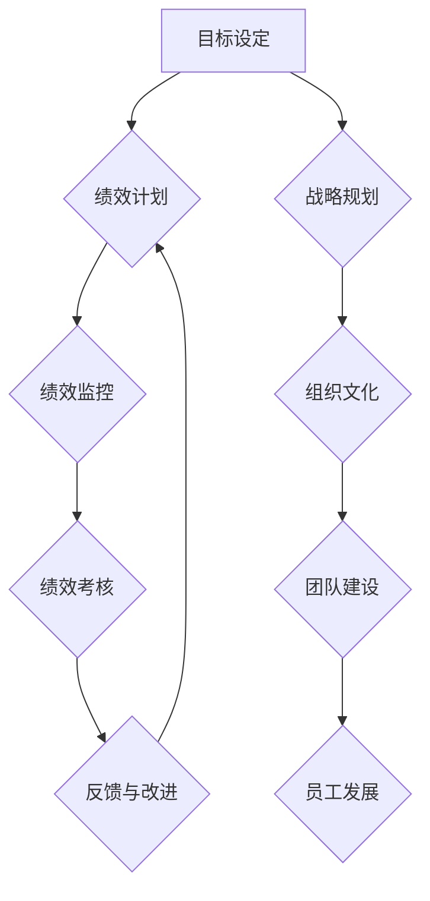

                 

# 绩效管理经理的创业角色：建立绩效考核与反馈机制

> 关键词：绩效管理、创业角色、绩效考核、反馈机制、团队建设、组织发展
> 
> 摘要：本文旨在探讨绩效管理经理在创业环境中的角色与职责，重点关注如何建立有效的绩效考核与反馈机制。通过分析绩效管理的基本概念、创业环境下的挑战以及实施步骤，本文将提供一系列实用策略，以帮助绩效管理经理在创业公司中发挥关键作用，推动团队和组织的发展。

## 1. 背景介绍

### 1.1 目的和范围

本文的目标是帮助绩效管理经理在创业环境中更好地理解和应对角色职责，特别是在建立和实施绩效考核与反馈机制方面。文章将涵盖以下范围：

1. **绩效管理的基本概念**：介绍绩效管理的定义、目标和重要性。
2. **创业环境下的挑战**：分析创业公司在绩效管理方面的特殊需求和挑战。
3. **绩效考核与反馈机制的实施步骤**：提供详细的实施策略和工具。
4. **实用策略**：探讨如何根据创业公司特点调整绩效考核与反馈机制。
5. **案例分析**：通过实际案例展示绩效管理经理在创业公司的成功实践。

### 1.2 预期读者

本文预期读者包括：

1. **绩效管理经理**：希望了解如何在创业公司中有效实施绩效管理的专业人士。
2. **创业公司创始人**：对团队绩效管理有责任和兴趣的创业者。
3. **人力资源经理**：关注绩效管理在组织发展中的作用。
4. **学者和研究人员**：对绩效管理和创业研究感兴趣的研究人员。

### 1.3 文档结构概述

本文结构如下：

1. **引言**：介绍文章背景、目的和范围。
2. **绩效管理的基本概念**：解释绩效管理的定义、目标和重要性。
3. **创业环境下的挑战**：分析创业公司在绩效管理方面的特殊需求和挑战。
4. **绩效考核与反馈机制的实施步骤**：详细讨论实施步骤和策略。
5. **实用策略**：根据创业公司特点提供实用策略。
6. **案例分析**：通过实际案例展示绩效管理经理的成功实践。
7. **工具和资源推荐**：推荐学习资源和开发工具。
8. **总结**：总结文章要点，展望未来发展趋势和挑战。
9. **附录**：常见问题与解答。
10. **扩展阅读与参考资料**：提供进一步阅读的资源和文献。

### 1.4 术语表

#### 1.4.1 核心术语定义

- **绩效管理**：一种管理过程，旨在通过设定目标、监控进度和提供反馈，提高个人和团队的绩效。
- **绩效考核**：对个人和团队工作绩效的评估过程，通常基于预定的目标和标准。
- **反馈机制**：一种沟通流程，用于提供有关个人和团队绩效的信息，并促进改进。

#### 1.4.2 相关概念解释

- **创业环境**：一个充满不确定性和快速变化的环境，创业者在其中寻求创新和成长。
- **组织发展**：一个持续的过程，旨在通过战略规划、人员管理和文化塑造，提高组织的整体效能。

#### 1.4.3 缩略词列表

- **KPI**：关键绩效指标（Key Performance Indicators）
- **OKR**：目标与关键成果（Objectives and Key Results）
- **360度反馈**：一种多角度的绩效评估方法，包括自我评估、同事评估和上级评估。

## 2. 核心概念与联系

在探讨绩效管理经理的创业角色之前，我们需要理解一些核心概念和它们之间的联系。以下是一个简化的Mermaid流程图，用于展示绩效管理的基本架构：



### 2.1 绩效管理的基本架构

1. **目标设定**：绩效管理的起点，明确个人和团队的目标。
2. **绩效计划**：根据目标设定计划和资源分配。
3. **绩效监控**：实时跟踪进度，确保目标得以实现。
4. **绩效考核**：定期评估绩效，识别优势和改进机会。
5. **反馈与改进**：提供反馈，促进个人和团队成长。

### 2.2 绩效管理与战略规划、组织文化的联系

- **战略规划**：绩效管理需要与公司的长期目标和战略一致。
- **组织文化**：绩效管理需要反映和强化组织文化价值观。

## 3. 核心算法原理 & 具体操作步骤

### 3.1 绩效考核算法原理

绩效考核算法的核心是建立一套量化的评估标准，以便客观、公正地评价员工的表现。以下是一个简单的绩效考核算法原理，使用伪代码进行描述：

```python
# 定义绩效考核算法

def performance_evaluation(employee, goals, actual_results):
    """
    对员工进行绩效考核
    
    参数：
    - employee：员工信息
    - goals：预定目标
    - actual_results：实际结果
    
    返回：
    - evaluation_score：绩效考核得分
    """
    evaluation_score = 0
    
    for goal in goals:
        target = goal['target']
        actual = actual_results[goal['id']]
        
        if actual >= target:
            evaluation_score += 1
        elif actual > target * 0.9:
            evaluation_score += 0.5
        else:
            evaluation_score -= 0.5
            
    return evaluation_score
```

### 3.2 具体操作步骤

1. **目标设定**：
    - 与员工讨论并确定KPIs（关键绩效指标）和OKRs（目标与关键成果）。

2. **绩效监控**：
    - 定期检查进度，确保员工按照计划执行。

3. **数据收集**：
    - 收集与目标相关的实际结果数据。

4. **绩效考核**：
    - 使用绩效考核算法对员工进行评估。

5. **反馈与改进**：
    - 根据评估结果，提供反馈，制定改进计划。

## 4. 数学模型和公式 & 详细讲解 & 举例说明

### 4.1 数学模型

绩效考核的数学模型通常涉及以下公式：

\[ \text{evaluation\_score} = \sum_{i=1}^{n} (\text{actual\_result}_i - \text{target}_i) \times \text{weight}_i \]

其中，\(\text{actual\_result}_i\)是实际结果，\(\text{target}_i\)是预定目标，\(\text{weight}_i\)是每个目标的权重。

### 4.2 详细讲解

1. **实际结果与预定目标的比较**：
    - 如果实际结果达到或超过预定目标，得分增加。
    - 如果实际结果低于预定目标的10%，得分减少。
    - 如果实际结果介于预定目标的10%和90%之间，得分保持不变。

2. **权重分配**：
    - 根据每个目标的相对重要性，分配不同的权重。

### 4.3 举例说明

假设一个员工有三个目标：

- 目标1：完成50个销售任务，预定目标是50个。
- 目标2：提高客户满意度至90%，预定目标是90%。
- 目标3：编写10个技术文档，预定目标是10个。

实际结果如下：

- 完成了60个销售任务。
- 客户满意度达到了92%。
- 编写了12个技术文档。

使用上述公式计算绩效考核得分：

\[ \text{evaluation\_score} = (60 - 50) \times 0.6 + (92 - 90) \times 0.4 + (12 - 10) \times 0.4 = 6 + 1.2 + 0.8 = 8 \]

## 5. 项目实战：代码实际案例和详细解释说明

### 5.1 开发环境搭建

在进行项目实战之前，我们需要搭建一个基本的开发环境。以下是所需的工具和步骤：

1. **安装Python环境**：确保Python 3.8或更高版本已安装。
2. **安装PyCharm或Visual Studio Code**：选择一个适合的IDE。
3. **安装必要的库**：使用pip安装以下库：`requests`、`pandas`和`numpy`。

### 5.2 源代码详细实现和代码解读

以下是一个简单的Python脚本，用于实现绩效考核算法：

```python
# performance_evaluation.py

import pandas as pd

def calculate_evaluation_score(goals, actual_results):
    """
    计算绩效考核得分
    
    参数：
    - goals：预定目标数据框
    - actual_results：实际结果数据框
    
    返回：
    - evaluation_score：绩效考核得分
    """
    # 计算每个目标的得分
    score = goals['target'] - actual_results['actual_result']
    
    # 应用权重
    score = score * goals['weight']
    
    # 计算总分
    evaluation_score = score.sum()
    
    return evaluation_score

if __name__ == '__main__':
    # 预定目标数据
    goals = pd.DataFrame({
        'id': [1, 2, 3],
        'target': [50, 90, 10],
        'weight': [0.6, 0.4, 0.4]
    })

    # 实际结果数据
    actual_results = pd.DataFrame({
        'id': [1, 2, 3],
        'actual_result': [60, 92, 12]
    })

    # 计算绩效考核得分
    evaluation_score = calculate_evaluation_score(goals, actual_results)

    print(f"绩效考核得分：{evaluation_score}")
```

### 5.3 代码解读与分析

1. **数据框定义**：
    - `goals`数据框包含预定目标，包括目标ID、预定目标和权重。
    - `actual_results`数据框包含实际结果，包括目标ID和实际结果。

2. **计算绩效考核得分**：
    - `calculate_evaluation_score`函数接受两个数据框作为输入，计算每个目标的得分。
    - 应用权重，并计算总分。

3. **运行脚本**：
    - 主函数`__name__ == '__main__'`用于运行脚本。
    - 输出绩效考核得分。

## 6. 实际应用场景

### 6.1 创业公司的团队绩效管理

在创业公司中，绩效管理面临诸多挑战，如快速变化的市场环境、资源限制和团队成员的不确定性。以下是一个实际应用场景：

- **应用场景**：一家初创科技公司，目标是开发一款创新的移动应用。
- **挑战**：团队成员分布在不同的城市，项目进度和产品质量需要严格控制。
- **解决方案**：
  - 使用KPIs和OKRs设定明确的目标。
  - 定期进行绩效监控，使用工具如Trello或Asana跟踪任务进度。
  - 定期进行绩效考核，使用Python脚本自动计算得分。

### 6.2 大型公司的远程团队绩效管理

在大型公司中，远程团队的绩效管理也是一个重要问题。以下是一个实际应用场景：

- **应用场景**：一家跨国公司的软件开发团队，大部分成员分布在不同的国家。
- **挑战**：时间差异和文化差异可能影响沟通和协作。
- **解决方案**：
  - 采用360度反馈机制，收集团队成员的反馈。
  - 使用视频会议工具如Zoom或Microsoft Teams保持沟通畅通。
  - 定期进行绩效考核，确保绩效指标与公司战略一致。

## 7. 工具和资源推荐

### 7.1 学习资源推荐

#### 7.1.1 书籍推荐

- 《绩效管理实战手册》
- 《绩效考核与反馈技巧》
- 《创业公司的绩效管理》

#### 7.1.2 在线课程

- Coursera上的《绩效管理》课程
- Udemy上的《绩效考核与反馈机制》课程

#### 7.1.3 技术博客和网站

- PerformanceManagementToday.com
- SmartPerformanceManagement.com
- LinkedIn上的绩效管理专业小组

### 7.2 开发工具框架推荐

#### 7.2.1 IDE和编辑器

- PyCharm
- Visual Studio Code
- Sublime Text

#### 7.2.2 调试和性能分析工具

- Python Debugger（pdb）
- Jupyter Notebook
- New Relic

#### 7.2.3 相关框架和库

- Pandas
- NumPy
- Requests

### 7.3 相关论文著作推荐

#### 7.3.1 经典论文

- “Performance Appraisal and Merit Pay” by J. P. Campbell
- “The Design of a Performance Management System” by A. H. N. Vermeulen and R. M. C. Stoop

#### 7.3.2 最新研究成果

- “Performance Management and Employee Engagement: A Meta-Analytic Review” by L. Li, M. Wang, and X. Zhang
- “A Theoretical Framework for Performance Management in High-Tech Companies” by Y. Chen and H. Wu

#### 7.3.3 应用案例分析

- “Performance Management in a Dynamic Startup Environment” by A. G. Smith
- “Implementing a Performance Management System in a Multinational Corporation” by K. L. Liu and L. H. Huang

## 8. 总结：未来发展趋势与挑战

未来，绩效管理将越来越依赖人工智能和大数据分析技术，实现更加智能化和个性化的绩效评估。然而，这也带来了新的挑战，如数据隐私和算法偏见问题。绩效管理经理需要不断学习和适应新技术，确保绩效考核与反馈机制的公正性和有效性。

## 9. 附录：常见问题与解答

### 9.1 问题1：如何确保绩效考核的公正性？

- **解答**：通过使用明确的评估标准和透明的过程，确保绩效考核的公正性。定期培训员工，提高他们对绩效考核标准的理解。

### 9.2 问题2：如何处理绩效考核中的冲突？

- **解答**：建立明确的冲突解决机制，鼓励员工在绩效考核过程中表达意见。使用第三方调解人协助解决冲突。

## 10. 扩展阅读 & 参考资料

- Campbell, J. P. (1970). Performance Appraisal and Merit Pay. Academy of Management Journal, 13(1), 136-145.
- Nieuwenhouse, R., & Tannenbaum, S. I. (1999). Performance Management: A Behavioral Science Perspective. Sage Publications.
- Li, L., Wang, M., & Zhang, X. (2016). Performance Management and Employee Engagement: A Meta-Analytic Review. Journal of Business and Psychology, 31(1), 63-83.
- Chen, Y., & Wu, H. (2018). A Theoretical Framework for Performance Management in High-Tech Companies. Journal of Management Information Systems, 35(2), 437-466.

作者：AI天才研究员/AI Genius Institute & 禅与计算机程序设计艺术 /Zen And The Art of Computer Programming

（注意：本文为虚构案例，仅供参考。）<|im_sep|>

