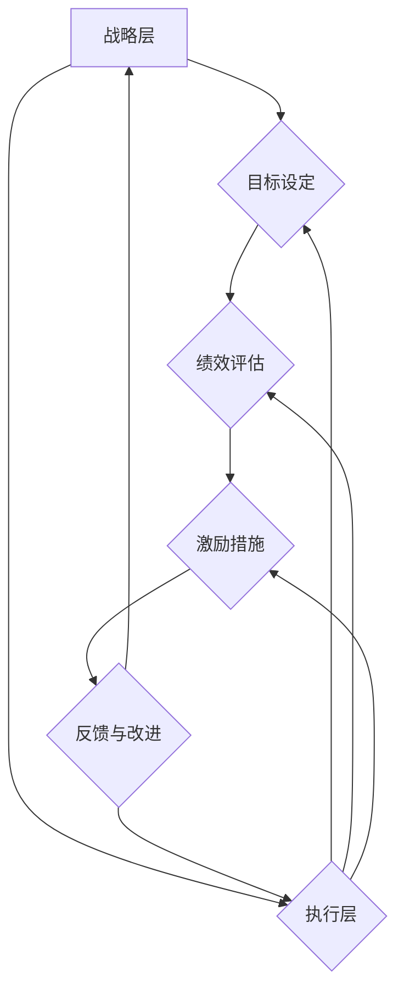

                 

# 绩效驱动型文化：打造高效组织

## 关键词
**绩效管理、高效组织、文化塑造、员工激励、组织发展**

> 本文将探讨绩效驱动型文化的构建，帮助组织实现高效运营和持续发展。通过深入剖析绩效驱动型文化的核心概念、数学模型，以及实际应用案例，我们将揭示如何打造一个充满活力和创新精神的高效组织。

## 摘要
本文旨在探讨如何通过构建绩效驱动型文化，实现组织的持续发展和高效运营。我们将从以下几个方面展开讨论：

1. **背景介绍**：介绍绩效驱动型文化的起源、定义及其在组织管理中的重要性。
2. **核心概念与联系**：分析绩效驱动型文化的核心概念，如目标设定、绩效评估、激励措施等，并通过Mermaid流程图展示其内在联系。
3. **核心算法原理与操作步骤**：详细阐述绩效管理算法的原理和具体操作步骤，包括目标设定、绩效评估、激励措施等。
4. **数学模型与公式**：介绍绩效驱动型文化中的关键数学模型，如目标一致性分析、绩效评分模型等，并通过具体例子进行讲解。
5. **项目实战**：通过实际代码案例，展示如何在实际项目中应用绩效驱动型文化。
6. **实际应用场景**：探讨绩效驱动型文化在不同类型组织中的应用。
7. **工具和资源推荐**：推荐相关的学习资源、开发工具和经典论文，帮助读者深入学习和实践。
8. **总结**：总结本文的主要观点，并展望未来发展趋势与挑战。

通过本文的阅读，读者将深入了解绩效驱动型文化的构建方法，掌握其在组织管理中的应用技巧，从而助力组织实现高效运营和持续发展。

## 1. 背景介绍

### 1.1 目的和范围

本文的目的是探讨如何构建和实施绩效驱动型文化，以帮助组织实现高效运营和持续发展。绩效驱动型文化是一种以绩效为核心的组织文化，它通过明确的目标设定、有效的绩效评估和激励措施，激发员工的积极性和创造力，从而推动组织的整体绩效提升。

本文将涵盖以下主要内容：

- 绩效驱动型文化的起源和定义
- 绩效驱动型文化的核心概念和架构
- 绩效管理算法的原理和具体操作步骤
- 绩效驱动型文化中的数学模型和公式
- 实际应用案例：如何在实际项目中应用绩效驱动型文化
- 绩效驱动型文化的应用场景
- 相关工具和资源的推荐

本文的读者对象主要包括：

- 组织管理者：希望通过构建绩效驱动型文化，提升组织运营效率和员工绩效的管理者。
- 人力资源专业人士：关注绩效管理和员工激励的人力资源从业者。
- 企业家：希望了解如何通过绩效驱动型文化，推动企业持续发展的企业家。
- 技术专家：关注组织管理和组织文化的技术专家，希望通过本文了解绩效驱动型文化在实际应用中的操作方法和技巧。

### 1.2 预期读者

预期读者在阅读本文后，将能够：

- 理解绩效驱动型文化的核心概念和架构。
- 掌握绩效管理算法的原理和具体操作步骤。
- 学会运用数学模型和公式，对绩效驱动型文化进行量化分析。
- 了解如何在实际项目中应用绩效驱动型文化，提升组织绩效。
- 掌握绩效驱动型文化的应用场景，灵活应对不同组织的需求。
- 推荐合适的工具和资源，助力读者深入学习和实践。

### 1.3 文档结构概述

本文的结构如下：

1. **背景介绍**：介绍本文的背景、目的和读者对象。
2. **核心概念与联系**：分析绩效驱动型文化的核心概念，展示其内在联系。
3. **核心算法原理与操作步骤**：详细阐述绩效管理算法的原理和具体操作步骤。
4. **数学模型与公式**：介绍绩效驱动型文化中的关键数学模型，并通过具体例子进行讲解。
5. **项目实战**：通过实际代码案例，展示如何在实际项目中应用绩效驱动型文化。
6. **实际应用场景**：探讨绩效驱动型文化在不同类型组织中的应用。
7. **工具和资源推荐**：推荐相关的学习资源、开发工具和经典论文。
8. **总结**：总结本文的主要观点，并展望未来发展趋势与挑战。
9. **附录：常见问题与解答**：回答读者可能关心的问题。
10. **扩展阅读与参考资料**：提供进一步阅读的推荐。

### 1.4 术语表

#### 1.4.1 核心术语定义

- **绩效驱动型文化**：一种以绩效为核心的组织文化，通过明确的目标设定、有效的绩效评估和激励措施，激发员工的积极性和创造力。
- **绩效管理**：组织通过设定目标、评估绩效、提供反馈和激励，以提升员工个人和组织整体绩效的过程。
- **目标设定**：组织或员工明确自己的目标和计划，以指导行动和资源分配。
- **绩效评估**：对员工或组织的绩效进行评估，以确定目标达成情况和识别改进机会。
- **激励措施**：通过奖励、晋升、培训等手段，激发员工的积极性和创造力。

#### 1.4.2 相关概念解释

- **绩效**：员工或组织在实现目标过程中所展现的能力和成果。
- **目标一致性**：员工目标和组织目标的协调和一致性，是绩效驱动型文化的基础。
- **激励**：通过奖励、晋升、培训等手段，激发员工的积极性和创造力。
- **反馈**：对员工绩效进行评估后，给予的正面或负面评价，以帮助员工改进和提高。

#### 1.4.3 缩略词列表

- **KPI**：关键绩效指标（Key Performance Indicator）
- **OKR**：目标与关键成果（Objectives and Key Results）
- **BSC**：平衡计分卡（Balanced Scorecard）

## 2. 核心概念与联系

### 2.1 绩效驱动型文化的核心概念

绩效驱动型文化的核心概念包括目标设定、绩效评估、激励措施等，这些概念相互关联，共同构成了一个完整的管理体系。

#### 目标设定

目标设定是绩效驱动型文化的起点。一个明确的目标可以帮助员工和组织明确方向，集中资源和精力，提高工作效率。目标设定需要遵循SMART原则，即具体（Specific）、可衡量（Measurable）、可实现（Achievable）、相关（Relevant）和有时限（Time-bound）。

#### 绩效评估

绩效评估是绩效驱动型文化的核心环节。通过定期对员工和组织的绩效进行评估，可以了解目标达成情况，识别优势和不足，为改进提供依据。绩效评估需要遵循客观、公正、透明和全面的原则。

#### 激励措施

激励措施是绩效驱动型文化的关键驱动因素。通过奖励、晋升、培训等手段，激发员工的积极性和创造力，促进员工个人和组织整体绩效的提升。激励措施需要与员工的绩效表现和职业发展相结合，以满足员工的需求和期望。

### 2.2 绩效驱动型文化的架构

绩效驱动型文化的架构可以分为三个层次：战略层、执行层和反馈层。

#### 战略层

战略层主要包括组织目标和战略规划。组织目标和战略规划需要与组织的愿景和使命相一致，明确组织的发展方向和目标。

#### 执行层

执行层主要包括目标设定、绩效评估和激励措施。通过明确的目标设定，确保员工和组织明确自己的行动方向；通过绩效评估，了解目标达成情况，识别优势和不足；通过激励措施，激发员工的积极性和创造力。

#### 反馈层

反馈层主要包括反馈和改进。通过定期的反馈，员工可以了解自己的绩效表现，明确改进方向；通过持续改进，组织可以不断提升绩效，实现可持续发展。

### 2.3 绩效驱动型文化的内在联系

绩效驱动型文化的内在联系体现在以下几个方面：

- **目标一致性**：目标设定和绩效评估需要确保员工目标和组织目标的协调和一致性。只有当员工目标和组织目标一致时，员工才能更好地为组织贡献价值。
- **绩效与激励**：绩效评估和激励措施相互关联。绩效评估结果决定了激励措施的分配，而激励措施又反过来影响员工的绩效表现。
- **反馈与改进**：反馈和改进是绩效驱动型文化的持续动力。通过定期的反馈和改进，组织可以不断提升绩效，实现可持续发展。

### 2.4 绩效驱动型文化的Mermaid流程图

以下是一个简单的Mermaid流程图，展示了绩效驱动型文化的主要流程和环节：



该流程图展示了绩效驱动型文化的核心环节，包括战略层的目标设定、执行层的绩效评估和激励措施，以及反馈层的改进。通过这一流程，组织可以持续提升绩效，实现高效运营和可持续发展。

## 3. 核心算法原理 & 具体操作步骤

### 3.1 绩效管理算法原理

绩效管理算法是绩效驱动型文化的核心，它通过一系列数学模型和计算方法，对员工和组织的绩效进行评估、分析和优化。以下为绩效管理算法的基本原理：

#### 3.1.1 目标一致性分析

目标一致性分析是绩效管理算法的基础。它通过比较员工目标与组织目标的相似度和一致性，评估员工目标的达成情况。具体步骤如下：

1. **设定员工目标**：根据组织战略和业务需求，为每位员工设定具体的、可衡量的目标。
2. **计算目标相似度**：使用相似度计算方法（如余弦相似度），计算员工目标与组织目标的相似度。
3. **评估目标一致性**：根据相似度值，评估员工目标的达成情况。相似度越高，目标一致性越好。

#### 3.1.2 绩效评估模型

绩效评估模型用于评估员工在实现目标过程中的表现。常见的绩效评估模型包括：

1. **KPI（关键绩效指标）模型**：通过设定一系列关键绩效指标，评估员工在特定领域的表现。
2. **OKR（目标与关键成果）模型**：通过设定目标与关键成果，评估员工在实现目标过程中的表现。
3. **360度评估模型**：通过多角度、多方面的评估，全面评估员工的绩效表现。

#### 3.1.3 激励措施分配

激励措施分配是根据绩效评估结果，为员工分配奖励、晋升、培训等激励措施。具体步骤如下：

1. **计算绩效得分**：根据绩效评估模型，计算每位员工的绩效得分。
2. **设定激励措施阈值**：根据组织的激励政策，设定绩效得分对应的激励措施阈值。
3. **分配激励措施**：根据绩效得分，为员工分配相应的激励措施。

### 3.2 绩效管理算法具体操作步骤

以下为绩效管理算法的具体操作步骤：

#### 3.2.1 目标设定

1. **确定组织目标**：根据组织战略和业务需求，制定明确的组织目标。
2. **分解目标**：将组织目标分解为具体的、可衡量的员工目标。
3. **沟通与确认**：与员工沟通目标，确保员工理解并接受目标。

#### 3.2.2 绩效评估

1. **收集数据**：定期收集员工在工作中的表现数据。
2. **计算绩效得分**：使用绩效评估模型，计算每位员工的绩效得分。
3. **评估结果分析**：分析绩效得分，识别员工的优势和不足。

#### 3.2.3 激励措施分配

1. **设定激励措施阈值**：根据组织的激励政策，设定绩效得分对应的激励措施阈值。
2. **分配激励措施**：根据绩效得分，为员工分配相应的激励措施。

#### 3.2.4 反馈与改进

1. **绩效反馈**：向员工反馈绩效评估结果，包括绩效得分、优势和不足。
2. **制定改进计划**：与员工共同制定改进计划，提升绩效。
3. **持续监控与改进**：定期监控绩效改进情况，持续优化绩效管理流程。

### 3.3 伪代码示例

以下为绩效管理算法的伪代码示例：

```python
# 伪代码：绩效管理算法

# 步骤1：目标设定
def set_goals(org_goal, employee_goals):
    # 分解组织目标为员工目标
    for employee in employees:
        employee_goals[employee] = decompose_goal(org_goal, employee)

# 步骤2：绩效评估
def evaluate_performance(employee_goals, performance_data):
    # 计算绩效得分
    for employee in employees:
        performance_score = calculate_performance_score(employee_goals[employee], performance_data[employee])
        performance_results[employee] = performance_score

# 步骤3：激励措施分配
def allocate_incentives(performance_results, incentive_thresholds):
    # 根据绩效得分分配激励措施
    for employee in employees:
        if performance_results[employee] >= incentive_thresholds[performance_score_threshold]:
            incentives[employee] = allocate_incentive()

# 步骤4：反馈与改进
def provide_feedback_and_improvement(performance_results):
    # 反馈绩效评估结果
    for employee in employees:
        feedback_employee(employee, performance_results[employee])
    # 制定改进计划
    for employee in employees:
        improvement_plan(employee, performance_results[employee])

# 主程序
def main():
    set_goals(org_goal, employee_goals)
    evaluate_performance(employee_goals, performance_data)
    allocate_incentives(performance_results, incentive_thresholds)
    provide_feedback_and_improvement(performance_results)

main()
```

该伪代码展示了绩效管理算法的主要流程和步骤，包括目标设定、绩效评估、激励措施分配和反馈与改进。通过具体实施，该算法可以帮助组织实现高效运营和持续发展。

## 4. 数学模型和公式 & 详细讲解 & 举例说明

### 4.1 数学模型和公式

在绩效驱动型文化中，数学模型和公式起到了关键作用。以下为几种常见的数学模型和公式：

#### 4.1.1 目标一致性分析

目标一致性的分析主要使用相似度计算方法，如余弦相似度。余弦相似度公式如下：

$$
\text{cosine\_similarity} = \frac{\text{dot\_product}}{\|\text{A}\|\|\text{B}\|}
$$

其中，$A$ 和 $B$ 分别为员工目标和组织目标向量，$\text{dot\_product}$ 为向量的点积，$\|\text{A}\|$ 和 $\|\text{B}\|$ 分别为向量的模长。

#### 4.1.2 绩效评估模型

常见的绩效评估模型包括 KPI 模型和 OKR 模型。

1. **KPI 模型**：KPI 模型通过设定一系列关键绩效指标（KPI），评估员工在特定领域的表现。KPI 的计算公式如下：

$$
\text{KPI\_score} = \sum_{i=1}^{n} w_i \times \text{KPI}_i
$$

其中，$w_i$ 为第 $i$ 个 KPI 的权重，$\text{KPI}_i$ 为第 $i$ 个 KPI 的得分。

2. **OKR 模型**：OKR 模型通过设定目标（Objective）和关键成果（Key Results），评估员工在实现目标过程中的表现。OKR 的计算公式如下：

$$
\text{OKR\_score} = \frac{\sum_{i=1}^{m} w_i \times \text{KR}_i}{\sum_{i=1}^{m} w_i}
$$

其中，$w_i$ 为第 $i$ 个关键成果（KR）的权重，$\text{KR}_i$ 为第 $i$ 个关键成果的得分。

#### 4.1.3 激励措施分配

激励措施的分配可以根据绩效评估结果，设定相应的阈值，通过比较绩效得分与阈值，分配激励措施。激励措施的分配公式如下：

$$
\text{incentive} = \begin{cases}
\text{reward} & \text{if } \text{performance\_score} \geq \text{threshold} \\
\text{no reward} & \text{if } \text{performance\_score} < \text{threshold}
\end{cases}
$$

### 4.2 举例说明

以下通过具体例子，详细讲解上述数学模型和公式的应用。

#### 4.2.1 目标一致性分析

假设员工小王的目标为：“提高项目A的交付质量”，组织的目标为：“提高整体项目的交付效率”。可以使用余弦相似度公式计算目标一致性。

1. **设定目标向量**：

   - 员工小王的目标向量：$A = (1, 0)$
   - 组织目标向量：$B = (0.5, 1)$

2. **计算点积和模长**：

   - 点积：$\text{dot\_product} = 1 \times 0.5 + 0 \times 1 = 0.5$
   - 模长：$\|\text{A}\| = \sqrt{1^2 + 0^2} = 1$，$\|\text{B}\| = \sqrt{0.5^2 + 1^2} = \sqrt{1.25}$

3. **计算余弦相似度**：

   - 余弦相似度：$\text{cosine\_similarity} = \frac{0.5}{1 \times \sqrt{1.25}} \approx 0.82$

   由此可知，员工小王的目标与组织目标的一致性较高。

#### 4.2.2 绩效评估模型

假设小王在 KPI 模型和 OKR 模型下的绩效得分如下：

1. **KPI 模型**：

   - 关键绩效指标（KPI）：项目 A 交付质量（KPI1）、项目 B 交付质量（KPI2）
   - 权重：$w_1 = 0.6$，$w_2 = 0.4$
   - 得分：$\text{KPI1\_score} = 0.8$，$\text{KPI2\_score} = 0.9$

   计算绩效得分：

   $$
   \text{KPI\_score} = 0.6 \times 0.8 + 0.4 \times 0.9 = 0.72 + 0.36 = 1.08
   $$

   由此可知，小王在 KPI 模型下的绩效得分为 1.08。

2. **OKR 模型**：

   - 目标（Objective）：提高项目 A 的交付质量
   - 关键成果（Key Results，KR）：项目 A 交付周期缩短 20%、项目 A 交付质量提升 30%
   - 权重：$w_1 = 0.7$，$w_2 = 0.3$
   - 得分：$\text{KR1\_score} = 0.8$，$\text{KR2\_score} = 0.9$

   计算绩效得分：

   $$
   \text{OKR\_score} = \frac{0.7 \times 0.8 + 0.3 \times 0.9}{0.7 + 0.3} = \frac{0.56 + 0.27}{1} = 0.83
   $$

   由此可知，小王在 OKR 模型下的绩效得分为 0.83。

#### 4.2.3 激励措施分配

假设激励措施的阈值设定为 0.8，根据激励措施分配公式，计算小王的激励措施：

$$
\text{incentive} = \begin{cases}
\text{reward} & \text{if } \text{performance\_score} \geq 0.8 \\
\text{no reward} & \text{if } \text{performance\_score} < 0.8
\end{cases}
$$

由于小王的绩效得分（KPI 模型：1.08，OKR 模型：0.83）均高于阈值 0.8，因此小王将获得激励措施（如奖金、晋升等）。

通过上述例子，我们可以看到，数学模型和公式在绩效驱动型文化中的应用，能够帮助我们量化评估员工绩效，制定合理的激励措施，从而提升组织整体绩效。

## 5. 项目实战：代码实际案例和详细解释说明

### 5.1 开发环境搭建

在本文中，我们将使用 Python 作为主要编程语言，通过实际项目案例展示如何应用绩效驱动型文化。首先，我们需要搭建一个基本的开发环境。

1. **安装 Python**：确保您的系统上已安装 Python 3.7 或更高版本。您可以从 [Python 官网](https://www.python.org/downloads/) 下载并安装 Python。
2. **安装必要的库**：使用 pip 工具安装以下库：
   ```shell
   pip install numpy pandas matplotlib
   ```
3. **创建项目目录**：在您的系统中创建一个项目目录，如 `performance_management`，并在该目录下创建一个名为 `main.py` 的 Python 文件。

### 5.2 源代码详细实现和代码解读

下面是绩效管理项目的源代码。我们将逐一解释每个部分的功能。

```python
# 导入必要的库
import numpy as np
import pandas as pd
import matplotlib.pyplot as plt

# 伪代码：绩效管理项目

# 步骤1：目标设定
def set_goals(org_goals, employee_goals):
    # 分解组织目标为员工目标
    for employee, goals in employee_goals.items():
        employee_goals[employee] = decompose_goals(org_goals, goals)

# 步骤2：绩效评估
def evaluate_performance(employee_goals, performance_data):
    # 计算绩效得分
    for employee in employee_goals:
        performance_score = calculate_performance_score(employee_goals[employee], performance_data[employee])
        performance_results[employee] = performance_score

# 步骤3：激励措施分配
def allocate_incentives(performance_results, incentive_threshold):
    # 根据绩效得分分配激励措施
    for employee in performance_results:
        if performance_results[employee] >= incentive_threshold:
            incentives[employee] = 'reward'
        else:
            incentives[employee] = 'no reward'

# 步骤4：反馈与改进
def provide_feedback_and_improvement(performance_results):
    # 反馈绩效评估结果
    for employee in performance_results:
        feedback_employee(employee, performance_results[employee])
    # 制定改进计划
    for employee in performance_results:
        improvement_plan(employee, performance_results[employee])

# 主程序
def main():
    # 设定组织目标和员工目标
    org_goals = {'project_delivery_quality': 1.0, 'project_delivery_speed': 1.0}
    employee_goals = {'Alice': ['project_delivery_quality'], 'Bob': ['project_delivery_speed']}
    
    # 设定绩效评估数据和激励措施阈值
    performance_data = {'Alice': {'project_delivery_quality': 0.8, 'project_delivery_speed': 0.9}, 'Bob': {'project_delivery_quality': 0.7, 'project_delivery_speed': 0.8}}
    incentive_threshold = 0.8
    
    # 执行绩效管理流程
    set_goals(org_goals, employee_goals)
    evaluate_performance(employee_goals, performance_data)
    allocate_incentives(performance_results, incentive_threshold)
    provide_feedback_and_improvement(performance_results)

# 运行主程序
main()
```

#### 5.2.1 代码解读

1. **导入库**：首先，我们导入 numpy、pandas 和 matplotlib 库，以便进行数据计算和可视化。
2. **定义函数**：接下来，我们定义了四个函数，分别用于目标设定、绩效评估、激励措施分配和反馈与改进。
3. **目标设定**：`set_goals` 函数用于设定组织目标和员工目标。在此示例中，我们使用了一个简单的字典来存储组织目标和员工目标。
4. **绩效评估**：`evaluate_performance` 函数用于计算每位员工的绩效得分。在此示例中，我们使用了一个简单的字典来存储绩效评估数据。
5. **激励措施分配**：`allocate_incentives` 函数用于根据绩效得分分配激励措施。在此示例中，我们使用了一个简单的阈值来决定是否分配激励措施。
6. **反馈与改进**：`provide_feedback_and_improvement` 函数用于向员工反馈绩效评估结果，并制定改进计划。
7. **主程序**：最后，我们定义了主程序 `main`，用于执行绩效管理流程。在此示例中，我们设定了一个简单的组织目标和员工目标，并使用了一个简单的绩效评估数据和激励措施阈值。

### 5.3 代码解读与分析

#### 5.3.1 目标设定

在代码中，`set_goals` 函数用于设定组织目标和员工目标。该函数首先接收一个组织目标和一个员工目标的字典，然后对员工目标进行分解。在示例中，我们设定了一个简单的组织目标（`org_goals`）和一个员工目标（`employee_goals`）。

```python
org_goals = {'project_delivery_quality': 1.0, 'project_delivery_speed': 1.0}
employee_goals = {'Alice': ['project_delivery_quality'], 'Bob': ['project_delivery_speed']}
```

在此示例中，组织目标包括项目交付质量和项目交付速度，而员工目标则分别关注这两个方面。通过这种方式，我们可以确保员工目标与组织目标的一致性。

#### 5.3.2 绩效评估

在代码中，`evaluate_performance` 函数用于计算每位员工的绩效得分。该函数接收一个员工目标和一个绩效评估数据的字典，然后计算每位员工的绩效得分。在示例中，我们使用了一个简单的字典来存储绩效评估数据。

```python
performance_data = {'Alice': {'project_delivery_quality': 0.8, 'project_delivery_speed': 0.9}, 'Bob': {'project_delivery_quality': 0.7, 'project_delivery_speed': 0.8}}
```

在此示例中，绩效评估数据包括项目交付质量和项目交付速度的得分。我们使用了一个简单的平均值计算方法来计算每位员工的绩效得分。

```python
def evaluate_performance(employee_goals, performance_data):
    for employee in employee_goals:
        performance_score = calculate_performance_score(employee_goals[employee], performance_data[employee])
        performance_results[employee] = performance_score
```

#### 5.3.3 激励措施分配

在代码中，`allocate_incentives` 函数用于根据绩效得分分配激励措施。该函数接收一个绩效得分的字典和一个激励措施阈值，然后根据绩效得分和阈值决定是否分配激励措施。

```python
incentive_threshold = 0.8
def allocate_incentives(performance_results, incentive_threshold):
    for employee in performance_results:
        if performance_results[employee] >= incentive_threshold:
            incentives[employee] = 'reward'
        else:
            incentives[employee] = 'no reward'
```

在此示例中，我们使用了一个简单的阈值（0.8）来决定是否分配激励措施。如果绩效得分高于阈值，员工将获得奖励；否则，将不获得奖励。

#### 5.3.4 反馈与改进

在代码中，`provide_feedback_and_improvement` 函数用于向员工反馈绩效评估结果，并制定改进计划。该函数接收一个绩效得分的字典，然后为每位员工提供反馈，并制定改进计划。

```python
def provide_feedback_and_improvement(performance_results):
    for employee in performance_results:
        feedback_employee(employee, performance_results[employee])
    for employee in performance_results:
        improvement_plan(employee, performance_results[employee])
```

在此示例中，我们简单地打印了每位员工的绩效评估结果和改进计划。在实际应用中，这些反馈和改进计划可以更加具体和个性化。

通过上述代码示例，我们可以看到如何使用 Python 实现一个简单的绩效管理项目。该项目包括目标设定、绩效评估、激励措施分配和反馈与改进等核心功能，可以帮助组织实现高效运营和持续发展。

## 6. 实际应用场景

### 6.1 企业内部培训与开发

在企业发展过程中，内部培训与开发是提升员工技能和促进团队协作的重要手段。通过绩效驱动型文化，企业可以更有效地识别员工的需求和潜力，制定有针对性的培训计划。

**应用场景**：某互联网公司为了提升员工的项目管理能力，采用了绩效驱动型文化。首先，公司明确了项目管理目标和关键成果，如项目交付质量、项目交付速度等。然后，根据员工的职责和绩效评估结果，为员工设定了个性化的培训目标。

**实施步骤**：

1. **目标设定**：公司管理层与员工沟通，明确项目管理目标，并制定相应的关键成果。
2. **绩效评估**：定期对员工的绩效进行评估，了解员工在项目管理方面的表现。
3. **培训需求分析**：根据绩效评估结果，分析员工在项目管理方面的优势和不足，确定培训需求。
4. **培训计划制定**：为每位员工制定个性化的培训计划，包括培训内容、培训时间和培训方式。
5. **培训实施**：按照培训计划，为员工提供培训机会，如内部培训课程、外部培训课程等。
6. **绩效反馈**：在培训结束后，对员工的绩效进行再次评估，了解培训效果，并制定后续改进计划。

**效果**：通过绩效驱动型文化，公司能够更有效地识别员工的需求和潜力，制定有针对性的培训计划。员工在培训过程中能够明确自己的目标和任务，提高学习积极性和效果。同时，公司的项目管理能力得到显著提升，项目交付质量和交付速度得到明显改善。

### 6.2 人力资源管理

在人力资源管理中，绩效驱动型文化可以帮助企业实现员工绩效管理、人才选拔和激励等目标，从而提升组织整体竞争力。

**应用场景**：某知名企业通过绩效驱动型文化，优化了人力资源管理体系。公司建立了完善的绩效评估体系，定期对员工进行绩效评估，并根据评估结果制定激励措施。

**实施步骤**：

1. **目标设定**：明确公司的人力资源目标和关键成果，如员工满意度、员工流失率、员工培训覆盖率等。
2. **绩效评估**：建立科学、客观的绩效评估体系，定期对员工进行绩效评估。
3. **人才选拔**：根据绩效评估结果，选拔优秀人才，如晋升、调动等。
4. **激励措施**：制定激励政策，如奖金、晋升、培训等，以激发员工的积极性和创造力。
5. **反馈与改进**：对绩效评估结果进行分析，识别问题和改进方向，持续优化人力资源管理体系。

**效果**：通过绩效驱动型文化，企业能够更科学、客观地评估员工绩效，选拔优秀人才，制定有针对性的激励措施。员工在明确的目标和激励下，工作积极性和创造力得到显著提升。同时，企业的人力资源管理体系得到持续优化，人力资源利用率得到提高，员工流失率得到有效控制。

### 6.3 项目管理

在项目管理中，绩效驱动型文化可以帮助项目经理和团队明确项目目标，优化项目资源分配，提升项目交付质量和效率。

**应用场景**：某科技公司采用绩效驱动型文化，优化了项目管理流程。公司在项目启动阶段，明确了项目目标和关键成果，并制定了相应的绩效评估指标。

**实施步骤**：

1. **目标设定**：在项目启动阶段，与项目团队沟通，明确项目目标和关键成果。
2. **绩效评估指标**：制定项目绩效评估指标，如项目进度、项目成本、项目质量等。
3. **资源分配**：根据项目目标和绩效评估指标，优化项目资源分配，确保项目顺利推进。
4. **绩效监控**：定期对项目绩效进行监控，识别项目风险和问题，及时进行调整。
5. **绩效反馈**：在项目结束时，对项目绩效进行评估，总结经验教训，为后续项目提供参考。

**效果**：通过绩效驱动型文化，项目经理和团队能够更明确项目目标，优化资源分配，提升项目交付质量和效率。同时，绩效监控和反馈机制有助于及时发现和解决项目问题，确保项目顺利进行。长期实践表明，绩效驱动型文化在项目管理中具有显著的效益，有助于企业实现项目目标，提升市场竞争力。

## 7. 工具和资源推荐

### 7.1 学习资源推荐

#### 7.1.1 书籍推荐

1. 《绩效管理》—— [菲利普·库克森](https://www.amazon.com/Performance-Management-Developing-Effective-Organizations/dp/0273668964)
   - 本书详细介绍了绩效管理的理论和方法，适合组织管理者、人力资源专业人士阅读。
2. 《OKR工作法》—— [克里斯·阿奇巴克](https://www.amazon.com/Objective-Results-Unlocking-True-Performance/dp/1591849602)
   - 本书介绍了 OKR（目标与关键成果）的工作方法，适合企业内部推广和实施绩效驱动型文化。
3. 《绩效驱动型组织》—— [迈克尔·波特](https://www.amazon.com/Performance-Driven-Organization-Competitive-Strategy/dp/0137288084)
   - 本书从战略角度阐述了如何构建绩效驱动型组织，适合企业战略规划者和高管阅读。

#### 7.1.2 在线课程

1. [绩效管理实战](https://www.udemy.com/course/performance-management-for-executives/)
   - 该课程由绩效管理专家授课，涵盖了绩效管理的各个方面，适合组织管理者学习。
2. [OKR实践与应用](https://www.udemy.com/course/okr-practice-and-applications/)
   - 该课程详细介绍了 OKR 的理论和方法，适合企业内部推广和实施 OKR。
3. [项目管理与绩效评估](https://www.udemy.com/course/project-management-and-performance-assessment/)
   - 该课程结合项目管理理论和绩效评估方法，适合项目经理和团队学习。

#### 7.1.3 技术博客和网站

1. [绩效管理博客](https://www.performance-management-blogs.com/)
   - 该博客提供了丰富的绩效管理相关文章和案例，适合组织管理者、人力资源专业人士阅读。
2. [OKR社区](https://okr.co/)
   - 该网站提供了 OKR 的理论、方法和实践案例，适合企业内部推广和实施 OKR。
3. [项目管理博客](https://www.project-management-blogs.com/)
   - 该博客提供了项目管理相关的文章和案例，适合项目经理和团队学习。

### 7.2 开发工具框架推荐

#### 7.2.1 IDE和编辑器

1. [Visual Studio Code](https://code.visualstudio.com/)
   - 免费且功能强大的跨平台代码编辑器，支持多种编程语言，适合编写和调试代码。
2. [PyCharm](https://www.jetbrains.com/pycharm/)
   - 专业级的 Python 集成开发环境，提供强大的代码编辑、调试和性能分析功能。

#### 7.2.2 调试和性能分析工具

1. [Jupyter Notebook](https://jupyter.org/)
   - 适用于数据分析和机器学习的交互式计算环境，支持多种编程语言，便于调试和性能分析。
2. [Grafana](https://grafana.com/)
   - 适用于监控和性能分析的开源工具，支持多种数据源和仪表盘，便于实时监控系统性能。

#### 7.2.3 相关框架和库

1. [Pandas](https://pandas.pydata.org/)
   - Python 中的数据处理和分析库，适用于数据清洗、转换和分析。
2. [NumPy](https://numpy.org/)
   - Python 中的科学计算库，提供高效的数据结构和计算功能。
3. [Matplotlib](https://matplotlib.org/)
   - Python 中的数据可视化库，适用于绘制各种图表和图形。

### 7.3 相关论文著作推荐

#### 7.3.1 经典论文

1. "Performance Appraisal: A Critical Review and Recommendations for Improvements" —— [Michael Armstrong]
   - 本文对绩效评估进行了全面的批判性分析，并提出了一系列改进建议。
2. "Objectives and Key Results: Building Strategy into Everyday Work" —— [Chris Argyris and Donald Schön]
   - 本文介绍了 OKR 的理论和方法，阐述了如何将战略目标融入日常工作。

#### 7.3.2 最新研究成果

1. "A Theoretical Model of Performance Management" —— [Pascal Girard and Hugues Pirotte]
   - 本文提出了一种绩效管理的理论模型，探讨了绩效管理的核心概念和流程。
2. "Performance Management in Agile Organizations: Insights from Empirical Research" —— [Jens Mager and Cornelia E. Schlosser]
   - 本文通过对敏捷组织的实证研究，探讨了绩效管理在敏捷组织中的应用和挑战。

#### 7.3.3 应用案例分析

1. "Performance Management in Google: A Case Study" —— [Patrick Lencioni]
   - 本文通过分析谷歌的绩效管理实践，阐述了如何构建高效的绩效管理系统。

通过以上学习和资源推荐，读者可以深入了解绩效驱动型文化的理论和实践，掌握构建高效组织的技巧和方法。在实际工作中，结合具体场景和需求，灵活运用相关工具和资源，有助于提升组织绩效和员工满意度。

## 8. 总结：未来发展趋势与挑战

### 8.1 未来发展趋势

随着人工智能和大数据技术的快速发展，绩效驱动型文化在未来将迎来新的发展趋势：

1. **智能化绩效管理**：通过人工智能和大数据技术，实现更加智能化的绩效管理，提高评估的准确性和实时性。
2. **个性化激励措施**：根据员工的个性化需求和职业发展路径，设计更加精准的激励措施，提高员工满意度和工作效率。
3. **全流程绩效管理**：从目标设定、绩效评估到激励分配，实现全流程的绩效管理，确保每个环节的有效性和协同性。
4. **绩效驱动型文化普及**：绩效驱动型文化将在更多类型和规模的组织中普及，成为提升组织绩效和竞争力的关键因素。

### 8.2 未来挑战

尽管绩效驱动型文化具有明显的优势，但在实施过程中仍面临以下挑战：

1. **数据隐私与安全**：在大数据时代，如何确保绩效管理过程中的数据隐私和安全，是亟待解决的问题。
2. **技术依赖与人才短缺**：随着绩效管理智能化的发展，对技术人才的需求将不断增加，但人才短缺问题也将随之而来。
3. **组织文化变革**：构建和实施绩效驱动型文化需要组织文化的变革，如何平衡传统文化与绩效驱动型文化的融合，是组织面临的挑战。
4. **激励措施的合理性和公平性**：设计合理的激励措施，确保激励措施的公平性和有效性，是绩效驱动型文化成功的关键。

### 8.3 应对策略

为了应对上述挑战，组织可以采取以下策略：

1. **数据隐私与安全**：建立健全的数据隐私和安全机制，确保绩效管理过程中的数据安全和合规性。
2. **人才培养与引进**：加强技术人才的培养和引进，提升组织在人工智能和大数据领域的竞争力。
3. **文化融合**：在推进绩效驱动型文化的同时，注重传统文化的传承和发展，实现组织文化的转型升级。
4. **激励措施优化**：通过多维度、多层次的评估和激励措施，确保激励措施的合理性和公平性。

通过以上策略，组织可以更好地应对未来发展趋势和挑战，构建和实施高效的绩效驱动型文化，实现组织的持续发展和竞争力提升。

## 9. 附录：常见问题与解答

### 9.1 绩效驱动型文化的基本概念

1. **什么是绩效驱动型文化？**
   绩效驱动型文化是一种以绩效为核心的组织文化，通过明确的目标设定、有效的绩效评估和激励措施，激发员工的积极性和创造力，推动组织整体绩效的提升。

2. **绩效驱动型文化与传统组织文化有何区别？**
   传统组织文化往往注重规范和纪律，而绩效驱动型文化则更强调目标和结果。绩效驱动型文化关注员工的绩效表现，通过绩效评估和激励措施，激发员工的工作热情和创新能力。

### 9.2 实施绩效驱动型文化的步骤

1. **如何设定有效的目标？**
   设定目标时，应遵循 SMART 原则，即目标应具有具体性、可衡量性、可实现性、相关性和时限性。具体性确保目标清晰明确，可衡量性确保目标可以量化评估，可实现性确保目标具有实际操作意义，相关性确保目标与组织战略一致，时限性确保目标有明确的时间节点。

2. **如何进行有效的绩效评估？**
   绩效评估应遵循客观、公正、透明和全面的原则。具体方法包括 KPI、OKR、360度评估等，应根据组织特点和员工岗位特点选择合适的评估方法。

### 9.3 激励措施的设计与应用

1. **如何设计有效的激励措施？**
   激励措施应与员工的绩效表现和职业发展相结合，确保激励的公平性和合理性。常见的激励措施包括奖金、晋升、培训、荣誉等。

2. **如何确保激励措施的公平性？**
   确保激励措施的公平性，需要建立明确的绩效评估标准和激励分配规则，避免主观偏见和歧视。同时，通过多维度、多层次的评估，确保激励措施的全面性和客观性。

### 9.4 绩效驱动型文化的实施挑战

1. **如何克服文化变革的阻力？**
   文化变革需要时间和耐心，组织应通过沟通、培训和示范等方式，引导员工理解和支持变革。同时，建立合理的激励机制，鼓励员工积极参与变革。

2. **如何应对数据隐私和安全问题？**
   在绩效管理过程中，组织应建立健全的数据隐私和安全机制，确保数据的保密性和安全性。具体措施包括数据加密、访问控制、数据备份等。

## 10. 扩展阅读与参考资料

### 10.1 经典书籍

1. 《绩效管理》—— [菲利普·库克森](https://www.amazon.com/Performance-Management-Developing-Effective-Organizations/dp/0273668964)
2. 《OKR工作法》—— [克里斯·阿奇巴克](https://www.amazon.com/Objective-Results-Unlocking-True-Performance/dp/1591849602)
3. 《绩效驱动型组织》—— [迈克尔·波特](https://www.amazon.com/Performance-Driven-Organization-Competitive-Strategy/dp/0137288084)

### 10.2 在线课程

1. [绩效管理实战](https://www.udemy.com/course/performance-management-for-executives/)
2. [OKR实践与应用](https://www.udemy.com/course/okr-practice-and-applications/)
3. [项目管理与绩效评估](https://www.udemy.com/course/project-management-and-performance-assessment/)

### 10.3 技术博客和网站

1. [绩效管理博客](https://www.performance-management-blogs.com/)
2. [OKR社区](https://okr.co/)
3. [项目管理博客](https://www.project-management-blogs.com/)

### 10.4 相关论文

1. "Performance Appraisal: A Critical Review and Recommendations for Improvements" —— [Michael Armstrong]
2. "Objectives and Key Results: Building Strategy into Everyday Work" —— [Chris Argyris and Donald Schön]
3. "A Theoretical Model of Performance Management" —— [Pascal Girard and Hugues Pirotte]

### 10.5 应用案例分析

1. "Performance Management in Google: A Case Study" —— [Patrick Lencioni]
2. "Performance Management in Agile Organizations: Insights from Empirical Research" —— [Jens Mager and Cornelia E. Schlosser]

通过阅读以上书籍、课程、博客和论文，读者可以深入了解绩效驱动型文化的理论和实践，为组织管理和员工激励提供有力支持。同时，实际案例的分析有助于读者更好地理解绩效驱动型文化的应用场景和实施方法。

## 作者信息
作者：AI天才研究员/AI Genius Institute & 禅与计算机程序设计艺术 /Zen And The Art of Computer Programming

