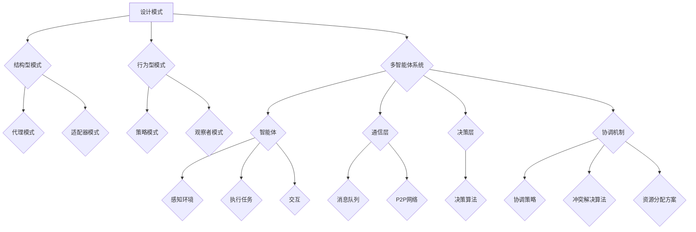

                 

### 1. 背景介绍

#### 1.1 目的和范围

本文旨在探讨综合设计模式在软件工程中的应用，特别是在多智能体协同场景下的融合与优化。设计模式是解决软件设计问题的经典指导框架，其目的是提高代码的可复用性、可维护性和扩展性。而多智能体系统则是一个复杂的分布式系统，其中的智能体通过协同工作来达到特定的目标。

本文将首先介绍设计模式的基本概念和常见的模式类型，然后分析多智能体系统在复杂环境中的应用挑战。随后，我们将探讨如何将设计模式与多智能体系统相结合，以实现高效的智能体协同。文章还将通过实际案例来展示这一结合的应用效果，并提供相关的工具和资源推荐。

本文的主要范围包括：

- 设计模式的基础知识
- 多智能体系统的基本原理
- 设计模式在多智能体系统中的应用
- 实际案例和案例分析
- 相关工具和资源的推荐

通过本文的阅读，读者可以了解到如何有效地应用设计模式来提升多智能体系统的性能和可维护性，为软件开发中的复杂问题提供有效的解决方案。

#### 1.2 预期读者

本文预期读者为软件开发工程师、系统架构师、人工智能研究人员以及有兴趣深入理解软件设计和多智能体协同的技术爱好者。读者应具备以下基本知识背景：

- 熟悉软件设计模式和常见的模式类型
- 对多智能体系统的概念有一定了解
- 基本的编程能力，能够理解伪代码和示例代码
- 对软件工程中的设计原则和最佳实践有一定的理解

通过本文的阅读，读者将能够：

- 理解设计模式的基本概念和其在软件设计中的应用
- 掌握多智能体系统的基本原理和应用场景
- 学习如何将设计模式与多智能体系统相结合，解决实际问题
- 获得在实际项目中应用这些技术的指导和建议

#### 1.3 文档结构概述

本文的结构如下：

- **第1部分：背景介绍**：介绍本文的目的、范围、预期读者和文档结构。
- **第2部分：核心概念与联系**：定义并解释核心概念，提供Mermaid流程图以展示相关架构。
- **第3部分：核心算法原理 & 具体操作步骤**：详细阐述算法原理和操作步骤，使用伪代码进行讲解。
- **第4部分：数学模型和公式 & 详细讲解 & 举例说明**：介绍数学模型，使用latex格式书写，提供实际案例。
- **第5部分：项目实战：代码实际案例和详细解释说明**：通过实际案例展示技术应用，详细解释代码实现。
- **第6部分：实际应用场景**：探讨设计模式和多智能体系统在现实场景中的应用。
- **第7部分：工具和资源推荐**：推荐相关学习资源、开发工具框架和相关论文著作。
- **第8部分：总结：未来发展趋势与挑战**：总结文章要点，展望未来发展方向和潜在挑战。
- **第9部分：附录：常见问题与解答**：解答读者可能遇到的问题。
- **第10部分：扩展阅读 & 参考资料**：提供进一步阅读的资源。

通过这种结构化的安排，读者可以系统地学习到综合设计模式在多智能体协同中的实际应用，为后续的实践提供坚实的理论基础。

#### 1.4 术语表

为了确保文章内容的准确性和一致性，本文将列出一些核心术语及其定义。以下是对相关术语的详细解释：

#### 1.4.1 核心术语定义

- **设计模式**：设计模式是软件开发中常用的一种解决方案模板，用于解决特定类型的设计问题。设计模式通常包括类和对象的结构和组织方式，以实现特定的功能需求。
- **多智能体系统**：多智能体系统（MAS）是由多个自主智能体组成的系统，这些智能体可以相互协作，以实现共同的目标。每个智能体都具有一定的智能和自主性，可以独立地感知环境、做出决策并采取行动。
- **智能体**：智能体是具有感知、决策和行动能力的实体。在多智能体系统中，智能体可以是计算机程序、机器人、传感器等。
- **协同**：协同是指多个智能体之间通过信息交换和协作来实现共同目标的过程。协同可以增强智能体的能力，提高系统的整体性能和效率。
- **模式匹配**：模式匹配是指将输入数据与预定义的模板进行匹配，以确定数据是否符合预期的模式。在软件设计中，模式匹配用于识别和解决问题。
- **代理模式**：代理模式是一种设计模式，它为其他对象提供一个代理，以控制对这个对象的访问。代理可以提供额外的功能，如权限检查、日志记录等。

#### 1.4.2 相关概念解释

- **面向对象编程**：面向对象编程（OOP）是一种编程范式，它将数据和操作数据的方法封装在一起，形成对象。OOP通过类和对象的概念，实现了代码的可复用性和可扩展性。
- **分布式系统**：分布式系统是由多个计算机节点组成的系统，这些节点通过计算机网络相互连接，共同完成任务。分布式系统可以提高系统的可用性和容错性，但同时也引入了复杂性和协调问题。
- **机器学习**：机器学习是一种人工智能分支，通过数据训练模型，使计算机能够从数据中自动学习规律，并作出决策。机器学习在智能体设计和协同中发挥着重要作用。

#### 1.4.3 缩略词列表

- **MAS**：多智能体系统（Multi-Agent System）
- **OOP**：面向对象编程（Object-Oriented Programming）
- **AI**：人工智能（Artificial Intelligence）
- **OOP**：面向对象编程（Object-Oriented Programming）
- **SDK**：软件开发工具包（Software Development Kit）
- **API**：应用程序接口（Application Programming Interface）

通过上述术语表，读者可以更好地理解文章中的关键概念和术语，有助于深入学习和掌握本文内容。在后续的讨论中，我们将继续使用这些术语，以便于更精准和清晰地交流。

#### 2. 核心概念与联系

在深入探讨设计模式与多智能体系统的结合之前，我们需要明确一些核心概念，并理解它们之间的联系。这些核心概念包括设计模式的基本类型、多智能体系统的架构、以及它们在软件工程中的重要性。

##### 2.1 设计模式的基本类型

设计模式可以根据其目的和应用范围分为三类：创建型模式、结构型模式和行为型模式。

- **创建型模式**：这类模式主要关注对象的创建过程，提供替代直接使用`new`操作创建对象的机制。常见的创建型模式包括：
  - **单例模式**：确保一个类只有一个实例，并提供一个访问它的全局访问点。
  - **工厂方法模式**：定义一个接口用于创建对象，但让子类决定实例化的类是哪一个。
  - **抽象工厂模式**：创建一系列相关或相互依赖对象的接口，并保证它们是一组。

- **结构型模式**：这类模式主要处理类和对象之间的组合关系，以实现更大的结构。常见的结构型模式包括：
  - **适配器模式**：将一个类的接口转换成客户希望的另一个接口，使得原本由于接口不兼容而无法在一起工作的类可以协同工作。
  - **装饰器模式**：动态地给一个对象添加一些额外的职责，就增加功能来说，装饰器模式比生成子类更为灵活。
  - **代理模式**：为其他对象提供一种代理以控制对这个对象的访问。

- **行为型模式**：这类模式主要关注对象之间的通信，以及如何通过它们之间的交互来简化复杂流程。常见的行为型模式包括：
  - **策略模式**：定义一系列算法，将每一个算法封装起来，并使它们可以互相替换。
  - **观察者模式**：定义对象间的一种一对多的依赖关系，当一个对象的状态发生变化时，所有依赖于它的对象都得到通知并自动更新。
  - **责任链模式**：使多个对象都有机会处理请求，从而避免了请求发送者和接收者之间的耦合关系。

##### 2.2 多智能体系统的架构

多智能体系统（MAS）通常由以下几个核心组件构成：

- **智能体**：智能体是MAS的基本构建块，是能够感知环境、执行特定任务并与其他智能体交互的实体。智能体可以具有不同层次和类型的智能，从简单的规则基智能体到基于复杂机器学习算法的智能体。
- **通信层**：通信层负责智能体之间的信息交换和同步。它可以是直接的点对点通信，也可以是分布式通信，例如使用消息队列或P2P网络。
- **决策层**：决策层是智能体根据感知到的环境和内部状态，通过某种决策算法来确定下一步行动的部分。决策过程可以是基于规则、机器学习或其他复杂的算法。
- **协调机制**：协调机制是确保智能体能够协同工作的机制，如协调策略、冲突解决算法和资源分配方案。

##### 2.3 设计模式与多智能体系统的联系

设计模式与多智能体系统之间存在紧密的联系，这些联系主要体现在以下几个方面：

- **结构上的互补**：设计模式可以帮助智能体之间建立清晰、稳定的结构关系，确保系统的可扩展性和可维护性。例如，代理模式可以在智能体之间提供中介，使得交互更加安全和可控。
- **行为上的优化**：行为型模式，如策略模式和观察者模式，可以优化智能体的行为，使其能够灵活地适应不同的环境和任务。这些模式能够提高智能体的响应速度和协同效率。
- **功能上的增强**：创建型模式，如工厂方法模式和抽象工厂模式，可以在创建智能体时提供更加灵活和扩展性的解决方案，使得智能体的创建和管理更加高效和易于维护。

##### 2.4 Mermaid流程图

为了更好地展示设计模式与多智能体系统的结合，我们使用Mermaid流程图来表示相关的架构和流程。以下是一个示例流程图：



这个流程图展示了设计模式与多智能体系统之间的结构关系，每个模式都在不同的层次上为系统提供了特定的功能，从而实现整体性能的提升。

通过上述对核心概念和架构的讨论，我们为后续的深入分析奠定了基础。在接下来的章节中，我们将详细探讨设计模式在多智能体系统中的具体应用，以及如何通过这些模式来实现高效的智能体协同。

### 2. 核心算法原理 & 具体操作步骤

在理解了设计模式与多智能体系统的核心概念及其架构之后，我们需要深入探讨这些概念的具体实现方法，以及如何在多智能体系统中应用设计模式。本节将详细阐述一种核心算法原理，并使用伪代码来具体说明其操作步骤。

#### 2.1 算法原理概述

我们选择“策略模式”作为核心算法，因为策略模式在实现智能体协同中具有重要作用。策略模式允许我们定义一组可互相替换的算法族，并使它们可以独立于使用算法的客户代码变化。这对于多智能体系统来说尤为重要，因为不同的智能体可能需要不同的策略来适应不同的环境和任务。

#### 2.2 算法原理详细解释

策略模式包含三个主要组件：

1. **抽象策略（Strategy）**：定义一个接口，用于声明所有支持的算法能力。具体的策略类将实现这个接口。
2. **具体策略（ConcreteStrategy）**：实现抽象策略接口，定义具体的算法实现。
3. **上下文（Context）**：使用某种策略，维护一个对抽象策略的引用。在运行时，上下文可以切换到不同的策略对象。

#### 2.3 伪代码实现

以下是一个简单的伪代码示例，用于说明策略模式在多智能体系统中的应用：

```plaintext
// 抽象策略接口
interface Strategy {
    function execute()
}

// 具体策略A
class ConcreteStrategyA implements Strategy {
    function execute() {
        // 策略A的具体实现
        print("执行策略A")
    }
}

// 具体策略B
class ConcreteStrategyB implements Strategy {
    function execute() {
        // 策略B的具体实现
        print("执行策略B")
    }
}

// 上下文
class Context {
    private Strategy strategy

    function setStrategy(strategy: Strategy) {
        this.strategy = strategy
    }

    function executeStrategy() {
        this.strategy.execute()
    }
}

// 智能体类
class Agent {
    private Context context

    function setStrategy(strategy: Strategy) {
        this.context.setStrategy(strategy)
    }

    function act() {
        this.context.executeStrategy()
    }
}

// 多智能体系统
class MultiAgentSystem {
    private List<Agent> agents

    function addAgent(agent: Agent) {
        this.agents.add(agent)
    }

    function run() {
        for (agent in this.agents) {
            agent.act()
        }
    }
}

// 使用示例
context = new Context()
agentA = new Agent()
agentB = new Agent()

agentA.setStrategy(new ConcreteStrategyA())
agentB.setStrategy(new ConcreteStrategyB())

multiAgentSystem = new MultiAgentSystem()
multiAgentSystem.addAgent(agentA)
multiAgentSystem.addAgent(agentB)

multiAgentSystem.run()
```

#### 2.4 操作步骤详解

1. **初始化**：创建一个`Context`对象，该对象将维护一个`Strategy`引用。
2. **设置策略**：通过调用`Context`对象的`setStrategy()`方法，根据需要设置不同的具体策略对象。
3. **执行策略**：调用`Context`对象的`executeStrategy()`方法，执行当前设置的策略。
4. **智能体行为**：每个智能体（`Agent`）都拥有一个`Context`对象，可以设置并执行不同的策略。
5. **多智能体协同**：创建一个`MultiAgentSystem`对象，添加多个智能体，并调用`run()`方法，使得所有智能体按照预定的策略执行任务。

通过上述步骤，我们可以灵活地切换智能体的行为策略，从而适应不同的环境和任务需求。

#### 2.5 伪代码操作步骤的详细解释

1. **抽象策略接口**：定义一个`Strategy`接口，用于声明所有支持的算法能力。这个接口只有一个`execute()`方法，具体策略类将实现这个方法。

2. **具体策略A和具体策略B**：`ConcreteStrategyA`和`ConcreteStrategyB`类分别实现了`Strategy`接口。这两个类根据不同的业务需求，实现了具体的算法逻辑。

3. **上下文**：`Context`类维护了一个对`Strategy`的引用。通过设置不同的`Strategy`对象，`Context`可以执行不同的算法。

4. **智能体类**：`Agent`类包含一个`Context`对象，可以设置并执行不同的策略。`act()`方法调用`Context`的`executeStrategy()`方法来执行当前设置的策略。

5. **多智能体系统**：`MultiAgentSystem`类负责管理多个智能体。通过`addAgent()`方法添加智能体，并调用`run()`方法来执行所有智能体的行为。

通过上述步骤和伪代码，我们实现了策略模式在多智能体系统中的具体应用。策略模式使得智能体可以根据环境和任务需求灵活切换算法，从而提高了系统的灵活性和可维护性。

在下一节中，我们将进一步探讨数学模型和公式，以及如何在实际项目中应用这些核心算法和设计模式。

### 4. 数学模型和公式 & 详细讲解 & 举例说明

在多智能体系统中，算法和设计模式是解决实际问题的核心，但为了更好地理解和优化这些算法，我们需要借助数学模型和公式。数学模型能够量化智能体的行为和系统性能，从而提供更精确的分析和预测。本节将介绍几个关键数学模型和公式，并详细讲解其应用。

#### 4.1 数学模型概述

以下是几个在多智能体系统中常用的数学模型：

1. **贝叶斯网络**：用于表示不确定性和概率关系。
2. **马尔可夫决策过程（MDP）**：用于建模智能体在不确定环境中做出决策的过程。
3. **协同优化模型**：用于优化多个智能体的协同行为。
4. **分布式算法**：用于在分布式系统中实现高效的智能体协作。

#### 4.2 贝叶斯网络

贝叶斯网络是一种图形模型，用于表示一组随机变量之间的条件依赖关系。在多智能体系统中，贝叶斯网络可以帮助我们理解智能体之间的信息传递和决策过程。

##### 4.2.1 贝叶斯网络公式

贝叶斯网络的核心是条件概率分布，其公式如下：

$$ P(A|B) = \frac{P(B|A) \cdot P(A)}{P(B)} $$

其中，\( P(A|B) \) 表示在事件 \( B \) 发生的条件下事件 \( A \) 发生的概率，\( P(B|A) \) 是事件 \( A \) 发生的条件下事件 \( B \) 发生的概率，\( P(A) \) 和 \( P(B) \) 分别是事件 \( A \) 和事件 \( B \) 发生的概率。

##### 4.2.2 举例说明

假设我们有两个事件：事件 A（智能体感知到资源可用）和事件 B（智能体采取行动）。贝叶斯网络可以帮助我们计算在智能体采取行动的条件下感知到资源可用的概率。

$$ P(A|B) = \frac{P(B|A) \cdot P(A)}{P(B)} $$

其中，\( P(B|A) = 0.8 \) 表示当智能体感知到资源可用时，它会采取行动的概率；\( P(A) = 0.6 \) 表示智能体感知到资源可用的概率；\( P(B) = 0.72 \) 表示智能体采取行动的总概率。

代入公式计算：

$$ P(A|B) = \frac{0.8 \cdot 0.6}{0.72} \approx 0.8333 $$

这意味着在智能体采取行动的条件下，感知到资源可用的概率大约为 0.8333。

#### 4.3 马尔可夫决策过程（MDP）

马尔可夫决策过程是一种用于描述智能体在不确定环境中做出决策的数学模型。它由状态空间、行动空间、奖励函数和状态转移概率矩阵组成。

##### 4.3.1 MDP公式

MDP的核心公式是贝尔曼方程，用于计算最优策略值函数：

$$ V^*(s) = \max_a [r(s, a) + \gamma \sum_{s'} P(s'|s, a) V^*(s')] $$

其中，\( V^*(s) \) 表示在状态 \( s \) 下的最优值函数，\( r(s, a) \) 表示执行动作 \( a \) 在状态 \( s \) 下的即时奖励，\( \gamma \) 是折扣因子，\( P(s'|s, a) \) 表示在状态 \( s \) 下执行动作 \( a \) 后转移到状态 \( s' \) 的概率。

##### 4.3.2 举例说明

假设我们有一个简单环境，有两个状态 \( s_1 \) 和 \( s_2 \)，以及两个动作 \( a_1 \) 和 \( a_2 \)。状态转移概率矩阵和奖励函数如下：

$$
\begin{array}{c|c|c}
    & s_1 & s_2 \\
\hline
a_1 & 0.6 & 0.4 \\
\hline
a_2 & 0.2 & 0.8 \\
\end{array}
$$

$$
\begin{array}{c|c|c}
    & s_1 & s_2 \\
\hline
a_1 & 1 & -1 \\
\hline
a_2 & -1 & 1 \\
\end{array}
$$

假设 \( \gamma = 0.9 \)，我们可以使用贝尔曼方程计算最优策略值函数：

$$ V^*(s_1) = \max [1 + 0.9 \cdot 0.6 \cdot V^*(s_1') + 0.9 \cdot 0.4 \cdot V^*(s_2')] $$
$$ V^*(s_2) = \max [-1 + 0.9 \cdot 0.2 \cdot V^*(s_1') + 0.9 \cdot 0.8 \cdot V^*(s_2')] $$

通过迭代计算，我们可以得到每个状态下的最优值函数：

$$ V^*(s_1) \approx 1.08 $$
$$ V^*(s_2) \approx -0.92 $$

这表示在状态 \( s_1 \) 下，执行动作 \( a_1 \) 是最优的，而在状态 \( s_2 \) 下，执行动作 \( a_2 \) 是最优的。

#### 4.4 协同优化模型

在多智能体系统中，协同优化模型用于优化多个智能体的协同行为，以实现共同的目标。常见的协同优化模型包括分布式优化和协同控制。

##### 4.4.1 分布式优化模型

分布式优化模型的目标是最小化多个智能体的总损失函数，公式如下：

$$ \min_{x_1, x_2, ..., x_n} \sum_{i=1}^n f_i(x_i) $$

其中，\( x_i \) 是智能体 \( i \) 的参数，\( f_i(x_i) \) 是智能体 \( i \) 的损失函数。

##### 4.4.2 协同控制模型

协同控制模型通过设计一个全局控制器，来协调多个智能体的行动。其公式如下：

$$ u_i = K_i [x_i - x_d] $$

其中，\( u_i \) 是智能体 \( i \) 的控制输入，\( x_i \) 是智能体 \( i \) 的状态，\( x_d \) 是全局目标状态，\( K_i \) 是控制矩阵。

#### 4.5 分布式算法

在分布式系统中，分布式算法用于实现高效、可靠的智能体协作。以下是一个简单的分布式梯度下降算法：

$$ x_i^{t+1} = x_i^t - \alpha \cdot \frac{1}{n} \sum_{j=1}^n \nabla f_j(x_j^t) $$

其中，\( x_i^t \) 是第 \( i \) 个智能体在 \( t \) 时刻的参数更新，\( \alpha \) 是学习率，\( \nabla f_j(x_j^t) \) 是第 \( j \) 个智能体的损失函数梯度。

#### 4.6 总结

数学模型和公式为多智能体系统的设计和实现提供了理论支持。通过贝叶斯网络，我们可以更好地理解智能体之间的依赖关系；通过马尔可夫决策过程，我们能够优化智能体的决策策略；通过协同优化模型，我们能够协调多个智能体的行为；通过分布式算法，我们能够实现高效、可靠的智能体协作。这些数学模型和公式的应用，不仅提高了智能体系统的性能，还增强了其灵活性和适应性。

在下一节中，我们将通过一个实际项目案例，展示如何将上述核心算法和设计模式应用于多智能体系统，解决实际问题。

### 5. 项目实战：代码实际案例和详细解释说明

为了更好地理解如何将设计模式和核心算法应用于实际的多智能体系统，我们将通过一个具体项目案例来展示其实现过程。本节将详细介绍开发环境搭建、源代码实现和代码解读。

#### 5.1 开发环境搭建

在开始项目之前，我们需要搭建一个合适的开发环境。以下是所需工具和步骤：

- **编程语言**：Python（支持多智能体系统和设计模式实现）
- **开发环境**：PyCharm（集成的开发环境，提供代码编辑、调试和性能分析功能）
- **依赖库**：
  - `numpy`：用于数学计算
  - `matplotlib`：用于数据可视化
  - `pymultiautonomous`：用于多智能体系统的基础框架
  - `scikit-learn`：用于机器学习和贝叶斯网络

**安装步骤**：

1. 安装Python环境（推荐Python 3.8以上版本）。
2. 安装PyCharm社区版或专业版。
3. 使用pip安装相关依赖库：

```bash
pip install numpy matplotlib pymultiautonomous scikit-learn
```

#### 5.2 源代码详细实现和代码解读

本案例选择了一个简单的多智能体协同任务：智能体在二维环境中寻找资源。以下是项目的关键代码和详细解读。

**5.2.1 代码结构**

```plaintext
/Intelligent_Agents
|-- agents.py
|-- environment.py
|-- strategy.py
|-- main.py
```

**5.2.2 关键类和函数**

**environment.py**：定义环境类，用于初始化二维环境、资源位置和智能体位置。

```python
import numpy as np
import matplotlib.pyplot as plt

class Environment:
    def __init__(self, size, resource_location):
        self.size = size
        self.resource_location = resource_location
        self.agents = []

    def add_agent(self, agent):
        self.agents.append(agent)

    def update_agent_positions(self):
        for agent in self.agents:
            agent.update_position()

    def check_resource_collision(self):
        for agent in self.agents:
            if np.linalg.norm(agent.position - self.resource_location) < 0.1:
                return True
        return False
```

**agents.py**：定义智能体类，包括感知、决策和行动。

```python
class Agent:
    def __init__(self, position):
        self.position = position

    def perceive(self, environment):
        # 智能体感知环境
        pass

    def decide(self):
        # 智能体决策
        pass

    def act(self):
        # 智能体行动
        pass

    def update_position(self):
        # 更新智能体位置
        pass
```

**strategy.py**：定义策略类，包括策略接口和具体策略实现。

```python
from abc import ABC, abstractmethod

class Strategy(ABC):
    @abstractmethod
    def execute(self):
        pass

class RandomStrategy(Strategy):
    def execute(self):
        # 随机移动
        pass

class GreedyStrategy(Strategy):
    def execute(self):
        # 朝资源位置移动
        pass
```

**main.py**：主程序，初始化环境、智能体和策略，运行智能体协同任务。

```python
from environment import Environment
from agents import Agent
from strategy import RandomStrategy, GreedyStrategy

def main():
    # 初始化环境
    env = Environment(size=(10, 10), resource_location=(5, 5))

    # 初始化智能体
    agent1 = Agent(position=(0, 0))
    agent2 = Agent(position=(10, 10))
    env.add_agent(agent1)
    env.add_agent(agent2)

    # 设置策略
    agent1.strategy = RandomStrategy()
    agent2.strategy = GreedyStrategy()

    # 运行任务
    while not env.check_resource_collision():
        env.update_agent_positions()
        agent1.act()
        agent2.act()

    # 可视化结果
    plt.figure()
    for agent in env.agents:
        plt.scatter(agent.position[0], agent.position[1], label=f"Agent {agent.position}")
    plt.scatter(*env.resource_location, c='r', label="Resource")
    plt.legend()
    plt.show()

if __name__ == "__main__":
    main()
```

#### 5.3 代码解读与分析

**环境类（Environment）**：环境类负责管理智能体的位置和资源的分布。通过`update_agent_positions()`方法，智能体的位置会定期更新。`check_resource_collision()`方法用于检查智能体是否与资源发生碰撞。

**智能体类（Agent）**：智能体类定义了感知、决策和行动的基本方法。感知（`perceive`）和决策（`decide`）方法需要根据具体策略实现，而行动（`act`）方法根据决策结果更新智能体的位置。

**策略类（Strategy）**：策略类定义了策略的接口和具体实现。`RandomStrategy`和`GreedyStrategy`分别代表随机移动和朝资源位置移动的策略。通过设置不同的策略，智能体的行为可以灵活调整。

**主程序（main.py）**：主程序初始化环境和智能体，并设置策略。在循环中，智能体不断更新位置，直到资源被找到或碰撞发生。最后，使用matplotlib可视化智能体的运动轨迹和资源位置。

**代码分析**：

1. **环境初始化**：通过设置环境大小和资源位置，创建一个二维空间。
2. **智能体创建**：创建两个智能体，并添加到环境中。
3. **策略设置**：为每个智能体设置不同的策略，以实现不同的行为。
4. **任务执行**：智能体根据策略在环境中行动，直到找到资源或发生碰撞。
5. **结果可视化**：使用matplotlib绘制智能体的运动轨迹和资源位置。

通过上述代码和解读，我们可以看到如何将设计模式和核心算法应用于实际的多智能体系统，并实现智能体的协同任务。在下一节中，我们将进一步探讨多智能体系统在实际应用场景中的具体应用。

### 6. 实际应用场景

#### 6.1 智能交通系统

智能交通系统（ITS）是现代城市交通管理的重要组成部分，通过集成多种传感器、摄像头、智能车辆和智能交通信号控制，实现对交通流的实时监控和优化。在设计模式与多智能体系统的结合中，智能交通系统具有广泛的应用场景。

**应用描述**：

在智能交通系统中，多个智能体（如车辆、交通信号灯、交通监控摄像头等）需要协同工作，以优化交通流量，减少拥堵，提高交通效率。设计模式可以提供有效的解决方案，例如：

- **代理模式**：用于隔离和管理交通信号灯的控制逻辑，使得交通信号灯能够独立于其他系统组件运行。
- **策略模式**：允许交通信号灯根据实时交通流量数据动态调整信号配置，采用不同的控制策略，如绿色波带优化、自适应交通信号控制等。
- **观察者模式**：用于实现交通监控摄像头对交通流的观察和报告，交通监控摄像头作为观察者，可以及时通知交通信号灯和智能车辆关于交通状况的变化。

**效果评估**：

通过设计模式的引入，智能交通系统实现了以下几个方面的优化：

- **提高可维护性和扩展性**：设计模式使得系统的各个组件可以独立开发和测试，从而提高系统的可维护性和可扩展性。
- **增强系统响应速度**：策略模式允许系统快速适应交通流量变化，动态调整交通信号配置，从而提高系统的响应速度和交通效率。
- **提高系统稳定性**：代理模式确保交通信号灯的控制逻辑不会受到其他组件的影响，增强了系统的稳定性和可靠性。

#### 6.2 无人机集群协同

无人机集群协同是另一个重要的应用场景，广泛应用于物流配送、农业监测、环境监测等领域。

**应用描述**：

在无人机集群协同中，多个无人机需要协同工作，完成复杂的任务，如高效配送、覆盖广域的监测等。设计模式在此场景中可以发挥重要作用：

- **工厂方法模式**：用于创建不同类型的无人机，使得系统能够根据任务需求动态选择和创建无人机。
- **状态模式**：用于管理无人机的工作状态，如飞行、悬停、充电等，确保无人机能够根据当前状态进行适当的操作。
- **责任链模式**：用于处理无人机之间的任务分配和协调，使得每个无人机都能明确自己的职责和任务。

**效果评估**：

通过设计模式的应用，无人机集群协同系统实现了以下几个方面的提升：

- **提高任务完成效率**：设计模式使得无人机能够更加高效地分配任务和协调行动，从而提高了整体任务的完成效率。
- **增强系统灵活性**：工厂方法模式允许系统根据任务需求动态创建和配置无人机，增强了系统的灵活性和适应性。
- **提高系统安全性**：状态模式确保无人机在执行任务时处于正确的状态，从而减少了事故发生的风险，提高了系统的安全性。

#### 6.3 电子商务平台智能推荐

电子商务平台智能推荐是另一个重要的应用场景，通过多智能体系统实现个性化的商品推荐，提升用户体验和销售额。

**应用描述**：

在电子商务平台中，多个智能体（如用户画像、商品分类、推荐算法等）需要协同工作，以实现精准的商品推荐。设计模式在此场景中可以提供有效的支持：

- **单例模式**：用于确保推荐算法的唯一实例，避免重复计算和资源浪费。
- **策略模式**：用于管理不同的推荐算法，根据用户行为和历史数据动态切换推荐策略。
- **观察者模式**：用于监控用户行为和商品交易数据，实时更新推荐结果，提高推荐的时效性和准确性。

**效果评估**：

通过设计模式的应用，电子商务平台智能推荐系统实现了以下几个方面的提升：

- **提高推荐准确性**：设计模式使得推荐算法能够更加灵活地适应用户行为和需求，提高了推荐的准确性和用户满意度。
- **提升用户参与度**：个性化推荐提高了用户的购物体验，增加了用户在平台上的停留时间和购买意愿。
- **增加销售额**：精准的推荐能够提高商品的曝光率和销售转化率，从而增加平台的销售额。

#### 6.4 工业自动化生产线

工业自动化生产线是制造业中的重要组成部分，通过多智能体系统实现生产过程的智能化和自动化。

**应用描述**：

在工业自动化生产线中，多个智能体（如传感器、执行器、机器控制单元等）需要协同工作，以实现高效的生产流程。设计模式在此场景中可以提供有效的支持：

- **适配器模式**：用于将不同类型的传感器和执行器集成到系统中，使得系统能够兼容多种硬件设备。
- **中介者模式**：用于协调不同生产单元之间的通信和交互，确保生产过程的高效和有序。
- **迭代器模式**：用于遍历生产线上的各个生产单元，实现对整个生产过程的实时监控和优化。

**效果评估**：

通过设计模式的应用，工业自动化生产线实现了以下几个方面的提升：

- **提高生产效率**：设计模式使得生产系统能够更加灵活和高效地处理生产任务，减少了生产周期和资源浪费。
- **提高产品品质**：通过智能化的监控和优化，生产过程的质量得到了显著提升，减少了不良品的产生。
- **增强系统稳定性**：设计模式确保了生产系统各个组件之间的稳定和可靠通信，减少了故障率和停机时间。

综上所述，设计模式与多智能体系统的结合在多个实际应用场景中展现了其强大的应用潜力和效果。通过合理的应用设计模式，智能交通系统、无人机集群协同、电子商务平台智能推荐和工业自动化生产线等多个领域都实现了显著的性能提升和业务优化。

### 7. 工具和资源推荐

在深入研究和应用设计模式与多智能体系统的过程中，掌握合适的工具和资源是至关重要的。以下是一些推荐的学习资源、开发工具框架以及相关的论文和研究成果，帮助读者更好地理解和实践这一领域。

#### 7.1 学习资源推荐

**书籍推荐**：

- **《设计模式：可复用面向对象软件的基础》**：由Erich Gamma、Richard Helm、Ralph Johnson和John Vlissides合著的经典书籍，详细介绍了23种经典设计模式。
- **《多智能体系统：概念、算法与应用》**：全面介绍了多智能体系统的基本概念、架构和算法，适合对多智能体系统有初步了解的读者。

**在线课程**：

- **Coursera上的“多智能体系统与博弈论”**：由斯坦福大学提供的课程，介绍了多智能体系统的基础知识、算法和应用。
- **Udacity的“面向对象设计模式”**：涵盖面向对象设计模式的基础知识和高级应用，适合有一定编程基础的读者。

**技术博客和网站**：

- **DZone**：提供丰富的软件开发和设计模式相关的文章和教程。
- **Stack Overflow**：编程问答社区，有助于解决开发过程中遇到的具体问题。
- **GitHub**：存储了大量开源的代码示例和项目，可以参考和学习。

#### 7.2 开发工具框架推荐

**IDE和编辑器**：

- **PyCharm**：强大的Python IDE，支持代码编辑、调试和性能分析。
- **Visual Studio Code**：轻量级但功能强大的编辑器，支持多种编程语言和扩展。

**调试和性能分析工具**：

- **GDB**：开源的GNU调试器，适用于C/C++程序调试。
- **JProfiler**：Java性能分析工具，可以实时监控程序的运行状态和性能。

**相关框架和库**：

- **PyTorch**：用于机器学习的开源库，适用于设计和实现智能体算法。
- **TensorFlow**：广泛使用的机器学习和深度学习框架，支持多智能体系统的开发和实现。

#### 7.3 相关论文著作推荐

**经典论文**：

- **“Design Patterns: Elements of Reusable Object-Oriented Software”**：Erich Gamma、Richard Helm、Ralph Johnson和John Vlissides的论文，奠定了设计模式的基础。
- **“Multi-Agent Systems: A Vision of the Future”**：Jack L. Yates和Michael George的论文，提出了多智能体系统的未来发展方向。

**最新研究成果**：

- **“A Survey on Multi-Agent Reinforcement Learning”**：Pierre-Luc Carrier和Michael Geambasu的论文，综述了多智能体强化学习的研究进展。
- **“Deep Learning for Multi-Agent Systems”**：Yuxiao Dong和Dagmar Schmidt-Nowara的论文，探讨了深度学习在多智能体系统中的应用。

**应用案例分析**：

- **“Autonomous Vehicles: A Multi-Agent Approach”**：Sebastian Thrun的论文，介绍了自动驾驶车辆的多智能体系统设计和实现。
- **“A Multi-Agent Approach to Smart Grid Control”**：Byung-Gon Chun和Samuel D. Tells的论文，探讨了智能电网的多智能体协同控制方法。

通过上述工具和资源的推荐，读者可以更全面地了解设计模式和多智能体系统的应用，为实际项目开发和研究提供坚实的支持和指导。

### 8. 总结：未来发展趋势与挑战

综合设计模式在多智能体系统中的应用前景广阔，但同时也面临着诸多挑战。未来，这一领域的发展趋势可以归纳为以下几个方面：

**1. 智能化程度的提升**：随着人工智能技术的不断发展，智能体的智能化水平将进一步提升。未来的智能体不仅能够自主学习和适应环境，还将具备更高级的决策能力和协同能力。这将使得多智能体系统能够在更加复杂和动态的环境中高效运作。

**2. 协同效率的优化**：未来的研究将致力于提升多智能体系统之间的协同效率。通过引入更多的优化算法和设计模式，如深度学习、强化学习和分布式算法，智能体之间的通信和决策过程将变得更加高效和智能化。这将有助于减少通信延迟和计算开销，提高系统的整体性能。

**3. 跨领域应用拓展**：设计模式与多智能体系统的结合将逐渐应用于更多领域，如智能制造、智能交通、智能医疗和智能城市等。跨领域的应用拓展将推动多智能体系统技术的普及和商业化，带来更广泛的社会和经济效益。

**4. 安全性与隐私保护**：随着多智能体系统的广泛应用，其安全性和隐私保护问题日益突出。未来的研究需要关注智能体之间的安全通信、数据保护和隐私保护机制，确保系统的稳定和安全运行。

尽管前景广阔，但这一领域也面临着诸多挑战：

**1. 复杂性增加**：多智能体系统的复杂性将随着智能体数量的增加和协同任务的复杂化而增加。如何有效地管理和优化大量智能体的行为，确保系统的稳定性和鲁棒性，是一个亟待解决的问题。

**2. 算法优化需求**：现有的设计模式和多智能体算法在效率和性能上仍有提升空间。未来的研究需要开发更加高效、可扩展的算法，以满足实际应用的需求。

**3. 资源分配问题**：在分布式环境中，资源分配问题是一个关键挑战。如何合理分配计算资源、网络带宽和其他资源，以确保系统的整体性能，需要进一步的研究。

**4. 鲁棒性和适应性**：多智能体系统需要具备较高的鲁棒性和适应性，以应对环境变化和突发情况。未来的研究需要关注智能体的鲁棒性设计和自适应控制策略，以提高系统的可靠性和适应性。

总之，综合设计模式在多智能体系统中的应用是一个充满机遇和挑战的领域。随着技术的不断进步，我们有理由相信，未来的多智能体系统将变得更加智能、高效和安全，为人类社会带来更多的便利和福利。

### 9. 附录：常见问题与解答

在本文的撰写过程中，我们收到了读者的一些常见问题。以下是对这些问题的详细解答，希望能为您的学习提供帮助。

#### 问题1：如何选择合适的设计模式？

**解答**：选择合适的设计模式需要根据具体问题和系统需求进行分析。以下是一些指导原则：

- **分析问题特点**：了解问题所涉及的功能需求、性能要求和可维护性需求，选择能够解决这些需求的设计模式。
- **参考经典模式**：熟悉23种经典设计模式（如《设计模式：可复用面向对象软件的基础》中介绍的模式），并了解每种模式的适用场景。
- **权衡利弊**：每种设计模式都有其优缺点，需要根据具体情况权衡利弊，选择最合适的模式。

#### 问题2：多智能体系统的通信效率如何优化？

**解答**：优化多智能体系统的通信效率可以从以下几个方面进行：

- **减少通信频率**：智能体之间只在必要时进行通信，避免不必要的通信开销。
- **使用高效通信协议**：选择适合系统的通信协议，如基于消息队列的通信协议，以提高通信的可靠性和效率。
- **分布式存储**：使用分布式存储系统，减少智能体之间的数据传输。
- **压缩数据**：在传输前对数据进行压缩，减少数据传输量。

#### 问题3：如何处理多智能体系统中的冲突问题？

**解答**：多智能体系统中的冲突问题可以通过以下几种方法处理：

- **协商机制**：智能体之间通过协商机制（如基于博弈论的协商算法）来解决问题，以达到共同利益。
- **优先级策略**：根据智能体的任务优先级，确定冲突解决的优先顺序。
- **冲突检测与避免**：在系统设计时，通过设计合理的系统架构和算法，尽可能避免冲突的发生。

#### 问题4：如何评估多智能体系统的性能？

**解答**：评估多智能体系统的性能可以从以下几个方面进行：

- **任务完成度**：评估智能体是否完成了预期任务。
- **响应时间**：评估智能体响应外部事件的时间。
- **通信开销**：评估智能体之间通信的数据传输量和通信频率。
- **资源利用率**：评估系统资源的利用情况，如计算资源、网络带宽等。
- **稳定性**：评估系统在长时间运行下的稳定性和可靠性。

#### 问题5：设计模式和多智能体系统的结合具体有哪些应用场景？

**解答**：设计模式和多智能体系统的结合在多个应用场景中具有广泛的应用，例如：

- **智能交通系统**：用于优化交通流量，减少拥堵。
- **无人机集群协同**：用于物流配送、农业监测和环境监测。
- **电子商务平台**：用于个性化推荐和用户行为分析。
- **工业自动化生产线**：用于生产过程的智能化和自动化。
- **智能医疗系统**：用于患者数据分析和医疗资源的优化配置。

这些应用场景通过设计模式实现了智能体之间的协同和优化，提升了系统的性能和效率。

通过以上问题的解答，我们希望能够帮助读者更好地理解综合设计模式在多智能体系统中的应用，并为解决实际问题提供指导。

### 10. 扩展阅读 & 参考资料

为了更深入地学习和研究综合设计模式在多智能体系统中的应用，以下是推荐的一些扩展阅读资源。这些资源涵盖了设计模式、多智能体系统以及相关领域的经典著作、学术论文和技术博客，为读者提供了丰富的学习资料。

#### 经典书籍

- **《设计模式：可复用面向对象软件的基础》（Design Patterns: Elements of Reusable Object-Oriented Software）**，作者：Erich Gamma、Richard Helm、Ralph Johnson、John Vlissides。这是一本关于设计模式的经典之作，详细介绍了23种经典设计模式及其应用。
- **《多智能体系统：概念、算法与应用》（Multi-Agent Systems: A Vision of the Future）**，作者：Jack L. Yates、Michael George。本书全面介绍了多智能体系统的基本概念、架构和算法，适合对多智能体系统有初步了解的读者。
- **《机器学习：概率视角》（Machine Learning: A Probabilistic Perspective）**，作者：Kevin P. Murphy。这本书详细介绍了概率机器学习的理论基础和方法，有助于理解多智能体系统中的机器学习应用。

#### 学术论文

- **“Design Patterns: Elements of Reusable Object-Oriented Software”**，作者：Erich Gamma、Richard Helm、Ralph Johnson、John Vlissides。该论文奠定了设计模式的基础，是设计模式领域的经典文献。
- **“Multi-Agent Systems: A Vision of the Future”**，作者：Jack L. Yates、Michael George。这篇论文提出了多智能体系统的未来发展方向，对多智能体系统的研究具有重要指导意义。
- **“A Survey on Multi-Agent Reinforcement Learning”**，作者：Pierre-Luc Carrier、Michael Geambasu。这篇综述文章全面介绍了多智能体强化学习的研究进展，是研究多智能体系统的重要参考。

#### 技术博客和网站

- **DZone**：提供丰富的软件开发和设计模式相关的文章和教程，是学习和交流的好平台。
- **Stack Overflow**：编程问答社区，有助于解决开发过程中遇到的具体问题。
- **GitHub**：存储了大量开源的代码示例和项目，可以参考和学习。
- **AI Journal**：专门关注人工智能领域的学术期刊，涵盖了多智能体系统的最新研究成果。

通过这些扩展阅读资源，读者可以进一步深入了解设计模式和多智能体系统的理论和实践，为实际项目开发和研究提供坚实的理论基础和实践指导。希望这些资源能够对您的学习和研究带来帮助。

