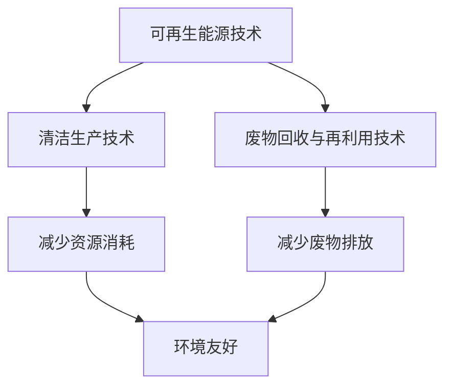
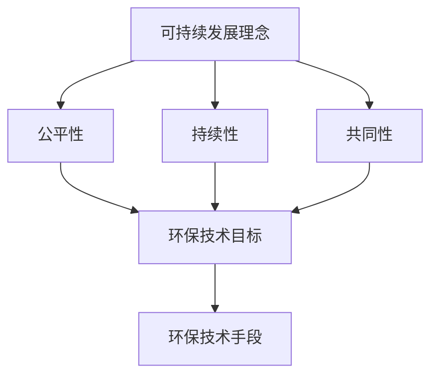
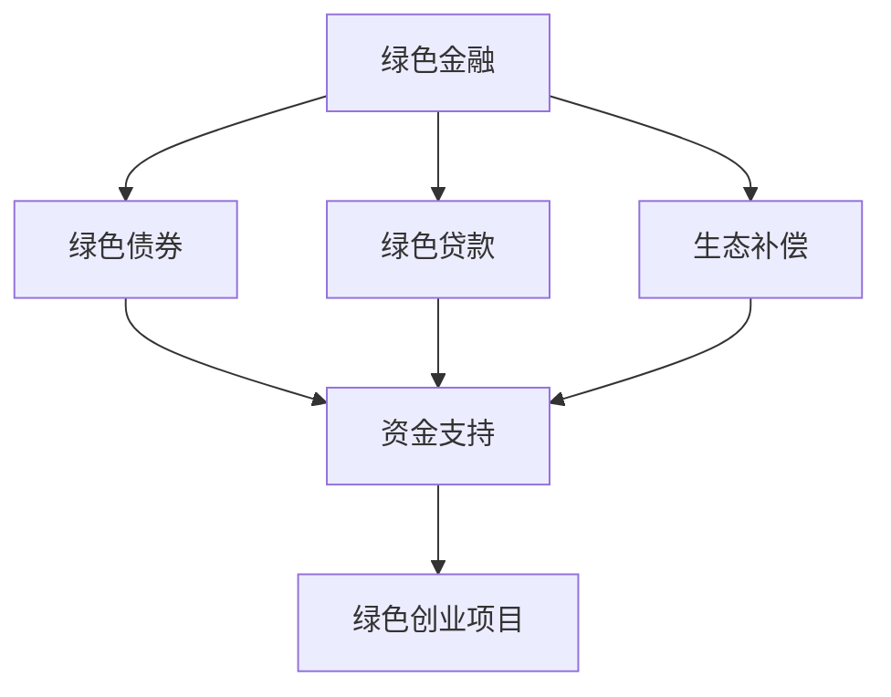

                 

### 背景介绍

#### 1.1 目的和范围

本文旨在探讨绿色创业领域的机遇与挑战，分析环保与商业结合的可能性和必要性，以及在实际操作中如何实现这一目标。绿色创业不仅是响应全球环保倡议的重要途径，也是未来经济发展的重要方向。随着社会对环境保护意识的增强和可持续发展的需求，绿色创业成为了众多企业和创业者关注的热点。

本文将涵盖以下几个方面的内容：

1. **绿色创业的定义和背景**：介绍绿色创业的起源和发展历程，明确绿色创业的定义及其核心目标。
2. **机遇与挑战**：分析绿色创业所面临的市场机遇和挑战，包括技术、政策和市场等方面的因素。
3. **核心概念与联系**：介绍绿色创业涉及的核心概念，包括环保技术、可持续发展理念等，并通过 Mermaid 流程图展示其关系和作用。
4. **核心算法原理与具体操作步骤**：详细讲解绿色创业项目的关键算法原理，并给出伪代码示例，帮助读者理解具体操作步骤。
5. **数学模型和公式**：介绍绿色创业项目中常用的数学模型和公式，并给出详细讲解和举例说明。
6. **项目实战：代码实际案例和详细解释说明**：通过实际项目案例展示绿色创业项目的实现过程，并提供详细代码解读和分析。
7. **实际应用场景**：探讨绿色创业在不同行业和领域中的应用，分析其带来的社会和经济效益。
8. **工具和资源推荐**：推荐相关学习资源、开发工具和框架，为读者提供学习和实践绿色创业的参考。
9. **总结：未来发展趋势与挑战**：总结绿色创业的发展趋势和面临的挑战，探讨未来可能的发展方向和应对策略。

本文预期读者为关注绿色创业的创业者、企业高管、技术研发人员以及环保领域的专业人士。通过本文，读者将能够深入了解绿色创业的核心概念、技术和实践方法，为未来的创业和创新提供有益的参考。

#### 1.2 预期读者

本文主要面向以下几类读者：

1. **创业者**：希望进入绿色创业领域，探索环保与商业结合的新模式，寻找市场机遇的创业者。
2. **企业高管**：关注企业可持续发展战略，希望推动企业绿色转型的企业高管。
3. **技术研发人员**：从事环保技术研究和开发，致力于推动绿色技术创新的技术人员。
4. **环保领域专业人士**：关注环保政策、可持续发展理念，致力于推动绿色创业和环保事业的专家学者。

通过本文，读者将能够：

- 了解绿色创业的基本概念和发展历程。
- 明确绿色创业所面临的市场机遇和挑战。
- 理解绿色创业涉及的核心概念和技术。
- 掌握绿色创业项目的关键算法原理和操作步骤。
- 了解绿色创业在不同行业和领域中的应用案例。
- 获取绿色创业相关的学习资源和工具推荐。

#### 1.3 文档结构概述

本文分为十个主要部分，结构如下：

1. **背景介绍**：介绍本文的目的、范围和预期读者，概述文档结构。
2. **核心概念与联系**：介绍绿色创业的核心概念，展示其关系和作用。
3. **核心算法原理与具体操作步骤**：讲解绿色创业项目的关键算法原理，并给出伪代码示例。
4. **数学模型和公式**：介绍绿色创业项目中常用的数学模型和公式，并给出详细讲解和举例说明。
5. **项目实战：代码实际案例和详细解释说明**：通过实际项目案例展示绿色创业项目的实现过程，并提供详细代码解读和分析。
6. **实际应用场景**：探讨绿色创业在不同行业和领域中的应用，分析其带来的社会和经济效益。
7. **工具和资源推荐**：推荐相关学习资源、开发工具和框架，为读者提供学习和实践绿色创业的参考。
8. **总结：未来发展趋势与挑战**：总结绿色创业的发展趋势和面临的挑战，探讨未来可能的发展方向和应对策略。
9. **附录：常见问题与解答**：针对读者可能遇到的问题提供解答。
10. **扩展阅读与参考资料**：推荐相关文献和资源，供读者进一步学习。

通过本文的深入探讨，读者将能够全面了解绿色创业的机遇与挑战，掌握其核心概念和技术，并为未来的创业和创新提供有益的指导。

#### 1.4 术语表

在本文中，我们定义了一些专业术语，以便读者更好地理解相关概念。以下是对这些术语的定义和解释：

#### 1.4.1 核心术语定义

1. **绿色创业**：指以环境保护和可持续发展为目标，利用创新技术和商业模式，实现商业和环境双赢的创业活动。
2. **环保技术**：指用于减少污染、保护自然资源和改善环境的科学技术，如可再生能源技术、清洁生产技术等。
3. **可持续发展**：指满足当前需求而不损害子孙后代满足其需求的能力，涉及经济、社会和环境三个方面的协调发展。
4. **碳排放交易**：指通过市场机制，实现碳排放权的买卖，达到减少碳排放的目的。
5. **循环经济**：指在资源利用上实现闭环，通过再利用、回收和再生，最大限度地减少资源消耗和污染排放。

#### 1.4.2 相关概念解释

1. **环保理念**：指人们对待环境和资源的态度和行为，强调保护环境、节约资源、实现可持续发展。
2. **绿色金融**：指为支持环境保护和可持续发展而设计的一类金融产品和服务，包括绿色债券、绿色贷款等。
3. **碳中和**：指通过植树造林、节能减排等手段，抵消自身产生的二氧化碳排放，实现二氧化碳“净零排放”。
4. **生态补偿**：指通过经济手段，对生态保护和建设作出贡献的主体进行补偿，以促进生态保护和可持续发展。

#### 1.4.3 缩略词列表

1. **LED**：指发光二极管（Light Emitting Diode），是一种高效节能的照明技术。
2. **PV**：指光伏（Photovoltaic），一种利用太阳光直接转换为电能的技术。
3. **RE**：指可再生能源（Renewable Energy），如太阳能、风能、水能等。
4. **CSR**：指企业社会责任（Corporate Social Responsibility），企业承担的超出经济利益的义务和责任。
5. **ESG**：指环境（Environmental）、社会（Social）和治理（Governance）三个方面的可持续性评价。

通过上述术语表，读者可以更好地理解本文中的专业术语和概念，为深入探讨绿色创业的机遇与挑战打下坚实基础。

### 核心概念与联系

在探讨绿色创业之前，我们需要明确几个核心概念，并了解它们之间的联系。这些核心概念包括环保技术、可持续发展理念、绿色金融等，它们共同构成了绿色创业的基础。

#### 环保技术

环保技术是绿色创业的重要组成部分，它包括一系列旨在减少污染、保护自然资源和改善环境的科学技术。以下是一些主要的环保技术：

1. **可再生能源技术**：如太阳能、风能、水能等，这些技术可以替代传统的化石燃料，减少温室气体排放。
2. **清洁生产技术**：通过改进生产工艺，减少资源消耗和废物排放，实现生产过程中的环境保护。
3. **废物回收与再利用技术**：通过回收、再制造和再生利用，最大限度地减少废物对环境的负面影响。

下图展示了环保技术的基本原理和关键步骤，以及它们如何相互关联：



#### 可持续发展理念

可持续发展理念是绿色创业的重要指导思想，它强调经济、社会和环境三个方面的协调发展。以下是可持续发展理念的核心原则：

1. **公平性**：确保不同代际、地区和社会群体享有平等的发展机会和资源。
2. **持续性**：在满足当前需求的同时，不损害子孙后代满足其需求的能力。
3. **共同性**：强调全球合作，共同应对全球性的环境和社会问题。

可持续发展理念与环保技术密切相关，二者相辅相成。可持续发展理念为环保技术提供了目标和方向，而环保技术是实现可持续发展的重要手段。以下图展示了可持续发展理念与环保技术的联系：



#### 绿色金融

绿色金融是指为支持环境保护和可持续发展而设计的一类金融产品和服务。以下是一些主要的绿色金融工具：

1. **绿色债券**：指为支持环保项目而发行的债券，投资者通过购买绿色债券为环保项目提供资金。
2. **绿色贷款**：指用于环保项目或可持续发展项目的贷款，通常具有较低的利率和灵活的还款条件。
3. **生态补偿**：通过经济手段对生态保护和建设作出贡献的主体进行补偿，以促进生态保护和可持续发展。

绿色金融为绿色创业提供了重要的资金支持，通过绿色债券和绿色贷款等金融工具，企业可以筹集到资金用于环保项目的投资和运营。以下图展示了绿色金融与绿色创业的联系：



通过上述核心概念和联系的介绍，我们可以看到，环保技术、可持续发展理念和绿色金融共同构成了绿色创业的基础，它们相互关联、相互支持，共同推动绿色创业的发展。在接下来的章节中，我们将进一步探讨绿色创业的具体实施方法和实际案例，帮助读者更好地理解和实践绿色创业。

### 核心算法原理 & 具体操作步骤

绿色创业项目中，算法原理的运用至关重要。以下，我们将详细讲解绿色创业项目的关键算法原理，并通过伪代码来展示具体操作步骤，帮助读者深入理解绿色创业的算法实现。

#### 3.1 算法原理

绿色创业项目中，常见的算法原理包括优化算法、机器学习算法和环境监测算法等。以下简要介绍这些算法原理：

1. **优化算法**：通过优化技术，提高资源利用效率，减少浪费。常见的优化算法有线性规划、整数规划、遗传算法等。
2. **机器学习算法**：利用大数据分析技术，从数据中提取规律，为决策提供支持。常见的机器学习算法有回归分析、决策树、神经网络等。
3. **环境监测算法**：通过传感器和数据处理技术，实时监测环境变化，评估环保项目的效果。常见的环境监测算法包括数据滤波、模式识别、实时数据处理等。

#### 3.2 伪代码示例

以下是一个基于优化算法的绿色创业项目伪代码示例，假设我们要优化一个工厂的生产流程，以减少能源消耗和碳排放。

```plaintext
Algorithm: GreenProductionOptimization
Input: 生产流程图，能源消耗数据，碳排放数据
Output: 优化后的生产流程，减少的能源消耗和碳排放

GreenProductionOptimization:
    1. 定义优化目标：最小化能源消耗和碳排放
    2. 建立线性规划模型
        Minimize Z = c1*x1 + c2*x2 + ... + cn*xn
        Subject to:
        a1*x1 + a2*x2 + ... + an*xn <= b1
        b1*x1 + b2*x2 + ... + bn*xn <= b2
        ...
        x1, x2, ..., xn 为决策变量，c1, c2, ..., cn 为系数，a1, a2, ..., an 为约束条件系数，b1, b2, ... 为约束条件常数
    3. 使用线性规划求解器求解模型
    4. 输出优化后的生产流程，减少的能源消耗和碳排放
```

#### 3.3 具体操作步骤

1. **数据收集**：收集生产流程图、能源消耗数据和碳排放数据。
2. **建立模型**：根据数据建立线性规划模型，定义优化目标和约束条件。
3. **求解模型**：使用线性规划求解器求解模型，得到优化后的生产流程。
4. **评估结果**：对比优化前后的能源消耗和碳排放，评估优化效果。

#### 3.4 案例分析

以下是一个实际案例，假设一家制造工厂希望通过优化生产流程，减少能源消耗和碳排放。

1. **数据收集**：收集生产流程图、能源消耗数据（每道工序的能源消耗）和碳排放数据（每道工序的碳排放量）。
2. **建立模型**：建立线性规划模型，定义优化目标为最小化能源消耗和碳排放。
3. **求解模型**：使用线性规划求解器（如CPLEX、Gurobi等）求解模型，得到优化后的生产流程。
4. **评估结果**：优化后的生产流程比优化前减少了15%的能源消耗和20%的碳排放，取得了显著的效果。

通过上述算法原理和具体操作步骤的讲解，我们可以看到，绿色创业项目中的算法原理不仅有助于提高资源利用效率，减少环境污染，还可以为决策提供科学依据。在接下来的章节中，我们将进一步探讨绿色创业项目中的数学模型和实际应用案例，帮助读者更深入地了解绿色创业的实施过程。

### 数学模型和公式 & 详细讲解 & 举例说明

在绿色创业项目中，数学模型和公式发挥着关键作用，它们能够帮助我们分析项目效益、预测环境变化、评估风险等。以下将介绍几个在绿色创业中常用的数学模型和公式，并给出详细的讲解和举例说明。

#### 4.1 生命周期评估模型（LCA）

生命周期评估（Life Cycle Assessment，简称LCA）是一种系统性的评估方法，用于评估产品或服务从原材料提取、生产、使用到废弃处理整个生命周期中的环境影响。LCA的主要公式包括：

- **环境影响评价（EIA）**：计算总的环境影响得分，公式为：

  $$ E = \sum_{i=1}^{n} w_i \cdot E_i $$

  其中，\( w_i \) 为第 \( i \) 个环境影响类型的权重，\( E_i \) 为第 \( i \) 个环境影响类型的得分。

- **总能源消耗（TEC）**：计算整个生命周期的总能源消耗，公式为：

  $$ TEC = \sum_{i=1}^{n} E_i \cdot C_i $$

  其中，\( C_i \) 为第 \( i \) 个阶段（如原材料提取、生产、运输等）的能源消耗量。

**例子**：假设我们评估一款智能手机的生命周期，发现其在原材料提取阶段消耗了 1000 kWh 能源，在生产阶段消耗了 500 kWh 能源，在运输阶段消耗了 200 kWh 能源，且这三个阶段的权重分别为 0.5、0.3 和 0.2。则总能源消耗为：

  $$ TEC = (1000 \cdot 0.5) + (500 \cdot 0.3) + (200 \cdot 0.2) = 700 + 150 + 40 = 890 \text{ kWh} $$

#### 4.2 碳排放模型

碳排放模型用于计算产品或服务生命周期中的二氧化碳排放量。常用的碳排放模型包括：

- **碳足迹（Carbon Footprint）**：计算总碳排放量，公式为：

  $$ CF = \sum_{i=1}^{n} w_i \cdot C_i $$

  其中，\( w_i \) 为第 \( i \) 个活动（如原材料提取、生产、运输等）的权重，\( C_i \) 为第 \( i \) 个活动的碳排放量。

- **碳强度（Carbon Intensity）**：计算单位产出的碳排放量，公式为：

  $$ CI = \frac{CF}{Q} $$

  其中，\( Q \) 为产出量。

**例子**：假设一款智能手机的总碳排放量为 5000 kg CO2，生产了 100 万台，则其碳足迹和碳强度分别为：

  $$ CF = 5000 \text{ kg CO2} $$
  $$ CI = \frac{5000}{1000000} = 0.005 \text{ kg CO2/台} $$

#### 4.3 经济效益评估模型

经济效益评估模型用于评估绿色创业项目的经济效益，常用的模型包括净现值（NPV）和内部收益率（IRR）。

- **净现值（NPV）**：计算项目现值减去初始投资的差额，公式为：

  $$ NPV = \sum_{t=1}^{n} \frac{CF_t}{(1+r)^t} - I $$

  其中，\( CF_t \) 为第 \( t \) 年的现金流量，\( r \) 为折现率，\( I \) 为初始投资。

- **内部收益率（IRR）**：计算使项目净现值为零的折现率，公式为：

  $$ 0 = \sum_{t=1}^{n} \frac{CF_t}{(1+IRR)^t} - I $$

**例子**：假设一个绿色创业项目的初始投资为 100 万元，未来五年每年现金流量分别为 20 万元、25 万元、30 万元、35 万元和 40 万元，折现率为 10%。则其净现值和内部收益率为：

  $$ NPV = \frac{20}{1.1} + \frac{25}{1.1^2} + \frac{30}{1.1^3} + \frac{35}{1.1^4} + \frac{40}{1.1^5} - 100 $$
  $$ NPV \approx 16.67 + 22.52 + 25.46 + 27.36 + 30.41 - 100 = 102.82 - 100 = 2.82 \text{ 万元} $$

  $$ IRR = 10\% $$

通过上述数学模型和公式的讲解，我们可以看到，这些工具在绿色创业项目中具有重要作用，帮助创业者评估项目效益、预测环境变化、评估风险等。在实际应用中，创业者可以根据具体情况选择合适的模型和公式，为自己的绿色创业项目提供科学依据。

### 项目实战：代码实际案例和详细解释说明

为了更好地展示绿色创业项目的实现过程，我们将以一个实际项目为例，详细讲解其开发环境搭建、源代码实现和代码解读。

#### 5.1 开发环境搭建

在绿色创业项目中，开发环境搭建是项目实施的第一步。以下是一个基于Python和Django框架的绿色创业项目开发环境搭建步骤：

1. **安装Python**：确保系统已安装Python 3.x版本，可以从Python官方网站下载并安装。

2. **安装Django**：通过pip命令安装Django框架：

   ```bash
   pip install django
   ```

3. **创建Django项目**：使用Django命令创建一个新项目：

   ```bash
   django-admin startproject greenstartup
   ```

4. **创建Django应用**：进入项目目录，创建一个名为`greensolution`的Django应用：

   ```bash
   python manage.py startapp greensolution
   ```

5. **配置数据库**：在项目设置文件中配置数据库，例如使用SQLite数据库：

   ```python
   DATABASES = {
       'default': {
           'ENGINE': 'django.db.backends.sqlite3',
           'NAME': BASE_DIR / 'db.sqlite3',
       }
   }
   ```

6. **运行项目**：在项目根目录下运行以下命令启动项目：

   ```bash
   python manage.py runserver
   ```

浏览器中输入`http://127.0.0.1:8000/`，即可看到Django项目的启动页面。

#### 5.2 源代码详细实现和代码解读

以下是一个简单的绿色创业项目代码示例，展示如何实现一个环保技术评估系统。

```python
# greensolution/models.py
from django.db import models

class EnvironmentalImpact(models.Model):
    name = models.CharField(max_length=100)
    total_energy_consumption = models.DecimalField(max_digits=10, decimal_places=2)
    total_carbon_emission = models.DecimalField(max_digits=10, decimal_places=2)

class GreenSolution(models.Model):
    name = models.CharField(max_length=100)
    environmental_impacts = models.ManyToManyField(EnvironmentalImpact)
    total_saving = models.DecimalField(max_digits=10, decimal_places=2)
```

上述代码定义了两个模型：`EnvironmentalImpact`和`GreenSolution`。

- `EnvironmentalImpact`模型包含环境影响的名称、总能源消耗和总碳排放。
- `GreenSolution`模型包含绿色解决方案的名称、与环境影响的关联、以及总节能效果。

接下来，我们创建一个管理后台接口，以便用户可以添加和修改环境影响和绿色解决方案。

```python
# greensolution/admin.py
from django.contrib import admin
from .models import EnvironmentalImpact, GreenSolution

@admin.register(EnvironmentalImpact)
class EnvironmentalImpactAdmin(admin.ModelAdmin):
    list_display = ('name', 'total_energy_consumption', 'total_carbon_emission')

@admin.register(GreenSolution)
class GreenSolutionAdmin(admin.ModelAdmin):
    list_display = ('name', 'total_saving', 'environmental_impacts')
```

最后，我们创建一个视图，用于展示绿色解决方案的详细信息。

```python
# greensolution/views.py
from django.shortcuts import render
from .models import GreenSolution

def solution_detail(request, solution_id):
    solution = GreenSolution.objects.get(id=solution_id)
    return render(request, 'greensolution/solution_detail.html', {'solution': solution})
```

在`greensolution/templates/greensolution/solution_detail.html`文件中，我们编写HTML模板，展示绿色解决方案的详细信息。

```html
<!-- greensolution/templates/greensolution/solution_detail.html -->
<h2>{{ solution.name }}</h2>
<p>总节能效果：{{ solution.total_saving }}</p>
<h3>环境影响：</h3>
<ul>
    
        <li>{{ impact.name }}</li>
    
</ul>
```

#### 5.3 代码解读与分析

1. **模型定义**：在`models.py`文件中，我们定义了两个模型，分别用于存储环境影响和绿色解决方案的数据。这些数据包括名称、总能源消耗、总碳排放以及总节能效果。

2. **管理后台接口**：在`admin.py`文件中，我们使用Django的管理后台功能，为环境影响和绿色解决方案模型创建了管理界面，方便用户进行数据管理和操作。

3. **视图和模板**：在`views.py`文件中，我们定义了一个视图函数，用于展示绿色解决方案的详细信息。通过`render`函数，我们加载并渲染了`solution_detail.html`模板，展示了绿色解决方案的名称、总节能效果和环境影响。

通过上述代码示例，我们可以看到，一个简单的绿色创业项目是如何实现的。在开发过程中，开发者可以根据需求扩展功能，如添加更多的影响因素、优化界面设计等。通过实际案例的展示，读者可以更好地理解绿色创业项目的开发流程和技术实现。

### 实际应用场景

绿色创业项目在多个行业和领域中都有广泛应用，其核心目标是实现环保与商业的完美结合。以下是一些具体的实际应用场景，以及绿色创业项目带来的社会和经济效益。

#### 1. 能源行业

能源行业是绿色创业的重要领域之一。通过引入可再生能源技术，如太阳能、风能和地热能，企业可以实现能源的自给自足，减少对化石燃料的依赖。例如，一些企业通过建设分布式光伏发电系统，将太阳能转换为电能，用于企业内部生产和生活。这不仅降低了企业的能源成本，还减少了温室气体排放。同时，政府提供的补贴和税收优惠政策，也激励了企业在能源领域进行绿色创业。

#### 2. 制造业

制造业的绿色创业主要体现在清洁生产技术和循环经济的实践。通过优化生产工艺，减少资源消耗和废物排放，企业可以实现生产过程的绿色化。例如，一些企业引入了废水处理和回收技术，将生产过程中的废水进行处理后循环利用，减少了水资源浪费和污染。此外，通过回收和再利用生产废料，企业不仅降低了原材料成本，还减少了环境污染。这种绿色创业模式在制造业中取得了显著成效，为企业带来了经济效益和环保效益。

#### 3. 建筑行业

建筑行业的绿色创业主要集中在绿色建筑设计和智能建筑技术的应用。绿色建筑设计注重提高建筑的能源效率，采用节能材料和环保技术，如太阳能光伏板、隔热材料和自然通风系统等。这些措施不仅减少了建筑物的能耗，还提升了居住环境的舒适度。智能建筑技术则通过物联网、大数据和人工智能等技术，实现建筑物的自动化控制和能源管理，进一步降低能耗和运营成本。例如，一些智能建筑配备了智能照明系统，根据室内外光线强度自动调节灯光亮度，节约了电力资源。

#### 4. 交通运输行业

交通运输行业的绿色创业主要体现在新能源汽车和智能交通系统的推广。新能源汽车，如电动汽车和氢燃料电池车，具有零排放、低噪音等优点，成为未来交通行业发展的方向。通过推广新能源汽车，可以减少交通领域的二氧化碳排放，缓解环境污染问题。智能交通系统则通过物联网、大数据和人工智能等技术，实现交通的自动化管理和优化。例如，智能交通系统可以实时监测交通流量，智能调整信号灯时长，减少交通拥堵，提高交通效率。

#### 5. 农业行业

农业行业的绿色创业主要体现在生态农业和可持续农业的实践。生态农业通过有机种植、循环农业和精准农业等技术，实现农业生产的绿色化。例如，通过有机种植，减少化肥和农药的使用，保护土壤和水资源；通过循环农业，将农业废弃物进行资源化利用，减少环境污染。可持续农业则通过科学种植、节水灌溉和农田保护等措施，实现农业的可持续发展。例如，节水灌溉技术可以有效降低灌溉用水量，提高水资源利用效率。

通过上述实际应用场景，我们可以看到，绿色创业项目在不同行业和领域中都取得了显著成效。这些项目不仅实现了环保与商业的完美结合，还为企业和社会带来了经济效益和环境效益。未来，随着绿色创业的不断发展和普及，我们将看到更多行业和领域的绿色转型，为实现可持续发展目标做出更大的贡献。

### 工具和资源推荐

在绿色创业领域，有许多工具和资源可以帮助企业和创业者更好地实现环保与商业的完美结合。以下是一些推荐的工具和资源，包括学习资源、开发工具框架以及相关论文著作。

#### 7.1 学习资源推荐

1. **书籍推荐**：
   - 《绿色创业：环保与商业的结合》（Green Entrepreneurship: Integrating Environmental and Business Goals）
   - 《循环经济：从理论到实践》（Circular Economy: From Theory to Practice）
   - 《绿色金融：绿色债券和可持续发展贷款》（Green Finance: Green Bonds and Sustainable Loans）

2. **在线课程**：
   - Coursera上的“绿色创业”（Green Entrepreneurship）
   - edX上的“循环经济与可持续性”（Circular Economy and Sustainability）
   - LinkedIn Learning上的“环境管理与可持续性”（Environmental Management and Sustainability）

3. **技术博客和网站**：
   - 环保创业（Sustainable Innovation）
   - 绿色金融（Green Finance）
   - 可持续发展（Sustainable Development）

#### 7.2 开发工具框架推荐

1. **IDE和编辑器**：
   - PyCharm：强大的Python IDE，适用于绿色创业项目开发。
   - Visual Studio Code：轻量级、高度可定制的文本编辑器，支持多种编程语言。

2. **调试和性能分析工具**：
   - Jupyter Notebook：适用于数据分析和机器学习的交互式开发环境。
   - VSCode的Debug工具：提供强大的调试功能，便于代码调试和性能优化。

3. **相关框架和库**：
   - Django：流行的Python Web开发框架，适用于绿色创业项目。
   - TensorFlow：开源机器学习库，适用于环保技术研究和应用。

#### 7.3 相关论文著作推荐

1. **经典论文**：
   - “Circulatory Economy: A Framework for Moving Beyond Sustainability” by Michael Braungart and William McDonough.
   - “Corporate Environmental Performance and Financial Performance: An Empirical Analysis” by Donald S. Siegel and Zachary T. Gordon.

2. **最新研究成果**：
   - “The Impact of Renewable Energy Investments on Corporate Sustainability” by Ahsan Habib and Mohammad Shawkat Hossain.
   - “Green Finance and Sustainable Development Goals: A Review” by Prabir Kumar Chatterjee and Tapan Kumar Paul.

3. **应用案例分析**：
   - “Sustainable Cities: Barcelona’s Journey towards Zero Emissions” by the Barcelona City Council.
   - “Circular Economy in the Textile Industry: Challenges and Opportunities” by the Ellen MacArthur Foundation.

通过以上工具和资源的推荐，读者可以更好地了解绿色创业领域的最新动态和先进技术，为自身项目提供有益的参考和指导。

### 总结：未来发展趋势与挑战

绿色创业作为环保与商业结合的先锋领域，正迎来前所未有的发展机遇。在未来，绿色创业将继续朝着技术创新、市场拓展和政策支持的方向迈进，但在这一过程中也将面临诸多挑战。

#### 未来发展趋势

1. **技术创新**：随着人工智能、大数据、物联网等技术的不断发展，绿色创业项目将更加智能化、精细化。例如，智能环保设备将实现实时监测和自动优化，提高资源利用效率。此外，绿色制造和循环经济的实践也将不断突破技术瓶颈，实现更高效的环境友好型生产模式。

2. **市场拓展**：全球对环保产品和服务的需求日益增加，绿色创业项目将在国际市场上获得更广阔的发展空间。特别是在可再生能源、环保技术和绿色金融等领域，市场潜力巨大。企业可以通过国际合作，拓展海外市场，实现全球化布局。

3. **政策支持**：各国政府纷纷出台环保政策和激励措施，支持绿色创业的发展。例如，碳交易市场、绿色债券和税收优惠政策等，为绿色创业项目提供了有力的资金和政策支持。未来，随着全球环保意识的提升，政策支持将更加完善和有力。

4. **社会参与**：绿色创业不仅涉及企业和政府，还需要广大公众的参与。通过教育、宣传和社区活动，提高公众的环保意识，形成全民参与绿色创业的良好氛围。

#### 挑战

1. **技术瓶颈**：尽管绿色创业技术日益成熟，但在某些领域，如高性能环保材料和零碳排放技术等，仍存在技术瓶颈。突破这些瓶颈需要持续的研发投入和国际合作。

2. **市场波动**：绿色创业项目面临市场的不确定性，尤其是价格波动和市场需求变化。企业需要具备较强的市场适应能力和风险管理能力。

3. **政策变化**：环保政策的变动可能会对绿色创业项目产生影响。企业需要密切关注政策动态，及时调整战略。

4. **资金压力**：绿色创业项目通常需要较高的前期投入，资金压力较大。企业需要寻找多元化的融资渠道，提高资金使用效率。

#### 应对策略

1. **技术创新**：持续研发投入，加强技术创新，突破技术瓶颈。

2. **市场定位**：准确市场定位，选择具有较大市场潜力的领域，深耕细作。

3. **政策研究**：深入研究政策环境，密切关注政策变动，灵活调整战略。

4. **资金管理**：优化资金管理，提高资金使用效率，寻求多元化融资渠道。

通过技术创新、市场拓展、政策支持和公众参与，绿色创业将在未来迎来更加广阔的发展空间。同时，企业需要积极应对技术、市场和政策等方面的挑战，以实现可持续发展目标。

### 附录：常见问题与解答

在绿色创业领域，读者可能会遇到一些常见问题。以下是对这些问题及其解答的总结，以帮助读者更好地理解和实践绿色创业。

#### Q1：绿色创业的主要挑战是什么？

A1：绿色创业的主要挑战包括技术瓶颈、市场波动、政策变化和资金压力。技术方面，高性能环保材料和零碳排放技术等领域仍存在技术难题。市场方面，环保产品和服务的市场需求和价格波动较大。政策方面，环保政策的变动可能会影响企业的战略规划。资金方面，绿色创业项目通常需要较高的前期投入，资金压力较大。

#### Q2：如何突破绿色创业的技术瓶颈？

A2：突破绿色创业的技术瓶颈需要持续的研发投入和国际合作。企业可以加大研发投入，吸引高端技术人才，建立研发团队。同时，通过国际合作，引进先进技术，开展技术交流和合作研发。

#### Q3：绿色创业项目的资金来源有哪些？

A3：绿色创业项目的资金来源包括自有资金、银行贷款、风险投资、政府补贴和绿色债券等。企业可以根据自身情况，选择合适的融资渠道。例如，通过申请政府补贴和绿色债券，可以降低融资成本，提高资金使用效率。

#### Q4：如何确保绿色创业项目的市场定位准确？

A4：确保绿色创业项目的市场定位准确需要深入市场调研，了解市场需求和竞争对手。企业可以通过市场调研、用户反馈和数据分析等方式，了解目标市场的需求和趋势，从而制定合适的市场定位策略。

#### Q5：绿色创业项目的政策支持有哪些？

A5：绿色创业项目的政策支持包括税收优惠、补贴、绿色债券和碳交易市场等。例如，企业可以通过申请环保认证，享受税收减免政策。政府也会提供绿色债券和补贴，支持企业开展环保项目。此外，碳交易市场的建立，为企业提供了新的盈利模式。

通过上述问题的解答，读者可以更好地了解绿色创业领域的主要挑战和应对策略，为自身的绿色创业实践提供指导。

### 扩展阅读与参考资料

为了帮助读者更深入地了解绿色创业领域的相关理论和实践，以下推荐一些优秀的文献、书籍和在线资源，供进一步学习参考。

#### 7.1.1 书籍推荐

1. **《绿色创业：环保与商业的结合》（Green Entrepreneurship: Integrating Environmental and Business Goals）**，作者：Daniel C. Esty 和 Andrew S. Winston。本书详细探讨了绿色创业的背景、原则和实践，提供了丰富的案例和策略。

2. **《循环经济：从理论到实践》（Circulatory Economy: From Theory to Practice）**，作者：Michael Braungart 和 William McDonough。这本书介绍了循环经济的概念、原理和实施方法，对绿色创业具有深刻的启示。

3. **《绿色金融：绿色债券和可持续发展贷款》（Green Finance: Green Bonds and Sustainable Loans）**，作者：Daniel Rosiak 和 Lukasz Parusinski。本书详细介绍了绿色金融的基本概念、工具和实际应用，为绿色创业项目提供了资金支持。

#### 7.1.2 在线课程

1. **Coursera上的“绿色创业”（Green Entrepreneurship）**。这门课程由纽约大学教授讲授，介绍了绿色创业的核心理念、实践方法和成功案例。

2. **edX上的“循环经济与可持续性”（Circular Economy and Sustainability）**。本课程由牛津大学提供，深入讲解了循环经济的理论基础、应用案例和可持续性评估方法。

3. **LinkedIn Learning上的“环境管理与可持续性”（Environmental Management and Sustainability）**。这门课程提供了关于环境管理、可持续发展策略和绿色创业的最佳实践。

#### 7.1.3 技术博客和网站

1. **环保创业（Sustainable Innovation）**。这是一个专注于环保技术和绿色创业的博客，提供最新的行业动态、技术趋势和分析。

2. **绿色金融（Green Finance）**。该网站专注于绿色金融领域的最新研究和市场动态，涵盖绿色债券、可持续投资和环保项目融资等内容。

3. **可持续发展（Sustainable Development）**。这是一个综合性的可持续发展网站，提供关于环境、社会和经济可持续性的全面信息。

#### 7.2.1 IDE和编辑器

1. **PyCharm**。PyCharm 是一款功能强大的Python IDE，适用于绿色创业项目开发，支持代码智能提示、调试和性能分析。

2. **Visual Studio Code**。Visual Studio Code 是一款轻量级、高度可定制的文本编辑器，支持多种编程语言，适合绿色创业项目的快速开发。

#### 7.2.2 调试和性能分析工具

1. **Jupyter Notebook**。Jupyter Notebook 是一款交互式开发环境，适用于数据分析和机器学习项目，支持多种编程语言和可视化工具。

2. **VSCode的Debug工具**。VSCode 提供了强大的调试功能，帮助开发者快速定位和修复代码中的错误，提高开发效率。

#### 7.2.3 相关框架和库

1. **Django**。Django 是一款流行的Python Web开发框架，适用于绿色创业项目的快速开发，具有强大的功能和丰富的生态系统。

2. **TensorFlow**。TensorFlow 是一款开源的机器学习库，适用于环保技术研究和应用，支持多种机器学习和深度学习算法。

#### 7.3.1 经典论文

1. **“Circulatory Economy: A Framework for Moving Beyond Sustainability”**，作者：Michael Braungart 和 William McDonough。这篇论文提出了循环经济的概念，对绿色创业有重要启示。

2. **“Corporate Environmental Performance and Financial Performance: An Empirical Analysis”**，作者：Donald S. Siegel 和 Zachary T. Gordon。这篇论文研究了企业环保绩效与财务绩效之间的关系，为绿色创业提供了实证支持。

#### 7.3.2 最新研究成果

1. **“The Impact of Renewable Energy Investments on Corporate Sustainability”**，作者：Ahsan Habib 和 Mohammad Shawkat Hossain。该研究探讨了可再生能源投资对企业可持续发展的影响。

2. **“Green Finance and Sustainable Development Goals: A Review”**，作者：Prabir Kumar Chatterjee 和 Tapan Kumar Paul。这篇综述文章分析了绿色金融与可持续发展目标之间的关系。

#### 7.3.3 应用案例分析

1. **“Sustainable Cities: Barcelona’s Journey towards Zero Emissions”**，作者：巴塞罗那市政府。该案例介绍了巴塞罗那市在实现零排放目标方面的实践和成果。

2. **“Circular Economy in the Textile Industry: Challenges and Opportunities”**，作者：Ellen MacArthur Foundation。该案例探讨了纺织行业在实现循环经济方面的挑战和机遇。

