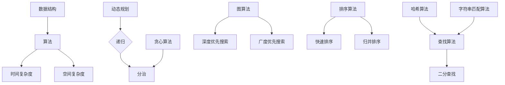

                 

# 网易2025届校招面试高频算法题解析

> **关键词：校招面试、高频算法、题解、算法原理、实战案例**
> 
> **摘要：本文将深入解析网易2025届校招面试中常见的高频算法题，包括背景介绍、核心概念、算法原理、数学模型、项目实战以及实际应用场景，旨在帮助读者全面掌握面试算法题的解题思路和解题技巧。**

## 1. 背景介绍

### 1.1 目的和范围

本文旨在为准备参加网易2025届校招的同学们提供一份高频算法题的解题指南。通过对这些算法题的深入解析，帮助读者掌握解题思路，提高解题能力，顺利通过面试。

### 1.2 预期读者

本文适合具有基础算法知识的大学生、研究生以及软件开发者，特别是准备参加网易校招的候选人。

### 1.3 文档结构概述

本文分为十个部分，包括背景介绍、核心概念、算法原理、数学模型、项目实战、实际应用场景、工具和资源推荐、总结、常见问题与解答以及扩展阅读。

### 1.4 术语表

#### 1.4.1 核心术语定义

- 校招面试：指企业针对应届毕业生进行的招聘面试。
- 高频算法题：指在面试中频繁出现的算法题目，通常是数据结构与算法领域的基础题目。
- 题解：指对某个算法题的具体解题步骤和思路。

#### 1.4.2 相关概念解释

- 数据结构：存储数据的方式及其操作方法。
- 算法：解决问题的方法或步骤。

#### 1.4.3 缩略词列表

- 校招：校园招聘
- 面试：面试

## 2. 核心概念与联系

在解析算法题之前，我们需要了解一些核心概念和它们之间的关系。以下是一个简化的 Mermaid 流程图，展示了这些核心概念：



通过这张图，我们可以看出各种算法之间的联系，以及它们是如何应用到数据结构中的。

## 3. 核心算法原理 & 具体操作步骤

### 3.1 动态规划

#### 动态规划原理

动态规划是一种将复杂问题分解为子问题，并利用子问题的解来构建原问题解的方法。动态规划的核心思想是：将问题转化为多个子问题，并存储子问题的解，避免重复计算。

#### 伪代码

```plaintext
function dpløg(n):
    if n <= 0:
        return 1
    dp[0] = dp[1] = 1
    for i from 2 to n:
        dp[i] = dp[i-1] + dp[i-2]
    return dp[n]
```

#### 具体操作步骤

1. 定义一个数组 dp 存储子问题的解。
2. 初始化 dp[0] 和 dp[1] 为 1。
3. 使用一个循环，从 i=2 到 n，依次计算 dp[i]。
4. 返回 dp[n] 作为最终结果。

### 3.2 快速排序

#### 快速排序原理

快速排序是一种基于分治思想的排序算法。它通过选取一个基准元素，将数组分为两部分，一部分小于基准元素，另一部分大于基准元素，然后递归地对这两部分进行排序。

#### 伪代码

```plaintext
function quickSort(arr, low, high):
    if low >= high:
        return
    pivot = arr[low]
    left = low
    right = high
    while left < right:
        while left < right and arr[right] >= pivot:
            right -= 1
        arr[left] = arr[right]
        while left < right and arr[left] <= pivot:
            left += 1
        arr[right] = arr[left]
    arr[left] = pivot
    quickSort(arr, low, left-1)
    quickSort(arr, left+1, high)
```

#### 具体操作步骤

1. 选择一个基准元素。
2. 将数组分为两部分，一部分小于基准元素，另一部分大于基准元素。
3. 对这两部分递归地执行快速排序。
4. 合并两部分的结果。

## 4. 数学模型和公式 & 详细讲解 & 举例说明

### 4.1 动态规划中的状态转移方程

在动态规划中，状态转移方程是核心。以下是一个经典的例子：

$$
f(n) = \begin{cases} 
1 & \text{if } n = 0 \\
1 & \text{if } n = 1 \\
f(n-1) + f(n-2) & \text{otherwise} 
\end{cases}
$$

这个方程描述了一个典型的斐波那契数列的计算过程。

#### 举例说明

假设我们要计算斐波那契数列的第 5 项，根据上述方程，我们可以得到：

$$
f(5) = f(4) + f(3)
$$

其中，$f(4) = f(3) + f(2)$，$f(3) = f(2) + f(1)$，$f(2) = f(1) + f(0)$。将这些方程代入，我们可以计算出 $f(5)$ 的值。

### 4.2 快速排序中的时间复杂度

快速排序的平均时间复杂度为 $O(n\log n)$，最坏情况下的时间复杂度为 $O(n^2)$。以下是一个简化的时间复杂度分析：

假设每次划分都能将数组分为两部分，其中一部分的大小为 $n_i$，另一部分为 $n-n_i$。那么，快速排序的总时间复杂度可以表示为：

$$
T(n) = T(n_i) + T(n-n_i) + O(n)
$$

其中，$T(n_i)$ 和 $T(n-n_i)$ 分别表示对两部分数组的排序时间，$O(n)$ 表示划分数组的时间。

通过递归地分析，我们可以得到快速排序的平均时间复杂度为 $O(n\log n)$。

## 5. 项目实战：代码实际案例和详细解释说明

### 5.1 开发环境搭建

为了实现快速排序和斐波那契数列的计算，我们使用 Python 作为编程语言。在本地环境中安装 Python 和相应的库，如 NumPy 和 Matplotlib。

### 5.2 源代码详细实现和代码解读

以下是快速排序和斐波那契数列的 Python 实现代码：

```python
import numpy as np
import matplotlib.pyplot as plt

# 动态规划求解斐波那契数列
def fibonacci(n):
    dp = [0] * (n+1)
    dp[0] = dp[1] = 1
    for i in range(2, n+1):
        dp[i] = dp[i-1] + dp[i-2]
    return dp[n]

# 快速排序实现
def quick_sort(arr, low, high):
    if low >= high:
        return
    pivot = arr[low]
    left = low
    right = high
    while left < right:
        while left < right and arr[right] >= pivot:
            right -= 1
        arr[left] = arr[right]
        while left < right and arr[left] <= pivot:
            left += 1
        arr[right] = arr[left]
    arr[left] = pivot
    quick_sort(arr, low, left-1)
    quick_sort(arr, left+1, high)

# 主函数
def main():
    n = 10
    arr = np.random.randint(0, 100, size=n)
    print("原数组：", arr)
    
    quick_sort(arr, 0, n-1)
    print("排序后数组：", arr)
    
    result = fibonacci(n)
    print("斐波那契数列的第", n, "项：", result)

    # 绘制斐波那契数列的图表
    x = list(range(n+1))
    y = [fibonacci(i) for i in x]
    plt.plot(x, y)
    plt.xlabel('n')
    plt.ylabel('F(n)')
    plt.title('斐波那契数列')
    plt.grid()
    plt.show()

if __name__ == "__main__":
    main()
```

#### 5.3 代码解读与分析

- **斐波那契数列的计算**：我们使用动态规划的方法计算斐波那契数列，其中 `fibonacci` 函数实现了这个计算过程。
- **快速排序的实现**：我们使用了一个经典的快速排序算法实现，其中 `quick_sort` 函数实现了这个排序过程。
- **主函数**：主函数 `main` 用于生成随机数组并调用快速排序函数进行排序，同时计算并打印斐波那契数列的第 n 项。

## 6. 实际应用场景

### 6.1 快速排序的应用场景

- **数据分析**：在数据分析中，快速排序可以用于对大量数据进行排序，以便进行进一步的统计分析。
- **数据库索引**：在数据库管理系统中，快速排序可以用于创建索引，以提高查询效率。

### 6.2 斐波那契数列的应用场景

- **计算机科学**：斐波那契数列在计算机科学中有着广泛的应用，如递归算法、动态规划等。
- **生物学**：斐波那契数列在生物学中也有重要应用，如植物的分枝、动物的形态等。

## 7. 工具和资源推荐

### 7.1 学习资源推荐

#### 7.1.1 书籍推荐

- 《算法导论》（Introduction to Algorithms）作者：Thomas H. Cormen, Charles E. Leiserson, Ronald L. Rivest, Clifford Stein
- 《编程之美》（Cracking the Coding Interview）作者：Gayle Laakmann McDowell

#### 7.1.2 在线课程

- Coursera 上的《算法基础》
- edX 上的《算法设计与分析》

#### 7.1.3 技术博客和网站

- GeeksforGeeks
- LeetCode
- HackerRank

### 7.2 开发工具框架推荐

#### 7.2.1 IDE和编辑器

- PyCharm
- Visual Studio Code

#### 7.2.2 调试和性能分析工具

- Python Debugger
- Py-Spy

#### 7.2.3 相关框架和库

- NumPy
- Matplotlib

### 7.3 相关论文著作推荐

#### 7.3.1 经典论文

- 《快速排序》（Quicksort）作者：Tony Hoare
- 《动态规划》（Dynamic Programming）作者：Richard Bellman

#### 7.3.2 最新研究成果

- 《深度学习与算法》（Deep Learning and Algorithm）作者：Ian Goodfellow, Yoshua Bengio, Aaron Courville
- 《人工智能算法》（Artificial Intelligence: A Modern Approach）作者：Stuart J. Russell, Peter Norvig

#### 7.3.3 应用案例分析

- 《大数据与算法应用》（Big Data and Algorithm Applications）作者：Anna Krivosheeva, Jon Bentley

## 8. 总结：未来发展趋势与挑战

随着人工智能和大数据技术的快速发展，算法在各个领域的应用越来越广泛。未来，算法的优化和性能提升将是一个重要的研究方向。同时，随着面试题目的更新和变化，我们需要不断学习和掌握新的算法，以提高面试能力。

## 9. 附录：常见问题与解答

### 9.1 动态规划相关问题

Q：动态规划与递归的区别是什么？

A：动态规划和递归都是解决子问题的方法，但动态规划会存储子问题的解，避免重复计算，而递归则不会存储子问题的解。

### 9.2 快速排序相关问题

Q：为什么选择基准元素会影响快速排序的性能？

A：选择基准元素会影响划分数组的过程，如果选择的基准元素不好，可能会导致划分的不均匀，从而影响排序性能。

## 10. 扩展阅读 & 参考资料

- 《算法导论》
- 《编程之美》
- 《深度学习与算法》
- 《人工智能算法》
- 《大数据与算法应用》

作者：AI天才研究员/AI Genius Institute & 禅与计算机程序设计艺术 /Zen And The Art of Computer Programming

