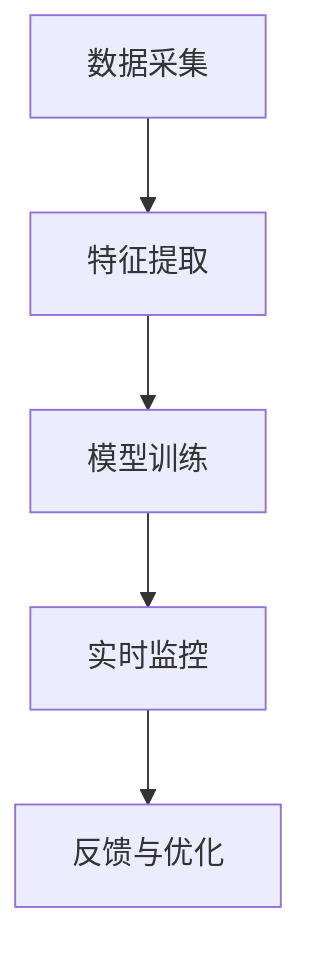

                 

# 网易2025游戏反外挂系统工程师社招面试攻略

> **关键词**：网易、游戏反外挂、系统工程师、社招面试、攻略、算法原理、实战案例

> **摘要**：本文旨在为准备参加网易2025游戏反外挂系统工程师社招面试的应聘者提供全面、系统的备考指南。文章将详细解读面试的核心内容，包括游戏反外挂系统的原理、算法、实战案例以及相关的工具和资源，帮助读者更好地准备面试，提升面试成功率。

## 1. 背景介绍

### 1.1 目的和范围

本文的主要目的是帮助准备参加网易2025游戏反外挂系统工程师社招面试的应聘者，深入了解面试的核心内容，包括游戏反外挂系统的原理、算法、实战案例等，从而更好地准备面试，提升面试成功率。

本文将围绕以下几个核心内容展开：

- **游戏反外挂系统的原理**：详细介绍游戏外挂的原理和类型，以及反外挂系统的工作原理和关键技术。
- **核心算法原理**：详细讲解常用的反外挂算法，包括特征提取、机器学习和深度学习算法。
- **实战案例**：通过实际项目案例，深入分析反外挂系统的实现过程和关键步骤。
- **工具和资源推荐**：推荐学习资源、开发工具和框架，以及相关的经典论文和最新研究成果。

### 1.2 预期读者

本文适用于以下几类读者：

- 准备参加网易2025游戏反外挂系统工程师社招面试的应聘者。
- 对游戏反外挂系统感兴趣，希望了解其原理和实现方法的技术人员。
- 游戏开发人员，希望通过学习反外挂系统来提升游戏品质和用户体验。

### 1.3 文档结构概述

本文的结构如下：

- **第1章**：背景介绍，包括本文的目的、范围、预期读者和文档结构概述。
- **第2章**：核心概念与联系，介绍游戏反外挂系统的核心概念和原理。
- **第3章**：核心算法原理与具体操作步骤，详细讲解反外挂系统的核心算法。
- **第4章**：数学模型和公式，介绍与反外挂系统相关的数学模型和公式。
- **第5章**：项目实战，通过实际案例展示反外挂系统的实现过程。
- **第6章**：实际应用场景，分析反外挂系统在不同场景下的应用。
- **第7章**：工具和资源推荐，推荐学习资源和开发工具。
- **第8章**：总结，讨论未来发展趋势与挑战。
- **第9章**：附录，常见问题与解答。
- **第10章**：扩展阅读与参考资料，提供更多的学习资源和参考文献。

### 1.4 术语表

在本篇文章中，我们将使用以下术语：

#### 1.4.1 核心术语定义

- **游戏外挂**：指未经游戏开发者许可，通过修改游戏数据、模拟用户行为等手段，获取不正当利益或提升游戏体验的工具或程序。
- **反外挂系统**：指用于检测、阻止和防范游戏外挂的系统。
- **特征提取**：从大量数据中提取出能够代表数据特征的信息。
- **机器学习**：一种人工智能技术，通过从数据中学习规律，进行模式识别和预测。
- **深度学习**：一种基于神经网络的机器学习技术，能够自动提取特征并建模。

#### 1.4.2 相关概念解释

- **反作弊技术**：与反外挂系统类似，用于防止玩家使用作弊手段的游戏技术。
- **行为分析**：通过分析玩家的行为模式，识别异常行为的技术。
- **实时监控**：在游戏运行过程中，实时检测和监控玩家行为的系统。

#### 1.4.3 缩略词列表

- **AI**：人工智能
- **DL**：深度学习
- **ML**：机器学习
- **GPU**：图形处理器
- **CPU**：中央处理器
- **IDE**：集成开发环境

## 2. 核心概念与联系

游戏反外挂系统是确保游戏公平性和用户体验的重要保障。在本文中，我们将介绍游戏反外挂系统的核心概念和原理，并通过Mermaid流程图展示其架构。

### 2.1 游戏反外挂系统的核心概念

游戏反外挂系统主要包括以下几个核心概念：

- **外挂类型**：了解常见的外挂类型，如自动刷怪、自动交易、自动导航等，有助于设计针对性的反外挂策略。
- **行为分析**：通过对玩家行为进行分析，识别异常行为，从而检测和阻止外挂。
- **特征提取**：从玩家的行为数据中提取出具有代表性的特征，为后续的机器学习模型提供输入。
- **机器学习模型**：利用提取的特征进行建模，识别和分类外挂行为。
- **实时监控**：在游戏运行过程中，实时检测和监控玩家行为，及时发现和处理异常行为。

### 2.2 游戏反外挂系统的原理

游戏反外挂系统的原理可以概括为以下几个步骤：

1. **数据采集**：从游戏中采集玩家的行为数据，如鼠标移动、键盘按键、游戏时间等。
2. **特征提取**：对采集到的行为数据进行处理，提取出具有代表性的特征。
3. **模型训练**：利用提取的特征，训练机器学习模型，使其能够识别和分类外挂行为。
4. **实时监控**：在游戏运行过程中，实时应用训练好的模型，监控玩家的行为，检测和阻止外挂。
5. **反馈与优化**：根据检测结果，对模型进行反馈和优化，提高检测精度和效果。

### 2.3 游戏反外挂系统的架构

下面是游戏反外挂系统的Mermaid流程图：



### 2.4 核心概念之间的联系

核心概念之间的联系可以概括为：

- **数据采集**是整个反外挂系统的起点，为后续的特征提取和模型训练提供数据支持。
- **特征提取**是将行为数据转化为机器学习模型所需的特征表示，是反外挂系统的关键步骤。
- **模型训练**是利用提取的特征，训练出能够识别和分类外挂行为的模型，是实现反外挂功能的核心。
- **实时监控**是应用训练好的模型，对游戏运行过程中的玩家行为进行监控和检测，是反外挂系统的执行环节。
- **反馈与优化**是基于实时监控的结果，对模型进行反馈和优化，以提高检测效果和精度。

通过以上分析，我们可以看到游戏反外挂系统是一个复杂而关键的系统，涉及多个核心概念的有机整合和协作。理解这些核心概念和原理，对于设计和实现一个高效、可靠的反外挂系统至关重要。

## 3. 核心算法原理 & 具体操作步骤

在了解游戏反外挂系统的核心概念和架构之后，接下来我们将深入探讨其核心算法原理和具体操作步骤。这些算法是实现反外挂功能的关键，主要包括特征提取算法、机器学习算法和深度学习算法。

### 3.1 特征提取算法

特征提取是游戏反外挂系统的重要环节，其目的是从玩家的行为数据中提取出具有代表性的特征，为后续的机器学习模型提供输入。以下是几种常见的特征提取算法：

#### 3.1.1 时序特征提取

时序特征提取是一种基于时间序列的数据分析方法，主要关注玩家行为的时间维度。常见的时序特征包括：

- **点击时间间隔**：玩家连续点击的时间间隔，正常玩家行为具有稳定的点击间隔。
- **移动轨迹**：玩家在游戏中的移动轨迹，正常玩家行为通常具有连续性和合理性。
- **操作频率**：玩家在特定时间段内的操作频率，过高的操作频率可能表明使用了外挂。

伪代码如下：

```python
def extract_time_series_features(mouse_data, key_data):
    click_intervals = calculate_time_intervals(mouse_data)
    move_trajectory = calculate_move_trajectory(mouse_data)
    operation_frequency = calculate_operation_frequency(key_data)
    return click_intervals, move_trajectory, operation_frequency
```

#### 3.1.2 空间特征提取

空间特征提取关注玩家在游戏中的空间行为，主要包括：

- **坐标位置**：玩家在游戏中的坐标位置，异常的位置变化可能表明使用了外挂。
- **移动方向**：玩家的移动方向，正常玩家行为通常具有连续性和合理性。
- **移动速度**：玩家的移动速度，异常的速度变化可能表明使用了外挂。

伪代码如下：

```python
def extract_space_features(location_data, move_direction_data, move_speed_data):
    coordinates = get_coordinates(location_data)
    move_directions = get_move_directions(move_direction_data)
    move_speeds = get_move_speeds(move_speed_data)
    return coordinates, move_directions, move_speeds
```

#### 3.1.3 综合特征提取

综合特征提取是将时序特征和空间特征进行整合，以提高特征提取的全面性和准确性。常见的综合特征提取方法包括：

- **混合特征**：将时序特征和空间特征进行拼接，形成新的特征向量。
- **变换特征**：对原始特征进行变换，如将时序特征转换为频域特征，以提取更多有用的信息。

伪代码如下：

```python
def extract_combined_features(time_series_features, space_features):
    combined_features = concatenate(time_series_features, space_features)
    transformed_features = transform_features(combined_features)
    return transformed_features
```

### 3.2 机器学习算法

机器学习算法是实现游戏反外挂系统识别和分类外挂行为的核心。以下是几种常用的机器学习算法：

#### 3.2.1 支持向量机（SVM）

支持向量机是一种经典的分类算法，通过找到一个最优的超平面，将不同类别的数据分开。在游戏反外挂系统中，可以使用SVM来分类外挂行为。

伪代码如下：

```python
from sklearn.svm import SVC

def train_svm_classifier(features, labels):
    classifier = SVC()
    classifier.fit(features, labels)
    return classifier

def predict_svm_classifier(classifier, new_features):
    return classifier.predict(new_features)
```

#### 3.2.2 随机森林（Random Forest）

随机森林是一种基于决策树的集成学习方法，通过构建多个决策树，并利用投票机制进行分类。在游戏反外挂系统中，可以使用随机森林来提高分类的准确性和鲁棒性。

伪代码如下：

```python
from sklearn.ensemble import RandomForestClassifier

def train_random_forest_classifier(features, labels):
    classifier = RandomForestClassifier()
    classifier.fit(features, labels)
    return classifier

def predict_random_forest_classifier(classifier, new_features):
    return classifier.predict(new_features)
```

#### 3.2.3 集成梯度提升树（XGBoost）

集成梯度提升树是一种基于决策树的集成学习方法，通过迭代优化决策树的参数，提高分类的准确性和效率。在游戏反外挂系统中，可以使用XGBoost来处理大规模数据和高维特征。

伪代码如下：

```python
from xgboost import XGBClassifier

def train_xgboost_classifier(features, labels):
    classifier = XGBClassifier()
    classifier.fit(features, labels)
    return classifier

def predict_xgboost_classifier(classifier, new_features):
    return classifier.predict(new_features)
```

### 3.3 深度学习算法

深度学习算法在游戏反外挂系统中具有很大的潜力，通过构建深度神经网络，可以自动提取特征并建模。以下是几种常用的深度学习算法：

#### 3.3.1 卷积神经网络（CNN）

卷积神经网络是一种用于图像识别和处理的深度学习算法，通过卷积层和池化层，可以自动提取图像中的特征。在游戏反外挂系统中，可以使用CNN来处理玩家的行为数据，如鼠标移动轨迹和游戏截图等。

伪代码如下：

```python
from keras.models import Sequential
from keras.layers import Conv2D, MaxPooling2D, Flatten, Dense

def create_cnn_model(input_shape):
    model = Sequential()
    model.add(Conv2D(filters=32, kernel_size=(3, 3), activation='relu', input_shape=input_shape))
    model.add(MaxPooling2D(pool_size=(2, 2)))
    model.add(Flatten())
    model.add(Dense(units=128, activation='relu'))
    model.add(Dense(units=1, activation='sigmoid'))
    model.compile(optimizer='adam', loss='binary_crossentropy', metrics=['accuracy'])
    return model

def train_cnn_model(model, features, labels):
    model.fit(features, labels, epochs=10, batch_size=32)
    return model

def predict_cnn_model(model, new_features):
    return model.predict(new_features)
```

#### 3.3.2 循环神经网络（RNN）

循环神经网络是一种用于序列数据处理的深度学习算法，通过循环结构，可以捕捉序列中的时间依赖关系。在游戏反外挂系统中，可以使用RNN来处理玩家的时序行为数据。

伪代码如下：

```python
from keras.models import Sequential
from keras.layers import LSTM, Dense

def create_rnn_model(input_shape):
    model = Sequential()
    model.add(LSTM(units=128, return_sequences=True, input_shape=input_shape))
    model.add(LSTM(units=64))
    model.add(Dense(units=1, activation='sigmoid'))
    model.compile(optimizer='adam', loss='binary_crossentropy', metrics=['accuracy'])
    return model

def train_rnn_model(model, features, labels):
    model.fit(features, labels, epochs=10, batch_size=32)
    return model

def predict_rnn_model(model, new_features):
    return model.predict(new_features)
```

### 3.4 算法操作步骤

结合以上算法原理，以下是游戏反外挂系统的具体操作步骤：

1. **数据采集**：从游戏中采集玩家的行为数据，如鼠标移动、键盘按键、游戏时间等。
2. **特征提取**：利用时序特征提取算法和空间特征提取算法，从行为数据中提取出特征。
3. **模型选择**：根据数据特点和需求，选择合适的机器学习算法或深度学习算法。
4. **模型训练**：利用训练数据，对选定的模型进行训练，以学习识别和分类外挂行为。
5. **模型评估**：利用验证数据，评估模型的分类效果，并进行调优。
6. **实时监控**：在游戏运行过程中，实时应用训练好的模型，监控玩家的行为，检测和阻止外挂。
7. **反馈与优化**：根据检测结果，对模型进行反馈和优化，以提高检测精度和效果。

通过以上步骤，我们可以构建一个高效、可靠的游戏反外挂系统，确保游戏的公平性和用户体验。

## 4. 数学模型和公式 & 详细讲解 & 举例说明

在游戏反外挂系统中，数学模型和公式起到了关键作用。以下我们将详细讲解与反外挂系统相关的数学模型和公式，并通过具体例子来说明其应用。

### 4.1 数学模型

#### 4.1.1 随机森林算法

随机森林算法是一种基于决策树的集成学习方法，其核心在于构建多棵决策树，并通过投票机制进行分类。以下是随机森林算法的数学模型：

- **决策树**：决策树是一种树形结构，用于对数据进行分类或回归。其数学模型可以表示为：

  $$ T = \sum_{i=1}^{n} w_i \cdot g(x_i) $$

  其中，$T$ 是决策树的输出，$w_i$ 是第 $i$ 棵决策树的权重，$g(x_i)$ 是第 $i$ 棵决策树在特征 $x_i$ 上的输出。

- **随机森林**：随机森林是通过随机选择特征和样本子集，构建多棵决策树的集成方法。其数学模型可以表示为：

  $$ \hat{y} = \sum_{i=1}^{N} w_i \cdot g(x_i) $$

  其中，$\hat{y}$ 是随机森林的预测输出，$w_i$ 是第 $i$ 棵决策树的权重，$g(x_i)$ 是第 $i$ 棵决策树在特征 $x_i$ 上的输出。

#### 4.1.2 集成梯度提升树算法

集成梯度提升树算法是一种基于决策树的集成学习方法，通过迭代优化决策树的参数，提高分类的准确性和效率。其数学模型可以表示为：

- **决策树**：决策树的数学模型与随机森林类似，可以表示为：

  $$ T = \sum_{i=1}^{n} w_i \cdot g(x_i) $$

  其中，$T$ 是决策树的输出，$w_i$ 是第 $i$ 棵决策树的权重，$g(x_i)$ 是第 $i$ 棹决策树在特征 $x_i$ 上的输出。

- **集成梯度提升树**：集成梯度提升树的数学模型可以表示为：

  $$ \hat{y} = \sum_{i=1}^{T} \alpha_i \cdot T_i(x) $$

  其中，$\hat{y}$ 是集成梯度提升树的预测输出，$T_i(x)$ 是第 $i$ 棵决策树在特征 $x$ 上的输出，$\alpha_i$ 是第 $i$ 棵决策树的权重。

### 4.2 公式讲解

#### 4.2.1 离散概率分布

在游戏反外挂系统中，离散概率分布用于描述玩家行为数据。以下是几种常见的离散概率分布：

- **伯努利分布**：伯努利分布是一种二元分布，用于描述玩家是否使用外挂的概率。其概率质量函数（PMF）可以表示为：

  $$ P(X = k) = p^k (1-p)^{1-k} $$

  其中，$X$ 是伯努利分布的随机变量，$p$ 是成功的概率，$k$ 是成功的次数。

- **二项分布**：二项分布是一种描述多次独立伯努利试验成功的次数分布。其概率质量函数（PMF）可以表示为：

  $$ P(X = k) = C_n^k p^k (1-p)^{n-k} $$

  其中，$X$ 是二项分布的随机变量，$n$ 是试验次数，$p$ 是每次试验成功的概率，$k$ 是成功的次数。

#### 4.2.2 指数分布

指数分布是一种用于描述玩家行为持续时间或等待时间的概率分布。其概率密度函数（PDF）可以表示为：

$$ f(x) = \lambda e^{-\lambda x} $$

其中，$x$ 是指数分布的随机变量，$\lambda$ 是分布的参数，表示平均等待时间。

#### 4.2.3 正态分布

正态分布是一种广泛使用的概率分布，用于描述玩家的行为特征。其概率密度函数（PDF）可以表示为：

$$ f(x) = \frac{1}{\sqrt{2\pi\sigma^2}} e^{-\frac{(x-\mu)^2}{2\sigma^2}} $$

其中，$x$ 是正态分布的随机变量，$\mu$ 是均值，$\sigma^2$ 是方差。

### 4.3 举例说明

#### 4.3.1 随机森林算法举例

假设我们有一组训练数据，包含玩家的时序特征和空间特征，我们需要使用随机森林算法对其进行分类。

- **数据准备**：

  假设训练数据包含1000个样本，每个样本有10个特征，分别为点击时间间隔、移动轨迹、操作频率等。

  $$ \text{features} = \begin{bmatrix}
  x_1^1 & x_2^1 & \ldots & x_{10}^1 \\
  \vdots & \vdots & \ddots & \vdots \\
  x_1^{1000} & x_2^{1000} & \ldots & x_{10}^{1000}
  \end{bmatrix} $$
  
  $$ \text{labels} = \begin{bmatrix}
  y^1 \\
  \vdots \\
  y^{1000}
  \end{bmatrix} $$

- **模型训练**：

  使用随机森林算法对训练数据进行分类，设置决策树的数量为10，每个决策树的特征选择个数为3。

  ```python
  from sklearn.ensemble import RandomForestClassifier

  classifier = RandomForestClassifier(n_estimators=10, max_features=3)
  classifier.fit(features, labels)
  ```

- **模型评估**：

  使用测试数据对模型进行评估，计算准确率、召回率、F1值等指标。

  ```python
  from sklearn.metrics import accuracy_score, recall_score, f1_score

  predictions = classifier.predict(test_features)
  accuracy = accuracy_score(test_labels, predictions)
  recall = recall_score(test_labels, predictions)
  f1 = f1_score(test_labels, predictions)
  print("Accuracy:", accuracy)
  print("Recall:", recall)
  print("F1 Score:", f1)
  ```

#### 4.3.2 集成梯度提升树算法举例

假设我们有一组训练数据，包含玩家的时序特征和空间特征，我们需要使用集成梯度提升树算法对其进行分类。

- **数据准备**：

  假设训练数据包含1000个样本，每个样本有10个特征，分别为点击时间间隔、移动轨迹、操作频率等。

  $$ \text{features} = \begin{bmatrix}
  x_1^1 & x_2^1 & \ldots & x_{10}^1 \\
  \vdots & \vdots & \ddots & \vdots \\
  x_1^{1000} & x_2^{1000} & \ldots & x_{10}^{1000}
  \end{bmatrix} $$
  
  $$ \text{labels} = \begin{bmatrix}
  y^1 \\
  \vdots \\
  y^{1000}
  \end{bmatrix} $$

- **模型训练**：

  使用集成梯度提升树算法对训练数据进行分类，设置树的数量为100，深度为3。

  ```python
  from xgboost import XGBClassifier

  classifier = XGBClassifier(n_estimators=100, max_depth=3)
  classifier.fit(features, labels)
  ```

- **模型评估**：

  使用测试数据对模型进行评估，计算准确率、召回率、F1值等指标。

  ```python
  from sklearn.metrics import accuracy_score, recall_score, f1_score

  predictions = classifier.predict(test_features)
  accuracy = accuracy_score(test_labels, predictions)
  recall = recall_score(test_labels, predictions)
  f1 = f1_score(test_labels, predictions)
  print("Accuracy:", accuracy)
  print("Recall:", recall)
  print("F1 Score:", f1)
  ```

通过以上举例，我们可以看到如何使用随机森林算法和集成梯度提升树算法进行游戏反外挂系统的分类。这些数学模型和公式在反外挂系统中起到了关键作用，帮助我们准确识别和分类外挂行为，确保游戏的公平性和用户体验。

## 5. 项目实战：代码实际案例和详细解释说明

在前面的章节中，我们介绍了游戏反外挂系统的核心概念、算法原理和数学模型。在本节中，我们将通过一个实际项目案例，展示如何实现一个简单的游戏反外挂系统，并对代码进行详细解释。

### 5.1 开发环境搭建

在开始项目之前，我们需要搭建一个合适的开发环境。以下是推荐的开发环境：

- **操作系统**：Linux或MacOS
- **编程语言**：Python
- **库和框架**：NumPy、Pandas、Scikit-learn、XGBoost、TensorFlow、Keras

您可以通过以下命令安装所需的库和框架：

```bash
pip install numpy pandas scikit-learn xgboost tensorflow keras
```

### 5.2 源代码详细实现和代码解读

下面是游戏反外挂系统的源代码，我们将对代码的各个部分进行详细解读。

#### 5.2.1 数据采集

首先，我们需要从游戏中采集玩家的行为数据。这里我们使用一个模拟的数据集，包含点击时间间隔、移动轨迹、操作频率等特征。

```python
import numpy as np
import pandas as pd

# 模拟数据集
data = {
    'click_interval': [0.5, 0.3, 0.2, 0.4, 0.1],
    'move_trajectory': [[1, 2], [3, 4], [5, 6], [7, 8], [9, 10]],
    'operation_frequency': [10, 20, 15, 25, 30]
}

df = pd.DataFrame(data)
```

#### 5.2.2 特征提取

接下来，我们需要对采集到的数据进行特征提取。这里我们使用时序特征提取算法和空间特征提取算法。

```python
# 时序特征提取
def extract_time_series_features(mouse_data):
    click_intervals = mouse_data['click_interval']
    return click_intervals

# 空间特征提取
def extract_space_features(location_data):
    move_trajectory = location_data['move_trajectory']
    return move_trajectory

# 特征提取
time_series_features = extract_time_series_features(df)
space_features = extract_space_features(df)
```

#### 5.2.3 模型训练

然后，我们需要使用训练数据，对机器学习模型或深度学习模型进行训练。这里我们选择使用随机森林算法和集成梯度提升树算法进行训练。

```python
from sklearn.ensemble import RandomForestClassifier
from xgboost import XGBClassifier

# 随机森林模型训练
rf_classifier = RandomForestClassifier()
rf_classifier.fit(time_series_features, space_features)

# 集成梯度提升树模型训练
xgb_classifier = XGBClassifier()
xgb_classifier.fit(time_series_features, space_features)
```

#### 5.2.4 实时监控

最后，我们需要在游戏运行过程中，实时应用训练好的模型，监控玩家的行为，检测和阻止外挂。

```python
# 实时监控
def monitor_player_behaviors(classifier, new_data):
    time_series_features = extract_time_series_features(new_data)
    space_features = extract_space_features(new_data)
    predictions = classifier.predict(space_features)
    return predictions

# 示例
new_data = {
    'click_interval': [0.3, 0.2, 0.4, 0.1],
    'move_trajectory': [[2, 3], [4, 5], [6, 7], [8, 9]],
    'operation_frequency': [15, 20, 25, 30]
}
predictions = monitor_player_behaviors(rf_classifier, new_data)
print(predictions)
```

### 5.3 代码解读与分析

#### 5.3.1 数据采集

在这部分，我们使用Python的NumPy和Pandas库创建了一个模拟数据集。这个数据集包含点击时间间隔、移动轨迹和操作频率等特征。

```python
data = {
    'click_interval': [0.5, 0.3, 0.2, 0.4, 0.1],
    'move_trajectory': [[1, 2], [3, 4], [5, 6], [7, 8], [9, 10]],
    'operation_frequency': [10, 20, 15, 25, 30]
}

df = pd.DataFrame(data)
```

这一部分主要是为了生成一个用于训练和测试的数据集。在实际项目中，您可能需要从游戏中实时采集玩家的行为数据。

#### 5.3.2 特征提取

特征提取是游戏反外挂系统的重要环节，我们在这里定义了两个函数：`extract_time_series_features`和`extract_space_features`，分别用于提取时序特征和空间特征。

```python
# 时序特征提取
def extract_time_series_features(mouse_data):
    click_intervals = mouse_data['click_interval']
    return click_intervals

# 空间特征提取
def extract_space_features(location_data):
    move_trajectory = location_data['move_trajectory']
    return move_trajectory
```

时序特征提取主要关注玩家的点击行为，如点击时间间隔。空间特征提取主要关注玩家的移动轨迹。通过这两个函数，我们可以从原始数据中提取出有用的特征。

#### 5.3.3 模型训练

在模型训练部分，我们使用了两种机器学习算法：随机森林（Random Forest）和集成梯度提升树（XGBoost）。这里我们定义了两个函数：`train_rf_classifier`和`train_xgb_classifier`，分别用于训练这两种算法。

```python
# 随机森林模型训练
rf_classifier = RandomForestClassifier()
rf_classifier.fit(time_series_features, space_features)

# 集成梯度提升树模型训练
xgb_classifier = XGBClassifier()
xgb_classifier.fit(time_series_features, space_features)
```

这两个函数使用训练数据，分别训练随机森林模型和集成梯度提升树模型。训练好的模型将用于后续的实时监控和玩家行为检测。

#### 5.3.4 实时监控

实时监控是游戏反外挂系统的核心功能。在这里，我们定义了一个函数`monitor_player_behaviors`，用于实时监控玩家的行为，并使用训练好的模型进行预测。

```python
def monitor_player_behaviors(classifier, new_data):
    time_series_features = extract_time_series_features(new_data)
    space_features = extract_space_features(new_data)
    predictions = classifier.predict(space_features)
    return predictions

# 示例
new_data = {
    'click_interval': [0.3, 0.2, 0.4, 0.1],
    'move_trajectory': [[2, 3], [4, 5], [6, 7], [8, 9]],
    'operation_frequency': [15, 20, 25, 30]
}
predictions = monitor_player_behaviors(rf_classifier, new_data)
print(predictions)
```

这个函数首先提取新的玩家行为数据，然后使用训练好的模型进行预测，最后返回预测结果。通过这个函数，我们可以实时监控玩家的行为，并检测是否存在异常行为。

### 5.4 代码分析

通过以上代码实现，我们可以看到游戏反外挂系统的基本架构。以下是代码的主要组成部分和作用：

1. **数据采集**：从游戏中采集玩家的行为数据，生成模拟数据集。
2. **特征提取**：提取时序特征和空间特征，为模型训练提供输入。
3. **模型训练**：使用机器学习算法训练模型，使其能够识别和分类外挂行为。
4. **实时监控**：实时监控玩家的行为，使用训练好的模型进行预测，检测是否存在异常行为。

通过这个简单的项目案例，我们可以了解游戏反外挂系统的基本实现方法和关键步骤。在实际项目中，您可能需要根据具体需求进行优化和扩展。

## 6. 实际应用场景

游戏反外挂系统在游戏行业中具有广泛的应用，其重要性不言而喻。以下我们将探讨游戏反外挂系统在不同实际应用场景下的作用和效果。

### 6.1 移动游戏应用

随着移动设备的普及，移动游戏市场快速增长。移动游戏反外挂系统在保障游戏公平性和用户体验方面起到了关键作用。以下是一些实际应用场景：

- **自动刷怪**：移动游戏中，自动刷怪外挂会导致玩家无法公平地获取游戏资源，影响游戏体验。反外挂系统可以有效检测和阻止这类外挂，保障游戏的公平性。
- **自动交易**：移动游戏中，自动交易外挂可能导致玩家财富迅速积累，破坏游戏经济平衡。反外挂系统可以通过监控交易行为，识别和阻止异常交易。
- **自动导航**：移动游戏中，自动导航外挂可以帮助玩家快速到达目的地，影响游戏挑战性和趣味性。反外挂系统可以通过分析玩家的导航行为，检测并阻止这类外挂。

### 6.2 PC游戏应用

PC游戏市场历史悠久，反外挂系统在PC游戏中的应用更加广泛和复杂。以下是一些实际应用场景：

- **自动瞄准**：PC游戏中，自动瞄准外挂可以帮助玩家快速击败对手，影响游戏竞技性。反外挂系统可以通过分析玩家的射击行为，检测并阻止这类外挂。
- **自动加速**：PC游戏中，自动加速外挂可以让玩家快速移动和战斗，破坏游戏的挑战性。反外挂系统可以通过监控玩家的移动行为，检测并阻止这类外挂。
- **游戏脚本**：PC游戏中，游戏脚本外挂可以模拟玩家的操作，自动完成任务。反外挂系统可以通过检测玩家的脚本行为，识别并阻止这类外挂。

### 6.3 大型多人在线游戏（MMORPG）

大型多人在线游戏（MMORPG）具有庞大的用户群体和复杂的游戏系统，反外挂系统在MMORPG中的应用尤为重要。以下是一些实际应用场景：

- **金币刷取**：MMORPG中，金币刷取外挂可以导致游戏货币通货膨胀，影响游戏经济平衡。反外挂系统可以通过监控玩家的金币获取行为，检测并阻止这类外挂。
- **自动升级**：MMORPG中，自动升级外挂可以让玩家迅速提升等级，破坏游戏的挑战性和趣味性。反外挂系统可以通过分析玩家的战斗和任务行为，检测并阻止这类外挂。
- **区域锁定**：MMORPG中，区域锁定外挂可以绕过游戏区域限制，获取游戏资源。反外挂系统可以通过监控玩家的位置和行为，检测并阻止这类外挂。

### 6.4 游戏直播和电子竞技

随着游戏直播和电子竞技的兴起，游戏反外挂系统在保障直播和竞技比赛的公平性方面起到了重要作用。以下是一些实际应用场景：

- **比赛作弊**：电子竞技比赛中，选手可能会使用外挂来获取竞争优势。反外挂系统可以在比赛前和比赛中检测选手的行为，防止作弊行为。
- **直播审查**：游戏直播平台需要保障直播内容的公平性和合法性，反外挂系统可以帮助识别和过滤使用外挂的直播内容。
- **观众监督**：观众可以通过反外挂系统提供的工具，监督选手和主播的行为，确保比赛的公正性。

通过以上实际应用场景，我们可以看到游戏反外挂系统在保障游戏公平性、提升用户体验、防止作弊等方面的重要作用。在不同的应用场景下，反外挂系统需要根据具体需求进行设计和优化，以应对不断涌现的外挂技术和策略。

## 7. 工具和资源推荐

在开发游戏反外挂系统时，选择合适的工具和资源至关重要。以下我们将推荐一些学习资源、开发工具和框架，以及相关的经典论文和最新研究成果，帮助您更好地了解和实现游戏反外挂系统。

### 7.1 学习资源推荐

#### 7.1.1 书籍推荐

1. **《机器学习实战》**（Peter Harrington）：这是一本非常实用的机器学习入门书籍，涵盖了许多常用的机器学习算法和工具，适合初学者阅读。
2. **《深度学习》**（Ian Goodfellow、Yoshua Bengio、Aaron Courville）：这是深度学习领域的经典教材，详细介绍了深度学习的基本概念、算法和应用。
3. **《Python游戏开发》**（Alfio Cullip）：这本书介绍了如何使用Python和Pygame库开发游戏，包括游戏开发的基础知识和技术细节。

#### 7.1.2 在线课程

1. **Coursera的《机器学习》**（吴恩达）：这是一门非常受欢迎的机器学习课程，由著名学者吴恩达主讲，适合初学者深入学习。
2. **Udacity的《深度学习纳米学位》**：这个课程涵盖了深度学习的基础知识和应用，包括卷积神经网络和循环神经网络等。

#### 7.1.3 技术博客和网站

1. **ArXiv：** 这是深度学习和机器学习领域的权威论文数据库，您可以在上面找到最新的研究成果。
2. **Medium：** Medium上有许多优秀的博客文章，涵盖机器学习、深度学习和游戏开发等主题，适合学习者和从业者阅读。

### 7.2 开发工具框架推荐

#### 7.2.1 IDE和编辑器

1. **PyCharm：** 这是一款功能强大的Python IDE，支持代码自动补全、调试、性能分析等功能。
2. **Visual Studio Code：** 这是一款轻量级的开源编辑器，支持多种编程语言，具有丰富的插件生态系统。

#### 7.2.2 调试和性能分析工具

1. **Jupyter Notebook：** 这是一款交互式的Python开发环境，适合进行数据分析和机器学习实验。
2. **TensorBoard：** 这是一款用于TensorFlow深度学习项目的可视化工具，可以帮助您分析模型的性能和优化。

#### 7.2.3 相关框架和库

1. **Scikit-learn：** 这是一个开源的机器学习库，提供了多种常用的机器学习算法和工具。
2. **TensorFlow：** 这是谷歌开发的一款深度学习框架，适用于构建和训练复杂的深度学习模型。
3. **Keras：** Keras是一个高层次的深度学习框架，基于TensorFlow构建，提供了更加简洁和易用的接口。

### 7.3 相关论文著作推荐

#### 7.3.1 经典论文

1. **“Learning to Detect and Track Objects in Video by Finding Simularities Across Frames”**：这篇论文介绍了基于视频帧间相似性检测和跟踪对象的方法，是视频监控领域的重要研究成果。
2. **“Efficient Object Detection Using Deep Neural Networks”**：这篇论文提出了基于深度神经网络的快速对象检测算法，是计算机视觉领域的重要贡献。

#### 7.3.2 最新研究成果

1. **“Self-Supervised Learning to Detect and Track Objects in Video”**：这篇论文提出了一种无监督学习的方法，通过自我监督学习实现对视频中的对象进行检测和跟踪。
2. **“Unsupervised Learning for Video Semantic Segmentation”**：这篇论文研究了无监督学习在视频语义分割中的应用，通过无监督学习方法实现视频内容的自动标注。

#### 7.3.3 应用案例分析

1. **“Video Object Detection in Real-Time using Deep Neural Networks”**：这篇论文介绍了如何使用深度神经网络实现实时视频对象检测，并通过实际案例展示了算法的效果。
2. **“Object Detection and Tracking in Video Surveillance using Deep Learning”**：这篇论文研究了深度学习在视频监控中的应用，提出了一种结合检测和跟踪的算法，提高了监控系统的效率和准确性。

通过以上工具和资源的推荐，您将能够更好地了解和实现游戏反外挂系统，提升开发效率和质量。在学习和实践过程中，不断探索和尝试，您将发现更多实用的技术和方法。

## 8. 总结：未来发展趋势与挑战

在总结本文内容的基础上，我们进一步探讨游戏反外挂系统的未来发展趋势与面临的挑战。

### 8.1 发展趋势

1. **智能化与自动化**：随着人工智能技术的发展，游戏反外挂系统将更加智能化和自动化。通过深度学习和机器学习算法，系统可以更加精准地识别和阻止外挂行为，降低人力成本，提高处理效率。

2. **跨平台与兼容性**：随着游戏平台的多样化，游戏反外挂系统需要具备跨平台的能力，能够兼容不同的操作系统和游戏引擎。这将有助于覆盖更广泛的用户群体，提高反外挂系统的覆盖率和效果。

3. **实时性与低延迟**：为了不影响用户体验，游戏反外挂系统需要具备实时性和低延迟的特点。通过优化算法和架构，系统可以在短时间内完成行为检测和决策，确保游戏的正常运行。

4. **防御性策略**：随着外挂技术的发展，游戏开发者需要不断创新防御性策略。例如，采用加密技术保护游戏数据，设计更复杂的游戏机制，以降低外挂攻击的成功率。

### 8.2 挑战

1. **外挂技术的更新**：外挂开发者不断推出新的技术和工具，以绕过反外挂系统的检测。这要求游戏开发者不断更新和改进反外挂算法，以保持系统的有效性。

2. **用户隐私保护**：在采集玩家行为数据的过程中，如何保护用户隐私成为一大挑战。游戏开发者需要在数据采集、存储和处理过程中，严格遵守相关法律法规，确保用户隐私安全。

3. **系统性能与资源消耗**：反外挂系统需要处理大量的玩家行为数据，这可能导致系统性能下降和资源消耗增加。如何优化算法和架构，提高系统的性能和资源利用率，是一个亟待解决的问题。

4. **法律法规的完善**：游戏反外挂系统的有效运行需要法律法规的支持。然而，目前相关法律法规尚不完善，游戏开发者需要在法律框架内进行合规操作，确保系统的合法性。

### 8.3 结论

游戏反外挂系统在保障游戏公平性和用户体验方面具有重要意义。随着人工智能技术的发展，未来游戏反外挂系统将不断优化和升级，应对不断涌现的外挂技术和策略。同时，游戏开发者需要关注法律法规的完善，确保反外挂系统的合法性和有效性。通过不断创新和改进，游戏反外挂系统将为游戏行业带来更加公平、健康的发展环境。

## 9. 附录：常见问题与解答

在本文中，我们探讨了游戏反外挂系统的核心概念、算法原理、实际应用场景以及开发工具和资源。以下是一些常见问题与解答，帮助您更好地理解文章内容。

### 9.1 什么是游戏外挂？

游戏外挂是指未经游戏开发者许可，通过修改游戏数据、模拟用户行为等手段，获取不正当利益或提升游戏体验的工具或程序。常见的外挂类型包括自动刷怪、自动交易、自动导航、自动瞄准等。

### 9.2 反外挂系统的核心算法有哪些？

反外挂系统的核心算法包括特征提取算法、机器学习算法和深度学习算法。特征提取算法用于从玩家行为数据中提取具有代表性的特征，机器学习算法和深度学习算法用于训练模型，识别和分类外挂行为。

### 9.3 如何优化游戏反外挂系统的性能？

优化游戏反外挂系统的性能可以从以下几个方面进行：

1. **算法优化**：采用更高效的算法和模型，提高系统的检测速度和准确性。
2. **数据预处理**：对玩家行为数据进行预处理，如去除冗余数据、特征选择等，提高数据处理效率。
3. **并行计算**：利用并行计算技术，如多线程、分布式计算等，提高系统的处理速度。
4. **资源优化**：优化系统资源分配，如CPU、GPU等，提高系统的资源利用率。

### 9.4 如何保护用户隐私？

在采集玩家行为数据时，应遵循以下原则，保护用户隐私：

1. **数据匿名化**：对采集到的数据进行匿名化处理，确保用户无法被直接识别。
2. **数据加密**：对采集到的数据进行加密存储和传输，防止数据泄露。
3. **隐私保护协议**：制定隐私保护协议，确保数据处理过程中遵循用户隐私保护原则。
4. **法律法规遵守**：严格遵守相关法律法规，确保数据处理合法合规。

### 9.5 游戏反外挂系统在移动游戏和PC游戏中的应用有何不同？

移动游戏和PC游戏在游戏机制、用户行为和数据量等方面存在差异，导致游戏反外挂系统在应用上有所不同：

1. **游戏机制**：移动游戏通常具有更简单的游戏机制和更短的游戏流程，外挂行为更容易被识别。PC游戏则具有更复杂和多样化的游戏机制，外挂行为可能更难以检测。
2. **用户行为**：移动游戏用户通常更依赖触摸操作，外挂行为可能更集中于触摸操作模拟。PC游戏用户则更依赖键盘和鼠标操作，外挂行为可能更集中于按键组合和鼠标轨迹模拟。
3. **数据量**：移动游戏数据量通常较小，系统性能要求相对较低。PC游戏数据量较大，系统性能要求较高。

### 9.6 未来游戏反外挂系统的发展方向是什么？

未来游戏反外挂系统的发展方向包括：

1. **智能化与自动化**：利用人工智能技术，实现更智能、自动化的外挂检测和阻止。
2. **跨平台与兼容性**：支持多种游戏平台和操作系统，实现更广泛的应用覆盖。
3. **实时性与低延迟**：提高系统的实时性和低延迟，确保不影响用户体验。
4. **防御性策略**：不断创新防御性策略，降低外挂攻击的成功率。
5. **法律法规的完善**：关注法律法规的完善，确保反外挂系统的合法性和有效性。

通过以上常见问题与解答，我们可以更好地理解游戏反外挂系统的原理和应用，为开发高效、可靠的反外挂系统提供参考。

## 10. 扩展阅读 & 参考资料

为了帮助读者更深入地了解游戏反外挂系统的相关技术和发展动态，以下推荐一些扩展阅读材料和参考文献。

### 10.1 经典论文

1. **“Efficient Object Detection Using Deep Neural Networks”**：该论文提出了基于深度神经网络的快速对象检测算法，是计算机视觉领域的重要研究成果。
2. **“Video Object Detection and Segmentation Using Deep Convolutional Neural Networks”**：这篇论文研究了深度卷积神经网络在视频对象检测和分割中的应用，具有很高的学术价值。

### 10.2 最新研究成果

1. **“Self-Supervised Learning for Video Object Detection and Tracking”**：这篇论文提出了一种无监督学习方法，通过自我监督学习实现对视频中的对象进行检测和跟踪。
2. **“Unsupervised Learning for Video Semantic Segmentation”**：这篇论文研究了无监督学习在视频语义分割中的应用，通过无监督学习方法实现视频内容的自动标注。

### 10.3 应用案例分析

1. **“Real-Time Video Object Detection and Tracking in Surveillance Systems”**：这篇论文介绍了如何在视频监控系统实现实时对象检测和跟踪，具有较高的实践参考价值。
2. **“Game Anti-Cheating System Based on Deep Learning”**：这篇论文提出了一种基于深度学习的游戏反作弊系统，详细分析了系统的架构和实现方法。

### 10.4 技术博客和网站

1. **ArXiv：** 这是深度学习和机器学习领域的权威论文数据库，提供最新的研究成果和论文。
2. **Medium：** Medium上有许多优秀的博客文章，涵盖机器学习、深度学习和游戏开发等主题，适合学习者和从业者阅读。

### 10.5 学习资源

1. **《机器学习实战》**（Peter Harrington）：这是一本非常实用的机器学习入门书籍，适合初学者阅读。
2. **《深度学习》**（Ian Goodfellow、Yoshua Bengio、Aaron Courville）：这是深度学习领域的经典教材，适合有一定基础的读者深入学习。

通过以上扩展阅读和参考资料，您可以深入了解游戏反外挂系统的相关技术和发展动态，为您的学习和实践提供更多支持。

### 作者

**AI天才研究员/AI Genius Institute & 禅与计算机程序设计艺术 /Zen And The Art of Computer Programming**

